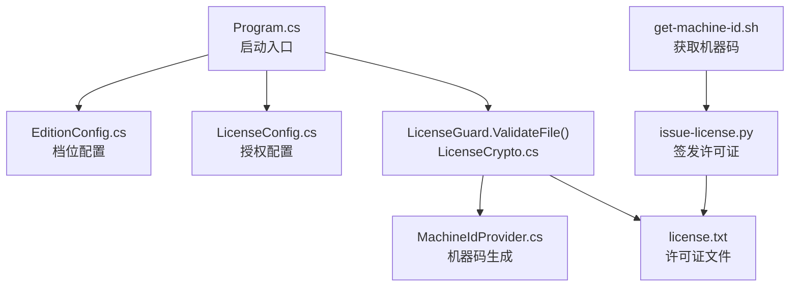
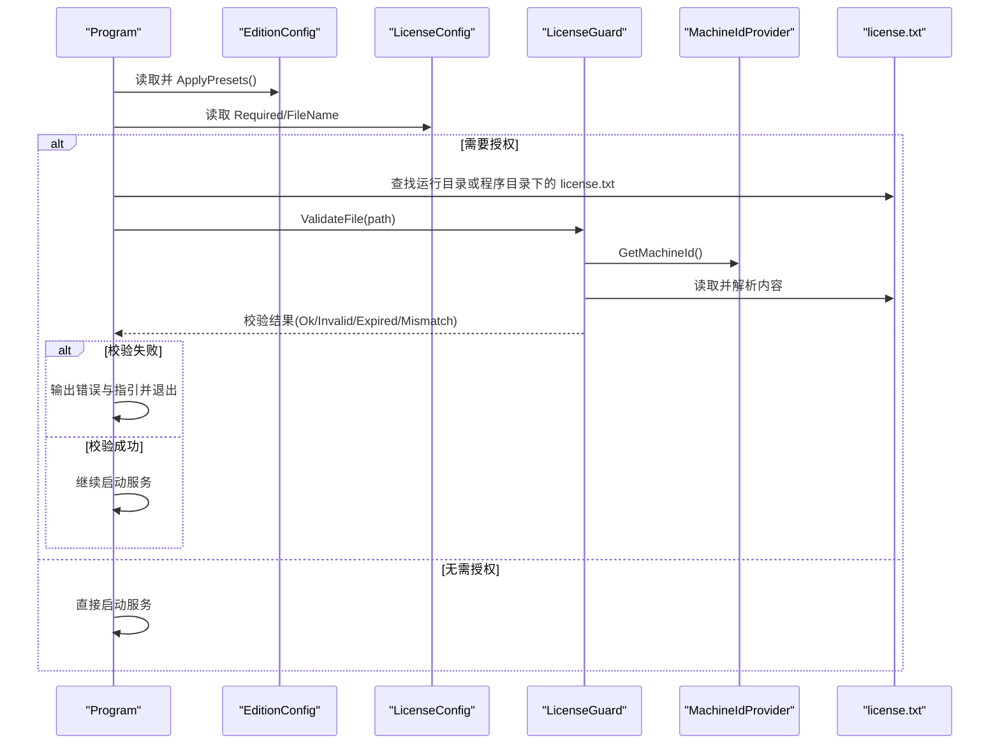
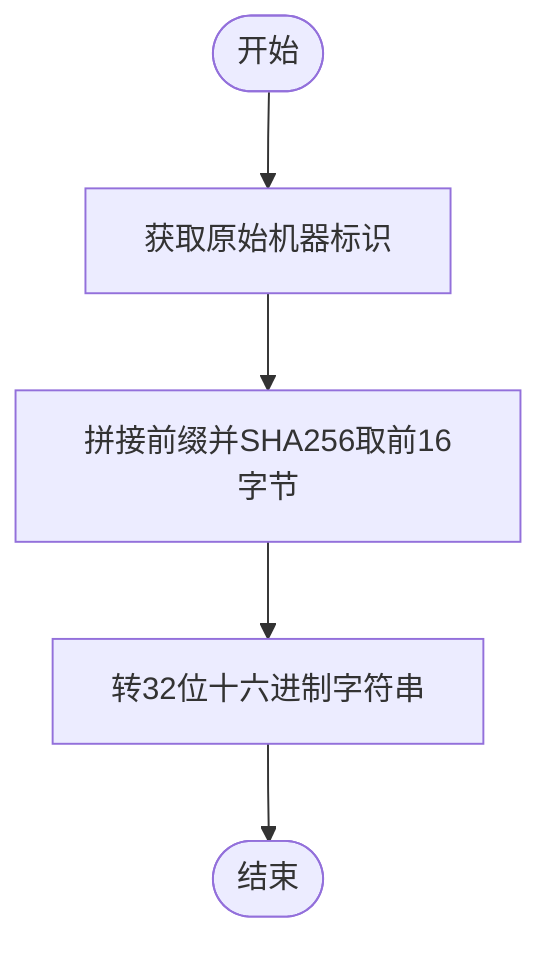
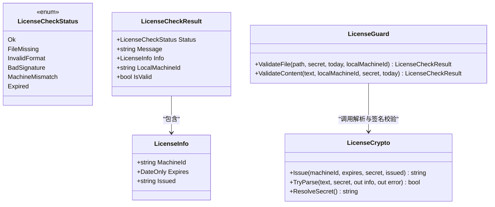
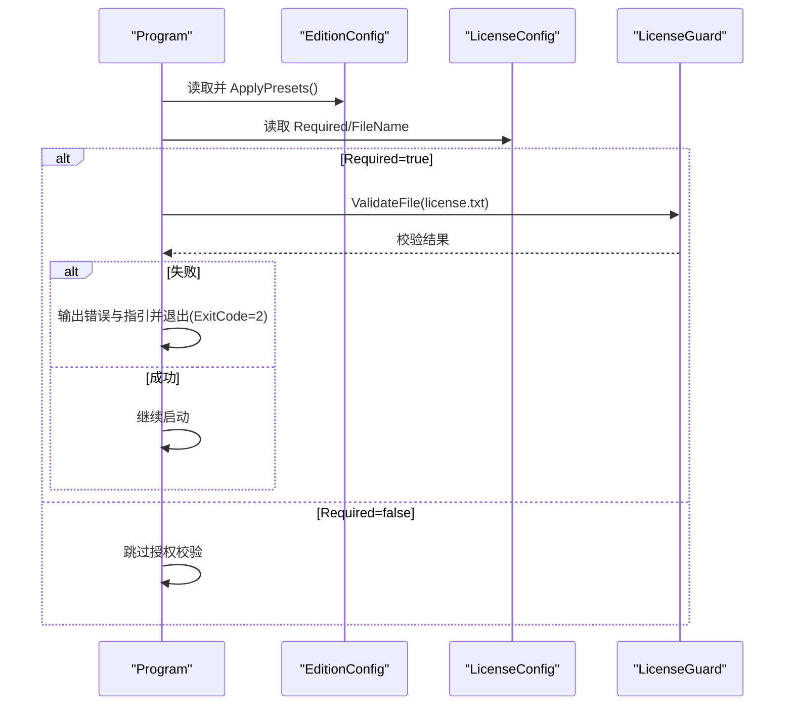
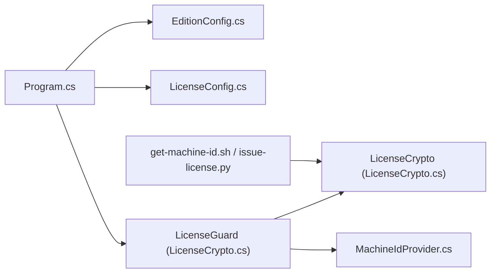

# 授权和许可管理

<cite>
**本文引用的文件**
- [LicenseConfig.cs](file://Configuration/LicenseConfig.cs)
- [EditionConfig.cs](file://Configuration/EditionConfig.cs)
- [LicenseCrypto.cs](file://Licensing/LicenseCrypto.cs)
- [MachineIdProvider.cs](file://Licensing/MachineIdProvider.cs)
- [Program.cs](file://Program.cs)
- [商业版.appsettings.json](file://configs/商业版.appsettings.json)
- [社区版.appsettings.json](file://configs/社区版.appsettings.json)
- [定制版.appsettings.json](file://configs/定制版.appsettings.json)
- [授权说明.md](file://docs/授权说明.md)
- [get-machine-id.sh](file://scripts/license/get-machine-id.sh)
- [issue-license.py](file://scripts/license/issue-license.py)
- [LicenseCryptoTests.cs](file://EssSimulator.Tests/Licensing/LicenseCryptoTests.cs)
</cite>

## 目录
1. [简介](#简介)
2. [项目结构](#项目结构)
3. [核心组件](#核心组件)
4. [架构总览](#架构总览)
5. [详细组件分析](#详细组件分析)
6. [依赖关系分析](#依赖关系分析)
7. [性能与安全性考虑](#性能与安全性考虑)
8. [故障排除指南](#故障排除指南)
9. [结论](#结论)
10. [附录：配置与API参考](#附录：配置与api参考)

## 简介
本文件面向授权与许可管理系统，覆盖许可证验证机制（机器码生成、许可证文件校验、版本控制）、不同产品档位的授权策略（社区版免授权、商业版与定制版需授权），以及许可证申请流程、故障排除与安全注意事项。同时提供授权相关配置选项与对外暴露的命令行接口说明。

## 项目结构
授权与许可能力由以下模块协同实现：
- 配置层：EditionConfig、LicenseConfig 定义档位与授权开关、文件名等。
- 授权核心：LicenseCrypto、LicenseGuard 负责签发、解析、签名校验、到期检查；MachineIdProvider 负责跨平台机器码生成。
- 启动集成：Program 在应用启动时根据配置决定是否校验 license.txt，并输出友好错误提示。
- 脚本工具：get-machine-id.sh、issue-license.py 用于获取机器码与签发许可证。
- 文档与测试：授权说明文档与单元测试保障行为一致性。

图表来源
- [Program.cs:141-178](file://Program.cs#L141-L178)
- [LicenseCrypto.cs:183-248](file://Licensing/LicenseCrypto.cs#L183-L248)
- [MachineIdProvider.cs:17-32](file://Licensing/MachineIdProvider.cs#L17-L32)
- [get-machine-id.sh:1-30](file://scripts/license/get-machine-id.sh#L1-L30)
- [issue-license.py:31-43](file://scripts/license/issue-license.py#L31-L43)

章节来源
- [Program.cs:141-178](file://Program.cs#L141-L178)
- [LicenseConfig.cs:1-15](file://Configuration/LicenseConfig.cs#L1-L15)
- [EditionConfig.cs:1-57](file://Configuration/EditionConfig.cs#L1-L57)

## 核心组件
- 档位配置 EditionConfig：通过 Name 区分社区版/商业版/定制版，并提供 ApplyPresets 对社区版进行能力裁剪（关闭高级 API、限制拓扑规模等）。
- 授权配置 LicenseConfig：控制是否必须校验 license.txt 及文件名。
- 机器码 MachineIdProvider：跨平台获取原始标识并计算稳定哈希，算法与脚本保持一致。
- 许可证加密与校验 LicenseCrypto/LicenseGuard：签发、解析、HMAC 签名校验、机器码匹配、过期判断。
- 启动集成 Program.EnforceLicenseOrExit：根据配置决定是否需要授权，读取 license.txt 并校验，失败时输出指引。

章节来源
- [EditionConfig.cs:1-57](file://Configuration/EditionConfig.cs#L1-L57)
- [LicenseConfig.cs:1-15](file://Configuration/LicenseConfig.cs#L1-L15)
- [MachineIdProvider.cs:1-119](file://Licensing/MachineIdProvider.cs#L1-L119)
- [LicenseCrypto.cs:1-250](file://Licensing/LicenseCrypto.cs#L1-L250)
- [Program.cs:141-178](file://Program.cs#L141-L178)

## 架构总览
授权系统采用“配置驱动 + 启动时校验”的模式：
- 启动阶段读取 EditionConfig 与 LicenseConfig，确定是否需要授权。
- 若需要授权，则定位 license.txt，调用 LicenseGuard 进行内容解析、签名校验、机器码匹配与有效期检查。
- 校验成功继续启动；失败则输出错误信息与操作指引并退出。

图表来源
- [Program.cs:141-178](file://Program.cs#L141-L178)
- [LicenseCrypto.cs:183-248](file://Licensing/LicenseCrypto.cs#L183-L248)
- [MachineIdProvider.cs:17-32](file://Licensing/MachineIdProvider.cs#L17-L32)

## 详细组件分析

### 机器码生成（MachineIdProvider）
- 目标：为每台机器生成稳定的 32 位十六进制机器码，用于绑定许可证。
- 算法：取原始机器标识（Windows 注册表 GUID、macOS ioreg UUID、Linux machine-id/dbus machine-id 或回退到主机名|用户名|系统版本），拼接固定前缀后做 SHA256，取前 16 字节转为 32 位十六进制。
- 兼容性：与 scripts/license/get-machine-id.sh 的 Python 实现一致，确保跨平台一致。

图表来源
- [MachineIdProvider.cs:17-32](file://Licensing/MachineIdProvider.cs#L17-L32)
- [get-machine-id.sh:23-29](file://scripts/license/get-machine-id.sh#L23-L29)

章节来源
- [MachineIdProvider.cs:1-119](file://Licensing/MachineIdProvider.cs#L1-L119)
- [get-machine-id.sh:1-30](file://scripts/license/get-machine-id.sh#L1-L30)

### 许可证签发与校验（LicenseCrypto / LicenseGuard）
- 许可证格式：单行文本，形如 ESSLIC1.<base64url(payloadJson)>.<base64url(hmacSha256)>，支持注释行。
- 载荷字段：machineId、expires、issued。
- 密钥：优先使用环境变量 ESS_LICENSE_SECRET，否则使用内置开发默认密钥。
- 校验流程：
  - 解析首行有效载荷，Base64Url 解码 JSON。
  - HMAC 签名校验（固定时间比较防时序攻击）。
  - 机器码匹配（大小写不敏感）。
  - 有效期检查（到期日 >= 今天）。
- 返回结果：包含状态、消息、本地机器码与解析出的信息。

图表来源
- [LicenseCrypto.cs:7-31](file://Licensing/LicenseCrypto.cs#L7-L31)
- [LicenseCrypto.cs:56-152](file://Licensing/LicenseCrypto.cs#L56-L152)
- [LicenseCrypto.cs:183-248](file://Licensing/LicenseCrypto.cs#L183-L248)

章节来源
- [LicenseCrypto.cs:1-250](file://Licensing/LicenseCrypto.cs#L1-L250)

### 启动集成与强制授权（Program）
- 档位预设：读取 EditionConfig 并 ApplyPresets，社区版将关闭高级能力并限制拓扑规模。
- 授权判定：若显式配置了 License.Required 则按配置；否则非社区版默认 Required=true。
- 文件定位：优先使用当前工作目录下的 license.txt，其次使用程序目录。
- 失败处理：输出错误原因、本机机器码与操作步骤，设置退出码 2。

图表来源
- [Program.cs:141-178](file://Program.cs#L141-L178)

章节来源
- [Program.cs:141-178](file://Program.cs#L141-L178)
- [EditionConfig.cs:42-54](file://Configuration/EditionConfig.cs#L42-L54)

### 不同产品档位的授权策略
- 社区版：
  - 档位名称：Community/社区版。
  - ApplyPresets 会关闭高级能力（白盒切片、3D视图、组态编辑），锁定拓扑规模，限制最大储能单元数。
  - License.Required 默认 false，无需 license.txt。
- 商业版：
  - 档位名称：Commercial/商业版。
  - License.Required 默认 true，需要有效的 license.txt。
- 定制版：
  - 档位名称：Custom/定制版。
  - License.Required 默认 true，需要有效的 license.txt。

章节来源
- [EditionConfig.cs:12-54](file://Configuration/EditionConfig.cs#L12-L54)
- [商业版.appsettings.json:23-45](file://configs/商业版.appsettings.json#L23-L45)
- [社区版.appsettings.json:12-51](file://configs/社区版.appsettings.json#L12-L51)
- [定制版.appsettings.json:34-45](file://configs/定制版.appsettings.json#L34-L45)

### 许可证申请流程
- 用户侧获取机器码：
  - macOS/Linux：执行 get-machine-id.sh。
  - Windows：执行 PowerShell 脚本或使用 --machine-id 参数。
- 卖方侧签发许可证：
  - 设置环境变量 ESS_LICENSE_SECRET（生产环境务必更换）。
  - 执行 issue-license.py 传入机器码与到期日或年限，生成 license.txt。
- 部署与启动：
  - 将 license.txt 放置于程序运行目录或程序目录。
  - 启动软件，启动时会进行授权校验。

章节来源
- [授权说明.md:1-67](file://docs/授权说明.md#L1-L67)
- [get-machine-id.sh:1-30](file://scripts/license/get-machine-id.sh#L1-L30)
- [issue-license.py:31-78](file://scripts/license/issue-license.py#L31-L78)

### 版本控制与扩展点
- 许可证载荷包含 issued 与 expires 日期字段，便于审计与生命周期管理。
- 可通过环境变量覆盖密钥，避免硬编码在生产环境泄露。
- 未来可扩展：增加设备数量上限、功能开关等字段至载荷中，结合 EditionConfig 实现更细粒度控制。

章节来源
- [LicenseCrypto.cs:56-73](file://Licensing/LicenseCrypto.cs#L56-L73)
- [LicenseCrypto.cs:123-145](file://Licensing/LicenseCrypto.cs#L123-L145)

## 依赖关系分析
- Program 依赖 EditionConfig 与 LicenseConfig 决定授权策略。
- LicenseGuard 依赖 MachineIdProvider 获取本地机器码，依赖 LicenseCrypto 进行解析与校验。
- 脚本工具与 C# 实现保持算法一致，保证跨平台一致性。

图表来源
- [Program.cs:141-178](file://Program.cs#L141-L178)
- [LicenseCrypto.cs:183-248](file://Licensing/LicenseCrypto.cs#L183-L248)
- [MachineIdProvider.cs:17-32](file://Licensing/MachineIdProvider.cs#L17-L32)
- [get-machine-id.sh:23-29](file://scripts/license/get-machine-id.sh#L23-L29)
- [issue-license.py:31-43](file://scripts/license/issue-license.py#L31-L43)

章节来源
- [Program.cs:141-178](file://Program.cs#L141-L178)
- [LicenseCrypto.cs:183-248](file://Licensing/LicenseCrypto.cs#L183-L248)
- [MachineIdProvider.cs:17-32](file://Licensing/MachineIdProvider.cs#L17-L32)

## 性能与安全性考虑
- 性能：
  - 授权校验仅在启动时执行一次，开销可忽略。
  - Base64Url 编解码与 JSON 序列化/反序列化为轻量操作。
- 安全性：
  - HMAC-SHA256 签名校验，防止篡改。
  - 固定时间比较避免时序攻击。
  - 密钥通过环境变量注入，避免硬编码泄露。
  - 机器码基于系统唯一标识哈希，降低重复与伪造风险。
- 建议：
  - 生产环境务必设置 ESS_LICENSE_SECRET 并妥善保管。
  - 定期轮换密钥并重新签发许可证。
  - 记录授权日志以便审计。

[本节为通用指导，不直接分析具体文件]

## 故障排除指南
常见错误与处理：
- 未找到授权文件：
  - 确认 license.txt 位于运行目录或程序目录。
  - 检查 LicenseConfig.FileName 配置。
- 签名校验失败：
  - 确认签发与运行环境的 ESS_LICENSE_SECRET 一致。
  - 检查 license.txt 是否被修改或损坏。
- 机器码不匹配：
  - 使用 --machine-id 或脚本获取当前机器码，核对与许可证中的 machineId。
  - 注意大小写与空白字符已被规范化。
- 授权已过期：
  - 检查 expires 日期，重新签发新许可证。
- 社区版误报需要授权：
  - 检查 EditionConfig.Name 是否为 Community/社区版。
  - 确认 License.Required 配置未被覆盖。

章节来源
- [Program.cs:141-178](file://Program.cs#L141-L178)
- [LicenseCrypto.cs:75-152](file://Licensing/LicenseCrypto.cs#L75-L152)
- [LicenseCrypto.cs:183-248](file://Licensing/LicenseCrypto.cs#L183-L248)

## 结论
本授权系统通过配置驱动的档位控制与启动时强校验，实现了灵活的许可证管理与安全保护。机器码生成与脚本工具保证了跨平台一致性，HMAC 签名与固定时间比较提升了安全性。配合清晰的申请流程与故障排除指南，可有效支撑社区版、商业版与定制版的交付与运维。

[本节为总结性内容，不直接分析具体文件]

## 附录：配置与API参考

### 配置选项
- Simulator:Edition
  - Name：Community/Commercial/Custom（也支持中文）
  - LockTopology：是否锁定拓扑规模（社区版默认 true）
  - MaxEssUnits：最大储能单元数（社区版默认 2）
  - AllowDroopSlices：是否开放白盒切片 API（社区版强制 false）
  - AllowMainline3d：是否开放主接线 3D 视图（社区版强制 false）
  - AllowTopologyEditor：是否开放组态编辑（社区版强制 false）
- Simulator:License
  - Required：是否必须校验 license.txt（社区版默认 false，其他默认 true）
  - FileName：许可证文件名（默认 license.txt）

章节来源
- [EditionConfig.cs:10-29](file://Configuration/EditionConfig.cs#L10-L29)
- [LicenseConfig.cs:6-12](file://Configuration/LicenseConfig.cs#L6-L12)
- [商业版.appsettings.json:23-45](file://configs/商业版.appsettings.json#L23-L45)
- [社区版.appsettings.json:12-51](file://configs/社区版.appsettings.json#L12-L51)
- [定制版.appsettings.json:34-45](file://configs/定制版.appsettings.json#L34-L45)

### 命令行接口
- --machine-id：打印当前机器码（与脚本算法一致）。
- 使用方式：运行 EssSimulator --machine-id 或在脚本中调用。

章节来源
- [授权说明.md:15-26](file://docs/授权说明.md#L15-L26)
- [get-machine-id.sh:1-30](file://scripts/license/get-machine-id.sh#L1-L30)

### 许可证文件格式
- 单行有效载荷：ESSLIC1.<base64url(JSON)>.<base64url(HMAC-SHA256)>
- 支持注释行（以 # 开头），解析时忽略。
- JSON 字段：machineId、expires、issued。

章节来源
- [LicenseCrypto.cs:33-37](file://Licensing/LicenseCrypto.cs#L33-L37)
- [LicenseCrypto.cs:75-152](file://Licensing/LicenseCrypto.cs#L75-L152)

### 单元测试要点
- Issue 与 TryParse 往返一致。
- 校验成功、机器码不匹配、过期、到期日当天允许等场景覆盖。
- 机器码哈希稳定性与脚本向量一致。

章节来源
- [LicenseCryptoTests.cs:12-79](file://EssSimulator.Tests/Licensing/LicenseCryptoTests.cs#L12-L79)