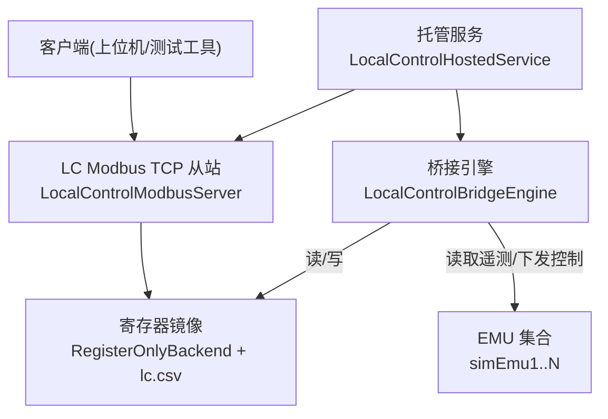
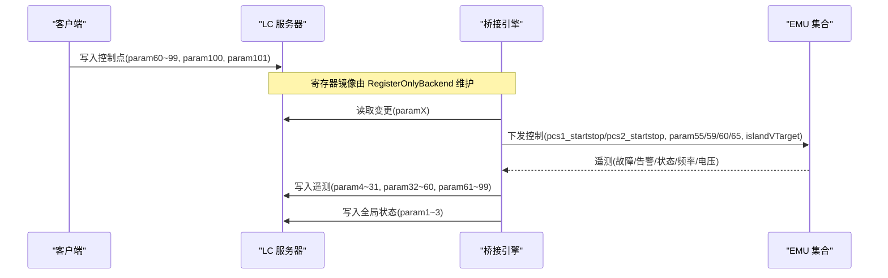
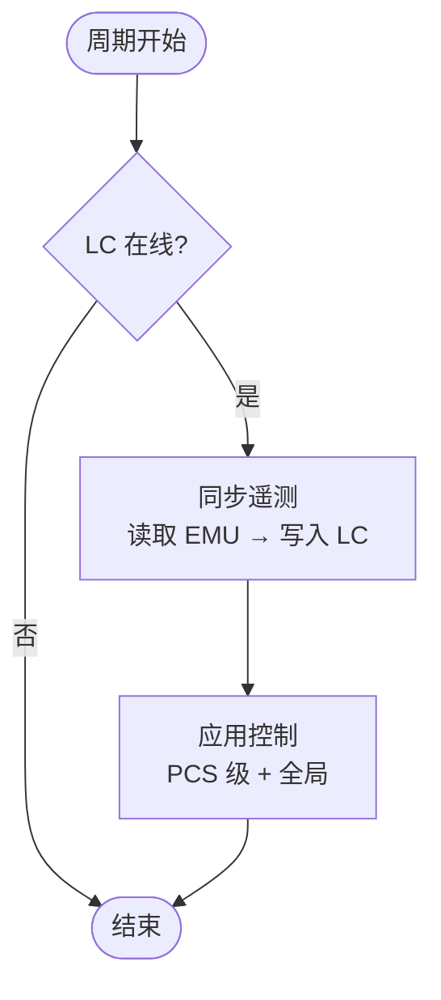
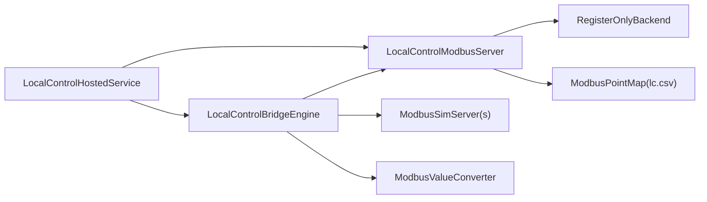

# 本地控制模块

<cite>
**本文引用的文件**
- [LocalControlBridgeEngine.cs](file://LocalControl/LocalControlBridgeEngine.cs)
- [LocalControlHostedService.cs](file://LocalControl/LocalControlHostedService.cs)
- [LocalControlModbusServer.cs](file://LocalControl/LocalControlModbusServer.cs)
- [RegisterOnlyBackend.cs](file://LocalControl/RegisterOnlyBackend.cs)
- [ModbusValueConverter.cs](file://LocalControl/ModbusValueConverter.cs)
- [SimulatorConfig.cs](file://Configuration/SimulatorConfig.cs)
- [appsettings.json](file://appsettings.json)
- [lc.csv（通用）](file://pointmaps/common/lc.csv)
- [ModbusPointMap.cs](file://Protocol/Modbus/ModbusPointMap.cs)
- [ModbusValueConverterTests.cs](file://EssSimulator.Tests/LocalControl/ModbusValueConverterTests.cs)
</cite>

## 目录
1. [简介](#简介)
2. [项目结构](#项目结构)
3. [核心组件](#核心组件)
4. [架构总览](#架构总览)
5. [详细组件分析](#详细组件分析)
6. [依赖关系分析](#依赖关系分析)
7. [性能与可靠性](#性能与可靠性)
8. [故障排查指南](#故障排查指南)
9. [结论](#结论)
10. [附录：配置、协议与调试](#附录：配置协议与调试)

## 简介
本模块提供“本地控制（LC）聚合模式”，将多个 EMU（模拟 PCS/BMS 的 Modbus 从站）聚合为一个 LC（本地控制器）视角的 Modbus TCP 从站。其核心职责是：
- 在 simLc* 寄存器镜像与 simEmu* 设备之间进行数据转发与命令分发；
- 实现本地控制桥接与寄存器映射机制，屏蔽底层多设备细节；
- 以独立托管服务方式启动，仅在启用时运行，避免影响主仿真路径。

该模式适用于需要以“本地控制器”视角接入系统集成的场景，通过一组固定命名的寄存器点（param1…param101）完成遥测读取与控制下发。

## 项目结构
本地控制相关代码集中在 LocalControl 命名空间下，配合 Protocol.Modbus 的点表解析与模拟器注册中心，形成“LC 服务器 + 桥接引擎 + 纯寄存器后端”的分层结构：
- LocalControlHostedService：生命周期管理，按配置启动若干 LC 服务器，并以周期任务驱动桥接循环；
- LocalControlModbusServer：对外暴露 LC 的 Modbus TCP 从站，维护 lc.csv 寄存器镜像；
- RegisterOnlyBackend：仅负责寄存器读写，不绑定仿真模型，不参与轮询；
- LocalControlBridgeEngine：核心聚合逻辑，负责遥测同步、控制下发、全局黑启动与高压断路器控制；
- ModbusValueConverter：值类型转换与高压断路器命令归一化；
- 点表与配置：lc.csv 定义 LC 寄存器语义，appsettings.json 与 SimulatorConfig 提供端口、分组等参数。

图表来源
- [LocalControlHostedService.cs:26-55](file://LocalControl/LocalControlHostedService.cs#L26-L55)
- [LocalControlModbusServer.cs:18-93](file://LocalControl/LocalControlModbusServer.cs#L18-L93)
- [RegisterOnlyBackend.cs:14-55](file://LocalControl/RegisterOnlyBackend.cs#L14-L55)
- [LocalControlBridgeEngine.cs:15-147](file://LocalControl/LocalControlBridgeEngine.cs#L15-L147)

章节来源
- [LocalControlHostedService.cs:1-102](file://LocalControl/LocalControlHostedService.cs#L1-L102)
- [LocalControlModbusServer.cs:1-95](file://LocalControl/LocalControlModbusServer.cs#L1-L95)
- [RegisterOnlyBackend.cs:1-58](file://LocalControl/RegisterOnlyBackend.cs#L1-L58)
- [LocalControlBridgeEngine.cs:1-428](file://LocalControl/LocalControlBridgeEngine.cs#L1-L428)

## 核心组件
- 本地控制托管服务：根据配置决定是否启用 LC，等待 EMU 就绪后启动若干 LC 服务器，并周期性执行桥接循环。
- 本地控制 Modbus 服务器：基于 lc.csv 构建寄存器镜像，提供只读/写入接口，供桥接引擎更新状态或下发控制。
- 纯寄存器后端：最小化实现，仅支持 CSV 默认缓冲写入与点名读写，不引入额外线程或模型绑定。
- 桥接引擎：每周期执行遥测同步与控制应用，包含局部 PCS 控制、全局黑启动、高压断路器控制，以及影子寄存器去抖与回退策略。
- 值转换器：统一数值类型转换，并对高压断路器命令进行严格归一化（AA/EE）。

章节来源
- [LocalControlHostedService.cs:20-55](file://LocalControl/LocalControlHostedService.cs#L20-L55)
- [LocalControlModbusServer.cs:18-93](file://LocalControl/LocalControlModbusServer.cs#L18-L93)
- [RegisterOnlyBackend.cs:14-55](file://LocalControl/RegisterOnlyBackend.cs#L14-L55)
- [LocalControlBridgeEngine.cs:15-147](file://LocalControl/LocalControlBridgeEngine.cs#L15-L147)
- [ModbusValueConverter.cs:5-45](file://LocalControl/ModbusValueConverter.cs#L5-L45)

## 架构总览
LC 聚合模式采用“解耦+轮询”的轻量架构：
- 外部客户端通过 Modbus TCP 访问 LC 从站（simLc*），读写 param1…param101；
- 桥接引擎定时读取 LC 寄存器变化，映射到对应 EMU 的参数名（如 pcs1_startstop、param55 等），并下发至 EMU；
- 同时，桥接引擎从 EMU 读取遥测（故障、告警、运行状态、频率、电压等），聚合写入 LC 寄存器，供客户端查询；
- 全局控制（黑启动、高压断路器）跨组内所有 EMU 广播，具备初始对齐与无效命令回退机制。

图表来源
- [LocalControlBridgeEngine.cs:30-147](file://LocalControl/LocalControlBridgeEngine.cs#L30-L147)
- [LocalControlModbusServer.cs:47-92](file://LocalControl/LocalControlModbusServer.cs#L47-L92)
- [RegisterOnlyBackend.cs:25-55](file://LocalControl/RegisterOnlyBackend.cs#L25-L55)

## 详细组件分析

### 本地控制桥接引擎（LocalControlBridgeEngine）
- 周期调度：RunCycle 在每个周期先同步遥测，再应用控制；若 LC 离线则跳过。
- 遥测同步：遍历 8 台 PCS（分两组，每组 4 台），从对应 EMU 读取故障、告警、运行状态、频率、三相电压，并写入 LC 寄存器；计算并写入系统级标志（总故障、黑启动模式、高压断路器状态）。
- 控制应用：对每台 PCS 的启停、有功、无功、离网电压设定值进行“变更检测→下发→影子更新”；对全局黑启动与高压断路器进行组内广播。
- 初始对齐：首次运行时，从 EMU 读取当前值初始化影子寄存器，保证客户端读取一致。
- 错误处理：读取失败回退为 0；下发失败记录日志并标记失败；高压断路器命令非法时自动回退 LC 寄存器到上一值。

图表来源
- [LocalControlBridgeEngine.cs:15-147](file://LocalControl/LocalControlBridgeEngine.cs#L15-L147)

章节来源
- [LocalControlBridgeEngine.cs:15-147](file://LocalControl/LocalControlBridgeEngine.cs#L15-L147)
- [LocalControlBridgeEngine.cs:149-236](file://LocalControl/LocalControlBridgeEngine.cs#L149-L236)
- [LocalControlBridgeEngine.cs:268-399](file://LocalControl/LocalControlBridgeEngine.cs#L268-L399)

### 本地控制 Modbus 服务器（LocalControlModbusServer）
- 点表加载：使用 lc.csv 构建寄存器映射，生成 DataMaps/ControlMaps 及 RawMaps；
- 通信栈：封装 TCPCommunicator 与 ModbusTCPSlave，提供 Read/Write 能力；
- 数据存取：SetDataStoreByMesurePointName 用于即时写入寄存器；GetDataObjectByMesurePointName 通过后端解析返回可读值；
- 启动流程：多次重试连接，成功后启动后端并暴露服务。

章节来源
- [LocalControlModbusServer.cs:18-93](file://LocalControl/LocalControlModbusServer.cs#L18-L93)
- [ModbusPointMap.cs:31-50](file://Protocol/Modbus/ModbusPointMap.cs#L31-L50)

### 纯寄存器后端（RegisterOnlyBackend）
- 职责边界：仅维护 CSV 默认缓冲与点名读写，不绑定仿真模型，不启动轮询线程；
- 写入策略：Start 时写入默认缓冲；后续 SetDataObjectByMesurePointName 直接写入指定点；
- 读取策略：Read 原始值后通过 ModbusParser 解析为业务值。

章节来源
- [RegisterOnlyBackend.cs:14-55](file://LocalControl/RegisterOnlyBackend.cs#L14-L55)

### 值转换器（ModbusValueConverter）
- ToDouble：兼容多种数值类型与字符串解析；
- FormatControlValue：格式化控制值日志输出；
- TryNormalizeHvBreakerCommand：严格校验高压断路器命令，仅接受 AA（开）与 EE（合），否则拒绝并触发回退。

章节来源
- [ModbusValueConverter.cs:5-45](file://LocalControl/ModbusValueConverter.cs#L5-L45)
- [ModbusValueConverterTests.cs:8-25](file://EssSimulator.Tests/LocalControl/ModbusValueConverterTests.cs#L8-L25)

## 依赖关系分析
- LocalControlHostedService 依赖 SimulatorConfig 获取协议与设备数量，依赖 SimulatorHost 获取 EMU 实例；
- LocalControlModbusServer 依赖 ModbusPointMap 解析 lc.csv，依赖 ModbusTCPSlave 与 TCPCommunicator 建立通信；
- LocalControlBridgeEngine 依赖 ModbusSimServer 读取/写入 EMU 参数，依赖 LocalControlModbusServer 写入 LC 寄存器；
- RegisterOnlyBackend 依赖 IModbusSlave 与 ModbusParser 完成寄存器读写与解析；
- 值转换器被桥接引擎与测试用例共同使用。

图表来源
- [LocalControlHostedService.cs:26-55](file://LocalControl/LocalControlHostedService.cs#L26-L55)
- [LocalControlModbusServer.cs:18-93](file://LocalControl/LocalControlModbusServer.cs#L18-L93)
- [LocalControlBridgeEngine.cs:15-147](file://LocalControl/LocalControlBridgeEngine.cs#L15-L147)
- [ModbusPointMap.cs:31-50](file://Protocol/Modbus/ModbusPointMap.cs#L31-L50)

章节来源
- [LocalControlHostedService.cs:26-55](file://LocalControl/LocalControlHostedService.cs#L26-L55)
- [LocalControlModbusServer.cs:18-93](file://LocalControl/LocalControlModbusServer.cs#L18-L93)
- [LocalControlBridgeEngine.cs:15-147](file://LocalControl/LocalControlBridgeEngine.cs#L15-L147)
- [ModbusPointMap.cs:31-50](file://Protocol/Modbus/ModbusPointMap.cs#L31-L50)

## 性能与可靠性
- 周期调度：托管服务以 100ms 周期驱动桥接循环，兼顾实时性与 CPU 占用；
- 去抖与影子：通过控制影子寄存器与阈值比较减少重复下发；
- 容错设计：读取失败回退默认值，下发失败记录日志，高压断路器非法命令自动回退；
- 资源隔离：LC 服务器不参与仿真数据交换，仅维护寄存器镜像，降低耦合与开销。

[本节为通用指导，无需特定文件引用]

## 故障排查指南
- 检查 LC 是否启用：确认 appsettings.json 中 EnableLocalControl 为 true；
- 检查端口与分组：BaseLocalControlModbusPort、LocalControlPortStep、LocalControlEmuPerGroup 是否符合预期；
- 查看日志关键字：
  - “[LC-Change]”：控制值变更日志；
  - “[LC-Publish:success] / [LC-Publish:failed]”：下发成功/失败；
  - “LC 桥接周期异常”：托管服务捕获的异常；
  - “连接失败，第 X/Y 次重试…”：LC 服务器启动重试；
- 验证高压断路器命令：仅允许 0xAA（开）与 0xEE（合），其他值将被拒绝并回退；
- 验证 LC 寄存器映射：对照 lc.csv 中的 param1…param101 含义与地址。

章节来源
- [LocalControlBridgeEngine.cs:157-236](file://LocalControl/LocalControlBridgeEngine.cs#L157-L236)
- [LocalControlHostedService.cs:57-99](file://LocalControl/LocalControlHostedService.cs#L57-L99)
- [ModbusValueConverter.cs:26-45](file://LocalControl/ModbusValueConverter.cs#L26-L45)
- [lc.csv（通用）:1-103](file://pointmaps/common/lc.csv#L1-L103)

## 结论
本地控制模块通过独立的托管服务与纯寄存器后端，实现了 LC 与 EMU 之间的解耦聚合。桥接引擎以低开销周期任务完成遥测同步与控制下发，并提供全局黑启动与高压断路器控制。配合 lc.csv 点表与 appsettings.json 配置，可灵活扩展 LC 数量与分组规模，满足本地控制器集成需求。

[本节为总结性内容，无需特定文件引用]

## 附录：配置、协议与调试

### 配置选项（appsettings.json 与 SimulatorConfig）
- 启用开关：Simulator.Protocol.EnableLocalControl；
- 端口与步长：BaseLocalControlModbusPort、LocalControlPortStep；
- 分组大小：LocalControlEmuPerGroup（建议 4，即每路 LC 聚合 4 个 EMU、8 台 PCS）；
- 有效单元数：EffectiveEssUnitCount 决定 LC 服务器数量。

章节来源
- [appsettings.json:76-90](file://appsettings.json#L76-L90)
- [SimulatorConfig.cs:149-189](file://Configuration/SimulatorConfig.cs#L149-L189)
- [SimulatorConfig.cs:272-298](file://Configuration/SimulatorConfig.cs#L272-L298)

### 通信协议（LC 寄存器语义）
- 遥测区：param1…param60（系统标志、PCS 故障/告警/状态、频率、三相电压）；
- 控制区：param60…param99（PCS 启停、有功、无功、离网电压设定）；
- 全局控制：param100（黑启动模式）、param101（高压断路器开合，AA/EE）；
- 地址与类型：详见 lc.csv（FunctionCode、Address、Type、Size、ParamName、Scale、Description）。

章节来源
- [lc.csv（通用）:1-103](file://pointmaps/common/lc.csv#L1-L103)

### 数据同步过程
- 遥测方向：EMU → LC（桥接引擎读取 EMU 参数，写入 LC 寄存器）；
- 控制方向：LC → EMU（桥接引擎检测 LC 寄存器变化，下发至 EMU 对应参数）；
- 全局控制：LC → 组内所有 EMU（黑启动、高压断路器）；
- 初始对齐：首次运行从 EMU 读取当前值填充 LC 寄存器与影子。

章节来源
- [LocalControlBridgeEngine.cs:30-147](file://LocalControl/LocalControlBridgeEngine.cs#L30-L147)
- [LocalControlBridgeEngine.cs:299-364](file://LocalControl/LocalControlBridgeEngine.cs#L299-L364)

### 错误处理策略
- 读取失败：回退为 0，并记录调试日志；
- 下发失败：记录错误日志，标记失败但不中断周期；
- 非法命令：高压断路器非 AA/EE 时拒绝并回退 LC 寄存器；
- 服务异常：托管服务捕获异常并继续运行。

章节来源
- [LocalControlBridgeEngine.cs:255-266](file://LocalControl/LocalControlBridgeEngine.cs#L255-L266)
- [LocalControlBridgeEngine.cs:401-425](file://LocalControl/LocalControlBridgeEngine.cs#L401-L425)
- [LocalControlHostedService.cs:49-52](file://LocalControl/LocalControlHostedService.cs#L49-L52)

### 集成示例与调试方法
- 启动条件：设置 EnableLocalControl=true，配置 BaseLocalControlModbusPort 与 LocalControlEmuPerGroup；
- 启动流程：托管服务等待 simEmu1 上线后，创建 simLc1…N 服务器并注册到模拟器；
- 调试步骤：
  - 使用 Modbus 客户端连接 simLc* 端口，读取 param1…param101；
  - 写入控制点（如 param60=1 启动 PCS1），观察日志 “[LC-Change]” 与 “[LC-Publish:success]”；
  - 写入高压断路器命令（param101=0xEE 合闸，0xAA 分闸），观察回退与日志；
  - 检查 LC 服务器启动日志与重试信息；
  - 对比 lc.csv 与 EMU 参数名映射，确保点位正确。

章节来源
- [LocalControlHostedService.cs:69-99](file://LocalControl/LocalControlHostedService.cs#L69-L99)
- [LocalControlBridgeEngine.cs:157-236](file://LocalControl/LocalControlBridgeEngine.cs#L157-L236)
- [lc.csv（通用）:1-103](file://pointmaps/common/lc.csv#L1-L103)