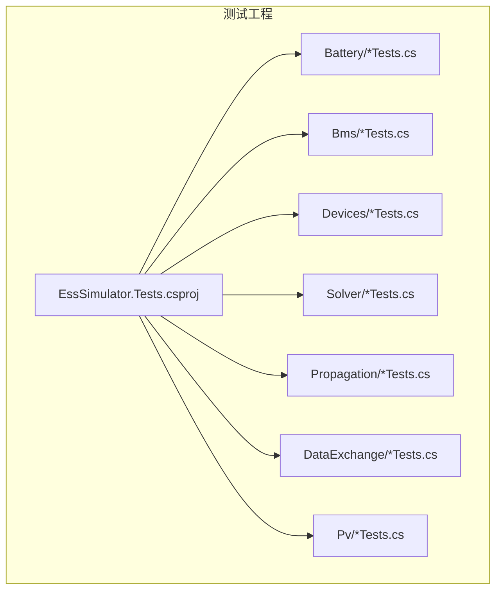
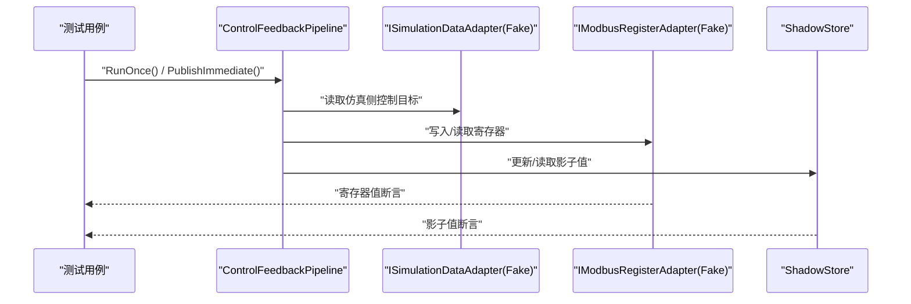
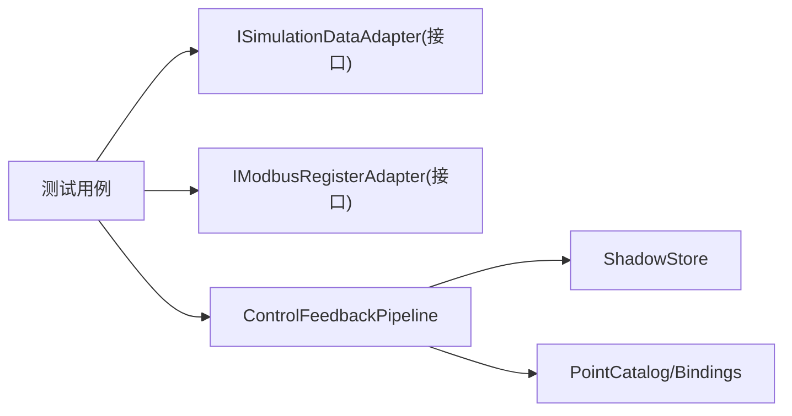

# 单元测试

<cite>
**本文引用的文件**
- [EssSimulator.Tests.csproj](file://EssSimulator.Tests/EssSimulator.Tests.csproj)
- [CellTemperatureModelTests.cs](file://EssSimulator.Tests/Battery/CellTemperatureModelTests.cs)
- [BmsCurrentLimitDeratingTests.cs](file://EssSimulator.Tests/Bms/BmsCurrentLimitDeratingTests.cs)
- [NetworkSolverTests.cs](file://EssSimulator.Tests/Solver/NetworkSolverTests.cs)
- [BreakerSimulatorTests.cs](file://EssSimulator.Tests/Devices/BreakerSimulatorTests.cs)
- [ControlFeedbackPipelineTests.cs](file://EssSimulator.Tests/DataExchange/ControlFeedbackPipelineTests.cs)
- [PvModuleSimulatorTests.cs](file://EssSimulator.Tests/Pv/PvModuleSimulatorTests.cs)
- [QuvConvergenceTests.cs](file://EssSimulator.Tests/Propagation/QuvConvergenceTests.cs)
- [run-bms-dataexchange-validation.sh](file://scripts/test/run-bms-dataexchange-validation.sh)
- [run_tc_r01.py](file://scripts/test/perf/run_tc_r01.py)
- [autotest.json](file://autotest.json)
</cite>

## 目录
1. [简介](#简介)
2. [项目结构](#项目结构)
3. [核心组件](#核心组件)
4. [架构总览](#架构总览)
5. [详细组件分析](#详细组件分析)
6. [依赖关系分析](#依赖关系分析)
7. [性能考虑](#性能考虑)
8. [故障排查指南](#故障排查指南)
9. [结论](#结论)
10. [附录](#附录)

## 简介
本文件面向储能仿真系统的单元测试，系统性地说明测试框架选择（xUnit）、测试用例编写规范与最佳实践，并围绕电池模型、BMS 功能、设备仿真、网络求解器、数据交换管线等核心模块给出覆盖测试数据准备、模拟对象使用、断言策略与覆盖率要求的实操指导。同时提供测试环境搭建、执行命令与结果分析方法，帮助读者快速建立稳定、可维护的测试体系。

## 项目结构
测试工程位于 EssSimulator.Tests，采用按领域划分的目录组织方式：Battery、Bms、Devices、Solver、Propagation、DataExchange、Pv、Topology、Web 等，每个子目录对应被测模块的职责边界，便于定位与维护。测试工程引用主工程，通过 xUnit + .NET Test SDK 运行，并使用 coverlet.collector 收集覆盖率数据。

图表来源
- [EssSimulator.Tests.csproj:1-27](file://EssSimulator.Tests/EssSimulator.Tests.csproj#L1-L27)

章节来源
- [EssSimulator.Tests.csproj:1-27](file://EssSimulator.Tests/EssSimulator.Tests.csproj#L1-L27)

## 核心组件
- 测试框架与工具链
  - 框架：xUnit（[EssSimulator.Tests.csproj:12-20](file://EssSimulator.Tests/EssSimulator.Tests.csproj#L12-L20)）
  - 运行器：Microsoft.NET.Test.Sdk、xunit.runner.visualstudio（[EssSimulator.Tests.csproj:12-17](file://EssSimulator.Tests/EssSimulator.Tests.csproj#L12-L17)）
  - 覆盖率：coverlet.collector（[EssSimulator.Tests.csproj:13](file://EssSimulator.Tests/EssSimulator.Tests.csproj#L13)）
- 测试组织
  - 按领域分目录，类名以 Tests 结尾，方法名表达预期行为（Fact/Theory）
  - 使用 Theory + InlineData 进行参数化场景验证（如 BMS 限流曲线、收敛判定）
- 断言风格
  - 数值断言使用范围断言 Assert.InRange 与近似相等 Assert.Equal(..., tolerance)
  - 逻辑断言使用 Assert.True/False、Assert.NotEqual、Assert.Equal
- 模拟与隔离
  - 对 IModbusRegisterAdapter、ISimulationDataAdapter 等接口提供轻量 Fake 实现，避免外部依赖
  - 通过配置对象注入被测上下文（如 SimulatorConfig、各类 DeviceConfig）

章节来源
- [EssSimulator.Tests.csproj:12-20](file://EssSimulator.Tests/EssSimulator.Tests.csproj#L12-L20)
- [BmsCurrentLimitDeratingTests.cs:13-42](file://EssSimulator.Tests/Bms/BmsCurrentLimitDeratingTests.cs#L13-L42)
- [ControlFeedbackPipelineTests.cs:10-58](file://EssSimulator.Tests/DataExchange/ControlFeedbackPipelineTests.cs#L10-L58)

## 架构总览
下图展示“控制反馈管线”在测试中的交互：测试构造 Catalog、Fake 仿真适配器、Fake Modbus 适配器与 ShadowStore，驱动 ControlFeedbackPipeline 执行一次或即时发布，验证寄存器值与影子状态的一致性。

图表来源
- [ControlFeedbackPipelineTests.cs:60-139](file://EssSimulator.Tests/DataExchange/ControlFeedbackPipelineTests.cs#L60-L139)

章节来源
- [ControlFeedbackPipelineTests.cs:60-139](file://EssSimulator.Tests/DataExchange/ControlFeedbackPipelineTests.cs#L60-L139)

## 详细组件分析

### 电池模型测试（电芯温度模型）
- 目标
  - 验证每电芯独立温度演化、节点温度影响散热效率、稳态温升符合热平衡预期
- 关键要点
  - 通过固定规格创建电芯模拟器，步进迭代 Update，观察温度变化
  - 使用 Assert.InRange 校验稳态区间，体现物理模型的容差
- 复杂度与性能
  - 循环步数较大（数百至千步），但单电芯计算轻量；建议将热点路径提取为可复用方法以便扩展
- 建议
  - 增加极端温度/内阻场景的边界用例
  - 引入时间序列断言（如最大偏差、收敛步数）提升稳健性

章节来源
- [CellTemperatureModelTests.cs:12-78](file://EssSimulator.Tests/Battery/CellTemperatureModelTests.cs#L12-L78)

### BMS 功能测试（电流降额与堆叠限制）
- 目标
  - 验证充电温度因子、充/放电电压线性降额、综合限流取最小值、堆叠最大充电电流叠加与簇电压降额
- 关键要点
  - 使用 Theory + InlineData 覆盖多组输入到期望输出的映射
  - 通过 BatteryStack 与 BatteryCluster 构建多簇场景，验证聚合逻辑
- 复杂度与性能
  - 纯函数式计算为主，开销极低；适合大量参数化用例
- 建议
  - 补充异常输入（负温度、越界电压）的鲁棒性用例
  - 将复杂组合条件抽取为测试夹具，减少重复

章节来源
- [BmsCurrentLimitDeratingTests.cs:8-115](file://EssSimulator.Tests/Bms/BmsCurrentLimitDeratingTests.cs#L8-L115)

### 设备仿真测试（断路器）
- 目标
  - 验证开断时阻断电流但保持二次侧电压、闭合时透传电压与电流
- 关键要点
  - 构造 ElectricalPortSnapshot 模拟一次/二次侧电气量，调用 Step 推进仿真
  - 断言输出端口电流与电压是否符合开关状态
- 复杂度与性能
  - 单次 Step 计算，开销低；适合集成到更大拓扑回归测试
- 建议
  - 增加不同负载功率因数、频率偏移的场景
  - 结合 NetworkSolver 做端到端闭环验证

章节来源
- [BreakerSimulatorTests.cs:8-57](file://EssSimulator.Tests/Devices/BreakerSimulatorTests.cs#L8-L57)

### 网络求解器测试
- 目标
  - 验证主断路器闭合时 PCC/站变母线电压接近标称、断开时 PCC 电压为零且计量功率为零
- 关键要点
  - 通过 NetworkTopologyBuilder 构建默认网络，下发 DeviceCommand 控制开关
  - 调用 Solver.Step 推进，断言总线电压与计量值
- 复杂度与性能
  - 网络求解涉及拓扑与潮流计算；测试中步长较小，注意批量回归时的耗时
- 建议
  - 增加扰动场景（负载突变、短路）与收敛性检查
  - 将网络构建封装为工厂方法，便于多场景复用

章节来源
- [NetworkSolverTests.cs:9-63](file://EssSimulator.Tests/Solver/NetworkSolverTests.cs#L9-L63)

### 数据交换与控制反馈管线测试
- 目标
  - 验证 Hold 模式在仿真侧置位后 Modbus 寄存器回写为 1；即时发布能写入寄存器并提交影子
- 关键要点
  - 使用 Fake ISimulationDataAdapter 与 IModbusRegisterAdapter 隔离外部通信
  - 通过 PointCatalog、PointBinding、ShadowStore 构建完整数据通路
- 复杂度与性能
  - 内存级 Fake 实现，开销极低；适合高频回归
- 建议
  - 增加多点并发、类型转换错误、非法地址等异常路径用例
  - 引入时序断言（延迟、抖动）用于性能基线

章节来源
- [ControlFeedbackPipelineTests.cs:10-139](file://EssSimulator.Tests/DataExchange/ControlFeedbackPipelineTests.cs#L10-L139)

### 光伏组件仿真测试
- 目标
  - 验证组件目录参数、STC 下 MPP 点、零辐照输出为零、高温降额、入射角影响、半辐照特性、双面增益、NOCT 温度估算、I-V 曲线插值
- 关键要点
  - 使用 PvModuleSimulator 与 TrinaPvModuleCatalog 构造模型，Evaluate/CurrentAtVoltage 等方法驱动
  - 断言涵盖功率、电压、电流及物理一致性（Vmp<Voc、Imp<Isc）
- 复杂度与性能
  - 单点评估开销低；可批量扫描 I-V 曲线进行性能回归
- 建议
  - 增加阴影、失配、部分遮挡等复杂工况
  - 将典型工况封装为测试夹具，提高可读性

章节来源
- [PvModuleSimulatorTests.cs:7-142](file://EssSimulator.Tests/Pv/PvModuleSimulatorTests.cs#L7-L142)

### 传播与收敛测试（Quv 收敛）
- 目标
  - 验证线路电压相对容差收敛判断、电网无功反馈引起的电压意图变化
- 关键要点
  - 使用 QuvConvergence.IsLineVoltageConverged 进行相对误差判定
  - 通过 GridFeedbackConventions 计算 PCC 电压，验证反馈差异
- 复杂度与性能
  - 纯数学计算，极快；适合纳入快速回归套件
- 建议
  - 增加噪声与跳变场景，检验阈值稳定性

章节来源
- [QuvConvergenceTests.cs:8-38](file://EssSimulator.Tests/Propagation/QuvConvergenceTests.cs#L8-L38)

## 依赖关系分析
- 测试工程依赖主工程，所有被测类型来自 EssSimulator
- 测试内部通过接口抽象（ISimulationDataAdapter、IModbusRegisterAdapter）解耦外部系统
- 数据交换管线依赖 Catalog、ShadowStore、Pipeline 组件，形成清晰的数据流

图表来源
- [ControlFeedbackPipelineTests.cs:10-58](file://EssSimulator.Tests/DataExchange/ControlFeedbackPipelineTests.cs#L10-L58)

章节来源
- [ControlFeedbackPipelineTests.cs:10-58](file://EssSimulator.Tests/DataExchange/ControlFeedbackPipelineTests.cs#L10-L58)

## 性能考虑
- 单元测试层面
  - 优先使用内存 Fake 与轻量配置，避免真实 I/O 与网络
  - 对迭代型模型（电池热、光伏 I-V 扫描）合理设置步数与容差，避免过长运行
- 端到端验证
  - 使用脚本启动仿真器并通过 mbpoll 等工具进行协议级验证，记录响应时间与稳定性
  - 性能用例建议多次轮询统计均值/最大值，设定通过阈值

章节来源
- [run-bms-dataexchange-validation.sh:1-75](file://scripts/test/run-bms-dataexchange-validation.sh#L1-L75)
- [run_tc_r01.py:1-101](file://scripts/test/perf/run_tc_r01.py#L1-L101)

## 故障排查指南
- 常见问题
  - 端口占用：验证脚本会清理占用端口并等待服务就绪
  - 服务未启动：脚本会检测日志关键字并打印尾部日志辅助定位
  - 配置不一致：脚本会备份/恢复 appsettings.json，确保验证环境干净
- 建议流程
  - 先运行单元测试确认核心逻辑
  - 再执行端到端验证脚本，关注日志与端口状态
  - 若失败，查看 bin/Release/net8.0/Logs 下的日志文件

章节来源
- [run-bms-dataexchange-validation.sh:8-75](file://scripts/test/run-bms-dataexchange-validation.sh#L8-L75)

## 结论
本项目测试体系基于 xUnit，采用清晰的领域划分与接口隔离，覆盖了电池模型、BMS、设备仿真、网络求解器、数据交换管线与光伏组件等关键模块。通过参数化用例、范围断言与 Fake 模拟，实现了高内聚、低耦合的可维护测试集。配合脚本化的端到端验证，形成了从单元到集成的完整质量保障闭环。建议在后续迭代中持续完善异常路径与性能基线用例，进一步提升健壮性与回归效率。

## 附录

### 测试环境搭建与执行
- 环境要求
  - .NET 8 SDK
  - 可选：mbpoll（用于端到端验证）
- 构建与运行
  - 构建测试工程：dotnet build -c Release
  - 运行全部测试：dotnet test -c Release
  - 运行指定测试类：dotnet test --filter "FullyQualifiedName~BmsCurrentLimitDeratingTests"
  - 生成覆盖率报告：dotnet test -c Release /p:CollectCoverage=true /p:CoverletOutputFormat=opencover
- 端到端验证
  - 启动仿真器并执行 BMS DataExchange 验证脚本：bash scripts/test/run-bms-dataexchange-validation.sh
  - 性能用例：python3 scripts/test/perf/run_tc_r01.py

章节来源
- [EssSimulator.Tests.csproj:1-27](file://EssSimulator.Tests/EssSimulator.Tests.csproj#L1-L27)
- [run-bms-dataexchange-validation.sh:1-75](file://scripts/test/run-bms-dataexchange-validation.sh#L1-L75)
- [run_tc_r01.py:1-101](file://scripts/test/perf/run_tc_r01.py#L1-L101)

### 测试数据准备与模拟对象使用
- 数据准备
  - 使用配置对象（如 SimulatorConfig、各类 DeviceConfig）构建默认网络或设备实例
  - 通过 PointCatalog/PointBinding 定义测点绑定，配合 ShadowStore 管理控制影子
- 模拟对象
  - Fake ISimulationDataAdapter：内存字典读写，支持路径访问
  - Fake IModbusRegisterAdapter：内存寄存器表，支持批量读写与解析
- 断言策略
  - 数值：Assert.InRange、Assert.Equal(实际, 期望, 精度)
  - 逻辑：Assert.True/False、Assert.NotEqual、Assert.Equal
- 覆盖率要求
  - 建议行覆盖率≥80%，分支覆盖率≥70%（可按模块调整）
  - 关键路径（收敛、保护、限流）需重点覆盖

章节来源
- [ControlFeedbackPipelineTests.cs:10-58](file://EssSimulator.Tests/DataExchange/ControlFeedbackPipelineTests.cs#L10-L58)
- [NetworkSolverTests.cs:9-23](file://EssSimulator.Tests/Solver/NetworkSolverTests.cs#L9-L23)

### 自动化与脚本
- autotest.json 提供指令序列示例，可用于端到端场景编排（dpc 操作、sleep 等）
- 性能脚本 run_tc_r01.py 通过 mbpoll 触发与监控同一点位，记录响应时间并统计通过情况

章节来源
- [autotest.json:1-58](file://autotest.json#L1-L58)
- [run_tc_r01.py:1-101](file://scripts/test/perf/run_tc_r01.py#L1-L101)