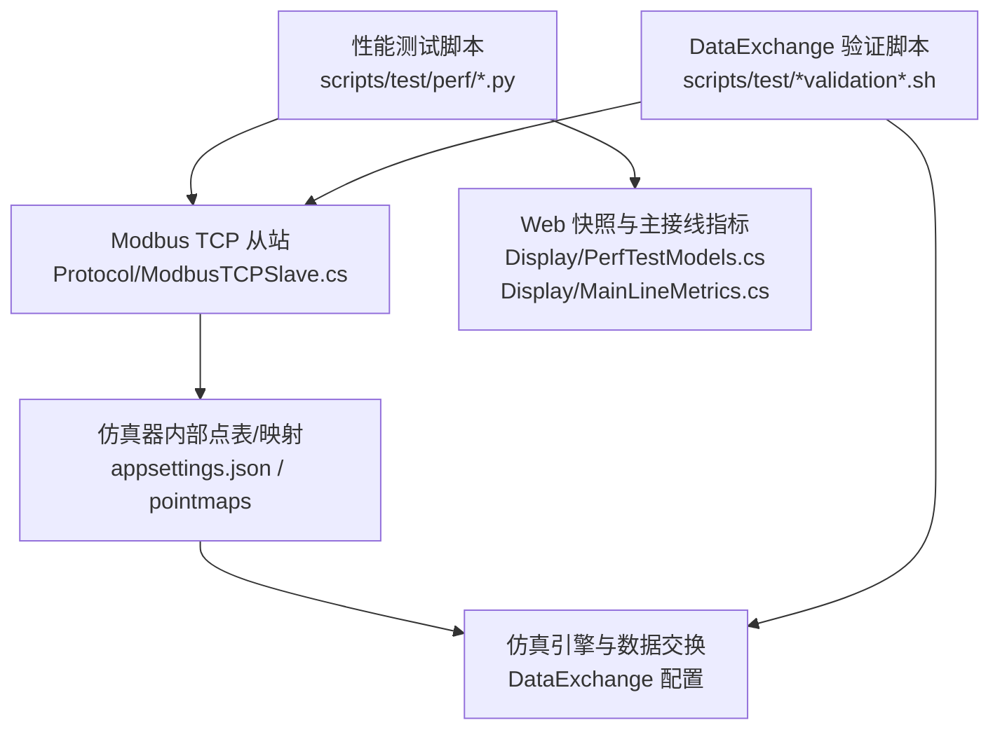
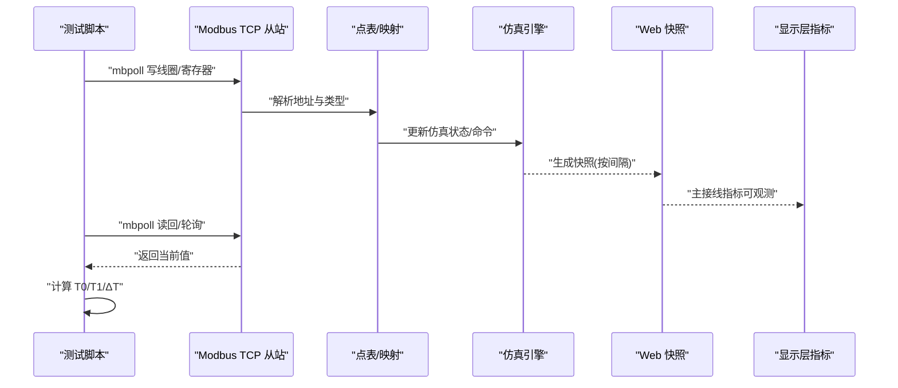
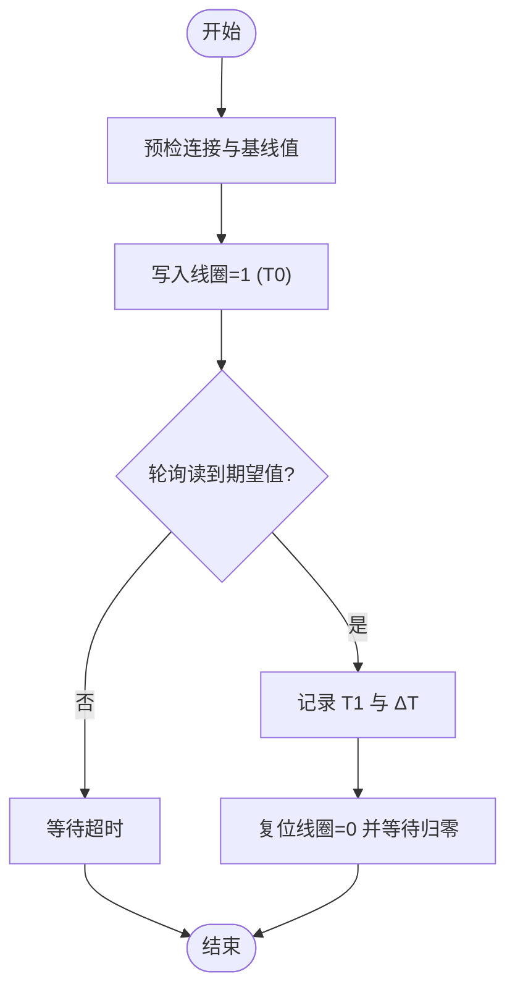
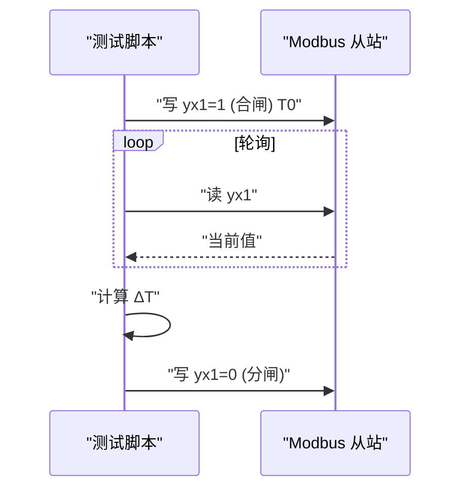
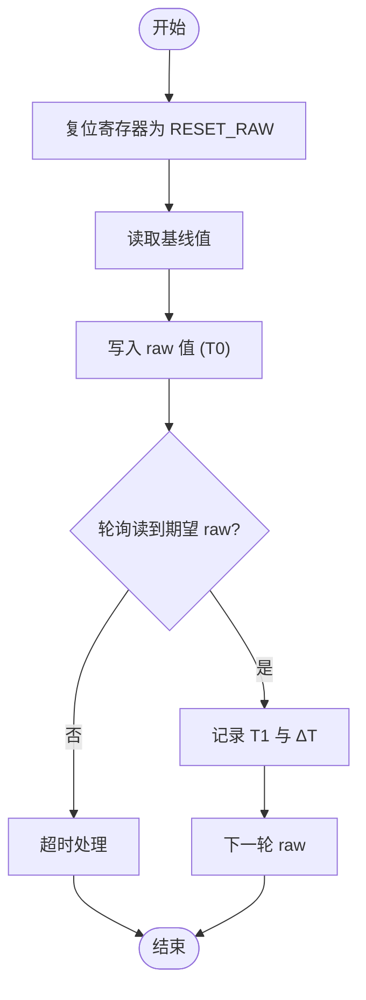
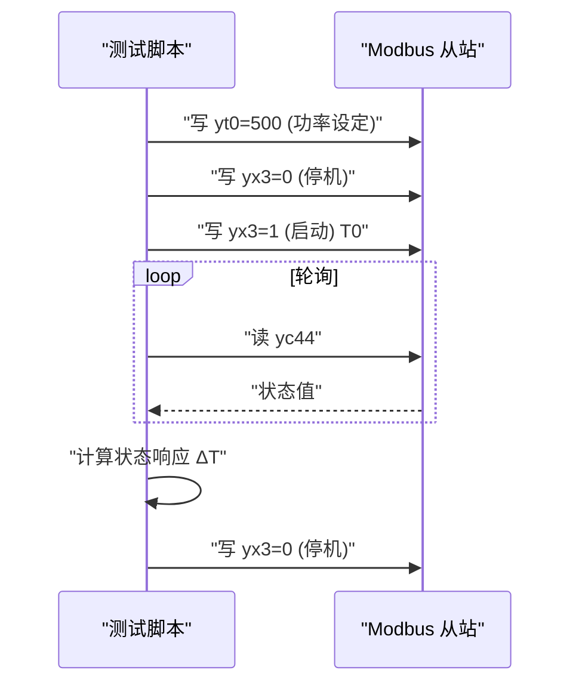

# 性能测试

<cite>
**本文引用的文件**
- [run_tc_r01.py](file://scripts/test/perf/run_tc_r01.py)
- [run_tc_r02.py](file://scripts/test/perf/run_tc_r02.py)
- [run_tc_r03.py](file://scripts/test/perf/run_tc_r03.py)
- [run_tc_r04.py](file://scripts/test/perf/run_tc_r04.py)
- [run_tc_r05_pcs.py](file://scripts/test/perf/run_tc_r05_pcs.py)
- [PerfTestModels.cs](file://Display/PerfTestModels.cs)
- [MainLineMetrics.cs](file://Display/MainLineMetrics.cs)
- [appsettings.json](file://appsettings.json)
- [ModbusTCPSlave.cs](file://Protocol/ModbusTCPSlave.cs)
- [LocalControlModbusServer.cs](file://LocalControl/LocalControlModbusServer.cs)
- [run-bms-dataexchange-validation.sh](file://scripts/test/run-bms-dataexchange-validation.sh)
- [validate-bms-dataexchange.sh](file://scripts/test/validate-bms-dataexchange.sh)
</cite>

## 目录
1. [简介](#简介)
2. [项目结构](#项目结构)
3. [核心组件](#核心组件)
4. [架构总览](#架构总览)
5. [详细组件分析](#详细组件分析)
6. [依赖关系分析](#依赖关系分析)
7. [性能考虑](#性能考虑)
8. [故障排查指南](#故障排查指南)
9. [结论](#结论)
10. [附录](#附录)

## 简介
本文件面向储能仿真系统的性能测试，覆盖策略、场景设计、指标定义、脚本使用与参数配置，以及负载、压力、稳定性测试的实施方法。重点围绕仿真引擎运行周期、通信链路（Modbus TCP）、控制与遥测管道、Web 快照刷新等关键路径，提供可复现的基准建立、结果分析与优化建议。

## 项目结构
仓库中与性能测试直接相关的代码与脚本主要分布在以下位置：
- 性能测试脚本：scripts/test/perf 下的 Python 脚本，通过 mbpoll 对 BMS/EMU/PCS 的 Modbus 端口进行写读，测量端到端延迟。
- 显示层性能模型：Display/PerfTestModels.cs、Display/MainLineMetrics.cs，用于驱动/观测模式的主接线量变化与 UI 帧时延度量。
- 运行时配置：appsettings.json，包含仿真步长、传播间隔、Web 快照间隔、Modbus 端口分配等关键性能相关参数。
- 通信从站实现：Protocol/ModbusTCPSlave.cs、LocalControl/LocalControlModbusServer.cs，承载 Modbus TCP 服务与寄存器映射。
- DataExchange 验证脚本：scripts/test/run-bms-dataexchange-validation.sh 与 validate-bms-dataexchange.sh，用于启动仿真并校验数据交换通路。

图表来源
- [run_tc_r01.py:1-101](file://scripts/test/perf/run_tc_r01.py#L1-L101)
- [run_tc_r02.py:1-112](file://scripts/test/perf/run_tc_r02.py#L1-L112)
- [run_tc_r03.py:1-101](file://scripts/test/perf/run_tc_r03.py#L1-L101)
- [run_tc_r04.py:1-100](file://scripts/test/perf/run_tc_r04.py#L1-L100)
- [run_tc_r05_pcs.py:1-167](file://scripts/test/perf/run_tc_r05_pcs.py#L1-L167)
- [ModbusTCPSlave.cs:1-30](file://Protocol/ModbusTCPSlave.cs#L1-L30)
- [appsettings.json:1-120](file://appsettings.json#L1-L120)
- [PerfTestModels.cs:1-72](file://Display/PerfTestModels.cs#L1-L72)
- [MainLineMetrics.cs:1-109](file://Display/MainLineMetrics.cs#L1-L109)

章节来源
- [run_tc_r01.py:1-101](file://scripts/test/perf/run_tc_r01.py#L1-L101)
- [run_tc_r02.py:1-112](file://scripts/test/perf/run_tc_r02.py#L1-L112)
- [run_tc_r03.py:1-101](file://scripts/test/perf/run_tc_r03.py#L1-L101)
- [run_tc_r04.py:1-100](file://scripts/test/perf/run_tc_r04.py#L1-L100)
- [run_tc_r05_pcs.py:1-167](file://scripts/test/perf/run_tc_r05_pcs.py#L1-L167)
- [PerfTestModels.cs:1-72](file://Display/PerfTestModels.cs#L1-L72)
- [MainLineMetrics.cs:1-109](file://Display/MainLineMetrics.cs#L1-L109)
- [appsettings.json:1-120](file://appsettings.json#L1-L120)
- [ModbusTCPSlave.cs:1-30](file://Protocol/ModbusTCPSlave.cs#L1-L30)

## 核心组件
- 性能测试脚本族（Python）：通过 mbpoll 对 BMS/EMU/PCS 的线圈、保持寄存器、输入状态进行写读，记录触发时刻 T0 与监控到期望值的时刻 T1，计算 ΔT，评估端到端响应时间。
- 显示层性能模型：定义“驱动”和“观测”两种模式，支持以主接线指标作为观测目标，输出指令到快照可见、界面帧刷新的时延。
- 运行时配置：集中管理仿真集成步长、传播间隔、Web 快照间隔、Modbus 端口基址与步进、热系统开关等影响性能的关键参数。
- Modbus TCP 从站：封装 NModbus 从站网络，将请求路由至点表映射与后端寄存器镜像，支撑外部工具（如 mbpoll）访问。
- DataExchange 验证脚本：自动准备环境、启动仿真、等待端口就绪、执行读写验证并检查日志关键字，确保数据交换通路可用。

章节来源
- [PerfTestModels.cs:10-46](file://Display/PerfTestModels.cs#L10-L46)
- [MainLineMetrics.cs:8-106](file://Display/MainLineMetrics.cs#L8-L106)
- [appsettings.json:2-120](file://appsettings.json#L2-L120)
- [ModbusTCPSlave.cs:12-30](file://Protocol/ModbusTCPSlave.cs#L12-L30)
- [run-bms-dataexchange-validation.sh:1-75](file://scripts/test/run-bms-dataexchange-validation.sh#L1-L75)
- [validate-bms-dataexchange.sh:1-101](file://scripts/test/validate-bms-dataexchange.sh#L1-L101)

## 架构总览
下图展示性能测试在系统中的调用链路与数据流：测试脚本通过 mbpoll 向 Modbus TCP 从站写入或读取寄存器；从站根据点表映射更新仿真内部状态；仿真引擎按配置周期推进；Web 快照按固定间隔发布；显示层指标可用于观测主接线变化。

图表来源
- [run_tc_r01.py:26-52](file://scripts/test/perf/run_tc_r01.py#L26-L52)
- [run_tc_r02.py:27-53](file://scripts/test/perf/run_tc_r02.py#L27-L53)
- [run_tc_r03.py:31-57](file://scripts/test/perf/run_tc_r03.py#L31-L57)
- [run_tc_r04.py:30-56](file://scripts/test/perf/run_tc_r04.py#L30-L56)
- [run_tc_r05_pcs.py:29-83](file://scripts/test/perf/run_tc_r05_pcs.py#L29-L83)
- [ModbusTCPSlave.cs:21-30](file://Protocol/ModbusTCPSlave.cs#L21-L30)
- [appsettings.json:53-97](file://appsettings.json#L53-L97)
- [MainLineMetrics.cs:8-106](file://Display/MainLineMetrics.cs#L8-L106)

## 详细组件分析

### 组件A：BMS 同点位触发与监控（TC-R01）
- 目的：测量对 BMS 某遥信线圈写入后，同一点位读回的端到端延迟。
- 关键点：
  - 端口与从站：BMS 端口 1501，从站 1，地址 1005。
  - 轮询间隔：约 0.05 秒。
  - 判定标准：ΔT ≤ 700 ms。
  - 多轮统计：默认 3 轮，输出平均/最大/最小 ΔT。
- 使用方法：
  - 确保仿真器已启动且端口 1501 监听。
  - 运行脚本：python3 scripts/test/perf/run_tc_r01.py
  - 如需调整，修改脚本中的 HOST、BMS_PORT、SLAVE、ADDR、LABEL、POLL_S、ROUNDS 等常量。

图表来源
- [run_tc_r01.py:26-75](file://scripts/test/perf/run_tc_r01.py#L26-L75)

章节来源
- [run_tc_r01.py:1-101](file://scripts/test/perf/run_tc_r01.py#L1-L101)

### 组件B：EMU 断路器同点位触发与监控（TC-R02）
- 目的：对 EMU 低压断路器 yx1 进行合闸/分闸操作，测量同点读回延迟。
- 关键点：
  - 端口与从站：EMU 端口 1601，从站 1，地址 1001。
  - 轮询间隔：约 0.05 秒；超时：5 秒。
  - 判定标准：ΔT ≤ 700 ms。
  - 多轮统计：分别对合闸 set 1 与分闸 set 0 各测 3 轮。
- 使用方法：
  - 确保仿真器已启动且端口 1601 监听。
  - 运行脚本：python3 scripts/test/perf/run_tc_r02.py
  - 可调参数：HOST、EMU_PORT、SLAVE、ADDR、LABEL、POLL_S、ROUNDS、TIMEOUT_S。

图表来源
- [run_tc_r02.py:27-77](file://scripts/test/perf/run_tc_r02.py#L27-L77)

章节来源
- [run_tc_r02.py:1-112](file://scripts/test/perf/run_tc_r02.py#L1-L112)

### 组件C：BMS rack 模拟量变位（TC-R03）
- 目的：对 BMS rack yt4 保持寄存器写入不同 raw 值，测量同点读回延迟。
- 关键点：
  - 端口与从站：BMS 端口 1501，从站 2，地址 40004。
  - Scale：10（raw = 物理量 × Scale）。
  - 测试 raw：13500、13600、13700。
  - 判定标准：ΔT ≤ 700 ms。
- 使用方法：
  - 运行脚本：python3 scripts/test/perf/run_tc_r03.py
  - 可调参数：HOST、BMS_PORT、SLAVE、ADDR、LABEL、SCALE、TEST_RAWS、POLL_S、ROUNDS、TIMEOUT_S。

图表来源
- [run_tc_r03.py:31-75](file://scripts/test/perf/run_tc_r03.py#L31-L75)

章节来源
- [run_tc_r03.py:1-101](file://scripts/test/perf/run_tc_r03.py#L1-L101)

### 组件D：EMU yt2 模拟量变位（TC-R04）
- 目的：对 EMU yt2 保持寄存器写入不同 raw 值，测量同点读回延迟。
- 关键点：
  - 端口与从站：EMU 端口 1601，从站 1，地址 40002。
  - Scale：1000（raw = 物理量 × Scale）。
  - 测试 raw：900、950、980。
  - 判定标准：ΔT ≤ 700 ms。
- 使用方法：
  - 运行脚本：python3 scripts/test/perf/run_tc_r04.py
  - 可调参数：HOST、EMU_PORT、SLAVE、ADDR、LABEL、SCALE、TEST_RAWS、POLL_S、ROUNDS、TIMEOUT_S。

章节来源
- [run_tc_r04.py:1-100](file://scripts/test/perf/run_tc_r04.py#L1-L100)

### 组件E：PCS 启停控制与状态监控（TC-R05/R06）
- 目的：通过 mbpoll 写 PCS1 启停线圈 yx3，监控仿真器运行状态 yc44，测量 ΔT。
- 关键点：
  - 端口与从站：EMU 端口 1601，从站 1。
  - 线圈地址：yx3=1003；状态地址：yc44=10053。
  - 功率设置：yt0=40000，raw=500。
  - 轮询间隔：约 0.05 秒；超时：1.5 秒。
  - 判定标准：状态响应 ΔT ≤ 700 ms。
- 使用方法：
  - 运行脚本：python3 scripts/test/perf/run_tc_r05_pcs.py
  - 可调参数：HOST、EMU_PORT、SLAVE、COIL_ADDR、STATUS_ADDR、YT0_ADDR、POLL_S、ROUNDS、TIMEOUT_S、POWER_RAW。

图表来源
- [run_tc_r05_pcs.py:29-135](file://scripts/test/perf/run_tc_r05_pcs.py#L29-L135)

章节来源
- [run_tc_r05_pcs.py:1-167](file://scripts/test/perf/run_tc_r05_pcs.py#L1-L167)

### 组件F：显示层性能用例模型
- 目的：定义“驱动”与“观测”两种性能用例模式，支持以主接线指标作为观测目标，输出指令到快照可见、界面帧刷新的时延。
- 关键点：
  - PerfTestSuite：名称、描述、模式（drive/observe）、用例集合。
  - PerfDriveCase：名称、指标、命令、超时、容差、稳定时间。
  - PerfObserveCase：名称、观测目标（snapshot/dpc）、触发命令、超时、容差、稳定时间。
  - PerfWatchTarget：Type（snapshot/dpc）、Metric、Target。
  - PerfTestResultRow：套件、用例、模式、指令时刻、快照时刻、UI 帧时刻、是否成功、备注。
- 使用方法：
  - 通过 Display 层提供的指标解析能力，组合主接线指标（如 mainBreaker.closed、load.activePowerKw、unit.N.pcsA.activePowerKw、unit.N.bmsA.soc）构建用例。
  - 结合 Web 快照间隔与 UI 刷新周期，评估端到端可视化时延。

章节来源
- [PerfTestModels.cs:10-72](file://Display/PerfTestModels.cs#L10-L72)
- [MainLineMetrics.cs:8-106](file://Display/MainLineMetrics.cs#L8-L106)

## 依赖关系分析
- 测试脚本依赖外部工具 mbpoll，通过 TCP 访问 Modbus 从站。
- Modbus 从站依赖 NModbus 库与点表映射，将请求转换为仿真内部状态变更。
- 仿真引擎受 appsettings.json 中传播间隔、快照间隔等参数影响，直接影响端到端延迟。
- 显示层指标依赖 Web 快照与主接线快照数据结构，用于 UI 刷新时延评估。

图表来源
- [run_tc_r01.py:26-52](file://scripts/test/perf/run_tc_r01.py#L26-L52)
- [ModbusTCPSlave.cs:21-30](file://Protocol/ModbusTCPSlave.cs#L21-L30)
- [appsettings.json:53-97](file://appsettings.json#L53-L97)
- [MainLineMetrics.cs:8-106](file://Display/MainLineMetrics.cs#L8-L106)

章节来源
- [run_tc_r01.py:26-52](file://scripts/test/perf/run_tc_r01.py#L26-L52)
- [ModbusTCPSlave.cs:21-30](file://Protocol/ModbusTCPSlave.cs#L21-L30)
- [appsettings.json:53-97](file://appsettings.json#L53-L97)
- [MainLineMetrics.cs:8-106](file://Display/MainLineMetrics.cs#L8-L106)

## 性能考虑
- 仿真引擎与数据交换
  - 集成步长与传播间隔：PropagationIntervalMs 越小，仿真推进越频繁，可能提升响应但增加 CPU 占用。
  - 热系统开关：Thermal.Enabled 开启会增加热模型计算开销。
  - DataExchange 间隔：TelemetryIntervalMs、EmuTelemetryIntervalMs、ControlPollIntervalMs 影响遥测与控制反馈频率。
- 通信链路
  - Modbus TCP 端口与从站数量：BaseBmsModbusPort、BaseEmuModbusPort 及步进决定并发连接数与资源占用。
  - 轮询间隔：测试脚本中的 POLL_S 过小会导致高频 I/O，过大则降低灵敏度。
- 可视化与快照
  - Web 快照间隔：SnapshotIntervalMs 影响 UI 刷新频率与网络负载。
  - 主接线指标解析：MainLineMetrics 支持的指标可直接用于性能观测。
- 内存与资源
  - 大规模 ESSUnits 配置会显著增加内存与计算负担，建议在性能测试中逐步扩展单元数量。
  - 热模型与电气传播迭代次数（PropagationQuvMaxIterations）会影响每步计算成本。

[本节为通用性能指导，不直接分析具体文件]

## 故障排查指南
- 无法连接 Modbus 端口
  - 现象：脚本预检失败，提示无法读取 BMS/EMU。
  - 排查：确认仿真器已启动，端口 1501/1601 处于监听状态；检查防火墙与端口占用。
  - 参考：脚本预检逻辑与错误输出。
- DataExchange 未启动
  - 现象：日志中未出现 DataExchange simBms1 已启动。
  - 排查：使用 run-bms-dataexchange-validation.sh 启动仿真并检查日志；确认 appsettings.validation.json 已正确复制。
- 脉冲信号未归零
  - 现象：写 param11=1 后读回不为 0。
  - 排查：确认 BmsLinkService 消费逻辑正常；检查日志中是否有 BMS-Control/Feedback 相关条目。
- 超时与误判
  - 现象：ΔT 超过阈值或未观察到变位。
  - 排查：适当增大 TIMEOUT_S；检查轮询间隔 POLL_S；确认仿真器处于正常运行状态。

章节来源
- [run_tc_r01.py:78-96](file://scripts/test/perf/run_tc_r01.py#L78-L96)
- [run_tc_r02.py:92-107](file://scripts/test/perf/run_tc_r02.py#L92-L107)
- [run-bms-dataexchange-validation.sh:36-75](file://scripts/test/run-bms-dataexchange-validation.sh#L36-L75)
- [validate-bms-dataexchange.sh:50-101](file://scripts/test/validate-bms-dataexchange.sh#L50-L101)

## 结论
本性能测试体系通过 Modbus TCP 写读与轮询机制，覆盖了数字量、模拟量与设备启停控制等典型场景，能够量化端到端响应延迟。结合显示层指标与 Web 快照间隔，可进一步评估可视化链路时延。建议在生产环境中基于本方案建立性能基准，定期回归验证，并根据实际负载与拓扑规模调优仿真与通信参数。

[本节为总结性内容，不直接分析具体文件]

## 附录
- 常用性能指标定义
  - ΔT：触发时刻 T0 到监控到期望值时刻 T1 的时间差，单位毫秒。
  - 平均/最大/最小 ΔT：多轮测试结果的统计值。
  - 达标率：满足 ΔT ≤ 700 ms 的用例比例。
- 推荐测试流程
  - 基础连通性：验证 Modbus 端口监听与基本读写。
  - 单点延迟：TC-R01 至 TC-R04，覆盖数字量与模拟量。
  - 设备控制：TC-R05/R06，PCS 启停与状态监控。
  - 可视化时延：基于 PerfTestModels 与 MainLineMetrics 构建 drive/observe 用例。
  - 稳定性测试：延长运行时间，观察内存与 CPU 趋势，重复执行用例集。
- 参数调优建议
  - 若 ΔT 偏高：减小 PropagationIntervalMs、SnapshotIntervalMs；适度增大 ControlPollIntervalMs。
  - 若 CPU 占用过高：减少 ESSUnits 数量、关闭非必要热模型、降低轮询频率。
  - 若网络拥塞：降低轮询间隔、合并批量读、限制并发连接数。

[本节为补充信息，不直接分析具体文件]