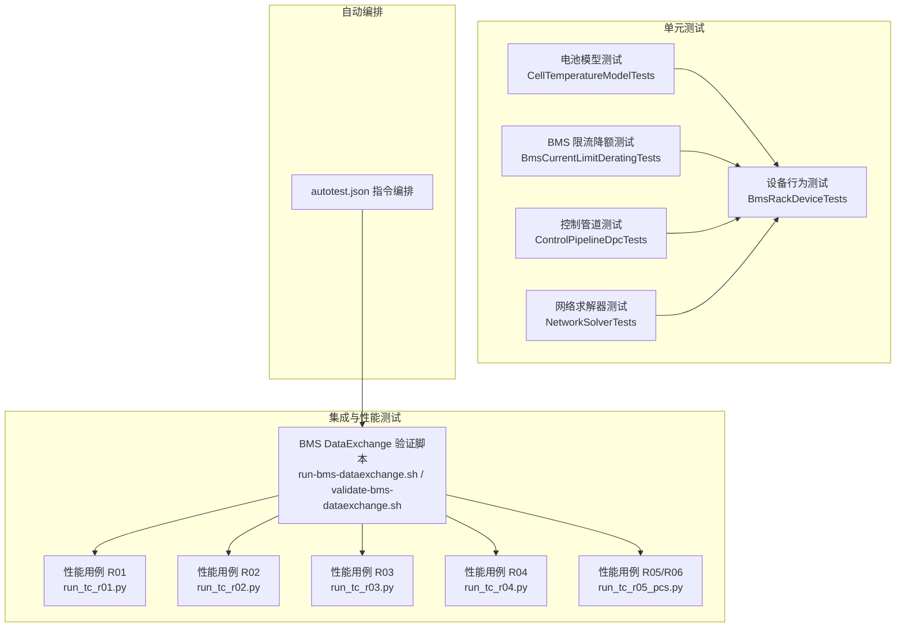
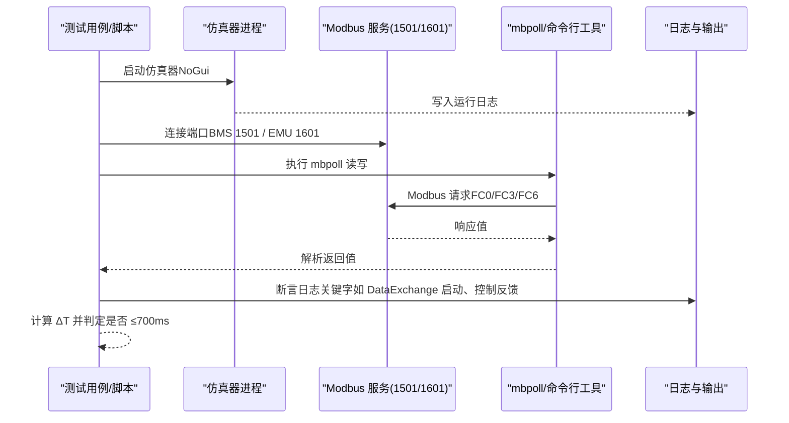
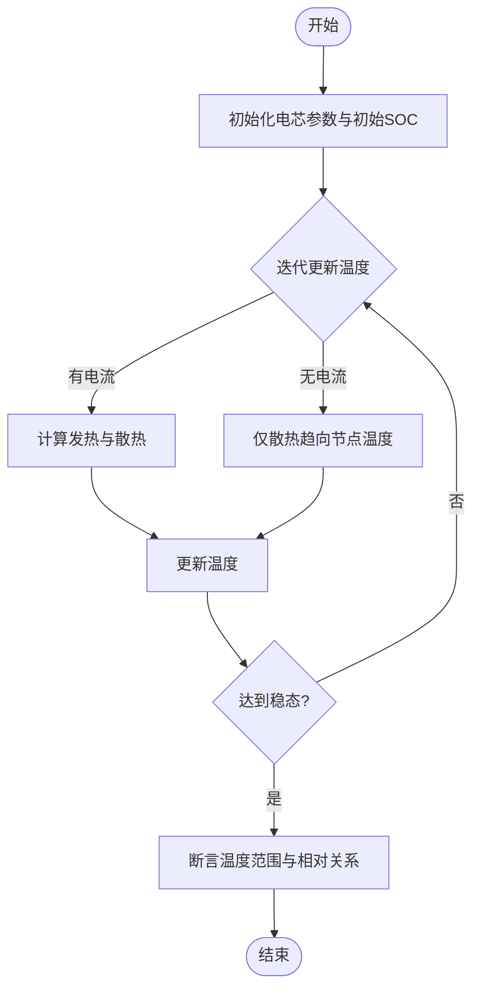
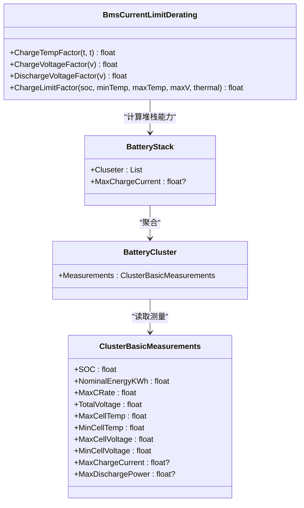
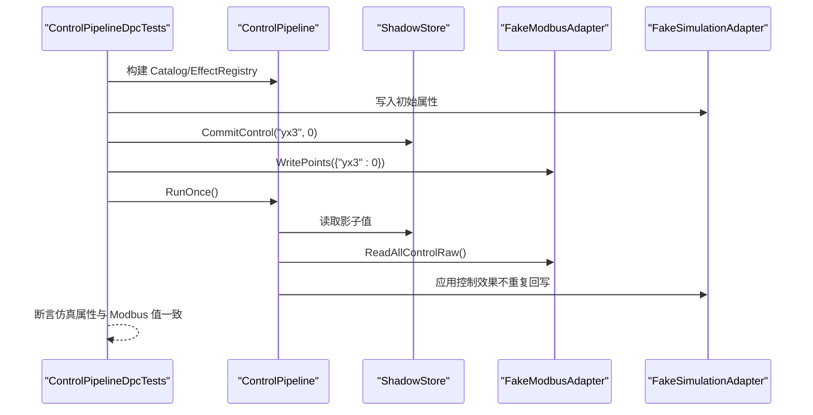
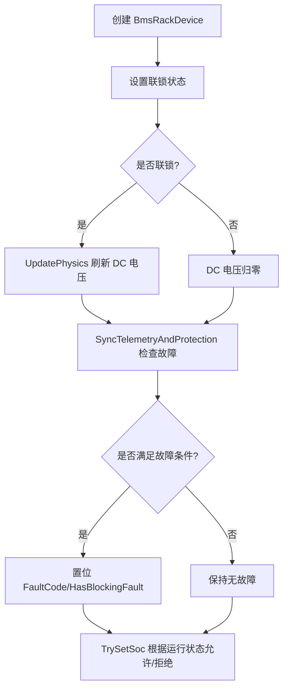
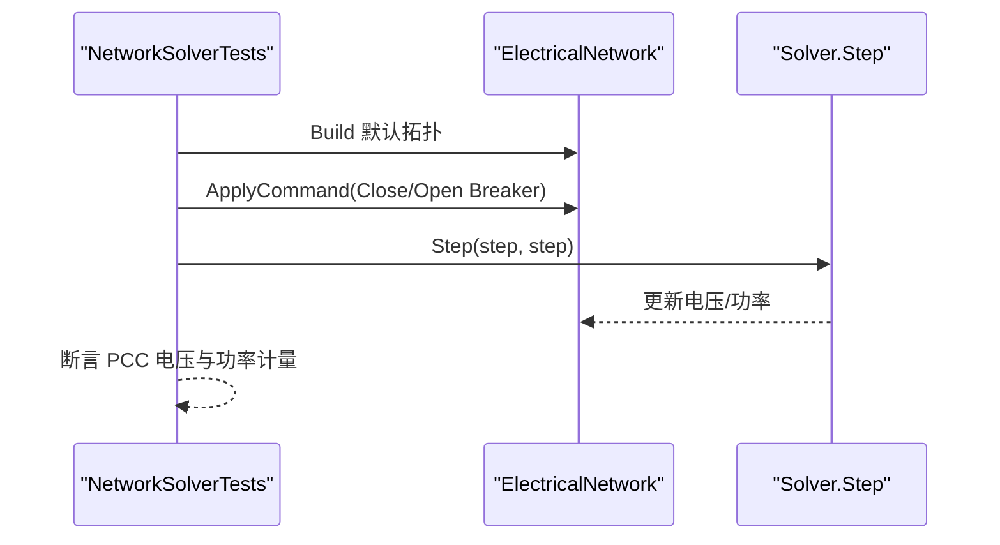
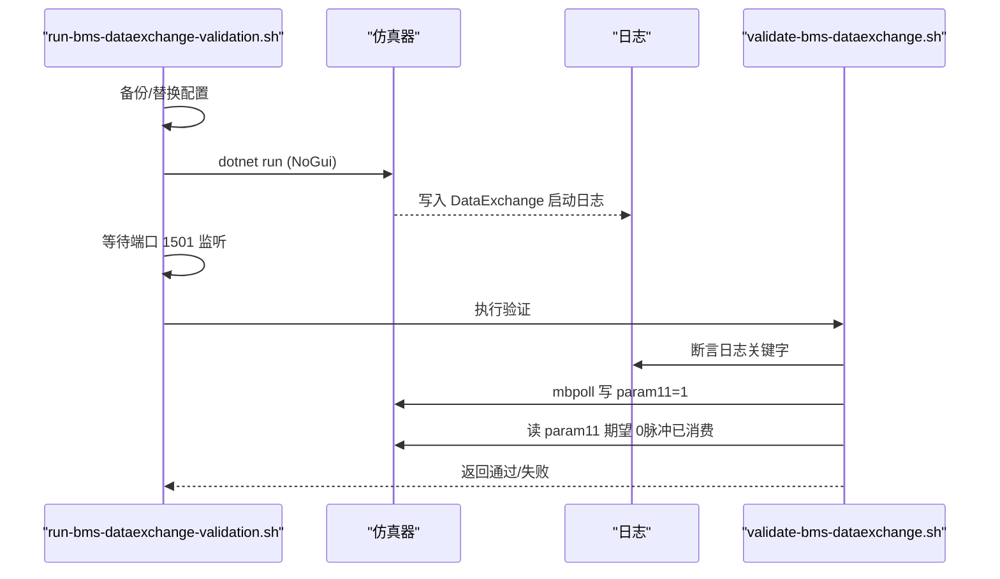
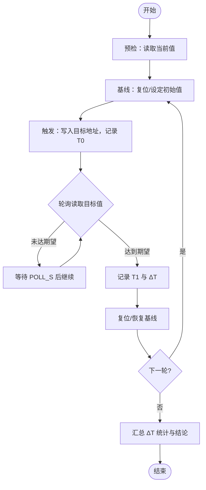
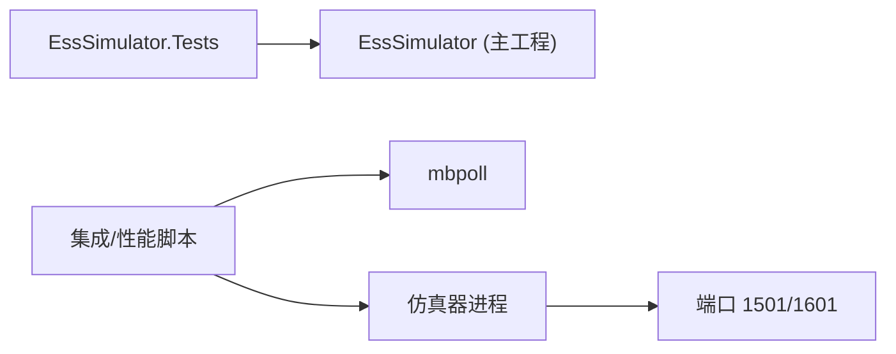

# 测试和验证

<cite>
**本文引用的文件**
- [EssSimulator.Tests.csproj](file://EssSimulator.Tests/EssSimulator.Tests.csproj)
- [CellTemperatureModelTests.cs](file://EssSimulator.Tests/Battery/CellTemperatureModelTests.cs)
- [BmsCurrentLimitDeratingTests.cs](file://EssSimulator.Tests/Bms/BmsCurrentLimitDeratingTests.cs)
- [ControlPipelineDpcTests.cs](file://EssSimulator.Tests/DataExchange/ControlPipelineDpcTests.cs)
- [BmsRackDeviceTests.cs](file://EssSimulator.Tests/Devices/BmsRackDeviceTests.cs)
- [NetworkSolverTests.cs](file://EssSimulator.Tests/Solver/NetworkSolverTests.cs)
- [run-bms-dataexchange-validation.sh](file://scripts/test/run-bms-dataexchange-validation.sh)
- [validate-bms-dataexchange.sh](file://scripts/test/validate-bms-dataexchange.sh)
- [run_tc_r01.py](file://scripts/test/perf/run_tc_r01.py)
- [run_tc_r02.py](file://scripts/test/perf/run_tc_r02.py)
- [run_tc_r03.py](file://scripts/test/perf/run_tc_r03.py)
- [run_tc_r04.py](file://scripts/test/perf/run_tc_r04.py)
- [run_tc_r05_pcs.py](file://scripts/test/perf/run_tc_r05_pcs.py)
- [autotest.json](file://autotest.json)
</cite>

## 目录
1. [简介](#简介)
2. [项目结构](#项目结构)
3. [核心组件](#核心组件)
4. [架构总览](#架构总览)
5. [详细组件分析](#详细组件分析)
6. [依赖关系分析](#依赖关系分析)
7. [性能考虑](#性能考虑)
8. [故障排查指南](#故障排查指南)
9. [结论](#结论)
10. [附录](#附录)

## 简介
本文件面向储能仿真系统的测试与验证体系，覆盖单元测试策略、集成测试与性能测试的实施方法、自动化脚本与测试数据管理，以及电池模型、BMS功能、通信协议等关键场景的测试方法与执行流程。文档同时提供测试环境搭建、执行与结果分析的实操指导，帮助读者快速建立可重复、可度量、可扩展的测试流水线。

## 项目结构
测试相关代码与脚本主要分布在以下位置：
- 单元测试：位于 EssSimulator.Tests 目录，基于 xUnit 框架组织，按领域分层（Battery、Bms、DataExchange、Devices、Solver 等）。
- 集成与性能测试：位于 scripts/test 目录，包含 BMS/EMU DataExchange 本地验证脚本与多组性能用例（TC-R01~R05），通过 mbpoll 驱动 Modbus 读写并统计响应时延。
- 自动测试编排：autotest.json 定义指令序列，用于端到端场景编排（如 DPC 控制、故障注入等）。

**章节来源**
- [EssSimulator.Tests.csproj:1-27](file://EssSimulator.Tests/EssSimulator.Tests.csproj#L1-L27)
- [run-bms-dataexchange-validation.sh:1-75](file://scripts/test/run-bms-dataexchange-validation.sh#L1-L75)
- [validate-bms-dataexchange.sh:1-101](file://scripts/test/validate-bms-dataexchange.sh#L1-L101)
- [run_tc_r01.py:1-101](file://scripts/test/perf/run_tc_r01.py#L1-L101)
- [run_tc_r02.py:1-112](file://scripts/test/perf/run_tc_r02.py#L1-L112)
- [run_tc_r03.py:1-101](file://scripts/test/perf/run_tc_r03.py#L1-L101)
- [run_tc_r04.py:1-100](file://scripts/test/perf/run_tc_r04.py#L1-L100)
- [run_tc_r05_pcs.py:1-167](file://scripts/test/perf/run_tc_r05_pcs.py#L1-L167)
- [autotest.json:1-58](file://autotest.json#L1-L58)

## 核心组件
- 单元测试框架与覆盖率
  - 测试框架：xUnit + Microsoft.NET.Test.Sdk + Visual Studio Runner。
  - 覆盖率工具：coverlet.collector，支持生成覆盖率报告（JSON/XML/Info）。
  - 目标框架：net8.0，启用隐式 using 与 nullable。
- 测试分类与职责
  - 电池模型测试：电芯温度演化、热平衡收敛、节点温度对散热的影响。
  - BMS 功能测试：电流限流降额曲线、堆栈最大充放电能力、保护逻辑。
  - 数据交换与控制管道：Modbus 映射、影子存储、控制效果应用与回读一致性。
  - 设备级测试：BMS 机架状态同步、联锁与物理端口电压更新、SOC 设置约束。
  - 求解器测试：主断路器分合闸对 PCC 电压与功率计的影响。
- 集成与性能测试
  - BMS/EMU DataExchange 本地验证：启动仿真器、校验端口监听、mbpoll 读写脉冲与日志断言。
  - 性能用例：以 mbpoll 触发并轮询同一点位或关联状态，记录 T0/T1/ΔT，评估 ≤700ms 达标率。
- 自动编排
  - autotest.json 提供步骤化指令（dpc set、sleep、script）用于端到端场景编排。

**章节来源**
- [EssSimulator.Tests.csproj:1-27](file://EssSimulator.Tests/EssSimulator.Tests.csproj#L1-L27)
- [CellTemperatureModelTests.cs:1-80](file://EssSimulator.Tests/Battery/CellTemperatureModelTests.cs#L1-L80)
- [BmsCurrentLimitDeratingTests.cs:1-117](file://EssSimulator.Tests/Bms/BmsCurrentLimitDeratingTests.cs#L1-L117)
- [ControlPipelineDpcTests.cs:1-107](file://EssSimulator.Tests/DataExchange/ControlPipelineDpcTests.cs#L1-L107)
- [BmsRackDeviceTests.cs:1-199](file://EssSimulator.Tests/Devices/BmsRackDeviceTests.cs#L1-L199)
- [NetworkSolverTests.cs:1-65](file://EssSimulator.Tests/Solver/NetworkSolverTests.cs#L1-L65)
- [run-bms-dataexchange-validation.sh:1-75](file://scripts/test/run-bms-dataexchange-validation.sh#L1-L75)
- [validate-bms-dataexchange.sh:1-101](file://scripts/test/validate-bms-dataexchange.sh#L1-L101)
- [run_tc_r01.py:1-101](file://scripts/test/perf/run_tc_r01.py#L1-L101)
- [run_tc_r02.py:1-112](file://scripts/test/perf/run_tc_r02.py#L1-L112)
- [run_tc_r03.py:1-101](file://scripts/test/perf/run_tc_r03.py#L1-L101)
- [run_tc_r04.py:1-100](file://scripts/test/perf/run_tc_r04.py#L1-L100)
- [run_tc_r05_pcs.py:1-167](file://scripts/test/perf/run_tc_r05_pcs.py#L1-L167)
- [autotest.json:1-58](file://autotest.json#L1-L58)

## 架构总览
下图展示从测试入口到被测系统的数据流与交互路径，涵盖单元测试、集成验证与性能测试三类场景。

**图表来源**
- [run-bms-dataexchange-validation.sh:1-75](file://scripts/test/run-bms-dataexchange-validation.sh#L1-L75)
- [validate-bms-dataexchange.sh:1-101](file://scripts/test/validate-bms-dataexchange.sh#L1-L101)
- [run_tc_r01.py:1-101](file://scripts/test/perf/run_tc_r01.py#L1-L101)
- [run_tc_r02.py:1-112](file://scripts/test/perf/run_tc_r02.py#L1-L112)
- [run_tc_r03.py:1-101](file://scripts/test/perf/run_tc_r03.py#L1-L101)
- [run_tc_r04.py:1-100](file://scripts/test/perf/run_tc_r04.py#L1-L100)
- [run_tc_r05_pcs.py:1-167](file://scripts/test/perf/run_tc_r05_pcs.py#L1-L167)

## 详细组件分析

### 电池模型测试（单元）
- 测试目标
  - 电芯温度独立演化：相同规格下，有电流的电芯温升更大，无电流电芯向节点温度收敛。
  - 稳态温升收敛：在给定节点温度与内阻条件下，温度应趋于理论稳态区间。
  - 节点温度影响散热：节点温度越高，散热系数越低，相对节点温升越大。
- 实现要点
  - 构造不同初始条件与负载，迭代更新温度，断言温度范围与相对关系。
  - 使用固定时间步长与参数，确保可重复性。
- 复杂度与性能
  - 迭代次数为常数规模（数百至一千余步），时间复杂度 O(N)，内存占用低。
- 优化建议
  - 将热点循环参数化，便于批量回归；结合覆盖率统计确认分支覆盖。

**图表来源**
- [CellTemperatureModelTests.cs:1-80](file://EssSimulator.Tests/Battery/CellTemperatureModelTests.cs#L1-L80)

**章节来源**
- [CellTemperatureModelTests.cs:1-80](file://EssSimulator.Tests/Battery/CellTemperatureModelTests.cs#L1-L80)

### BMS 功能测试（单元）
- 测试目标
  - 充电/放电电流限流降额曲线：温度与电压对限流系数的影响。
  - 堆栈最大充放电能力：集群叠加与电压降额的综合效果。
  - 保护逻辑：高 SOC 充电、低 SOC 放电时的故障置位与清除。
- 实现要点
  - 使用 Theory/InlineData 进行多参数组合验证。
  - 构造 BatteryStack 与 ClusterBasicMeasurements，断言 MaxChargeCurrent/MaxDischargePower。
- 复杂度与性能
  - 单测多为常数时间操作，适合快速回归。
- 优化建议
  - 将曲线点扩展为边界值集合，增强鲁棒性；加入异常输入（越界电压/温度）的防御性断言。

**图表来源**
- [BmsCurrentLimitDeratingTests.cs:1-117](file://EssSimulator.Tests/Bms/BmsCurrentLimitDeratingTests.cs#L1-L117)

**章节来源**
- [BmsCurrentLimitDeratingTests.cs:1-117](file://EssSimulator.Tests/Bms/BmsCurrentLimitDeratingTests.cs#L1-L117)

### 数据交换与控制管道（单元）
- 测试目标
  - 控制点映射与效果应用：Modbus 寄存器到仿真对象属性的绑定与生效。
  - 影子存储与回读一致性：避免不必要的回写与状态抖动。
- 实现要点
  - 使用 FakeSimulationAdapter 与 FakeModbusAdapter 模拟后端。
  - 配置 PointBinding 与 ControlEffectId，调用 ControlPipeline.RunOnce 后断言仿真状态与 Modbus 值一致。
- 复杂度与性能
  - 单次运行开销小，适合高频回归。
- 优化建议
  - 增加多点并发写入与冲突处理场景；引入时序断言保证幂等性。

**图表来源**
- [ControlPipelineDpcTests.cs:1-107](file://EssSimulator.Tests/DataExchange/ControlPipelineDpcTests.cs#L1-L107)

**章节来源**
- [ControlPipelineDpcTests.cs:1-107](file://EssSimulator.Tests/DataExchange/ControlPipelineDpcTests.cs#L1-L107)

### 设备级测试（单元）
- 测试目标
  - BMS 机架与 PCS 联锁：SetPcsLinked 更新 RackState。
  - 遥测与保护同步：高 SOC 充电、低 SOC 放电时置位故障码；空闲时无故障。
  - 物理端口电压：联锁状态下刷新 DC 电压，断开时归零。
  - SOC 设置约束：仅在待机允许设置，运行中拒绝。
- 实现要点
  - 使用 BmsRackFactory 创建机架，注入 BmsDataGenerator 样本数据。
  - 断言 FaultCode、HasBlockingFault、Port.Output.Dc.VoltageV 等。
- 复杂度与性能
  - 单测为轻量级对象操作，适合快速回归。
- 优化建议
  - 增加多簇集群场景与不一致 SOC 的边界情况；加入日志关键字断言。

**图表来源**
- [BmsRackDeviceTests.cs:1-199](file://EssSimulator.Tests/Devices/BmsRackDeviceTests.cs#L1-L199)

**章节来源**
- [BmsRackDeviceTests.cs:1-199](file://EssSimulator.Tests/Devices/BmsRackDeviceTests.cs#L1-L199)

### 求解器测试（单元）
- 测试目标
  - 主断路器闭合时 PCC 与站用母线电压接近标称值。
  - 主断路器打开时 PCC 电压为零，功率计报告零功率。
- 实现要点
  - 构建默认网络拓扑，下发 DeviceCommand 控制断路器。
  - 步进求解器并断言电压与功率计量。
- 复杂度与性能
  - 网络求解为数值计算，单测步数少，耗时可控。
- 优化建议
  - 增加扰动与收敛失败场景；对比不同拓扑配置的稳定性。

**图表来源**
- [NetworkSolverTests.cs:1-65](file://EssSimulator.Tests/Solver/NetworkSolverTests.cs#L1-L65)

**章节来源**
- [NetworkSolverTests.cs:1-65](file://EssSimulator.Tests/Solver/NetworkSolverTests.cs#L1-L65)

### 集成测试：BMS DataExchange 本地验证
- 目标
  - 验证仿真器启动后 BMS DataExchange 服务可用，端口监听正常。
  - 通过 mbpoll 写入脉冲参数并观察自动清零与日志反馈。
- 流程
  - 准备配置、构建发布版本、释放端口、启动仿真器（NoGui）。
  - 等待端口监听与服务日志就绪。
  - 执行 validate 脚本：断言日志关键字、端口监听、mbpoll 读写与日志变化。
- 结果判定
  - 通过：日志含启动信息、端口监听、mbpoll 成功且脉冲归零、日志含控制/反馈变更。
  - 失败：端口未监听、mbpoll 超时或返回值不符、日志缺失关键字。

**图表来源**
- [run-bms-dataexchange-validation.sh:1-75](file://scripts/test/run-bms-dataexchange-validation.sh#L1-L75)
- [validate-bms-dataexchange.sh:1-101](file://scripts/test/validate-bms-dataexchange.sh#L1-L101)

**章节来源**
- [run-bms-dataexchange-validation.sh:1-75](file://scripts/test/run-bms-dataexchange-validation.sh#L1-L75)
- [validate-bms-dataexchange.sh:1-101](file://scripts/test/validate-bms-dataexchange.sh#L1-L101)

### 性能测试：TC-R01~R05
- 目标
  - 测量控制点到监控点的响应时延 ΔT，要求 ≤700ms。
  - 覆盖 BMS/EMU 线圈与保持寄存器场景，包括 PCS 启停与状态监控。
- 通用流程
  - 预检：读取当前值，确认服务可达。
  - 基线：复位或设定初始值，等待稳定。
  - 触发：写入目标地址，记录 T0。
  - 监控：轮询读取目标值，直到等于期望值或超时，记录 T1 与 ΔT。
  - 汇总：统计平均/最大/最小 ΔT，判定通过率。
- 用例说明
  - R01：BMS bank yx5 同点触发与监控（线圈）。
  - R02：EMU yx1 低压断路器同点触发与监控（线圈）。
  - R03：BMS rack yt4 同点触发与监控（FC6 保持寄存器）。
  - R04：EMU yt2 同点触发与监控（FC6 保持寄存器）。
  - R05/R06：PCS1 启停控制（yx3）→ 监控运行状态（yc44）。

**图表来源**
- [run_tc_r01.py:1-101](file://scripts/test/perf/run_tc_r01.py#L1-L101)
- [run_tc_r02.py:1-112](file://scripts/test/perf/run_tc_r02.py#L1-L112)
- [run_tc_r03.py:1-101](file://scripts/test/perf/run_tc_r03.py#L1-L101)
- [run_tc_r04.py:1-100](file://scripts/test/perf/run_tc_r04.py#L1-L100)
- [run_tc_r05_pcs.py:1-167](file://scripts/test/perf/run_tc_r05_pcs.py#L1-L167)

**章节来源**
- [run_tc_r01.py:1-101](file://scripts/test/perf/run_tc_r01.py#L1-L101)
- [run_tc_r02.py:1-112](file://scripts/test/perf/run_tc_r02.py#L1-L112)
- [run_tc_r03.py:1-101](file://scripts/test/perf/run_tc_r03.py#L1-L101)
- [run_tc_r04.py:1-100](file://scripts/test/perf/run_tc_r04.py#L1-L100)
- [run_tc_r05_pcs.py:1-167](file://scripts/test/perf/run_tc_r05_pcs.py#L1-L167)

### 自动编排：autotest.json
- 目标
  - 通过声明式步骤编排端到端测试场景（如阶梯下调、故障注入、脚本执行）。
- 用法
  - 使用 dpc 命令对指定点进行 set 操作，支持 sleep 延时与 script 字段执行复合指令。
  - 适用于集成阶段的多设备联动与复杂工况复现。

**章节来源**
- [autotest.json:1-58](file://autotest.json#L1-L58)

## 依赖关系分析
- 测试工程依赖
  - xUnit 测试框架与 .NET Test SDK，配合 coverlet.collector 收集覆盖率。
  - 通过 ProjectReference 引用主工程，直接对内部类型进行白盒测试。
- 集成测试依赖
  - 外部工具 mbpoll 用于 Modbus 读写；脚本依赖 bash 环境与 lsof。
  - 仿真器需以 NoGui 模式运行，暴露 BMS/EMU 端口（1501/1601）。
- 耦合与内聚
  - 单元测试围绕具体模块设计，内聚度高；集成测试通过外部工具与进程间通信耦合，关注接口契约。
- 潜在循环依赖
  - 测试工程仅引用主工程，无反向依赖；脚本与主工程通过进程与端口解耦。

**图表来源**
- [EssSimulator.Tests.csproj:1-27](file://EssSimulator.Tests/EssSimulator.Tests.csproj#L1-L27)
- [run-bms-dataexchange-validation.sh:1-75](file://scripts/test/run-bms-dataexchange-validation.sh#L1-L75)
- [run_tc_r01.py:1-101](file://scripts/test/perf/run_tc_r01.py#L1-L101)

**章节来源**
- [EssSimulator.Tests.csproj:1-27](file://EssSimulator.Tests/EssSimulator.Tests.csproj#L1-L27)
- [run-bms-dataexchange-validation.sh:1-75](file://scripts/test/run-bms-dataexchange-validation.sh#L1-L75)
- [run_tc_r01.py:1-101](file://scripts/test/perf/run_tc_r01.py#L1-L101)

## 性能考虑
- 时延指标
  - 统一采用 ΔT ≤ 700ms 作为通过标准，覆盖线圈与保持寄存器场景。
- 采样频率
  - 轮询间隔 POLL_S 设为 0.05s，兼顾精度与开销。
- 资源占用
  - 脚本通过子进程调用 mbpoll，注意并发度与超时控制，避免阻塞。
- 优化建议
  - 将多轮次并行化（进程池）提升吞吐；引入更细粒度的计时（微秒级）提高精度。
  - 对热点路径（如控制管道）进行基准测试，识别瓶颈。

[本节为通用指导，无需特定文件来源]

## 故障排查指南
- 常见问题
  - 端口占用：脚本会尝试清理占用端口（lsof + kill），若仍失败请手动释放。
  - 仿真器异常退出：脚本会在超时或进程不可用时打印最后日志并退出。
  - mbpoll 无法读取：确认仿真器已启动且端口 1501/1601 可用。
  - 日志关键字缺失：检查 DataExchange 启动日志与控制/反馈日志路径。
- 定位步骤
  - 查看脚本输出与日志文件（/tmp/ess-bms-dx-validation.log 与 bin/Release/net8.0/Logs）。
  - 使用 lsof 检查端口监听状态。
  - 逐步执行脚本片段，定位失败环节。
- 修复建议
  - 调整超时与重试参数；确保 appsettings.validation.json 正确复制至发布目录。
  - 清理残留进程与临时文件后重试。

**章节来源**
- [run-bms-dataexchange-validation.sh:1-75](file://scripts/test/run-bms-dataexchange-validation.sh#L1-L75)
- [validate-bms-dataexchange.sh:1-101](file://scripts/test/validate-bms-dataexchange.sh#L1-L101)

## 结论
本测试与验证体系以 xUnit 为核心，覆盖电池模型、BMS 功能、数据交换与控制管道、设备行为与网络求解器等关键领域；通过 Bash 与 Python 脚本实现集成与性能测试，形成从单元到集成的完整闭环。建议持续完善用例库、强化覆盖率门禁与自动化流水线，以提升交付质量与回归效率。

[本节为总结性内容，无需特定文件来源]

## 附录
- 测试环境搭建
  - 安装 .NET 8 与 mbpoll；准备 appsettings.validation.json 并复制到发布目录。
  - 确保端口 1501/1601 未被占用。
- 执行方式
  - 单元测试：dotnet test（可附加 --collect:"XPlat Code Coverage" 生成覆盖率）。
  - 集成测试：scripts/test/run-bms-dataexchange-validation.sh。
  - 性能测试：scripts/test/perf/run_tc_r*.py。
  - 自动编排：依据 autotest.json 的步骤执行端到端场景。
- 结果分析
  - 单元测试：查看测试报告与覆盖率文件（coverage*.json/xml/info）。
  - 集成/性能：查看脚本输出与日志，统计 ΔT 与通过率。

[本节为补充信息，无需特定文件来源]