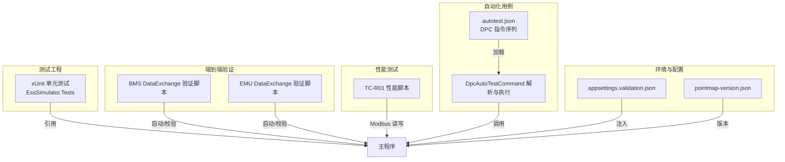
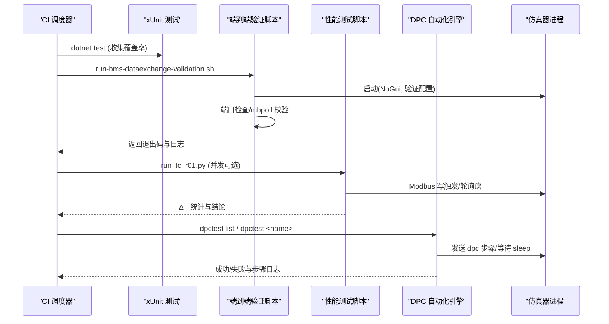
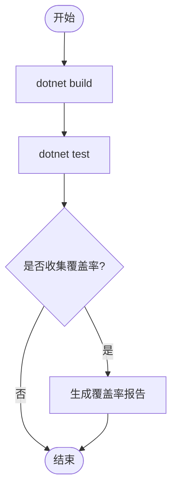
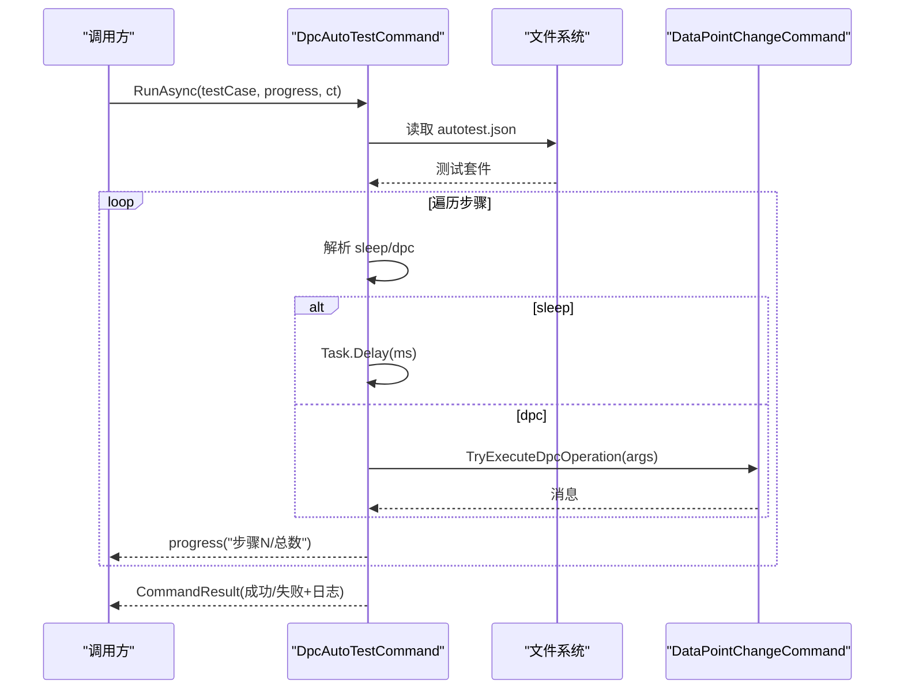
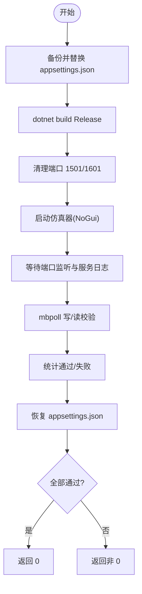
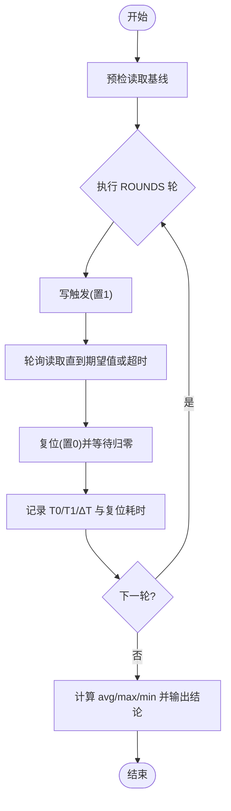
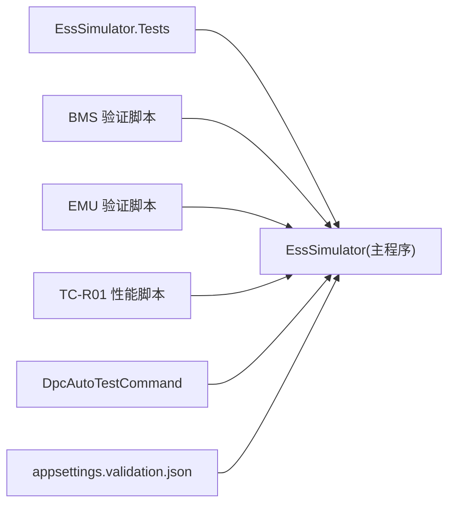

# 测试自动化

<cite>
**本文引用的文件**
- [EssSimulator.Tests.csproj](file://EssSimulator.Tests/EssSimulator.Tests.csproj)
- [DpcAutoTestCommand.cs](file://Display/DpcAutoTestCommand.cs)
- [autotest.json](file://autotest.json)
- [run-bms-dataexchange-validation.sh](file://scripts/test/run-bms-dataexchange-validation.sh)
- [validate-bms-dataexchange.sh](file://scripts/test/validate-bms-dataexchange.sh)
- [run-emu-dataexchange-validation.sh](file://scripts/test/run-emu-dataexchange-validation.sh)
- [run_tc_r01.py](file://scripts/test/perf/run_tc_r01.py)
- [appsettings.validation.json](file://appsettings.validation.json)
- [PerfTestModels.cs](file://Display/PerfTestModels.cs)
</cite>

## 目录
1. [简介](#简介)
2. [项目结构](#项目结构)
3. [核心组件](#核心组件)
4. [架构总览](#架构总览)
5. [详细组件分析](#详细组件分析)
6. [依赖关系分析](#依赖关系分析)
7. [性能考量](#性能考量)
8. [故障排查指南](#故障排查指南)
9. [结论](#结论)
10. [附录](#附录)

## 简介
本文件面向 CI/CD 流水线与持续集成场景，系统化说明本项目的测试自动化体系：单元测试、端到端验证脚本、性能基准测试、测试数据与配置管理、并行执行策略、结果收集与通知机制。文档同时提供环境隔离、数据版本管理与常见问题的排障方法，帮助在本地与远端构建环境中稳定地运行与维护测试。

## 项目结构
测试相关资产按“类型 + 场景”组织：
- 单元测试：基于 xUnit 的 .NET 测试工程，覆盖模型、设备、拓扑、协议、Web 等模块。
- 端到端验证：Bash 脚本启动仿真器并校验 DataExchange（BMS/EMU）端口与行为。
- 性能测试：Python 脚本通过 Modbus 读写点位，测量触发到可见的时延指标。
- 自动化用例：JSON 描述 DPC 指令序列，支持 sleep/dpc 步骤，供 Web/API 或命令行驱动执行。
- 配置与环境：专用验证配置文件用于隔离测试环境；点表版本文件用于数据版本管理。

图示来源
- [EssSimulator.Tests.csproj:1-27](file://EssSimulator.Tests/EssSimulator.Tests.csproj#L1-L27)
- [run-bms-dataexchange-validation.sh:1-75](file://scripts/test/run-bms-dataexchange-validation.sh#L1-L75)
- [run-emu-dataexchange-validation.sh:1-48](file://scripts/test/run-emu-dataexchange-validation.sh#L1-L48)
- [run_tc_r01.py:1-101](file://scripts/test/perf/run_tc_r01.py#L1-L101)
- [DpcAutoTestCommand.cs:1-185](file://Display/DpcAutoTestCommand.cs#L1-L185)
- [autotest.json:1-58](file://autotest.json#L1-L58)
- [appsettings.validation.json:1-143](file://appsettings.validation.json#L1-L143)

章节来源
- [EssSimulator.Tests.csproj:1-27](file://EssSimulator.Tests/EssSimulator.Tests.csproj#L1-L27)
- [run-bms-dataexchange-validation.sh:1-75](file://scripts/test/run-bms-dataexchange-validation.sh#L1-L75)
- [run-emu-dataexchange-validation.sh:1-48](file://scripts/test/run-emu-dataexchange-validation.sh#L1-L48)
- [run_tc_r01.py:1-101](file://scripts/test/perf/run_tc_r01.py#L1-L101)
- [DpcAutoTestCommand.cs:1-185](file://Display/DpcAutoTestCommand.cs#L1-L185)
- [autotest.json:1-58](file://autotest.json#L1-L58)
- [appsettings.validation.json:1-143](file://appsettings.validation.json#L1-L143)

## 核心组件
- 单元测试框架与覆盖率
  - 使用 xUnit、Microsoft.NET.Test.Sdk 与 coverlet.collector，目标框架为 net8.0，标记为 IsTestProject，便于 CI 直接识别与报告生成。
- DPC 自动化测试引擎
  - 从 autotest.json 加载测试套件，解析 dpc/sleep 步骤，支持同步与异步执行，并通过回调上报进度，便于 Web/SignalR 推送。
- DataExchange 端到端验证
  - Bash 脚本负责准备配置、清理端口、启动仿真器、等待就绪、执行 mbpoll 校验并汇总结果。
- 性能基准测试
  - Python 脚本通过 mbpoll 对指定线圈进行写触发与轮询读取，记录 T0/T1/ΔT，输出统计与结论。
- 测试配置与环境隔离
  - 使用 appsettings.validation.json 作为独立验证配置，避免影响生产配置；脚本自动备份与恢复。
- 测试数据版本管理
  - pointmap-version.json 与各子目录 version.json 用于点表版本控制，确保不同场景下数据一致性。

章节来源
- [EssSimulator.Tests.csproj:1-27](file://EssSimulator.Tests/EssSimulator.Tests.csproj#L1-L27)
- [DpcAutoTestCommand.cs:1-185](file://Display/DpcAutoTestCommand.cs#L1-L185)
- [run-bms-dataexchange-validation.sh:1-75](file://scripts/test/run-bms-dataexchange-validation.sh#L1-L75)
- [validate-bms-dataexchange.sh:1-101](file://scripts/test/validate-bms-dataexchange.sh#L1-L101)
- [run-emu-dataexchange-validation.sh:1-48](file://scripts/test/run-emu-dataexchange-validation.sh#L1-L48)
- [run_tc_r01.py:1-101](file://scripts/test/perf/run_tc_r01.py#L1-L101)
- [appsettings.validation.json:1-143](file://appsettings.validation.json#L1-L143)

## 架构总览
下图展示从 CI 触发到各层测试执行的总体流程，包括单元测试、端到端验证、性能测试与自动化用例执行。

图示来源
- [EssSimulator.Tests.csproj:1-27](file://EssSimulator.Tests/EssSimulator.Tests.csproj#L1-L27)
- [run-bms-dataexchange-validation.sh:1-75](file://scripts/test/run-bms-dataexchange-validation.sh#L1-L75)
- [run_tc_r01.py:1-101](file://scripts/test/perf/run_tc_r01.py#L1-L101)
- [DpcAutoTestCommand.cs:1-185](file://Display/DpcAutoTestCommand.cs#L1-L185)

## 详细组件分析

### 单元测试（xUnit + Coverlet）
- 目标框架与包依赖
  - 使用 net8.0、xUnit、Microsoft.NET.Test.Sdk、coverlet.collector，启用 Nullable 与 ImplicitUsings。
- 执行与报告
  - CI 中可通过 dotnet test 执行，默认产出 JUnit/XML 与覆盖率报告，便于平台聚合。
- 组织方式
  - 按功能域划分测试目录（Battery/Bms/Devices/Propagation/Solver/Web 等），便于定位与并行执行。

图示来源
- [EssSimulator.Tests.csproj:1-27](file://EssSimulator.Tests/EssSimulator.Tests.csproj#L1-L27)

章节来源
- [EssSimulator.Tests.csproj:1-27](file://EssSimulator.Tests/EssSimulator.Tests.csproj#L1-L27)

### DPC 自动化测试引擎
- 用例定义
  - autotest.json 定义测试名称、描述、步骤数组或脚本字符串；支持 dpc 与 sleep 两种步骤。
- 解析与执行
  - DpcAutoTestCommand 负责加载 JSON、构建步骤序列、顺序执行；sleep 支持 sleep(...) 与 sleep N 两种语法；dpc 调用底层数据点变更命令。
- 进度与结果
  - 异步执行支持 progress 回调，便于前端实时推送；最终返回 CommandResult，包含成功/失败与步骤日志。

图示来源
- [DpcAutoTestCommand.cs:1-185](file://Display/DpcAutoTestCommand.cs#L1-L185)
- [autotest.json:1-58](file://autotest.json#L1-L58)

章节来源
- [DpcAutoTestCommand.cs:1-185](file://Display/DpcAutoTestCommand.cs#L1-L185)
- [autotest.json:1-58](file://autotest.json#L1-L58)

### DataExchange 端到端验证（BMS/EMU）
- 启动与隔离
  - 脚本将 appsettings.validation.json 临时替换为运行时配置，构建 Release 后以 NoGui 模式启动仿真器，并在退出时恢复原配置。
- 端口与就绪性
  - 清理占用端口（如 1501/1601），轮询监听状态，等待 DataExchange 服务启动日志出现。
- 校验逻辑
  - 使用 mbpoll 写入脉冲参数并读取归零状态，结合日志关键字断言控制/反馈链路正常。
- 结果与退出码
  - 统计通过/失败数量，全部通过则返回 0，否则非 0，便于 CI 判定。

图示来源
- [run-bms-dataexchange-validation.sh:1-75](file://scripts/test/run-bms-dataexchange-validation.sh#L1-L75)
- [validate-bms-dataexchange.sh:1-101](file://scripts/test/validate-bms-dataexchange.sh#L1-L101)
- [run-emu-dataexchange-validation.sh:1-48](file://scripts/test/run-emu-dataexchange-validation.sh#L1-L48)
- [appsettings.validation.json:1-143](file://appsettings.validation.json#L1-L143)

章节来源
- [run-bms-dataexchange-validation.sh:1-75](file://scripts/test/run-bms-dataexchange-validation.sh#L1-L75)
- [validate-bms-dataexchange.sh:1-101](file://scripts/test/validate-bms-dataexchange.sh#L1-L101)
- [run-emu-dataexchange-validation.sh:1-48](file://scripts/test/run-emu-dataexchange-validation.sh#L1-L48)
- [appsettings.validation.json:1-143](file://appsettings.validation.json#L1-L143)

### 性能基准测试（TC-R01）
- 目标
  - 测量同一位点触发到可见的时延（ΔT），评估系统响应性能。
- 方法
  - 通过 mbpoll 写线圈触发，轮询读取该点位，记录 T0/T1 与 ΔT，多轮取均值与极值，给出通过标准（例如 ≤700ms）。
- 输出
  - 控制台打印每轮明细与汇总，便于人工复核与 CI 抓取。

图示来源
- [run_tc_r01.py:1-101](file://scripts/test/perf/run_tc_r01.py#L1-L101)

章节来源
- [run_tc_r01.py:1-101](file://scripts/test/perf/run_tc_r01.py#L1-L101)

### 性能测试模型（UI/快照时序）
- 模型字段
  - PerfTestResultRow 包含套件、用例、模式、指令时刻、快照时刻、界面帧刷新时刻、是否成功及备注。
- 用途
  - 统一记录性能指标，便于后续分析与可视化；Print 方法可快速输出可读摘要。

章节来源
- [PerfTestModels.cs:40-72](file://Display/PerfTestModels.cs#L40-L72)

## 依赖关系分析
- 测试工程依赖
  - EssSimulator.Tests 引用主工程，以便复用领域模型与服务。
- 端到端脚本依赖
  - 依赖外部工具 mbpoll、lsof、bash；需要 .NET 运行时与发布产物。
- 自动化用例依赖
  - 依赖 autotest.json 存在且格式正确；运行时需能访问数据点变更命令。
- 配置与环境
  - 验证脚本通过 appsettings.validation.json 注入端口、协议、单元拓扑等参数，保证环境隔离。

图示来源
- [EssSimulator.Tests.csproj:1-27](file://EssSimulator.Tests/EssSimulator.Tests.csproj#L1-L27)
- [run-bms-dataexchange-validation.sh:1-75](file://scripts/test/run-bms-dataexchange-validation.sh#L1-L75)
- [run-emu-dataexchange-validation.sh:1-48](file://scripts/test/run-emu-dataexchange-validation.sh#L1-L48)
- [run_tc_r01.py:1-101](file://scripts/test/perf/run_tc_r01.py#L1-L101)
- [DpcAutoTestCommand.cs:1-185](file://Display/DpcAutoTestCommand.cs#L1-L185)
- [appsettings.validation.json:1-143](file://appsettings.validation.json#L1-L143)

章节来源
- [EssSimulator.Tests.csproj:1-27](file://EssSimulator.Tests/EssSimulator.Tests.csproj#L1-L27)
- [run-bms-dataexchange-validation.sh:1-75](file://scripts/test/run-bms-dataexchange-validation.sh#L1-L75)
- [run-emu-dataexchange-validation.sh:1-48](file://scripts/test/run-emu-dataexchange-validation.sh#L1-L48)
- [run_tc_r01.py:1-101](file://scripts/test/perf/run_tc_r01.py#L1-L101)
- [DpcAutoTestCommand.cs:1-185](file://Display/DpcAutoTestCommand.cs#L1-L185)
- [appsettings.validation.json:1-143](file://appsettings.validation.json#L1-L143)

## 性能考量
- 并行执行
  - 单元测试：可使用 dotnet test 的并行选项（如 --parallel）加速；注意共享资源（如端口）隔离。
  - 端到端验证：每个脚本独立进程，天然隔离；可在 CI 中并行运行 BMS/EMU 验证。
  - 性能测试：可按用例拆分任务，在不同机器或容器内并发执行，汇总结果。
- I/O 与网络
  - mbpoll 轮询间隔与超时设置影响稳定性与吞吐；建议根据目标硬件调整。
- 日志与度量
  - 利用内置日志与自定义指标（如 PerfTestResultRow）采集关键路径耗时，便于瓶颈定位。

[本节为通用指导，不直接分析具体文件]

## 故障排查指南
- 端口冲突
  - 现象：验证脚本无法监听或连接失败。
  - 处理：脚本已内置端口清理逻辑；若仍失败，手动释放端口后重试。
- 配置未生效
  - 现象：仿真器未按预期端口/拓扑启动。
  - 处理：确认 appsettings.validation.json 已复制到运行目录；检查脚本备份与恢复逻辑。
- DataExchange 未启动
  - 现象：日志中未出现 DataExchange 启动信息。
  - 处理：查看仿真器日志与端口监听状态；必要时重启并观察错误堆栈。
- 自动化用例失败
  - 现象：dpctest 报错“未找到 autotest.json”或步骤不支持。
  - 处理：确保 autotest.json 位于工作目录或应用目录；仅使用 dpc/sleep 步骤。
- 性能测试无响应
  - 现象：轮询超时或未观察到变位。
  - 处理：检查 mbpoll 连通性与仿真器状态；适当增大超时或降低轮询频率。

章节来源
- [run-bms-dataexchange-validation.sh:1-75](file://scripts/test/run-bms-dataexchange-validation.sh#L1-L75)
- [validate-bms-dataexchange.sh:1-101](file://scripts/test/validate-bms-dataexchange.sh#L1-L101)
- [run-emu-dataexchange-validation.sh:1-48](file://scripts/test/run-emu-dataexchange-validation.sh#L1-L48)
- [DpcAutoTestCommand.cs:1-185](file://Display/DpcAutoTestCommand.cs#L1-L185)

## 结论
本项目构建了分层、可扩展的测试自动化体系：单元测试保障核心逻辑正确性；端到端脚本验证协议与数据通路；性能测试量化系统响应；自动化用例以声明式 JSON 驱动复杂场景。配合独立的验证配置与点表版本管理，能够在 CI/CD 中稳定执行、快速反馈并支持并行化扩展。建议在 CI 中统一编排上述测试，集中收集日志与报告，形成闭环质量保障。

[本节为总结性内容，不直接分析具体文件]

## 附录
- CI/CD 集成建议
  - 构建阶段：dotnet build -c Release
  - 单元测试：dotnet test（开启覆盖率）
  - 端到端验证：依次执行 BMS/EMU 验证脚本
  - 性能测试：按用例并行执行 Python 脚本，汇总 ΔT 指标
  - 通知：根据退出码与报告生成邮件/聊天通知
- 测试数据版本管理
  - 使用 pointmap-version.json 与各子目录 version.json 锁定点表版本，确保回归一致。
- 环境隔离最佳实践
  - 始终使用 appsettings.validation.json 作为验证配置；脚本自动备份与恢复，避免污染生产配置。

[本节为补充说明，不直接分析具体文件]