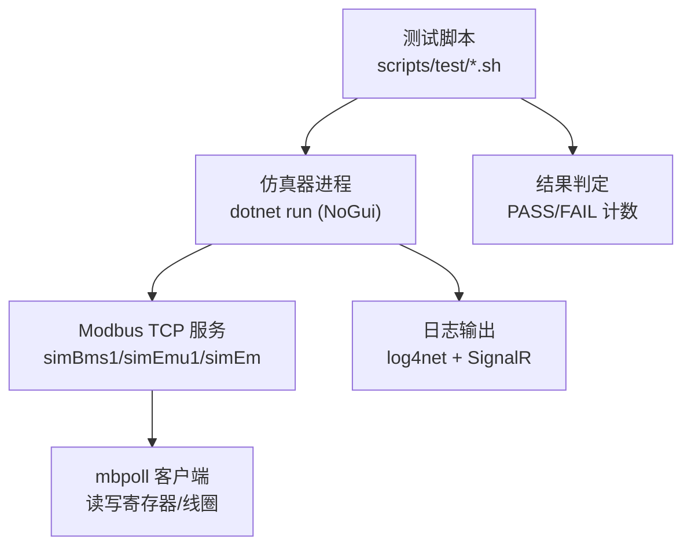
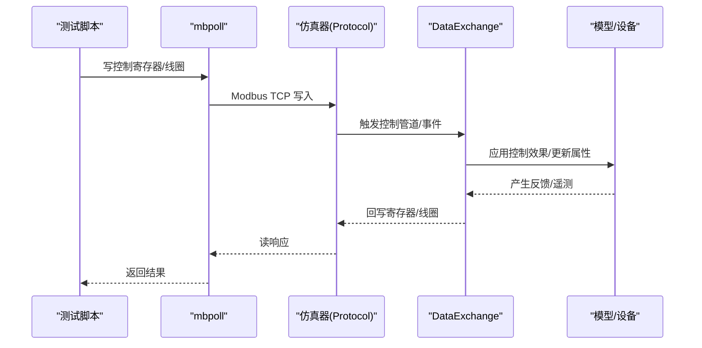
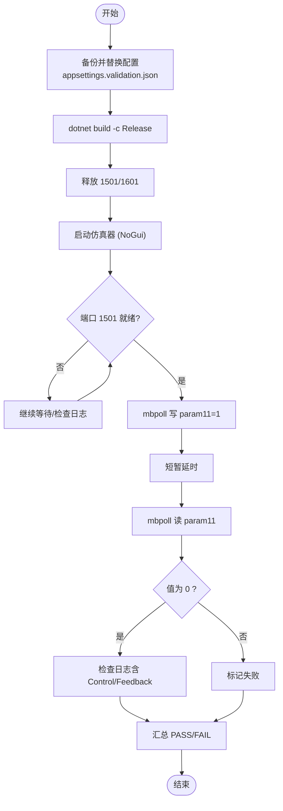
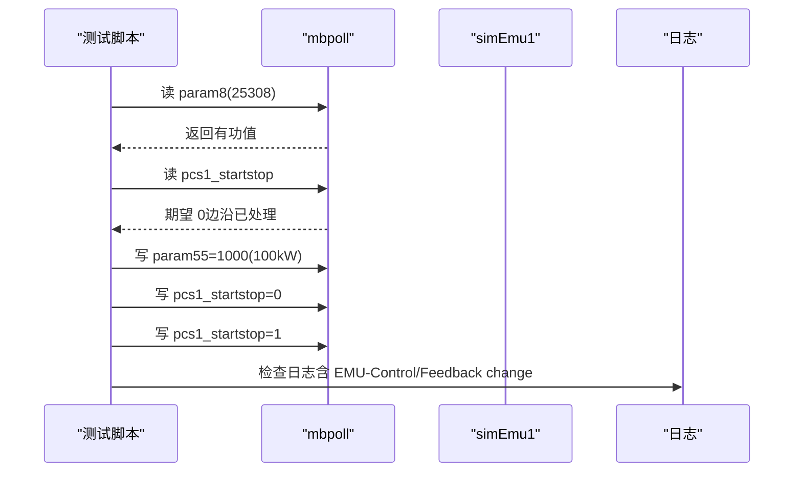
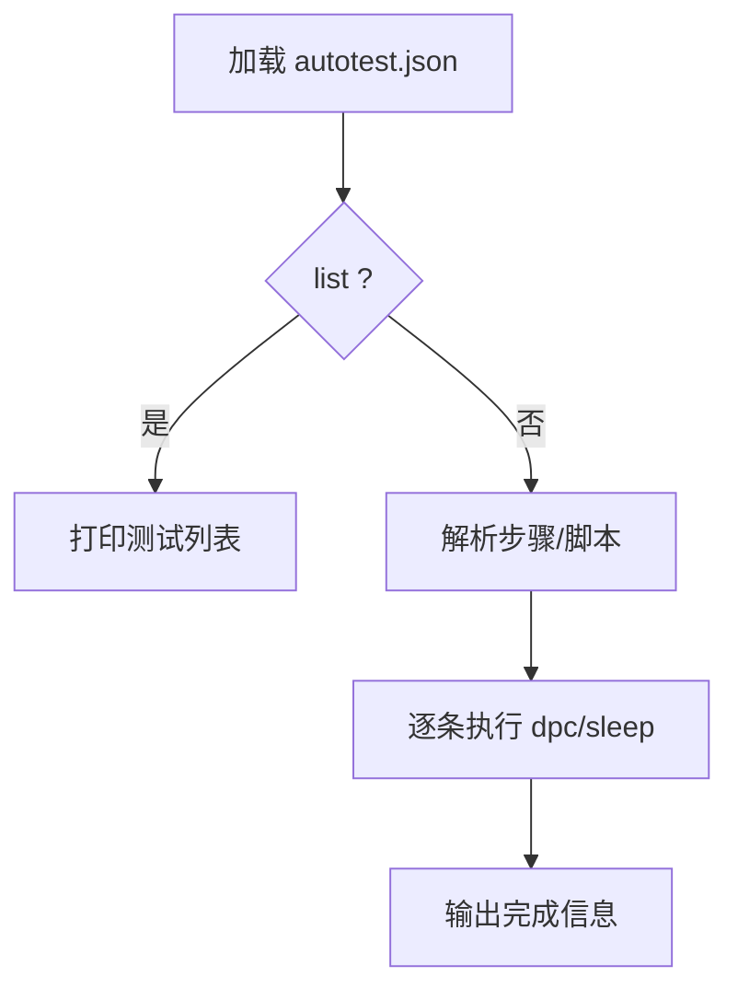
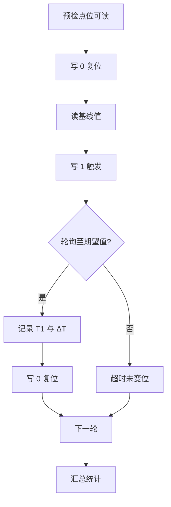
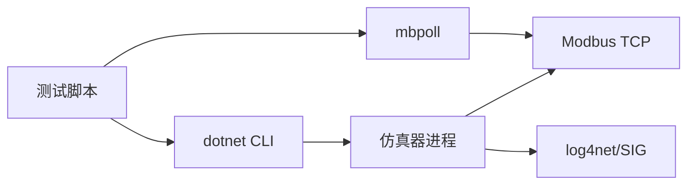

# 集成测试

<cite>
**本文引用的文件**
- [Program.cs](file://Program.cs)
- [appsettings.validation.json](file://appsettings.validation.json)
- [run-bms-dataexchange-validation.sh](file://scripts/test/run-bms-dataexchange-validation.sh)
- [validate-bms-dataexchange.sh](file://scripts/test/validate-bms-dataexchange.sh)
- [run-emu-dataexchange-validation.sh](file://scripts/test/run-emu-dataexchange-validation.sh)
- [validate-emu-dataexchange.sh](file://scripts/test/validate-emu-dataexchange.sh)
- [run_tc_r01.py](file://scripts/test/perf/run_tc_r01.py)
- [DpcAutoTestCommand.cs](file://Display/DpcAutoTestCommand.cs)
- [DpcTestModels.cs](file://Display/DpcTestModels.cs)
- [PerfTestModels.cs](file://Display/PerfTestModels.cs)
- [autotest.json](file://autotest.json)
- [BmsPointCatalogLoaderTests.cs](file://EssSimulator.Tests/DataExchange/BmsPointCatalogLoaderTests.cs)
- [EmPointCatalogLoaderTests.cs](file://EssSimulator.Tests/DataExchange/EmPointCatalogLoaderTests.cs)
- [DataExchangeOptions.cs](file://DataExchange/Config/DataExchangeOptions.cs)
</cite>

## 目录
1. [简介](#简介)
2. [项目结构](#项目结构)
3. [核心组件](#核心组件)
4. [架构总览](#架构总览)
5. [详细组件分析](#详细组件分析)
6. [依赖关系分析](#依赖关系分析)
7. [性能考虑](#性能考虑)
8. [故障排查指南](#故障排查指南)
9. [结论](#结论)
10. [附录](#附录)

## 简介
本文件面向储能仿真系统的集成测试，覆盖端到端验证策略与自动化执行方法。重点包括：
- 数据交换验证测试（BMS、EMU）
- BMS 通信测试（Modbus TCP）
- EMS 通信测试（通过 EM 侧 Modbus 端口）
- 测试环境配置、测试数据管理、自动化执行流程与结果验证
- 性能基准测试与回归测试实施指南

## 项目结构
集成测试由三类资产组成：
- 启动与验证脚本：用于构建、启动仿真器、等待就绪并执行校验
- 性能测试脚本：基于 mbpoll 的时序测量与统计
- 单元测试与点表映射：确保 DataExchange 目录与控制/遥测绑定正确

图表来源
- [run-bms-dataexchange-validation.sh:1-75](file://scripts/test/run-bms-dataexchange-validation.sh#L1-L75)
- [validate-bms-dataexchange.sh:1-101](file://scripts/test/validate-bms-dataexchange.sh#L1-L101)
- [run-emu-dataexchange-validation.sh:1-75](file://scripts/test/run-emu-dataexchange-validation.sh#L1-L75)
- [validate-emu-dataexchange.sh:1-128](file://scripts/test/validate-emu-dataexchange.sh#L1-L128)

章节来源
- [Program.cs:216-523](file://Program.cs#L216-L523)
- [appsettings.validation.json:1-143](file://appsettings.validation.json#L1-L143)

## 核心组件
- 仿真器启动与就绪检测：Program 中负责加载配置、注册服务、启动 Web/SignalR、Modbus 服务，并在后台轮询检查关键服务是否就绪。
- DataExchange 选项：控制遥测刷新周期、控制事件驱动与轮询周期等，直接影响集成测试的时延与稳定性。
- 自动化测试命令：支持从 autotest.json 读取用例，按步骤执行 dpc 指令或脚本，便于回归与演示。
- 性能测试用例：TC-R01 等通过 mbpoll 触发并观测同一点位变化，记录 T0/T1/ΔT，评估端到端时延。

章节来源
- [Program.cs:52-139](file://Program.cs#L52-L139)
- [DataExchangeOptions.cs:1-32](file://DataExchange/Config/DataExchangeOptions.cs#L1-L32)
- [DpcAutoTestCommand.cs:1-184](file://Display/DpcAutoTestCommand.cs#L1-L184)
- [PerfTestModels.cs:1-72](file://Display/PerfTestModels.cs#L1-L72)

## 架构总览
集成测试围绕“外部工具 → 仿真器 → 协议层 → 模型层”的闭环展开。BMS/EMU/EMS 均通过 Modbus TCP 暴露接口，测试脚本使用 mbpoll 进行读写；仿真器内部通过 DataExchange 管道将寄存器映射到模型属性，并触发控制效果与反馈。

图表来源
- [Program.cs:426-449](file://Program.cs#L426-L449)
- [DataExchangeOptions.cs:1-32](file://DataExchange/Config/DataExchangeOptions.cs#L1-L32)

## 详细组件分析

### BMS 数据交换验证测试
目标：验证 simBms1 的 Modbus 端口（默认 1501）可正常读写，且脉冲型控制点（如 param11）具备“写后清 0”的边沿语义。

执行流程
- 准备配置：复制 appsettings.validation.json 为 appsettings.json，构建并复制到发布目录
- 清理端口：释放 1501/1601
- 启动仿真器：以 NoGui 模式运行，捕获日志
- 等待就绪：监听端口与 DataExchange 启动日志
- 执行验证：通过 mbpoll 写 param11=1，再读确认归零，并检查日志中控制/反馈变更

图表来源
- [run-bms-dataexchange-validation.sh:1-75](file://scripts/test/run-bms-dataexchange-validation.sh#L1-L75)
- [validate-bms-dataexchange.sh:1-101](file://scripts/test/validate-bms-dataexchange.sh#L1-L101)

章节来源
- [run-bms-dataexchange-validation.sh:1-75](file://scripts/test/run-bms-dataexchange-validation.sh#L1-L75)
- [validate-bms-dataexchange.sh:1-101](file://scripts/test/validate-bms-dataexchange.sh#L1-L101)
- [appsettings.validation.json:1-143](file://appsettings.validation.json#L1-L143)

### EMU 数据交换验证测试
目标：验证 simEmu1 的 Modbus 端口（默认 1601）可正常读写 PCS 相关参数，并验证控制点（如 pcs1_startstop）的边沿处理与日志记录。

执行流程
- 准备配置与构建：同 BMS 流程
- 启动仿真器并等待 simEmu1 端口就绪
- 执行 mbpoll 读写：
  - 读 PCS1 有功参数（如 param8）
  - 读 pcs1_startstop 确认边沿已处理（应为 0）
  - 写 PCS1 有功设定（param55）
  - 写 pcs1_startstop 停机→启动，观察日志中的控制/反馈变更

图表来源
- [run-emu-dataexchange-validation.sh:1-75](file://scripts/test/run-emu-dataexchange-validation.sh#L1-L75)
- [validate-emu-dataexchange.sh:1-128](file://scripts/test/validate-emu-dataexchange.sh#L1-L128)

章节来源
- [run-emu-dataexchange-validation.sh:1-75](file://scripts/test/run-emu-dataexchange-validation.sh#L1-L75)
- [validate-emu-dataexchange.sh:1-128](file://scripts/test/validate-emu-dataexchange.sh#L1-L128)

### EMS 通信测试（EM 侧）
说明：EM（Energy Management System）通过 simEm 的 Modbus 端口（默认 1500）提供只读遥测。可通过 mbpoll 读取关键量（如系统总有功），验证数据链路畅通。该场景通常作为 BMS/EMU 验证的前置检查。

建议步骤
- 启动仿真器后，等待 simEm 端口 1500 就绪
- 使用 mbpoll 读取 em.TotalActivePower 对应点位
- 断言返回值非空且在合理范围

章节来源
- [Program.cs:180-214](file://Program.cs#L180-L214)
- [appsettings.validation.json:12-22](file://appsettings.validation.json#L12-L22)

### 自动化测试命令（DPC）
功能：通过 autotest.json 定义测试用例，支持 dpc 指令与 sleep 步骤，可用于回归与演示。

使用方法
- 在程序目录或工作目录下放置 autotest.json
- 通过命令行调用 dpctest list 列出可用测试
- 执行 dpctest <testName> 运行指定用例
- 支持 steps 或 script 两种形式

图表来源
- [DpcAutoTestCommand.cs:1-184](file://Display/DpcAutoTestCommand.cs#L1-L184)
- [DpcTestModels.cs:1-17](file://Display/DpcTestModels.cs#L1-L17)
- [autotest.json:1-58](file://autotest.json#L1-L58)

章节来源
- [DpcAutoTestCommand.cs:1-184](file://Display/DpcAutoTestCommand.cs#L1-L184)
- [DpcTestModels.cs:1-17](file://Display/DpcTestModels.cs#L1-L17)
- [autotest.json:1-58](file://autotest.json#L1-L58)

### 性能基准测试（TC-R01）
目标：测量“触发与监控同一点位”的端到端时延，统计 ΔT 并判断是否满足阈值（例如 ≤700ms）。

执行要点
- 使用 mbpoll 周期性轮询同一地址，记录触发时刻 T0 与变位时刻 T1
- 多轮执行取平均/最大/最小
- 断言所有轮次均通过阈值

图表来源
- [run_tc_r01.py:1-101](file://scripts/test/perf/run_tc_r01.py#L1-L101)

章节来源
- [run_tc_r01.py:1-101](file://scripts/test/perf/run_tc_r01.py#L1-L101)

### 数据交换目录与绑定验证（单元测试）
目的：确保点表 CSV 到模型属性的映射正确，控制点语义（Hold/Pulse/Edge）与效果（Effect）符合预期。

示例断言
- BMS 点表生成 catalog 后，yt0 应映射到 BatteryStacks[0].GridConnectCommand，语义为 Pulse，效果为 ApplyLinkCommands
- 机架控制阈值（如 yc1322）能正确解析为 Rack 级属性路径
- EM 点表仅包含遥测点，无控制点

章节来源
- [BmsPointCatalogLoaderTests.cs:1-43](file://EssSimulator.Tests/DataExchange/BmsPointCatalogLoaderTests.cs#L1-L43)
- [EmPointCatalogLoaderTests.cs:1-20](file://EssSimulator.Tests/DataExchange/EmPointCatalogLoaderTests.cs#L1-L20)

## 依赖关系分析
- 脚本依赖：bash 环境、mbpoll、lsof、dotnet CLI
- 运行时依赖：log4net 日志、SignalR 实时推送、Modbus TCP 服务
- 配置依赖：appsettings.validation.json 决定端口、间隔、拓扑规模等

图表来源
- [run-bms-dataexchange-validation.sh:1-75](file://scripts/test/run-bms-dataexchange-validation.sh#L1-L75)
- [validate-bms-dataexchange.sh:1-101](file://scripts/test/validate-bms-dataexchange.sh#L1-L101)
- [Program.cs:216-523](file://Program.cs#L216-L523)

章节来源
- [Program.cs:216-523](file://Program.cs#L216-L523)
- [appsettings.validation.json:1-143](file://appsettings.validation.json#L1-L143)

## 性能考虑
- 遥测与控制周期：通过 DataExchange.TelemetryIntervalMs 与 ControlPollIntervalMs 调整，影响端到端时延与 CPU 占用
- 网络与 I/O：mbpoll 并发与超时设置会影响测试稳定性
- 日志开销：大量日志可能影响性能，建议在 CI 中按需降低日志级别
- 资源隔离：测试前释放端口，避免冲突导致假失败

章节来源
- [DataExchangeOptions.cs:1-32](file://DataExchange/Config/DataExchangeOptions.cs#L1-L32)
- [run_tc_r01.py:1-101](file://scripts/test/perf/run_tc_r01.py#L1-L101)

## 故障排查指南
常见问题与定位
- 端口占用：使用 lsof 检查 1501/1601/1500，必要时 kill 占用进程
- 配置未生效：确认 appsettings.validation.json 已复制到 bin/Release/net8.0
- 仿真器异常退出：查看 /tmp 下的验证日志与 Logs 目录
- 日志缺失：确认 log4net.config 存在且可写，SignalR 推送不影响主流程
- mbpoll 超时：适当增加超时与重试次数，检查防火墙与本地环回

章节来源
- [run-bms-dataexchange-validation.sh:13-34](file://scripts/test/run-bms-dataexchange-validation.sh#L13-L34)
- [validate-bms-dataexchange.sh:14-43](file://scripts/test/validate-bms-dataexchange.sh#L14-L43)
- [Program.cs:226-256](file://Program.cs#L226-L256)

## 结论
本集成测试体系通过脚本化启动与验证、mbpoll 驱动的数据交换校验、以及性能基准测试，覆盖了 BMS/EMU/EMS 的关键交互路径。结合 DataExchange 的可调周期与 DPC 自动化命令，可在持续集成环境中稳定执行回归与性能验证。建议在生产环境部署前，至少完成一次全量数据交换验证与一轮性能基准测试，并保留日志与结果以供审计。

## 附录

### 环境与前置条件
- 操作系统：Linux/macOS（Windows 可使用等效命令替换）
- 工具链：dotnet SDK/CLI、mbpoll、lsof、grep、awk
- 端口规划：BMS 1501、EMU 1601、EM 1500（可在配置中调整）

### 快速执行清单
- 单单元 BMS 验证：scripts/test/run-bms-dataexchange-validation.sh
- 单单元 EMU 验证：scripts/test/run-emu-dataexchange-validation.sh
- 性能基准 TC-R01：scripts/test/perf/run_tc_r01.py
- DPC 自动化测试：dpctest list / dpctest <name>

章节来源
- [run-bms-dataexchange-validation.sh:1-75](file://scripts/test/run-bms-dataexchange-validation.sh#L1-L75)
- [run-emu-dataexchange-validation.sh:1-75](file://scripts/test/run-emu-dataexchange-validation.sh#L1-L75)
- [run_tc_r01.py:1-101](file://scripts/test/perf/run_tc_r01.py#L1-L101)
- [DpcAutoTestCommand.cs:1-184](file://Display/DpcAutoTestCommand.cs#L1-L184)