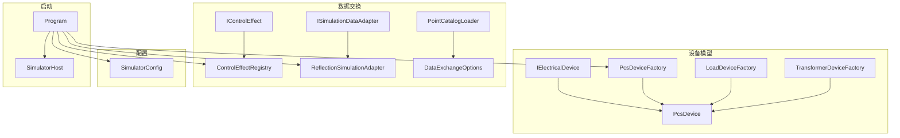
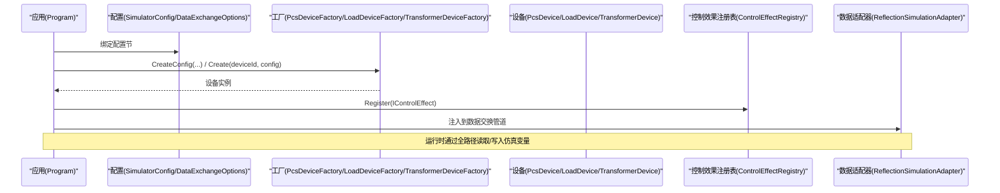
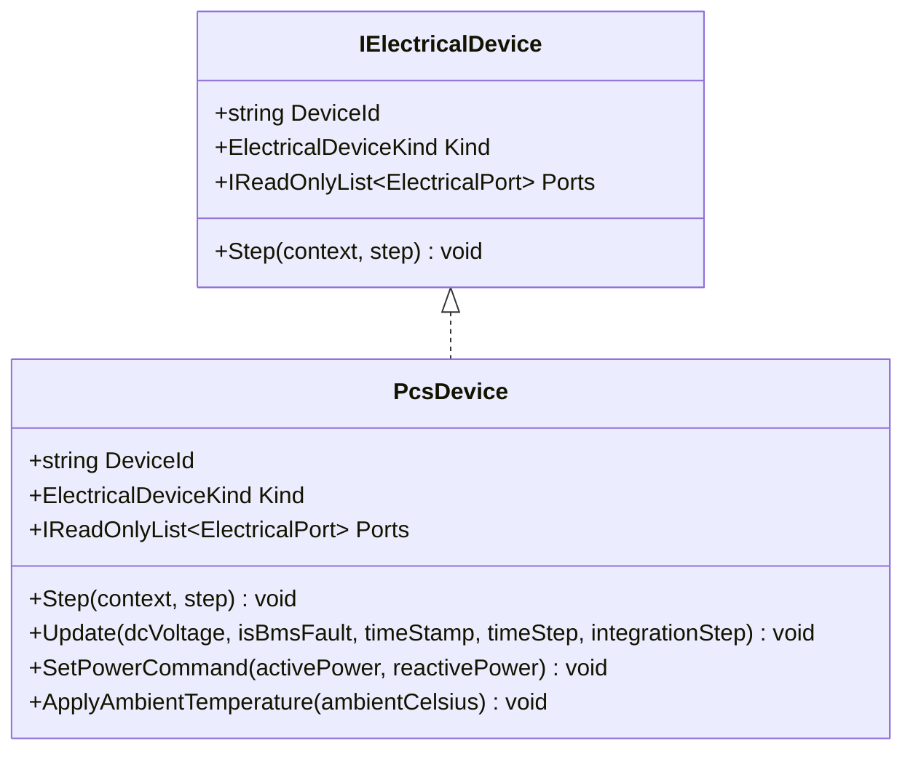
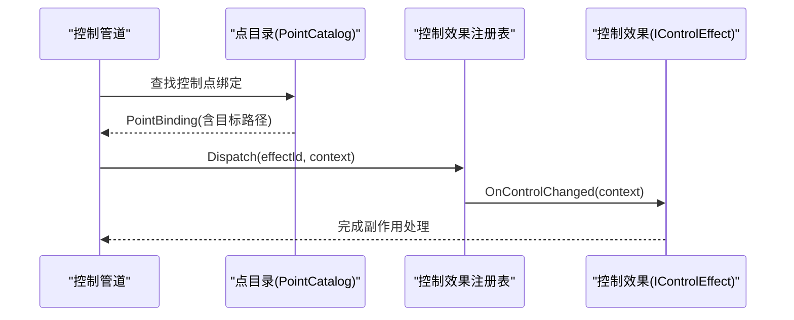
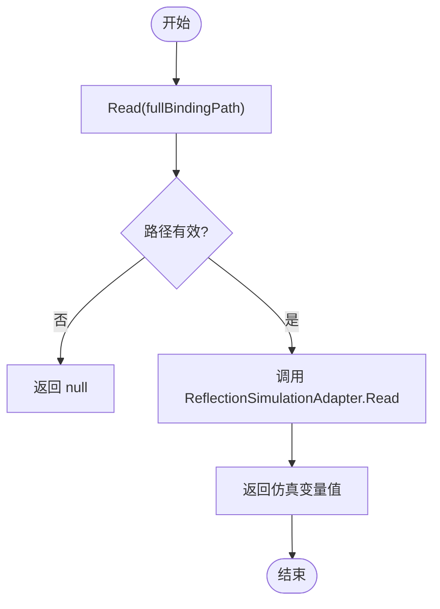
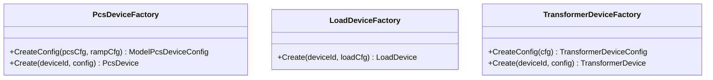
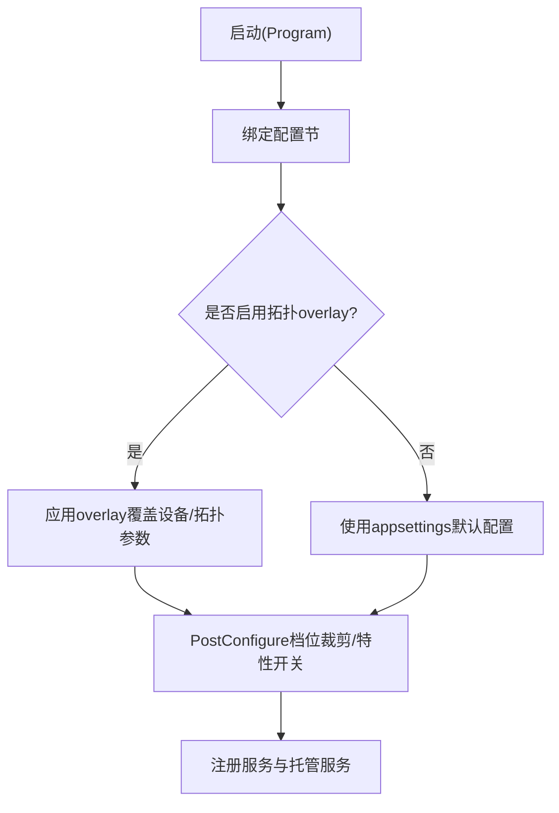
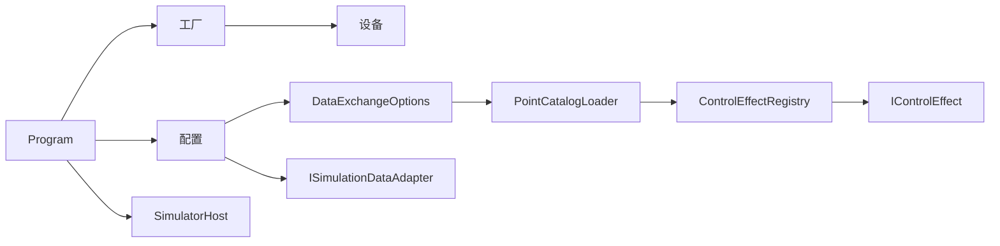

# 扩展点架构

<cite>
**本文引用的文件**
- [IElectricalDevice.cs](file://EssDeviceSimModel/Interface/IElectricalDevice.cs)
- [IControlEffect.cs](file://DataExchange/Effects/IControlEffect.cs)
- [ISimulationDataAdapter.cs](file://DataExchange/Adapters/ISimulationDataAdapter.cs)
- [ReflectionSimulationAdapter.cs](file://DataExchange/Adapters/ReflectionSimulationAdapter.cs)
- [ControlEffectRegistry.cs](file://DataExchange/Effects/ControlEffectRegistry.cs)
- [PcsDeviceFactory.cs](file://EssDeviceSimModel/Devices/PcsDeviceFactory.cs)
- [LoadDeviceFactory.cs](file://EssDeviceSimModel/Devices/LoadDeviceFactory.cs)
- [TransformerDeviceFactory.cs](file://EssDeviceSimModel/Devices/TransformerDeviceFactory.cs)
- [PcsDevice.Core.cs](file://EssDeviceSimModel/Devices/PcsDevice.Core.cs)
- [SimulatorConfig.cs](file://Configuration/SimulatorConfig.cs)
- [Program.cs](file://Program.cs)
- [PointCatalogLoader.cs](file://DataExchange/Catalog/PointCatalogLoader.cs)
- [DataExchangeOptions.cs](file://DataExchange/Config/DataExchangeOptions.cs)
- [PointCatalog.cs](file://DataExchange/Catalog/PointCatalog.cs)
- [RackPointBinding.cs](file://DataExchange/Catalog/RackPointBinding.cs)
- [SimulatorHost.cs](file://Core/SimulatorHost.cs)
</cite>

## 目录
1. [简介](#简介)
2. [项目结构](#项目结构)
3. [核心组件](#核心组件)
4. [架构总览](#架构总览)
5. [详细组件分析](#详细组件分析)
6. [依赖关系分析](#依赖关系分析)
7. [性能考虑](#性能考虑)
8. [故障排查指南](#故障排查指南)
9. [结论](#结论)
10. [附录：接口定义与使用示例](#附录接口定义与使用示例)

## 简介
本文件面向储能仿真系统的“扩展点架构”，聚焦于插件化设计与扩展机制，覆盖三类扩展点：
- 设备模型插件：实现 IElectricalDevice 接口的电气设备模型
- 控制策略插件：实现 IControlEffect 接口的控制效果（控制副作用）
- 数据适配器插件：实现 ISimulationDataAdapter 接口的数据读写适配

同时说明工厂模式在设备创建中的应用（如 PcsDeviceFactory、LoadDeviceFactory、TransformerDeviceFactory），以及配置驱动的扩展机制（通过配置文件注册和加载自定义组件）。文档还讨论扩展点的版本兼容性与热插拔支持，并提供接口定义与使用示例。

## 项目结构
系统采用分层与模块化组织：
- 设备模型层：位于 EssDeviceSimModel，提供电气设备抽象与具体实现，并通过工厂类统一创建
- 数据交换层：位于 DataExchange，提供控制效果注册与分发、数据适配器、点表目录等
- 配置层：位于 Configuration，承载运行时参数与设备配置
- 启动与装配：Program.cs 负责配置绑定、服务注册与生命周期管理
- 宿主容器：Core/SimulatorHost 提供轻量级全局对象存储，用于跨模块共享实例

图表来源
- [IElectricalDevice.cs:1-14](file://EssDeviceSimModel/Interface/IElectricalDevice.cs#L1-L14)
- [PcsDevice.Core.cs:1-160](file://EssDeviceSimModel/Devices/PcsDevice.Core.cs#L1-L160)
- [PcsDeviceFactory.cs:1-44](file://EssDeviceSimModel/Devices/PcsDeviceFactory.cs#L1-L44)
- [LoadDeviceFactory.cs:1-24](file://EssDeviceSimModel/Devices/LoadDeviceFactory.cs#L1-L24)
- [TransformerDeviceFactory.cs:1-75](file://EssDeviceSimModel/Devices/TransformerDeviceFactory.cs#L1-L75)
- [IControlEffect.cs:1-19](file://DataExchange/Effects/IControlEffect.cs#L1-L19)
- [ControlEffectRegistry.cs:1-25](file://DataExchange/Effects/ControlEffectRegistry.cs#L1-L25)
- [ISimulationDataAdapter.cs:1-9](file://DataExchange/Adapters/ISimulationDataAdapter.cs#L1-L9)
- [ReflectionSimulationAdapter.cs:1-12](file://DataExchange/Adapters/ReflectionSimulationAdapter.cs#L1-L12)
- [PointCatalogLoader.cs:1-177](file://DataExchange/Catalog/PointCatalogLoader.cs#L1-L177)
- [DataExchangeOptions.cs:1-32](file://DataExchange/Config/DataExchangeOptions.cs#L1-L32)
- [SimulatorConfig.cs:272-344](file://Configuration/SimulatorConfig.cs#L272-L344)
- [Program.cs:291-378](file://Program.cs#L291-L378)

章节来源
- [Program.cs:291-378](file://Program.cs#L291-L378)
- [SimulatorConfig.cs:272-344](file://Configuration/SimulatorConfig.cs#L272-L344)

## 核心组件
- 设备模型扩展点（IElectricalDevice）
  - 定义设备的唯一标识、类型、端口集合与步进方法 Step(context, step)
  - 典型实现为 PcsDevice，具备 AC/DC 端口、状态机、保护逻辑与温度模型
- 控制策略扩展点（IControlEffect）
  - 以 ControlEffectId 标识的控制效果，OnControlChanged(context) 接收控制变更上下文
  - 通过 ControlEffectRegistry 注册与分发，支持按控制语义触发
- 数据适配器扩展点（ISimulationDataAdapter）
  - 提供 Read/Write 全路径访问能力，反射实现 ReflectionSimulationAdapter 基于 SimServer 变量读写
- 工厂模式（设备创建）
  - PcsDeviceFactory、LoadDeviceFactory、TransformerDeviceFactory 将配置转换为设备配置并创建设备实例
- 配置驱动与装配
  - Program 中通过 Microsoft.Extensions.Configuration 绑定 SimulatorConfig、DataExchangeOptions 等
  - PointCatalogLoader 从 Modbus 点表构建数据交互目录，结合 DataExchangeOptions 解析控制语义与控制效果映射
- 宿主容器（SimulatorHost）
  - 提供键值对形式的轻量注册/获取，用于跨模块共享关键实例（如 ess、bms、emu 等）

章节来源
- [IElectricalDevice.cs:1-14](file://EssDeviceSimModel/Interface/IElectricalDevice.cs#L1-L14)
- [PcsDevice.Core.cs:1-160](file://EssDeviceSimModel/Devices/PcsDevice.Core.cs#L1-L160)
- [IControlEffect.cs:1-19](file://DataExchange/Effects/IControlEffect.cs#L1-L19)
- [ControlEffectRegistry.cs:1-25](file://DataExchange/Effects/ControlEffectRegistry.cs#L1-L25)
- [ISimulationDataAdapter.cs:1-9](file://DataExchange/Adapters/ISimulationDataAdapter.cs#L1-L9)
- [ReflectionSimulationAdapter.cs:1-12](file://DataExchange/Adapters/ReflectionSimulationAdapter.cs#L1-L12)
- [PcsDeviceFactory.cs:1-44](file://EssDeviceSimModel/Devices/PcsDeviceFactory.cs#L1-L44)
- [LoadDeviceFactory.cs:1-24](file://EssDeviceSimModel/Devices/LoadDeviceFactory.cs#L1-L24)
- [TransformerDeviceFactory.cs:1-75](file://EssDeviceSimModel/Devices/TransformerDeviceFactory.cs#L1-L75)
- [PointCatalogLoader.cs:1-177](file://DataExchange/Catalog/PointCatalogLoader.cs#L1-L177)
- [DataExchangeOptions.cs:1-32](file://DataExchange/Config/DataExchangeOptions.cs#L1-L32)
- [SimulatorHost.cs:1-28](file://Core/SimulatorHost.cs#L1-L28)

## 架构总览
系统通过“接口 + 工厂 + 配置”的三层扩展机制实现插件化：
- 接口层：IElectricalDevice、IControlEffect、ISimulationDataAdapter 定义扩展契约
- 工厂层：各 DeviceFactory 将配置转换为设备配置并创建设备实例，屏蔽构造细节
- 配置层：SimulatorConfig、DataExchangeOptions、拓扑 overlay 等决定运行时的设备数量、协议参数、控制语义与效果映射

图表来源
- [Program.cs:291-378](file://Program.cs#L291-L378)
- [PcsDeviceFactory.cs:1-44](file://EssDeviceSimModel/Devices/PcsDeviceFactory.cs#L1-L44)
- [LoadDeviceFactory.cs:1-24](file://EssDeviceSimModel/Devices/LoadDeviceFactory.cs#L1-L24)
- [TransformerDeviceFactory.cs:1-75](file://EssDeviceSimModel/Devices/TransformerDeviceFactory.cs#L1-L75)
- [ControlEffectRegistry.cs:1-25](file://DataExchange/Effects/ControlEffectRegistry.cs#L1-L25)
- [ReflectionSimulationAdapter.cs:1-12](file://DataExchange/Adapters/ReflectionSimulationAdapter.cs#L1-L12)

## 详细组件分析

### 设备模型插件（IElectricalDevice）
- 设计要点
  - 统一设备步进接口 Step(context, step)，由求解器或传播引擎调用
  - 暴露 Ports 列表，便于网络拓扑连接与功率传播
  - 典型实现 PcsDevice 包含并网/离网模式、黑启动、保护、温度模型与端口输出发布
- 复杂度与性能
  - 步进过程包含功率爬坡、黑启动阶段推进、电压频率更新、保护检查与端口发布，时间复杂度与设备数量线性相关
  - 通过锁与原子标志减少竞态（如 SetPowerCommand 中的 _setpointLock）
- 错误处理
  - 保护条件集中 CheckFaultConditions，故障锁存后切换至停机模式并撤回外部启停命令
- 优化机会
  - 将热点计算（如交流电流幅值）缓存或增量更新
  - 避免每步重复分配对象，复用快照与转换器

图表来源
- [IElectricalDevice.cs:1-14](file://EssDeviceSimModel/Interface/IElectricalDevice.cs#L1-L14)
- [PcsDevice.Core.cs:1-160](file://EssDeviceSimModel/Devices/PcsDevice.Core.cs#L1-L160)

章节来源
- [IElectricalDevice.cs:1-14](file://EssDeviceSimModel/Interface/IElectricalDevice.cs#L1-L14)
- [PcsDevice.Core.cs:1-160](file://EssDeviceSimModel/Devices/PcsDevice.Core.cs#L1-L160)

### 控制策略插件（IControlEffect）
- 设计要点
  - 控制效果以 ControlEffectId 标识，通过 ControlEffectRegistry.Register 注册
  - 控制变更时由管道调用 Dispatch(effectId, context) 触发 OnControlChanged
  - 控制语义（Hold/Pulse/Edge）由 DataExchangeOptions 与默认语义表解析
- 数据流
  - PointCatalogLoader 从 Modbus 点表生成 PointCatalog，绑定控制点到目标路径
  - 控制管道根据语义与效果映射调用对应 IControlEffect
- 版本兼容
  - 新增 ControlEffectId 需保持向后兼容；未识别 id 时忽略或回退默认行为

图表来源
- [PointCatalogLoader.cs:1-177](file://DataExchange/Catalog/PointCatalogLoader.cs#L1-L177)
- [ControlEffectRegistry.cs:1-25](file://DataExchange/Effects/ControlEffectRegistry.cs#L1-L25)
- [IControlEffect.cs:1-19](file://DataExchange/Effects/IControlEffect.cs#L1-L19)
- [DataExchangeOptions.cs:1-32](file://DataExchange/Config/DataExchangeOptions.cs#L1-L32)

章节来源
- [IControlEffect.cs:1-19](file://DataExchange/Effects/IControlEffect.cs#L1-L19)
- [ControlEffectRegistry.cs:1-25](file://DataExchange/Effects/ControlEffectRegistry.cs#L1-L25)
- [PointCatalogLoader.cs:1-177](file://DataExchange/Catalog/PointCatalogLoader.cs#L1-L177)
- [DataExchangeOptions.cs:1-32](file://DataExchange/Config/DataExchangeOptions.cs#L1-L32)

### 数据适配器插件（ISimulationDataAdapter）
- 设计要点
  - 提供 Read(fullBindingPath)/Write(fullBindingPath, value) 的统一访问
  - ReflectionSimulationAdapter 基于 SimServer 的全局变量进行读写
- 使用场景
  - 数据交换管道通过全路径访问设备内部状态或外部变量，解耦具体存储实现
- 扩展方式
  - 可替换为自定义适配器（如数据库、消息总线、文件等），只需实现 ISimulationDataAdapter

图表来源
- [ISimulationDataAdapter.cs:1-9](file://DataExchange/Adapters/ISimulationDataAdapter.cs#L1-L9)
- [ReflectionSimulationAdapter.cs:1-12](file://DataExchange/Adapters/ReflectionSimulationAdapter.cs#L1-L12)

章节来源
- [ISimulationDataAdapter.cs:1-9](file://DataExchange/Adapters/ISimulationDataAdapter.cs#L1-L9)
- [ReflectionSimulationAdapter.cs:1-12](file://DataExchange/Adapters/ReflectionSimulationAdapter.cs#L1-L12)

### 工厂模式在设备创建中的应用
- PcsDeviceFactory
  - 将 PcsPhysicalConfig 与 PcsRampConfig 转换为 ModelPcsDeviceConfig，再创建 PcsDevice
- LoadDeviceFactory
  - 将 LoadConfig 转换为 LoadWindow 列表并创建 LoadDevice
- TransformerDeviceFactory
  - 将 TransformerConfig/UnitTransformerConfig 转换为 TransformerDeviceConfig，再创建 TransformerDevice
- 优势
  - 隐藏复杂构造逻辑，便于单元测试与配置覆盖
  - 支持运行时动态创建不同规格设备

图表来源
- [PcsDeviceFactory.cs:1-44](file://EssDeviceSimModel/Devices/PcsDeviceFactory.cs#L1-L44)
- [LoadDeviceFactory.cs:1-24](file://EssDeviceSimModel/Devices/LoadDeviceFactory.cs#L1-L24)
- [TransformerDeviceFactory.cs:1-75](file://EssDeviceSimModel/Devices/TransformerDeviceFactory.cs#L1-L75)

章节来源
- [PcsDeviceFactory.cs:1-44](file://EssDeviceSimModel/Devices/PcsDeviceFactory.cs#L1-L44)
- [LoadDeviceFactory.cs:1-24](file://EssDeviceSimModel/Devices/LoadDeviceFactory.cs#L1-L24)
- [TransformerDeviceFactory.cs:1-75](file://EssDeviceSimModel/Devices/TransformerDeviceFactory.cs#L1-L75)

### 配置驱动的扩展机制
- 配置绑定
  - Program 中通过 builder.Services.Configure 绑定 SimulatorConfig、DataExchangeOptions、WebConfig 等
  - PostConfigure 用于应用拓扑 overlay 与档位限制（如 MaxEssUnits）
- 设备数量与拓扑
  - SimulatorConfig.EssUnits 与 PvUnits 决定储能单元与光伏单元数量
  - TopologyOverlayLoader 可覆盖设备配置与 PCC、变压器等参数
- 控制语义与效果映射
  - DataExchangeOptions.ControlSemantics 与 ControlEffects 控制点行为与效果绑定
  - PointCatalogLoader 根据服务器名（simEmu/simBms）与选项解析默认语义

图表来源
- [Program.cs:291-378](file://Program.cs#L291-L378)
- [SimulatorConfig.cs:272-344](file://Configuration/SimulatorConfig.cs#L272-L344)
- [DataExchangeOptions.cs:1-32](file://DataExchange/Config/DataExchangeOptions.cs#L1-L32)
- [PointCatalogLoader.cs:1-177](file://DataExchange/Catalog/PointCatalogLoader.cs#L1-L177)

章节来源
- [Program.cs:291-378](file://Program.cs#L291-L378)
- [SimulatorConfig.cs:272-344](file://Configuration/SimulatorConfig.cs#L272-L344)
- [DataExchangeOptions.cs:1-32](file://DataExchange/Config/DataExchangeOptions.cs#L1-L32)
- [PointCatalogLoader.cs:1-177](file://DataExchange/Catalog/PointCatalogLoader.cs#L1-L177)

### 扩展点的版本兼容性与热插拔支持
- 版本兼容性
  - 控制效果通过 ControlEffectId 枚举标识，新增 id 不影响旧行为；未识别 id 时 Dispatch 忽略
  - 数据适配器通过接口隔离，替换实现不影响上层调用
  - 设备模型通过 IElectricalDevice 接口约束，新增设备无需修改求解器调用
- 热插拔支持
  - 当前代码未实现运行时动态卸载/替换；可通过扩展 SimulatorHost 的 Register/Get 机制，在托管服务中按需切换实现
  - 建议：为 IControlEffect 与 ISimulationDataAdapter 增加版本元数据与兼容性校验，在启动时验证并提示不兼容项

章节来源
- [ControlEffectRegistry.cs:1-25](file://DataExchange/Effects/ControlEffectRegistry.cs#L1-L25)
- [ISimulationDataAdapter.cs:1-9](file://DataExchange/Adapters/ISimulationDataAdapter.cs#L1-L9)
- [IElectricalDevice.cs:1-14](file://EssDeviceSimModel/Interface/IElectricalDevice.cs#L1-L14)
- [SimulatorHost.cs:1-28](file://Core/SimulatorHost.cs#L1-L28)

## 依赖关系分析
- 松耦合设计
  - 设备、控制效果、数据适配器均通过接口解耦，工厂负责实例化
  - Program 作为装配中心，依赖 Microsoft.Extensions.DependencyInjection 进行服务注册
- 直接依赖
  - PcsDevice 依赖 PcsDeviceConfig、ElectricalPort、AcPortHelper 等
  - ControlEffectRegistry 依赖 ControlEffectId 与 IControlEffect
  - ReflectionSimulationAdapter 依赖 SimServer 的全局变量访问
- 间接依赖
  - PointCatalogLoader 依赖 ModbusPointMap 与 DataExchangeOptions
  - SimulatorConfig 依赖 RuntimeConfig、ProtocolConfig、EssUnitConfig 等

图表来源
- [Program.cs:291-378](file://Program.cs#L291-L378)
- [PcsDeviceFactory.cs:1-44](file://EssDeviceSimModel/Devices/PcsDeviceFactory.cs#L1-L44)
- [ControlEffectRegistry.cs:1-25](file://DataExchange/Effects/ControlEffectRegistry.cs#L1-L25)
- [PointCatalogLoader.cs:1-177](file://DataExchange/Catalog/PointCatalogLoader.cs#L1-L177)
- [DataExchangeOptions.cs:1-32](file://DataExchange/Config/DataExchangeOptions.cs#L1-L32)

章节来源
- [Program.cs:291-378](file://Program.cs#L291-L378)
- [PcsDeviceFactory.cs:1-44](file://EssDeviceSimModel/Devices/PcsDeviceFactory.cs#L1-L44)
- [ControlEffectRegistry.cs:1-25](file://DataExchange/Effects/ControlEffectRegistry.cs#L1-L25)
- [PointCatalogLoader.cs:1-177](file://DataExchange/Catalog/PointCatalogLoader.cs#L1-L177)
- [DataExchangeOptions.cs:1-32](file://DataExchange/Config/DataExchangeOptions.cs#L1-L32)

## 性能考虑
- 设备步进性能
  - PcsDevice 的 Update 流程包含多阶段计算，应避免每步频繁分配对象；复用 AcInternalQuantities、DcSnapshot 等
  - 保护检查集中且短路，减少分支开销
- 控制管道性能
  - 控制事件驱动（ControlEventDriven=true）可减少轮询开销；合理设置 ControlPollIntervalMs
- 数据适配器性能
  - ReflectionSimulationAdapter 基于字符串路径查找，建议在高频路径上缓存解析结果或使用更高效的键映射
- 配置影响
  - IntegrationStepMultiplier 仅放大积分量 dt，不改变瞬时动力学 dt，避免引入数值不稳定

[本节为通用性能指导，不直接分析具体文件]

## 故障排查指南
- 控制效果未生效
  - 检查 DataExchangeOptions.ControlEffects 是否正确映射 ControlEffectId
  - 确认 PointCatalogLoader 已正确解析控制点并绑定目标路径
- 数据读写失败
  - 检查 ISimulationDataAdapter 实现是否正确处理 fullBindingPath
  - 确认 SimServer 变量是否存在并可写
- 设备创建异常
  - 检查工厂方法传入的配置是否合法（如 PcsPhysicalConfig、LoadConfig、TransformerConfig）
  - 查看 PcsDevice 的保护条件与模式转换日志

章节来源
- [ControlEffectRegistry.cs:1-25](file://DataExchange/Effects/ControlEffectRegistry.cs#L1-L25)
- [PointCatalogLoader.cs:1-177](file://DataExchange/Catalog/PointCatalogLoader.cs#L1-L177)
- [ReflectionSimulationAdapter.cs:1-12](file://DataExchange/Adapters/ReflectionSimulationAdapter.cs#L1-L12)
- [PcsDevice.Core.cs:1-160](file://EssDeviceSimModel/Devices/PcsDevice.Core.cs#L1-L160)

## 结论
本系统通过接口抽象、工厂模式与配置驱动实现了高度可扩展的插件化架构：
- 设备模型插件（IElectricalDevice）统一了设备步进与端口交互
- 控制策略插件（IControlEffect）提供了灵活的控制副作用机制
- 数据适配器插件（ISimulationDataAdapter）解耦了数据源实现
- 工厂模式简化了设备创建与配置转换
- 配置驱动支持运行时动态调整设备数量、拓扑与控制行为
- 版本兼容性与热插拔可通过接口与注册表机制进一步扩展

[本节为总结性内容，不直接分析具体文件]

## 附录：接口定义与使用示例

### 设备模型插件示例
- 实现 IElectricalDevice
  - 提供 DeviceId、Kind、Ports 与 Step(context, step)
  - 在 Step 中更新端口快照并发布状态
- 使用工厂创建
  - 通过 PcsDeviceFactory.CreateConfig 与 Create 创建 PcsDevice
  - 通过 LoadDeviceFactory.Create 创建 LoadDevice
  - 通过 TransformerDeviceFactory.CreateConfig 与 Create 创建 TransformerDevice

章节来源
- [IElectricalDevice.cs:1-14](file://EssDeviceSimModel/Interface/IElectricalDevice.cs#L1-L14)
- [PcsDeviceFactory.cs:1-44](file://EssDeviceSimModel/Devices/PcsDeviceFactory.cs#L1-L44)
- [LoadDeviceFactory.cs:1-24](file://EssDeviceSimModel/Devices/LoadDeviceFactory.cs#L1-L24)
- [TransformerDeviceFactory.cs:1-75](file://EssDeviceSimModel/Devices/TransformerDeviceFactory.cs#L1-L75)

### 控制策略插件示例
- 实现 IControlEffect
  - 提供 Id（ControlEffectId）与 OnControlChanged(context)
- 注册与分发
  - 通过 ControlEffectRegistry.Register 注册
  - 控制管道调用 Dispatch(effectId, context) 触发效果
- 配置映射
  - 在 DataExchangeOptions.ControlEffects 中配置控制点到效果 id 的映射

章节来源
- [IControlEffect.cs:1-19](file://DataExchange/Effects/IControlEffect.cs#L1-L19)
- [ControlEffectRegistry.cs:1-25](file://DataExchange/Effects/ControlEffectRegistry.cs#L1-L25)
- [DataExchangeOptions.cs:1-32](file://DataExchange/Config/DataExchangeOptions.cs#L1-L32)

### 数据适配器插件示例
- 实现 ISimulationDataAdapter
  - 实现 Read/Write 方法，处理 fullBindingPath
- 替换默认实现
  - 在 Program 中注册自定义适配器，替代 ReflectionSimulationAdapter
- 使用场景
  - 数据交换管道通过全路径访问设备内部状态或外部变量

章节来源
- [ISimulationDataAdapter.cs:1-9](file://DataExchange/Adapters/ISimulationDataAdapter.cs#L1-L9)
- [ReflectionSimulationAdapter.cs:1-12](file://DataExchange/Adapters/ReflectionSimulationAdapter.cs#L1-L12)