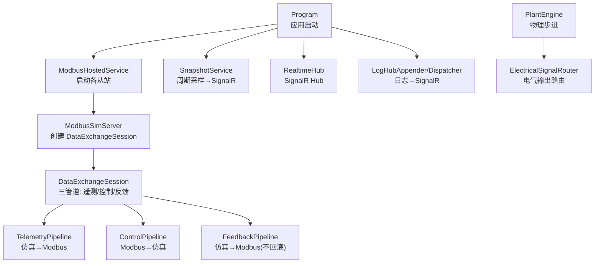
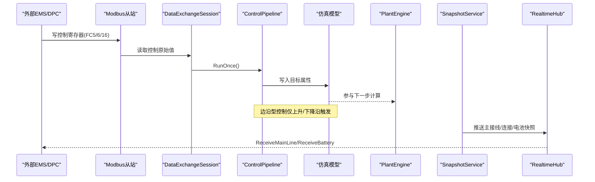
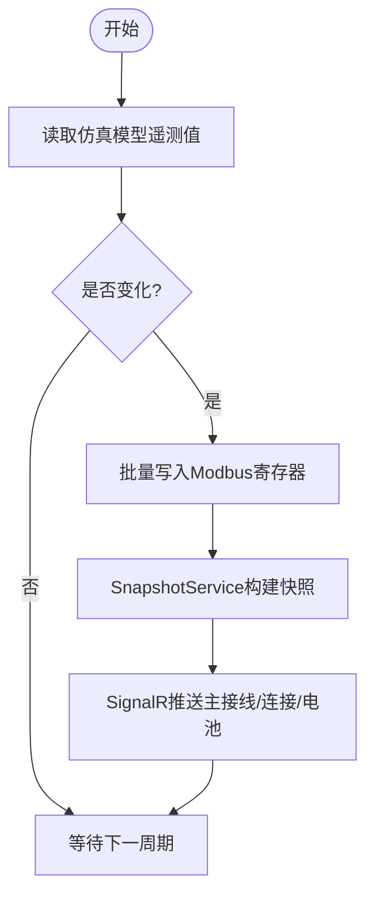
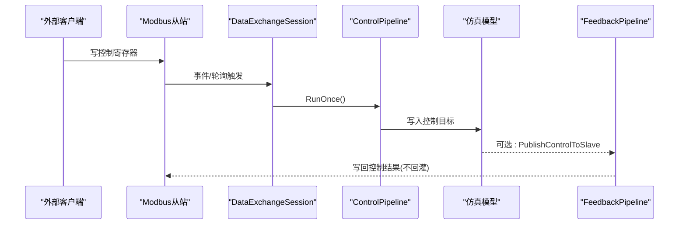
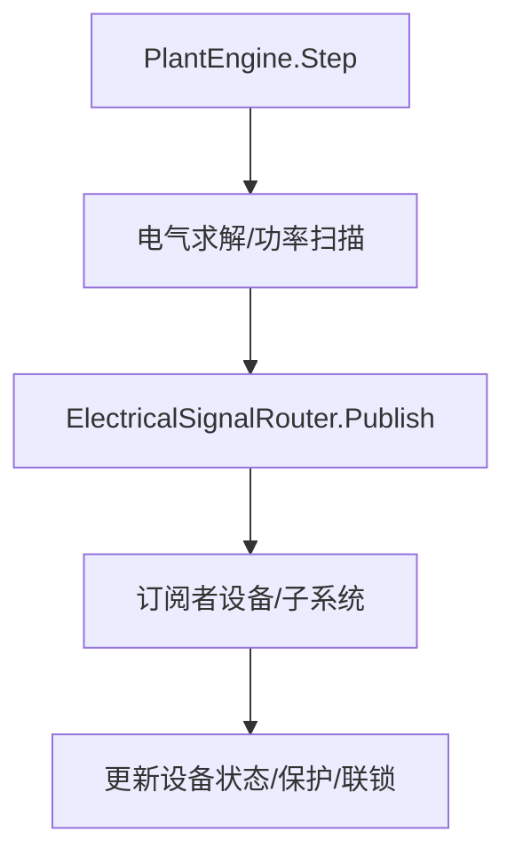
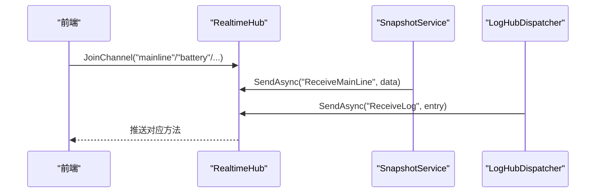
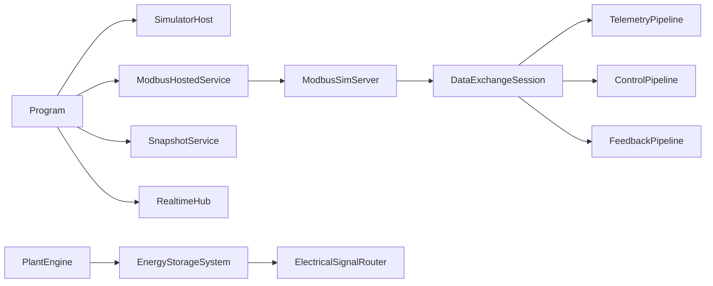

# 数据流架构

<cite>
**本文引用的文件**
- [Program.cs](file://Program.cs)
- [SimulatorHost.cs](file://Core/SimulatorHost.cs)
- [ModbusHostedService.cs](file://Protocol/ModbusHostedService.cs)
- [ModbusSimServer.cs](file://Protocol/ModbusSimServer.cs)
- [DataExchangeSession.cs](file://DataExchange/DataExchangeSession.cs)
- [TelemetryPipeline.cs](file://DataExchange/Pipeline/TelemetryPipeline.cs)
- [ControlPipeline.cs](file://DataExchange/Pipeline/ControlPipeline.cs)
- [ModbusRegisterAdapter.cs](file://DataExchange/Adapters/ModbusRegisterAdapter.cs)
- [ElectricalSignalRouter.cs](file://EssDeviceSimModel/Propagation/ElectricalSignalRouter.cs)
- [PlantEngine.cs](file://EssDeviceSimModel/PlantEngine.cs)
- [RealtimeHub.cs](file://Web/RealtimeHub.cs)
- [SnapshotService.cs](file://Web/SnapshotService.cs)
- [LogHubAppender.cs](file://Web/LogHubAppender.cs)
- [MainLineEnricher.cs](file://Web/MainLineEnricher.cs)
</cite>

## 目录
1. [简介](#简介)
2. [项目结构](#项目结构)
3. [核心组件](#核心组件)
4. [架构总览](#架构总览)
5. [详细组件分析](#详细组件分析)
6. [依赖关系分析](#依赖关系分析)
7. [性能考量](#性能考量)
8. [故障排查指南](#故障排查指南)
9. [结论](#结论)
10. [附录](#附录)

## 简介
本文件面向储能仿真系统的数据流架构，聚焦三类关键数据流：
- 遥测数据流：设备模型 → 管道 → 协议层（Modbus）→ Web 推送（SignalR）
- 控制命令流：Web API / DPC → 仿真引擎 → 设备模型 → 协议层
- 状态同步流：仿真引擎 → 信号路由器 → 相关设备与子系统

文档同时说明数据管道的设计模式（生产者-消费者、责任链、消息队列）、实时双向通信机制（SignalR）、数据一致性保证与错误处理策略，并给出数据流图与时序图。

## 项目结构
系统以 ASP.NET Core 应用为宿主，通过托管服务启动仿真、协议栈与 Web 服务；数据交换通过“点表驱动”的会话对象协调 Modbus 与仿真模型之间的读写；Web 层通过 SignalR 向前端推送主接线、连接、电池等快照与日志告警。

图表来源
- [Program.cs:258-457](file://Program.cs#L258-L457)
- [ModbusHostedService.cs:32-106](file://Protocol/ModbusHostedService.cs#L32-L106)
- [ModbusSimServer.cs:38-70](file://Protocol/ModbusSimServer.cs#L38-L70)
- [DataExchangeSession.cs:238-290](file://DataExchange/DataExchangeSession.cs#L238-L290)
- [TelemetryPipeline.cs:28-49](file://DataExchange/Pipeline/TelemetryPipeline.cs#L28-L49)
- [ControlPipeline.cs:42-100](file://DataExchange/Pipeline/ControlPipeline.cs#L42-L100)
- [SnapshotService.cs:46-130](file://Web/SnapshotService.cs#L46-L130)
- [RealtimeHub.cs:10-22](file://Web/RealtimeHub.cs#L10-L22)
- [LogHubAppender.cs:51-74](file://Web/LogHubAppender.cs#L51-L74)
- [PlantEngine.cs:22-31](file://EssDeviceSimModel/PlantEngine.cs#L22-L31)
- [ElectricalSignalRouter.cs:15-58](file://EssDeviceSimModel/Propagation/ElectricalSignalRouter.cs#L15-L58)

章节来源
- [Program.cs:258-457](file://Program.cs#L258-L457)
- [ModbusHostedService.cs:32-106](file://Protocol/ModbusHostedService.cs#L32-L106)

## 核心组件
- 应用宿主与配置绑定：Program 负责配置加载、授权校验、服务注册、中间件与端点映射，并启动各托管服务。
- 仿真主机：SimulatorHost 提供全局键值存储，用于注册/获取仿真实体（如 ess、simEm、simBmsX）。
- 协议接入：ModbusHostedService 按配置启动多个 Modbus TCP 从站；每个从站由 ModbusSimServer 管理，内部使用 DataExchangeSession 完成数据交换。
- 数据交换会话：DataE xchangeSession 维护遥测、控制、反馈三条管道，以及影子存储与效果调度。
- 管道实现：TelemetryPipeline 将仿真模型读出的值写入 Modbus；ControlPipeline 将 Modbus 控制量解析后写入仿真模型并触发副作用；反馈管道将仿真侧的控制结果写回 Modbus。
- 信号路由：ElectricalSignalRouter 在电气端口输出变化时通知订阅者，支撑设备间状态同步。
- Web 推送：SnapshotService 周期采集主接线、连接、电池快照并通过 RealtimeHub 推送；LogHubAppender/Dispatcher 将日志推送到 logs 频道。

章节来源
- [Program.cs:258-457](file://Program.cs#L258-L457)
- [SimulatorHost.cs:5-26](file://Core/SimulatorHost.cs#L5-L26)
- [ModbusHostedService.cs:32-106](file://Protocol/ModbusHostedService.cs#L32-L106)
- [ModbusSimServer.cs:38-70](file://Protocol/ModbusSimServer.cs#L38-L70)
- [DataExchangeSession.cs:11-107](file://DataExchange/DataExchangeSession.cs#L11-L107)
- [TelemetryPipeline.cs:8-49](file://DataExchange/Pipeline/TelemetryPipeline.cs#L8-L49)
- [ControlPipeline.cs:8-100](file://DataExchange/Pipeline/ControlPipeline.cs#L8-L100)
- [ElectricalSignalRouter.cs:7-58](file://EssDeviceSimModel/Propagation/ElectricalSignalRouter.cs#L7-L58)
- [SnapshotService.cs:9-130](file://Web/SnapshotService.cs#L9-L130)
- [LogHubAppender.cs:8-74](file://Web/LogHubAppender.cs#L8-L74)

## 架构总览
系统采用分层与管道化设计：
- 协议层：Modbus TCP 从站暴露寄存器，供外部 EMS/DPC/仪表访问。
- 数据交换层：点表驱动的会话对象将寄存器与仿真模型字段进行绑定，通过管道实现周期性或事件驱动的数据流转。
- 仿真内核：PlantEngine 推进物理步进，内部包含电气求解、热网络、耦合边与黑启动逻辑。
- Web 层：SignalR Hub 提供实时推送通道，SnapshotService 定时采样并广播，LogHubAppender 将日志入队并由 Dispatcher 推送。

图表来源
- [ModbusSimServer.cs:144-152](file://Protocol/ModbusSimServer.cs#L144-L152)
- [DataExchangeSession.cs:201-227](file://DataExchange/DataExchangeSession.cs#L201-L227)
- [ControlPipeline.cs:42-100](file://DataExchange/Pipeline/ControlPipeline.cs#L42-L100)
- [PlantEngine.cs:22-31](file://EssDeviceSimModel/PlantEngine.cs#L22-L31)
- [SnapshotService.cs:103-130](file://Web/SnapshotService.cs#L103-L130)
- [RealtimeHub.cs:10-22](file://Web/RealtimeHub.cs#L10-L22)

## 详细组件分析

### 遥测数据流（设备→管道→协议→Web推送）
- 数据源：仿真模型通过反射适配器暴露字段路径。
- 管道：TelemetryPipeline 遍历点表中的遥测绑定，读取仿真值，经 ShadowStore 去重后批量写入 Modbus。
- 协议：ModbusRegisterAdapter 封装对底层从站的写入，支持抑制写通知以避免重复触发。
- Web 推送：SnapshotService 周期构建主接线视图（含 PCS/BMS 展示字段），通过 RealtimeHub 推送至前端；同时推送连接快照与电池概览。

图表来源
- [TelemetryPipeline.cs:28-49](file://DataExchange/Pipeline/TelemetryPipeline.cs#L28-L49)
- [ModbusRegisterAdapter.cs:16-45](file://DataExchange/Adapters/ModbusRegisterAdapter.cs#L16-L45)
- [SnapshotService.cs:46-130](file://Web/SnapshotService.cs#L46-L130)
- [MainLineEnricher.cs:10-70](file://Web/MainLineEnricher.cs#L10-L70)

章节来源
- [TelemetryPipeline.cs:28-49](file://DataExchange/Pipeline/TelemetryPipeline.cs#L28-L49)
- [ModbusRegisterAdapter.cs:16-45](file://DataExchange/Adapters/ModbusRegisterAdapter.cs#L16-L45)
- [SnapshotService.cs:46-130](file://Web/SnapshotService.cs#L46-L130)
- [MainLineEnricher.cs:10-70](file://Web/MainLineEnricher.cs#L10-L70)

### 控制命令流（Web API→仿真引擎→设备模型→协议层）
- 入口：外部通过 Modbus 写控制寄存器（FC5/6/16），或由 imperative API 直接设置点。
- 会话：DataExchangeSession 在控制循环中调用 ControlPipeline.RunOnce()，或在事件驱动模式下响应外部写事件。
- 管道：ControlPipeline 解析原始值、执行边沿检测与值规约，写入仿真模型，并触发受控效果（如 PCS 启停、断路器动作）。
- 反馈：仿真侧可能立即刷新操作状态遥测或通过 FeedbackPipeline 将控制结果写回 Modbus，避免重复副作用。

图表来源
- [DataExchangeSession.cs:109-151](file://DataExchange/DataExchangeSession.cs#L109-L151)
- [DataExchangeSession.cs:201-227](file://DataExchange/DataExchangeSession.cs#L201-L227)
- [ControlPipeline.cs:42-100](file://DataExchange/Pipeline/ControlPipeline.cs#L42-L100)
- [DataExchangeSession.cs:322-327](file://DataExchange/DataExchangeSession.cs#L322-L327)

章节来源
- [DataExchangeSession.cs:109-151](file://DataExchange/DataExchangeSession.cs#L109-L151)
- [DataExchangeSession.cs:201-227](file://DataExchange/DataExchangeSession.cs#L201-L227)
- [ControlPipeline.cs:42-100](file://DataExchange/Pipeline/ControlPipeline.cs#L42-L100)
- [DataExchangeSession.cs:322-327](file://DataExchange/DataExchangeSession.cs#L322-L327)

### 状态同步流（仿真引擎→信号路由器→相关设备）
- 仿真步进：PlantEngine.Step 推进光伏、电气、热网络与耦合边，并在必要时同步 BMS 链接与黑启动上下文。
- 信号路由：ElectricalSignalRouter 维护端口到回调的订阅关系，当某端口输出变化时，向所有订阅者发布变更事件，用于设备间状态联动。

图表来源
- [PlantEngine.cs:22-31](file://EssDeviceSimModel/PlantEngine.cs#L22-L31)
- [ElectricalSignalRouter.cs:15-58](file://EssDeviceSimModel/Propagation/ElectricalSignalRouter.cs#L15-L58)

章节来源
- [PlantEngine.cs:22-31](file://EssDeviceSimModel/PlantEngine.cs#L22-L31)
- [ElectricalSignalRouter.cs:15-58](file://EssDeviceSimModel/Propagation/ElectricalSignalRouter.cs#L15-L58)

### 数据管道设计模式
- 生产者-消费者模式
  - 遥测：仿真模型为生产者，ShadowStore 缓冲差异，Modbus 写入为消费端。
  - 控制：Modbus 寄存器为生产者，ControlPipeline 为消费者，仿真模型为最终落盘。
  - 日志：log4net Appender 为生产者，LogHubBridge 队列缓冲，Dispatcher 为消费者。
- 责任链模式
  - ControlPipeline 内依次执行：读取原始值 → 解析 → 边沿检测 → 值规约 → 写入仿真 → 记录白盒切片 → 触发效果。
- 消息队列模式
  - LogHubBridge 使用并发队列承载日志事件，限制最大长度实现背压，避免阻塞日志生产。

章节来源
- [TelemetryPipeline.cs:28-49](file://DataExchange/Pipeline/TelemetryPipeline.cs#L28-L49)
- [ControlPipeline.cs:42-100](file://DataExchange/Pipeline/ControlPipeline.cs#L42-L100)
- [LogHubAppender.cs:34-74](file://Web/LogHubAppender.cs#L34-L74)

### 实时数据同步机制（SignalR 双向通信）
- 后端：RealtimeHub 提供分组订阅（JoinChannel/LeaveChannel），SnapshotService 周期推送主接线、连接、电池快照与告警；LogHubDispatcher 推送日志。
- 前端：Vue 组件通过 useRealtime 订阅频道并绑定回调，组件卸载时自动退订。
- 启动阶段：Program 注册 LogHubAppender，使 log4net 日志可实时推送到前端 logs 频道。

图表来源
- [RealtimeHub.cs:10-22](file://Web/RealtimeHub.cs#L10-L22)
- [SnapshotService.cs:46-130](file://Web/SnapshotService.cs#L46-L130)
- [LogHubAppender.cs:51-74](file://Web/LogHubAppender.cs#L51-L74)
- [Program.cs:242-256](file://Program.cs#L242-L256)

章节来源
- [RealtimeHub.cs:10-22](file://Web/RealtimeHub.cs#L10-L22)
- [SnapshotService.cs:46-130](file://Web/SnapshotService.cs#L46-L130)
- [LogHubAppender.cs:51-74](file://Web/LogHubAppender.cs#L51-L74)
- [Program.cs:242-256](file://Program.cs#L242-L256)

### 数据一致性保证与错误处理策略
- 一致性
  - 影子存储：ShadowStore 记录上次已写值，仅在变化时写入协议层，减少抖动与重复写。
  - 抑制写通知：ModbusRegisterAdapter 在批量写时抑制写通知，避免同一写操作引发多次副作用。
  - 控制边沿：ControlPipeline 对边沿型控制点进行上升/下降沿检测，确保只触发一次。
  - 初始化回填：DataExchangeSession 启动时将仿真当前控制量回填到寄存器，避免初始值为 0 导致误触发。
- 错误处理
  - 管道异常隔离：遥测/控制/反馈循环捕获异常并记录日志，不影响其他线程运行。
  - 重试与超时：ModbusSimServer.Start 支持多轮重试，失败则记录错误。
  - 背压与丢弃：LogHubBridge 队列超过上限时丢弃最旧条目，防止内存增长。
  - 推送容错：SignalR 推送失败被忽略，不阻断主流程。

章节来源
- [TelemetryPipeline.cs:28-49](file://DataExchange/Pipeline/TelemetryPipeline.cs#L28-L49)
- [ModbusRegisterAdapter.cs:32-45](file://DataExchange/Adapters/ModbusRegisterAdapter.cs#L32-L45)
- [ControlPipeline.cs:102-124](file://DataExchange/Pipeline/ControlPipeline.cs#L102-L124)
- [DataExchangeSession.cs:238-290](file://DataExchange/DataExchangeSession.cs#L238-L290)
- [ModbusSimServer.cs:83-104](file://Protocol/ModbusSimServer.cs#L83-L104)
- [LogHubAppender.cs:34-48](file://Web/LogHubAppender.cs#L34-L48)

## 依赖关系分析
- Program 依赖 SimulatorHost 注册仿真实体；依赖 ModbusHostedService 启动协议栈；依赖 SnapshotService/RealtimeHub 提供实时推送。
- ModbusHostedService 依赖 SimulatorConfig 与 DataExchangeOptions 决定设备数量与行为。
- ModbusSimServer 依赖 PointCatalogLoader 与 DataExchangeSession 完成点表绑定与数据交换。
- DataExchangeSession 依赖 TelemetryPipeline、ControlPipeline、FeedbackPipeline、ShadowStore、ControlEffectRegistry。
- PlantEngine 依赖 EnergyStorageSystem 与求解器/耦合图，驱动电气与热网络步进。
- ElectricalSignalRouter 被电气子系统订阅，用于端口输出变更的事件分发。

图表来源
- [Program.cs:258-457](file://Program.cs#L258-L457)
- [ModbusHostedService.cs:32-106](file://Protocol/ModbusHostedService.cs#L32-L106)
- [ModbusSimServer.cs:38-70](file://Protocol/ModbusSimServer.cs#L38-L70)
- [DataExchangeSession.cs:11-107](file://DataExchange/DataExchangeSession.cs#L11-L107)
- [PlantEngine.cs:22-31](file://EssDeviceSimModel/PlantEngine.cs#L22-L31)
- [ElectricalSignalRouter.cs:15-58](file://EssDeviceSimModel/Propagation/ElectricalSignalRouter.cs#L15-L58)

章节来源
- [Program.cs:258-457](file://Program.cs#L258-L457)
- [ModbusHostedService.cs:32-106](file://Protocol/ModbusHostedService.cs#L32-L106)
- [ModbusSimServer.cs:38-70](file://Protocol/ModbusSimServer.cs#L38-L70)
- [DataExchangeSession.cs:11-107](file://DataExchange/DataExchangeSession.cs#L11-L107)
- [PlantEngine.cs:22-31](file://EssDeviceSimModel/PlantEngine.cs#L22-L31)
- [ElectricalSignalRouter.cs:15-58](file://EssDeviceSimModel/Propagation/ElectricalSignalRouter.cs#L15-L58)

## 性能考量
- 批量写入：TelemetryPipeline 与 ModbusRegisterAdapter 支持批量写寄存器，降低协议开销。
- 去重机制：ShadowStore 仅对变化值写入，减少不必要的网络与模型更新。
- 事件驱动控制：当启用事件驱动时，外部写事件直接触发控制管道，降低轮询延迟。
- 背压与限流：LogHubBridge 队列有最大长度限制，避免高日志量导致内存膨胀。
- 推送频率：SnapshotService 默认 200ms 推送，可通过配置调整，下限 50ms，平衡实时性与负载。

[本节为通用指导，无需特定文件引用]

## 故障排查指南
- 无法连接 Modbus 设备
  - 检查 ModbusSimServer.Start 的重试日志，确认端口与点表可用。
  - 确认 DataExchangeSession 已正确构造并启动。
- 控制无效或重复触发
  - 检查 ControlPipeline 的边沿检测与值规约逻辑。
  - 确认初始化回填是否成功，避免初始 0 值触发误动作。
- 遥测不更新
  - 检查 TelemetryPipeline 是否读取到仿真值，ShadowStore 是否检测到变化。
  - 查看 ModbusRegisterAdapter 写入是否被抑制通知。
- 前端无推送
  - 确认 SnapshotService 已运行且 IsSimulatorReady 返回 true。
  - 检查 RealtimeHub 分组订阅是否正确，LogHubAppender 是否注册成功。

章节来源
- [ModbusSimServer.cs:83-104](file://Protocol/ModbusSimServer.cs#L83-L104)
- [DataExchangeSession.cs:238-290](file://DataExchange/DataExchangeSession.cs#L238-L290)
- [ControlPipeline.cs:102-124](file://DataExchange/Pipeline/ControlPipeline.cs#L102-L124)
- [TelemetryPipeline.cs:28-49](file://DataExchange/Pipeline/TelemetryPipeline.cs#L28-L49)
- [SnapshotService.cs:96-130](file://Web/SnapshotService.cs#L96-L130)
- [Program.cs:242-256](file://Program.cs#L242-L256)

## 结论
本系统通过点表驱动的 DataExchangeSession 将仿真模型与协议层解耦，利用管道化设计实现遥测、控制与反馈的清晰分离；结合 PlantEngine 的物理步进与 ElectricalSignalRouter 的状态路由，形成完整的数据闭环。Web 层基于 SignalR 提供低延迟的双向通信，配合 SnapshotService 与日志桥接，满足实时监控与运维需求。整体架构具备良好的扩展性、一致性与容错能力。

[本节为总结，无需特定文件引用]

## 附录
- 关键数据流图与时序图已在上述章节中给出，便于理解端到端数据路径。
- 如需进一步定位问题，建议优先检查 DataExchangeSession 的日志输出与 Modbus 从站在线状态。

[本节为补充信息，无需特定文件引用]