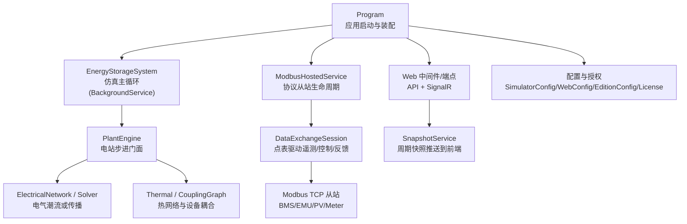
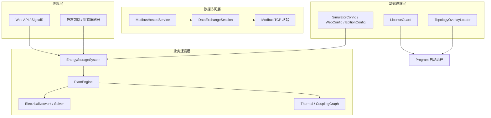
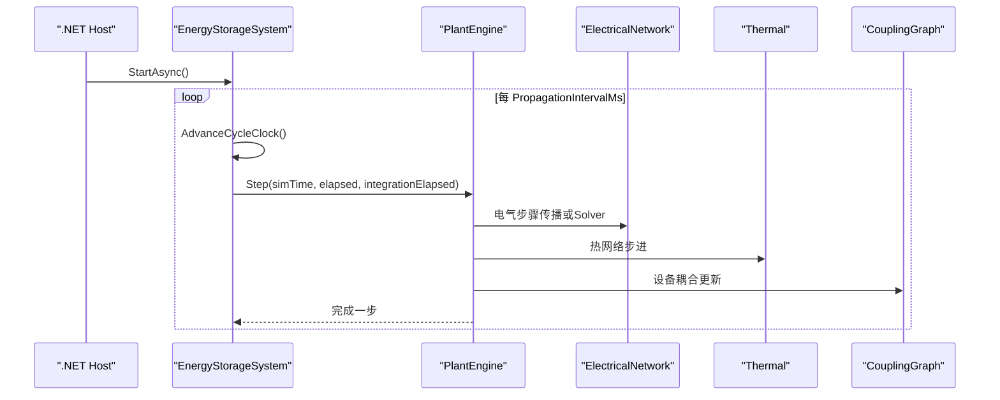
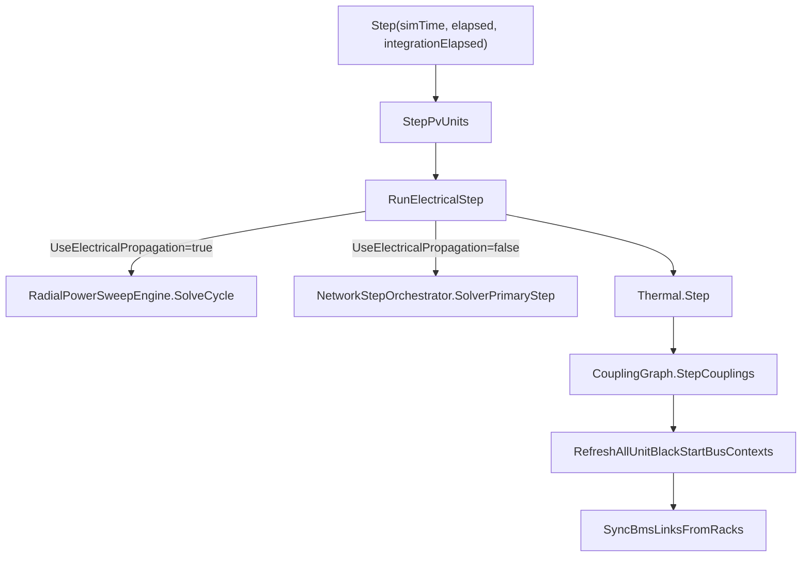
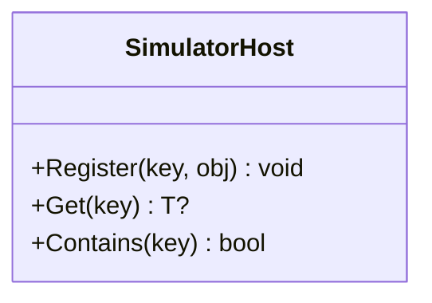
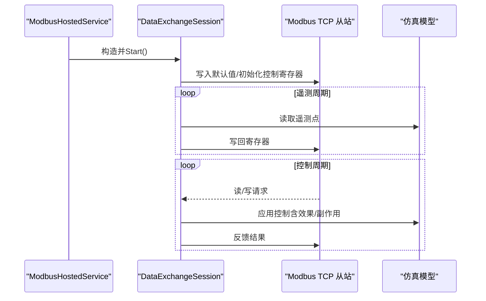
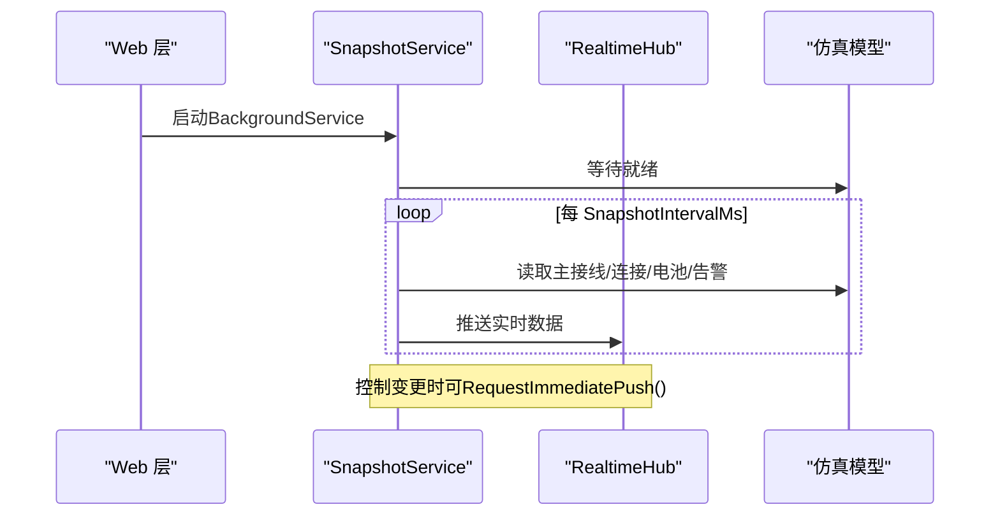
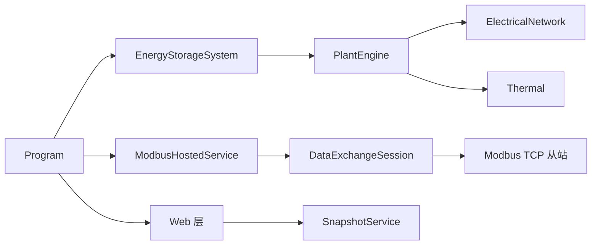

# 整体架构设计

<cite>
**本文引用的文件**
- [Program.cs](file://Program.cs)
- [SimulatorHost.cs](file://Core/SimulatorHost.cs)
- [EnergyStorageSys.cs](file://EssDeviceSimModel/EnergyStorageSys.cs)
- [PlantEngine.cs](file://EssDeviceSimModel/PlantEngine.cs)
- [ModbusHostedService.cs](file://Protocol/ModbusHostedService.cs)
- [DataExchangeSession.cs](file://DataExchange/DataExchangeSession.cs)
- [WebConfig.cs](file://Configuration/WebConfig.cs)
- [EditionConfig.cs](file://Configuration/EditionConfig.cs)
- [LicenseCrypto.cs](file://Licensing/LicenseCrypto.cs)
- [SnapshotService.cs](file://Web/SnapshotService.cs)
- [appsettings.json](file://appsettings.json)
</cite>

## 目录
1. [简介](#简介)
2. [项目结构](#项目结构)
3. [核心组件](#核心组件)
4. [架构总览](#架构总览)
5. [详细组件分析](#详细组件分析)
6. [依赖关系分析](#依赖关系分析)
7. [性能考虑](#性能考虑)
8. [故障排查指南](#故障排查指南)
9. [结论](#结论)
10. [附录](#附录)

## 简介
本文件为储能仿真系统的整体架构设计文档，面向系统设计与运维人员，兼顾非技术读者。文档围绕分层架构模式展开：表现层（Web界面）、业务逻辑层（仿真引擎）、数据访问层（协议通信）与基础设施层（配置管理、授权服务）。重点说明三个核心组件的职责：EnergyStorageSystem（系统协调器）、PlantEngine（电站级调度器）、SimulatorHost（主机服务），并阐述微服务化特点（组件解耦、独立部署、扩展性）。同时解释配置驱动机制如何通过JSON配置文件动态调整系统行为，并以架构图展示各层之间的依赖关系和数据流向。

## 项目结构
系统采用基于.NET Host的模块化组织方式，按职责划分到不同命名空间与目录：
- 入口与宿主：Program.cs 负责应用启动、配置绑定、服务注册、中间件与端点映射。
- 仿真内核：EssDeviceSimModel 包含 EnergyStorageSystem、PlantEngine 及电气/热/拓扑等模型。
- 协议通信：Protocol 提供 Modbus TCP 从站模拟；DataExchange 实现点表驱动的遥测/控制/反馈管道。
- Web 表现层：Web 提供 API、SignalR 实时推送、静态前端托管与拓扑编辑能力。
- 配置与授权：Configuration 定义运行时参数；Licensing 提供授权校验。

图表来源
- [Program.cs:258-522](file://Program.cs#L258-L522)
- [EnergyStorageSys.cs:124-245](file://EssDeviceSimModel/EnergyStorageSys.cs#L124-L245)
- [PlantEngine.cs:19-48](file://EssDeviceSimModel/PlantEngine.cs#L19-L48)
- [ModbusHostedService.cs:32-106](file://Protocol/ModbusHostedService.cs#L32-L106)
- [DataExchangeSession.cs:42-107](file://DataExchange/DataExchangeSession.cs#L42-L107)
- [SnapshotService.cs:46-130](file://Web/SnapshotService.cs#L46-L130)

章节来源
- [Program.cs:258-522](file://Program.cs#L258-L522)
- [appsettings.json:1-97](file://appsettings.json#L1-L97)

## 核心组件
- EnergyStorageSystem（系统协调器）
  - 作为 BackgroundService 运行仿真主循环，周期性推进 PlantEngine.Step，协调光伏单元、电气网络、热系统与耦合图更新。
  - 暴露断路器、负载、电网电压/频率、PCS黑启动等运行时控制接口，供上层通过API或协议写入。
  - 根据配置选择电气求解路径（事件驱动传播或Solver主路径），并维护信号路由与径向网络图。
- PlantEngine（电站级调度器）
  - 对外仅暴露 Step(simTime, elapsed, integrationElapsed)，封装电气步骤、热网络步进、耦合边更新、黑启动上下文刷新与BMS链路同步。
  - 内部根据 UseElectricalPropagation 选择 RadialPowerSweepEngine 或 NetworkStepOrchestrator。
- SimulatorHost（主机服务）
  - 单例容器，用于在进程内以键值形式注册和获取关键对象（如 ess、simEm、simBmsX、simPvX 等），支撑就绪检查与跨模块访问。
- DataExchangeSession（数据交换会话）
  - 点表驱动的遥测/控制/反馈三管道，将仿真模型状态与Modbus寄存器双向映射，支持簇级控制与事件驱动控制。
- ModbusHostedService（协议服务编排）
  - 统一创建并启动所有Modbus TCP从站（BMS、EMU、PV Logger/Meter、电表），并通过 SimulatorHost 注册以便就绪检测。
- SnapshotService（实时快照服务）
  - 周期读取仿真状态并通过SignalR推送至前端，支持“立即推送”触发，提升交互响应性。

章节来源
- [EnergyStorageSys.cs:24-245](file://EssDeviceSimModel/EnergyStorageSys.cs#L24-L245)
- [EnergyStorageSys.cs:473-496](file://EssDeviceSimModel/EnergyStorageSys.cs#L473-L496)
- [PlantEngine.cs:19-48](file://EssDeviceSimModel/PlantEngine.cs#L19-L48)
- [SimulatorHost.cs:5-26](file://Core/SimulatorHost.cs#L5-L26)
- [DataExchangeSession.cs:11-107](file://DataExchange/DataExchangeSession.cs#L11-L107)
- [ModbusHostedService.cs:13-106](file://Protocol/ModbusHostedService.cs#L13-L106)
- [SnapshotService.cs:9-130](file://Web/SnapshotService.cs#L9-L130)

## 架构总览
系统采用分层架构与微服务化思想：
- 表现层（Web）：ASP.NET Core 提供REST API与SignalR实时通道，承载前端页面与可视化。
- 业务逻辑层（仿真引擎）：EnergyStorageSystem 与 PlantEngine 构成仿真核心，负责时间步进、物理计算与控制策略执行。
- 数据访问层（协议通信）：ModbusHostedService 与 DataExchangeSession 实现与外部EMS/监控的Modbus TCP通信，点表驱动解耦具体设备。
- 基础设施层（配置与授权）：SimulatorConfig/WebConfig/EditionConfig 提供运行时参数；LicenseGuard 进行授权校验；TopologyOverlayLoader 支持工程模式覆盖。

图表来源
- [Program.cs:258-522](file://Program.cs#L258-L522)
- [EnergyStorageSys.cs:124-245](file://EssDeviceSimModel/EnergyStorageSys.cs#L124-L245)
- [PlantEngine.cs:19-48](file://EssDeviceSimModel/PlantEngine.cs#L19-L48)
- [ModbusHostedService.cs:32-106](file://Protocol/ModbusHostedService.cs#L32-L106)
- [DataExchangeSession.cs:42-107](file://DataExchange/DataExchangeSession.cs#L42-L107)

## 详细组件分析

### 组件A：EnergyStorageSystem（系统协调器）
- 职责
  - 构建并持有电气网络、热系统、耦合图、PCS/BMS设备列表、光伏单元。
  - 维护仿真时钟与主循环，调用 PlantEngine.Step 推进仿真。
  - 提供断路器、负载、电网电压/频率、PCS黑启动等运行时控制接口。
  - 根据配置选择电气求解路径（事件驱动传播或Solver主路径）。
- 关键流程
  - ExecuteAsync：周期性推进时钟并调用 PlantEngine.Step。
  - StepPvUnits：更新光伏出力并注入电气网络。
  - ApplyPcsGridWhenUnitDeenergized：无电场景下的PCS状态处理。
  - SyncUnitTransformerAfterPcsUpdate：单元变与站用电分摊同步。
- 复杂度与优化
  - 使用 PeriodicTimer 控制主循环间隔，避免阻塞。
  - 通过 UseElectricalPropagation 切换高效的事件驱动传播路径，降低迭代开销。
  - 信号路由与径向图减少全局耦合，提高可扩展性。

图表来源
- [EnergyStorageSys.cs:473-496](file://EssDeviceSimModel/EnergyStorageSys.cs#L473-L496)
- [PlantEngine.cs:19-48](file://EssDeviceSimModel/PlantEngine.cs#L19-L48)

章节来源
- [EnergyStorageSys.cs:124-245](file://EssDeviceSimModel/EnergyStorageSys.cs#L124-L245)
- [EnergyStorageSys.cs:473-496](file://EssDeviceSimModel/EnergyStorageSys.cs#L473-L496)

### 组件B：PlantEngine（电站级调度器）
- 职责
  - 封装电站级仿真步进顺序：光伏更新→电气步骤→热网络→耦合边→黑启动上下文→BMS链路同步。
  - 根据配置选择电气求解路径（RadialPowerSweepEngine 或 NetworkStepOrchestrator）。
- 关键点
  - 对外仅暴露 Step，隐藏内部复杂调度细节。
  - 与 EnergyStorageSystem 紧密协作，但不直接暴露设备细节给上层。

图表来源
- [PlantEngine.cs:19-48](file://EssDeviceSimModel/PlantEngine.cs#L19-L48)
- [EnergyStorageSys.cs:259-277](file://EssDeviceSimModel/EnergyStorageSys.cs#L259-L277)

章节来源
- [PlantEngine.cs:19-48](file://EssDeviceSimModel/PlantEngine.cs#L19-L48)

### 组件C：SimulatorHost（主机服务）
- 职责
  - 提供进程内对象注册与查找的单例容器，用于关键组件（ess、simEm、simBmsX、simPvX）的共享与就绪检查。
- 设计要点
  - 线程安全的 ConcurrentDictionary 存储。
  - 简单键值语义，便于 Program 与 Web 层进行状态探测。

图表来源
- [SimulatorHost.cs:5-26](file://Core/SimulatorHost.cs#L5-L26)

章节来源
- [SimulatorHost.cs:5-26](file://Core/SimulatorHost.cs#L5-L26)

### 组件D：数据交换会话（DataExchangeSession）
- 职责
  - 点表驱动的遥测/控制/反馈三管道，将仿真模型状态与Modbus寄存器双向映射。
  - 支持簇级控制、事件驱动控制与即时刷新操作状态。
- 关键流程
  - Start：初始化影子存储、默认值、控制寄存器，并启动遥测/控制/反馈线程。
  - ControlLoop/FeedbackLoop：轮询处理控制与反馈。
  - TelemetryLoop：周期性读取仿真状态并写回Modbus。

图表来源
- [ModbusHostedService.cs:32-106](file://Protocol/ModbusHostedService.cs#L32-L106)
- [DataExchangeSession.cs:238-290](file://DataExchange/DataExchangeSession.cs#L238-L290)
- [DataExchangeSession.cs:424-493](file://DataExchange/DataExchangeSession.cs#L424-L493)

章节来源
- [DataExchangeSession.cs:11-107](file://DataExchange/DataExchangeSession.cs#L11-L107)
- [DataExchangeSession.cs:238-290](file://DataExchange/DataExchangeSession.cs#L238-L290)
- [DataExchangeSession.cs:424-493](file://DataExchange/DataExchangeSession.cs#L424-L493)

### 组件E：Web表现层与实时推送（SnapshotService）
- 职责
  - 周期采样仿真状态并通过SignalR推送至前端，支持“立即推送”以提升交互体验。
  - 读取主接线、连接、电池概览与告警快照。
- 关键点
  - 等待仿真基本就绪后再开始推送。
  - 可配置推送间隔，下限保护避免过度推送。

图表来源
- [SnapshotService.cs:46-130](file://Web/SnapshotService.cs#L46-L130)

章节来源
- [SnapshotService.cs:9-130](file://Web/SnapshotService.cs#L9-L130)

## 依赖关系分析
- 组件耦合与内聚
  - EnergyStorageSystem 高内聚于仿真内核，PlantEngine 作为门面降低上层复杂度。
  - DataExchangeSession 通过点表与适配器解耦具体设备，提升可替换性。
  - ModbusHostedService 集中管理协议从站生命周期，避免分散启动逻辑。
- 直接/间接依赖
  - Program 依赖配置与服务发现（SimulatorHost），并注册各HostedService。
  - Web 层依赖 SignalR 与 TopologyStore，通过 API 与实时通道与后端交互。
- 外部依赖与集成点
  - Modbus TCP 从站作为外部EMS/监控的集成点。
  - JSON配置文件（appsettings.json）驱动运行时行为与拓扑规模。
- 接口契约
  - PlantEngine.Step 为仿真步进唯一入口。
  - DataExchangeSession 提供遥测/控制/反馈的统一接口。

图表来源
- [Program.cs:258-522](file://Program.cs#L258-L522)
- [EnergyStorageSys.cs:124-245](file://EssDeviceSimModel/EnergyStorageSys.cs#L124-L245)
- [PlantEngine.cs:19-48](file://EssDeviceSimModel/PlantEngine.cs#L19-L48)
- [ModbusHostedService.cs:32-106](file://Protocol/ModbusHostedService.cs#L32-L106)
- [DataExchangeSession.cs:42-107](file://DataExchange/DataExchangeSession.cs#L42-L107)
- [SnapshotService.cs:46-130](file://Web/SnapshotService.cs#L46-L130)

章节来源
- [Program.cs:258-522](file://Program.cs#L258-L522)
- [EnergyStorageSys.cs:124-245](file://EssDeviceSimModel/EnergyStorageSys.cs#L124-L245)
- [PlantEngine.cs:19-48](file://EssDeviceSimModel/PlantEngine.cs#L19-L48)
- [ModbusHostedService.cs:32-106](file://Protocol/ModbusHostedService.cs#L32-L106)
- [DataExchangeSession.cs:42-107](file://DataExchange/DataExchangeSession.cs#L42-L107)
- [SnapshotService.cs:46-130](file://Web/SnapshotService.cs#L46-L130)

## 性能考虑
- 仿真主循环
  - 使用 PeriodicTimer 控制间隔，避免CPU占用过高。
  - 通过 IntegrationStepMultiplier 放大积分量dt，平衡精度与性能。
- 电气求解路径
  - UseElectricalPropagation=true 时采用事件驱动传播，减少迭代次数，提升吞吐。
  - 可配置 Q-U/V 收敛阈值与最大迭代轮数，平衡精度与速度。
- 协议通信
  - DataExchangeSession 支持事件驱动控制，减少轮询延迟。
  - 遥测/控制/反馈线程优先级较低，避免影响仿真主循环。
- Web推送
  - SnapshotService 可配置推送间隔，下限保护避免频繁推送。
  - 支持立即推送，提升控制响应体验。

[本节为通用性能指导，不直接分析具体文件]

## 故障排查指南
- 授权校验失败
  - 现象：启动时报错并退出，提示机器码与授权不匹配或过期。
  - 处理：确认 license.txt 存在且签名有效；使用 --machine-id 获取本机机器码；重新申请授权。
  - 参考实现：LicenseGuard.ValidateFile 与 Program 中的授权强制逻辑。
- 仿真未就绪导致dpc初始读取异常
  - 现象：Web或dpc启动后无法读取必要变量。
  - 处理：等待模拟器就绪（Program 中 WaitForSimulatorReadyAsync 超时前重试）；检查 Modbus 从站是否全部启动。
  - 参考实现：Program 中的 IsSimulatorReady 与 ModbusHostedService 启动日志。
- 协议从站启动失败
  - 现象：日志提示点表CSV不可用或端口冲突。
  - 处理：确保点表文件已同步；检查端口占用；查看 DataExchangeSession 启动日志。
  - 参考实现：ModbusHostedService 启动与错误日志。
- 实时推送异常
  - 现象：前端无数据或数据延迟。
  - 处理：检查 SnapshotService 是否启动；确认 SignalR 连接正常；调整推送间隔。
  - 参考实现：SnapshotService 启动与推送逻辑。

章节来源
- [LicenseCrypto.cs:183-248](file://Licensing/LicenseCrypto.cs#L183-L248)
- [Program.cs:141-178](file://Program.cs#L141-L178)
- [Program.cs:52-139](file://Program.cs#L52-L139)
- [ModbusHostedService.cs:98-106](file://Protocol/ModbusHostedService.cs#L98-L106)
- [SnapshotService.cs:46-130](file://Web/SnapshotService.cs#L46-L130)

## 结论
本系统采用清晰的分层架构与微服务化设计，通过 EnergyStorageSystem、PlantEngine 与 SimulatorHost 明确职责边界，结合 DataExchangeSession 的点表驱动与 ModbusHostedService 的统一编排，实现了高内聚、低耦合的可扩展仿真平台。配置驱动机制通过 JSON 配置文件灵活调整系统行为，支持多档位与工程模式。Web 层提供友好的可视化与实时交互，满足储能仿真与调试需求。

[本节为总结性内容，不直接分析具体文件]

## 附录
- 配置驱动机制
  - appsettings.json 定义运行时参数、协议端口、PCC/变压器/负载/PCS 参数、Edition 档位与 License 要求。
  - Program 中通过 Configuration 绑定与 PostConfigure 覆盖，支持工程模式 overlay 动态调整拓扑与设备。
  - WebConfig 控制HTTP监听、CORS、快照推送间隔与API Key鉴权。
  - EditionConfig 控制产品档位特性（社区版/商业版/定制版）与功能开关。

章节来源
- [appsettings.json:1-97](file://appsettings.json#L1-L97)
- [Program.cs:258-378](file://Program.cs#L258-L378)
- [WebConfig.cs:3-37](file://Configuration/WebConfig.cs#L3-L37)
- [EditionConfig.cs:3-55](file://Configuration/EditionConfig.cs#L3-L55)