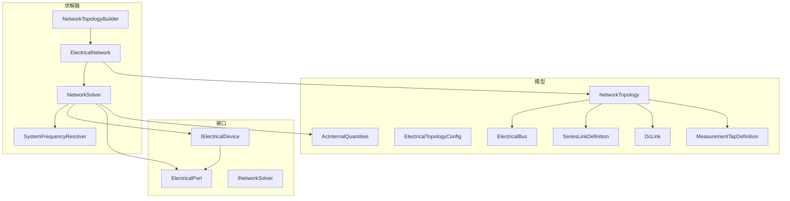
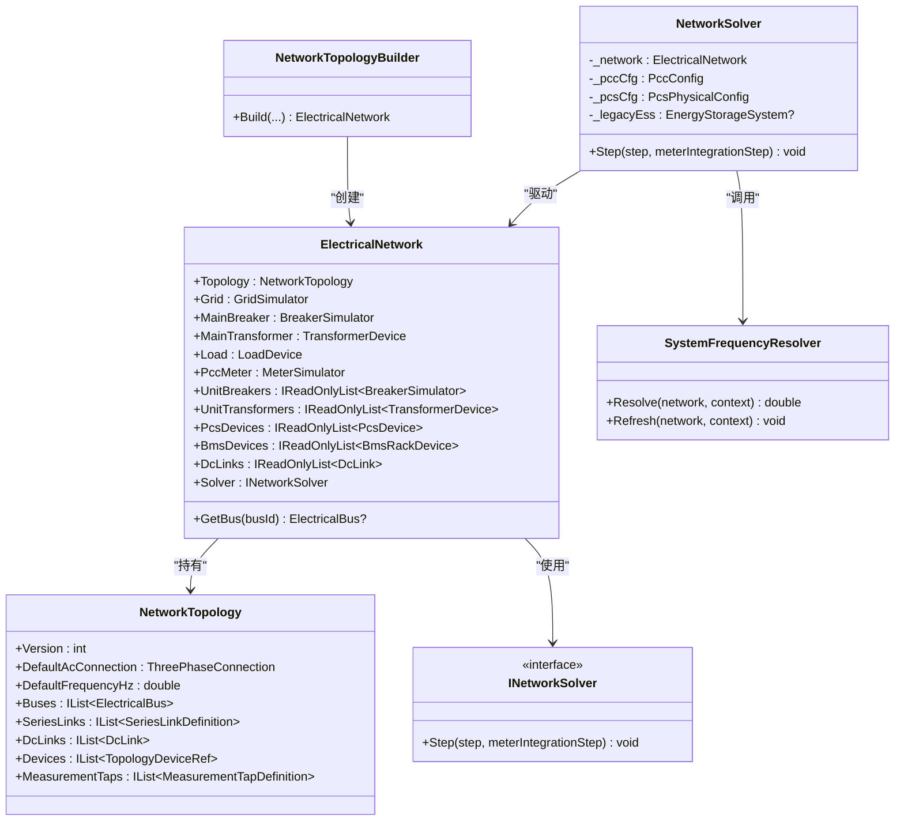
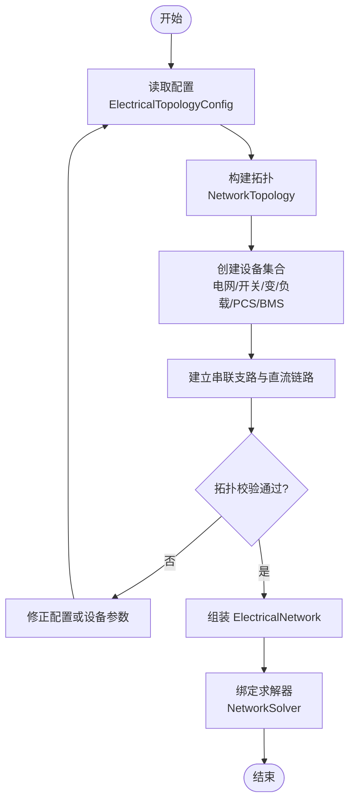
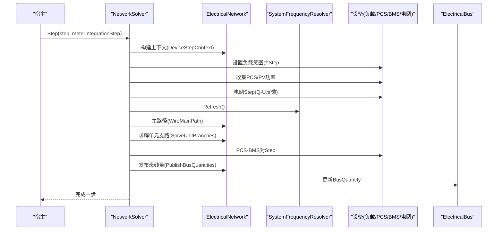
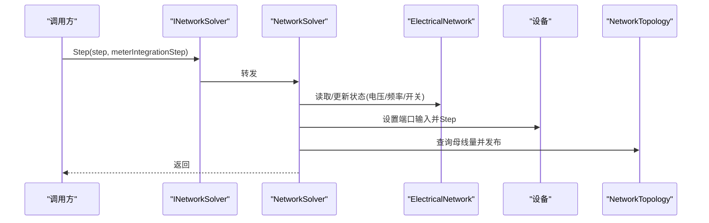
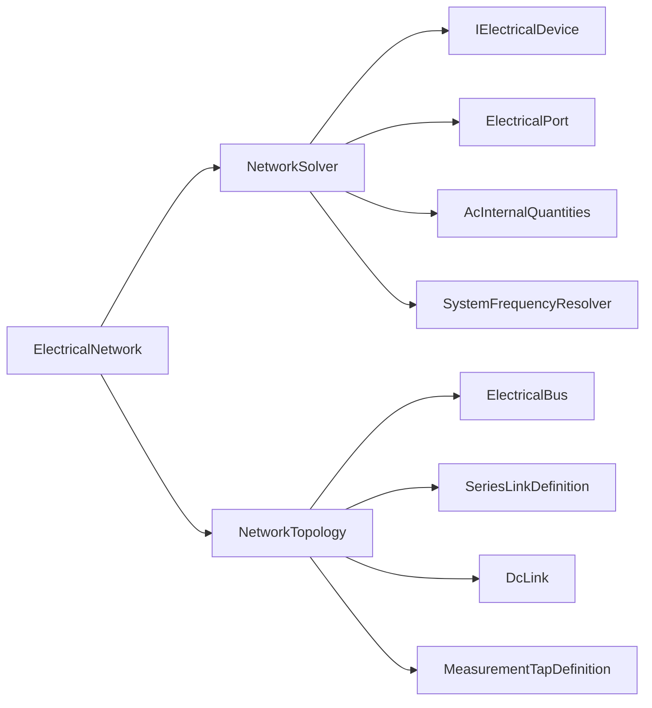

# ElectricalNetwork 电气网络

<cite>
**本文引用的文件**
- [ElectricalNetwork.cs](file://EssDeviceSimModel/Solver/ElectricalNetwork.cs)
- [NetworkTopologyBuilder.cs](file://EssDeviceSimModel/Solver/NetworkTopologyBuilder.cs)
- [NetworkSolver.cs](file://EssDeviceSimModel/Solver/NetworkSolver.cs)
- [INetworkSolver.cs](file://EssDeviceSimModel/Interface/INetworkSolver.cs)
- [SystemFrequencyResolver.cs](file://EssDeviceSimModel/Solver/SystemFrequencyResolver.cs)
- [NetworkTopology.cs](file://EssDeviceSimModel/Model/NetworkTopology.cs)
- [ElectricalBus.cs](file://EssDeviceSimModel/Model/ElectricalBus.cs)
- [ElectricalTopologyConfig.cs](file://EssDeviceSimModel/Model/ElectricalTopologyConfig.cs)
- [SeriesLinkDefinition.cs](file://EssDeviceSimModel/Model/SeriesLinkDefinition.cs)
- [DcLink.cs](file://EssDeviceSimModel/Model/DcLink.cs)
- [AcInternalQuantities.cs](file://EssDeviceSimModel/Model/AcInternalQuantities.cs)
- [IElectricalDevice.cs](file://EssDeviceSimModel/Interface/IElectricalDevice.cs)
- [ElectricalPort.cs](file://EssDeviceSimModel/Model/ElectricalPort.cs)
- [MeasurementTapDefinition.cs](file://EssDeviceSimModel/Model/MeasurementTapDefinition.cs)
</cite>

## 目录
1. [简介](#简介)
2. [项目结构](#项目结构)
3. [核心组件](#核心组件)
4. [架构总览](#架构总览)
5. [详细组件分析](#详细组件分析)
6. [依赖关系分析](#依赖关系分析)
7. [性能考虑](#性能考虑)
8. [故障排查指南](#故障排查指南)
9. [结论](#结论)
10. [附录](#附录)

## 简介
本文件围绕 ElectricalNetwork 类及其相关求解与拓扑构建组件，系统化阐述储能仿真系统中“电气网络”的抽象建模、拓扑构建、状态维护、查询接口以及与求解器的集成方式。文档面向不同技术背景的读者，提供从概念到代码级映射的完整说明，并辅以架构图、数据流图与时序图，帮助快速理解与扩展。

## 项目结构
ElectricalNetwork 位于求解器层，负责承载设备实例、拓扑容器与求解器引用；NetworkTopologyBuilder 负责根据配置构建拓扑与设备集合；NetworkSolver 实现每步仿真推进；SystemFrequencyResolver 提供系统频率解析；各类 Model 定义节点、支路、端口与测量点等基础数据结构。

图表来源
- [NetworkTopologyBuilder.cs:10-108](file://EssDeviceSimModel/Solver/NetworkTopologyBuilder.cs#L10-L108)
- [ElectricalNetwork.cs:10-34](file://EssDeviceSimModel/Solver/ElectricalNetwork.cs#L10-L34)
- [NetworkTopology.cs:3-14](file://EssDeviceSimModel/Model/NetworkTopology.cs#L3-L14)
- [ElectricalBus.cs:3-11](file://EssDeviceSimModel/Model/ElectricalBus.cs#L3-L11)
- [SeriesLinkDefinition.cs:3-10](file://EssDeviceSimModel/Model/SeriesLinkDefinition.cs#L3-L10)
- [DcLink.cs:3-10](file://EssDeviceSimModel/Model/DcLink.cs#L3-L10)
- [AcInternalQuantities.cs:7-29](file://EssDeviceSimModel/Model/AcInternalQuantities.cs#L7-L29)
- [MeasurementTapDefinition.cs:9-15](file://EssDeviceSimModel/Model/MeasurementTapDefinition.cs#L9-L15)
- [INetworkSolver.cs:3-6](file://EssDeviceSimModel/Interface/INetworkSolver.cs#L3-L6)
- [IElectricalDevice.cs:5-12](file://EssDeviceSimModel/Interface/IElectricalDevice.cs#L5-L12)
- [ElectricalPort.cs:3-9](file://EssDeviceSimModel/Model/ElectricalPort.cs#L3-L9)

章节来源
- [NetworkTopologyBuilder.cs:10-108](file://EssDeviceSimModel/Solver/NetworkTopologyBuilder.cs#L10-L108)
- [ElectricalNetwork.cs:10-34](file://EssDeviceSimModel/Solver/ElectricalNetwork.cs#L10-L34)

## 核心组件
- ElectricalNetwork：运行时容器，持有拓扑、电网、主开关、主变、负载、PCC 电表、单元开关/变压器、PCS/BMS、直流链路及求解器引用，并提供母线查询能力。
- NetworkTopologyBuilder：依据配置构建拓扑（母线、串联支路、测量抽头）、设备集合与直流链路，并装配求解器。
- NetworkSolver：实现 INetworkSolver.Step，驱动负载、PCS/PV、电网、主路径、单元支路与 PCS-BMS 对，完成一次仿真步推进。
- SystemFrequencyResolver：在每步刷新系统唯一频率，支持并网与孤岛两种模式。
- 模型层：ElectricalBus、SeriesLinkDefinition、DcLink、AcInternalQuantities、MeasurementTapDefinition 等描述拓扑与物理量。

章节来源
- [ElectricalNetwork.cs:10-34](file://EssDeviceSimModel/Solver/ElectricalNetwork.cs#L10-L34)
- [NetworkTopologyBuilder.cs:10-108](file://EssDeviceSimModel/Solver/NetworkTopologyBuilder.cs#L10-L108)
- [NetworkSolver.cs:27-107](file://EssDeviceSimModel/Solver/NetworkSolver.cs#L27-L107)
- [SystemFrequencyResolver.cs:10-43](file://EssDeviceSimModel/Solver/SystemFrequencyResolver.cs#L10-L43)
- [NetworkTopology.cs:3-14](file://EssDeviceSimModel/Model/NetworkTopology.cs#L3-L14)
- [ElectricalBus.cs:3-11](file://EssDeviceSimModel/Model/ElectricalBus.cs#L3-L11)
- [SeriesLinkDefinition.cs:3-10](file://EssDeviceSimModel/Model/SeriesLinkDefinition.cs#L3-L10)
- [DcLink.cs:3-10](file://EssDeviceSimModel/Model/DcLink.cs#L3-L10)
- [AcInternalQuantities.cs:7-29](file://EssDeviceSimModel/Model/AcInternalQuantities.cs#L7-L29)
- [MeasurementTapDefinition.cs:9-15](file://EssDeviceSimModel/Model/MeasurementTapDefinition.cs#L9-L15)

## 架构总览
ElectricalNetwork 作为运行时容器，将设备、拓扑与求解器聚合在一起；NetworkTopologyBuilder 负责按配置装配；NetworkSolver 以 Step 为节拍驱动各设备与路径计算；SystemFrequencyResolver 提供统一频率源；模型层提供统一的物理量表达与拓扑定义。

图表来源
- [ElectricalNetwork.cs:10-34](file://EssDeviceSimModel/Solver/ElectricalNetwork.cs#L10-L34)
- [NetworkTopology.cs:3-14](file://EssDeviceSimModel/Model/NetworkTopology.cs#L3-L14)
- [INetworkSolver.cs:3-6](file://EssDeviceSimModel/Interface/INetworkSolver.cs#L3-L6)
- [NetworkTopologyBuilder.cs:10-108](file://EssDeviceSimModel/Solver/NetworkTopologyBuilder.cs#L10-L108)
- [NetworkSolver.cs:27-107](file://EssDeviceSimModel/Solver/NetworkSolver.cs#L27-L107)
- [SystemFrequencyResolver.cs:10-43](file://EssDeviceSimModel/Solver/SystemFrequencyResolver.cs#L10-L43)

## 详细组件分析

### 电气网络的抽象建模
- 节点（母线）：ElectricalBus 表示交流母线，包含额定线电压、连接方式、描述以及当前 BusQuantity（三相线电压、电流、相位角、频率）。
- 支路：SeriesLinkDefinition 描述串联支路的上下游母线与设备类型（如断路器、变压器），用于拓扑构建与验证。
- 设备：通过 IElectricalDevice 抽象出设备接口，统一 Step 推进与端口访问；具体设备包括断路器、变压器、负载、PCS、BMS、电网模拟器等。
- 端口：ElectricalPort 提供输入输出快照，支持交流与直流域，用于设备间能量与信息传递。
- 直流链路：DcLink 描述 PCS 与 BMS 之间的直流耦合关系，支持开闭状态控制。
- 测量抽头：MeasurementTapDefinition 指定电表从某设备的某端口采集数据，便于功率计量与可视化。

章节来源
- [ElectricalBus.cs:3-11](file://EssDeviceSimModel/Model/ElectricalBus.cs#L3-L11)
- [SeriesLinkDefinition.cs:3-10](file://EssDeviceSimModel/Model/SeriesLinkDefinition.cs#L3-L10)
- [IElectricalDevice.cs:5-12](file://EssDeviceSimModel/Interface/IElectricalDevice.cs#L5-L12)
- [ElectricalPort.cs:3-9](file://EssDeviceSimModel/Model/ElectricalPort.cs#L3-L9)
- [DcLink.cs:3-10](file://EssDeviceSimModel/Model/DcLink.cs#L3-L10)
- [MeasurementTapDefinition.cs:9-15](file://EssDeviceSimModel/Model/MeasurementTapDefinition.cs#L9-L15)

### 拓扑构建过程
- 配置阶段：使用 ElectricalTopologyConfig 定义默认连接方式、频率、母线、串联支路、直流链路、设备引用与测量抽头。
- 构建阶段：NetworkTopologyBuilder.Build 根据配置生成 NetworkTopology，创建电网、主开关、主变、负载、PCC 电表、单元开关/变压器、PCS/BMS 与直流链路，并将它们注入 ElectricalNetwork。
- 拓扑验证：通过 SeriesLinkDefinition 的上下游母线与设备类型约束，确保拓扑连通性与一致性；MeasurementTapDefinition 保证电表采样点有效。
- 结果：得到可运行的 ElectricalNetwork，包含完整的拓扑与设备集合，并绑定求解器。

图表来源
- [ElectricalTopologyConfig.cs:3-33](file://EssDeviceSimModel/Model/ElectricalTopologyConfig.cs#L3-L33)
- [NetworkTopologyBuilder.cs:10-108](file://EssDeviceSimModel/Solver/NetworkTopologyBuilder.cs#L10-L108)
- [SeriesLinkDefinition.cs:3-10](file://EssDeviceSimModel/Model/SeriesLinkDefinition.cs#L3-L10)
- [DcLink.cs:3-10](file://EssDeviceSimModel/Model/DcLink.cs#L3-L10)
- [MeasurementTapDefinition.cs:9-15](file://EssDeviceSimModel/Model/MeasurementTapDefinition.cs#L9-L15)

章节来源
- [NetworkTopologyBuilder.cs:10-108](file://EssDeviceSimModel/Solver/NetworkTopologyBuilder.cs#L10-L108)
- [ElectricalTopologyConfig.cs:3-33](file://EssDeviceSimModel/Model/ElectricalTopologyConfig.cs#L3-L33)

### 网络状态维护机制
- 物理量存储：AcInternalQuantities 统一表达交流内部量（线电压、线电流、相位角、频率），并派生有功、无功、视在功率与功率因数。
- 状态更新：NetworkSolver.Step 在每个仿真步中依次设置端口输入、驱动设备 Step、汇总功率、刷新电网与主路径、求解单元支路与 PCS-BMS 对，最后发布母线物理量。
- 频率管理：SystemFrequencyResolver.Refresh 在每步刷新系统唯一频率，支持并网（取电网频率）与孤岛（取构网 PCS 频率）两种模式。
- 母线量发布：通过 ElectricalBus.BusQuantity 发布当前母线电压、频率等关键量，供上层查询与展示。

图表来源
- [NetworkSolver.cs:27-107](file://EssDeviceSimModel/Solver/NetworkSolver.cs#L27-L107)
- [SystemFrequencyResolver.cs:10-43](file://EssDeviceSimModel/Solver/SystemFrequencyResolver.cs#L10-L43)
- [AcInternalQuantities.cs:7-29](file://EssDeviceSimModel/Model/AcInternalQuantities.cs#L7-L29)
- [ElectricalBus.cs:3-11](file://EssDeviceSimModel/Model/ElectricalBus.cs#L3-L11)

章节来源
- [NetworkSolver.cs:27-107](file://EssDeviceSimModel/Solver/NetworkSolver.cs#L27-L107)
- [SystemFrequencyResolver.cs:10-43](file://EssDeviceSimModel/Solver/SystemFrequencyResolver.cs#L10-L43)
- [AcInternalQuantities.cs:7-29](file://EssDeviceSimModel/Model/AcInternalQuantities.cs#L7-L29)
- [ElectricalBus.cs:3-11](file://EssDeviceSimModel/Model/ElectricalBus.cs#L3-L11)

### 网络查询接口
- 母线查询：ElectricalNetwork.GetBus 支持按 busId 获取 ElectricalBus，进而读取 BusQuantity（电压、频率、电流等）。
- 短路容量：可通过 PCC 配置的短路容量参数参与电网 Q-U 与电压推导，结合主变变比与负载/PCS 功率进行近似评估（具体算法由电网模拟器与转换工具实现）。
- 潮流分布：通过总线量发布与设备端口输出，可获取各母线与支路的电压、电流、功率分布。
- 故障定位：基于断路器状态与母线电压/电流异常，结合测量抽头数据，可辅助定位故障区间（例如主断分闸导致站用电失压）。

章节来源
- [ElectricalNetwork.cs:32-34](file://EssDeviceSimModel/Solver/ElectricalNetwork.cs#L32-L34)
- [NetworkTopologyBuilder.cs:111-210](file://EssDeviceSimModel/Solver/NetworkTopologyBuilder.cs#L111-L210)
- [MeasurementTapDefinition.cs:9-15](file://EssDeviceSimModel/Model/MeasurementTapDefinition.cs#L9-L15)

### 与求解器的集成方式
- 接口约定：INetworkSolver.Step(step, meterIntegrationStep) 定义单步推进接口，所有求解逻辑封装于实现类（NetworkSolver）。
- 数据交换格式：设备端口使用 ElectricalPortSnapshot 与 AcInternalQuantities 表达交流量；直流侧使用 DcSnapshot；拓扑使用 NetworkTopology 与相关定义。
- 性能优化策略：
  - 顺序步进：负载→PCS/PV→电网→主路径→单元支路→PCS-BMS对，减少迭代次数。
  - 频率解析集中化：SystemFrequencyResolver 统一刷新系统频率，避免重复计算。
  - 端口快照复用：SetAcInput 复用快照构造，降低对象分配。
  - 可选旧版 ESS 兼容：在孤岛估算时回退至历史逻辑，提升兼容性。

图表来源
- [INetworkSolver.cs:3-6](file://EssDeviceSimModel/Interface/INetworkSolver.cs#L3-L6)
- [NetworkSolver.cs:27-107](file://EssDeviceSimModel/Solver/NetworkSolver.cs#L27-L107)
- [ElectricalNetwork.cs:10-34](file://EssDeviceSimModel/Solver/ElectricalNetwork.cs#L10-L34)
- [NetworkTopology.cs:3-14](file://EssDeviceSimModel/Model/NetworkTopology.cs#L3-L14)

章节来源
- [INetworkSolver.cs:3-6](file://EssDeviceSimModel/Interface/INetworkSolver.cs#L3-L6)
- [NetworkSolver.cs:27-107](file://EssDeviceSimModel/Solver/NetworkSolver.cs#L27-L107)
- [ElectricalNetwork.cs:10-34](file://EssDeviceSimModel/Solver/ElectricalNetwork.cs#L10-L34)
- [NetworkTopology.cs:3-14](file://EssDeviceSimModel/Model/NetworkTopology.cs#L3-L14)

## 依赖关系分析
- 松耦合设计：ElectricalNetwork 仅持有设备与拓扑引用，不直接实现求解细节；求解逻辑集中在 NetworkSolver。
- 明确边界：模型层（NetworkTopology、ElectricalBus、AcInternalQuantities）与求解层（NetworkSolver、SystemFrequencyResolver）职责清晰。
- 外部依赖：设备实现（如 GridSimulator、BreakerSimulator、TransformerDevice、LoadDevice、PcsDevice、BmsRackDevice）通过 IElectricalDevice 接口被统一调度。
- 潜在循环：无直接循环依赖；拓扑构建与求解分离，避免循环引用。

图表来源
- [ElectricalNetwork.cs:10-34](file://EssDeviceSimModel/Solver/ElectricalNetwork.cs#L10-L34)
- [NetworkSolver.cs:27-107](file://EssDeviceSimModel/Solver/NetworkSolver.cs#L27-L107)
- [NetworkTopology.cs:3-14](file://EssDeviceSimModel/Model/NetworkTopology.cs#L3-L14)
- [IElectricalDevice.cs:5-12](file://EssDeviceSimModel/Interface/IElectricalDevice.cs#L5-L12)
- [ElectricalPort.cs:3-9](file://EssDeviceSimModel/Model/ElectricalPort.cs#L3-L9)
- [AcInternalQuantities.cs:7-29](file://EssDeviceSimModel/Model/AcInternalQuantities.cs#L7-L29)
- [SystemFrequencyResolver.cs:10-43](file://EssDeviceSimModel/Solver/SystemFrequencyResolver.cs#L10-L43)

章节来源
- [ElectricalNetwork.cs:10-34](file://EssDeviceSimModel/Solver/ElectricalNetwork.cs#L10-L34)
- [NetworkSolver.cs:27-107](file://EssDeviceSimModel/Solver/NetworkSolver.cs#L27-L107)
- [NetworkTopology.cs:3-14](file://EssDeviceSimModel/Model/NetworkTopology.cs#L3-L14)

## 性能考虑
- 步进顺序优化：负载与 PCS/PV 功率先汇总，再驱动电网与主路径，减少多次迭代。
- 频率解析缓存：SystemFrequencyResolver 每步刷新一次，避免重复计算。
- 端口快照复用：SetAcInput 复用快照构造，降低内存分配。
- 可扩展性：通过 INetworkSolver 接口替换求解实现，便于引入更高效算法。

[本节为通用指导，无需特定文件来源]

## 故障排查指南
- 主断分闸导致站用电失压：检查 MainBreaker 状态与主路径推导逻辑，确认 StationBus35LineVoltageV 估计是否合理。
- 频率异常：查看 SystemFrequencyResolver 选择逻辑，确认并网或孤岛模式下频率来源是否正确。
- 母线量为空：确认 PublishBusQuantities 是否执行，以及 GetBus 查询的 busId 是否存在。
- 电表读数异常：核对 MeasurementTapDefinition 的 SourceDeviceId 与 SourcePortId 配置，以及采样步骤是否触发。

章节来源
- [NetworkSolver.cs:117-158](file://EssDeviceSimModel/Solver/NetworkSolver.cs#L117-L158)
- [SystemFrequencyResolver.cs:10-43](file://EssDeviceSimModel/Solver/SystemFrequencyResolver.cs#L10-L43)
- [MeasurementTapDefinition.cs:9-15](file://EssDeviceSimModel/Model/MeasurementTapDefinition.cs#L9-L15)

## 结论
ElectricalNetwork 通过清晰的模型与求解分层，实现了电气网络的抽象建模、拓扑构建、状态维护与查询能力。其模块化设计与明确的接口约定，使得系统易于扩展与维护，同时为短路容量、潮流分析与故障定位提供了坚实基础。

[本节为总结性内容，无需特定文件来源]

## 附录
- 术语表
  - 母线：交流节点，承载电压与频率信息。
  - 支路：连接两个母线的串联元件（如断路器、变压器）。
  - 端口：设备间的能量与信息交互点，支持交流与直流。
  - 测量抽头：电表采样点的拓扑定义。
- 参考路径
  - 拓扑构建：[NetworkTopologyBuilder.cs:10-108](file://EssDeviceSimModel/Solver/NetworkTopologyBuilder.cs#L10-L108)
  - 步进流程：[NetworkSolver.cs:27-107](file://EssDeviceSimModel/Solver/NetworkSolver.cs#L27-L107)
  - 频率解析：[SystemFrequencyResolver.cs:10-43](file://EssDeviceSimModel/Solver/SystemFrequencyResolver.cs#L10-L43)
  - 物理量表达：[AcInternalQuantities.cs:7-29](file://EssDeviceSimModel/Model/AcInternalQuantities.cs#L7-L29)

[本节为补充信息，无需特定文件来源]