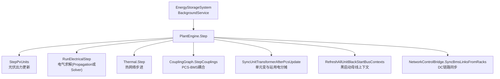
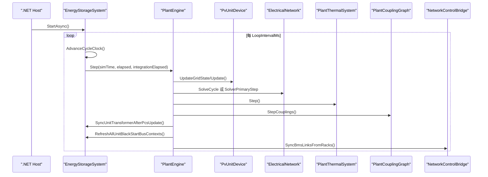
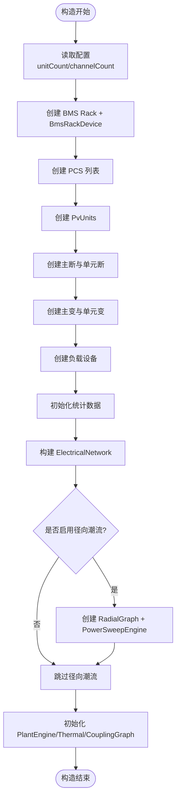
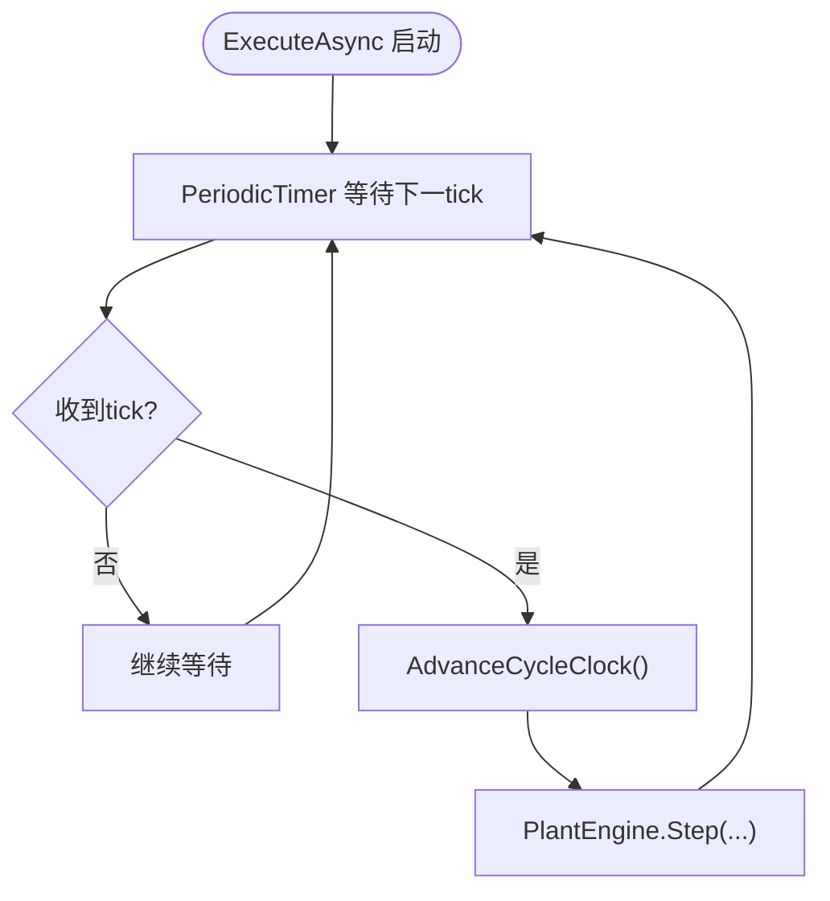
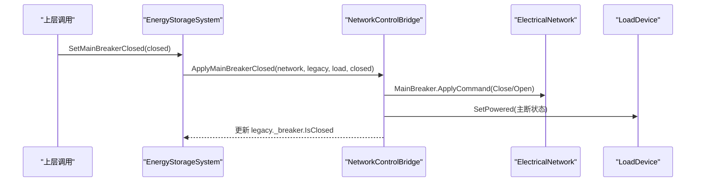
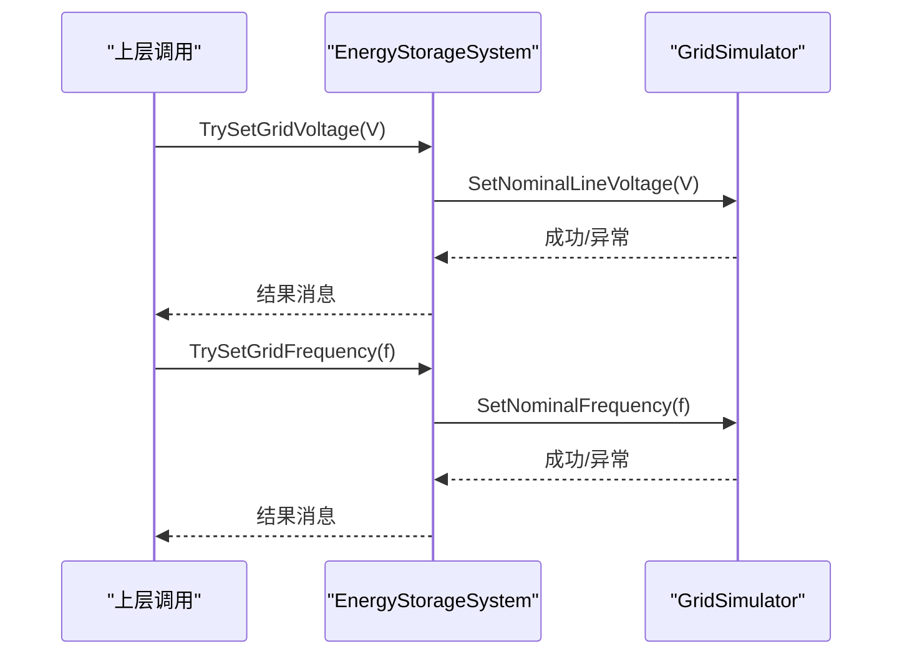
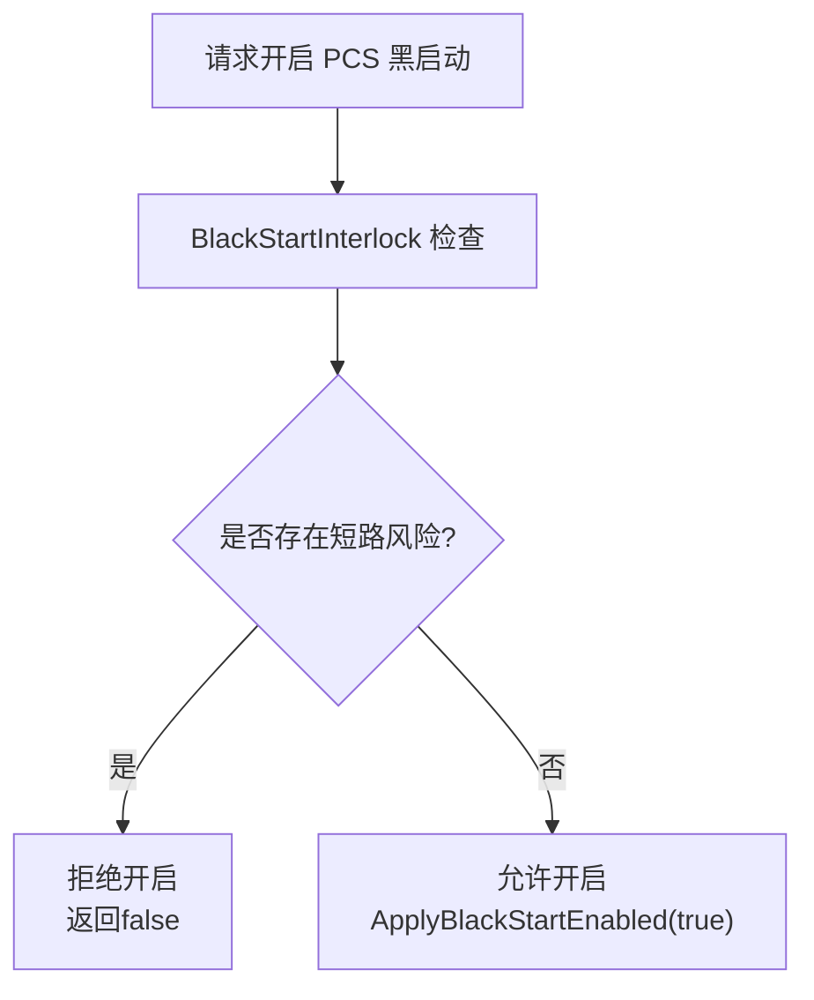
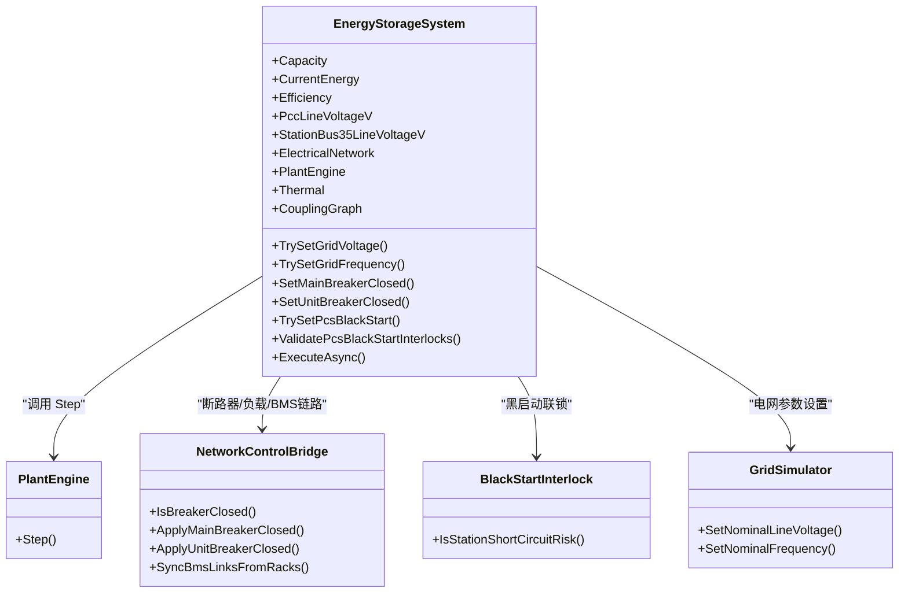
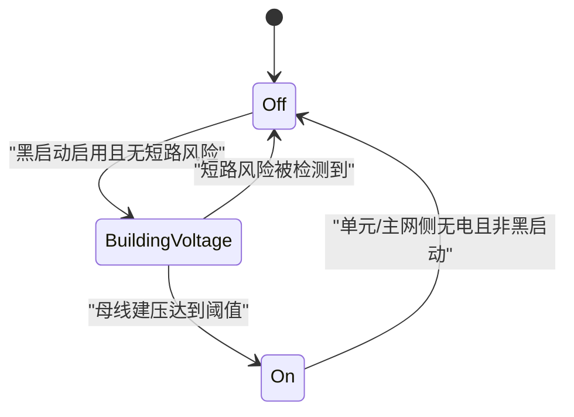
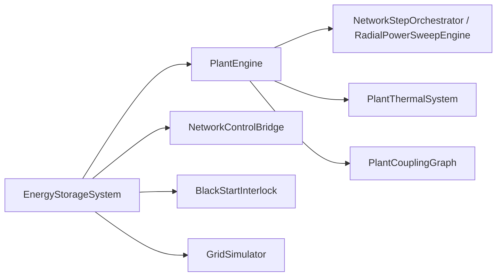

# EnergyStorageSystem 系统入口

<cite>
**本文引用的文件**
- [EnergyStorageSys.cs](file://EssDeviceSimModel/EnergyStorageSys.cs)
- [PlantEngine.cs](file://EssDeviceSimModel/PlantEngine.cs)
- [BlackStartInterlock.cs](file://EssDeviceSimModel/BlackStartInterlock.cs)
- [NetworkControlBridge.cs](file://EssDeviceSimModel/Solver/NetworkControlBridge.cs)
- [GridSimulator.cs](file://EssDeviceSimModel/Devices/GridSimulator.cs)
</cite>

## 目录
1. [简介](#简介)
2. [项目结构](#项目结构)
3. [核心组件](#核心组件)
4. [架构总览](#架构总览)
5. [详细组件分析](#详细组件分析)
6. [依赖关系分析](#依赖关系分析)
7. [性能考虑](#性能考虑)
8. [故障排查指南](#故障排查指南)
9. [结论](#结论)
10. [附录](#附录)

## 简介
EnergyStorageSystem 是储能仿真系统的核心入口，负责设备初始化、生命周期管理、仿真主循环控制与电气网络协调。它统一编排电池架（BMS）、PCS、变压器、负载、光伏单元等设备的创建与运行，并通过 PlantEngine 驱动每步仿真推进，同时提供断路器控制、电网电压/频率设置、黑启动联锁检查等关键能力。

## 项目结构
EnergyStorageSystem 位于 EssDeviceSimModel 命名空间下，作为 BackgroundService 运行于 .NET Host 中，通过定时器周期调用 PlantEngine.Step 完成一步仿真。其职责边界清晰：
- 构造期：按配置批量创建 BMS/Rack、PCS、变压器、负载、电气网络、热子系统、耦合图。
- 运行期：维护仿真时钟，周期性执行 PV 更新、电气求解、热网络步进、耦合同步、单元变与黑启动上下文刷新。
- 控制面：暴露断路器、负载计划、电网参数、黑启动开关等运行时接口，并桥接到电气网络。

图表来源
- [EnergyStorageSys.cs:24-245](file://EssDeviceSimModel/EnergyStorageSys.cs#L24-L245)
- [PlantEngine.cs:22-31](file://EssDeviceSimModel/PlantEngine.cs#L22-L31)

章节来源
- [EnergyStorageSys.cs:24-245](file://EssDeviceSimModel/EnergyStorageSys.cs#L24-L245)
- [PlantEngine.cs:1-51](file://EssDeviceSimModel/PlantEngine.cs#L1-L51)

## 核心组件
- 设备集合
  - 电池架与 BMS：_batteryRacks、_bmsRackDevices，按通道数（单元×2）创建。
  - PCS：_pcsList，每个通道对应一个 PCS 实例，与电气网络共用。
  - 变压器：_mainTransformer（主变）、_unitTransformers（单元变）。
  - 负载：_loadDevice（35kV 侧），与电气网络 Load 共用实例。
  - 光伏：PvUnits，按运行时配置展开。
- 电气网络与控制
  - ElectricalNetwork：阶段 4 起始终初始化，承载 Grid、Breaker、PcsDevices、Load 等。
  - SignalRouter：设备间信号路由。
  - PowerSweepEngine / RadialGraph：可选的径向潮流前推回代路径。
  - NetworkControlBridge：断路器、负载供电、BMS 并网链路的统一控制桥。
- 统计与状态
  - Capacity、CurrentEnergy、Efficiency、TotalChargeEnergy、TotalDischargeEnergy、DailyCharge/DailyDischarge 等统计属性。
  - PccLineVoltageV、StationBus35LineVoltageV：并网点与站内母线电压基准。
- 热系统与耦合
  - Thermal：电站热子系统（气候 + BMS 柜体）。
  - CouplingGraph：PCS↔BMS 直流边耦合。

章节来源
- [EnergyStorageSys.cs:28-118](file://EssDeviceSimModel/EnergyStorageSys.cs#L28-L118)
- [EnergyStorageSys.cs:124-245](file://EssDeviceSimModel/EnergyStorageSys.cs#L124-L245)
- [EnergyStorageSys.cs:279-311](file://EssDeviceSimModel/EnergyStorageSys.cs#L279-L311)

## 架构总览
EnergyStorageSystem 以 BackgroundService 形式运行，使用 PeriodicTimer 驱动主循环；每 tick 计算 elapsed/integrationElapsed 后调用 PlantEngine.Step。PlantEngine 内部顺序执行：
1) 光伏出力更新 → 2) 电气求解（径向潮流或 Solver 主路径）→ 3) 热网络步进 → 4) 耦合边更新 → 5) 单元变与站用电分摊 → 6) 刷新黑启动母线上下文 → 7) 同步 BMS 并网链路至 DC 链路。

图表来源
- [EnergyStorageSys.cs:443-496](file://EssDeviceSimModel/EnergyStorageSys.cs#L443-L496)
- [PlantEngine.cs:22-31](file://EssDeviceSimModel/PlantEngine.cs#L22-L31)

## 详细组件分析

### 构造函数中的设备创建流程
- 通道与单元计数：根据 SimulatorConfig.EffectiveEssUnitCount 计算 channelCount = unitCount × 2。
- 电池架与 BMS：遍历通道，使用 BmsRackFactory.CreateRack 创建 Rack，再包装为 BmsRackDevice，并设置显示标签。
- PCS：遍历通道，使用 PcsDeviceFactory.CreateConfig/Create 创建 PCS，设置显示标签。
- 光伏单元：CreatePvUnits 从运行时配置展开 PvUnitDevice。
- 断路器：主断路器 _breaker；单元高压断路器 _unitBreakers（默认合闸）。
- 变压器：主变 _mainTransformer；单元变列表 _unitTransformers。
- 负载：_loadDevice。
- 统计数据：初始化累计能量、会话记录、日计表。
- 仿真时钟参数：保存 IntegrationStepMultiplier、PropagationIntervalMs、PCC/站内母线额定电压。
- 电气网络：NetworkTopologyBuilder.Build 构建 ElectricalNetwork，注入外部设备与引用。
- 可选径向潮流：若启用，则创建 RadialNetworkGraph 与 RadialPowerSweepEngine。
- 引擎与子系统：PlantEngine、PlantThermalSystem、PlantCouplingGraph 初始化。

图表来源
- [EnergyStorageSys.cs:124-245](file://EssDeviceSimModel/EnergyStorageSys.cs#L124-L245)

章节来源
- [EnergyStorageSys.cs:124-245](file://EssDeviceSimModel/EnergyStorageSys.cs#L124-L245)

### 主循环 ExecuteAsync 的实现机制
- 定时器驱动：PeriodicTimer 基于 _propagationIntervalMs 触发。
- 时钟推进：AdvanceCycleClock 计算 elapsed 与 integrationElapsed（乘以集成步长倍数）。
- 调度步骤：调用 PlantEngine.Step(simTime, elapsed, integrationElapsed)。
- 异常处理：捕获 OperationCanceledException 正常退出；其他异常记录致命日志并重新抛出，使 Host 感知服务崩溃。

图表来源
- [EnergyStorageSys.cs:443-496](file://EssDeviceSimModel/EnergyStorageSys.cs#L443-L496)

章节来源
- [EnergyStorageSys.cs:443-496](file://EssDeviceSimModel/EnergyStorageSys.cs#L443-L496)

### 关键属性与作用
- Capacity、CurrentEnergy、Efficiency：储能容量、当前能量、充放电效率（统计展示用）。
- TotalChargeEnergy、TotalDischargeEnergy：累计充电/放电能量。
- ChargeSessions、DischargeSessions：单次充/放能量记录。
- DailyCharge、DailyDischarge：按日聚合的充/放能量。
- AvailableChargeEnergy、AvailableDischargeEnergy：可获得的充/放能量（派生属性）。
- PccLineVoltageV、StationBus35LineVoltageV：并网点与站内母线线电压基准。
- ElectricalNetwork、SignalRouter、PowerSweepEngine、RadialGraph：电气网络与信号路由、可选径向潮流引擎。
- PlantEngine、Thermal、CouplingGraph：物理步进门面、热子系统、设备耦合图。

章节来源
- [EnergyStorageSys.cs:28-118](file://EssDeviceSimModel/EnergyStorageSys.cs#L28-L118)

### 断路器控制
- 查询状态：IsMainBreakerClosed、IsUnitBreakerClosed（优先以电气网络为准）。
- 设置状态：SetMainBreakerClosed、SetUnitBreakerClosed（写入电气网络并投影到 Legacy 对象）。
- 负载供电：主断闭合时负载受电，断开时负载失电（由 NetworkControlBridge 同步）。

图表来源
- [EnergyStorageSys.cs:285-307](file://EssDeviceSimModel/EnergyStorageSys.cs#L285-L307)
- [NetworkControlBridge.cs:12-31](file://EssDeviceSimModel/Solver/NetworkControlBridge.cs#L12-L31)

章节来源
- [EnergyStorageSys.cs:285-307](file://EssDeviceSimModel/EnergyStorageSys.cs#L285-L307)
- [NetworkControlBridge.cs:12-31](file://EssDeviceSimModel/Solver/NetworkControlBridge.cs#L12-L31)

### 电网电压与频率设置
- TrySetGridVoltage：校验范围后设置 Grid.NominalLineVoltage，影响 PCC 电压基准（主断闭合后体现）。
- TrySetGridFrequency：校验范围后设置 Grid.NominalFrequencyHz，影响 PCS 跟网与电表频率采样。
- 底层实现：GridSimulator.SetNominalLineVoltage/SetNominalFrequency 进行参数设置与约束校验。

图表来源
- [EnergyStorageSys.cs:313-365](file://EssDeviceSimModel/EnergyStorageSys.cs#L313-L365)
- [GridSimulator.cs:36-45](file://EssDeviceSimModel/Devices/GridSimulator.cs#L36-L45)

章节来源
- [EnergyStorageSys.cs:313-365](file://EssDeviceSimModel/EnergyStorageSys.cs#L313-L365)
- [GridSimulator.cs:36-45](file://EssDeviceSimModel/Devices/GridSimulator.cs#L36-L45)

### 黑启动联锁检查
- BlackStartInterlock：当主断与所属单元高压断路器均闭合且请求/激活黑启动时，判定存在短路风险，拒绝开启。
- EnergyStorageSystem.TrySetPcsBlackStart：在设置 PCS 黑启动开关前进行联锁检查，违规则返回 false。
- ValidatePcsBlackStartInterlocks：扫描全部 PCS 的黑启动联锁，回调违规项。

图表来源
- [BlackStartInterlock.cs:9-25](file://EssDeviceSimModel/BlackStartInterlock.cs#L9-L25)
- [EnergyStorageSys.cs:400-425](file://EssDeviceSimModel/EnergyStorageSys.cs#L400-L425)

章节来源
- [BlackStartInterlock.cs:9-25](file://EssDeviceSimModel/BlackStartInterlock.cs#L9-L25)
- [EnergyStorageSys.cs:400-425](file://EssDeviceSimModel/EnergyStorageSys.cs#L400-L425)

### 组件依赖关系图

图表来源
- [EnergyStorageSys.cs:24-496](file://EssDeviceSimModel/EnergyStorageSys.cs#L24-L496)
- [PlantEngine.cs:10-31](file://EssDeviceSimModel/PlantEngine.cs#L10-L31)
- [NetworkControlBridge.cs:7-104](file://EssDeviceSimModel/Solver/NetworkControlBridge.cs#L7-L104)
- [BlackStartInterlock.cs:7-25](file://EssDeviceSimModel/BlackStartInterlock.cs#L7-L25)
- [GridSimulator.cs:36-45](file://EssDeviceSimModel/Devices/GridSimulator.cs#L36-L45)

章节来源
- [EnergyStorageSys.cs:24-496](file://EssDeviceSimModel/EnergyStorageSys.cs#L24-L496)
- [PlantEngine.cs:10-31](file://EssDeviceSimModel/PlantEngine.cs#L10-L31)
- [NetworkControlBridge.cs:7-104](file://EssDeviceSimModel/Solver/NetworkControlBridge.cs#L7-L104)
- [BlackStartInterlock.cs:7-25](file://EssDeviceSimModel/BlackStartInterlock.cs#L7-L25)
- [GridSimulator.cs:36-45](file://EssDeviceSimModel/Devices/GridSimulator.cs#L36-L45)

### 状态转换图（黑启动相关）

图表来源
- [EnergyStorageSys.cs:498-521](file://EssDeviceSimModel/EnergyStorageSys.cs#L498-L521)
- [BlackStartInterlock.cs:9-25](file://EssDeviceSimModel/BlackStartInterlock.cs#L9-L25)

## 依赖关系分析
- 低耦合高内聚：EnergyStorageSystem 仅通过 PlantEngine.Step 暴露步进入口，内部细节封装在 PlantEngine、Solver、Propagation、Thermal、CouplingGraph 中。
- 控制桥模式：NetworkControlBridge 统一处理断路器命令、负载供电、BMS 并网链路，避免分散修改。
- 可选路径：UseElectricalPropagation 决定走径向潮流还是 Solver 主路径，便于在不同拓扑/规模下选择最优求解策略。
- 数据一致性：BMS 与电气网络的 DC 链路在步进末尾同步，确保下一周期求解使用最新状态。

图表来源
- [PlantEngine.cs:22-48](file://EssDeviceSimModel/PlantEngine.cs#L22-L48)
- [EnergyStorageSys.cs:215-245](file://EssDeviceSimModel/EnergyStorageSys.cs#L215-L245)
- [NetworkControlBridge.cs:12-104](file://EssDeviceSimModel/Solver/NetworkControlBridge.cs#L12-L104)

章节来源
- [PlantEngine.cs:22-48](file://EssDeviceSimModel/PlantEngine.cs#L22-L48)
- [EnergyStorageSys.cs:215-245](file://EssDeviceSimModel/EnergyStorageSys.cs#L215-L245)
- [NetworkControlBridge.cs:12-104](file://EssDeviceSimModel/Solver/NetworkControlBridge.cs#L12-L104)

## 性能考虑
- 主循环间隔：LoopIntervalMs 由 Runtime.PropagationIntervalMs 决定，建议根据仿真精度与性能权衡调整。
- 集成步长：IntegrationStepMultiplier 控制内部积分步长，影响热/电气子系统的数值稳定性与计算量。
- 求解路径：启用径向潮流可减少全局求解开销，适合辐射状网络；否则使用 Solver 主路径保证通用性。
- 设备同步：步进末尾集中同步 BMS 链路，减少中间态不一致带来的重算。

[本节为一般性指导，不直接分析具体文件]

## 故障排查指南
- 主循环未运行
  - 检查 Host 是否调用 StartAsync，以及 stoppingToken 是否被取消。
  - 确认 PeriodicTimer 的间隔配置合理，避免过短导致 CPU 占用过高。
- 黑启动失败
  - 检查 IsMainBreakerClosed 与 IsUnitBreakerClosed，若均为闭合且请求黑启动，将因短路风险被拒绝。
  - 使用 ValidatePcsBlackStartInterlocks 定位违规 PCS。
- 电网参数无效
  - TrySetGridVoltage/TrySetGridFrequency 会进行范围校验，超限将返回错误消息。
  - 确认主断闭合后 PCC 电压/频率才对外体现。
- 负载不受电
  - 检查主断状态与 NetworkControlBridge 的 SetPowered 调用是否正确。
- 异常终止
  - ExecuteAsync 捕获未处理异常并记录致命日志，查看宿主日志定位根因。

章节来源
- [EnergyStorageSys.cs:473-496](file://EssDeviceSimModel/EnergyStorageSys.cs#L473-L496)
- [EnergyStorageSys.cs:400-425](file://EssDeviceSimModel/EnergyStorageSys.cs#L400-L425)
- [EnergyStorageSys.cs:313-365](file://EssDeviceSimModel/EnergyStorageSys.cs#L313-L365)
- [NetworkControlBridge.cs:12-31](file://EssDeviceSimModel/Solver/NetworkControlBridge.cs#L12-L31)

## 结论
EnergyStorageSystem 作为储能仿真系统的核心入口，提供了完整的设备初始化、主循环驱动、电气网络协调与运行控制能力。通过 PlantEngine 抽象出清晰的步进流程，结合 NetworkControlBridge 与 BlackStartInterlock 保障控制一致性与安全性。其可扩展的求解路径与完善的统计信息，使其适用于多种工程场景与测试需求。

## 附录
- 常用接口速查
  - 断路器：SetMainBreakerClosed、SetUnitBreakerClosed、IsMainBreakerClosed、IsUnitBreakerClosed
  - 电网参数：TrySetGridVoltage、TrySetGridFrequency
  - 黑启动：TrySetPcsBlackStart、ValidatePcsBlackStartInterlocks
  - 负载：SetLoadCharacteristic
  - 主循环：ExecuteAsync（Host 管理）、PlantEngine.Step（步进门面）

[本节为概览性内容，不直接分析具体文件]