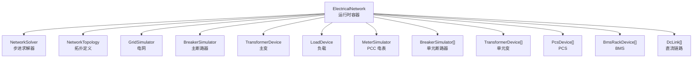
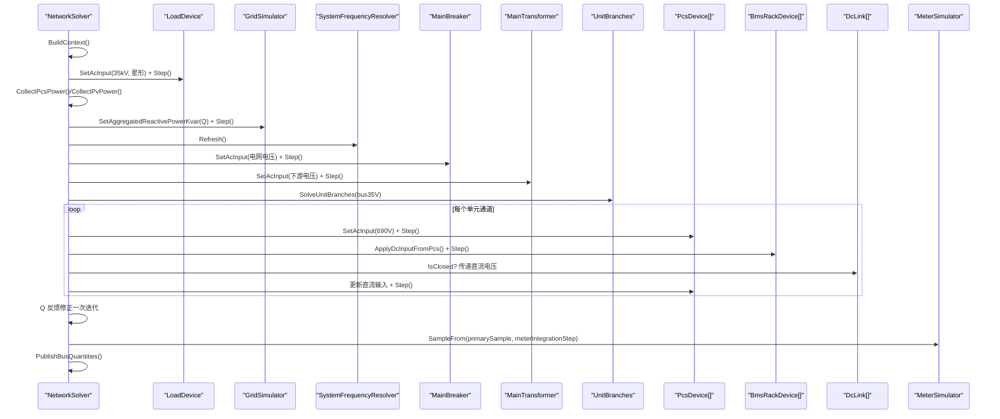
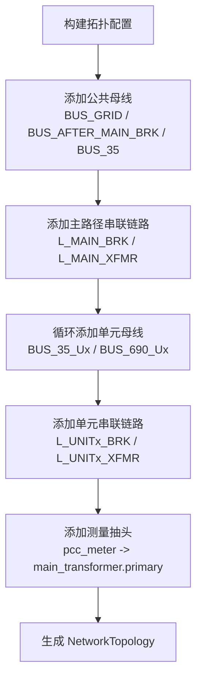
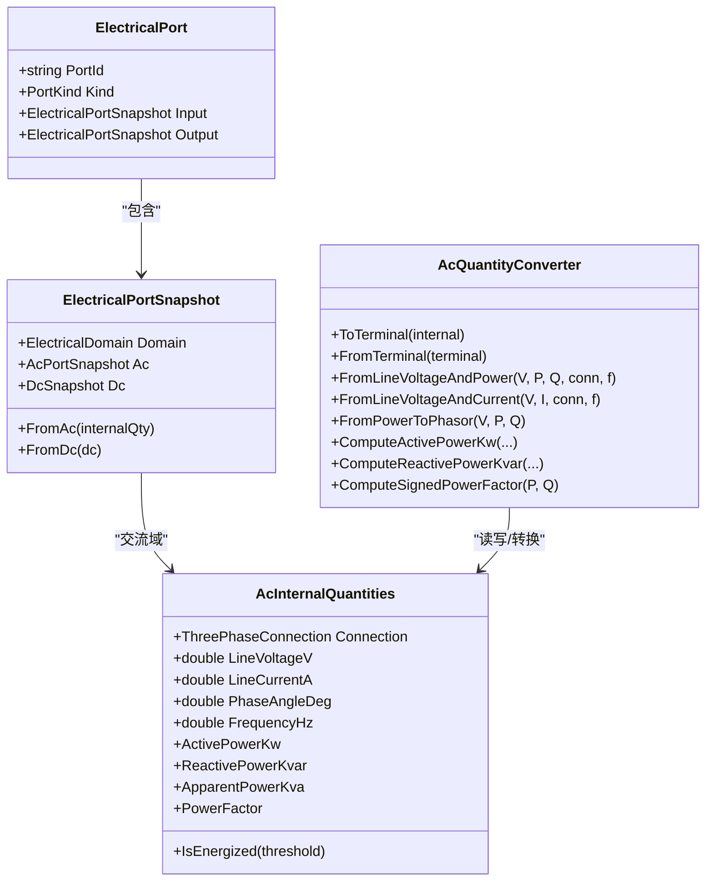
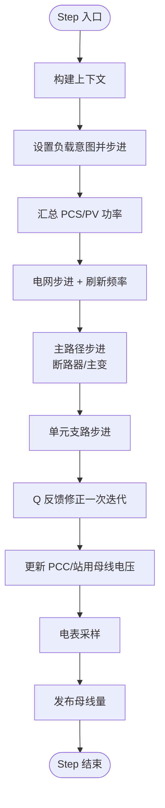
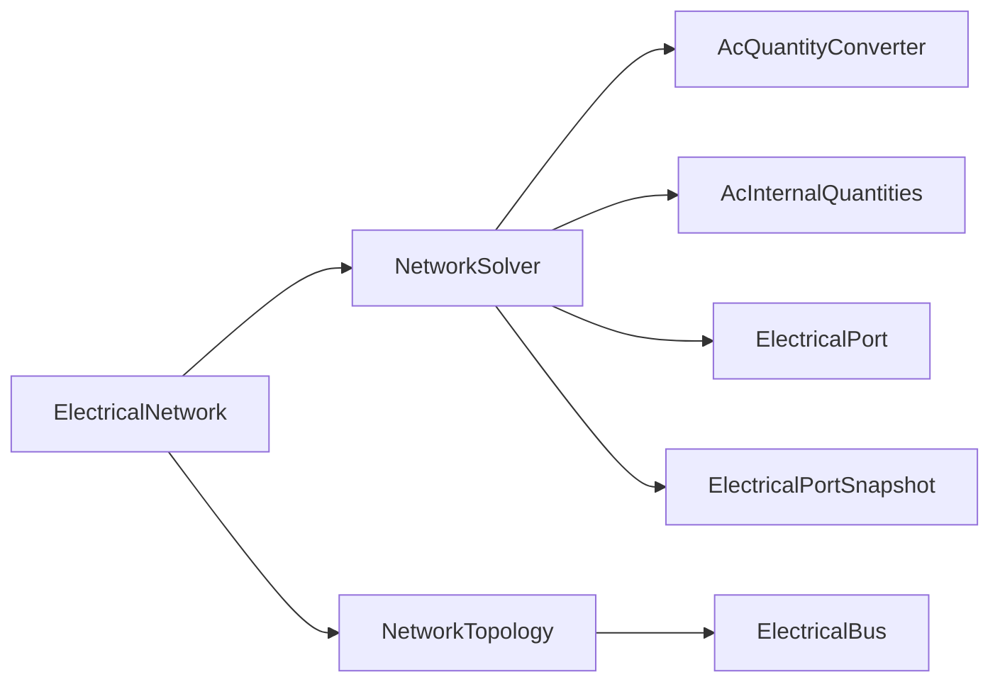

# ElectricalNetwork 电气网络

<cite>
**本文引用的文件**
- [ElectricalNetwork.cs](file://EssDeviceSimModel/Solver/ElectricalNetwork.cs)
- [NetworkTopology.cs](file://EssDeviceSimModel/Model/NetworkTopology.cs)
- [ElectricalBus.cs](file://EssDeviceSimModel/Model/ElectricalBus.cs)
- [AcInternalQuantities.cs](file://EssDeviceSimModel/Model/AcInternalQuantities.cs)
- [ElectricalPort.cs](file://EssDeviceSimModel/Model/ElectricalPort.cs)
- [ElectricalPortSnapshot.cs](file://EssDeviceSimModel/Model/ElectricalPortSnapshot.cs)
- [AcQuantityConverter.cs](file://EssDeviceSimModel/Model/AcQuantityConverter.cs)
- [INetworkSolver.cs](file://EssDeviceSimModel/Interface/INetworkSolver.cs)
- [NetworkSolver.cs](file://EssDeviceSimModel/Solver/NetworkSolver.cs)
- [NetworkTopologyBuilder.cs](file://EssDeviceSimModel/Solver/NetworkTopologyBuilder.cs)
</cite>

## 目录
1. [简介](#简介)
2. [项目结构](#项目结构)
3. [核心组件](#核心组件)
4. [架构总览](#架构总览)
5. [详细组件分析](#详细组件分析)
6. [依赖关系分析](#依赖关系分析)
7. [性能与数值特性](#性能与数值特性)
8. [故障排查指南](#故障排查指南)
9. [结论](#结论)
10. [附录：配置与最佳实践](#附录配置与最佳实践)

## 简介
本技术文档围绕 ElectricalNetwork 类及其求解体系，系统阐述储能仿真系统中交流侧拓扑建模、设备端口映射、主路径与单元支路求解流程、频率与电压反馈、以及电表采样等关键机制。文档面向希望理解“节点—母线—设备端口”如何协同完成一步仿真推进的读者，提供从概念到代码级映射的完整说明，并给出可操作的配置与调优建议。

## 项目结构
ElectricalNetwork 作为运行时容器，聚合电网、主断路器、主变压器、负载、PCC 电表、单元断路器/变压器、PCS/BMS 及直流链路等对象；其 Solver 负责按时间步推进各设备模型，并在每步中维护母线量、系统频率与 PCC 电压等全局状态。拓扑由 NetworkTopologyBuilder 根据配置构建，形成总线、串联链路、测量抽头等结构化描述。

图表来源
- [ElectricalNetwork.cs:10-34](file://EssDeviceSimModel/Solver/ElectricalNetwork.cs#L10-L34)
- [NetworkTopology.cs:3-14](file://EssDeviceSimModel/Model/NetworkTopology.cs#L3-L14)
- [NetworkTopologyBuilder.cs:90-108](file://EssDeviceSimModel/Solver/NetworkTopologyBuilder.cs#L90-L108)

章节来源
- [ElectricalNetwork.cs:10-34](file://EssDeviceSimModel/Solver/ElectricalNetwork.cs#L10-L34)
- [NetworkTopology.cs:3-14](file://EssDeviceSimModel/Model/NetworkTopology.cs#L3-L14)
- [NetworkTopologyBuilder.cs:10-108](file://EssDeviceSimModel/Solver/NetworkTopologyBuilder.cs#L10-L108)

## 核心组件
- ElectricalNetwork：持有拓扑、设备实例、求解器引用与全局运行态（PCC 线电压、站用 35kV 线电压、系统频率）。
- NetworkTopology / ElectricalBus：描述母线集合、默认连接方式与频率，承载每步计算的母线三相内部量。
- INetworkSolver / NetworkSolver：定义 Step 接口，实现单步推进逻辑，协调电网、主路径、单元支路与 PCS/BMS 耦合。
- AcInternalQuantities / AcQuantityConverter：统一交流内部量表示与功率/电流/相位换算。
- ElectricalPort / ElectricalPortSnapshot：设备端口的输入输出快照封装，支持交流与直流域。

章节来源
- [ElectricalNetwork.cs:10-34](file://EssDeviceSimModel/Solver/ElectricalNetwork.cs#L10-L34)
- [NetworkTopology.cs:3-14](file://EssDeviceSimModel/Model/NetworkTopology.cs#L3-L14)
- [ElectricalBus.cs:3-11](file://EssDeviceSimModel/Model/ElectricalBus.cs#L3-L11)
- [INetworkSolver.cs:3-6](file://EssDeviceSimModel/Interface/INetworkSolver.cs#L3-L6)
- [NetworkSolver.cs:8-25](file://EssDeviceSimModel/Solver/NetworkSolver.cs#L8-L25)
- [AcInternalQuantities.cs:3-29](file://EssDeviceSimModel/Model/AcInternalQuantities.cs#L3-L29)
- [AcQuantityConverter.cs:3-178](file://EssDeviceSimModel/Model/AcQuantityConverter.cs#L3-L178)
- [ElectricalPort.cs:3-9](file://EssDeviceSimModel/Model/ElectricalPort.cs#L3-L9)
- [ElectricalPortSnapshot.cs:3-22](file://EssDeviceSimModel/Model/ElectricalPortSnapshot.cs#L3-L22)

## 架构总览
下图展示单步求解的关键调用链：求解器构建上下文、设置负载意图、汇总 PCS/PV 功率、驱动电网与主路径、求解单元支路与 PCS/BMS 对、执行 Q 反馈修正、更新 PCC 与站用母线电压、采样电表并发布母线量。

图表来源
- [NetworkSolver.cs:27-107](file://EssDeviceSimModel/Solver/NetworkSolver.cs#L27-L107)
- [NetworkSolver.cs:117-158](file://EssDeviceSimModel/Solver/NetworkSolver.cs#L117-L158)
- [NetworkSolver.cs:160-245](file://EssDeviceSimModel/Solver/NetworkSolver.cs#L160-L245)
- [NetworkSolver.cs:313-329](file://EssDeviceSimModel/Solver/NetworkSolver.cs#L313-L329)

章节来源
- [NetworkSolver.cs:27-107](file://EssDeviceSimModel/Solver/NetworkSolver.cs#L27-L107)
- [NetworkSolver.cs:117-158](file://EssDeviceSimModel/Solver/NetworkSolver.cs#L117-L158)
- [NetworkSolver.cs:160-245](file://EssDeviceSimModel/Solver/NetworkSolver.cs#L160-L245)
- [NetworkSolver.cs:313-329](file://EssDeviceSimModel/Solver/NetworkSolver.cs#L313-L329)

## 详细组件分析

### 拓扑结构与节点管理
- 母线定义：通过 NetworkTopologyBuilder 创建 BUS_GRID、BUS_AFTER_MAIN_BRK、BUS_35 及各单元 BUS_35_Ux、BUS_690_Ux，并设置额定线电压与连接方式。
- 串联链路：以 SeriesLinkDefinition 将断路器与变压器串接在相邻母线之间，形成主路径与单元支路的拓扑骨架。
- 测量抽头：MeasurementTapDefinition 将 PCC 电表绑定至主变一次侧端口，用于采样。
- 运行时查询：ElectricalNetwork.GetBus 按 BusId 检索对应 ElectricalBus，供发布量使用。

图表来源
- [NetworkTopologyBuilder.cs:111-211](file://EssDeviceSimModel/Solver/NetworkTopologyBuilder.cs#L111-L211)

章节来源
- [NetworkTopologyBuilder.cs:111-211](file://EssDeviceSimModel/Solver/NetworkTopologyBuilder.cs#L111-L211)
- [NetworkTopology.cs:3-14](file://EssDeviceSimModel/Model/NetworkTopology.cs#L3-L14)
- [ElectricalNetwork.cs:32-34](file://EssDeviceSimModel/Solver/ElectricalNetwork.cs#L32-L34)

### 设备端口映射与数据流
- 端口快照：ElectricalPort.Input/Output 封装交流或直流快照，使用 ElectricalPortSnapshot.FromAc/FromDc 构造。
- 交流内部量：AcInternalQuantities 统一表达线电压、线电流、相位角与频率，并提供功率与功率因数计算。
- 转换工具：AcQuantityConverter 提供 P/Q→相量、相量→P/Q、星/三角端子量互转等能力，支撑设备边界条件与母线汇总。

图表来源
- [ElectricalPort.cs:3-9](file://EssDeviceSimModel/Model/ElectricalPort.cs#L3-L9)
- [ElectricalPortSnapshot.cs:3-22](file://EssDeviceSimModel/Model/ElectricalPortSnapshot.cs#L3-L22)
- [AcInternalQuantities.cs:3-29](file://EssDeviceSimModel/Model/AcInternalQuantities.cs#L3-L29)
- [AcQuantityConverter.cs:3-178](file://EssDeviceSimModel/Model/AcQuantityConverter.cs#L3-L178)

章节来源
- [ElectricalPort.cs:3-9](file://EssDeviceSimModel/Model/ElectricalPort.cs#L3-L9)
- [ElectricalPortSnapshot.cs:3-22](file://EssDeviceSimModel/Model/ElectricalPortSnapshot.cs#L3-L22)
- [AcInternalQuantities.cs:3-29](file://EssDeviceSimModel/Model/AcInternalQuantities.cs#L3-L29)
- [AcQuantityConverter.cs:3-178](file://EssDeviceSimModel/Model/AcQuantityConverter.cs#L3-L178)

### 网络求解流程与收敛性处理
- 步骤概览：
  - 构建 DeviceStepContext，确定主断路器闭合与电网可用状态。
  - 设置负载意图（35kV 母线电压取上一步或额定），步进负载。
  - 汇总 PCS 与 PV 功率意图，注入电网无功，步进电网并刷新系统频率。
  - 主路径：为断路器与主变设置输入，步进后得到 35kV 母线电压。
  - 单元支路：逐单元计算 PCS 功率意图，驱动单元断路器与单元变，再解耦 PCS/BMS 对。
  - Q 反馈修正：再次汇总功率，步进电网与频率，更新 PCC 与站用母线电压。
  - 电表采样：基于主变一次侧量采样，发布 BUS_GRID 与 BUS_35 的量。
- 收敛性与稳定性：
  - 采用“一次迭代”的 Q 反馈修正，避免复杂非线性迭代带来的不稳定。
  - 通过小阈值判断（如电压/功率接近零）避免除零与数值噪声。
  - 孤岛工况下估算站用母线电压，保证无电时不产生异常值。

图表来源
- [NetworkSolver.cs:27-107](file://EssDeviceSimModel/Solver/NetworkSolver.cs#L27-L107)
- [NetworkSolver.cs:117-158](file://EssDeviceSimModel/Solver/NetworkSolver.cs#L117-L158)
- [NetworkSolver.cs:160-245](file://EssDeviceSimModel/Solver/NetworkSolver.cs#L160-L245)
- [NetworkSolver.cs:282-311](file://EssDeviceSimModel/Solver/NetworkSolver.cs#L282-L311)

章节来源
- [NetworkSolver.cs:27-107](file://EssDeviceSimModel/Solver/NetworkSolver.cs#L27-L107)
- [NetworkSolver.cs:117-158](file://EssDeviceSimModel/Solver/NetworkSolver.cs#L117-L158)
- [NetworkSolver.cs:160-245](file://EssDeviceSimModel/Solver/NetworkSolver.cs#L160-L245)
- [NetworkSolver.cs:282-311](file://EssDeviceSimModel/Solver/NetworkSolver.cs#L282-L311)

### 设备模型集成接口与边界条件
- 功率注入：通过 AcQuantityConverter.FromLineVoltageAndPower 将 P/Q 意图转换为线电流与相位，作为设备端口输入。
- 电压约束：电网步进后读取线电压，作为后续设备输入；主断路器断开时，站用母线电压通过孤岛估算函数推导。
- 电流限制：PCS/BMS 步进过程中，设备自身实现限流与保护逻辑；求解器仅传递端口快照，不直接修改设备内部限值。
- 直流耦合：DcLink 控制 PCS 与 BMS 之间的直流连通性，影响直流电压传递与 PCS 直流输入。

章节来源
- [AcQuantityConverter.cs:61-122](file://EssDeviceSimModel/Model/AcQuantityConverter.cs#L61-L122)
- [NetworkSolver.cs:117-158](file://EssDeviceSimModel/Solver/NetworkSolver.cs#L117-L158)
- [NetworkSolver.cs:160-245](file://EssDeviceSimModel/Solver/NetworkSolver.cs#L160-L245)
- [NetworkTopologyBuilder.cs:213-232](file://EssDeviceSimModel/Solver/NetworkTopologyBuilder.cs#L213-L232)

## 依赖关系分析
- 模块内聚：ElectricalNetwork 高内聚地组织设备与拓扑；NetworkSolver 专注步进时序与数据装配；AcQuantityConverter 专注物理量转换。
- 外部依赖：依赖配置对象（PccConfig、PcsPhysicalConfig 等）与设备工厂（TransformerDeviceFactory、PcsDeviceFactory 等）进行设备实例化。
- 潜在环：求解器与设备间通过端口快照单向传递，避免循环依赖；拓扑构建与运行时容器分离，降低耦合。

图表来源
- [ElectricalNetwork.cs:10-34](file://EssDeviceSimModel/Solver/ElectricalNetwork.cs#L10-L34)
- [NetworkSolver.cs:8-25](file://EssDeviceSimModel/Solver/NetworkSolver.cs#L8-L25)
- [AcQuantityConverter.cs:3-178](file://EssDeviceSimModel/Model/AcQuantityConverter.cs#L3-L178)
- [AcInternalQuantities.cs:3-29](file://EssDeviceSimModel/Model/AcInternalQuantities.cs#L3-L29)
- [ElectricalPort.cs:3-9](file://EssDeviceSimModel/Model/ElectricalPort.cs#L3-L9)
- [ElectricalPortSnapshot.cs:3-22](file://EssDeviceSimModel/Model/ElectricalPortSnapshot.cs#L3-L22)
- [NetworkTopology.cs:3-14](file://EssDeviceSimModel/Model/NetworkTopology.cs#L3-L14)
- [ElectricalBus.cs:3-11](file://EssDeviceSimModel/Model/ElectricalBus.cs#L3-L11)

章节来源
- [ElectricalNetwork.cs:10-34](file://EssDeviceSimModel/Solver/ElectricalNetwork.cs#L10-L34)
- [NetworkSolver.cs:8-25](file://EssDeviceSimModel/Solver/NetworkSolver.cs#L8-L25)
- [AcQuantityConverter.cs:3-178](file://EssDeviceSimModel/Model/AcQuantityConverter.cs#L3-L178)
- [AcInternalQuantities.cs:3-29](file://EssDeviceSimModel/Model/AcInternalQuantities.cs#L3-L29)
- [ElectricalPort.cs:3-9](file://EssDeviceSimModel/Model/ElectricalPort.cs#L3-L9)
- [ElectricalPortSnapshot.cs:3-22](file://EssDeviceSimModel/Model/ElectricalPortSnapshot.cs#L3-L22)
- [NetworkTopology.cs:3-14](file://EssDeviceSimModel/Model/NetworkTopology.cs#L3-L14)
- [ElectricalBus.cs:3-11](file://EssDeviceSimModel/Model/ElectricalBus.cs#L3-L11)

## 性能与数值特性
- 复杂度：单步求解为线性遍历设备与单元支路，整体 O(N)，N 为设备数量。
- 稀疏性：未显式构建导纳矩阵，采用端口快照与设备步进，天然避免稠密矩阵运算，内存占用低。
- 数值稳定：
  - 使用小阈值判断避免除零与无效相量。
  - 孤岛电压估算防止开路时的异常值传播。
  - Q 反馈仅一次迭代，降低非线性收敛风险。
- 优化建议：
  - 合理设置 meterIntegrationStep，平衡精度与开销。
  - 在大规模场景下，优先复用设备实例，减少分配。
  - 关注 PCS 与 BMS 步进耗时热点，必要时并行化非耦合部分。

[本节为通用指导，不直接分析具体文件]

## 故障排查指南
- 现象：PCC 电压始终为零
  - 检查主断路器是否闭合，确认主路径步进后下游电压是否正确传递。
  - 参考：主路径步进与电压更新逻辑。
- 现象：站用 35kV 母线电压异常
  - 若主断路器断开，查看孤岛估算函数是否返回有效值；否则可能为 0。
  - 参考：孤岛电压估算与主断开分支。
- 现象：PCS 功率不生效
  - 确认 PCS 功率意图已正确汇总并注入电网；检查单元通道索引与 PCS 列表长度匹配。
  - 参考：功率汇总与单元支路步进。
- 现象：电表读数异常
  - 检查主变一次侧采样量是否正确构造，以及 meterIntegrationStep 是否过小导致积分噪声。
  - 参考：电表采样与发布母线量。

章节来源
- [NetworkSolver.cs:117-158](file://EssDeviceSimModel/Solver/NetworkSolver.cs#L117-L158)
- [NetworkSolver.cs:282-311](file://EssDeviceSimModel/Solver/NetworkSolver.cs#L282-L311)
- [NetworkSolver.cs:247-280](file://EssDeviceSimModel/Solver/NetworkSolver.cs#L247-L280)
- [NetworkSolver.cs:77-107](file://EssDeviceSimModel/Solver/NetworkSolver.cs#L77-L107)

## 结论
ElectricalNetwork 以“容器+求解器”的方式组织电气网络，通过明确的端口快照与统一的交流内部量，实现了主路径与单元支路的清晰解耦。求解流程采用“意图—步进—反馈”的范式，在保证数值稳定的同时，满足工程仿真的实时性与可扩展性需求。配合拓扑构建器与设备工厂，系统具备良好的配置灵活性与设备扩展能力。

[本节为总结，不直接分析具体文件]

## 附录：配置与最佳实践
- 拓扑配置
  - 在 NetworkTopologyBuilder.Build 中设置 PCC 额定电压、短路容量、最大电压偏移与无功电压影响系数。
  - 为每个单元配置单元变二次侧电压与连接方式，确保 BUS_690_Ux 额定值正确。
- 设备参数
  - 主变与单元变通过 TransformerDeviceFactory 创建，注意一次/二次侧额定值与连接方式。
  - PCS 与 BMS 成对配置，DcLink 默认闭合，确保直流侧连通。
- 求解器参数
  - 合理选择 step 与 meterIntegrationStep，兼顾精度与性能。
  - 在需要更高精度的场景，可增加 Q 反馈迭代次数（需评估稳定性）。
- 最佳实践
  - 保持设备端口快照一致：输入/输出均使用 FromAc/FromDc 构造，避免混用。
  - 在孤岛或失压工况，优先使用估算函数，避免除以极小值。
  - 监控系统频率刷新结果，确保频率一致性贯穿全网络。

章节来源
- [NetworkTopologyBuilder.cs:10-108](file://EssDeviceSimModel/Solver/NetworkTopologyBuilder.cs#L10-L108)
- [NetworkTopologyBuilder.cs:111-232](file://EssDeviceSimModel/Solver/NetworkTopologyBuilder.cs#L111-L232)
- [NetworkSolver.cs:27-107](file://EssDeviceSimModel/Solver/NetworkSolver.cs#L27-L107)
- [AcQuantityConverter.cs:61-122](file://EssDeviceSimModel/Model/AcQuantityConverter.cs#L61-L122)