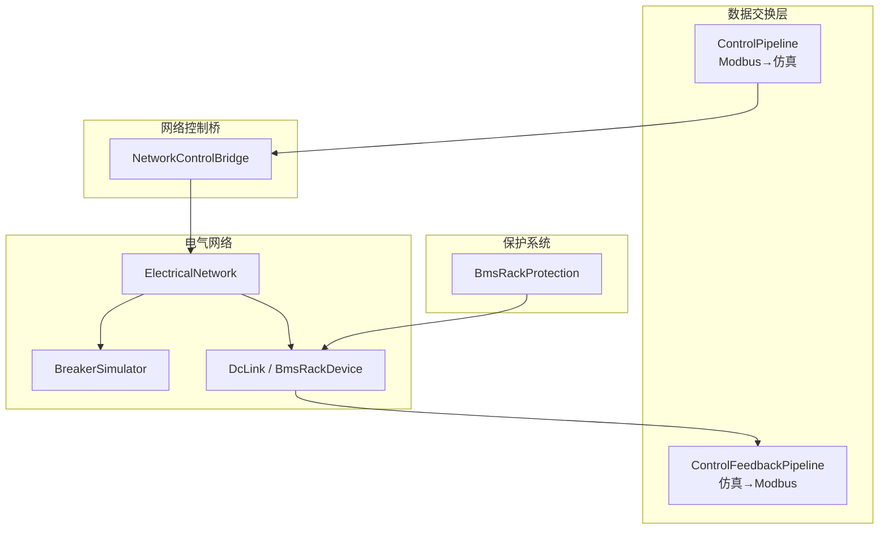
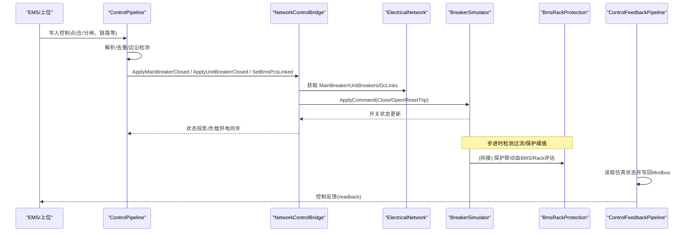
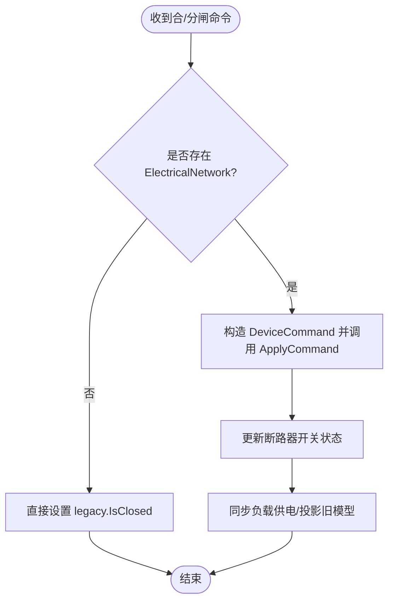
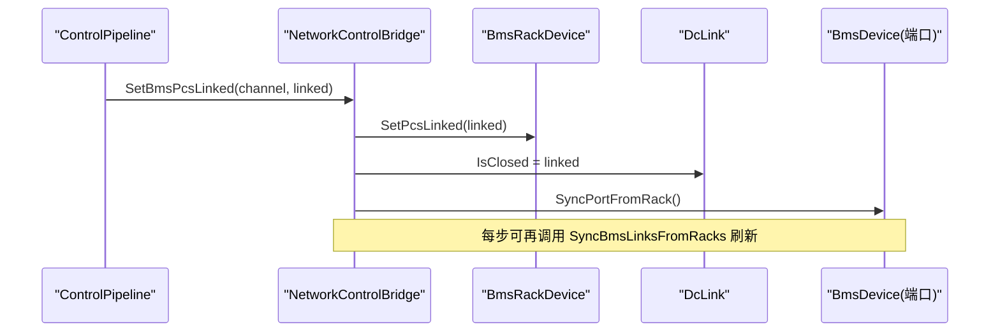
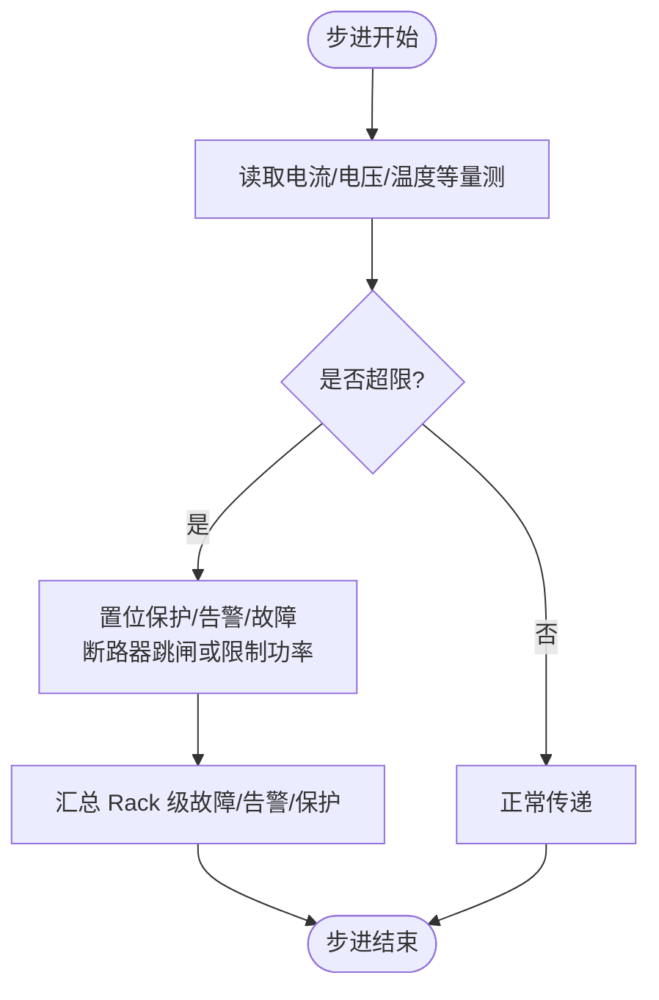
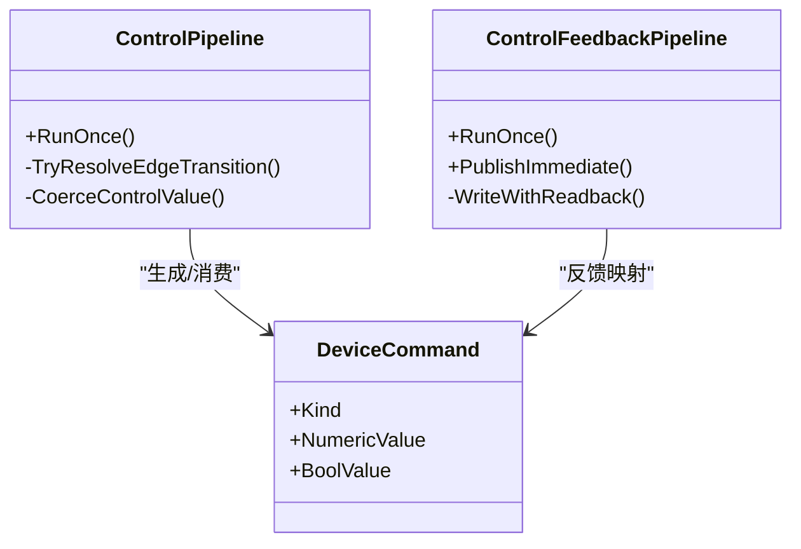
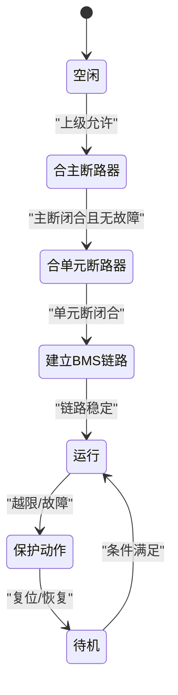
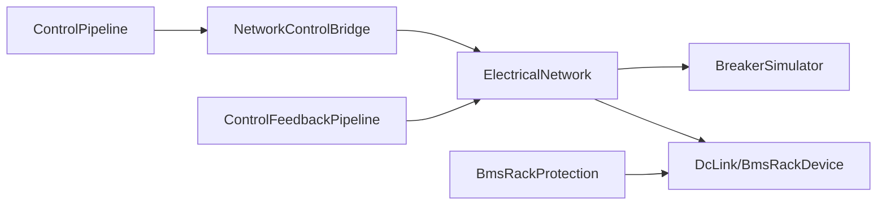

# NetworkControlBridge 网络控制桥接器

<cite>
**本文引用的文件**
- [NetworkControlBridge.cs](file://EssDeviceSimModel/Solver/NetworkControlBridge.cs)
- [BreakerSimulator.cs](file://EssDeviceSimModel/Devices/BreakerSimulator.cs)
- [ElectricalNetwork.cs](file://EssDeviceSimModel/Solver/ElectricalNetwork.cs)
- [DeviceCommand.cs](file://EssDeviceSimModel/Model/DeviceCommand.cs)
- [BmsRackProtection.cs](file://EssDeviceSimModel/Devices/BmsRackProtection.cs)
- [BreakerConfig.cs](file://EssDeviceSimModel/Model/BreakerConfig.cs)
- [ControlPipeline.cs](file://DataExchange/Pipeline/ControlPipeline.cs)
- [ControlFeedbackPipeline.cs](file://DataExchange/Pipeline/ControlFeedbackPipeline.cs)
</cite>

## 目录
1. [简介](#简介)
2. [项目结构](#项目结构)
3. [核心组件](#核心组件)
4. [架构总览](#架构总览)
5. [详细组件分析](#详细组件分析)
6. [依赖关系分析](#依赖关系分析)
7. [性能考虑](#性能考虑)
8. [故障排查指南](#故障排查指南)
9. [结论](#结论)
10. [附录](#附录)

## 简介
本技术文档围绕 NetworkControlBridge（网络控制桥）展开，系统性说明储能仿真系统中“上层控制指令—网络控制桥—底层设备—保护联动—状态反馈”的完整链路。重点覆盖：
- 断路器控制与开关状态管理
- BMS 并网链路（直流侧）控制与同步
- 过流、欠压、温度等保护动作执行与状态机
- 控制命令格式、通信协议封装、错误处理与重试机制
- 控制时序协调（操作顺序、延时保护、防误闭锁）

## 项目结构
NetworkControlBridge 位于求解器层，负责将高层控制意图转化为对电气网络中具体设备的命令，并维护与旧模型对象的投影一致性；同时与数据交换管道协作，完成 Modbus 控制点写入与反馈回读。

图表来源
- [NetworkControlBridge.cs:12-69](file://EssDeviceSimModel/Solver/NetworkControlBridge.cs#L12-L69)
- [ControlPipeline.cs:42-99](file://DataExchange/Pipeline/ControlPipeline.cs#L42-L99)
- [ControlFeedbackPipeline.cs:34-62](file://DataExchange/Pipeline/ControlFeedbackPipeline.cs#L34-L62)

章节来源
- [NetworkControlBridge.cs:1-106](file://EssDeviceSimModel/Solver/NetworkControlBridge.cs#L1-L106)
- [ControlPipeline.cs:1-176](file://DataExchange/Pipeline/ControlPipeline.cs#L1-L176)
- [ControlFeedbackPipeline.cs:1-131](file://DataExchange/Pipeline/ControlFeedbackPipeline.cs#L1-L131)

## 核心组件
- NetworkControlBridge：提供断路器合分闸、单元断路器控制、负载供电同步、BMS 并网链路设置与同步等能力，并在必要时将状态投影到旧模型对象。
- BreakerSimulator：实现断路器设备模型，支持合闸、分闸、脱扣复位，以及基于电流阈值的过流跳闸。
- ElectricalNetwork：运行时容器，持有电网、主/单元断路器、变压器、负载、PCS、BMS、直流链路等设备实例。
- DeviceCommand：统一设备命令抽象，包含断路器、PCS、直流链路等命令类型及数值/布尔参数。
- BmsRackProtection：簇级阈值评估与 Rack 级告警汇总，实现过压/欠压、充/放电过流、温度、绝缘、SOC/SOH 等保护逻辑。
- ControlPipeline / ControlFeedbackPipeline：Modbus 控制点解析、去重写入仿真、边沿触发、写后读回校验与日志记录。

章节来源
- [NetworkControlBridge.cs:1-106](file://EssDeviceSimModel/Solver/NetworkControlBridge.cs#L1-L106)
- [BreakerSimulator.cs:1-116](file://EssDeviceSimModel/Devices/BreakerSimulator.cs#L1-L116)
- [ElectricalNetwork.cs:1-36](file://EssDeviceSimModel/Solver/ElectricalNetwork.cs#L1-L36)
- [DeviceCommand.cs:1-24](file://EssDeviceSimModel/Model/DeviceCommand.cs#L1-L24)
- [BmsRackProtection.cs:1-321](file://EssDeviceSimModel/Devices/BmsRackProtection.cs#L1-L321)
- [ControlPipeline.cs:1-176](file://DataExchange/Pipeline/ControlPipeline.cs#L1-L176)
- [ControlFeedbackPipeline.cs:1-131](file://DataExchange/Pipeline/ControlFeedbackPipeline.cs#L1-L131)

## 架构总览
控制命令从 Modbus 进入，经 ControlPipeline 解析并写入仿真目标；NetworkControlBridge 将命令转换为对 ElectricalNetwork 内设备的实际调用；设备步进过程中触发保护逻辑（如断路器过流），并将结果通过 ControlFeedbackPipeline 回写到 Modbus。

图表来源
- [ControlPipeline.cs:42-99](file://DataExchange/Pipeline/ControlPipeline.cs#L42-L99)
- [NetworkControlBridge.cs:12-88](file://EssDeviceSimModel/Solver/NetworkControlBridge.cs#L12-L88)
- [BreakerSimulator.cs:28-98](file://EssDeviceSimModel/Devices/BreakerSimulator.cs#L28-L98)
- [ControlFeedbackPipeline.cs:34-122](file://DataExchange/Pipeline/ControlFeedbackPipeline.cs#L34-L122)

## 详细组件分析

### 断路器控制与状态管理
- 合分闸命令路径：上层控制点 → ControlPipeline 解析 → NetworkControlBridge.ApplyMainBreakerClosed/ApplyUnitBreakerClosed → ElectricalNetwork 中的 BreakerSimulator.ApplyCommand → 开关状态更新 → 负载供电同步或旧模型投影。
- 状态判断：IsBreakerClosed 要求闭合且未脱扣；断路器在 Step 中根据电流阈值自动跳闸并置故障码。
- 配置项：额定电压/电流、故障阈值、初始闭合状态、三相连接方式。

图表来源
- [NetworkControlBridge.cs:12-53](file://EssDeviceSimModel/Solver/NetworkControlBridge.cs#L12-L53)
- [BreakerSimulator.cs:28-64](file://EssDeviceSimModel/Devices/BreakerSimulator.cs#L28-L64)
- [BreakerConfig.cs:1-21](file://EssDeviceSimModel/Model/BreakerConfig.cs#L1-L21)

章节来源
- [NetworkControlBridge.cs:9-53](file://EssDeviceSimModel/Solver/NetworkControlBridge.cs#L9-L53)
- [BreakerSimulator.cs:28-98](file://EssDeviceSimModel/Devices/BreakerSimulator.cs#L28-L98)
- [BreakerConfig.cs:1-21](file://EssDeviceSimModel/Model/BreakerConfig.cs#L1-L21)

### BMS 并网链路控制与同步
- 写入链路：SetBmsPcsLinked 将 BmsRackDevice 的 PCS 链接状态同步至 DcLink 与对应 BmsDevice 端口。
- 步进同步：SyncBmsLinksFromRacks 在每个求解步从 BmsRackDevice 刷新 DcLink 闭合状态，确保下一周期拓扑一致。
- 负载计划同步：SyncLoadPlan 依据主断路器状态刷新负载供电并刷新调度。

图表来源
- [NetworkControlBridge.cs:71-103](file://EssDeviceSimModel/Solver/NetworkControlBridge.cs#L71-L103)

章节来源
- [NetworkControlBridge.cs:71-103](file://EssDeviceSimModel/Solver/NetworkControlBridge.cs#L71-L103)

### 保护系统与联动逻辑
- 断路器过流保护：BreakerSimulator.Step 读取二次侧电流，超过 FaultThresholdA 即跳闸并置故障码。
- BMS 保护：BmsRackProtection.EvaluateCluster 对过压/欠压、充/放电过流、电芯温度、绝缘、SOC/SOH、极差等进行三级阈值状态机评估；ApplyRackFaultSummary 汇总为 Rack 级故障/告警/保护标志。
- 联动要点：当保护触发时，可通过上层控制流程进行复位或联锁（例如待机清除方向性故障）。

图表来源
- [BreakerSimulator.cs:46-98](file://EssDeviceSimModel/Devices/BreakerSimulator.cs#L46-L98)
- [BmsRackProtection.cs:71-175](file://EssDeviceSimModel/Devices/BmsRackProtection.cs#L71-L175)
- [BmsRackProtection.cs:180-226](file://EssDeviceSimModel/Devices/BmsRackProtection.cs#L180-L226)

章节来源
- [BreakerSimulator.cs:46-98](file://EssDeviceSimModel/Devices/BreakerSimulator.cs#L46-L98)
- [BmsRackProtection.cs:71-226](file://EssDeviceSimModel/Devices/BmsRackProtection.cs#L71-L226)

### 控制命令格式与协议封装
- 命令抽象：DeviceCommandKind 定义断路器、PCS、直流链路等命令类型；DeviceCommand 携带数值/布尔参数。
- 协议封装：ControlPipeline 使用 ModbusParser 解析寄存器值，按 PointBinding 语义（边沿/电平）转换后写入仿真目标；ControlFeedbackPipeline 将仿真状态按寄存器映射写回 Modbus，并进行写后读回校验。
- 边沿触发：对黑启动等边沿型控制点仅在上升/下降沿写入仿真，避免重复触发。

图表来源
- [DeviceCommand.cs:1-24](file://EssDeviceSimModel/Model/DeviceCommand.cs#L1-L24)
- [ControlPipeline.cs:42-167](file://DataExchange/Pipeline/ControlPipeline.cs#L42-L167)
- [ControlFeedbackPipeline.cs:34-122](file://DataExchange/Pipeline/ControlFeedbackPipeline.cs#L34-L122)

章节来源
- [DeviceCommand.cs:1-24](file://EssDeviceSimModel/Model/DeviceCommand.cs#L1-L24)
- [ControlPipeline.cs:42-167](file://DataExchange/Pipeline/ControlPipeline.cs#L42-L167)
- [ControlFeedbackPipeline.cs:34-122](file://DataExchange/Pipeline/ControlFeedbackPipeline.cs#L34-L122)

### 控制时序与防误闭锁
- 操作顺序：先合主断路器，再合单元断路器；BMS 链路需在 PCS 就绪后建立。
- 延时保护：断路器过流保护在 Step 中即时判定；BMS 保护采用三级阈值与恢复门限，避免抖动。
- 防误操作：边沿型控制点仅响应变化；写后读回失败不推进影子状态，防止假成功；保护触发后需满足恢复条件或待机方可清除方向性故障。

图表来源
- [BreakerSimulator.cs:28-64](file://EssDeviceSimModel/Devices/BreakerSimulator.cs#L28-L64)
- [BmsRackProtection.cs:273-318](file://EssDeviceSimModel/Devices/BmsRackProtection.cs#L273-L318)
- [ControlPipeline.cs:102-124](file://DataExchange/Pipeline/ControlPipeline.cs#L102-L124)
- [ControlFeedbackPipeline.cs:76-122](file://DataExchange/Pipeline/ControlFeedbackPipeline.cs#L76-L122)

## 依赖关系分析
- NetworkControlBridge 依赖 ElectricalNetwork 提供的设备集合，并通过 DeviceCommand 驱动 BreakerSimulator 与 DcLink。
- ControlPipeline 依赖 Modbus 适配器与解析器，将外部控制点映射到仿真目标，并可触发副作用（如 DroopSliceStore）。
- ControlFeedbackPipeline 依赖 Modbus 适配器进行写后读回校验，保证反馈一致性。
- BmsRackProtection 依赖 BMS 数据与 Rack 状态，输出 Rack 级故障/告警/保护标志，影响上层联锁。

图表来源
- [ControlPipeline.cs:42-99](file://DataExchange/Pipeline/ControlPipeline.cs#L42-L99)
- [NetworkControlBridge.cs:12-103](file://EssDeviceSimModel/Solver/NetworkControlBridge.cs#L12-L103)
- [ControlFeedbackPipeline.cs:34-122](file://DataExchange/Pipeline/ControlFeedbackPipeline.cs#L34-L122)

章节来源
- [ControlPipeline.cs:42-99](file://DataExchange/Pipeline/ControlPipeline.cs#L42-L99)
- [NetworkControlBridge.cs:12-103](file://EssDeviceSimModel/Solver/NetworkControlBridge.cs#L12-L103)
- [ControlFeedbackPipeline.cs:34-122](file://DataExchange/Pipeline/ControlFeedbackPipeline.cs#L34-L122)

## 性能考虑
- 控制写入去重：ShadowStore 避免重复写入，降低总线压力与仿真扰动。
- 批量反馈：ControlFeedbackPipeline 聚合写缓冲后再写 Modbus，减少 I/O 次数。
- 保护计算：BmsRackProtection 使用向量化列表操作与一次性快照（SnapUnder/SnapOver），减少状态漂移与抖动。
- 断路器 Step 开销：仅在闭合且未脱扣时传递信号，断开时快速清零，降低无效计算。

[本节为通用性能建议，不直接分析具体文件]

## 故障排查指南
- 控制写入失败：检查 ControlPipeline 日志中“Control write failed”，确认目标路径与数据类型匹配。
- 反馈不一致：查看 ControlFeedbackPipeline 日志中“Feedback readback failed”与“shadow not updated”，确认 Modbus 读写与映射正确。
- 断路器频繁跳闸：核对 BreakerBranchConfig.FaultThresholdA 与实际电流，确认负载与短路工况。
- BMS 保护持续触发：检查 BmsRackProtection 阈值与当前量测，确认恢复门限与 SOC/SOH 边界。
- 边沿控制未生效：确认是否为边沿型控制点，且确实发生 0→1 或 1→0 变化。

章节来源
- [ControlPipeline.cs:72-99](file://DataExchange/Pipeline/ControlPipeline.cs#L72-L99)
- [ControlFeedbackPipeline.cs:76-122](file://DataExchange/Pipeline/ControlFeedbackPipeline.cs#L76-L122)
- [BreakerSimulator.cs:46-64](file://EssDeviceSimModel/Devices/BreakerSimulator.cs#L46-L64)
- [BmsRackProtection.cs:273-318](file://EssDeviceSimModel/Devices/BmsRackProtection.cs#L273-L318)

## 结论
NetworkControlBridge 作为上层控制与底层设备之间的关键桥梁，实现了断路器与 BMS 链路的可靠控制、状态投影与同步，并与保护系统紧密联动。配合 ControlPipeline/ControlFeedbackPipeline 的协议封装与反馈校验，形成了闭环的控制-反馈链路，满足复杂工况下的安全与稳定性要求。

[本节为总结性内容，不直接分析具体文件]

## 附录
- 控制命令类型参考：DeviceCommandKind 涵盖断路器、PCS、直流链路等。
- 断路器配置参考：BreakerBranchConfig 与 BreakerConfig 提供额定值与阈值配置。
- 保护阈值参考：BmsRackProtection 提供多级阈值与恢复门限的状态机实现。

章节来源
- [DeviceCommand.cs:1-24](file://EssDeviceSimModel/Model/DeviceCommand.cs#L1-L24)
- [BreakerConfig.cs:1-21](file://EssDeviceSimModel/Model/BreakerConfig.cs#L1-L21)
- [BmsRackProtection.cs:71-318](file://EssDeviceSimModel/Devices/BmsRackProtection.cs#L71-L318)