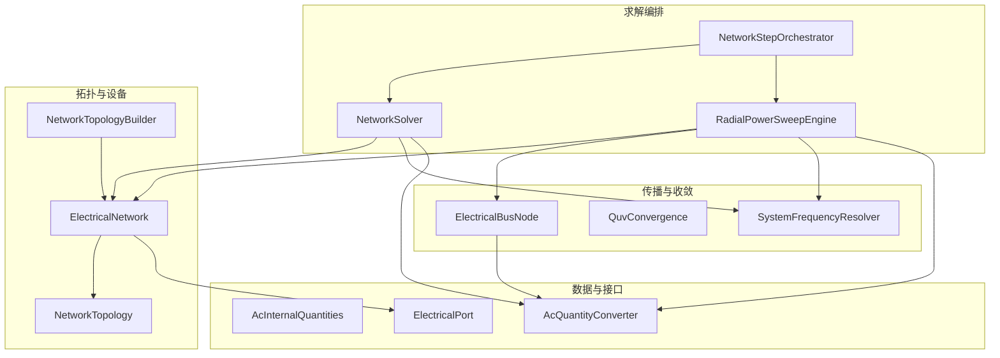
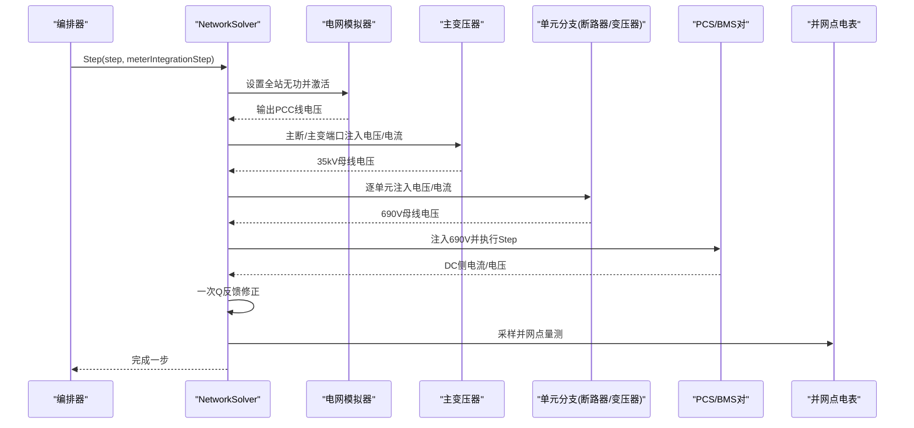
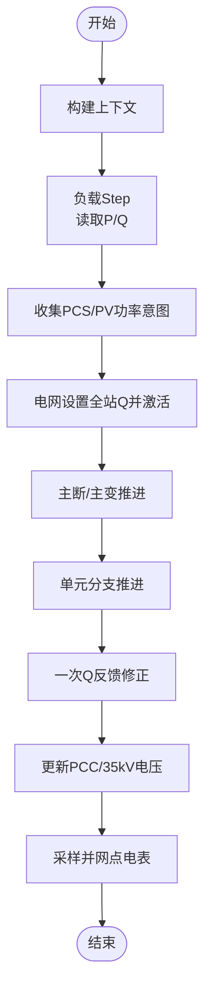
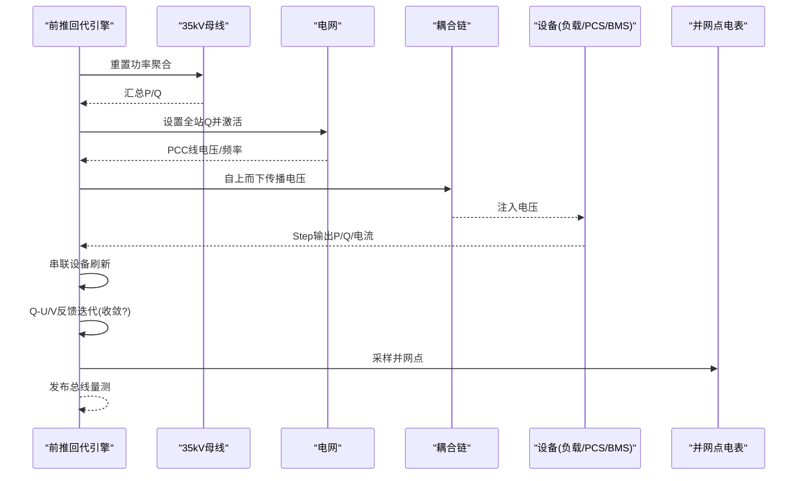
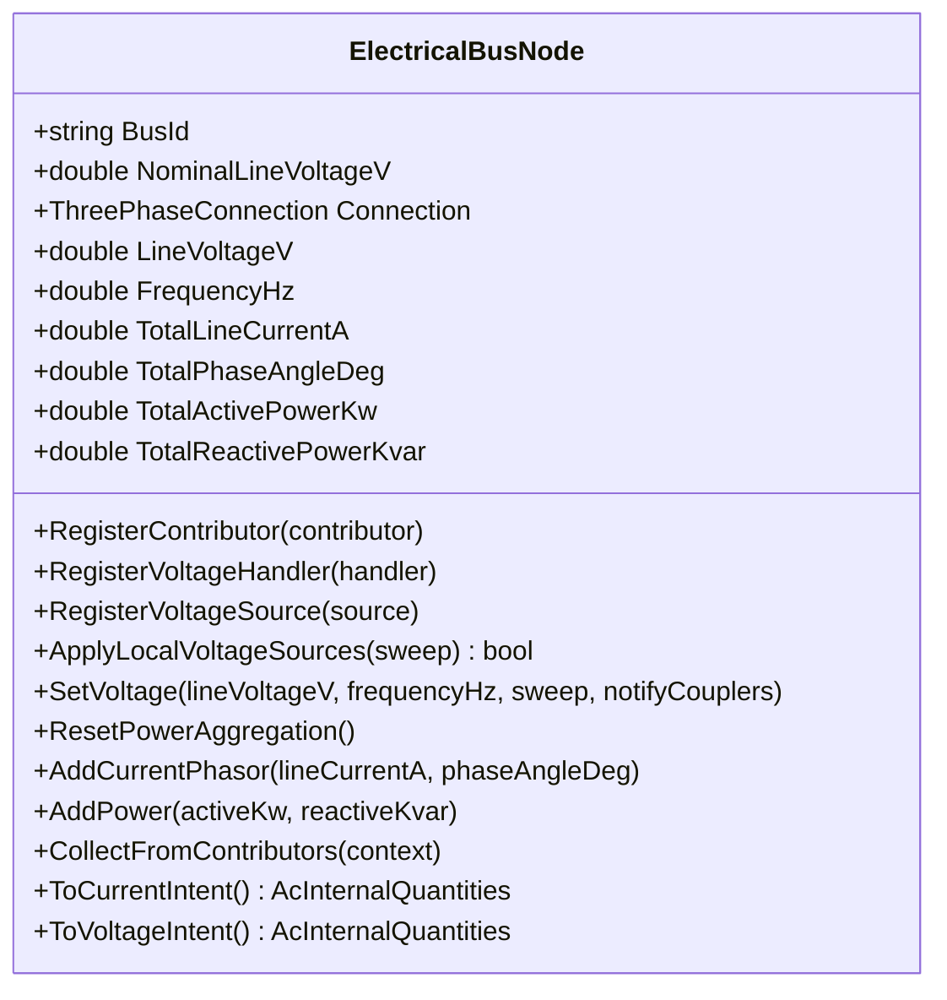
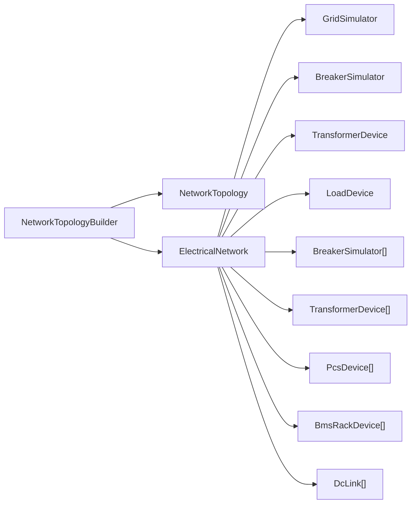
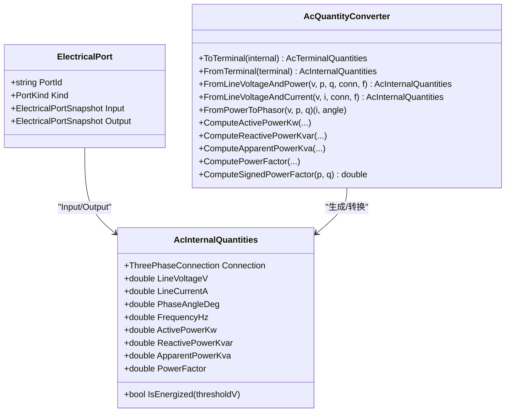
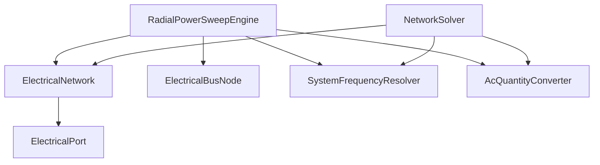

# NetworkSolver 网络求解器

<cite>
**本文引用的文件**
- [NetworkSolver.cs](file://EssDeviceSimModel/Solver/NetworkSolver.cs)
- [ElectricalNetwork.cs](file://EssDeviceSimModel/Solver/ElectricalNetwork.cs)
- [INetworkSolver.cs](file://EssDeviceSimModel/Interface/INetworkSolver.cs)
- [NetworkTopologyBuilder.cs](file://EssDeviceSimModel/Solver/NetworkTopologyBuilder.cs)
- [NetworkStepOrchestrator.cs](file://EssDeviceSimModel/Solver/NetworkStepOrchestrator.cs)
- [SystemFrequencyResolver.cs](file://EssDeviceSimModel/Solver/SystemFrequencyResolver.cs)
- [RadialPowerSweepEngine.cs](file://EssDeviceSimModel/Propagation/RadialPowerSweepEngine.cs)
- [ElectricalBusNode.cs](file://EssDeviceSimModel/Propagation/ElectricalBusNode.cs)
- [QuvConvergence.cs](file://EssDeviceSimModel/Propagation/QuvConvergence.cs)
- [AcInternalQuantities.cs](file://EssDeviceSimModel/Model/AcInternalQuantities.cs)
- [AcQuantityConverter.cs](file://EssDeviceSimModel/Model/AcQuantityConverter.cs)
- [ElectricalPort.cs](file://EssDeviceSimModel/Model/ElectricalPort.cs)
- [NetworkTopology.cs](file://EssDeviceSimModel/Model/NetworkTopology.cs)
</cite>

## 目录
1. [简介](#简介)
2. [项目结构](#项目结构)
3. [核心组件](#核心组件)
4. [架构总览](#架构总览)
5. [详细组件分析](#详细组件分析)
6. [依赖关系分析](#依赖关系分析)
7. [性能与收敛性](#性能与收敛性)
8. [故障排查指南](#故障排查指南)
9. [结论](#结论)
10. [附录：数学模型与公式](#附录数学模型与公式)

## 简介
本技术文档围绕电气网络求解器及其相关组件，系统阐述储能仿真系统中的潮流计算、故障/孤岛运行处理、电压源传播等核心能力。重点说明 ElectricalNetwork 的拓扑容器职责、设备端口连接方式；解析两种求解路径：顺序步进式求解（NetworkSolver）与径向前推回代求解（RadialPowerSweepEngine），并解释其迭代策略、收敛判断、误差控制与性能优化。同时给出与设备模型的接口约定（功率注入、电压约束、电流限制等边界条件），并提供算法流程图与基准测试建议。

## 项目结构
- 求解入口与编排
  - INetworkSolver：定义 Step 接口，统一调度步长与电表积分步长。
  - NetworkSolver：顺序步进式求解器，按“负载意图→电网Q-U→主变路径→单元支路→一次Q反馈”的流程驱动设备。
  - RadialPowerSweepEngine：径向网络前推回代引擎，实现“叶子P/Q汇总→电网Q-U定压→电压自上而下传播→设备Step→串联设备刷新→Q-U/V反馈迭代”。
  - NetworkStepOrchestrator：同步控制意图、调用求解器并将结果回写至能量存储系统。
- 拓扑与数据载体
  - ElectricalNetwork：运行时容器，持有电网、主断、主变、负载、单元分支、PCS/BMS、直流链路及总线查询。
  - NetworkTopology / ElectricalBus：拓扑描述与母线节点抽象。
  - AcInternalQuantities / AcQuantityConverter：三相交流内部量与转换工具。
- 传播与收敛
  - ElectricalBusNode：母线节点，维护电压、频率、电流相量累加、功率贡献者注册与电压源注入。
  - QuvConvergence：基于标幺值的线电压收敛判定。
  - SystemFrequencyResolver：系统唯一频率解析（并网/构网）。

图表来源
- [NetworkSolver.cs:27-107](file://EssDeviceSimModel/Solver/NetworkSolver.cs#L27-L107)
- [RadialPowerSweepEngine.cs:54-75](file://EssDeviceSimModel/Propagation/RadialPowerSweepEngine.cs#L54-L75)
- [NetworkStepOrchestrator.cs:8-26](file://EssDeviceSimModel/Solver/NetworkStepOrchestrator.cs#L8-L26)
- [ElectricalNetwork.cs:10-34](file://EssDeviceSimModel/Solver/ElectricalNetwork.cs#L10-L34)
- [NetworkTopologyBuilder.cs:10-108](file://EssDeviceSimModel/Solver/NetworkTopologyBuilder.cs#L10-L108)
- [ElectricalBusNode.cs:8-170](file://EssDeviceSimModel/Propagation/ElectricalBusNode.cs#L8-L170)
- [AcQuantityConverter.cs:61-175](file://EssDeviceSimModel/Model/AcQuantityConverter.cs#L61-L175)
- [SystemFrequencyResolver.cs:12-43](file://EssDeviceSimModel/Solver/SystemFrequencyResolver.cs#L12-L43)

章节来源
- [INetworkSolver.cs:3-6](file://EssDeviceSimModel/Interface/INetworkSolver.cs#L3-L6)
- [ElectricalNetwork.cs:10-34](file://EssDeviceSimModel/Solver/ElectricalNetwork.cs#L10-L34)
- [NetworkTopologyBuilder.cs:10-108](file://EssDeviceSimModel/Solver/NetworkTopologyBuilder.cs#L10-L108)

## 核心组件
- INetworkSolver：统一 Step(step, meterIntegrationStep) 接口，屏蔽不同求解器的内部差异。
- ElectricalNetwork：运行时容器，聚合电网、主断、主变、负载、单元分支、PCS/BMS、直流链路，提供总线查询与全局状态（PCC线电压、35kV站用电母线电压、系统频率）。
- NetworkSolver：顺序步进式求解器，按固定阶段驱动设备，支持一次Q反馈修正。
- RadialPowerSweepEngine：径向前推回代求解器，具备多轮Q-U/V反馈迭代与串联设备刷新。
- ElectricalBusNode：母线节点，负责电压设置、电流相量累加、功率贡献者收集、本地电压源注入。
- SystemFrequencyResolver：根据主断状态与PCS构网情况确定系统频率。
- QuvConvergence：基于标幺值误差的收敛判定。
- AcQuantityConverter：三相交流量转换（P/Q↔I∠φ、星/角接法换算、功率因数计算）。

章节来源
- [NetworkSolver.cs:8-115](file://EssDeviceSimModel/Solver/NetworkSolver.cs#L8-L115)
- [RadialPowerSweepEngine.cs:14-75](file://EssDeviceSimModel/Propagation/RadialPowerSweepEngine.cs#L14-L75)
- [ElectricalBusNode.cs:8-170](file://EssDeviceSimModel/Propagation/ElectricalBusNode.cs#L8-L170)
- [SystemFrequencyResolver.cs:12-43](file://EssDeviceSimModel/Solver/SystemFrequencyResolver.cs#L12-L43)
- [QuvConvergence.cs:6-20](file://EssDeviceSimModel/Propagation/QuvConvergence.cs#L6-L20)
- [AcQuantityConverter.cs:61-175](file://EssDeviceSimModel/Model/AcQuantityConverter.cs#L61-L175)

## 架构总览
求解器通过 ElectricalNetwork 组织设备拓扑，以两种方式驱动仿真：
- 顺序步进式（NetworkSolver）：适合简单串级或已有强耦合顺序的场景，单步内完成负载、电网、主变、单元分支与PCS/BMS的推进，并进行一次Q反馈修正。
- 径向前推回代（RadialPowerSweepEngine）：适合辐射状配网，先汇聚叶子P/Q，再由电网Q-U定压，自上而下传播电压，设备Step后刷新串联设备，最后进行多轮Q-U/V反馈迭代直至收敛。

图表来源
- [NetworkSolver.cs:27-107](file://EssDeviceSimModel/Solver/NetworkSolver.cs#L27-L107)
- [NetworkStepOrchestrator.cs:14-26](file://EssDeviceSimModel/Solver/NetworkStepOrchestrator.cs#L14-L26)

## 详细组件分析

### 顺序步进式求解器（NetworkSolver）
- 流程要点
  - 构建上下文（仿真时间、主断状态、市电可用性）。
  - 负载意图：以35kV母线电压（上一步或额定）驱动负载Step，读取有功/无功。
  - 收集PCS/PV功率意图，叠加到全站无功。
  - 电网Q-U：设置全站无功，激活电网，得到PCC线电压。
  - 主变路径：将主断与主变串联推进，得到35kV站用母线电压。
  - 单元分支：遍历每个单元的断路器与变压器，计算单元电流并驱动PCS/BMS对。
  - 一次Q反馈：重新收集PCS/PV与负载的实测Q，再次驱动电网与主变路径。
  - 更新PCC与35kV母线电压，采样并网点电表，发布总线量测。
- 关键设计
  - SetAcInput 重载用于注入电压或电流意图，统一封装为 ElectricalPortSnapshot。
  - 频率由 SystemFrequencyResolver 刷新，供设备使用。
  - 当主断断开时，采用估计的孤岛35kV电压。

图表来源
- [NetworkSolver.cs:27-107](file://EssDeviceSimModel/Solver/NetworkSolver.cs#L27-L107)
- [NetworkSolver.cs:117-158](file://EssDeviceSimModel/Solver/NetworkSolver.cs#L117-L158)
- [NetworkSolver.cs:160-245](file://EssDeviceSimModel/Solver/NetworkSolver.cs#L160-L245)
- [SystemFrequencyResolver.cs:12-43](file://EssDeviceSimModel/Solver/SystemFrequencyResolver.cs#L12-L43)

章节来源
- [NetworkSolver.cs:27-107](file://EssDeviceSimModel/Solver/NetworkSolver.cs#L27-L107)
- [NetworkSolver.cs:117-158](file://EssDeviceSimModel/Solver/NetworkSolver.cs#L117-L158)
- [NetworkSolver.cs:160-245](file://EssDeviceSimModel/Solver/NetworkSolver.cs#L160-L245)
- [NetworkSolver.cs:247-360](file://EssDeviceSimModel/Solver/NetworkSolver.cs#L247-L360)

### 径向前推回代求解器（RadialPowerSweepEngine）
- 流程要点
  - Phase1：重置各母线功率聚合。
  - Phase2：自下而上汇总690V与35kV母线的P/Q。
  - Phase3：电网读取全站Q，Q-U定压，得到PCC电压与系统频率。
  - Phase4：自上而下传播电压（经耦合链：电网→主断→主变→35kV→单元→690V）。
  - Phase5：在已知母线电压下，由P/Q算电流，驱动负载与PCS/BMS对Step。
  - 串联设备刷新：依据最新下游母线电压重算主变/单元变端口。
  - Q-U/V反馈迭代：最多N轮，直到PCC线电压变化小于容差。
  - 采样并网点电表，发布总线量测，回写能量存储系统。
- 收敛性
  - 使用 QuvConvergence 基于标幺值误差判断收敛。
  - 可配置最大迭代次数与电压容差。

图表来源
- [RadialPowerSweepEngine.cs:54-75](file://EssDeviceSimModel/Propagation/RadialPowerSweepEngine.cs#L54-L75)
- [RadialPowerSweepEngine.cs:77-177](file://EssDeviceSimModel/Propagation/RadialPowerSweepEngine.cs#L77-L177)
- [RadialPowerSweepEngine.cs:179-249](file://EssDeviceSimModel/Propagation/RadialPowerSweepEngine.cs#L179-L249)
- [RadialPowerSweepEngine.cs:290-338](file://EssDeviceSimModel/Propagation/RadialPowerSweepEngine.cs#L290-L338)
- [QuvConvergence.cs:6-20](file://EssDeviceSimModel/Propagation/QuvConvergence.cs#L6-L20)

章节来源
- [RadialPowerSweepEngine.cs:54-75](file://EssDeviceSimModel/Propagation/RadialPowerSweepEngine.cs#L54-L75)
- [RadialPowerSweepEngine.cs:77-177](file://EssDeviceSimModel/Propagation/RadialPowerSweepEngine.cs#L77-L177)
- [RadialPowerSweepEngine.cs:179-249](file://EssDeviceSimModel/Propagation/RadialPowerSweepEngine.cs#L179-L249)
- [RadialPowerSweepEngine.cs:290-338](file://EssDeviceSimModel/Propagation/RadialPowerSweepEngine.cs#L290-L338)

### 母线节点与电压源传播（ElectricalBusNode）
- 功能
  - 维护母线电压、频率、线电流相量累加。
  - 注册功率贡献者，收集P/Q并转换为电流相量累加。
  - 注册本地电压源（如黑启动PCS），取最高线电压写入母线。
  - 提供 ToCurrentIntent/ToVoltageIntent 生成设备输入快照。
- 传播机制
  - ApplyLocalVoltageSources：合并本地电压源，选择最高电压与对应频率。
  - SetVoltage：设置母线电压并通知已注册的耦合器处理器。

图表来源
- [ElectricalBusNode.cs:8-170](file://EssDeviceSimModel/Propagation/ElectricalBusNode.cs#L8-L170)

章节来源
- [ElectricalBusNode.cs:8-170](file://EssDeviceSimModel/Propagation/ElectricalBusNode.cs#L8-L170)

### 拓扑构建与设备连接（NetworkTopologyBuilder & ElectricalNetwork）
- 拓扑构建
  - 创建BUS_GRID、BUS_AFTER_MAIN_BRK、BUS_35及各单元BUS_35_Ux、BUS_690_Ux。
  - 定义串联链路（主断、主变、单元断、单元变）。
  - 定义测量抽头（并网点电表取自主变一次侧）。
- 设备实例化
  - 电网、主断、主变、负载、并网点电表。
  - 单元分支：断路器、变压器、PCS、BMS。
  - 直流链路：PCS与BMS之间的直流开关。
- 运行时容器
  - ElectricalNetwork 持有所有设备与拓扑，暴露PCC/35kV电压与系统频率，提供 GetBus 查询。

图表来源
- [NetworkTopologyBuilder.cs:10-108](file://EssDeviceSimModel/Solver/NetworkTopologyBuilder.cs#L10-L108)
- [NetworkTopologyBuilder.cs:111-210](file://EssDeviceSimModel/Solver/NetworkTopologyBuilder.cs#L111-L210)
- [NetworkTopologyBuilder.cs:213-232](file://EssDeviceSimModel/Solver/NetworkTopologyBuilder.cs#L213-L232)
- [ElectricalNetwork.cs:10-34](file://EssDeviceSimModel/Solver/ElectricalNetwork.cs#L10-L34)

章节来源
- [NetworkTopologyBuilder.cs:10-108](file://EssDeviceSimModel/Solver/NetworkTopologyBuilder.cs#L10-L108)
- [NetworkTopologyBuilder.cs:111-210](file://EssDeviceSimModel/Solver/NetworkTopologyBuilder.cs#L111-L210)
- [NetworkTopologyBuilder.cs:213-232](file://EssDeviceSimModel/Solver/NetworkTopologyBuilder.cs#L213-L232)
- [ElectricalNetwork.cs:10-34](file://EssDeviceSimModel/Solver/ElectricalNetwork.cs#L10-L34)

### 设备接口与端口模型
- 端口模型
  - ElectricalPort 包含 Input/Output 快照，域类型为三相交流。
  - 通过 ElectricalPortSnapshot.FromAc/FromDc 构造输入输出。
- 内部量
  - AcInternalQuantities 表示线电压、线电流、相位角与频率，派生有功/无功/视在/功率因数。
- 转换器
  - AcQuantityConverter 提供P/Q与电流相量互转、星/角接法换算、功率因数计算。

图表来源
- [ElectricalPort.cs:1-11](file://EssDeviceSimModel/Model/ElectricalPort.cs#L1-L11)
- [AcInternalQuantities.cs:1-31](file://EssDeviceSimModel/Model/AcInternalQuantities.cs#L1-L31)
- [AcQuantityConverter.cs:1-178](file://EssDeviceSimModel/Model/AcQuantityConverter.cs#L1-L178)

章节来源
- [ElectricalPort.cs:1-11](file://EssDeviceSimModel/Model/ElectricalPort.cs#L1-L11)
- [AcInternalQuantities.cs:1-31](file://EssDeviceSimModel/Model/AcInternalQuantities.cs#L1-L31)
- [AcQuantityConverter.cs:61-175](file://EssDeviceSimModel/Model/AcQuantityConverter.cs#L61-L175)

## 依赖关系分析
- 耦合与内聚
  - NetworkSolver 与 ElectricalNetwork 高内聚，集中管理设备推进顺序。
  - RadialPowerSweepEngine 与 ElectricalBusNode 解耦，通过贡献者与电压源接口扩展。
  - SystemFrequencyResolver 独立于具体求解器，仅依赖电网与PCS状态。
- 外部依赖
  - 电网模拟器需实现 ISelfActivatingElectricalSource（在前推回代中强制要求）。
  - 设备模型通过 ElectricalPort 与 AcInternalQuantities 进行数据交换。

图表来源
- [NetworkSolver.cs:27-107](file://EssDeviceSimModel/Solver/NetworkSolver.cs#L27-L107)
- [RadialPowerSweepEngine.cs:54-75](file://EssDeviceSimModel/Propagation/RadialPowerSweepEngine.cs#L54-L75)
- [SystemFrequencyResolver.cs:12-43](file://EssDeviceSimModel/Solver/SystemFrequencyResolver.cs#L12-L43)
- [AcQuantityConverter.cs:61-175](file://EssDeviceSimModel/Model/AcQuantityConverter.cs#L61-L175)
- [ElectricalPort.cs:1-11](file://EssDeviceSimModel/Model/ElectricalPort.cs#L1-L11)

章节来源
- [NetworkSolver.cs:27-107](file://EssDeviceSimModel/Solver/NetworkSolver.cs#L27-L107)
- [RadialPowerSweepEngine.cs:54-75](file://EssDeviceSimModel/Propagation/RadialPowerSweepEngine.cs#L54-L75)
- [SystemFrequencyResolver.cs:12-43](file://EssDeviceSimModel/Solver/SystemFrequencyResolver.cs#L12-L43)

## 性能与收敛性
- 迭代策略
  - NetworkSolver：一次Q反馈修正，适用于弱耦合或顺序明确的场景，开销低。
  - RadialPowerSweepEngine：多轮Q-U/V反馈迭代，默认最多3轮，容差可配置（标幺值），适合辐射网复杂工况。
- 收敛判断
  - 基于 QuvConvergence.IsLineVoltageConverged，比较相邻两步PCC线电压相对标幺值误差。
- 误差控制
  - 电压阈值：低于1V视为无压，避免数值噪声。
  - 频率解析：主断合则取电网额定频率；主断分且PCS构网则取最高电压PCS的频率。
- 性能优化
  - 仅在主断闭合时刷新串联设备（主变/单元变），减少无效计算。
  - 使用贡献者模式聚合P/Q，避免重复计算。
  - 合理设置 propagationQuvMaxIterations 与 propagationVoltageTolerancePu，平衡精度与耗时。
- 基准测试建议
  - 场景：并网稳态、孤岛构网、阶跃负载、故障切换。
  - 指标：每步耗时、迭代次数、PCC电压偏差、设备电流越限率。
  - 对比：NetworkSolver vs RadialPowerSweepEngine 在不同拓扑规模下的性能。

章节来源
- [RadialPowerSweepEngine.cs:179-203](file://EssDeviceSimModel/Propagation/RadialPowerSweepEngine.cs#L179-L203)
- [QuvConvergence.cs:6-20](file://EssDeviceSimModel/Propagation/QuvConvergence.cs#L6-L20)
- [SystemFrequencyResolver.cs:12-43](file://EssDeviceSimModel/Solver/SystemFrequencyResolver.cs#L12-L43)

## 故障排查指南
- 常见现象与定位
  - 35kV母线电压异常：检查主断状态与主变路径注入是否正确；确认 EstimateBus35WhenMainOpen 逻辑。
  - PCS无法出力：检查690V母线电压是否有效、gridAvailable标志、DC链路闭合状态。
  - 频率为0：确认主断断开且无PCS构网；或电网电压过低导致频率解析失败。
  - 不收敛：增大 propagationQuvMaxIterations 或放宽 tolerancePu；检查Q反馈是否重复计数。
- 调试手段
  - 打印各阶段总线电压与全站Q，验证 Phase2/Phase3/Phase4 数据流。
  - 检查 ElectricalBusNode 的贡献者注册与 AddPower/ToCurrentIntent 输出。
  - 校验 AcQuantityConverter 的P/Q与电流相量转换一致性。

章节来源
- [NetworkSolver.cs:282-311](file://EssDeviceSimModel/Solver/NetworkSolver.cs#L282-L311)
- [RadialPowerSweepEngine.cs:340-359](file://EssDeviceSimModel/Propagation/RadialPowerSweepEngine.cs#L340-L359)
- [ElectricalBusNode.cs:60-91](file://EssDeviceSimModel/Propagation/ElectricalBusNode.cs#L60-L91)
- [AcQuantityConverter.cs:98-122](file://EssDeviceSimModel/Model/AcQuantityConverter.cs#L98-L122)

## 结论
本项目提供了两套互补的网络求解方案：顺序步进式求解器适用于简单、顺序明确的场景；径向前推回代求解器适用于辐射网复杂工况，具备多轮Q-U/V反馈迭代与串联设备刷新能力。通过 ElectricalNetwork 统一管理设备与拓扑，结合 ElectricalBusNode 的电压源传播与贡献者聚合，实现了高效的潮流计算与故障/孤岛运行处理。配合 SystemFrequencyResolver 与 QuvConvergence，系统在稳定性与性能之间取得良好平衡。

## 附录：数学模型与公式
- 三相交流功率与电流关系
  - 视在功率：S = √3 × U_line × I_line
  - 有功功率：P = √3 × U_line × I_line × cos(φ)
  - 无功功率：Q = √3 × U_line × I_line × sin(φ)
  - 电流幅值：I_line = S / (√3 × U_line)
  - 相位角：φ = atan2(Q, P)
- 标幺值收敛判据
  - Δpu = |U_current − U_previous| / U_nominal ≤ tolerancePu
- 频率解析规则
  - 主断闭合且有压：系统频率 = 电网额定频率
  - 主断断开且PCS构网：系统频率 = 最高电压PCS的频率
  - 否则：系统频率 = 0

章节来源
- [AcQuantityConverter.cs:98-175](file://EssDeviceSimModel/Model/AcQuantityConverter.cs#L98-L175)
- [QuvConvergence.cs:6-20](file://EssDeviceSimModel/Propagation/QuvConvergence.cs#L6-L20)
- [SystemFrequencyResolver.cs:12-43](file://EssDeviceSimModel/Solver/SystemFrequencyResolver.cs#L12-L43)