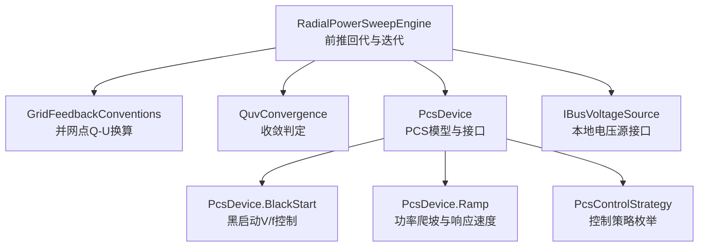
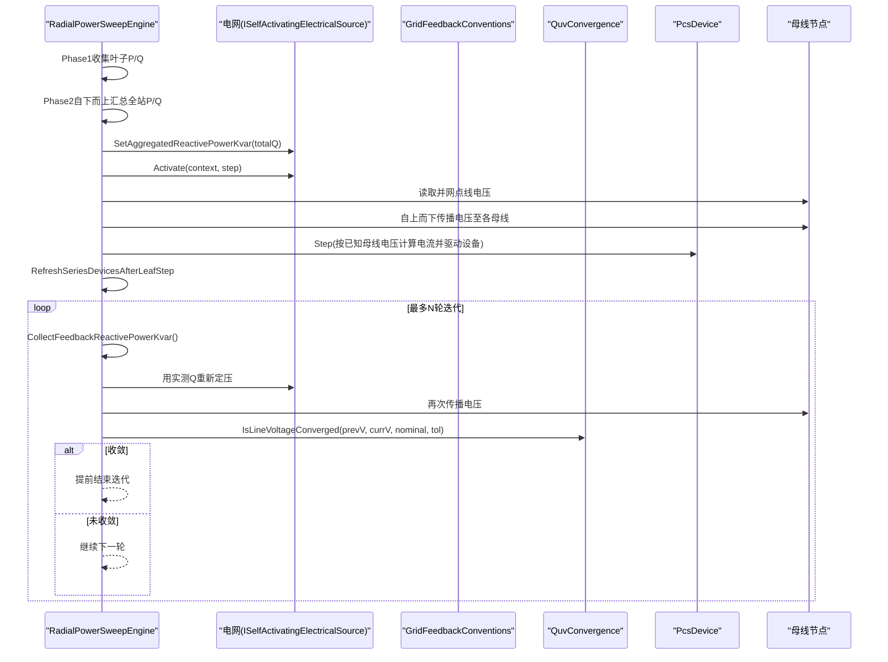
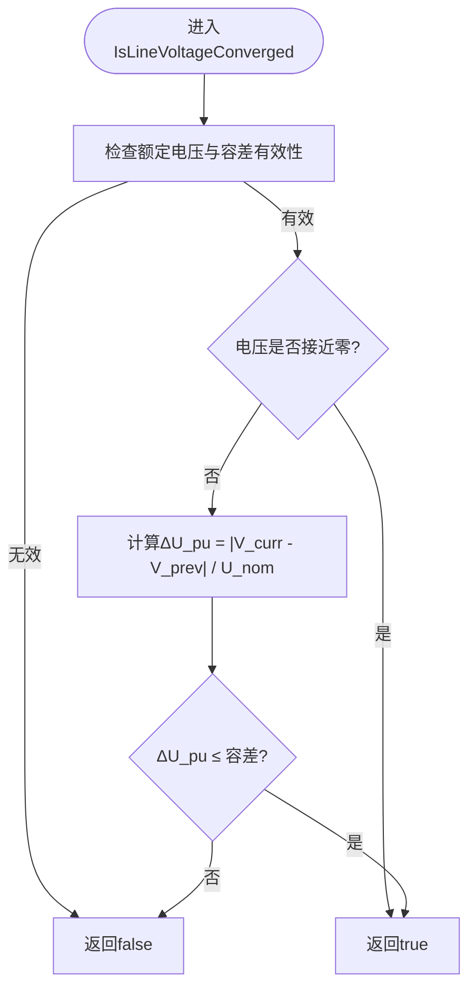
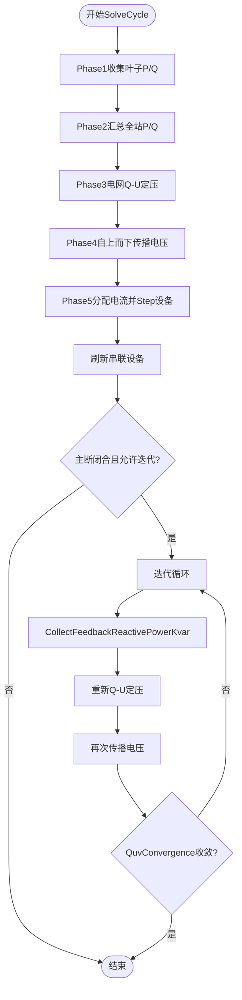
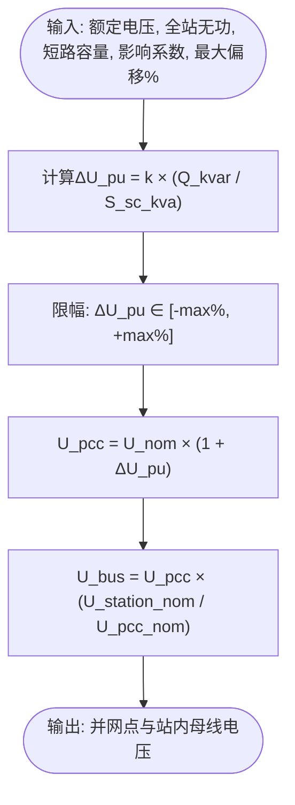
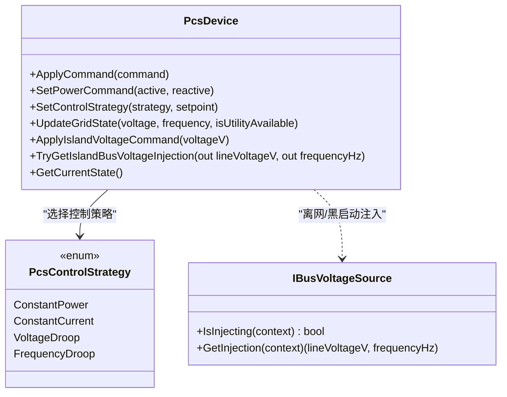
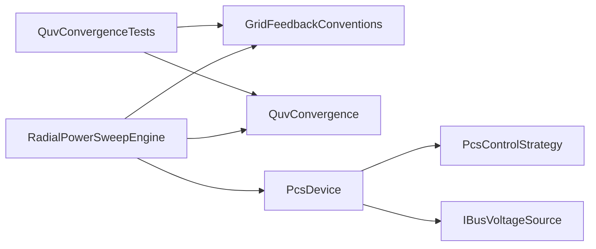

# QuvConvergence Q-V收敛控制器

<cite>
**本文引用的文件**
- [QuvConvergence.cs](file://EssDeviceSimModel/Propagation/QuvConvergence.cs)
- [RadialPowerSweepEngine.cs](file://EssDeviceSimModel/Propagation/RadialPowerSweepEngine.cs)
- [GridFeedbackConventions.cs](file://EssDeviceSimModel/GridFeedbackConventions.cs)
- [PcsDevice.Core.cs](file://EssDeviceSimModel/Devices/PcsDevice.Core.cs)
- [PcsDevice.BlackStart.cs](file://EssDeviceSimModel/Devices/PcsDevice.BlackStart.cs)
- [PcsDevice.Ramp.cs](file://EssDeviceSimModel/Devices/PcsDevice.Ramp.cs)
- [PcsControlStrategy.cs](file://EssDeviceSimModel/PcsControlStrategy.cs)
- [IBusVoltageSource.cs](file://EssDeviceSimModel/Propagation/IBusVoltageSource.cs)
- [QuvConvergenceTests.cs](file://EssSimulator.Tests/Propagation/QuvConvergenceTests.cs)
</cite>

## 目录
1. [简介](#简介)
2. [项目结构](#项目结构)
3. [核心组件](#核心组件)
4. [架构总览](#架构总览)
5. [详细组件分析](#详细组件分析)
6. [依赖关系分析](#依赖关系分析)
7. [性能与稳定性](#性能与稳定性)
8. [故障排查指南](#故障排查指南)
9. [结论](#结论)
10. [附录](#附录)

## 简介
本技术文档围绕 QuvConvergence（Q-V收敛）在储能仿真系统中的实现进行系统化说明，重点覆盖：
- 无功功率-电压（Q-V）协调控制的实现原理：下垂特性、电压调节死区、无功功率限制。
- 收敛算法设计：迭代控制策略、误差阈值判断、动态调整机制。
- 与PCS设备的接口设计：无功指令生成、电压设定值计算、响应速度控制。
- 不同运行模式下的控制策略差异：并网、离网、黑启动。
- 控制参数整定方法、稳定性分析与性能测试要点。

该模块通过“全站无功→并网点电压偏移→母线电压传播→设备电流分配→实测无功反馈”的闭环，实现多轮迭代直至电压收敛，从而保证潮流计算的物理一致性与数值稳定性。

## 项目结构
与Q-V收敛相关的代码主要分布在以下位置：
- 收敛判定：QuvConvergence.cs
- 前推回代引擎与迭代流程：RadialPowerSweepEngine.cs
- 并网点无功-电压换算约定：GridFeedbackConventions.cs
- PCS设备模型（含模式切换、爬坡、黑启动、接口）：PcsDevice.*.cs
- 控制策略枚举：PcsControlStrategy.cs
- 本地电压源接口（用于离网/黑启动注入）：IBusVoltageSource.cs
- 单元测试：QuvConvergenceTests.cs

图表来源
- [RadialPowerSweepEngine.cs:51-75](file://EssDeviceSimModel/Propagation/RadialPowerSweepEngine.cs#L51-L75)
- [GridFeedbackConventions.cs:18-49](file://EssDeviceSimModel/GridFeedbackConventions.cs#L18-L49)
- [QuvConvergence.cs:6-20](file://EssDeviceSimModel/Propagation/QuvConvergence.cs#L6-L20)
- [PcsDevice.Core.cs:136-150](file://EssDeviceSimModel/Devices/PcsDevice.Core.cs#L136-L150)
- [PcsDevice.BlackStart.cs:11-42](file://EssDeviceSimModel/Devices/PcsDevice.BlackStart.cs#L11-L42)
- [PcsDevice.Ramp.cs:21-45](file://EssDeviceSimModel/Devices/PcsDevice.Ramp.cs#L21-L45)
- [PcsControlStrategy.cs:3-9](file://EssDeviceSimModel/PcsControlStrategy.cs#L3-L9)
- [IBusVoltageSource.cs:5-17](file://EssDeviceSimModel/Propagation/IBusVoltageSource.cs#L5-L17)

章节来源
- [RadialPowerSweepEngine.cs:51-75](file://EssDeviceSimModel/Propagation/RadialPowerSweepEngine.cs#L51-L75)
- [GridFeedbackConventions.cs:18-49](file://EssDeviceSimModel/GridFeedbackConventions.cs#L18-L49)
- [QuvConvergence.cs:6-20](file://EssDeviceSimModel/Propagation/QuvConvergence.cs#L6-L20)

## 核心组件
- QuvConvergence：提供线电压相对误差收敛判定，支持标幺值容差与极小电压快速收敛分支。
- RadialPowerSweepEngine：实现径向网络前推回代求解，包含Q-U定压、电压自上而下传播、设备Step、实测Q反馈迭代等完整流程。
- GridFeedbackConventions：定义并网点无功到电压偏移的统一换算规则，支持短路容量、影响系数与最大偏移限幅。
- PcsDevice：封装PCS设备模型，包括并网/离网模式、黑启动V/f建压、功率爬坡、保护与端口输出。
- IBusVoltageSource：为离网/黑启动场景提供本地母线电压注入能力。

章节来源
- [QuvConvergence.cs:6-20](file://EssDeviceSimModel/Propagation/QuvConvergence.cs#L6-L20)
- [RadialPowerSweepEngine.cs:77-203](file://EssDeviceSimModel/Propagation/RadialPowerSweepEngine.cs#L77-L203)
- [GridFeedbackConventions.cs:18-49](file://EssDeviceSimModel/GridFeedbackConventions.cs#L18-L49)
- [PcsDevice.Core.cs:136-150](file://EssDeviceSimModel/Devices/PcsDevice.Core.cs#L136-L150)
- [IBusVoltageSource.cs:5-17](file://EssDeviceSimModel/Propagation/IBusVoltageSource.cs#L5-L17)

## 架构总览
Q-V协调控制的核心在于“全站无功→并网点电压→母线电压传播→设备电流→实测无功反馈”的闭环迭代。RadialPowerSweepEngine在每个仿真步中执行一次完整求解周期，并在主断路器闭合时进行多轮Q-U/V反馈迭代，直到电压变化小于容差或达到最大迭代次数。

图表来源
- [RadialPowerSweepEngine.cs:51-75](file://EssDeviceSimModel/Propagation/RadialPowerSweepEngine.cs#L51-L75)
- [RadialPowerSweepEngine.cs:97-133](file://EssDeviceSimModel/Propagation/RadialPowerSweepEngine.cs#L97-L133)
- [RadialPowerSweepEngine.cs:179-203](file://EssDeviceSimModel/Propagation/RadialPowerSweepEngine.cs#L179-L203)
- [GridFeedbackConventions.cs:18-49](file://EssDeviceSimModel/GridFeedbackConventions.cs#L18-L49)
- [QuvConvergence.cs:6-20](file://EssDeviceSimModel/Propagation/QuvConvergence.cs#L6-L20)

## 详细组件分析

### QuvConvergence：收敛判定
- 功能：基于上一拍与当前拍的并网点线电压差值，除以额定电压得到标幺误差，并与容差比较；当电压接近零时直接视为收敛，避免数值不稳定。
- 输入：previousLineVoltageV、currentLineVoltageV、nominalLineVoltageV、tolerancePu。
- 输出：是否收敛布尔值。
- 特点：对极小电压场景做特殊处理；容差以标幺值表示，便于跨电压等级复用。

图表来源
- [QuvConvergence.cs:6-20](file://EssDeviceSimModel/Propagation/QuvConvergence.cs#L6-L20)

章节来源
- [QuvConvergence.cs:6-20](file://EssDeviceSimModel/Propagation/QuvConvergence.cs#L6-L20)
- [QuvConvergenceTests.cs:8-22](file://EssSimulator.Tests/Propagation/QuvConvergenceTests.cs#L8-L22)

### RadialPowerSweepEngine：迭代控制与动态调整
- 求解周期：每步调用SolveCycle，完成叶子P/Q收集、全站汇总、电网Q-U定压、电压自上而下传播、设备Step、串联设备刷新、Q-U/V反馈迭代、频率刷新、电表采样、结果应用与发布。
- 迭代控制：在主断路器闭合且最大迭代次数大于1时，循环采集实测全站无功，重新定压并传播电压，使用QuvConvergence判断收敛。
- 动态调整：每次迭代使用最新的全站无功作为反馈，避免意图重复计数；仅在主回路闭合时执行迭代，离网时采用估计母线电压传播。

图表来源
- [RadialPowerSweepEngine.cs:51-75](file://EssDeviceSimModel/Propagation/RadialPowerSweepEngine.cs#L51-L75)
- [RadialPowerSweepEngine.cs:179-203](file://EssDeviceSimModel/Propagation/RadialPowerSweepEngine.cs#L179-L203)
- [RadialPowerSweepEngine.cs:251-258](file://EssDeviceSimModel/Propagation/RadialPowerSweepEngine.cs#L251-L258)

章节来源
- [RadialPowerSweepEngine.cs:51-75](file://EssDeviceSimModel/Propagation/RadialPowerSweepEngine.cs#L51-L75)
- [RadialPowerSweepEngine.cs:97-133](file://EssDeviceSimModel/Propagation/RadialPowerSweepEngine.cs#L97-L133)
- [RadialPowerSweepEngine.cs:179-203](file://EssDeviceSimModel/Propagation/RadialPowerSweepEngine.cs#L179-L203)
- [RadialPowerSweepEngine.cs:251-258](file://EssDeviceSimModel/Propagation/RadialPowerSweepEngine.cs#L251-L258)

### GridFeedbackConventions：下垂特性与电压调节死区
- 下垂特性：通过短路容量与影响系数将全站无功转换为并网点电压偏移（标幺），再乘以额定电压得到实际线电压。公式体现Q与U的线性关系，斜率由短路容量与影响系数决定。
- 电压调节死区：通过最大电压偏移百分比限幅实现，防止过大无功导致电压越限。
- 站内母线电压推导：根据并网点电压与主变额定变比推导35kV站内母线电压，用于后续传播。

图表来源
- [GridFeedbackConventions.cs:18-49](file://EssDeviceSimModel/GridFeedbackConventions.cs#L18-L49)

章节来源
- [GridFeedbackConventions.cs:18-49](file://EssDeviceSimModel/GridFeedbackConventions.cs#L18-L49)

### PcsDevice：接口设计与响应速度控制
- 无功功率指令生成：通过SetPowerCommand接收有功与无功设定，内部进行功率限制与视在功率校验；在非正常模式或黑启动时不响应外部功率指令。
- 电压设定值计算：在离网/黑启动模式下，通过ApplyIslandVoltageCommand设置目标电压，结合软起升与频率斜坡逐步建立电压；TryGetIslandBusVoltageInjection向母线注入电压与频率。
- 响应速度控制：AdvancePowerRamps实现功率爬坡，支持线性、二次、平方根曲线，以及初始延迟与间隔步进；StopRampsAndZeroPower用于紧急停止与归零。
- 模式切换：UpdateGridState根据主网可用性切换并网/离网模式；TransitionToMode/TransitionToGMode记录模式变更日志。

图表来源
- [PcsDevice.Core.cs:136-150](file://EssDeviceSimModel/Devices/PcsDevice.Core.cs#L136-L150)
- [PcsDevice.Core.cs:381-441](file://EssDeviceSimModel/Devices/PcsDevice.Core.cs#L381-L441)
- [PcsDevice.Core.cs:444-533](file://EssDeviceSimModel/Devices/PcsDevice.Core.cs#L444-L533)
- [PcsDevice.BlackStart.cs:11-42](file://EssDeviceSimModel/Devices/PcsDevice.BlackStart.cs#L11-L42)
- [PcsDevice.Ramp.cs:21-45](file://EssDeviceSimModel/Devices/PcsDevice.Ramp.cs#L21-L45)
- [PcsControlStrategy.cs:3-9](file://EssDeviceSimModel/PcsControlStrategy.cs#L3-L9)
- [IBusVoltageSource.cs:5-17](file://EssDeviceSimModel/Propagation/IBusVoltageSource.cs#L5-L17)

章节来源
- [PcsDevice.Core.cs:136-150](file://EssDeviceSimModel/Devices/PcsDevice.Core.cs#L136-L150)
- [PcsDevice.Core.cs:381-441](file://EssDeviceSimModel/Devices/PcsDevice.Core.cs#L381-L441)
- [PcsDevice.Core.cs:444-533](file://EssDeviceSimModel/Devices/PcsDevice.Core.cs#L444-L533)
- [PcsDevice.BlackStart.cs:11-42](file://EssDeviceSimModel/Devices/PcsDevice.BlackStart.cs#L11-L42)
- [PcsDevice.Ramp.cs:21-45](file://EssDeviceSimModel/Devices/PcsDevice.Ramp.cs#L21-L45)
- [PcsControlStrategy.cs:3-9](file://EssDeviceSimModel/PcsControlStrategy.cs#L3-L9)
- [IBusVoltageSource.cs:5-17](file://EssDeviceSimModel/Propagation/IBusVoltageSource.cs#L5-L17)

### 不同运行模式下的控制策略差异
- 并网模式：
  - 电网提供电压参考，PCS作为电流源跟随电网；全站无功通过GridFeedbackConventions转换为并网点电压偏移，再由RadialPowerSweepEngine传播至各母线。
  - 迭代控制基于实测全站无功进行Q-U定压，确保潮流一致性。
- 离网模式：
  - PCS作为电压源，通过IBusVoltageSource向母线注入电压与频率；电压设定由ApplyIslandVoltageCommand控制，逐步软起升。
  - 不执行Q-U反馈迭代，采用估计母线电压传播。
- 黑启动模式：
  - 分阶段建压：准备→软启动→电压调节→同步；频率随电压比例提升，避免冲击。
  - 功率控制考虑站用电、变压器励磁无功、涌流需求，并进行电流限幅与视在功率限制。

章节来源
- [RadialPowerSweepEngine.cs:112-133](file://EssDeviceSimModel/Propagation/RadialPowerSweepEngine.cs#L112-L133)
- [RadialPowerSweepEngine.cs:340-359](file://EssDeviceSimModel/Propagation/RadialPowerSweepEngine.cs#L340-L359)
- [PcsDevice.BlackStart.cs:59-127](file://EssDeviceSimModel/Devices/PcsDevice.BlackStart.cs#L59-L127)
- [PcsDevice.BlackStart.cs:141-192](file://EssDeviceSimModel/Devices/PcsDevice.BlackStart.cs#L141-L192)
- [PcsDevice.BlackStart.cs:197-249](file://EssDeviceSimModel/Devices/PcsDevice.BlackStart.cs#L197-L249)

## 依赖关系分析
- RadialPowerSweepEngine依赖GridFeedbackConventions进行并网点电压换算，依赖QuvConvergence进行收敛判定，依赖PcsDevice进行设备Step与状态更新。
- PcsDevice依赖PcsControlStrategy枚举选择控制策略，依赖IBusVoltageSource在离网/黑启动场景注入电压。
- 测试用例验证收敛判定与无功-电压换算的正确性。

图表来源
- [RadialPowerSweepEngine.cs:51-75](file://EssDeviceSimModel/Propagation/RadialPowerSweepEngine.cs#L51-L75)
- [GridFeedbackConventions.cs:18-49](file://EssDeviceSimModel/GridFeedbackConventions.cs#L18-L49)
- [QuvConvergence.cs:6-20](file://EssDeviceSimModel/Propagation/QuvConvergence.cs#L6-L20)
- [PcsDevice.Core.cs:136-150](file://EssDeviceSimModel/Devices/PcsDevice.Core.cs#L136-L150)
- [PcsControlStrategy.cs:3-9](file://EssDeviceSimModel/PcsControlStrategy.cs#L3-L9)
- [IBusVoltageSource.cs:5-17](file://EssDeviceSimModel/Propagation/IBusVoltageSource.cs#L5-L17)
- [QuvConvergenceTests.cs:8-38](file://EssSimulator.Tests/Propagation/QuvConvergenceTests.cs#L8-L38)

章节来源
- [RadialPowerSweepEngine.cs:51-75](file://EssDeviceSimModel/Propagation/RadialPowerSweepEngine.cs#L51-L75)
- [GridFeedbackConventions.cs:18-49](file://EssDeviceSimModel/GridFeedbackConventions.cs#L18-L49)
- [QuvConvergence.cs:6-20](file://EssDeviceSimModel/Propagation/QuvConvergence.cs#L6-L20)
- [PcsDevice.Core.cs:136-150](file://EssDeviceSimModel/Devices/PcsDevice.Core.cs#L136-L150)
- [PcsControlStrategy.cs:3-9](file://EssDeviceSimModel/PcsControlStrategy.cs#L3-L9)
- [IBusVoltageSource.cs:5-17](file://EssDeviceSimModel/Propagation/IBusVoltageSource.cs#L5-L17)
- [QuvConvergenceTests.cs:8-38](file://EssSimulator.Tests/Propagation/QuvConvergenceTests.cs#L8-L38)

## 性能与稳定性
- 收敛性能：通过设置最大迭代次数与电压容差，平衡计算精度与仿真速度；在工程实践中，通常将容差设为千分之一量级，迭代次数控制在3-5次以内。
- 稳定性保障：
  - 下垂特性限幅：通过最大电压偏移百分比防止过调。
  - 功率限制：PCS内部进行有功/无功限幅与视在功率校验，避免过载。
  - 爬坡控制：功率变化受限于爬坡曲线与时间间隔，避免突变引起振荡。
  - 保护逻辑：过流、过温、直流电压越限等触发跳闸并锁存，确保系统安全。
- 测试验证：单元测试覆盖收敛判定与无功-电压换算，确保关键路径正确性。

章节来源
- [RadialPowerSweepEngine.cs:179-203](file://EssDeviceSimModel/Propagation/RadialPowerSweepEngine.cs#L179-L203)
- [GridFeedbackConventions.cs:18-49](file://EssDeviceSimModel/GridFeedbackConventions.cs#L18-L49)
- [PcsDevice.Core.cs:318-327](file://EssDeviceSimModel/Devices/PcsDevice.Core.cs#L318-L327)
- [PcsDevice.Ramp.cs:21-45](file://EssDeviceSimModel/Devices/PcsDevice.Ramp.cs#L21-L45)
- [PcsDevice.Core.cs:643-693](file://EssDeviceSimModel/Devices/PcsDevice.Core.cs#L643-L693)
- [QuvConvergenceTests.cs:8-38](file://EssSimulator.Tests/Propagation/QuvConvergenceTests.cs#L8-L38)

## 故障排查指南
- 收敛失败：
  - 检查电压容差是否过小或额定电压配置错误。
  - 确认全站无功反馈是否正确采集，避免重复计数。
  - 查看主断路器状态，离网时不应执行Q-U迭代。
- 电压越限：
  - 调整最大电压偏移百分比，避免过大无功导致越限。
  - 检查下垂系数与短路容量配置是否合理。
- PCS异常：
  - 关注保护触发条件（过流、过温、直流电压越限、孤岛检测）。
  - 检查功率指令是否在额定范围内，视在功率是否超限。
  - 黑启动模式下确认阶段转换与频率/电压斜坡是否匹配。

章节来源
- [RadialPowerSweepEngine.cs:179-203](file://EssDeviceSimModel/Propagation/RadialPowerSweepEngine.cs#L179-L203)
- [GridFeedbackConventions.cs:18-49](file://EssDeviceSimModel/GridFeedbackConventions.cs#L18-L49)
- [PcsDevice.Core.cs:643-693](file://EssDeviceSimModel/Devices/PcsDevice.Core.cs#L643-L693)
- [PcsDevice.BlackStart.cs:141-192](file://EssDeviceSimModel/Devices/PcsDevice.BlackStart.cs#L141-L192)

## 结论
QuvConvergence与RadialPowerSweepEngine共同实现了储能系统中Q-V协调控制的闭环迭代，通过下垂特性、电压死区与功率限制确保稳定性，借助PCS设备接口实现不同运行模式下的灵活控制。测试验证了关键算法的正确性，为工程应用提供了可靠基础。

## 附录
- 控制参数整定建议：
  - 下垂系数：根据短路容量与期望电压偏移范围整定。
  - 最大电压偏移：设置为±2%~±5%，避免过调。
  - 迭代次数：3-5次，兼顾精度与性能。
  - 电压容差：0.1%~0.5%，根据仿真精度要求调整。
- 性能测试要点：
  - 阶跃无功负载下的电压恢复时间与超调量。
  - 黑启动建压过程的电压/频率斜坡平滑性。
  - 多PCS并联时的无功分配与稳定性。