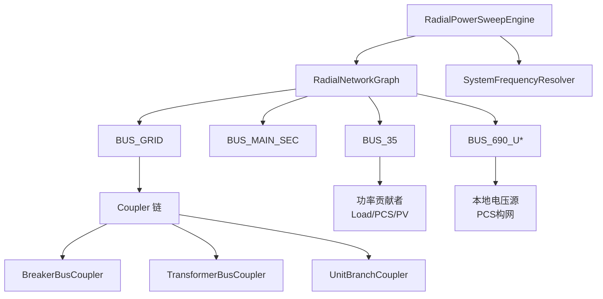
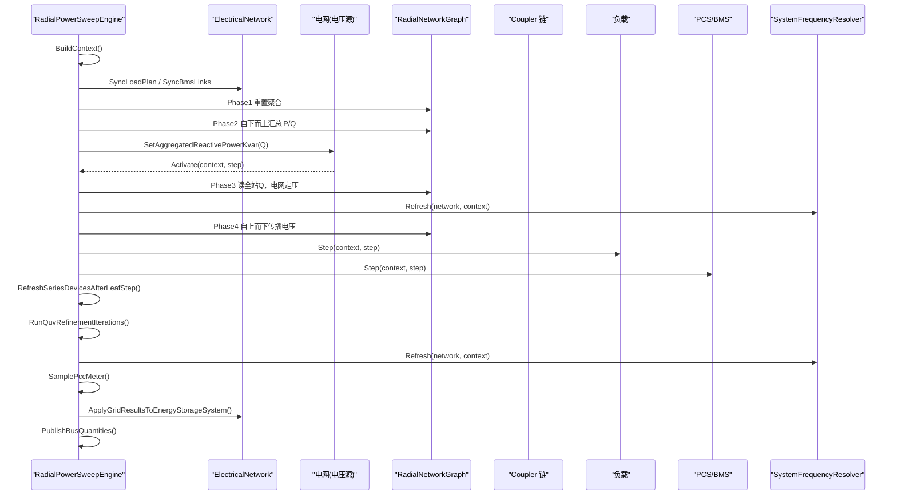
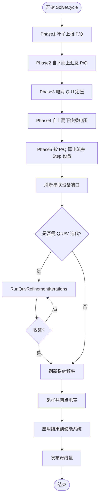
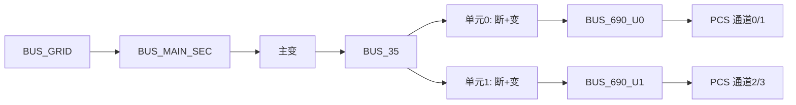
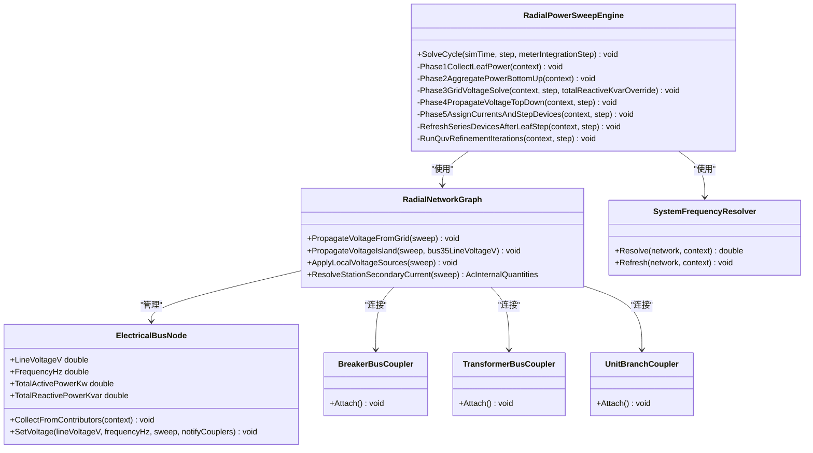

# RadialPowerSweepEngine 辐射状潮流引擎

<cite>
**本文引用的文件**
- [RadialPowerSweepEngine.cs](file://EssDeviceSimModel/Propagation/RadialPowerSweepEngine.cs)
- [RadialNetworkGraph.cs](file://EssDeviceSimModel/Propagation/RadialNetworkGraph.cs)
- [ElectricalBusNode.cs](file://EssDeviceSimModel/Propagation/ElectricalBusNode.cs)
- [QuvConvergence.cs](file://EssDeviceSimModel/Propagation/QuvConvergence.cs)
- [BreakerBusCoupler.cs](file://EssDeviceSimModel/Propagation/BreakerBusCoupler.cs)
- [TransformerBusCoupler.cs](file://EssDeviceSimModel/Propagation/TransformerBusCoupler.cs)
- [UnitBranchCoupler.cs](file://EssDeviceSimModel/Propagation/UnitBranchCoupler.cs)
- [PropagationSweepContext.cs](file://EssDeviceSimModel/Propagation/PropagationSweepContext.cs)
- [IBusCoupler.cs](file://EssDeviceSimModel/Propagation/IBusCoupler.cs)
- [BusPowerContributors.cs](file://EssDeviceSimModel/Propagation/BusPowerContributors.cs)
- [PcsBusVoltageSource.cs](file://EssDeviceSimModel/Propagation/PcsBusVoltageSource.cs)
- [SystemFrequencyResolver.cs](file://EssDeviceSimModel/Solver/SystemFrequencyResolver.cs)
</cite>

## 目录
1. [简介](#简介)
2. [项目结构](#项目结构)
3. [核心组件](#核心组件)
4. [架构总览](#架构总览)
5. [详细组件分析](#详细组件分析)
6. [依赖关系分析](#依赖关系分析)
7. [性能与复杂度](#性能与复杂度)
8. [故障处理与离网运行](#故障处理与离网运行)
9. [数值精度与收敛控制](#数值精度与收敛控制)
10. [排错指南](#排错指南)
11. [结论](#结论)

## 简介
本技术文档面向 RadialPowerSweepEngine，系统化阐述其在储能仿真系统中对辐射状配电网进行潮流计算的方法。内容涵盖：
- 前推回代算法的实现原理、迭代步骤与收敛条件
- 网络拓扑遍历策略：树形结构识别、节点访问顺序、分支功率分配
- 与设备模型的交互方式：功率源处理、负载模型、变压器变比调整
- 故障情况处理：开路故障、短路故障（通过断路器分闸/脱扣建模）、设备退出运行的仿真逻辑
- 算法复杂度、性能优化策略与数值精度控制的实现细节

该引擎以“叶子设备上报 P/Q → 自下而上汇总 → 电网 Q-U 定压 → Coupler 链自上而下传播电压 → 算电流并驱动设备 Step → 基于实测 Q 的多轮 Q-U/V 反馈迭代”为主线，形成闭环求解流程。

## 项目结构
围绕辐射状潮流的核心代码位于 Propagation 子模块中，关键文件职责如下：
- RadialPowerSweepEngine：调度一次完整求解周期，编排前推回代各阶段
- RadialNetworkGraph：从 ElectricalNetwork 构建母线拓扑、贡献者注册、电压耦合链
- ElectricalBusNode：母线节点，维护电压、频率、电流相量累加、功率贡献收集
- QuvConvergence：Q-U/V 迭代收敛判定
- BreakerBusCoupler / TransformerBusCoupler / UnitBranchCoupler：串联元件的电压传播与电流注入
- SystemFrequencyResolver：系统唯一频率解析
- BusPowerContributors / PcsBusVoltageSource：功率贡献者与本地电压源（黑启动）

图表来源
- [RadialPowerSweepEngine.cs:54-75](file://EssDeviceSimModel/Propagation/RadialPowerSweepEngine.cs#L54-L75)
- [RadialNetworkGraph.cs:18-48](file://EssDeviceSimModel/Propagation/RadialNetworkGraph.cs#L18-L48)
- [BreakerBusCoupler.cs:32-51](file://EssDeviceSimModel/Propagation/BreakerBusCoupler.cs#L32-L51)
- [TransformerBusCoupler.cs:35-56](file://EssDeviceSimModel/Propagation/TransformerBusCoupler.cs#L35-L56)
- [UnitBranchCoupler.cs:36-73](file://EssDeviceSimModel/Propagation/UnitBranchCoupler.cs#L36-L73)

章节来源
- [RadialPowerSweepEngine.cs:54-75](file://EssDeviceSimModel/Propagation/RadialPowerSweepEngine.cs#L54-L75)
- [RadialNetworkGraph.cs:18-48](file://EssDeviceSimModel/Propagation/RadialNetworkGraph.cs#L18-L48)

## 核心组件
- 引擎调度器：负责协调一次求解周期的全部阶段，包括数据同步、功率汇总、电网定压、电压传播、设备步进、Q-U/V 迭代、频率刷新、采样与结果发布。
- 拓扑图：抽象出 BUS_GRID、BUS_MAIN_SEC、BUS_35、多个 BUS_690_Ux 等母线节点，并注册功率贡献者与电压源，建立 Coupler 链。
- 母线节点：维护线电压、频率、电流相量累加，提供功率到电流相量的转换与反向能力。
- 耦合器：封装断路器、主变、单元支路的电压传播与电流注入行为，响应上游母线电压变化。
- 收敛判定：基于线路电压相对标幺值变化的容差判断是否收敛。
- 频率解析：根据并网状态或 PCS 构网状态确定系统唯一频率。

章节来源
- [RadialPowerSweepEngine.cs:14-75](file://EssDeviceSimModel/Propagation/RadialPowerSweepEngine.cs#L14-L75)
- [RadialNetworkGraph.cs:18-48](file://EssDeviceSimModel/Propagation/RadialNetworkGraph.cs#L18-L48)
- [ElectricalBusNode.cs:16-48](file://EssDeviceSimModel/Propagation/ElectricalBusNode.cs#L16-L48)
- [QuvConvergence.cs:6-20](file://EssDeviceSimModel/Propagation/QuvConvergence.cs#L6-L20)
- [SystemFrequencyResolver.cs:12-42](file://EssDeviceSimModel/Solver/SystemFrequencyResolver.cs#L12-L42)

## 架构总览
RadialPowerSweepEngine 在一次 SolveCycle 中执行以下阶段：
1. 构建上下文并同步计划与 BMS 链路
2. 叶子设备上报 P/Q 意图（Phase1）
3. 自下而上汇总全站 P/Q（Phase2）
4. 电网读取全站 Q，设定 220kV 电压（Phase3）
5. 自上而下经 Coupler 链传播电压至 35kV、690V（Phase4）
6. 在已知母线电压下由 P/Q 算电流，驱动负载与 PCS/BMS 步进（Phase5）
7. 刷新串联设备端口（主变、单元变）
8. 多轮 Q-U/V 反馈迭代直至收敛
9. 刷新系统频率、采样并网点电表、应用结果并发布母线量

图表来源
- [RadialPowerSweepEngine.cs:54-75](file://EssDeviceSimModel/Propagation/RadialPowerSweepEngine.cs#L54-L75)
- [RadialPowerSweepEngine.cs:77-177](file://EssDeviceSimModel/Propagation/RadialPowerSweepEngine.cs#L77-L177)
- [RadialPowerSweepEngine.cs:180-203](file://EssDeviceSimModel/Propagation/RadialPowerSweepEngine.cs#L180-L203)
- [SystemFrequencyResolver.cs:12-42](file://EssDeviceSimModel/Solver/SystemFrequencyResolver.cs#L12-L42)

## 详细组件分析

### 前推回代算法与迭代步骤
- 前推（自下而上）：叶子设备（PCS、负载、光伏）上报 P/Q，总线节点将各贡献者的功率转换为电流相量并累加，得到全站 P/Q。
- 回代（自上而下）：电网作为唯一电压源，依据全站 Q 设定 220kV 电压；随后通过断路器、主变、单元支路耦合器逐级传播电压至 35kV 与各单元 690V 母线。
- 设备步进：在已知母线电压下，由 P/Q 计算电流，驱动负载与 PCS/BMS 步进；随后刷新串联设备端口（主变、单元变）。
- 反馈迭代：基于设备步进后的实测 Q 进行 Q-U/V 反馈，重复电网定压与电压传播，直到线路电压变化小于容差。

图表来源
- [RadialPowerSweepEngine.cs:54-75](file://EssDeviceSimModel/Propagation/RadialPowerSweepEngine.cs#L54-L75)
- [RadialPowerSweepEngine.cs:77-177](file://EssDeviceSimModel/Propagation/RadialPowerSweepEngine.cs#L77-L177)
- [RadialPowerSweepEngine.cs:180-203](file://EssDeviceSimModel/Propagation/RadialPowerSweepEngine.cs#L180-L203)

章节来源
- [RadialPowerSweepEngine.cs:54-75](file://EssDeviceSimModel/Propagation/RadialPowerSweepEngine.cs#L54-L75)
- [RadialPowerSweepEngine.cs:77-177](file://EssDeviceSimModel/Propagation/RadialPowerSweepEngine.cs#L77-L177)
- [RadialPowerSweepEngine.cs:180-203](file://EssDeviceSimModel/Propagation/RadialPowerSweepEngine.cs#L180-L203)

### 网络拓扑遍历策略
- 树形结构识别：通过 RadialNetworkGraph 构造 BUS_GRID → BUS_MAIN_SEC → BUS_35 → 多个 BUS_690_Ux 的层级结构，体现辐射状拓扑。
- 节点访问顺序：
  - 前推：先清空各母线聚合，再依次收集各贡献者的 P/Q，最后汇总至 35kV 总线。
  - 回代：从电网母线发起电压传播，经断路器、主变、单元支路耦合器逐级向下。
- 分支功率分配：每个 690V 母线对应若干 PCS 通道，贡献者注册时按索引映射到对应 PCS；负载与 PV 贡献者直接注册至 35kV 总线。

图表来源
- [RadialNetworkGraph.cs:18-48](file://EssDeviceSimModel/Propagation/RadialNetworkGraph.cs#L18-L48)
- [RadialNetworkGraph.cs:140-170](file://EssDeviceSimModel/Propagation/RadialNetworkGraph.cs#L140-L170)

章节来源
- [RadialNetworkGraph.cs:18-48](file://EssDeviceSimModel/Propagation/RadialNetworkGraph.cs#L18-L48)
- [RadialNetworkGraph.cs:140-170](file://EssDeviceSimModel/Propagation/RadialNetworkGraph.cs#L140-L170)

### 与设备模型的交互方式
- 功率源处理：
  - 负载：通过 LoadBusContributor 获取实时有功与无功，刷新调度后计入总线。
  - PCS：通过 PcsBusContributor 获取电网侧有功与无功；同时作为 690V 母线的本地电压源（黑启动/构网模式）。
  - PV：通过 PvUnitBusContributor 直接贡献有功与无功。
- 负载模型：LoadDevice 在每步刷新调度，输出当前有功与无功，参与总线功率汇总。
- 变压器变比调整：
  - 主变：在 Phase5 之后，根据 35kV 母线电压与全站二次电流，设置主变一次侧电压与二次侧电流，调用 Step 更新变比与端口量。
  - 单元变：对每个单元，根据单元 690V 母线功率与电压估算二次电流，设置单元变一次侧电压与二次侧电流，调用 Step 更新端口量。

章节来源
- [BusPowerContributors.cs:6-46](file://EssDeviceSimModel/Propagation/BusPowerContributors.cs#L6-L46)
- [RadialPowerSweepEngine.cs:205-249](file://EssDeviceSimModel/Propagation/RadialPowerSweepEngine.cs#L205-L249)
- [PcsBusVoltageSource.cs:6-23](file://EssDeviceSimModel/Propagation/PcsBusVoltageSource.cs#L6-L23)

### 故障情况的处理方法
- 开路故障（断路器分闸/脱扣）：
  - 主断分闸：电网不可用，引擎估计离网 35kV 母线电压并通过 PropagateVoltageIsland 传播至各单元 690V 母线。
  - 单元断分闸：单元支路耦合器检测到开关断开或脱扣，单元变一次侧电压置零，下游 690V 母线电压为零。
- 短路故障：在本实现中未显式建模短路阻抗，短路通常表现为保护动作导致断路器脱扣，从而进入开路状态。
- 设备退出运行：
  - PCS 通道不存在或索引越界时跳过步进。
  - 当 PCS 无构网电压注入时，本地电压源不生效，母线电压由上游传播决定。

章节来源
- [RadialPowerSweepEngine.cs:112-133](file://EssDeviceSimModel/Propagation/RadialPowerSweepEngine.cs#L112-L133)
- [RadialPowerSweepEngine.cs:340-359](file://EssDeviceSimModel/Propagation/RadialPowerSweepEngine.cs#L340-L359)
- [UnitBranchCoupler.cs:36-73](file://EssDeviceSimModel/Propagation/UnitBranchCoupler.cs#L36-L73)
- [BreakerBusCoupler.cs:32-51](file://EssDeviceSimModel/Propagation/BreakerBusCoupler.cs#L32-L51)

## 依赖关系分析
- RadialPowerSweepEngine 依赖：
  - RadialNetworkGraph：提供拓扑、贡献者、电压传播接口
  - ElectricalNetwork：电网、负载、PCS、BMS、直流链路、断路器、主变、单元变
  - SystemFrequencyResolver：系统频率解析
  - NetworkControlBridge / NetworkStepOrchestrator：计划同步、结果应用
- RadialNetworkGraph 依赖：
  - ElectricalBusNode：母线节点
  - IBusCoupler 实现：断路器、主变、单元支路耦合器
  - PcsBusVoltageSource：本地电压源
- ElectricalBusNode 依赖：
  - AcQuantityConverter：功率与电流相量转换
  - DeviceStepContext / PropagationSweepContext：步进上下文

图表来源
- [RadialPowerSweepEngine.cs:14-75](file://EssDeviceSimModel/Propagation/RadialPowerSweepEngine.cs#L14-L75)
- [RadialNetworkGraph.cs:18-48](file://EssDeviceSimModel/Propagation/RadialNetworkGraph.cs#L18-L48)
- [ElectricalBusNode.cs:16-48](file://EssDeviceSimModel/Propagation/ElectricalBusNode.cs#L16-L48)
- [BreakerBusCoupler.cs:6-51](file://EssDeviceSimModel/Propagation/BreakerBusCoupler.cs#L6-L51)
- [TransformerBusCoupler.cs:6-56](file://EssDeviceSimModel/Propagation/TransformerBusCoupler.cs#L6-L56)
- [UnitBranchCoupler.cs:6-73](file://EssDeviceSimModel/Propagation/UnitBranchCoupler.cs#L6-L73)
- [SystemFrequencyResolver.cs:12-42](file://EssDeviceSimModel/Solver/SystemFrequencyResolver.cs#L12-L42)

章节来源
- [RadialPowerSweepEngine.cs:14-75](file://EssDeviceSimModel/Propagation/RadialPowerSweepEngine.cs#L14-L75)
- [RadialNetworkGraph.cs:18-48](file://EssDeviceSimModel/Propagation/RadialNetworkGraph.cs#L18-L48)
- [ElectricalBusNode.cs:16-48](file://EssDeviceSimModel/Propagation/ElectricalBusNode.cs#L16-L48)

## 性能与复杂度
- 时间复杂度：
  - 前推阶段：O(N_contributors)，N_contributors 为各母线注册的功率贡献者数量之和（负载、PCS、PV）。
  - 回代阶段：O(N_couplers)，N_couplers 为断路器、主变、单元支路耦合器数量之和。
  - 设备步进：O(N_devices)，N_devices 为负载与 PCS 数量之和。
  - Q-U/V 迭代：最多 K 轮，K 为 propagationQuvMaxIterations，每轮包含一次电网定压与一次电压传播。
- 空间复杂度：
  - 母线节点存储电流相量与贡献者列表，整体 O(N_buses + N_contributors)。
  - 耦合器链存储上下游母线引用与回调，整体 O(N_couplers)。
- 性能优化策略：
  - 仅在需要时触发 Q-U/V 迭代（主断合且最大迭代数大于 1）。
  - 使用电流相量累加避免重复功率到电流转换。
  - 本地电压源只在有更高注入电压时覆盖母线电压，减少不必要的传播。
  - 单元支路在无显著功率时采用最小电压阈值，避免除零与数值不稳定。

[本节为通用性能讨论，不直接分析具体文件]

## 故障处理与离网运行
- 主断分闸（开路）：
  - 引擎估计离网 35kV 母线电压，通过 PropagateVoltageIsland 直接设定并传播至各单元 690V 母线。
  - 频率解析返回 0 或 PCS 构网频率，确保后续设备步进使用正确频率。
- 单元断分闸或脱扣：
  - 单元支路耦合器检测到开关状态异常，单元变一次侧电压置零，下游 690V 母线电压为零。
- 设备退出运行：
  - 若 PCS 通道索引超出范围则跳过步进。
  - PCS 无构网注入时，本地电压源不生效，母线电压由上游传播决定。

章节来源
- [RadialPowerSweepEngine.cs:112-133](file://EssDeviceSimModel/Propagation/RadialPowerSweepEngine.cs#L112-L133)
- [RadialPowerSweepEngine.cs:340-359](file://EssDeviceSimModel/Propagation/RadialPowerSweepEngine.cs#L340-L359)
- [UnitBranchCoupler.cs:36-73](file://EssDeviceSimModel/Propagation/UnitBranchCoupler.cs#L36-L73)
- [SystemFrequencyResolver.cs:12-42](file://EssDeviceSimModel/Solver/SystemFrequencyResolver.cs#L12-L42)

## 数值精度与收敛控制
- 收敛条件：
  - 基于线路电压相对标幺值变化判断：deltaPu = |V_current - V_previous| / V_nominal ≤ tolerancePu。
  - 若前后电压均低于阈值（无压），视为已收敛。
- 参数配置：
  - propagationQuvMaxIterations：最大迭代次数，默认至少为 1。
  - propagationVoltageTolerancePu：电压容差（pu），默认 0.001。
- 实现细节：
  - QuvConvergence.IsLineVoltageConverged 提供统一收敛判定。
  - 引擎在每次迭代后检查收敛，满足条件即提前终止。
  - 频率解析在每次迭代后刷新，确保设备步进使用最新系统频率。

章节来源
- [QuvConvergence.cs:6-20](file://EssDeviceSimModel/Propagation/QuvConvergence.cs#L6-L20)
- [RadialPowerSweepEngine.cs:180-203](file://EssDeviceSimModel/Propagation/RadialPowerSweepEngine.cs#L180-L203)
- [SystemFrequencyResolver.cs:12-42](file://EssDeviceSimModel/Solver/SystemFrequencyResolver.cs#L12-L42)

## 排错指南
- 现象：电压不收敛或震荡
  - 检查 propagationQuvMaxIterations 是否过小，适当增大。
  - 检查 propagationVoltageTolerancePu 是否过严，适当放宽。
  - 确认电网 Q 输入是否正确，避免重复计数。
- 现象：离网模式下 35kV 母线电压为零
  - 确认是否有 PCS 提供构网电压注入（TryGetIslandBusVoltageInjection）。
  - 检查单元变二次侧电压是否有效，必要时调整比例系数。
- 现象：某单元 690V 母线无电压
  - 检查单元断路器状态（闭合且未脱扣）。
  - 检查单元变一次侧电压是否被置零（可能因上游电压异常）。
- 现象：频率解析异常
  - 主断合且电网无压时频率为 0；确认电网电压是否正常。
  - 离网模式下选择最高电压 PCS 的频率，确认 PCS 构网状态。

章节来源
- [RadialPowerSweepEngine.cs:180-203](file://EssDeviceSimModel/Propagation/RadialPowerSweepEngine.cs#L180-L203)
- [RadialPowerSweepEngine.cs:340-359](file://EssDeviceSimModel/Propagation/RadialPowerSweepEngine.cs#L340-L359)
- [SystemFrequencyResolver.cs:12-42](file://EssDeviceSimModel/Solver/SystemFrequencyResolver.cs#L12-L42)

## 结论
RadialPowerSweepEngine 通过清晰的前推回代流程与 Coupler 链机制，实现了辐射状配电网的高效潮流计算。其设计特点包括：
- 明确的阶段划分与数据流，便于调试与扩展
- 模块化耦合器与贡献者，支持灵活的设备接入
- 基于 Q-U/V 反馈的迭代收敛，兼顾精度与稳定性
- 完善的离网与故障处理逻辑，适应多种运行工况

在实际应用中，建议根据系统规模与动态特性合理配置迭代次数与容差，并结合频率解析与本地电压源机制，确保仿真结果的准确性与鲁棒性。

[本节为总结性内容，不直接分析具体文件]