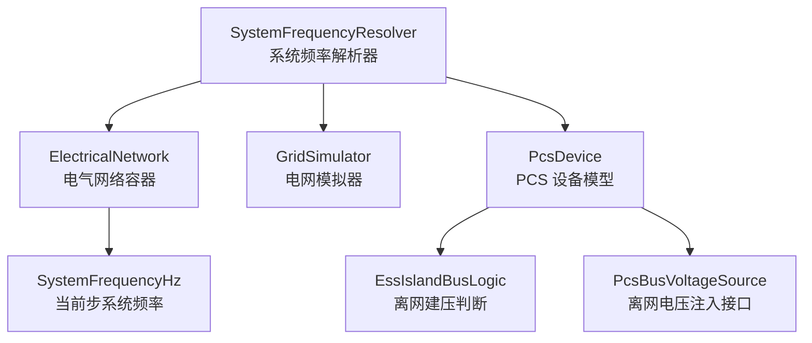
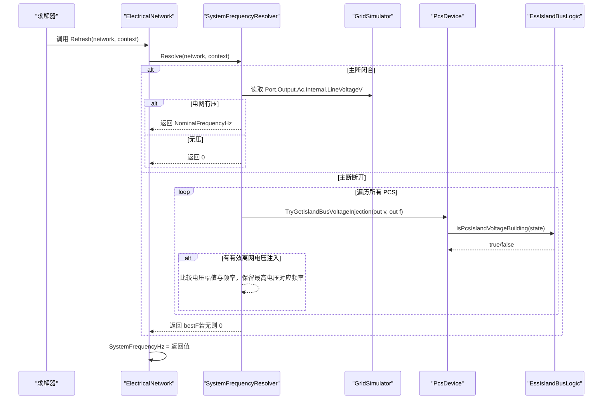
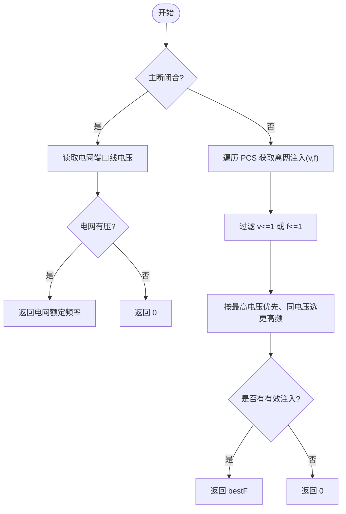
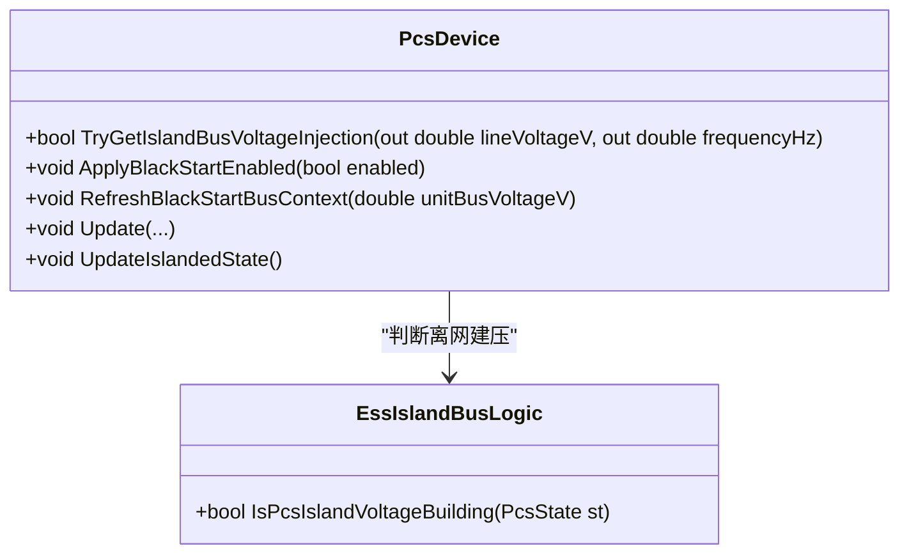
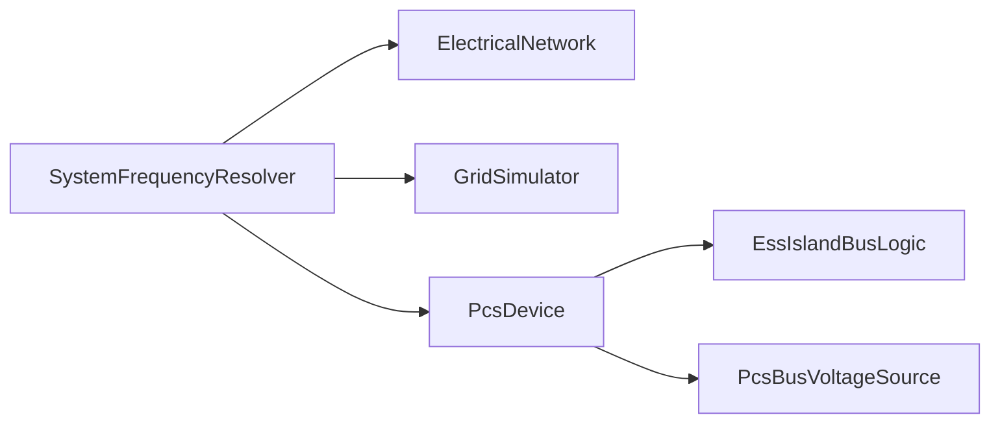

# SystemFrequencyResolver 系统频率解析器

<cite>
**本文引用的文件**
- [SystemFrequencyResolver.cs](file://EssDeviceSimModel/Solver/SystemFrequencyResolver.cs)
- [ElectricalNetwork.cs](file://EssDeviceSimModel/Solver/ElectricalNetwork.cs)
- [GridSimulator.cs](file://EssDeviceSimModel/Devices/GridSimulator.cs)
- [PcsDevice.Core.cs](file://EssDeviceSimModel/Devices/PcsDevice.Core.cs)
- [PcsDevice.BlackStart.cs](file://EssDeviceSimModel/Devices/PcsDevice.BlackStart.cs)
- [EssIslandBusLogic.cs](file://EssDeviceSimModel/EssIslandBusLogic.cs)
- [PcsBusVoltageSource.cs](file://EssDeviceSimModel/Propagation/PcsBusVoltageSource.cs)
- [SystemFrequencyResolverTests.cs](file://EssSimulator.Tests/Solver/SystemFrequencyResolverTests.cs)
</cite>

## 目录
1. [简介](#简介)
2. [项目结构](#项目结构)
3. [核心组件](#核心组件)
4. [架构总览](#架构总览)
5. [详细组件分析](#详细组件分析)
6. [依赖关系分析](#依赖关系分析)
7. [性能与精度特性](#性能与精度特性)
8. [故障与异常处理](#故障与异常处理)
9. [结论](#结论)
10. [附录：参数与配置要点](#附录参数与配置要点)

## 简介
本技术文档围绕 SystemFrequencyResolver（系统频率解析器）展开，说明其在仿真步中如何确定“当前系统唯一频率源”。该解析器不实现锁相环或相位跟踪算法，而是基于电网模型与 PCS 构网状态，给出每步的系统频率值，供其他模块（如电表、PCS 控制、保护逻辑）使用。

- 主断合且电网有压：系统频率取电网额定频率。
- 主断分且存在构网 PCS：从所有提供离网电压注入的 PCS 中选择最高有效电压对应的频率作为系统频率。
- 否则：系统频率为 0。

该设计将“频率源选择”与“频率生成/跟踪”解耦：电网侧由 GridSimulator 输出频率；离网侧由 PCS 在 V/f 模式下产生频率；解析器仅做统一汇聚。

**章节来源**
- [SystemFrequencyResolver.cs:12-42](file://EssDeviceSimModel/Solver/SystemFrequencyResolver.cs#L12-L42)
- [GridSimulator.cs:49-71](file://EssDeviceSimModel/Devices/GridSimulator.cs#L49-L71)
- [PcsDevice.BlackStart.cs:11-42](file://EssDeviceSimModel/Devices/PcsDevice.BlackStart.cs#L11-L42)

## 项目结构
SystemFrequencyResolver 位于求解器层，依赖电气网络容器、电网模拟器与 PCS 设备模型，并通过传播层接口暴露离网电压注入能力。

**图表来源**
- [SystemFrequencyResolver.cs:12-42](file://EssDeviceSimModel/Solver/SystemFrequencyResolver.cs#L12-L42)
- [ElectricalNetwork.cs:29-30](file://EssDeviceSimModel/Solver/ElectricalNetwork.cs#L29-L30)
- [GridSimulator.cs:49-71](file://EssDeviceSimModel/Devices/GridSimulator.cs#L49-L71)
- [PcsDevice.BlackStart.cs:11-42](file://EssDeviceSimModel/Devices/PcsDevice.BlackStart.cs#L11-L42)
- [PcsBusVoltageSource.cs:15-23](file://EssDeviceSimModel/Propagation/PcsBusVoltageSource.cs#L15-L23)

**章节来源**
- [ElectricalNetwork.cs:10-33](file://EssDeviceSimModel/Solver/ElectricalNetwork.cs#L10-L33)

## 核心组件
- SystemFrequencyResolver：静态类，提供 Resolve 与 Refresh 两个入口，决定当前步的系统频率并写回 ElectricalNetwork.SystemFrequencyHz。
- ElectricalNetwork：运行时拓扑容器，持有 Grid、MainBreaker、PcsDevices 等，并提供 SystemFrequencyHz 字段。
- GridSimulator：模拟电网端口输出，根据主断状态与无功反馈计算 PCC 线电压，并在有压时输出额定频率。
- PcsDevice：PCS 设备模型，包含跟网/离网模式、黑启动流程、离网 V/f 建压与频率输出，以及 TryGetIslandBusVoltageInjection 接口。
- EssIslandBusLogic：判断 PCS 是否处于离网建压状态，辅助频率源选择。
- PcsBusVoltageSource：将 PCS 的离网电压注入抽象为总线级电压源，供传播引擎使用。

**章节来源**
- [SystemFrequencyResolver.cs:10-43](file://EssDeviceSimModel/Solver/SystemFrequencyResolver.cs#L10-L43)
- [ElectricalNetwork.cs:10-33](file://EssDeviceSimModel/Solver/ElectricalNetwork.cs#L10-L33)
- [GridSimulator.cs:12-71](file://EssDeviceSimModel/Devices/GridSimulator.cs#L12-L71)
- [PcsDevice.Core.cs:15-134](file://EssDeviceSimModel/Devices/PcsDevice.Core.cs#L15-L134)
- [PcsDevice.BlackStart.cs:11-42](file://EssDeviceSimModel/Devices/PcsDevice.BlackStart.cs#L11-L42)
- [EssIslandBusLogic.cs:8-18](file://EssDeviceSimModel/EssIslandBusLogic.cs#L8-L18)
- [PcsBusVoltageSource.cs:6-23](file://EssDeviceSimModel/Propagation/PcsBusVoltageSource.cs#L6-L23)

## 架构总览
下图展示了单步仿真中的频率源选择与控制流：

**图表来源**
- [SystemFrequencyResolver.cs:12-42](file://EssDeviceSimModel/Solver/SystemFrequencyResolver.cs#L12-L42)
- [GridSimulator.cs:49-71](file://EssDeviceSimModel/Devices/GridSimulator.cs#L49-L71)
- [PcsDevice.BlackStart.cs:11-42](file://EssDeviceSimModel/Devices/PcsDevice.BlackStart.cs#L11-L42)
- [EssIslandBusLogic.cs:8-18](file://EssDeviceSimModel/EssIslandBusLogic.cs#L8-L18)

## 详细组件分析

### SystemFrequencyResolver：频率源选择策略
- 输入：ElectricalNetwork、DeviceStepContext（含 MainBreakerClosed）。
- 主断闭合：
  - 若电网端口线电压大于阈值（>1V），返回电网额定频率。
  - 否则返回 0。
- 主断断开：
  - 遍历所有 PCS，调用 TryGetIslandBusVoltageInjection 获取 (v, f)。
  - 过滤无效注入（v<=1 或 f<=1）。
  - 按“最高有效电压优先，同电压下选更高频率”的策略选择 bestF。
- 输出：写入 ElectricalNetwork.SystemFrequencyHz。

**图表来源**
- [SystemFrequencyResolver.cs:12-42](file://EssDeviceSimModel/Solver/SystemFrequencyResolver.cs#L12-L42)

**章节来源**
- [SystemFrequencyResolver.cs:12-42](file://EssDeviceSimModel/Solver/SystemFrequencyResolver.cs#L12-L42)

### GridSimulator：电网频率注入
- 通过 SetAggregatedReactivePowerKvar 设置无功聚合，结合短路容量与 Q-U 系数计算 PCC 线电压。
- 当主断闭合时输出线电压；否则置零。
- 在有压时，端口内部量 FrequencyHz 设为额定频率；无压时为 0。
- 该频率即为 SystemFrequencyResolver 在主断闭合时的取值来源。

**章节来源**
- [GridSimulator.cs:25-71](file://EssDeviceSimModel/Devices/GridSimulator.cs#L25-L71)

### PcsDevice：离网 V/f 建压与频率输出
- 离网建压判定：
  - 需满足运行模式 Normal、并网模式 Islanded。
  - 黑启动阶段为 SoftStarting/VoltageRegulating/Synchronized，或非黑启动但 IslandVoltageEffectiveV > 1。
- 频率输出：
  - 黑启动期间，频率随电压软起逐步爬升，目标为额定频率；同步后固定为额定频率。
  - 非黑启动离网模式，频率由上层控制逻辑设定（当前实现中未主动跟踪电网频率）。
- 接口：TryGetIslandBusVoltageInjection 向上传递有效离网电压与频率，供 SystemFrequencyResolver 选择。

**图表来源**
- [PcsDevice.BlackStart.cs:11-42](file://EssDeviceSimModel/Devices/PcsDevice.BlackStart.cs#L11-L42)
- [PcsDevice.Core.cs:585-611](file://EssDeviceSimModel/Devices/PcsDevice.Core.cs#L585-L611)
- [EssIslandBusLogic.cs:8-18](file://EssDeviceSimModel/EssIslandBusLogic.cs#L8-L18)

**章节来源**
- [PcsDevice.BlackStart.cs:11-42](file://EssDeviceSimModel/Devices/PcsDevice.BlackStart.cs#L11-L42)
- [PcsDevice.Core.cs:585-611](file://EssDeviceSimModel/Devices/PcsDevice.Core.cs#L585-L611)
- [EssIslandBusLogic.cs:8-18](file://EssDeviceSimModel/EssIslandBusLogic.cs#L8-L18)

### PcsBusVoltageSource：离网电压注入抽象
- 封装 PCS 的离网电压注入行为，供传播引擎在 690V 母线上叠加本地电压源。
- 当 PCS 可注入时，返回 (lineVoltageV, frequencyHz)，用于母线电压与频率的局部更新。

**章节来源**
- [PcsBusVoltageSource.cs:6-23](file://EssDeviceSimModel/Propagation/PcsBusVoltageSource.cs#L6-L23)

### 频率同步机制说明
- 本项目未实现传统意义上的锁相环（PLL）或相位跟踪算法。
- 频率同步体现在：
  - 并网模式：PCS 跟随电网频率（由 GridSimulator 提供）。
  - 离网模式：PCS 作为 V/f 源建立频率，黑启动阶段按电压比例与斜率爬升至额定频率，随后进入同步稳态。
- SystemFrequencyResolver 仅负责“选择当前系统频率源”，不参与频率生成或相位锁定。

**章节来源**
- [GridSimulator.cs:49-71](file://EssDeviceSimModel/Devices/GridSimulator.cs#L49-L71)
- [PcsDevice.BlackStart.cs:180-192](file://EssDeviceSimModel/Devices/PcsDevice.BlackStart.cs#L180-L192)
- [SystemFrequencyResolver.cs:12-42](file://EssDeviceSimModel/Solver/SystemFrequencyResolver.cs#L12-L42)

### 与电网模型的集成
- 电网频率注入：GridSimulator.Step 计算 PCC 线电压，并在有压时输出额定频率。
- 本地频率估计：SystemFrequencyResolver 在主断断开时，依据各 PCS 的离网注入频率进行估计。
- 频率偏差补偿：本实现未对频率偏差进行闭环补偿；PCS 在离网模式下的频率由自身 V/f 控制决定。

**章节来源**
- [GridSimulator.cs:49-71](file://EssDeviceSimModel/Devices/GridSimulator.cs#L49-L71)
- [SystemFrequencyResolver.cs:12-42](file://EssDeviceSimModel/Solver/SystemFrequencyResolver.cs#L12-L42)

### 频率异常情况处理
- 孤岛检测：PCS 在并网模式下检测到主网不可用时，切换至离网模式；同时检查黑启动与主网可用互斥条件，触发故障。
- 频率越限保护：当前实现未对系统频率越限直接保护；PCS 保护主要关注过流、温度、直流电压范围等。
- 频率恢复策略：
  - 主网恢复：PCS 从离网切回并网，系统频率由电网额定频率接管。
  - 黑启动完成：频率稳定至额定频率，进入同步阶段。

**章节来源**
- [PcsDevice.Core.cs:333-348](file://EssDeviceSimModel/Devices/PcsDevice.Core.cs#L333-L348)
- [PcsDevice.Core.cs:643-693](file://EssDeviceSimModel/Devices/PcsDevice.Core.cs#L643-L693)
- [PcsDevice.BlackStart.cs:141-178](file://EssDeviceSimModel/Devices/PcsDevice.BlackStart.cs#L141-L178)

## 依赖关系分析
- SystemFrequencyResolver 依赖 ElectricalNetwork 提供的网格与设备集合，依赖 DeviceStepContext 的主断状态。
- GridSimulator 提供电网频率与电压输出，受主断与无功反馈影响。
- PcsDevice 提供离网 V/f 注入接口，依赖 EssIslandBusLogic 的状态判断。
- PcsBusVoltageSource 作为传播层适配器，将 PCS 注入映射到母线节点。

**图表来源**
- [SystemFrequencyResolver.cs:12-42](file://EssDeviceSimModel/Solver/SystemFrequencyResolver.cs#L12-L42)
- [ElectricalNetwork.cs:10-33](file://EssDeviceSimModel/Solver/ElectricalNetwork.cs#L10-L33)
- [GridSimulator.cs:49-71](file://EssDeviceSimModel/Devices/GridSimulator.cs#L49-L71)
- [PcsDevice.BlackStart.cs:11-42](file://EssDeviceSimModel/Devices/PcsDevice.BlackStart.cs#L11-L42)
- [EssIslandBusLogic.cs:8-18](file://EssDeviceSimModel/EssIslandBusLogic.cs#L8-L18)
- [PcsBusVoltageSource.cs:15-23](file://EssDeviceSimModel/Propagation/PcsBusVoltageSource.cs#L15-L23)

**章节来源**
- [SystemFrequencyResolver.cs:12-42](file://EssDeviceSimModel/Solver/SystemFrequencyResolver.cs#L12-L42)
- [ElectricalNetwork.cs:10-33](file://EssDeviceSimModel/Solver/ElectricalNetwork.cs#L10-L33)

## 性能与精度特性
- 时间复杂度：Resolve 在主断断开时遍历所有 PCS，复杂度 O(Npcs)。
- 数值稳定性：
  - 电网有压阈值：LineVoltageV > 1.0。
  - 离网注入有效性：v > 1.0 且 f > 1.0。
  - 多 PCS 选择策略：优先最高电压，同电压差小于 1mV 时选择更高频率。
- 稳态精度：
  - 并网模式：系统频率等于电网额定频率。
  - 离网模式：系统频率等于当前 PCS 输出的离网频率（黑启动阶段逐步趋近额定频率）。
- 动态响应：
  - 黑启动频率爬升速率由 BlackStartFrequencyRampHzPerSec 限制。
  - 电压软起速率由 BlackStartVoltageRampVs 限制。

**章节来源**
- [SystemFrequencyResolver.cs:12-42](file://EssDeviceSimModel/Solver/SystemFrequencyResolver.cs#L12-L42)
- [PcsDevice.BlackStart.cs:180-192](file://EssDeviceSimModel/Devices/PcsDevice.BlackStart.cs#L180-L192)

## 故障与异常处理
- 主断闭合但无电网电压：系统频率返回 0，避免误用无效频率。
- 主断断开且无有效离网注入：系统频率返回 0，提示无频率源。
- PCS 保护：
  - 过流、高温、直流电压越限会触发故障并跳闸停机。
  - 并网模式下主网不可用视为孤岛，触发故障。
  - 黑启动启用且主网可用视为冲突，触发故障。
- 频率恢复：
  - 主网恢复后 PCS 切回并网，系统频率由电网接管。
  - 黑启动完成后频率稳定至额定频率。

**章节来源**
- [SystemFrequencyResolver.cs:12-42](file://EssDeviceSimModel/Solver/SystemFrequencyResolver.cs#L12-L42)
- [PcsDevice.Core.cs:643-693](file://EssDeviceSimModel/Devices/PcsDevice.Core.cs#L643-L693)
- [PcsDevice.Core.cs:333-348](file://EssDeviceSimModel/Devices/PcsDevice.Core.cs#L333-L348)

## 结论
SystemFrequencyResolver 以简洁、稳健的方式在当前仿真步内确定系统唯一频率源：
- 并网场景：直接采用电网额定频率。
- 离网场景：从多个 PCS 的离网 V/f 注入中选择最高有效电压对应的频率。
该设计避免了复杂的 PLL 实现，将频率源选择与频率生成解耦，便于在不同运行模式下保持一致的频率视图。对于需要频率偏差检测、相位跟踪或更精细的频率控制的应用，可在 PCS 控制层扩展，而 SystemFrequencyResolver 仍可作为统一的频率源汇聚点。

## 附录：参数与配置要点
- 电网频率：通过 GridSimulator.SetNominalFrequency 设置，需在 (0, 75] Hz 范围内。
- 离网建压：
  - 黑启动阶段：SoftStarting → VoltageRegulating → Synchronized。
  - 频率爬升：BlackStartFrequencyStartHz 起始，BlackStartFrequencyRampHzPerSec 爬升速率。
  - 电压软起：BlackStartVoltageRampVs 上升速率，BlackStartPrechargeDelayMs 预充电延时。
- 选择策略：
  - 有效注入阈值：v > 1.0 且 f > 1.0。
  - 多 PCS 选择：优先最高电压，同电压差 ≤ 1mV 时选更高频率。
- 测试覆盖：
  - 主断闭合且有电网电压：返回电网频率。
  - 主断闭合但无电网电压：返回 0。
  - 主断断开且无离网 PCS：返回 0。

**章节来源**
- [GridSimulator.cs:36-42](file://EssDeviceSimModel/Devices/GridSimulator.cs#L36-L42)
- [PcsDevice.BlackStart.cs:59-86](file://EssDeviceSimModel/Devices/PcsDevice.BlackStart.cs#L59-L86)
- [PcsDevice.BlackStart.cs:141-192](file://EssDeviceSimModel/Devices/PcsDevice.BlackStart.cs#L141-L192)
- [SystemFrequencyResolverTests.cs:9-36](file://EssSimulator.Tests/Solver/SystemFrequencyResolverTests.cs#L9-L36)