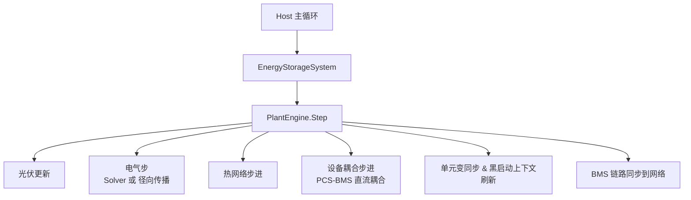
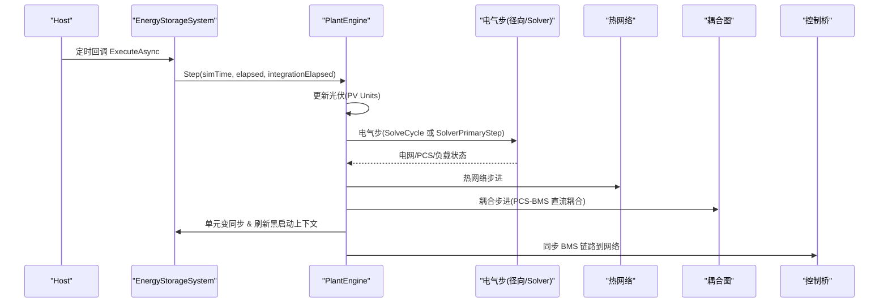
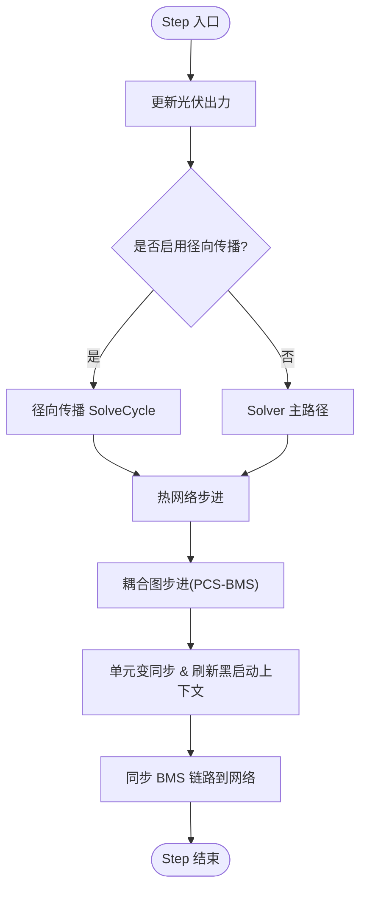
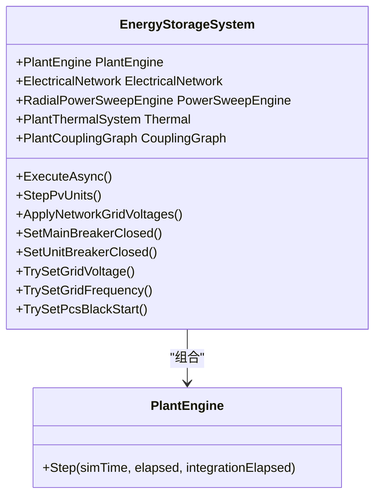
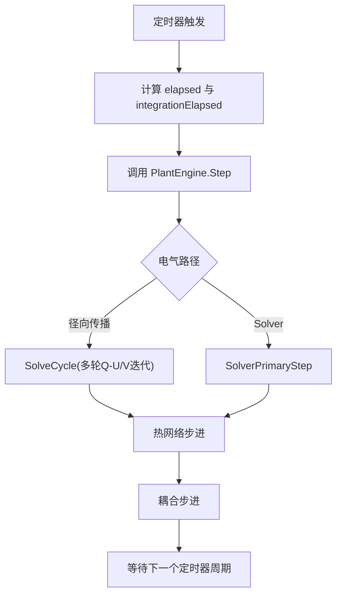
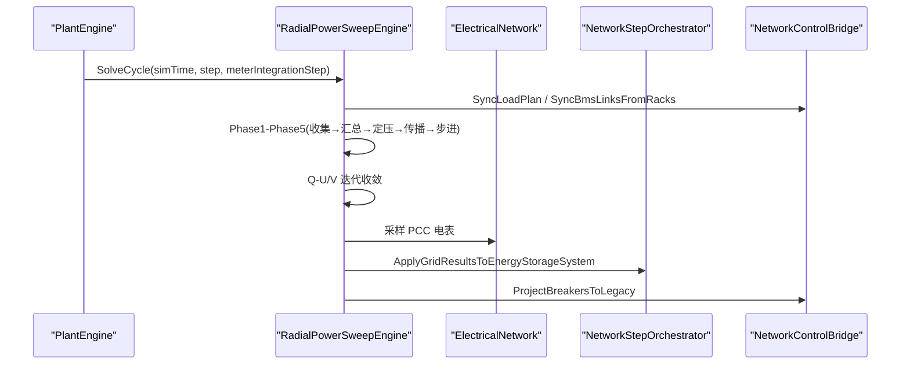
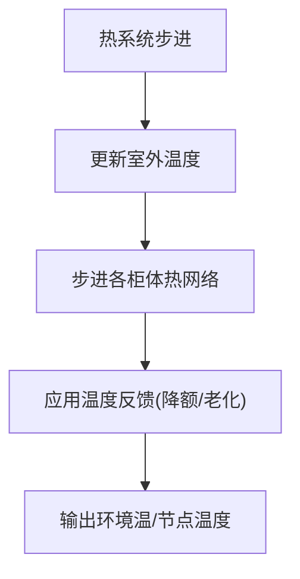
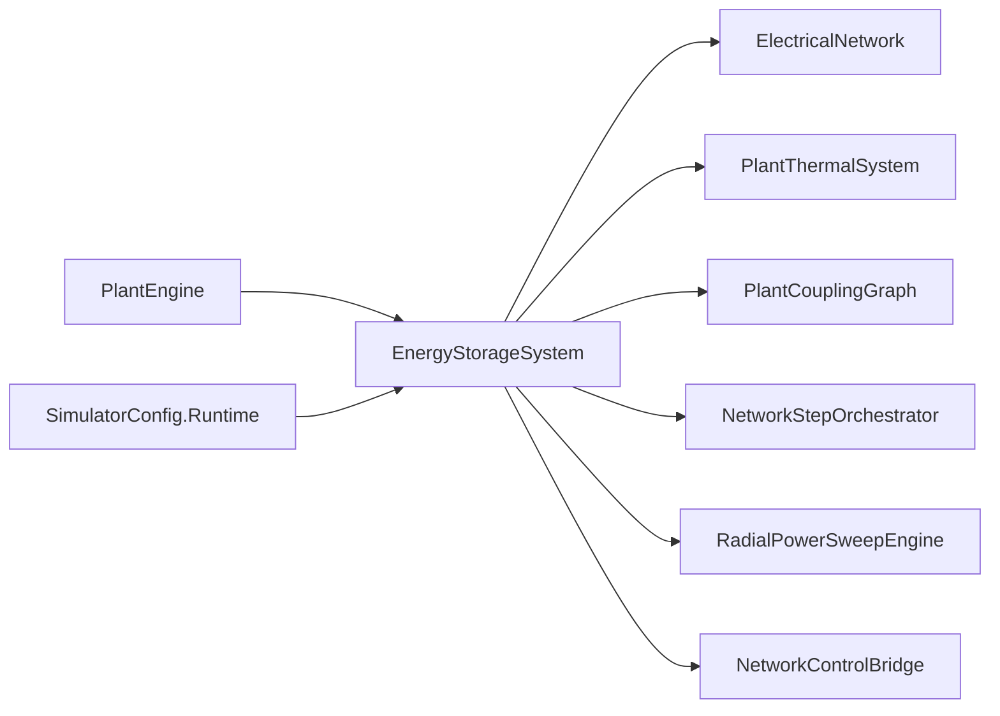

# PlantEngine 仿真调度器

<cite>
**本文引用的文件**
- [PlantEngine.cs](file://EssDeviceSimModel/PlantEngine.cs)
- [EnergyStorageSystem.cs](file://EssDeviceSimModel/EnergyStorageSystem.cs)
- [PlantCouplingGraph.cs](file://EssDeviceSimModel/Plant/PlantCouplingGraph.cs)
- [PcsBmsDcCouplingLink.cs](file://EssDeviceSimModel/Plant/PcsBmsDcCouplingLink.cs)
- [NetworkStepOrchestrator.cs](file://EssDeviceSimModel/Solver/NetworkStepOrchestrator.cs)
- [NetworkControlBridge.cs](file://EssDeviceSimModel/Solver/NetworkControlBridge.cs)
- [RadialPowerSweepEngine.cs](file://EssDeviceSimModel/Propagation/RadialPowerSweepEngine.cs)
- [PlantThermalSystem.cs](file://EssDeviceSimModel/Thermal/PlantThermalSystem.cs)
- [SimulatorConfig.cs](file://Configuration/SimulatorConfig.cs)
</cite>

## 目录
1. [简介](#简介)
2. [项目结构](#项目结构)
3. [核心组件](#核心组件)
4. [架构总览](#架构总览)
5. [详细组件分析](#详细组件分析)
6. [依赖关系分析](#依赖关系分析)
7. [性能考量](#性能考量)
8. [故障排查指南](#故障排查指南)
9. [结论](#结论)
10. [附录](#附录)

## 简介
PlantEngine 是电站级仿真的“物理步进门面”，对外仅暴露 Step 方法，由 Host 主循环驱动。它负责协调光伏、电气网络（或径向潮流）、热网络、设备耦合图以及黑启动/断路器同步等子系统，确保每个仿真步内数据流与状态一致。其设计遵循“单一职责 + 编排者”模式：将复杂的多域耦合计算封装在内部步骤中，向外部提供稳定、可预测的推进接口。

## 项目结构
围绕 PlantEngine 的关键文件与职责如下：
- PlantEngine：调度入口，定义每步执行顺序。
- EnergyStorageSystem：系统装配与主循环，持有电气网络、热系统、耦合图、设备列表等。
- NetworkStepOrchestrator：Solver 路径的电气步编排。
- RadialPowerSweepEngine：事件驱动的径向前推回代求解引擎。
- PlantCouplingGraph / PcsBmsDcCouplingLink：PCS–BMS 直流耦合边及批量步进。
- PlantThermalSystem：气候与 BMS 柜体热网络步进与环境温度供给。
- NetworkControlBridge：控制命令写入与状态投影（断路器、BMS 链路）。
- SimulatorConfig.Runtime：时间步长、迭代次数、收敛容差等运行时参数。



图表来源
- [EnergyStorageSystem.cs:473-496](file://EssDeviceSimModel/EnergyStorageSystem.cs#L473-L496)
- [PlantEngine.cs:22-31](file://EssDeviceSimModel/PlantEngine.cs#L22-L31)

章节来源
- [EnergyStorageSystem.cs:124-245](file://EssDeviceSimModel/EnergyStorageSystem.cs#L124-L245)
- [PlantEngine.cs:6-31](file://EssDeviceSimModel/PlantEngine.cs#L6-L31)

## 核心组件
- PlantEngine：对外唯一入口，按固定顺序推进各子系统，屏蔽内部实现细节。
- EnergyStorageSystem：装配设备、构建网络、初始化热系统与耦合图；维护主循环定时器与时间推进逻辑。
- NetworkStepOrchestrator：Solver 路径下的电气步编排，包含控制意图同步、求解、结果回写与断路器投影。
- RadialPowerSweepEngine：事件驱动的前推回代求解，含 Q-U/V 反馈迭代、电压传播、设备步进与采样。
- PlantCouplingGraph 与 PcsBmsDcCouplingLink：以“边”描述 PCS 与 BMS 的直流耦合，统一步进并登记损耗。
- PlantThermalSystem：提供环境温、柜体空气温、电池节点温度，并记录热注入。
- NetworkControlBridge：控制命令写入与状态投影，保证 GUI/对象路径读取一致性。

章节来源
- [PlantEngine.cs:6-31](file://EssDeviceSimModel/PlantEngine.cs#L6-L31)
- [EnergyStorageSystem.cs:124-245](file://EssDeviceSimModel/EnergyStorageSystem.cs#L124-L245)
- [NetworkStepOrchestrator.cs:8-26](file://EssDeviceSimModel/Solver/NetworkStepOrchestrator.cs#L8-L26)
- [RadialPowerSweepEngine.cs:51-75](file://EssDeviceSimModel/Propagation/RadialPowerSweepEngine.cs#L51-L75)
- [PlantCouplingGraph.cs:8-40](file://EssDeviceSimModel/Plant/PlantCouplingGraph.cs#L8-L40)
- [PcsBmsDcCouplingLink.cs:8-64](file://EssDeviceSimModel/Plant/PcsBmsDcCouplingLink.cs#L8-L64)
- [PlantThermalSystem.cs:9-69](file://EssDeviceSimModel/Thermal/PlantThermalSystem.cs#L9-L69)
- [NetworkControlBridge.cs:6-103](file://EssDeviceSimModel/Solver/NetworkControlBridge.cs#L6-L103)

## 架构总览
PlantEngine 的 Step 方法是整个电站仿真的“节拍器”。它严格规定每步的执行顺序，确保数据依赖满足：
1) 先更新光伏出力，为后续电气步提供功率贡献；
2) 执行电气步（优先使用径向传播，否则走 Solver）；
3) 推进热网络，使温度场随时间演化；
4) 通过耦合图对 PCS–BMS 进行直流耦合步进，交换 V/I 并登记损耗；
5) 同步单元变与站用电分摊，刷新黑启动母线上下文；
6) 将 BMS 链路状态同步回电气网络，供下一周期使用。



图表来源
- [EnergyStorageSystem.cs:473-496](file://EssDeviceSimModel/EnergyStorageSystem.cs#L473-L496)
- [PlantEngine.cs:22-31](file://EssDeviceSimModel/PlantEngine.cs#L22-L31)
- [RadialPowerSweepEngine.cs:51-75](file://EssDeviceSimModel/Propagation/RadialPowerSweepEngine.cs#L51-L75)
- [NetworkStepOrchestrator.cs:14-26](file://EssDeviceSimModel/Solver/NetworkStepOrchestrator.cs#L14-L26)
- [PlantCouplingGraph.cs:32-40](file://EssDeviceSimModel/Plant/PlantCouplingGraph.cs#L32-L40)

## 详细组件分析

### PlantEngine 设计与实现
- 设计模式：门面（Facade）+ 编排者（Orchestrator）。对外仅暴露 Step，内部组合多个子系统。
- 关键职责：
  - 设备更新顺序：光伏 → 电气 → 热 → 耦合 → 同步。
  - 数据流控制：通过 EnergyStorageSystem 暴露的接口访问电气网络、热系统、耦合图。
  - 异常处理：不吞异常，交由上层 Host 捕获并停止服务。
- Step 核心逻辑：
  - 调用 _ess.StepPvUnits 更新光伏。
  - 根据 UseElectricalPropagation 选择径向传播或 Solver 主路径。
  - 推进热网络，再执行耦合步进。
  - 同步单元变与黑启动上下文，最后同步 BMS 链路。



图表来源
- [PlantEngine.cs:22-48](file://EssDeviceSimModel/PlantEngine.cs#L22-L48)
- [EnergyStorageSystem.cs:259-274](file://EssDeviceSimModel/EnergyStorageSystem.cs#L259-L274)
- [RadialPowerSweepEngine.cs:51-75](file://EssDeviceSimModel/Propagation/RadialPowerSweepEngine.cs#L51-L75)
- [NetworkStepOrchestrator.cs:14-26](file://EssDeviceSimModel/Solver/NetworkStepOrchestrator.cs#L14-L26)

章节来源
- [PlantEngine.cs:6-48](file://EssDeviceSimModel/PlantEngine.cs#L6-L48)

### 与 EnergyStorageSystem 的协作
- 配置与设备列表接收：
  - EnergyStorageSystem 构造函数从 SimulatorConfig 解析 BMS/PCS 配置，创建设备实例，构建电气网络、热系统、耦合图，并初始化 PlantEngine。
- 运行期交互：
  - 主循环通过 PeriodicTimer 驱动 Step，传入 simTime、elapsed、integrationElapsed。
  - 提供断路器、负载、电网频率/电压设置、PCS 黑启动开关等控制接口。
  - 暴露 ElectricalNetwork、SignalRouter、PowerSweepEngine、Thermal、CouplingGraph 等供调度使用。



图表来源
- [EnergyStorageSystem.cs:124-245](file://EssDeviceSimModel/EnergyStorageSystem.cs#L124-L245)
- [EnergyStorageSystem.cs:473-496](file://EssDeviceSimModel/EnergyStorageSystem.cs#L473-L496)
- [PlantEngine.cs:12-31](file://EssDeviceSimModel/PlantEngine.cs#L12-L31)

章节来源
- [EnergyStorageSystem.cs:124-245](file://EssDeviceSimModel/EnergyStorageSystem.cs#L124-L245)
- [EnergyStorageSystem.cs:473-496](file://EssDeviceSimModel/EnergyStorageSystem.cs#L473-L496)

### 设备耦合图的构建与更新机制
- 构建：
  - PlantCouplingGraph.BuildDefault 按通道一一配对 PCS 与 BMS，生成直流耦合边，并关联对应柜体热区索引。
- 更新：
  - StepCouplings 遍历所有直流边，调用 PcsBmsDcCouplingLink.Step。
  - 耦合边负责：
    - 同步环境温与电池节点温度到设备。
    - 若 BMS 已并网，则交换 V/I，驱动 PCS 与 BMS 步进。
    - 登记 BMS 侧电气损耗至热系统。

```mermaid
sequenceDiagram
participant PE as "PlantEngine"
participant CG as "PlantCouplingGraph"
participant Link as "PcsBmsDcCouplingLink"
participant Th as "PlantThermalSystem"
participant Pcs as "PcsDevice"
participant Bms as "BmsRackDevice"
PE->>CG : StepCouplings(thermal, time, dt, intDt)
loop 每条直流边
CG->>Link : Step(thermal, time, dt, intDt)
Link->>Th : GetBmsAmbientCelsius(index)
Link->>Bms : ApplyBatteryNodeTemperature(...)
Link->>Pcs : ApplyAmbientTemperature(...)
alt BMS 已并网
Link->>Pcs : Update(Vdc, fault, time, dt, intDt)
Link->>Bms : UpdatePhysics(-I_dc, cabinetAir, time, intDt)
Link->>Th : RecordCabinetHeatWatts(index, loss)
else 未并网
Link->>Pcs : Update(0, 0, ...)
Link->>Bms : UpdatePhysics(0, ...)
end
end
```

图表来源
- [PlantCouplingGraph.cs:20-40](file://EssDeviceSimModel/Plant/PlantCouplingGraph.cs#L20-L40)
- [PcsBmsDcCouplingLink.cs:25-64](file://EssDeviceSimModel/Plant/PcsBmsDcCouplingLink.cs#L25-L64)
- [PlantThermalSystem.cs:44-69](file://EssDeviceSimModel/Thermal/PlantThermalSystem.cs#L44-L69)

章节来源
- [PlantCouplingGraph.cs:8-40](file://EssDeviceSimModel/Plant/PlantCouplingGraph.cs#L8-L40)
- [PcsBmsDcCouplingLink.cs:8-64](file://EssDeviceSimModel/Plant/PcsBmsDcCouplingLink.cs#L8-L64)

### 仿真时间管理
- 离散时间步长：
  - Host 通过 PeriodicTimer 以 PropagationIntervalMs 触发主循环（默认 100 ms）。
  - AdvanceCycleClock 计算 elapsed（真实墙钟间隔）与 integrationElapsed（乘以 IntegrationStepMultiplier）。
- 积分步长：
  - IntegrationStepMultiplier 用于放大 SOC、电能等积分量的 dt，不影响瞬时动力学。
- 实时同步策略：
  - 径向传播路径下，SolveCycle 作为完整求解周期，包含 Q-U/V 反馈迭代直至收敛。
  - 收敛条件由 PropagationQuvMaxIterations 与 PropagationVoltageTolerancePu 控制。
- 热网络步进：
  - 热系统每步更新室外温度与柜体热网络，提供环境温给设备。



图表来源
- [EnergyStorageSystem.cs:443-461](file://EssDeviceSimModel/EnergyStorageSystem.cs#L443-L461)
- [EnergyStorageSystem.cs:473-496](file://EssDeviceSimModel/EnergyStorageSystem.cs#L473-L496)
- [RadialPowerSweepEngine.cs:51-75](file://EssDeviceSimModel/Propagation/RadialPowerSweepEngine.cs#L51-L75)
- [SimulatorConfig.cs:6-36](file://Configuration/SimulatorConfig.cs#L6-L36)

章节来源
- [EnergyStorageSystem.cs:443-461](file://EssDeviceSimModel/EnergyStorageSystem.cs#L443-L461)
- [EnergyStorageSystem.cs:473-496](file://EssDeviceSimModel/EnergyStorageSystem.cs#L473-L496)
- [SimulatorConfig.cs:6-36](file://Configuration/SimulatorConfig.cs#L6-L36)

### 电气步：Solver 与径向传播
- Solver 主路径：
  - 同步负载计划与 BMS 链路。
  - 调用 ElectricalNetwork.Solver.Step。
  - 将电网结果应用到 EnergyStorageSystem（PCC/站内母线电压、负载电流、主变与单元分支状态）。
  - 将断路器状态投影到 Legacy 模型。
- 径向传播路径：
  - Phase1 收集叶子设备 P/Q。
  - Phase2 自下而上汇总至 35kV 全站 P/Q。
  - Phase3 电网读全站 Q，设定 220kV 电压源。
  - Phase4 自上而下传播电压至各母线。
  - Phase5 已知母线电压下分配电流并驱动设备 Step。
  - 多轮 Q-U/V 反馈迭代直至收敛。
  - 采样 PCC 电表，应用结果到 EnergyStorageSystem，投影断路器状态。



图表来源
- [RadialPowerSweepEngine.cs:51-75](file://EssDeviceSimModel/Propagation/RadialPowerSweepEngine.cs#L51-L75)
- [RadialPowerSweepEngine.cs:77-203](file://EssDeviceSimModel/Propagation/RadialPowerSweepEngine.cs#L77-L203)
- [NetworkStepOrchestrator.cs:14-26](file://EssDeviceSimModel/Solver/NetworkStepOrchestrator.cs#L14-L26)
- [NetworkControlBridge.cs:55-69](file://EssDeviceSimModel/Solver/NetworkControlBridge.cs#L55-L69)

章节来源
- [NetworkStepOrchestrator.cs:8-26](file://EssDeviceSimModel/Solver/NetworkStepOrchestrator.cs#L8-L26)
- [RadialPowerSweepEngine.cs:51-203](file://EssDeviceSimModel/Propagation/RadialPowerSweepEngine.cs#L51-L203)

### 热力学仿真同步
- 热系统每步更新室外温度与柜体热网络，提供：
  - 柜内空气温度（或固定值）。
  - 电池节点温度（用于电芯散热效率）。
- 耦合边在每步登记 BMS 侧电气损耗，形成电–热闭环。
- 支持空调启停、设定点调节与探针偏置。



图表来源
- [PlantThermalSystem.cs:58-69](file://EssDeviceSimModel/Thermal/PlantThermalSystem.cs#L58-L69)
- [PcsBmsDcCouplingLink.cs:33-64](file://EssDeviceSimModel/Plant/PcsBmsDcCouplingLink.cs#L33-L64)

章节来源
- [PlantThermalSystem.cs:9-69](file://EssDeviceSimModel/Thermal/PlantThermalSystem.cs#L9-L69)
- [PcsBmsDcCouplingLink.cs:8-64](file://EssDeviceSimModel/Plant/PcsBmsDcCouplingLink.cs#L8-L64)

## 依赖关系分析
- PlantEngine 依赖 EnergyStorageSystem 提供的子系统接口。
- EnergyStorageSystem 依赖：
  - ElectricalNetwork（Solver 或径向传播）。
  - PlantThermalSystem（热网络）。
  - PlantCouplingGraph（设备耦合）。
  - NetworkStepOrchestrator / RadialPowerSweepEngine（电气求解）。
  - NetworkControlBridge（控制写入与状态投影）。
- 运行时参数来自 SimulatorConfig.Runtime，影响时间步长、迭代次数与收敛容差。



图表来源
- [PlantEngine.cs:12-31](file://EssDeviceSimModel/PlantEngine.cs#L12-L31)
- [EnergyStorageSystem.cs:124-245](file://EssDeviceSimModel/EnergyStorageSystem.cs#L124-L245)
- [SimulatorConfig.cs:6-36](file://Configuration/SimulatorConfig.cs#L6-L36)

章节来源
- [PlantEngine.cs:12-31](file://EssDeviceSimModel/PlantEngine.cs#L12-L31)
- [EnergyStorageSystem.cs:124-245](file://EssDeviceSimModel/EnergyStorageSystem.cs#L124-L245)
- [SimulatorConfig.cs:6-36](file://Configuration/SimulatorConfig.cs#L6-L36)

## 性能考量
- 时间步长与迭代：
  - PropagationIntervalMs 决定主循环频率，影响实时性与精度。
  - IntegrationStepMultiplier 放大积分量 dt，避免频繁更新 SOC/电能。
  - PropagationQuvMaxIterations 与 PropagationVoltageTolerancePu 控制 Q-U/V 迭代成本与收敛精度。
- 路径选择：
  - 径向传播适用于辐射状网络，减少全局求解开销。
  - Solver 路径更通用，但可能引入更高计算成本。
- 热网络：
  - 仅在 Enabled 时步进，降低无热需求场景的开销。
  - 空调制冷功率与设定点影响热平衡与设备降额。

[本节提供一般性指导，无需特定文件分析]

## 故障排查指南
- 主循环异常：
  - 若发生未处理异常，Host 会记录致命日志并停止服务。检查日志定位异常位置。
- 断路器状态不一致：
  - 确认 NetworkControlBridge.ProjectBreakersToLegacy 是否被调用，确保 GUI/对象路径读取一致。
- BMS 链路不同步：
  - 检查 SetBmsPcsLinked 与 SyncBmsLinksFromRacks 调用时机，确保 DcLinks 与 BmsDevices 端口同步。
- 收敛失败：
  - 调整 PropagationQuvMaxIterations 与 PropagationVoltageTolerancePu，观察收敛情况。
- 温度异常：
  - 检查 PlantThermalSystem.Enabled、空调设置与探针偏置，确认热注入登记正确。

章节来源
- [EnergyStorageSystem.cs:491-495](file://EssDeviceSimModel/EnergyStorageSystem.cs#L491-L495)
- [NetworkControlBridge.cs:55-69](file://EssDeviceSimModel/Solver/NetworkControlBridge.cs#L55-L69)
- [NetworkControlBridge.cs:71-103](file://EssDeviceSimModel/Solver/NetworkControlBridge.cs#L71-L103)
- [RadialPowerSweepEngine.cs:179-203](file://EssDeviceSimModel/Propagation/RadialPowerSweepEngine.cs#L179-L203)
- [PlantThermalSystem.cs:58-69](file://EssDeviceSimModel/Thermal/PlantThermalSystem.cs#L58-L69)

## 结论
PlantEngine 通过明确的步骤编排与清晰的子系统边界，实现了电站级仿真的稳定推进。其与 EnergyStorageSystem 的协作确保了配置与设备列表的正确装配，耦合图与热网络的集成形成了电–热闭环。时间管理基于离散步长与积分倍率，结合径向传播与 Solver 双路径，兼顾了性能与准确性。通过合理的参数调优与故障排查策略，可在不同工况下获得一致的仿真结果。

[本节总结整体发现，无需特定文件分析]

## 附录
- 关键运行时参数建议：
  - PropagationIntervalMs：根据硬件性能与实时性要求设置（默认 100 ms）。
  - IntegrationStepMultiplier：根据积分量更新频率调整（默认 1.0）。
  - PropagationQuvMaxIterations：收敛困难时可适当增加（默认 3）。
  - PropagationVoltageTolerancePu：精度要求高时减小（默认 0.001 pu）。
- 扩展点：
  - 耦合图可扩展 PCS 热边、变压器热边等，以增强电–热耦合能力。
  - 热系统可接入更多探针与反馈策略，提升温度建模精度。

[本节提供补充信息，无需特定文件分析]