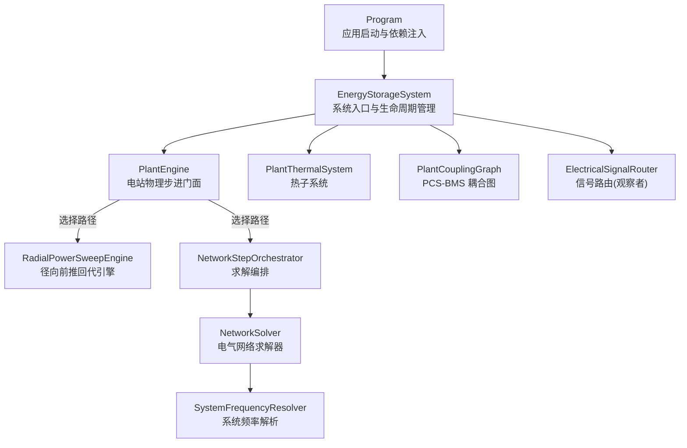
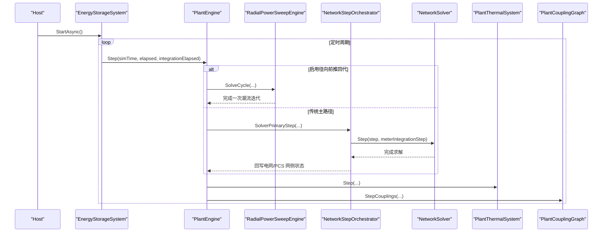
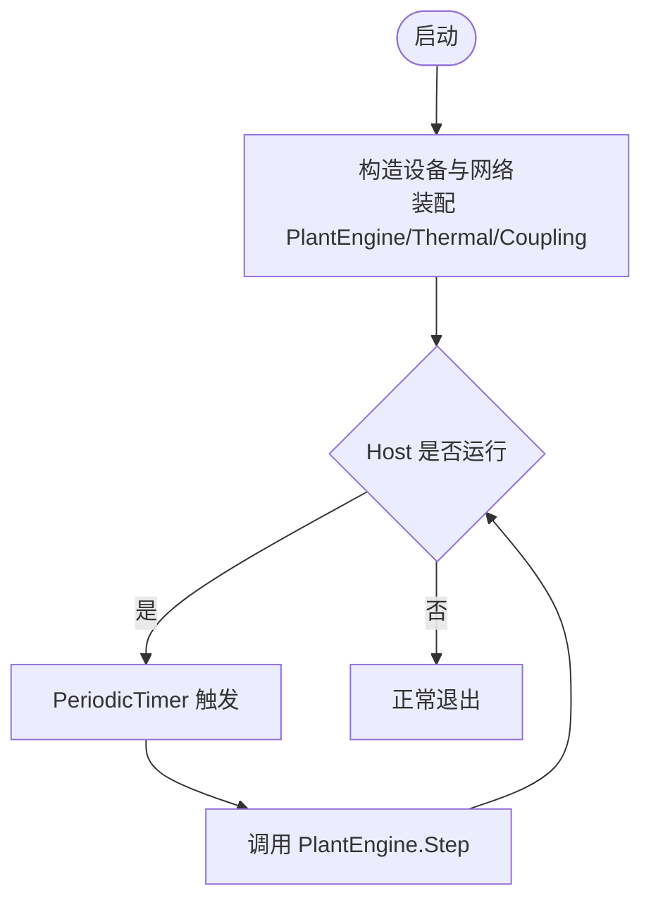
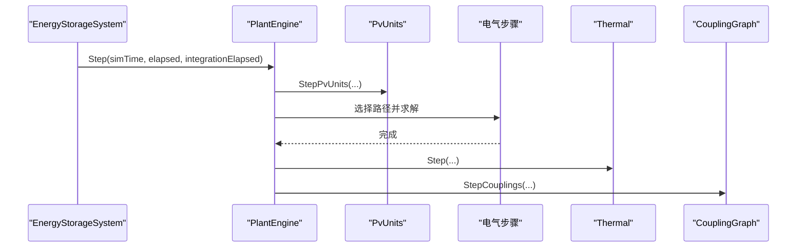
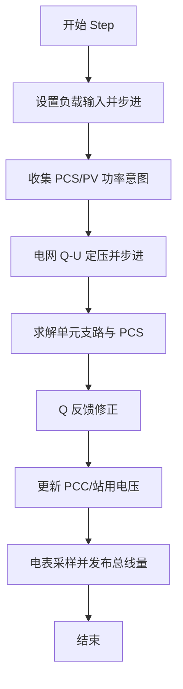
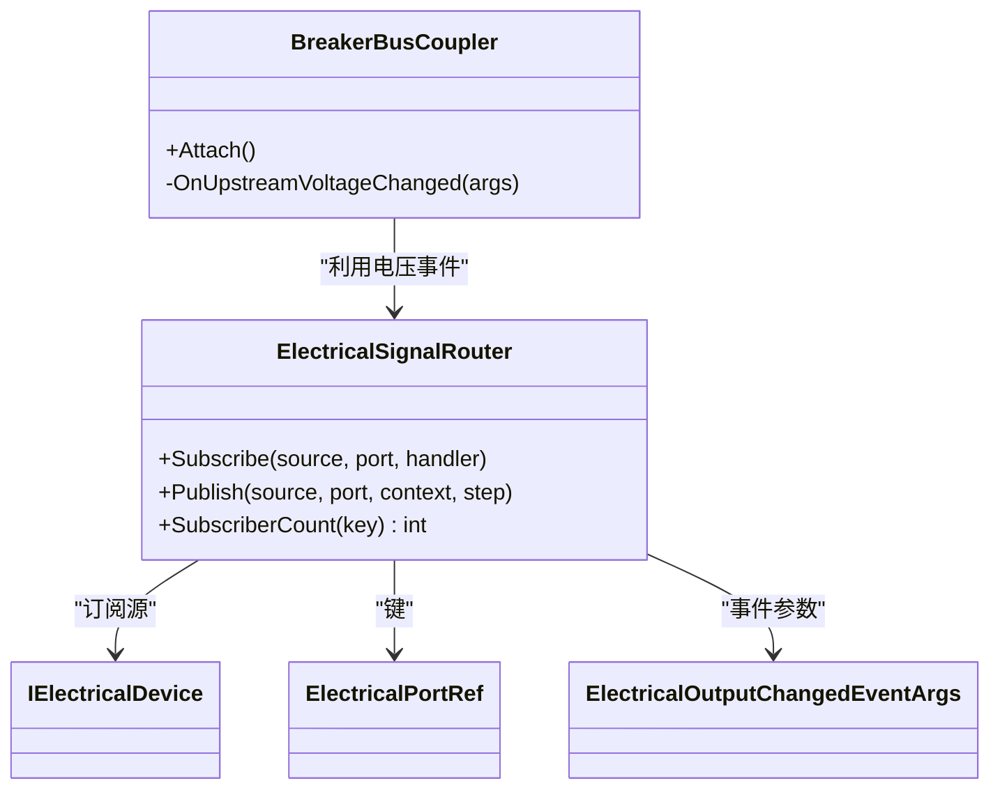
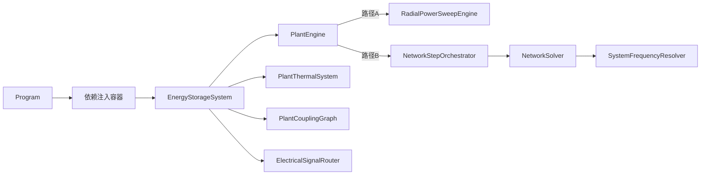
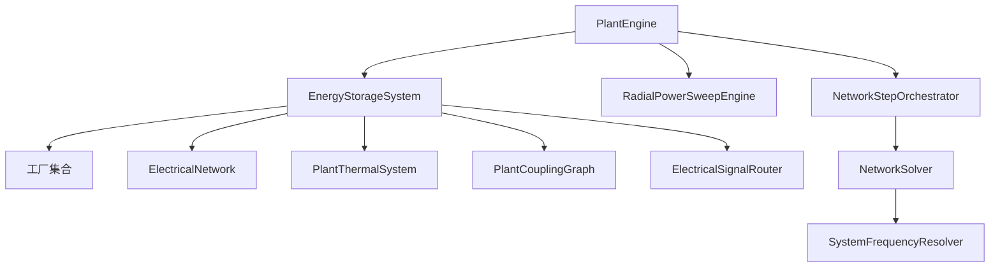

# 核心组件架构

<cite>
**本文引用的文件**
- [Program.cs](file://Program.cs)
- [EnergyStorageSystem.cs](file://EssDeviceSimModel/EnergyStorageSys.cs)
- [PlantEngine.cs](file://EssDeviceSimModel/PlantEngine.cs)
- [NetworkSolver.cs](file://EssDeviceSimModel/Solver/NetworkSolver.cs)
- [NetworkStepOrchestrator.cs](file://EssDeviceSimModel/Solver/NetworkStepOrchestrator.cs)
- [RadialPowerSweepEngine.cs](file://EssDeviceSimModel/Propagation/RadialPowerSweepEngine.cs)
- [ElectricalSignalRouter.cs](file://EssDeviceSimModel/Propagation/ElectricalSignalRouter.cs)
- [BreakerBusCoupler.cs](file://EssDeviceSimModel/Propagation/BreakerBusCoupler.cs)
- [SystemFrequencyResolver.cs](file://EssDeviceSimModel/Solver/SystemFrequencyResolver.cs)
- [INetworkSolver.cs](file://EssDeviceSimModel/Interface/INetworkSolver.cs)
</cite>

## 目录
1. [简介](#简介)
2. [项目结构](#项目结构)
3. [核心组件](#核心组件)
4. [架构总览](#架构总览)
5. [详细组件分析](#详细组件分析)
6. [依赖关系分析](#依赖关系分析)
7. [性能考虑](#性能考虑)
8. [故障排查指南](#故障排查指南)
9. [结论](#结论)

## 简介
本架构文档面向储能仿真系统的核心组件，围绕以下三个关键角色展开：
- EnergyStorageSystem：系统入口与生命周期管理者，负责设备初始化、耦合图构建、热网络与电气网络的装配，以及主循环调度。
- PlantEngine：电站物理步进门面，协调每步的电气潮流、热网络、PCS-BMS 耦合边与黑启动/断路器同步。
- NetworkSolver：电气网络求解器，执行潮流计算与故障相关状态更新（含 Q-U 反馈、频率解析、电表采样等）。

文档同时说明事件驱动架构、观察者模式与工厂模式在系统中的落地方式，并给出从初始化到运行再到销毁的完整生命周期流程，以及组件交互图和状态转换图。

## 项目结构
- 程序入口 Program 通过依赖注入注册 EnergyStorageSystem 为单例托管服务，并在应用启动后进入后台服务主循环。
- EnergyStorageSystem 构造时完成电池簇、BMS 机架、PCS、变压器、负载、断路器等设备的创建与装配；根据配置选择“径向前推回代”或“传统 Solver 主路径”。
- PlantEngine 对外仅暴露 Step，内部按固定顺序推进光伏出力、电气步骤、热网络、耦合边、单元变同步与黑启动上下文刷新。
- 电气求解存在两条路径：
  - 径向前推回代：RadialPowerSweepEngine 实现自下而上功率汇总、自上而下电压传播、Q-U/V 反馈迭代。
  - 传统主路径：NetworkStepOrchestrator 编排控制意图同步、NetworkSolver 求解、结果回写与断路器投影。

图表来源
- [Program.cs:408-424](file://Program.cs#L408-L424)
- [EnergyStorageSystem.cs:124-245](file://EssDeviceSimModel/EnergyStorageSys.cs#L124-L245)
- [PlantEngine.cs:22-48](file://EssDeviceSimModel/PlantEngine.cs#L22-L48)
- [RadialPowerSweepEngine.cs:54-75](file://EssDeviceSimModel/Propagation/RadialPowerSweepEngine.cs#L54-L75)
- [NetworkStepOrchestrator.cs:14-26](file://EssDeviceSimModel/Solver/NetworkStepOrchestrator.cs#L14-L26)
- [NetworkSolver.cs:27-107](file://EssDeviceSimModel/Solver/NetworkSolver.cs#L27-L107)
- [SystemFrequencyResolver.cs:41-43](file://EssDeviceSimModel/Solver/SystemFrequencyResolver.cs#L41-L43)
- [ElectricalSignalRouter.cs:15-58](file://EssDeviceSimModel/Propagation/ElectricalSignalRouter.cs#L15-L58)

章节来源
- [Program.cs:216-523](file://Program.cs#L216-L523)
- [EnergyStorageSystem.cs:124-245](file://EssDeviceSimModel/EnergyStorageSys.cs#L124-L245)

## 核心组件
- EnergyStorageSystem
  - 职责：设备工厂装配（BMS 机架、PCS、变压器、负载、断路器）、电气网络拓扑构建、热网络与耦合图初始化、主循环定时器驱动、PCC/站用电压广播、黑启动联锁校验、PCS 通道推送、BMS-PCS 链路同步。
  - 设计要点：使用工厂模式批量创建设备；通过配置开关选择“径向前推回代”或“Solver 主路径”；提供统一门面给 PlantEngine 调用。
- PlantEngine
  - 职责：每步推进顺序：光伏出力 → 电气步骤 → 热网络 → 耦合边 → 单元变同步 → 黑启动上下文刷新 → BMS 链接同步。
  - 设计要点：对外仅暴露 Step，屏蔽内部两种求解路径差异，降低 Host 复杂度。
- NetworkSolver
  - 职责：按 S1→S8 步骤完成负载意图、PCS/PV 功率收集、电网 Q-U、主变路径、单元支路求解、Q 反馈修正、电表采样、总线量发布。
  - 设计要点：严格分步、可观测、与 SystemFrequencyResolver 协作更新系统频率。

章节来源
- [EnergyStorageSystem.cs:124-245](file://EssDeviceSimModel/EnergyStorageSys.cs#L124-L245)
- [PlantEngine.cs:22-48](file://EssDeviceSimModel/PlantEngine.cs#L22-L48)
- [NetworkSolver.cs:27-107](file://EssDeviceSimModel/Solver/NetworkSolver.cs#L27-L107)

## 架构总览
系统采用“主机托管 + 后台服务”的事件驱动架构：
- Program 将 EnergyStorageSystem 注册为单例托管服务，Host 启动后周期性触发 ExecuteAsync。
- EnergyStorageSystem 内部维护 PeriodicTimer，以毫秒级间隔推进仿真时钟并调用 PlantEngine.Step。
- PlantEngine 作为导演，决定走“径向前推回代”还是“Solver 主路径”，并串联热网络与耦合边。
- 电气求解过程中，通过 ElectricalSignalRouter 实现端口输出变化时的下游通知（观察者模式），并通过 BreakerBusCoupler 订阅上游母线电压变化，驱动断路器与下游母线电压更新。

图表来源
- [Program.cs:408-424](file://Program.cs#L408-L424)
- [EnergyStorageSystem.cs:473-496](file://EssDeviceSimModel/EnergyStorageSys.cs#L473-L496)
- [PlantEngine.cs:22-48](file://EssDeviceSimModel/PlantEngine.cs#L22-L48)
- [RadialPowerSweepEngine.cs:54-75](file://EssDeviceSimModel/Propagation/RadialPowerSweepEngine.cs#L54-L75)
- [NetworkStepOrchestrator.cs:14-26](file://EssDeviceSimModel/Solver/NetworkStepOrchestrator.cs#L14-L26)
- [NetworkSolver.cs:27-107](file://EssDeviceSimModel/Solver/NetworkSolver.cs#L27-L107)

## 详细组件分析

### EnergyStorageSystem：系统入口与生命周期管理
- 初始化阶段
  - 依据 SimulatorConfig 与各类物理配置，使用工厂创建 BMS 机架、PCS、变压器、负载、断路器。
  - 构建 ElectricalNetwork（拓扑），并根据配置决定是否启用径向前推回代引擎。
  - 初始化 PlantEngine、PlantThermalSystem、PlantCouplingGraph。
- 运行阶段
  - ExecuteAsync 中维护 PeriodicTimer，推进仿真时钟并调用 PlantEngine.Step。
  - 提供 PCC/站用电压广播、断路器合分、负载特性设定、PCS 黑启动开关、BMS-PCS 链路同步等运行时接口。
- 销毁阶段
  - Host 停止时取消令牌触发 ExecuteAsync 退出，释放资源。

图表来源
- [EnergyStorageSystem.cs:124-245](file://EssDeviceSimModel/EnergyStorageSys.cs#L124-L245)
- [EnergyStorageSystem.cs:473-496](file://EssDeviceSimModel/EnergyStorageSys.cs#L473-L496)

章节来源
- [EnergyStorageSystem.cs:124-245](file://EssDeviceSimModel/EnergyStorageSys.cs#L124-L245)
- [EnergyStorageSystem.cs:473-496](file://EssDeviceSimModel/EnergyStorageSys.cs#L473-L496)

### PlantEngine：仿真调度器
- 每步顺序：
  - 更新光伏出力（温度/入射角 → MPPT 功率 → 35kV 母线贡献）
  - 执行电气步骤（径向前推回代或传统主路径）
  - 推进热网络
  - 执行 PCS-BMS 耦合边
  - 同步单元变与黑启动上下文
  - 同步 BMS 链接至电气网络
- 设计优势：Host 只关心 Step，不感知内部求解细节，便于扩展与维护。

图表来源
- [PlantEngine.cs:22-48](file://EssDeviceSimModel/PlantEngine.cs#L22-L48)
- [EnergyStorageSystem.cs:256-274](file://EssDeviceSimModel/EnergyStorageSys.cs#L256-L274)

章节来源
- [PlantEngine.cs:22-48](file://EssDeviceSimModel/PlantEngine.cs#L22-L48)

### NetworkSolver：电气网络求解器
- 求解步骤（简化）：
  - S1：设置负载输入并步进，收集 PCS/PV 功率意图
  - S2：电网 Q-U 定压，步进主变路径
  - S3/S4：求解单元支路与 PCS
  - S6：Q 反馈修正（一次迭代）
  - S8：电表采样并发布总线量
- 与 SystemFrequencyResolver 协作更新系统频率，确保 PCS 跟网/构网逻辑正确。

图表来源
- [NetworkSolver.cs:27-107](file://EssDeviceSimModel/Solver/NetworkSolver.cs#L27-L107)
- [SystemFrequencyResolver.cs:41-43](file://EssDeviceSimModel/Solver/SystemFrequencyResolver.cs#L41-L43)

章节来源
- [NetworkSolver.cs:27-107](file://EssDeviceSimModel/Solver/NetworkSolver.cs#L27-L107)
- [SystemFrequencyResolver.cs:12-43](file://EssDeviceSimModel/Solver/SystemFrequencyResolver.cs#L12-L43)

### 事件驱动与观察者模式
- ElectricalSignalRouter：基于端口键值注册订阅者，当上游设备端口输出变化时，Publish 通知所有已注册的下游处理器。
- BreakerBusCoupler：订阅上游母线电压变化，将上游电压与下游电流意图写入断路器端口，步进后更新下游母线电压。
- 该机制解耦了设备间的紧耦合依赖，使拓扑变化时无需修改设备内部逻辑。

图表来源
- [ElectricalSignalRouter.cs:15-58](file://EssDeviceSimModel/Propagation/ElectricalSignalRouter.cs#L15-L58)
- [BreakerBusCoupler.cs:29-51](file://EssDeviceSimModel/Propagation/BreakerBusCoupler.cs#L29-L51)

章节来源
- [ElectricalSignalRouter.cs:15-58](file://EssDeviceSimModel/Propagation/ElectricalSignalRouter.cs#L15-L58)
- [BreakerBusCoupler.cs:29-51](file://EssDeviceSimModel/Propagation/BreakerBusCoupler.cs#L29-L51)

### 工厂模式的应用
- EnergyStorageSystem 构造中使用多个工厂：
  - BmsRackFactory.CreateRack：创建电池机架
  - PcsDeviceFactory.Create：创建 PCS 设备
  - TransformerDeviceFactory.Create：创建主变与单元变
  - LoadDeviceFactory.Create：创建负载设备
  - PvUnitDevice.FromRuntime：创建光伏单元
- 工厂模式将设备创建细节封装，便于配置化与测试替换。

章节来源
- [EnergyStorageSystem.cs:133-193](file://EssDeviceSimModel/EnergyStorageSys.cs#L133-L193)

### 组件交互图（代码级）

图表来源
- [Program.cs:408-424](file://Program.cs#L408-L424)
- [EnergyStorageSystem.cs:124-245](file://EssDeviceSimModel/EnergyStorageSys.cs#L124-L245)
- [PlantEngine.cs:22-48](file://EssDeviceSimModel/PlantEngine.cs#L22-L48)
- [NetworkStepOrchestrator.cs:14-26](file://EssDeviceSimModel/Solver/NetworkStepOrchestrator.cs#L14-L26)
- [NetworkSolver.cs:27-107](file://EssDeviceSimModel/Solver/NetworkSolver.cs#L27-L107)
- [RadialPowerSweepEngine.cs:54-75](file://EssDeviceSimModel/Propagation/RadialPowerSweepEngine.cs#L54-L75)
- [SystemFrequencyResolver.cs:41-43](file://EssDeviceSimModel/Solver/SystemFrequencyResolver.cs#L41-L43)
- [ElectricalSignalRouter.cs:15-58](file://EssDeviceSimModel/Propagation/ElectricalSignalRouter.cs#L15-L58)

## 依赖关系分析
- 松耦合点
  - PlantEngine 对求解路径的选择隐藏于内部，Host 无需感知。
  - ElectricalSignalRouter 将设备间通信抽象为端口事件，降低耦合。
- 直接依赖
  - EnergyStorageSystem 依赖各工厂与配置项，集中装配。
  - NetworkStepOrchestrator 依赖 NetworkSolver 与 NetworkControlBridge（后者由其他模块提供）。
  - RadialPowerSweepEngine 依赖 RadialNetworkGraph 与 ISelfActivatingElectricalSource。
- 潜在循环依赖
  - 当前结构中未见显式循环引用；设备通过端口快照与事件进行数据交换。

图表来源
- [EnergyStorageSystem.cs:124-245](file://EssDeviceSimModel/EnergyStorageSys.cs#L124-L245)
- [PlantEngine.cs:22-48](file://EssDeviceSimModel/PlantEngine.cs#L22-L48)
- [NetworkStepOrchestrator.cs:14-26](file://EssDeviceSimModel/Solver/NetworkStepOrchestrator.cs#L14-L26)
- [NetworkSolver.cs:27-107](file://EssDeviceSimModel/Solver/NetworkSolver.cs#L27-L107)
- [RadialPowerSweepEngine.cs:54-75](file://EssDeviceSimModel/Propagation/RadialPowerSweepEngine.cs#L54-L75)
- [SystemFrequencyResolver.cs:41-43](file://EssDeviceSimModel/Solver/SystemFrequencyResolver.cs#L41-L43)
- [ElectricalSignalRouter.cs:15-58](file://EssDeviceSimModel/Propagation/ElectricalSignalRouter.cs#L15-L58)

章节来源
- [EnergyStorageSystem.cs:124-245](file://EssDeviceSimModel/EnergyStorageSys.cs#L124-L245)
- [PlantEngine.cs:22-48](file://EssDeviceSimModel/PlantEngine.cs#L22-L48)

## 性能考虑
- 求解路径选择
  - 径向前推回代适用于辐射状网络，具备自下而上汇总、自上而下传播的优势，适合大规模分支场景。
  - 传统主路径通过明确分步与 Q 反馈修正，保证收敛性与可观测性。
- 迭代次数与容差
  - 径向前推回代支持 Q-U/V 多轮迭代，可通过配置调整最大迭代次数与电压容差，平衡精度与性能。
- 定时器粒度
  - 主循环以毫秒级定时器驱动，影响仿真实时性与 CPU 占用；可根据硬件能力调整 PropagationIntervalMs。
- 事件分发开销
  - ElectricalSignalRouter 使用字典+列表存储订阅者，注意避免过多细粒度事件导致分发开销上升。

[本节提供通用指导，不直接分析具体文件]

## 故障排查指南
- 主循环异常
  - ExecuteAsync 捕获 OperationCanceledException 视为正常停止；其他异常记录致命日志并重新抛出，使 Host 感知崩溃。
- 事件回调异常
  - ElectricalSignalRouter 在 Publish 中对每个订阅者 try/catch，记录错误但不中断整体流程。
- 频率解析失败
  - SystemFrequencyResolver 在主断断开且无构网 PCS 时会返回 0，需检查 PCS 构网状态与电压注入。
- 断路器状态不一致
  - NetworkStepOrchestrator 会将网络断路器状态投影到 Legacy 设备；若发现不一致，检查同步逻辑与断路器联锁。

章节来源
- [EnergyStorageSystem.cs:473-496](file://EssDeviceSimModel/EnergyStorageSys.cs#L473-L496)
- [ElectricalSignalRouter.cs:31-58](file://EssDeviceSimModel/Propagation/ElectricalSignalRouter.cs#L31-L58)
- [SystemFrequencyResolver.cs:12-43](file://EssDeviceSimModel/Solver/SystemFrequencyResolver.cs#L12-L43)
- [NetworkStepOrchestrator.cs:14-26](file://EssDeviceSimModel/Solver/NetworkStepOrchestrator.cs#L14-L26)

## 结论
本架构以 EnergyStorageSystem 为入口，PlantEngine 为调度器，NetworkSolver 为求解核心，结合事件驱动的观察者模式与工厂模式，实现了高内聚、低耦合的储能仿真系统。通过径向前推回代与传统主路径的双轨求解，系统兼顾了不同拓扑下的性能与稳定性。生命周期管理清晰，从初始化到运行再到销毁均有明确边界，便于扩展与维护。