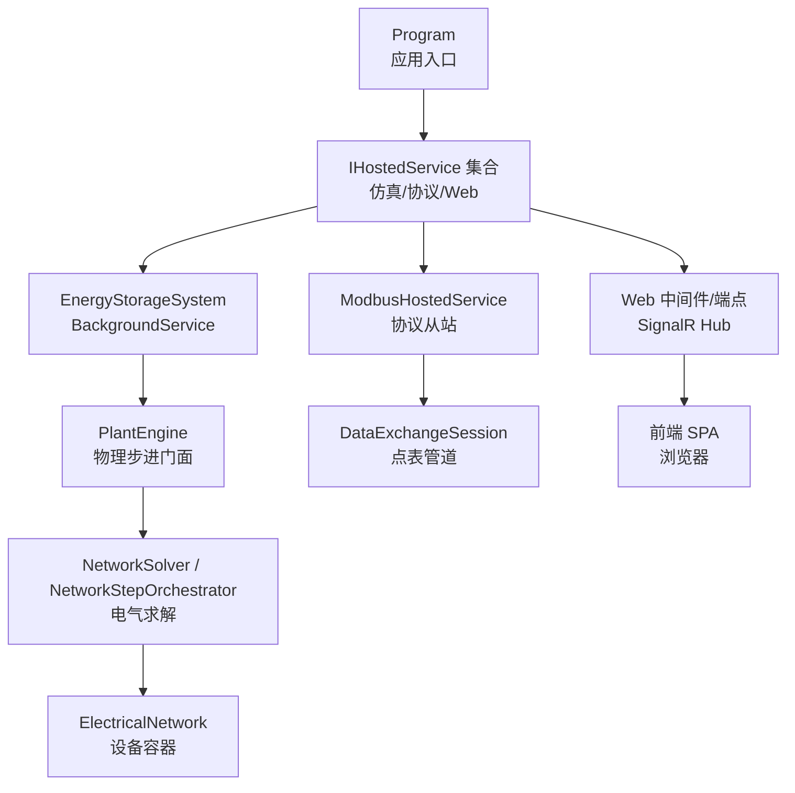
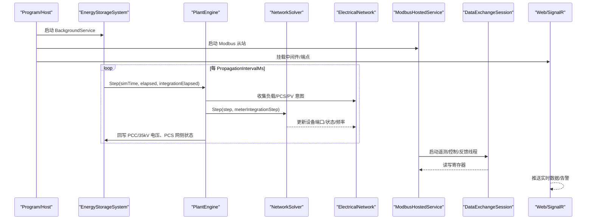
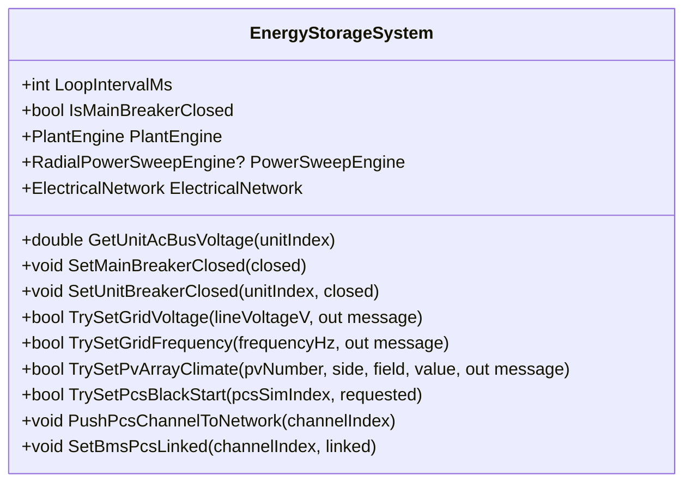
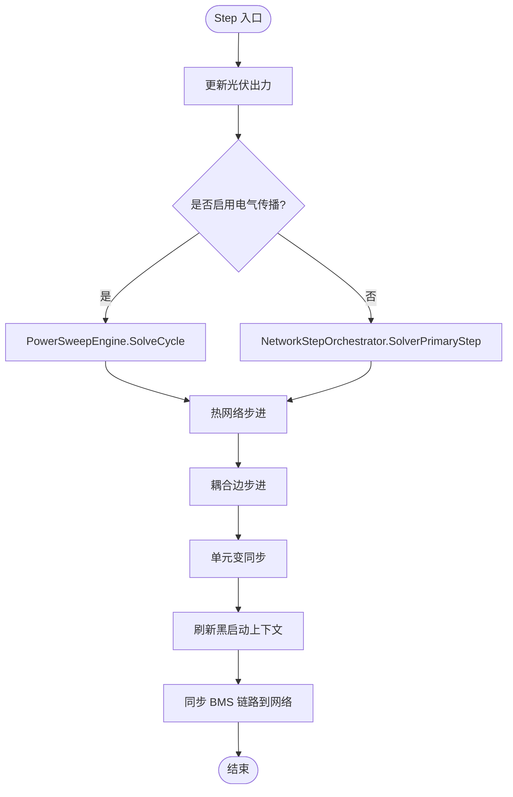
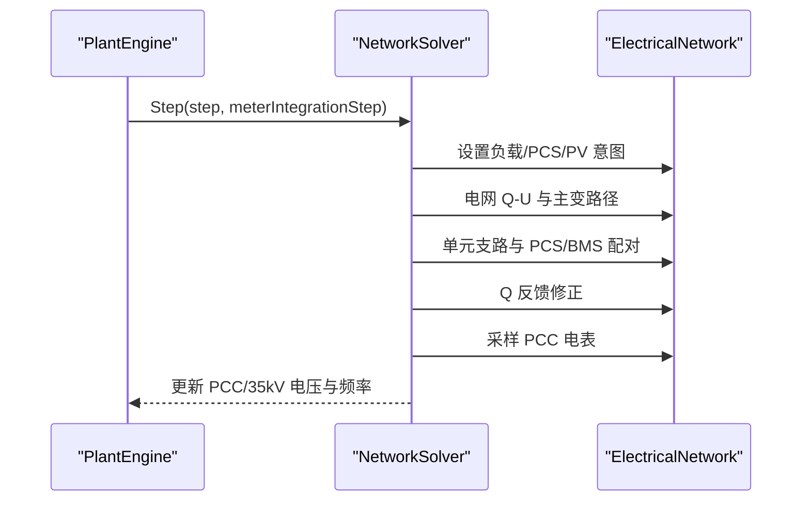
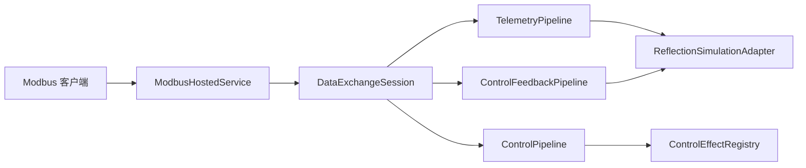
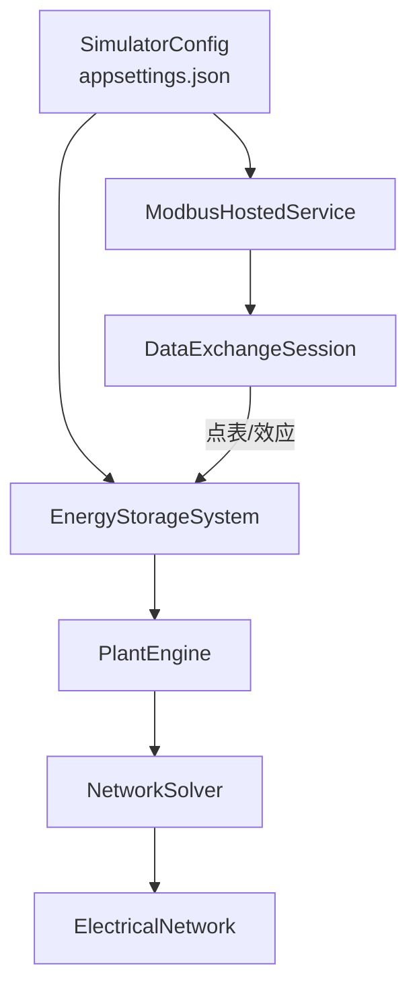

# 系统架构

<cite>
**本文引用的文件**
- [Program.cs](file://Program.cs)
- [EssSimulator.csproj](file://EssSimulator.csproj)
- [appsettings.json](file://appsettings.json)
- [Core/SimulatorHost.cs](file://Core/SimulatorHost.cs)
- [EssDeviceSimModel/PlantEngine.cs](file://EssDeviceSimModel/PlantEngine.cs)
- [EssDeviceSimModel/EnergyStorageSys.cs](file://EssDeviceSimModel/EnergyStorageSys.cs)
- [EssDeviceSimModel/Solver/NetworkSolver.cs](file://EssDeviceSimModel/Solver/NetworkSolver.cs)
- [EssDeviceSimModel/Solver/NetworkStepOrchestrator.cs](file://EssDeviceSimModel/Solver/NetworkStepOrchestrator.cs)
- [EssDeviceSimModel/Solver/ElectricalNetwork.cs](file://EssDeviceSimModel/Solver/ElectricalNetwork.cs)
- [Protocol/ModbusHostedService.cs](file://Protocol/ModbusHostedService.cs)
- [Web/RealtimeHub.cs](file://Web/RealtimeHub.cs)
- [Configuration/SimulatorConfig.cs](file://Configuration/SimulatorConfig.cs)
- [DataExchange/DataExchangeSession.cs](file://DataExchange/DataExchangeSession.cs)
</cite>

## 目录
1. [简介](#简介)
2. [项目结构](#项目结构)
3. [核心组件](#核心组件)
4. [架构总览](#架构总览)
5. [详细组件分析](#详细组件分析)
6. [依赖关系分析](#依赖关系分析)
7. [性能与约束](#性能与约束)
8. [故障排查指南](#故障排查指南)
9. [结论](#结论)
10. [附录：配置与数据流要点](#附录：配置与数据流要点)

## 简介
本系统为储能仿真平台，采用 B/S 架构与微服务化托管服务组织，提供“仿真引擎 + 设备模型 + 通信协议层 + Web 界面”的完整闭环。系统通过配置驱动（JSON）与点表映射（CSV）实现设备拓扑、控制策略与遥测/控制的解耦；通过插件化的控制效果注册机制扩展控制行为；通过事件驱动的电气传播或求解器步进推进仿真时钟，支撑 PCS/BMS/变压器/负载/光伏等设备的协同仿真。

## 项目结构
- 应用入口与宿主：Program.cs 负责配置加载、授权校验、服务注册、中间件与端点挂载，并启动多个 IHostedService。
- 仿真主机：Core/SimulatorHost.cs 提供全局对象注册表，供各服务发现彼此。
- 仿真引擎：EnergyStorageSystem 作为 BackgroundService 驱动主循环；PlantEngine 封装物理步进门面；NetworkSolver/NetworkStepOrchestrator 负责电气网络求解与结果回写。
- 设备模型：PCS/BMS/变压器/负载/电表/断路器/直流链路等位于 EssDeviceSimModel。
- 通信协议：Protocol/ModbusHostedService 统一创建并启动 Modbus TCP 从站；DataExchangeSession 基于点表构建遥测/控制/反馈管道。
- Web 层：Web/RealtimeHub 提供 SignalR 实时推送；前端静态资源由 ASP.NET Core 托管。
- 配置：appsettings.json 与 Configuration/SimulatorConfig.cs 绑定运行时参数、设备拓扑、协议端口、热模型等。

图表来源
- [Program.cs:258-522](file://Program.cs#L258-L522)
- [EssDeviceSimModel/EnergyStorageSys.cs:473-496](file://EssDeviceSimModel/EnergyStorageSys.cs#L473-L496)
- [EssDeviceSimModel/PlantEngine.cs:22-48](file://EssDeviceSimModel/PlantEngine.cs#L22-L48)
- [EssDeviceSimModel/Solver/NetworkSolver.cs:27-107](file://EssDeviceSimModel/Solver/NetworkSolver.cs#L27-L107)
- [Protocol/ModbusHostedService.cs:32-106](file://Protocol/ModbusHostedService.cs#L32-L106)
- [Web/RealtimeHub.cs:10-22](file://Web/RealtimeHub.cs#L10-L22)

章节来源
- [Program.cs:258-522](file://Program.cs#L258-L522)
- [EssSimulator.csproj:1-88](file://EssSimulator.csproj#L1-L88)

## 核心组件
- EnergyStorageSystem（能量存储系统）
  - 职责：装配设备（PCS/BMS/变压器/负载/电表）、构建电气网络、维护热子系统与耦合图、驱动仿真主循环（PeriodicTimer），对外暴露断路器/负载/电网电压频率设置等能力。
  - 关键交互：调用 PlantEngine.Step 推进仿真；根据配置选择径向前推回代或 Solver 主路径；将网络结果回写到 PCS/变压器状态。
- PlantEngine（电站引擎）
  - 职责：封装单步流程——先更新光伏出力，再执行电气步进（优先事件传播，否则走 Solver），随后推进热网络、耦合边、单元变同步与黑启动上下文刷新，最后同步 BMS 链路到网络。
- NetworkSolver（网络求解器）
  - 职责：按步骤完成负载意图、PCS/PV 功率汇总、电网 Q-U 与主变路径计算、单元支路与 PCS/BMS 配对求解、Q 反馈修正、PCC 电表采样与母线量发布。
- ElectricalNetwork（电气网络容器）
  - 职责：持有 Grid/Breaker/Transformer/Load/Meter/Pcs/Bms/DcLink 等设备实例与求解器引用，提供总线查询与系统频率等运行时状态。

章节来源
- [EssDeviceSimModel/EnergyStorageSys.cs:24-245](file://EssDeviceSimModel/EnergyStorageSys.cs#L24-L245)
- [EssDeviceSimModel/PlantEngine.cs:6-48](file://EssDeviceSimModel/PlantEngine.cs#L6-L48)
- [EssDeviceSimModel/Solver/NetworkSolver.cs:8-107](file://EssDeviceSimModel/Solver/NetworkSolver.cs#L8-L107)
- [EssDeviceSimModel/Solver/ElectricalNetwork.cs:7-34](file://EssDeviceSimModel/Solver/ElectricalNetwork.cs#L7-L34)

## 架构总览
系统采用分层与微服务化组合：
- 表现层：ASP.NET Core Web API + SignalR + 静态 SPA。
- 协议层：Modbus TCP 从站集群，承载 EMS/BMS/PCS/电表/光伏等外部设备接入。
- 数据交换层：点表驱动的遥测/控制/反馈管道，支持事件驱动与轮询两种模式。
- 仿真内核：EnergyStorageSystem + PlantEngine + NetworkSolver/Orchestrator + 设备模型库。
- 配置与分发：Program 注入 IOptions，PostConfigure 覆盖工程 overlay，Edition/License 控制功能边界。

图表来源
- [Program.cs:408-456](file://Program.cs#L408-L456)
- [EssDeviceSimModel/EnergyStorageSys.cs:473-496](file://EssDeviceSimModel/EnergyStorageSys.cs#L473-L496)
- [EssDeviceSimModel/PlantEngine.cs:22-48](file://EssDeviceSimModel/PlantEngine.cs#L22-L48)
- [EssDeviceSimModel/Solver/NetworkSolver.cs:27-107](file://EssDeviceSimModel/Solver/NetworkSolver.cs#L27-L107)
- [Protocol/ModbusHostedService.cs:32-106](file://Protocol/ModbusHostedService.cs#L32-L106)
- [DataExchange/DataExchangeSession.cs:238-290](file://DataExchange/DataExchangeSession.cs#L238-L290)
- [Web/RealtimeHub.cs:10-22](file://Web/RealtimeHub.cs#L10-L22)

## 详细组件分析

### EnergyStorageSystem（能量存储系统）
- 设计要点
  - 以 BackgroundService 形式运行，使用 PeriodicTimer 控制仿真节拍。
  - 根据配置启用径向前推回代（UseElectricalPropagation=true）或 Solver 主路径。
  - 构造 ElectricalNetwork 时注入 BMS 设备、PCS 设备、主变/单元变、负载、电表等。
  - 暴露断路器、负载特性、电网电压/频率、PCS 黑启动开关等运行时接口。
- 数据流
  - 每步读取系统频率与 PCC/35kV 电压，更新 PCS 网侧状态。
  - 将网络结果投影到 Legacy 设备（_pcsList/_unitTransformers/_mainTransformer）。
- 错误处理
  - ExecuteAsync 捕获 OperationCanceledException 正常退出；其他异常记录致命日志并抛出，使 Host 感知崩溃。

图表来源
- [EssDeviceSimModel/EnergyStorageSys.cs:24-245](file://EssDeviceSimModel/EnergyStorageSys.cs#L24-L245)
- [EssDeviceSimModel/EnergyStorageSys.cs:473-496](file://EssDeviceSimModel/EnergyStorageSys.cs#L473-L496)

章节来源
- [EssDeviceSimModel/EnergyStorageSys.cs:24-245](file://EssDeviceSimModel/EnergyStorageSys.cs#L24-L245)
- [EssDeviceSimModel/EnergyStorageSys.cs:473-496](file://EssDeviceSimModel/EnergyStorageSys.cs#L473-L496)

### PlantEngine（电站引擎）
- 设计要点
  - 单一入口 Step(simTime, elapsed, integrationElapsed)，屏蔽内部复杂顺序。
  - 优先使用径向前推回代（PowerSweepEngine.SolveCycle），否则走 NetworkStepOrchestrator.SolverPrimaryStep。
  - 完成后推进热网络、耦合边、单元变同步与黑启动上下文刷新，并同步 BMS 链路到网络。
- 数据流
  - 光伏出力 → 电气步进 → 热网络 → 耦合边 → 单元变同步 → 黑启动上下文刷新 → BMS 链路同步。

图表来源
- [EssDeviceSimModel/PlantEngine.cs:22-48](file://EssDeviceSimModel/PlantEngine.cs#L22-L48)

章节来源
- [EssDeviceSimModel/PlantEngine.cs:6-48](file://EssDeviceSimModel/PlantEngine.cs#L6-L48)

### NetworkSolver（网络求解器）
- 设计要点
  - 每步完成：负载意图、PCS/PV 功率汇总、电网 Q-U 与主变路径、单元支路求解、PCS/BMS 配对迭代、Q 反馈修正、PCC 电表采样、母线量发布。
  - 通过 SystemFrequencyResolver 刷新系统频率，保证 PCS/电表一致性。
- 数据流
  - 输入：Step(step, meterIntegrationStep)
  - 输出：更新 PccLineVoltageV、StationBus35LineVoltageV、设备端口快照、系统频率。

图表来源
- [EssDeviceSimModel/Solver/NetworkSolver.cs:27-107](file://EssDeviceSimModel/Solver/NetworkSolver.cs#L27-L107)
- [EssDeviceSimModel/Solver/NetworkStepOrchestrator.cs:14-43](file://EssDeviceSimModel/Solver/NetworkStepOrchestrator.cs#L14-L43)

章节来源
- [EssDeviceSimModel/Solver/NetworkSolver.cs:8-363](file://EssDeviceSimModel/Solver/NetworkSolver.cs#L8-L363)
- [EssDeviceSimModel/Solver/NetworkStepOrchestrator.cs:1-139](file://EssDeviceSimModel/Solver/NetworkStepOrchestrator.cs#L1-L139)

### 通信协议层与数据交换
- ModbusHostedService
  - 统一创建并启动 BMS/EMU/光伏 Logger/电表等 Modbus TCP 从站，注册到 SimulatorHost 供就绪检测。
  - 依据 SimulatorConfig.Protocol 分配端口与步长，支持 LocalControl 聚合。
- DataExchangeSession
  - 基于 PointCatalog（CSV 点表）构建 Telemetry/Control/Feedback 三管道。
  - 支持事件驱动控制（ExternalControlWrite）与轮询控制，自动触发 ControlEffect 副作用（如 PCS 启停、BMS 链接）。
  - 管理 ShadowStore 避免重复写入，支持簇级控制点与默认值初始化。

图表来源
- [Protocol/ModbusHostedService.cs:32-106](file://Protocol/ModbusHostedService.cs#L32-L106)
- [DataExchange/DataExchangeSession.cs:14-107](file://DataExchange/DataExchangeSession.cs#L14-L107)
- [DataExchange/DataExchangeSession.cs:238-290](file://DataExchange/DataExchangeSession.cs#L238-L290)

章节来源
- [Protocol/ModbusHostedService.cs:1-120](file://Protocol/ModbusHostedService.cs#L1-L120)
- [DataExchange/DataExchangeSession.cs:1-506](file://DataExchange/DataExchangeSession.cs#L1-L506)

### Web 界面与实时推送
- RealtimeHub
  - 提供频道分组订阅（mainline/battery/cells/connections/logs/alert/cmdprogress）。
  - 连接时推送初始告警快照，后端通过 IHubContext<RealtimeHub> 主动推送。
- Program 中间件
  - 挂载 CORS、ApiKeyAuthMiddleware、静态文件、SignalR Hub、API 端点与 SPA 回退。

章节来源
- [Web/RealtimeHub.cs:1-59](file://Web/RealtimeHub.cs#L1-L59)
- [Program.cs:483-513](file://Program.cs#L483-L513)

## 依赖关系分析
- 配置驱动
  - appsettings.json 与 Configuration/SimulatorConfig.cs 绑定运行时、协议、设备、热模型、PCC/变压器/负载等。
  - Program 中 PostConfigure 支持工程 overlay 覆盖 EssUnits/Pcc/Transformer/Load 等。
- 服务依赖
  - EnergyStorageSystem 依赖 SimulatorConfig、PcsPhysicalConfig、TransformerConfig、UnitTransformerConfig、LoadConfig、PccConfig、MeterConfig。
  - PlantEngine 依赖 EnergyStorageSystem。
  - NetworkSolver 依赖 ElectricalNetwork、PccConfig、PcsPhysicalConfig。
  - ModbusHostedService 依赖 SimulatorConfig、DataExchangeOptions。
  - DataExchangeSession 依赖 Modbus 从站、点表、模拟适配器与控制效果注册表。
- 耦合与内聚
  - 仿真内核与协议层通过 DataExchangeSession 解耦；Web 层通过 SignalR 与后端解耦；配置集中管理，便于多档位与工程切换。

图表来源
- [Configuration/SimulatorConfig.cs:272-344](file://Configuration/SimulatorConfig.cs#L272-L344)
- [Program.cs:291-378](file://Program.cs#L291-L378)
- [EssDeviceSimModel/EnergyStorageSys.cs:124-245](file://EssDeviceSimModel/EnergyStorageSys.cs#L124-L245)
- [EssDeviceSimModel/PlantEngine.cs:12-48](file://EssDeviceSimModel/PlantEngine.cs#L12-L48)
- [EssDeviceSimModel/Solver/NetworkSolver.cs:15-25](file://EssDeviceSimModel/Solver/NetworkSolver.cs#L15-L25)
- [Protocol/ModbusHostedService.cs:24-30](file://Protocol/ModbusHostedService.cs#L24-L30)
- [DataExchange/DataExchangeSession.cs:42-107](file://DataExchange/DataExchangeSession.cs#L42-L107)

章节来源
- [appsettings.json:1-472](file://appsettings.json#L1-L472)
- [Configuration/SimulatorConfig.cs:1-479](file://Configuration/SimulatorConfig.cs#L1-L479)
- [Program.cs:291-378](file://Program.cs#L291-L378)

## 性能与约束
- 仿真节拍
  - 通过 Runtime.PropagationIntervalMs 控制主循环间隔；IntegrationStepMultiplier 仅放大积分量 dt，不改变瞬时动力学。
  - UseElectricalPropagation=true 时使用径向前推回代，减少迭代成本；PropagationQuvMaxIterations 与 PropagationVoltageTolerancePu 控制收敛。
- 通信吞吐
  - DataExchangeOptions.TelemetryIntervalMs/EmuTelemetryIntervalMs/ControlPollIntervalMs 控制遥测与控制轮询频率；事件驱动控制可降低延迟。
- 并发与隔离
  - DataExchangeSession 为每个 Modbus 从站独立线程；HostedService 异步启动，避免阻塞。
- 约束条件
  - 社区版可裁剪单元数（LockTopology/MaxEssUnits）；商业版/定制版需 license.txt；Edition 控制功能开关（如 DroopSlice/Mainline3D/TopologyEditor）。
  - 端口冲突需调整 Protocol.Base*Port 与 PortStep。

[本节为通用指导，无需具体文件来源]

## 故障排查指南
- 启动失败
  - 检查授权：若 Required=true 且未找到 license.txt，程序会退出并提示机器码与获取步骤。
  - 检查端口占用：确认 Modbus 端口未被占用；查看日志中的端口分配信息。
- 仿真未就绪
  - Program 在启动后等待模拟器就绪（超时 60s），若 dpc 初始读取异常，稍后重试。
- 控制无效
  - 检查 DataExchangeSession 的事件驱动与轮询配置；确认点表 CSV 可用；观察 ControlEffect 是否被触发。
- 电压/频率异常
  - 检查 PccConfig 与 TransformerConfig；确认主断/单元断状态；查看 NetworkSolver 的频率刷新与 Q-U 反馈。

章节来源
- [Program.cs:141-178](file://Program.cs#L141-L178)
- [Program.cs:112-139](file://Program.cs#L112-L139)
- [Protocol/ModbusHostedService.cs:98-103](file://Protocol/ModbusHostedService.cs#L98-L103)
- [DataExchange/DataExchangeSession.cs:238-290](file://DataExchange/DataExchangeSession.cs#L238-L290)
- [EssDeviceSimModel/Solver/NetworkSolver.cs:44-76](file://EssDeviceSimModel/Solver/NetworkSolver.cs#L44-L76)

## 结论
本系统以配置驱动与点表映射为核心，结合微服务化托管服务，实现了储能仿真的可扩展、可配置与高内聚低耦合架构。EnergyStorageSystem、PlantEngine、NetworkSolver 三者协作完成“意图采集—求解—回写”的闭环；协议层通过 DataExchangeSession 将外部设备与仿真内核解耦；Web 层通过 SignalR 提供实时可视化。技术决策上，事件驱动电气传播与 Solver 主路径并存，兼顾性能与稳定性；Edition/License 机制保障产品分档与交付边界。

[本节为总结性内容，无需具体文件来源]

## 附录：配置与数据流要点
- 关键配置项
  - Simulator.Runtime.*：集成步长倍数、无头模式、自动启动 PCS、传播周期、Q-V 收敛阈值、热模型开关等。
  - Simulator.Protocol.*：BMS/EMU/LocalControl/光伏 Logger/电表的基础端口与步长。
  - Pcc/Transformer/UnitTransformer/Load/Pcs：电网短路容量、变压器参数、负载计划、PCS 物理参数与黑启动策略。
- 数据流要点
  - 遥测：设备状态 → ReflectionSimulationAdapter → TelemetryPipeline → Modbus 寄存器。
  - 控制：外部写寄存器 → ControlPipeline → ControlEffect → 仿真模型 → 反馈回写。
  - 电气：负载/PCS/PV 意图 → 电网 Q-U → 主变/单元变 → PCS/BMS 配对 → 频率刷新 → 电表采样。

章节来源
- [appsettings.json:1-472](file://appsettings.json#L1-L472)
- [Configuration/SimulatorConfig.cs:6-36](file://Configuration/SimulatorConfig.cs#L6-L36)
- [Configuration/SimulatorConfig.cs:149-189](file://Configuration/SimulatorConfig.cs#L149-L189)
- [Configuration/SimulatorConfig.cs:347-401](file://Configuration/SimulatorConfig.cs#L347-L401)
- [Configuration/SimulatorConfig.cs:403-477](file://Configuration/SimulatorConfig.cs#L403-L477)
- [DataExchange/DataExchangeSession.cs:42-107](file://DataExchange/DataExchangeSession.cs#L42-L107)
- [EssDeviceSimModel/Solver/NetworkSolver.cs:27-107](file://EssDeviceSimModel/Solver/NetworkSolver.cs#L27-L107)