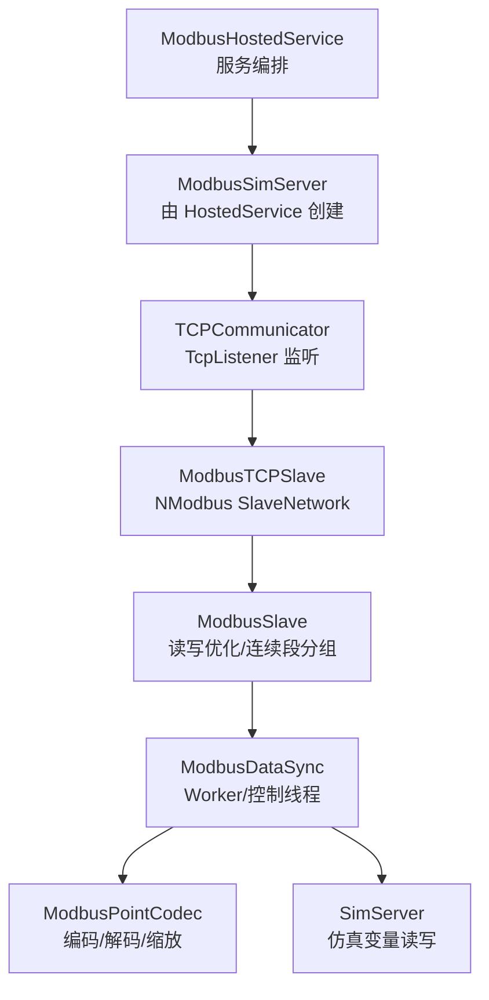
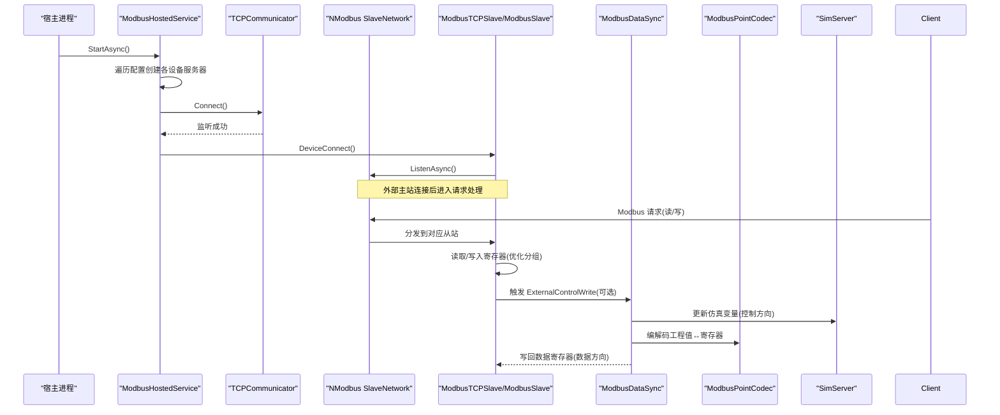
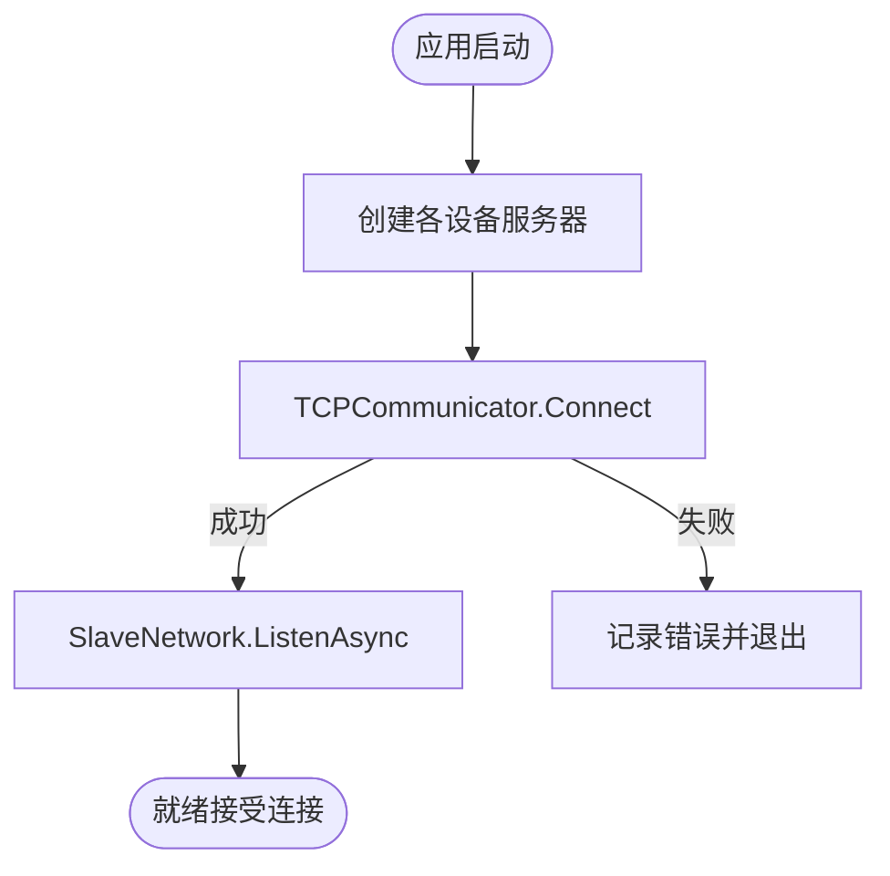
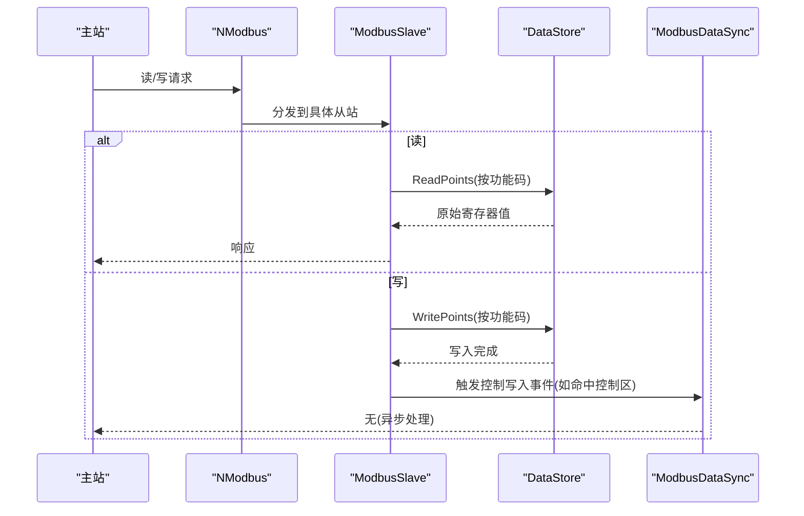
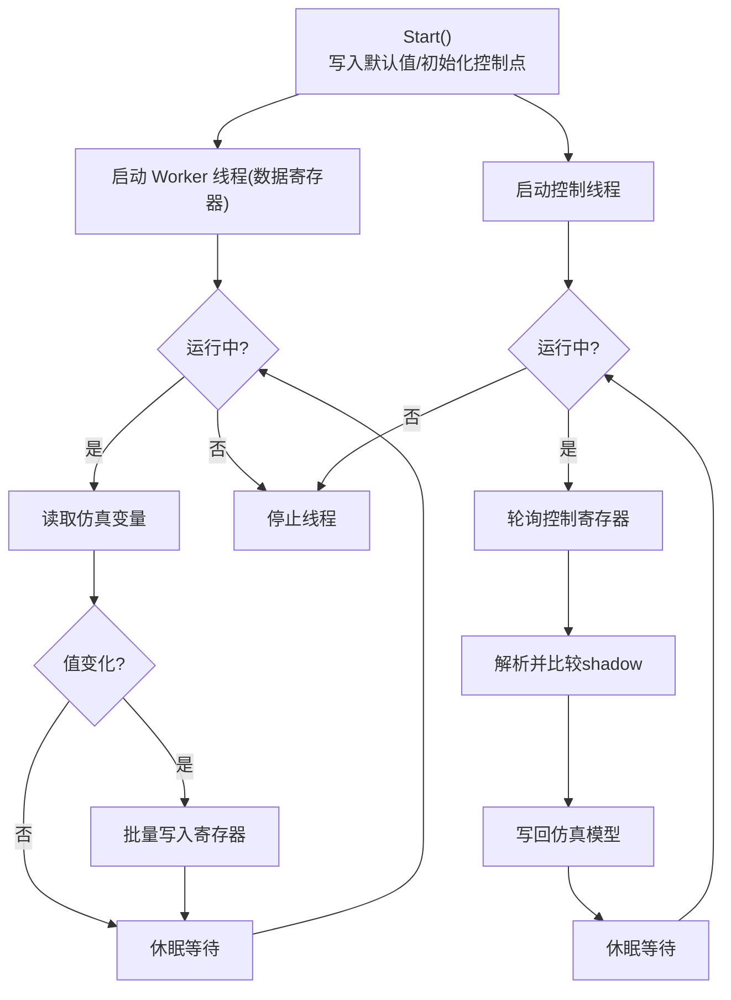
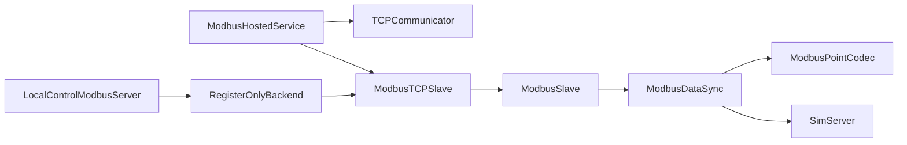

# Modbus协议实现

<cite>
**本文引用的文件**
- [ModbusHostedService.cs](file://Protocol/ModbusHostedService.cs)
- [SimServer.cs](file://Protocol/SimServer.cs)
- [TCPCommunicator.cs](file://TCPCommunicator.cs)
- [ModbusTCPSlave.cs](file://Protocol/ModbusTCPSlave.cs)
- [ModbusSlave.cs](file://Protocol/ModbusSlave.cs)
- [IModbusRegisterServer.cs](file://Protocol/IModbusRegisterServer.cs)
- [LocalControlModbusServer.cs](file://LocalControl/LocalControlModbusServer.cs)
- [RegisterOnlyBackend.cs](file://LocalControl/RegisterOnlyBackend.cs)
- [ModbusDataSync.cs](file://Protocol/Modbus/ModbusDataSync.cs)
- [ModbusPointCodec.cs](file://Protocol/Modbus/ModbusPointCodec.cs)
- [IModbusSyncBackend.cs](file://Protocol/Modbus/IModbusSyncBackend.cs)
- [ModBusParser.cs](file://Protocol/ModBusParser.cs)
</cite>

## 目录
1. [简介](#简介)
2. [项目结构](#项目结构)
3. [核心组件](#核心组件)
4. [架构总览](#架构总览)
5. [详细组件分析](#详细组件分析)
6. [依赖关系分析](#依赖关系分析)
7. [性能考虑](#性能考虑)
8. [故障排查指南](#故障排查指南)
9. [结论](#结论)
10. [附录：API与配置说明](#附录api与配置说明)

## 简介
本文件面向储能仿真系统中的 Modbus 协议实现，系统性阐述 Modbus TCP 服务器启动、客户端连接管理、请求处理流程；从站寄存器读写、数据同步机制与错误处理策略；协议帧解析、功能码支持、地址映射规则与数据类型转换；并提供完整的 API 接口说明（配置参数、事件回调、状态监控）以及集成示例与常见问题调试方案。

## 项目结构
系统围绕“服务编排—TCP监听—从站实例—数据同步—编解码”分层组织：
- 服务编排：通过托管服务统一创建并启动多个 Modbus TCP 从站实例（BMS、PCS/EMU、光伏日志/电表等）。
- TCP 监听：基于 TcpListener 暴露端口，交由 NModbus 网络层处理。
- 从站实例：封装点表、地址索引、控制写入钩子、读写优化分组。
- 数据同步：后台线程按模型类型批量写数据寄存器，轮询控制寄存器变化回写仿真模型。
- 编解码：依据点表 CSV 的 Type/Size/Scale 进行工程值与寄存器字节序转换。

图表来源
- [ModbusHostedService.cs:32-106](file://Protocol/ModbusHostedService.cs#L32-L106)
- [TCPCommunicator.cs:22-35](file://TCPCommunicator.cs#L22-L35)
- [ModbusTCPSlave.cs:21-44](file://Protocol/ModbusTCPSlave.cs#L21-L44)
- [ModbusSlave.cs:59-96](file://Protocol/ModbusSlave.cs#L59-L96)
- [ModbusDataSync.cs:71-99](file://Protocol/Modbus/ModbusDataSync.cs#L71-L99)
- [ModbusPointCodec.cs:61-84](file://Protocol/Modbus/ModbusPointCodec.cs#L61-L84)
- [SimServer.cs:25-49](file://Protocol/SimServer.cs#L25-L49)

章节来源
- [ModbusHostedService.cs:32-106](file://Protocol/ModbusHostedService.cs#L32-L106)
- [TCPCommunicator.cs:22-35](file://TCPCommunicator.cs#L22-L35)
- [ModbusTCPSlave.cs:21-44](file://Protocol/ModbusTCPSlave.cs#L21-L44)
- [ModbusSlave.cs:59-96](file://Protocol/ModbusSlave.cs#L59-L96)
- [ModbusDataSync.cs:71-99](file://Protocol/Modbus/ModbusDataSync.cs#L71-L99)
- [ModbusPointCodec.cs:61-84](file://Protocol/Modbus/ModbusPointCodec.cs#L61-L84)
- [SimServer.cs:25-49](file://Protocol/SimServer.cs#L25-L49)

## 核心组件
- ModbusHostedService：在应用启动时异步创建并启动所有 Modbus TCP 从站（BMS/PCS/光伏/电表），注册到主机并记录监听信息。
- TCPCommunicator：基于 TcpListener 绑定 IP:Port，提供连接/断开与状态查询。
- ModbusTCPSlave：继承自 ModbusSlave，使用 NModbus 创建 SlaveNetwork，注册主从站及机架从站，监听外部控制写入事件。
- ModbusSlave：实现寄存器读写优化（连续地址段分组）、线圈与寄存器读写、抑制内部写通知避免循环触发。
- ModbusDataSync：数据同步后端，维护 Worker 线程（定时写数据寄存器）与控制线程（轮询控制寄存器变化并回写仿真模型），支持簇级（rack）多从站。
- ModbusPointCodec：根据点表 Type/Size/Scale 完成工程值与寄存器字节序的编解码，支持 CDAB 字交换等。
- LocalControlModbusServer / RegisterOnlyBackend：轻量本地控制服务器，仅维护寄存器镜像与默认值，不绑定仿真模型。
- IModbusRegisterServer / IModbusSyncBackend：对外抽象接口，屏蔽底层实现差异。

章节来源
- [ModbusHostedService.cs:32-106](file://Protocol/ModbusHostedService.cs#L32-L106)
- [TCPCommunicator.cs:22-35](file://TCPCommunicator.cs#L22-L35)
- [ModbusTCPSlave.cs:21-44](file://Protocol/ModbusTCPSlave.cs#L21-L44)
- [ModbusSlave.cs:59-96](file://Protocol/ModbusSlave.cs#L59-L96)
- [ModbusDataSync.cs:71-99](file://Protocol/Modbus/ModbusDataSync.cs#L71-L99)
- [ModbusPointCodec.cs:61-84](file://Protocol/Modbus/ModbusPointCodec.cs#L61-L84)
- [LocalControlModbusServer.cs:18-35](file://LocalControl/LocalControlModbusServer.cs#L18-L35)
- [RegisterOnlyBackend.cs:14-23](file://LocalControl/RegisterOnlyBackend.cs#L14-L23)
- [IModbusRegisterServer.cs:6-17](file://Protocol/IModbusRegisterServer.cs#L6-L17)
- [IModbusSyncBackend.cs:4-14](file://Protocol/Modbus/IModbusSyncBackend.cs#L4-L14)

## 架构总览
下图展示从应用启动到 Modbus 请求处理的完整链路：

图表来源
- [ModbusHostedService.cs:32-106](file://Protocol/ModbusHostedService.cs#L32-L106)
- [TCPCommunicator.cs:22-35](file://TCPCommunicator.cs#L22-L35)
- [ModbusTCPSlave.cs:21-44](file://Protocol/ModbusTCPSlave.cs#L21-L44)
- [ModbusSlave.cs:150-201](file://Protocol/ModbusSlave.cs#L150-L201)
- [ModbusDataSync.cs:197-252](file://Protocol/Modbus/ModbusDataSync.cs#L197-L252)
- [ModbusPointCodec.cs:61-84](file://Protocol/Modbus/ModbusPointCodec.cs#L61-L84)
- [SimServer.cs:25-49](file://Protocol/SimServer.cs#L25-L49)

## 详细组件分析

### Modbus TCP 服务器启动与连接管理
- 启动流程：ModbusHostedService 在 StartAsync 中为每个设备（BMS/PCS/光伏/电表）创建 ModbusSimServer，设置端口与名称，调用 Start 并登记监听信息。
- 监听建立：TCPCommunicator.Connect 使用 TcpListener 绑定 IP:Port，若失败则记录错误。
- 从站注册：ModbusTCPSlave.DeviceConnect 创建 NModbus SlaveNetwork，为主从站和机架从站（rackCount>0）分别注册，并启动 ListenAsync。
- 连接状态：GetCommunicatorStatus 返回监听器是否存活，用于上层判断在线状态。

图表来源
- [ModbusHostedService.cs:32-106](file://Protocol/ModbusHostedService.cs#L32-L106)
- [TCPCommunicator.cs:22-35](file://TCPCommunicator.cs#L22-L35)
- [ModbusTCPSlave.cs:21-44](file://Protocol/ModbusTCPSlave.cs#L21-L44)

章节来源
- [ModbusHostedService.cs:32-106](file://Protocol/ModbusHostedService.cs#L32-L106)
- [TCPCommunicator.cs:22-35](file://TCPCommunicator.cs#L22-L35)
- [ModbusTCPSlave.cs:21-44](file://Protocol/ModbusTCPSlave.cs#L21-L44)

### 请求处理流程与功能码支持
- 读取路径：ModbusSlave.Read 按点表中的功能码分组读取，优先对 FC06/FC16 连续地址段优化；FC05 线圈与 FC01 线圈读取逐点处理；FC03/FC04 寄存器批量读取并按 120 单位分片。
- 写入路径：ModbusSlave.Write 将对象值经 ModbusPointCodec.Encode 转为寄存器字节序列，再写入对应 DataStore；FC05 线圈写直接写入 CoilDiscretes。
- 控制写入钩子：ModbusTCPSlave 在 SlaveDataStore 的 AfterWrite 上挂载钩子，当触及控制区时触发 ExternalControlWrite，供上层处理控制逻辑。
- 功能码覆盖：FC01/FC05（线圈）、FC03/FC04（寄存器）、FC06/FC16（控制/批量控制）；FC02 暂不支持读写。

图表来源
- [ModbusSlave.cs:150-201](file://Protocol/ModbusSlave.cs#L150-L201)
- [ModbusSlave.cs:238-338](file://Protocol/ModbusSlave.cs#L238-L338)
- [ModbusTCPSlave.cs:53-76](file://Protocol/ModbusTCPSlave.cs#L53-L76)

章节来源
- [ModbusSlave.cs:150-201](file://Protocol/ModbusSlave.cs#L150-L201)
- [ModbusSlave.cs:238-338](file://Protocol/ModbusSlave.cs#L238-L338)
- [ModbusTCPSlave.cs:53-76](file://Protocol/ModbusTCPSlave.cs#L53-L76)

### 从站寄存器读写与数据同步机制
- 数据同步后端（ModbusDataSync）：
  - 启动时写入 CSV 默认值，并将控制点的当前仿真值回填寄存器，确保一致。
  - 按模型类型启动 Worker 线程，周期性读取仿真变量并批量写入数据寄存器（去重+缓冲）。
  - 独立控制线程轮询控制寄存器，解析变化后通过 SimServer 写回仿真模型，同时维护 shadow 缓存避免重复处理。
  - 支持 rack 多从站：为每个 rackId 计算 slaveId 并写入对应从站。
- 抑制写通知：内部写操作通过 SuppressWriteNotifications 防止触发控制管道，避免反馈/遥测写误触发控制逻辑。

图表来源
- [ModbusDataSync.cs:71-99](file://Protocol/Modbus/ModbusDataSync.cs#L71-L99)
- [ModbusDataSync.cs:114-193](file://Protocol/Modbus/ModbusDataSync.cs#L114-L193)
- [ModbusDataSync.cs:197-252](file://Protocol/Modbus/ModbusDataSync.cs#L197-L252)
- [ModbusSlave.cs:116-132](file://Protocol/ModbusSlave.cs#L116-L132)

章节来源
- [ModbusDataSync.cs:71-99](file://Protocol/Modbus/ModbusDataSync.cs#L71-L99)
- [ModbusDataSync.cs:114-193](file://Protocol/Modbus/ModbusDataSync.cs#L114-L193)
- [ModbusDataSync.cs:197-252](file://Protocol/Modbus/ModbusDataSync.cs#L197-L252)
- [ModbusSlave.cs:116-132](file://Protocol/ModbusSlave.cs#L116-L132)

### 协议帧格式解析、地址映射与数据类型转换
- 地址映射：
  - 点表 CSV 定义 ParamName、Address、FunctionCode、Type、Size、Scale 等字段。
  - ModbusSlave 针对 FC06/FC16 计算连续地址段，减少多次读取开销。
  - ModbusTCPSlave 使用 ModbusControlAddressIndex 判断写入是否命中控制区，以触发外部控制写入。
- 数据类型转换：
  - ModbusPointCodec.ToClrType 将 CSV 类型映射为 CLR 类型；ByteOrder 指定 32/64 位数据的字序（CDAB/ABCDEFGH）。
  - Encode/Decode 负责工程值与寄存器字节序列之间的转换，支持 Scale 缩放。
  - 32 位量（int32/u32/float）采用 CDAB 字交换，保证与现有从站一致。
- 解析器：
  - ModbusParser.DataParse/DataEncryption 基于点表进行批量解析与加密（编码）。

章节来源
- [ModbusSlave.cs:59-96](file://Protocol/ModbusSlave.cs#L59-L96)
- [ModbusTCPSlave.cs:28-39](file://Protocol/ModbusTCPSlave.cs#L28-L39)
- [ModbusPointCodec.cs:9-84](file://Protocol/Modbus/ModbusPointCodec.cs#L9-L84)
- [ModBusParser.cs:25-64](file://Protocol/ModBusParser.cs#L25-L64)

### 错误处理策略
- 写入异常：ModbusSlave.WriteFuncCore 捕获异常并记录日志，包含设备名、地址、数据与错误堆栈。
- 控制线程异常：ModbusDataSync 的控制线程与 Worker 线程均捕获异常并记录，避免线程崩溃导致服务不可用。
- 启动重试：LocalControlModbusServer.Start 支持最大重试次数，失败时记录警告/错误。
- 抑制通知：内部写操作通过 SuppressWriteNotifications 避免误触发控制管道。

章节来源
- [ModbusSlave.cs:292-338](file://Protocol/ModbusSlave.cs#L292-L338)
- [ModbusDataSync.cs:137-193](file://Protocol/Modbus/ModbusDataSync.cs#L137-L193)
- [ModbusDataSync.cs:197-252](file://Protocol/Modbus/ModbusDataSync.cs#L197-L252)
- [LocalControlModbusServer.cs:53-72](file://LocalControl/LocalControlModbusServer.cs#L53-L72)
- [ModbusSlave.cs:116-132](file://Protocol/ModbusSlave.cs#L116-L132)

## 依赖关系分析
- 组件耦合：
  - ModbusHostedService 依赖 SimulatorConfig 与 DataExchangeOptions 决定设备数量与端口分配。
  - ModbusTCPSlave 依赖 NModbus 库与 TCPCommunicator，并通过 ModbusControlAddressIndex 与点表关联。
  - ModbusDataSync 依赖 ModbusSlave、ModbusParser、ModbusPointMap 与 SimServer，协调数据与控制双向流。
  - LocalControlModbusServer 通过 RegisterOnlyBackend 提供最小化寄存器镜像能力。
- 外部依赖：
  - NModbus：提供 Modbus TCP 从站网络与数据存储。
  - log4net：统一日志输出。
  - Microsoft.Extensions.Hosting：托管服务生命周期管理。

图表来源
- [ModbusHostedService.cs:32-106](file://Protocol/ModbusHostedService.cs#L32-L106)
- [ModbusTCPSlave.cs:21-44](file://Protocol/ModbusTCPSlave.cs#L21-L44)
- [ModbusSlave.cs:59-96](file://Protocol/ModbusSlave.cs#L59-L96)
- [ModbusDataSync.cs:71-99](file://Protocol/Modbus/ModbusDataSync.cs#L71-L99)
- [LocalControlModbusServer.cs:18-35](file://LocalControl/LocalControlModbusServer.cs#L18-L35)
- [RegisterOnlyBackend.cs:14-23](file://LocalControl/RegisterOnlyBackend.cs#L14-L23)

章节来源
- [ModbusHostedService.cs:32-106](file://Protocol/ModbusHostedService.cs#L32-L106)
- [ModbusTCPSlave.cs:21-44](file://Protocol/ModbusTCPSlave.cs#L21-L44)
- [ModbusSlave.cs:59-96](file://Protocol/ModbusSlave.cs#L59-L96)
- [ModbusDataSync.cs:71-99](file://Protocol/Modbus/ModbusDataSync.cs#L71-L99)
- [LocalControlModbusServer.cs:18-35](file://LocalControl/LocalControlModbusServer.cs#L18-L35)
- [RegisterOnlyBackend.cs:14-23](file://LocalControl/RegisterOnlyBackend.cs#L14-L23)

## 性能考虑
- 批量与分片：
  - 寄存器读取/写入按 120 单位分片，避免单次过大报文影响吞吐。
  - 连续地址段分组（FC06/FC16）减少重复 LINQ 过滤与多次 IO。
- 线程调度：
  - Worker 与控制线程优先级低于正常，降低对 GUI/其他服务的干扰。
  - 控制线程在无变化时休眠，避免忙等占用 CPU。
- 去重与缓存：
  - Shadow 缓存避免重复写寄存器与重复处理控制变化。
  - 抑制写通知避免内部写触发控制管道造成循环。
- 资源释放：
  - Stop 时 Join 线程并清理资源，防止泄漏。

[本节为通用性能建议，无需特定文件引用]

## 故障排查指南
- 无法监听端口：
  - 检查 TCPCommunicator.Connect 是否抛出异常；确认 IP:Port 可用。
  - 查看日志中的“连接器启动失败”提示。
- 从站未响应：
  - 确认 ModbusTCPSlave.DeviceConnect 已执行且 SlaveNetwork 已 Listen。
  - 检查 rackCount 与 slaveId 分配是否正确。
- 控制写入无效：
  - 验证点表中 FunctionCode 是否为 FC05/FC06/FC16。
  - 检查 ShouldNotifyExternalControlWrite 是否被抑制（内部写会忽略）。
  - 查看 ModbusDataSync 控制线程日志，确认解析与回写是否成功。
- 数据不同步：
  - 检查 Worker 线程是否运行，Shadow 缓存是否被正确更新。
  - 确认 ModbusPointCodec 的 Type/Size/Scale 与点表一致。
- 重启与重试：
  - LocalControlModbusServer.Start 支持重试；观察重试日志定位问题。

章节来源
- [TCPCommunicator.cs:22-35](file://TCPCommunicator.cs#L22-L35)
- [ModbusTCPSlave.cs:21-44](file://Protocol/ModbusTCPSlave.cs#L21-L44)
- [ModbusSlave.cs:116-132](file://Protocol/ModbusSlave.cs#L116-L132)
- [ModbusDataSync.cs:197-252](file://Protocol/Modbus/ModbusDataSync.cs#L197-L252)
- [ModbusPointCodec.cs:61-84](file://Protocol/Modbus/ModbusPointCodec.cs#L61-L84)
- [LocalControlModbusServer.cs:53-72](file://LocalControl/LocalControlModbusServer.cs#L53-L72)

## 结论
该 Modbus 实现以托管服务为中心，结合 NModbus 从站网络与自定义数据同步后端，实现了高内聚、低耦合的 Modbus TCP 通信能力。通过点表驱动的地址映射与类型转换，系统能够灵活适配多种设备与协议需求；Worker 与控制线程分离的设计保证了数据下发与控制的实时性与稳定性；完善的错误处理与日志机制便于运维与排障。

[本节为总结性内容，无需特定文件引用]

## 附录：API与配置说明

### 配置参数
- 设备数量与端口：
  - UnitCount、BaseBmsModbusPort、BmsPortStep：BMS 通道数与端口基址、步长。
  - EffectiveEssUnitCount、BaseEmuModbusPort、EmuPortStep：PCS/EMU 通道数与端口基址、步长。
  - PvUnitCount、BasePvLoggerModbusPort、BasePvMeterModbusPort、PvLoggerPortStep、PvMeterPortStep：光伏日志/电表通道与端口。
  - EmModbusPort：电表专用端口。
- 集群（rack）：
  - clusterCount/rackCount：用于生成多个从站 ID，分别承载机架级数据与控制点。

章节来源
- [ModbusHostedService.cs:44-96](file://Protocol/ModbusHostedService.cs#L44-L96)

### 事件回调
- ExternalControlWrite：当外部主站写入控制区（FC05/FC06/FC16）时触发，携带 slaveId，供上层处理控制逻辑。
- 抑制写通知：SuppressWriteNotifications 可临时阻止内部写触发控制管道，避免循环。

章节来源
- [ModbusSlave.cs:42-43](file://Protocol/ModbusSlave.cs#L42-L43)
- [ModbusSlave.cs:116-132](file://Protocol/ModbusSlave.cs#L116-L132)
- [ModbusTCPSlave.cs:53-76](file://Protocol/ModbusTCPSlave.cs#L53-L76)

### 状态监控方法
- IsOnline：通过 GetCommunicatorState 判断从站是否在线。
- serverListenInfo：记录各设备的监听信息（端口等）。
- clientConnectState：记录客户端连接状态（字典）。

章节来源
- [LocalControlModbusServer.cs:39-45](file://LocalControl/LocalControlModbusServer.cs#L39-L45)
- [SimServer.cs:16-17](file://Protocol/SimServer.cs#L16-L17)

### 集成与使用示例（步骤）
- 启动服务：
  - 在应用启动阶段调用 ModbusHostedService.StartAsync，自动创建并启动所有 Modbus TCP 从站。
- 配置点表：
  - 准备 CSV 点表（bms_bank.csv、emu.csv、pv_logger.csv、em.csv 等），定义 ParamName、Address、FunctionCode、Type、Size、Scale。
- 读写数据：
  - 通过 IModbusRegisterServer.SetDataObjectByMesurePointName/PublishControlToSlave 写入控制点。
  - 通过 GetDataObjectByMesurePointName 读取解析后的值。
- 监控与排障：
  - 使用 IsOnline 与 serverListenInfo 监控服务状态。
  - 查看日志定位连接、解析与同步问题。

章节来源
- [ModbusHostedService.cs:32-106](file://Protocol/ModbusHostedService.cs#L32-L106)
- [LocalControlModbusServer.cs:18-93](file://LocalControl/LocalControlModbusServer.cs#L18-L93)
- [IModbusRegisterServer.cs:6-17](file://Protocol/IModbusRegisterServer.cs#L6-L17)