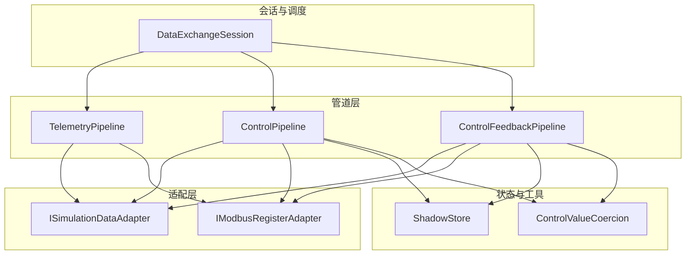
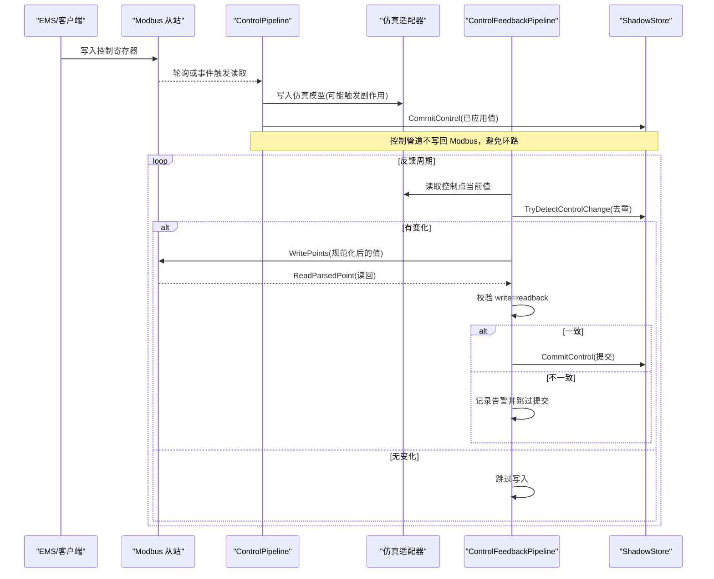
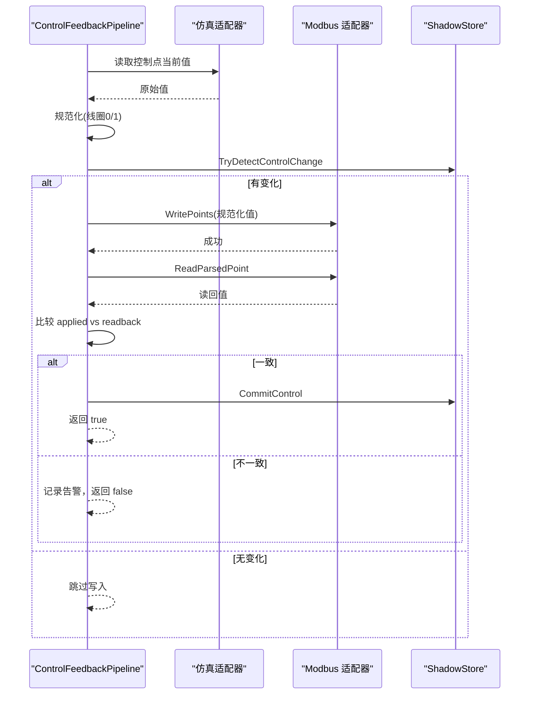
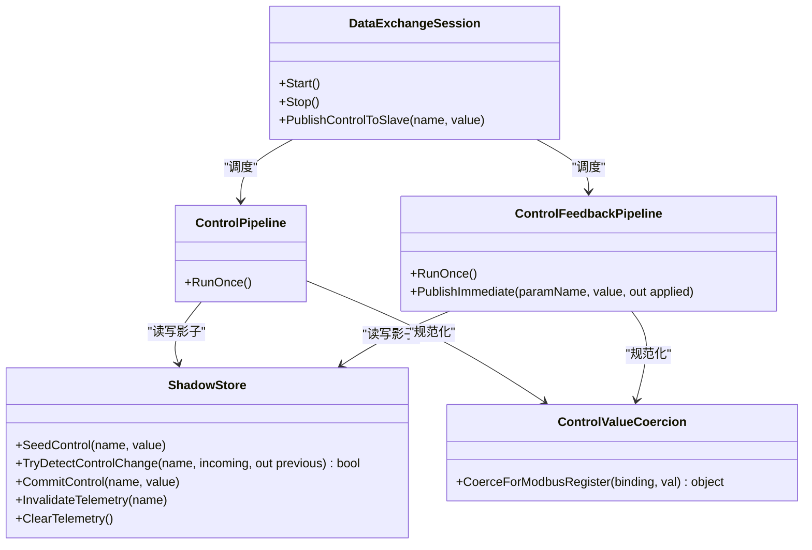

# 控制反馈管道

<cite>
**本文引用的文件**
- [ControlFeedbackPipeline.cs](file://DataExchange/Pipeline/ControlFeedbackPipeline.cs)
- [ShadowStore.cs](file://DataExchange/Pipeline/ShadowStore.cs)
- [ControlPipeline.cs](file://DataExchange/Pipeline/ControlPipeline.cs)
- [DataExchangeSession.cs](file://DataExchange/DataExchangeSession.cs)
- [ControlValueCoercion.cs](file://DataExchange/Pipeline/ControlValueCoercion.cs)
- [PointBinding.cs](file://DataExchange/Catalog/PointBinding.cs)
- [ControlSemantics.cs](file://DataExchange/Catalog/ControlSemantics.cs)
- [DataExchangeOptions.cs](file://DataExchange/Config/DataExchangeOptions.cs)
- [appsettings.json](file://appsettings.json)
- [ControlFeedbackPipelineTests.cs](file://EssSimulator.Tests/DataExchange/ControlFeedbackPipelineTests.cs)
</cite>

## 目录
1. [简介](#简介)
2. [项目结构](#项目结构)
3. [核心组件](#核心组件)
4. [架构总览](#架构总览)
5. [详细组件分析](#详细组件分析)
6. [依赖关系分析](#依赖关系分析)
7. [性能与一致性](#性能与一致性)
8. [配置选项](#配置选项)
9. [监控指标与故障排查](#监控指标与故障排查)
10. [扩展自定义反馈处理逻辑](#扩展自定义反馈处理逻辑)
11. [结论](#结论)

## 简介
本文件面向“控制反馈管道”的完整设计与实现，聚焦以下目标：
- 解释控制执行结果的反馈机制：状态同步、变更通知、一致性保证。
- 深入说明 ShadowStore 的缓存策略：数据失效、版本控制（以值比较代替显式版本号）、内存管理。
- 覆盖反馈数据的去重逻辑、变更检测算法与批量推送机制。
- 阐明反馈管道与控制管道的解耦设计，避免循环触发与重复执行。
- 明确反馈数据格式规范、传输协议约定与错误恢复策略。
- 提供反馈管道的配置项、刷新频率、缓存大小与清理策略建议。
- 给出监控指标、故障排查方法以及扩展自定义反馈处理的指导。

## 项目结构
控制反馈相关代码集中在 DataExchange/Pipeline 下，由 DataExchangeSession 统一编排遥测、控制、反馈三条流水线，并通过共享的 ShadowStore 进行状态同步与去重。

图表来源
- [DataExchangeSession.cs:22-107](file://DataExchange/DataExchangeSession.cs#L22-L107)
- [ControlPipeline.cs:10-40](file://DataExchange/Pipeline/ControlPipeline.cs#L10-L40)
- [ControlFeedbackPipeline.cs:8-32](file://DataExchange/Pipeline/ControlFeedbackPipeline.cs#L8-L32)
- [ShadowStore.cs:4-37](file://DataExchange/Pipeline/ShadowStore.cs#L4-L37)
- [ControlValueCoercion.cs:6-30](file://DataExchange/Pipeline/ControlValueCoercion.cs#L6-L30)

章节来源
- [DataExchangeSession.cs:22-107](file://DataExchange/DataExchangeSession.cs#L22-L107)
- [ControlPipeline.cs:10-40](file://DataExchange/Pipeline/ControlPipeline.cs#L10-L40)
- [ControlFeedbackPipeline.cs:8-32](file://DataExchange/Pipeline/ControlFeedbackPipeline.cs#L8-L32)
- [ShadowStore.cs:4-37](file://DataExchange/Pipeline/ShadowStore.cs#L4-L37)
- [ControlValueCoercion.cs:6-30](file://DataExchange/Pipeline/ControlValueCoercion.cs#L6-L30)

## 核心组件
- ControlFeedbackPipeline：负责将仿真侧控制点的当前值回写到 Modbus，并基于 ShadowStore 做去重；写后通过读回校验一致性，成功后提交到 ShadowStore。
- ShadowStore：维护遥测与控制点的影子值，提供变更检测、失效与清空能力，内置数值与布尔值的近似相等判断。
- ControlPipeline：从 Modbus 读取控制点，解析并写入仿真模型，必要时触发副作用（如 PCS 启停），同时更新 ShadowStore。
- DataExchangeSession：编排三个线程循环（遥测、控制、反馈），提供事件驱动控制入口，并在启动/重连时初始化寄存器与影子。
- ControlValueCoercion：对写入 Modbus 的值进行规范化，确保线圈为 0/1，寄存器保持原始 Modbus 语义。
- PointBinding / ControlSemantics：描述点位映射与控制语义（保持、脉冲、边沿）。

章节来源
- [ControlFeedbackPipeline.cs:8-129](file://DataExchange/Pipeline/ControlFeedbackPipeline.cs#L8-L129)
- [ShadowStore.cs:4-56](file://DataExchange/Pipeline/ShadowStore.cs#L4-L56)
- [ControlPipeline.cs:10-173](file://DataExchange/Pipeline/ControlPipeline.cs#L10-L173)
- [DataExchangeSession.cs:22-107](file://DataExchange/DataExchangeSession.cs#L22-L107)
- [ControlValueCoercion.cs:6-30](file://DataExchange/Pipeline/ControlValueCoercion.cs#L6-L30)
- [PointBinding.cs:3-12](file://DataExchange/Catalog/PointBinding.cs#L3-L12)
- [ControlSemantics.cs:3-14](file://DataExchange/Catalog/ControlSemantics.cs#L3-L14)

## 架构总览
反馈管道与控制管道通过 ShadowStore 解耦：控制管道只负责“外部写→仿真”，反馈管道只负责“仿真→外部写”。两者均不直接调用对方，避免了循环触发。

图表来源
- [ControlPipeline.cs:42-99](file://DataExchange/Pipeline/ControlPipeline.cs#L42-L99)
- [ControlFeedbackPipeline.cs:34-122](file://DataExchange/Pipeline/ControlFeedbackPipeline.cs#L34-L122)
- [ShadowStore.cs:24-31](file://DataExchange/Pipeline/ShadowStore.cs#L24-L31)

章节来源
- [ControlPipeline.cs:42-99](file://DataExchange/Pipeline/ControlPipeline.cs#L42-L99)
- [ControlFeedbackPipeline.cs:34-122](file://DataExchange/Pipeline/ControlFeedbackPipeline.cs#L34-L122)
- [ShadowStore.cs:24-31](file://DataExchange/Pipeline/ShadowStore.cs#L24-L31)

## 详细组件分析

### 控制反馈管道（ControlFeedbackPipeline）
职责
- 按 catalog 中的控制点定义，周期性读取仿真侧当前值，规范化后尝试写入 Modbus。
- 使用 ShadowStore 做变更检测，仅当值发生变化时才写入，减少总线压力。
- 写后读回校验一致性，成功则提交到 ShadowStore，失败则记录告警但不提交。
- 提供 PublishImmediate 接口用于即时发布（如 DPC/本地控制），同样走规范化与一致性校验流程。

关键流程
- RunOnce：遍历控制点 → 读仿真值 → 规范化 → 去重 → 批量写入 → 逐点读回校验 → 提交 ShadowStore。
- WriteWithReadback：写 Modbus → 读回对比 → 日志记录 → 提交或放弃。
- PublishImmediate：查找绑定 → 规范化 → 调用 WriteWithReadback。

去重与一致性
- 去重：TryDetectControlChange 比较 incoming 与上次提交的 previous，不等才继续。
- 一致性：WriteWithReadback 中 readback 与 applied 比较，不等则视为失败，不提交。

异常与容错
- 读仿真失败：记录调试日志并跳过该点。
- 写 Modbus 失败：记录警告并返回 false。
- 读回失败：记录警告并返回 false。

日志
- 可配置是否输出反馈日志，区分 BMS/EMU 前缀，便于定位。

章节来源
- [ControlFeedbackPipeline.cs:34-122](file://DataExchange/Pipeline/ControlFeedbackPipeline.cs#L34-L122)
- [ControlFeedbackPipeline.cs:64-74](file://DataExchange/Pipeline/ControlFeedbackPipeline.cs#L64-L74)
- [ControlFeedbackPipeline.cs:76-122](file://DataExchange/Pipeline/ControlFeedbackPipeline.cs#L76-L122)

#### 反馈写入时序图

图表来源
- [ControlFeedbackPipeline.cs:34-122](file://DataExchange/Pipeline/ControlFeedbackPipeline.cs#L34-L122)
- [ShadowStore.cs:24-31](file://DataExchange/Pipeline/ShadowStore.cs#L24-L31)

### ShadowStore 缓存策略
数据结构
- 两个字典：遥测影子 _telemetry 与控制影子 _control，键为参数字符串，值为对象（可为 null）。

变更检测
- TelemetryChanged：若新旧值相等则返回 false，否则更新并返回 true。
- TryDetectControlChange：读取 previous，与 incoming 比较，不等则判定为变化。
- ValuesEqual：支持 bool/数值近似相等（双精度差小于 1e-9）与一般对象的 Equals。

失效与清理
- InvalidateTelemetry：删除指定遥测影子键，强制下次写入。
- ClearTelemetry：清空所有遥测影子，用于 Modbus 重连后全量回写场景。
- SeedControl：冷启动时将仿真初始值注入控制影子，避免误写。

内存管理
- 使用 Dictionary<string, object?>，默认容量较小，随点位数量增长；可通过定期重建或限制最大条目数进一步优化（当前未实现上限）。

版本控制
- 采用“值比较”作为隐式版本控制，无需显式版本号；适用于浮点数近似相等与布尔归一化。

章节来源
- [ShadowStore.cs:4-56](file://DataExchange/Pipeline/ShadowStore.cs#L4-L56)
- [DataExchangeSession.cs:243-249](file://DataExchange/DataExchangeSession.cs#L243-L249)

### 控制管道（ControlPipeline）
职责
- 从 Modbus 读取控制点，解析为工程值，写入仿真模型。
- 根据语义（Hold/Pulse/Edge）决定写入行为，边沿型仅在跳变时写入。
- 更新 ShadowStore，触发副作用（如 PCS 启停、BMS 链路等）。

边沿检测
- TryResolveEdgeTransition：将 previous/incoming 转为布尔，仅在 0→1 或 1→0 时生效。

值规范化
- CoerceControlValue：字符串转数值/布尔；线圈 FC5 时按仿真目标类型返回布尔或 0/1。

章节来源
- [ControlPipeline.cs:42-99](file://DataExchange/Pipeline/ControlPipeline.cs#L42-L99)
- [ControlPipeline.cs:105-167](file://DataExchange/Pipeline/ControlPipeline.cs#L105-L167)

### 数据交换会话（DataExchangeSession）
职责
- 创建并运行遥测、控制、反馈三个后台线程。
- 启动时初始化控制寄存器与影子，重连时清空遥测影子并立即刷新。
- 提供事件驱动控制入口（ExternalControlWrite），合并簇级控制与普通控制。
- 暴露 PublishControlToSlave 供仿真侧主动发布控制结果到 Modbus。

线程与调度
- TelemetryLoop：按 TelemetryIntervalMs 或 EmuTelemetryIntervalMs 周期刷新。
- ControlLoop：按 ControlPollIntervalMs 周期拉取控制点。
- FeedbackLoop：与 ControlLoop 同频，周期执行反馈。
- DrainControlPipeline / DrainRackControlPipeline：加锁串行执行，避免并发冲突。

章节来源
- [DataExchangeSession.cs:22-107](file://DataExchange/DataExchangeSession.cs#L22-L107)
- [DataExchangeSession.cs:238-290](file://DataExchange/DataExchangeSession.cs#L238-L290)
- [DataExchangeSession.cs:424-494](file://DataExchange/DataExchangeSession.cs#L424-L494)

### 值规范化（ControlValueCoercion）
- 将输入值规范化为 Modbus 寄存器期望形式：字符串先尝试解析为 double 或 bool；FC5 线圈强制为 0/1。
- 与 ControlPipeline 的线圈处理保持一致，确保 mbpoll 与系统行为一致。

章节来源
- [ControlValueCoercion.cs:6-30](file://DataExchange/Pipeline/ControlValueCoercion.cs#L6-L30)

### 点位与控制语义
- PointBinding：包含 MapEntry、ParamName、DataTarget、Semantics、Effect，并标识是否为遥测/控制点。
- ControlSemantics：Hold（保持）、Pulse（脉冲）、Edge（边沿）。

章节来源
- [PointBinding.cs:3-12](file://DataExchange/Catalog/PointBinding.cs#L3-L12)
- [ControlSemantics.cs:3-14](file://DataExchange/Catalog/ControlSemantics.cs#L3-L14)

## 依赖关系分析
- ControlFeedbackPipeline 依赖 PointCatalog、ISimulationDataAdapter、IModbusRegisterAdapter、ShadowStore。
- ControlPipeline 依赖 PointCatalog、ISimulationDataAdapter、IModbusRegisterAdapter、ModbusParser、ShadowStore、ControlEffectRegistry。
- DataExchangeSession 组合以上组件，并管理生命周期与线程。
- ShadowStore 被控制与反馈两条管道共享，是状态同步的核心。

图表来源
- [DataExchangeSession.cs:22-107](file://DataExchange/DataExchangeSession.cs#L22-L107)
- [ControlPipeline.cs:10-40](file://DataExchange/Pipeline/ControlPipeline.cs#L10-L40)
- [ControlFeedbackPipeline.cs:8-32](file://DataExchange/Pipeline/ControlFeedbackPipeline.cs#L8-L32)
- [ShadowStore.cs:4-37](file://DataExchange/Pipeline/ShadowStore.cs#L4-L37)
- [ControlValueCoercion.cs:6-30](file://DataExchange/Pipeline/ControlValueCoercion.cs#L6-L30)

章节来源
- [DataExchangeSession.cs:22-107](file://DataExchange/DataExchangeSession.cs#L22-L107)
- [ControlPipeline.cs:10-40](file://DataExchange/Pipeline/ControlPipeline.cs#L10-L40)
- [ControlFeedbackPipeline.cs:8-32](file://DataExchange/Pipeline/ControlFeedbackPipeline.cs#L8-L32)
- [ShadowStore.cs:4-37](file://DataExchange/Pipeline/ShadowStore.cs#L4-L37)
- [ControlValueCoercion.cs:6-30](file://DataExchange/Pipeline/ControlValueCoercion.cs#L6-L30)

## 性能与一致性
- 去重与批写：反馈管道在单次 RunOnce 内收集待写集合，再批量写入 Modbus，降低总线交互次数。
- 变更检测：ShadowStore 的 ValuesEqual 支持浮点近似相等，避免微小抖动导致频繁 I/O。
- 一致性保障：写后读回校验，不一致时不提交影子，防止脏数据扩散。
- 线程隔离：控制与反馈各自独立线程，控制管道不写回 Modbus，避免环路。
- 事件驱动兜底：ControlEventDriven=true 时，外部写事件立即触发控制管道，轮询仍作为兜底。

优化建议
- 若点位规模大，可考虑对 ShadowStore 增加容量上限与 LRU 淘汰策略。
- 可根据设备类型调整反馈与控制轮询间隔，平衡实时性与负载。
- 对高频波动点引入阈值滤波或迟滞比较，进一步减少抖动。

[本节为通用性能讨论，不直接分析具体文件]

## 配置选项
DataExchange 配置节（位于 appsettings.json）：
- TelemetryIntervalMs：BMS/rack 遥测刷新周期（毫秒）。
- EmuTelemetryIntervalMs：EMU（PCS）遥测刷新周期（毫秒）。
- ControlEventDriven：是否在外部写控制区后立即触发控制管道（true/false）。
- ControlPollIntervalMs：控制与反馈的轮询周期（毫秒）。

运行时影响
- 反馈循环与 ControlLoop 共用 ControlPollIntervalMs 作为睡眠间隔。
- 启动时会写入默认值并初始化控制寄存器；重连时清空遥测影子并立即刷新。

章节来源
- [DataExchangeOptions.cs:5-21](file://DataExchange/Config/DataExchangeOptions.cs#L5-L21)
- [appsettings.json:92-97](file://appsettings.json#L92-L97)
- [DataExchangeSession.cs:238-290](file://DataExchange/DataExchangeSession.cs#L238-L290)
- [DataExchangeSession.cs:461-494](file://DataExchange/DataExchangeSession.cs#L461-L494)

## 监控指标与故障排查
日志与可见性
- 反馈管道：
  - 写失败：Warn 级别日志，包含参数名与异常信息。
  - 读回失败：Warn 级别日志，包含参数名与异常信息。
  - 影子未更新：Warn 级别日志，包含 write 与 readback 值。
  - 可选 Info 级别日志：每次反馈变化与最终结果。
- 控制管道：
  - 写仿真失败：Warn 级别日志，包含目标路径与值。
  - 边沿/值转换异常：Debug 级别日志。
- 会话：
  - 各循环异常：Error 级别日志，包含设备名与异常堆栈。

常见问题排查
- 反馈写成功但读回不一致：检查 Modbus 从站响应、地址映射、缩放系数、数据类型；确认 ShadowStore.ValuesEqual 的近似比较是否符合预期。
- 反馈未触发：确认 ShadowStore.TryDetectControlChange 返回值；检查仿真值是否变化；确认日志是否开启。
- 控制未生效：检查 ControlSemantics 是否为 Edge 且确实发生跳变；确认 ControlPipeline 的 CoerceControlValue 与仿真目标类型匹配。
- 重连后状态不同步：确认 DataExchangeSession 在重连时调用了 ClearTelemetry 并立即刷新遥测。

章节来源
- [ControlFeedbackPipeline.cs:76-122](file://DataExchange/Pipeline/ControlFeedbackPipeline.cs#L76-L122)
- [ControlPipeline.cs:72-99](file://DataExchange/Pipeline/ControlPipeline.cs#L72-L99)
- [DataExchangeSession.cs:238-290](file://DataExchange/DataExchangeSession.cs#L238-L290)
- [DataExchangeSession.cs:461-494](file://DataExchange/DataExchangeSession.cs#L461-L494)

## 扩展自定义反馈处理逻辑
现有扩展点
- ControlEffectRegistry：控制管道在写入仿真后，根据绑定上的 Effect 分发到对应处理器（如 PCS 启停、BMS 链路）。
- DataExchangeSession 构造时注册效果处理器，依据设备名前缀选择 EMU/BMS 的效果集。

如何扩展
- 新增自定义效果：实现 IControlEffect 接口，注册到 ControlEffectRegistry。
- 在反馈管道中如需额外动作：可在 WriteWithReadback 成功后插入回调（例如记录指标、触发告警、联动其他子系统）。注意避免在此处再次写回 Modbus，以免形成环路。
- 若需对反馈数据进行统计：可在 DataExchangeSession 的 FeedbackLoop 中增加计数器与指标上报（例如成功/失败计数、延迟分布）。

注意事项
- 避免在反馈路径中触发控制管道，防止循环触发。
- 对高开销操作应异步执行，避免阻塞反馈主循环。
- 对敏感操作需加入权限与白名单校验。

章节来源
- [ControlPipeline.cs:89-98](file://DataExchange/Pipeline/ControlPipeline.cs#L89-L98)
- [DataExchangeSession.cs:60-71](file://DataExchange/DataExchangeSession.cs#L60-L71)

## 结论
控制反馈管道通过 ShadowStore 实现了高效的状态同步与变更去重，结合写后读回的一致性校验，确保了仿真与 Modbus 之间控制状态的正确对齐。控制与反馈管道解耦设计有效避免了循环触发与重复执行。配合灵活的配置项与完善的日志体系，系统具备良好的可观测性与可维护性。未来可在 ShadowStore 中引入容量管理与更精细的失效策略，进一步提升大规模点位下的性能与稳定性。

[本节为总结性内容，不直接分析具体文件]