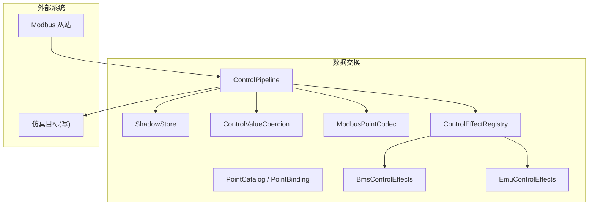
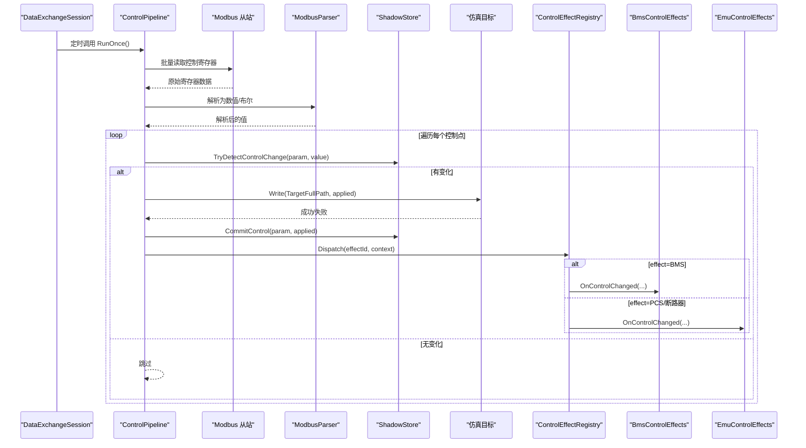
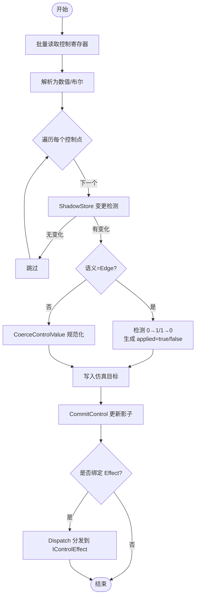
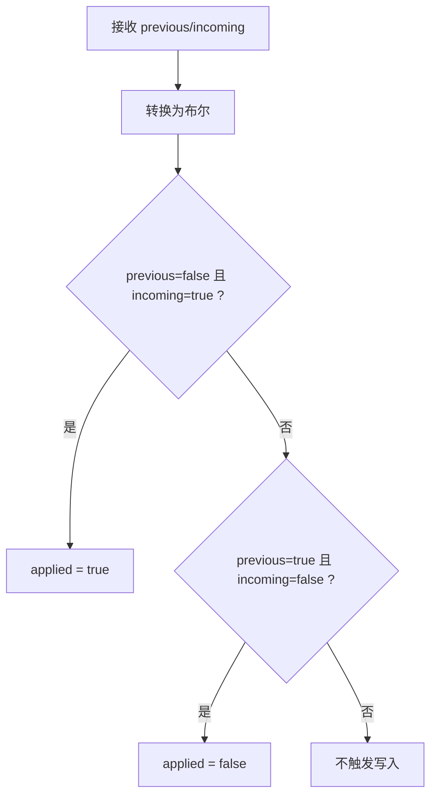
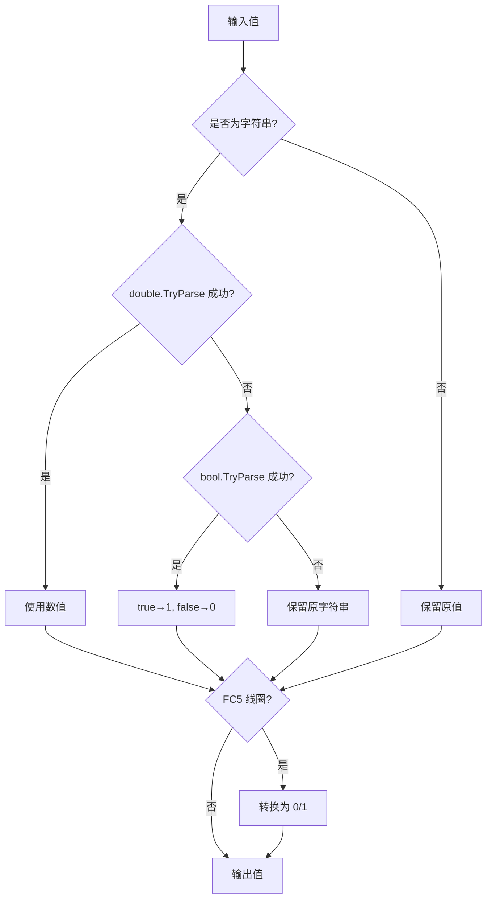
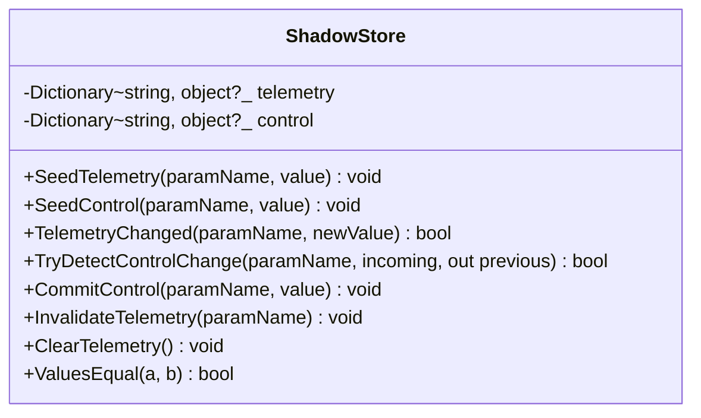
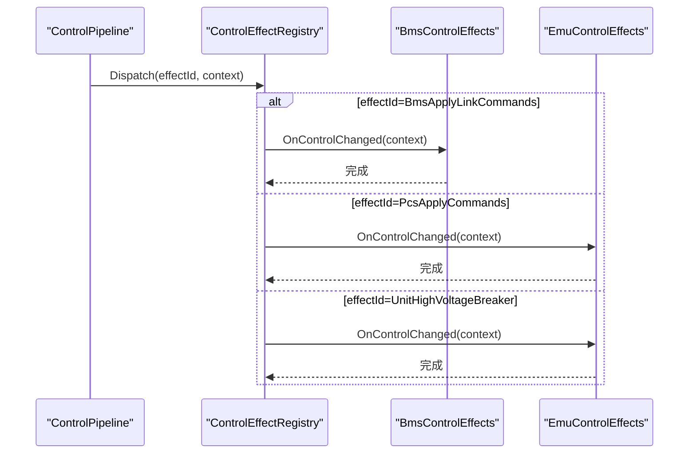
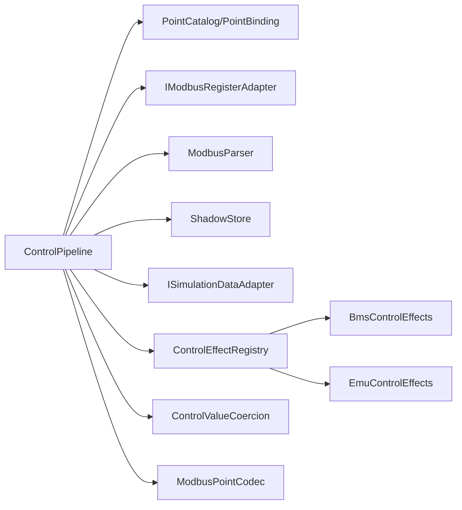

# 基础控制管道

<cite>
**本文引用的文件**
- [ControlPipeline.cs](file://DataExchange/Pipeline/ControlPipeline.cs)
- [ShadowStore.cs](file://DataExchange/Pipeline/ShadowStore.cs)
- [ControlValueCoercion.cs](file://DataExchange/Pipeline/ControlValueCoercion.cs)
- [PointCatalog.cs](file://DataExchange/Catalog/PointCatalog.cs)
- [PointBinding.cs](file://DataExchange/Catalog/PointBinding.cs)
- [ControlSemantics.cs](file://DataExchange/Catalog/ControlSemantics.cs)
- [ControlEffectId.cs](file://DataExchange/Catalog/ControlEffectId.cs)
- [IControlEffect.cs](file://DataExchange/Effects/IControlEffect.cs)
- [ControlEffectRegistry.cs](file://DataExchange/Effects/ControlEffectRegistry.cs)
- [BmsControlEffects.cs](file://DataExchange/Effects/BmsControlEffects.cs)
- [EmuControlEffects.cs](file://DataExchange/Effects/EmuControlEffects.cs)
- [ModbusPointCodec.cs](file://Protocol/Modbus/ModbusPointCodec.cs)
- [DataExchangeOptions.cs](file://DataExchange/Config/DataExchangeOptions.cs)
- [SimulatorConfig.cs](file://Configuration/SimulatorConfig.cs)
- [DataExchangeSession.cs](file://DataExchange/DataExchangeSession.cs)
</cite>

## 目录
1. [简介](#简介)
2. [项目结构](#项目结构)
3. [核心组件](#核心组件)
4. [架构总览](#架构总览)
5. [详细组件分析](#详细组件分析)
6. [依赖关系分析](#依赖关系分析)
7. [性能考虑](#性能考虑)
8. [故障排查指南](#故障排查指南)
9. [结论](#结论)
10. [附录](#附录)

## 简介
本文件面向“基础控制管道”的深入文档，聚焦于 ControlPipeline 的核心职责：从 Modbus 读取控制点、解析数据、变更检测、边沿型控制点处理、值转换与 Coercion、影子存储（ShadowStore）的状态跟踪，以及控制效果（如 PCS 启停、断路器操作等）的注册与执行。同时提供配置选项说明、调试方法与常见问题排查建议，帮助读者快速理解并正确使用该管道。

## 项目结构
控制管道位于 DataExchange/Pipeline 下，围绕 ControlPipeline 串联以下关键模块：
- 点表与绑定：PointCatalog、PointBinding、ControlSemantics、ControlEffectId
- 值转换与编解码：ControlValueCoercion、ModbusPointCodec
- 影子存储：ShadowStore
- 控制效果：ControlEffectRegistry 与各 IControlEffect 实现（BMS/EMU）
- 运行期配置：DataExchangeOptions、SimulatorConfig
- 会话与调度：DataExchangeSession 负责轮询与事件驱动

图表来源
- [ControlPipeline.cs:1-176](file://DataExchange/Pipeline/ControlPipeline.cs#L1-L176)
- [ShadowStore.cs:1-59](file://DataExchange/Pipeline/ShadowStore.cs#L1-L59)
- [ControlValueCoercion.cs:1-32](file://DataExchange/Pipeline/ControlValueCoercion.cs#L1-L32)
- [ModbusPointCodec.cs:1-127](file://Protocol/Modbus/ModbusPointCodec.cs#L1-L127)
- [PointCatalog.cs:1-25](file://DataExchange/Catalog/PointCatalog.cs#L1-L25)
- [PointBinding.cs:1-14](file://DataExchange/Catalog/PointBinding.cs#L1-L14)
- [ControlEffectRegistry.cs:1-25](file://DataExchange/Effects/ControlEffectRegistry.cs#L1-L25)
- [BmsControlEffects.cs:1-32](file://DataExchange/Effects/BmsControlEffects.cs#L1-L32)
- [EmuControlEffects.cs:1-68](file://DataExchange/Effects/EmuControlEffects.cs#L1-L68)

章节来源
- [ControlPipeline.cs:1-176](file://DataExchange/Pipeline/ControlPipeline.cs#L1-L176)
- [DataExchangeSession.cs:73-106](file://DataExchange/DataExchangeSession.cs#L73-L106)

## 核心组件
- ControlPipeline：控制管道的核心编排器，负责轮询 Modbus 控制区、解析、变更检测、写入仿真、触发副作用。
- ShadowStore：维护遥测与控制点的影子状态，基于近似相等比较避免重复 I/O。
- ControlValueCoercion：将字符串或布尔值规范化为寄存器所需的原始值（线圈 FC5 输出 0/1）。
- ModbusPointCodec：点表类型到 CLR 类型的映射、字节序转换、缩放与编解码。
- PointCatalog/PointBinding：描述可写点位的语义（Hold/Pulse/Edge）、目标路径及关联的控制效果。
- ControlEffectRegistry + IControlEffect：控制效果的注册与分发，支持 BMS 链路命令、PCS 命令应用、单元高压断路器等。
- DataExchangeOptions/SimulatorConfig：控制轮询周期、事件驱动开关、日志开关、服务器标识等。

章节来源
- [ControlPipeline.cs:1-176](file://DataExchange/Pipeline/ControlPipeline.cs#L1-L176)
- [ShadowStore.cs:1-59](file://DataExchange/Pipeline/ShadowStore.cs#L1-L59)
- [ControlValueCoercion.cs:1-32](file://DataExchange/Pipeline/ControlValueCoercion.cs#L1-L32)
- [ModbusPointCodec.cs:1-127](file://Protocol/Modbus/ModbusPointCodec.cs#L1-L127)
- [PointCatalog.cs:1-25](file://DataExchange/Catalog/PointCatalog.cs#L1-L25)
- [PointBinding.cs:1-14](file://DataExchange/Catalog/PointBinding.cs#L1-L14)
- [ControlEffectId.cs:1-11](file://DataExchange/Catalog/ControlEffectId.cs#L1-L11)
- [IControlEffect.cs:1-19](file://DataExchange/Effects/IControlEffect.cs#L1-L19)
- [ControlEffectRegistry.cs:1-25](file://DataExchange/Effects/ControlEffectRegistry.cs#L1-L25)
- [DataExchangeOptions.cs:1-33](file://DataExchange/Config/DataExchangeOptions.cs#L1-L33)
- [SimulatorConfig.cs:149-189](file://Configuration/SimulatorConfig.cs#L149-L189)

## 架构总览
控制管道在运行时由 DataExchangeSession 启动多个循环：遥测轮询、控制轮询、反馈回写。控制管道每次调用 RunOnce 时，会批量读取所有控制点，解析后逐点比对影子状态，仅在变化时写入仿真并触发副作用。

图表来源
- [ControlPipeline.cs:42-100](file://DataExchange/Pipeline/ControlPipeline.cs#L42-L100)
- [ShadowStore.cs:24-31](file://DataExchange/Pipeline/ShadowStore.cs#L24-L31)
- [ControlEffectRegistry.cs:15-22](file://DataExchange/Effects/ControlEffectRegistry.cs#L15-L22)
- [BmsControlEffects.cs:11-17](file://DataExchange/Effects/BmsControlEffects.cs#L11-L17)
- [EmuControlEffects.cs:20-35](file://DataExchange/Effects/EmuControlEffects.cs#L20-L35)

## 详细组件分析

### ControlPipeline 工作流与边沿检测
- 批量读取：根据点表中的控制点参数名，一次性读取所有相关寄存器，减少网络往返。
- 解析：使用 ModbusParser 将原始字节转换为数值/布尔。
- 变更检测：通过 ShadowStore.TryDetectControlChange 判断是否发生变化。
- 边沿型控制点：对 Semantics=Edge 的点，仅当出现 0→1（上升沿）或 1→0（下降沿）时才写入仿真，并分别以 true/false 表示。
- 值转换：非 Edge 点按 CoerceControlValue 进行规范化；FC5 线圈强制输出 0/1。
- 副作用：若绑定了对应 Effect，则通过 ControlEffectRegistry 分发到具体实现（如 PCS 命令应用、断路器合分闸）。

图表来源
- [ControlPipeline.cs:42-100](file://DataExchange/Pipeline/ControlPipeline.cs#L42-L100)
- [ControlPipeline.cs:102-133](file://DataExchange/Pipeline/ControlPipeline.cs#L102-L133)
- [ControlPipeline.cs:135-167](file://DataExchange/Pipeline/ControlPipeline.cs#L135-L167)

章节来源
- [ControlPipeline.cs:42-100](file://DataExchange/Pipeline/ControlPipeline.cs#L42-L100)
- [ControlPipeline.cs:102-133](file://DataExchange/Pipeline/ControlPipeline.cs#L102-L133)
- [ControlPipeline.cs:135-167](file://DataExchange/Pipeline/ControlPipeline.cs#L135-L167)

### 边沿型控制点（Edge）处理逻辑
- 输入 previous/incoming 均被转换为布尔（空值视为 false，字符串尝试 bool/int 解析，数值非零为真）。
- 上升沿：previous=false 且 incoming=true → applied=true。
- 下降沿：previous=true 且 incoming=false → applied=false。
- 其他情况（保持相同电平）不触发写入。

图表来源
- [ControlPipeline.cs:102-133](file://DataExchange/Pipeline/ControlPipeline.cs#L102-L133)

章节来源
- [ControlPipeline.cs:102-133](file://DataExchange/Pipeline/ControlPipeline.cs#L102-L133)

### 值转换与 Coercion
- 字符串到数值/布尔：优先尝试 double.TryParse，其次 bool.TryParse；bool 转为 1/0。
- 线圈（FC5）：无论输入为何，最终输出 0/1；若仿真目标为 bool，直接返回布尔，否则返回 1/0。
- 寄存器编解码：ModbusPointCodec 负责类型映射、字节序（CDAB/AB 等）、缩放与四舍五入。

图表来源
- [ControlPipeline.cs:135-167](file://DataExchange/Pipeline/ControlPipeline.cs#L135-L167)
- [ControlValueCoercion.cs:8-29](file://DataExchange/Pipeline/ControlValueCoercion.cs#L8-L29)
- [ModbusPointCodec.cs:61-124](file://Protocol/Modbus/ModbusPointCodec.cs#L61-L124)

章节来源
- [ControlPipeline.cs:135-167](file://DataExchange/Pipeline/ControlPipeline.cs#L135-L167)
- [ControlValueCoercion.cs:8-29](file://DataExchange/Pipeline/ControlValueCoercion.cs#L8-L29)
- [ModbusPointCodec.cs:61-124](file://Protocol/Modbus/ModbusPointCodec.cs#L61-L124)

### 影子存储（ShadowStore）工作原理
- 数据结构：两个字典分别保存遥测和控制点的最近一次值（忽略大小写键）。
- 变更检测：ValuesEqual 支持布尔归一化比较与浮点容差比较（1e-9），避免微小抖动导致重复 I/O。
- 提交：成功写入仿真后，CommitControl 更新影子；遥测侧提供 ClearTelemetry 用于重连后全量回写。

图表来源
- [ShadowStore.cs:1-59](file://DataExchange/Pipeline/ShadowStore.cs#L1-L59)

章节来源
- [ShadowStore.cs:1-59](file://DataExchange/Pipeline/ShadowStore.cs#L1-L59)

### 控制效果的注册与执行
- 注册：通过 ControlEffectRegistry.Register 将 IControlEffect 实例与其 Id 关联。
- 分发：ControlPipeline 在写入成功后，若绑定 Effect≠None，则调用 Dispatch 分发上下文（包含 ServerName、Binding、AppliedValue、PreviousValue）。
- 典型实现：
  - BmsLinkControlEffect：解析 simBmsX 通道，调用 BmsLinkEngine.ApplyForChannel 驱动并网/黑启动状态机。
  - EmuPcsControlEffect：解析 simEmuX 单元，调用 PcsMapper.ApplyEmuCommands 应用 PCS 命令，并同步状态、请求快照推送。
  - EmuUnitBreakerEffect：根据 emu.PowerOnOff 设置单元高压断路器闭合/断开。

图表来源
- [ControlEffectRegistry.cs:15-22](file://DataExchange/Effects/ControlEffectRegistry.cs#L15-L22)
- [BmsControlEffects.cs:11-17](file://DataExchange/Effects/BmsControlEffects.cs#L11-L17)
- [EmuControlEffects.cs:20-35](file://DataExchange/Effects/EmuControlEffects.cs#L20-L35)
- [EmuControlEffects.cs:53-65](file://DataExchange/Effects/EmuControlEffects.cs#L53-L65)

章节来源
- [ControlEffectRegistry.cs:15-22](file://DataExchange/Effects/ControlEffectRegistry.cs#L15-L22)
- [BmsControlEffects.cs:11-17](file://DataExchange/Effects/BmsControlEffects.cs#L11-L17)
- [EmuControlEffects.cs:20-35](file://DataExchange/Effects/EmuControlEffects.cs#L20-L35)
- [EmuControlEffects.cs:53-65](file://DataExchange/Effects/EmuControlEffects.cs#L53-L65)

### 控制管道配置选项
- 轮询与事件驱动：
  - ControlEventDriven：外部写控制区后立即触发管道（默认启用），轮询作为兜底。
  - ControlPollIntervalMs：控制轮询间隔（毫秒）。
- 语义与效果映射：
  - ControlSemantics：按参数名映射 Hold/Pulse/Edge。
  - ControlEffects：按参数名映射具体 ControlEffectId。
- 日志与服务器标识：
  - logControlChanges：是否记录控制变更日志。
  - serverName：用于区分 BMS/EMU 设备前缀（simBms/simEmu）。
- 协议端口与聚合：
  - ProtocolConfig 中定义 BMS/EMU/EM 等 Modbus TCP 基础端口与步长，LocalControl 聚合参数。

章节来源
- [DataExchangeOptions.cs:1-33](file://DataExchange/Config/DataExchangeOptions.cs#L1-L33)
- [SimulatorConfig.cs:149-189](file://Configuration/SimulatorConfig.cs#L149-L189)
- [ControlPipeline.cs:22-40](file://DataExchange/Pipeline/ControlPipeline.cs#L22-L40)

## 依赖关系分析
- ControlPipeline 依赖：
  - PointCatalog/PointBinding：提供控制点元数据（目标路径、语义、效果）。
  - IModbusRegisterAdapter/ModbusParser：读取与解析 Modbus 寄存器。
  - ShadowStore：变更检测与状态跟踪。
  - ISimulationDataAdapter：写入仿真目标。
  - ControlEffectRegistry：分发控制效果。
- 值转换依赖：
  - ControlValueCoercion：规范化线圈值。
  - ModbusPointCodec：类型映射、字节序、缩放。
- 效果实现依赖：
  - BmsControlEffects：BMS 链路引擎。
  - EmuControlEffects：PCS 命令应用与断路器控制。

图表来源
- [ControlPipeline.cs:1-176](file://DataExchange/Pipeline/ControlPipeline.cs#L1-L176)
- [PointCatalog.cs:1-25](file://DataExchange/Catalog/PointCatalog.cs#L1-L25)
- [PointBinding.cs:1-14](file://DataExchange/Catalog/PointBinding.cs#L1-L14)
- [ControlValueCoercion.cs:1-32](file://DataExchange/Pipeline/ControlValueCoercion.cs#L1-L32)
- [ModbusPointCodec.cs:1-127](file://Protocol/Modbus/ModbusPointCodec.cs#L1-L127)
- [ControlEffectRegistry.cs:1-25](file://DataExchange/Effects/ControlEffectRegistry.cs#L1-L25)
- [BmsControlEffects.cs:1-32](file://DataExchange/Effects/BmsControlEffects.cs#L1-L32)
- [EmuControlEffects.cs:1-68](file://DataExchange/Effects/EmuControlEffects.cs#L1-L68)

章节来源
- [ControlPipeline.cs:1-176](file://DataExchange/Pipeline/ControlPipeline.cs#L1-L176)
- [ControlEffectRegistry.cs:1-25](file://DataExchange/Effects/ControlEffectRegistry.cs#L1-L25)

## 性能考虑
- 批量读取：一次读取所有控制寄存器，降低网络开销。
- 变更检测：ShadowStore.ValuesEqual 使用浮点容差与布尔归一化，避免重复写入。
- 事件驱动：ControlEventDriven 启用后，外部写立即触发，轮询仅兜底，降低延迟。
- 轮询间隔：ControlPollIntervalMs 可调，兼顾实时性与负载。
- 日志开关：logControlChanges 可按需开启，避免高频日志影响吞吐。
- 白盒切片：DroopSliceStore 在设定瞬间采集有功/无功，便于离线分析。

[本节为通用性能指导，不直接分析具体文件]

## 故障排查指南
- 控制未生效
  - 检查点表绑定是否正确（ParamName、Target.FullPath、FunctionCode）。
  - 确认 ShadowStore 是否检测到变化（ValuesEqual 容差可能导致“看似变化”但实际未触发）。
  - 查看 ControlPipeline 日志前缀（BMS/EMU）与错误信息。
- 边沿未触发
  - 确认 Semantics=Edge，且 previous/incoming 能正确解析为布尔。
  - 检查是否存在连续抖动导致多次跳变。
- 线圈值异常
  - FC5 必须输出 0/1；若仿真目标为 bool，应返回布尔，否则返回 1/0。
  - 核对 ModbusPointCodec 的类型与字节序配置。
- 效果未执行
  - 检查 ControlEffectId 是否绑定到对应参数。
  - 确认 ControlEffectRegistry 已注册相应 IControlEffect。
  - 验证 serverName 前缀（simBms/simEmu）是否能被解析。
- 日志与调试
  - 启用 logControlChanges，观察控制变更日志。
  - 使用 DataExchangeSession 的轮询与事件驱动模式对比行为。
  - 结合 Web 日志推送（LogHubAppender）实时查看日志。

章节来源
- [ControlPipeline.cs:72-98](file://DataExchange/Pipeline/ControlPipeline.cs#L72-L98)
- [ShadowStore.cs:39-56](file://DataExchange/Pipeline/ShadowStore.cs#L39-L56)
- [ControlValueCoercion.cs:8-29](file://DataExchange/Pipeline/ControlValueCoercion.cs#L8-L29)
- [ModbusPointCodec.cs:61-124](file://Protocol/Modbus/ModbusPointCodec.cs#L61-L124)
- [DataExchangeSession.cs:461-493](file://DataExchange/DataExchangeSession.cs#L461-L493)
- [LogHubAppender.cs:1-75](file://Web/LogHubAppender.cs#L1-L75)

## 结论
ControlPipeline 通过批量读取、解析、变更检测与边沿处理，实现了高效可靠的 Modbus 控制到仿真的桥接。配合 ShadowStore 的状态跟踪与 ControlEffectRegistry 的效果分发，能够灵活支持 PCS 启停、断路器操作等高级控制逻辑。合理的配置与日志策略可显著提升调试效率与系统稳定性。

[本节为总结性内容，不直接分析具体文件]

## 附录
- 控制点语义
  - Hold：保持型，Modbus 值与仿真目标一致。
  - Pulse：脉冲型，写入后触发一次，随后归零。
  - Edge：边沿型，值变化时触发副作用。
- 控制效果 ID
  - None：无效果。
  - PcsApplyCommands：应用 PCS 命令。
  - UnitHighVoltageBreaker：单元高压断路器。
  - BmsApplyLinkCommands：BMS 链路命令。
- 配置项参考
  - DataExchangeOptions：轮询周期、事件驱动、语义/效果映射。
  - SimulatorConfig.Protocol：Modbus 端口与 LocalControl 聚合参数。

章节来源
- [ControlSemantics.cs:1-16](file://DataExchange/Catalog/ControlSemantics.cs#L1-L16)
- [ControlEffectId.cs:1-11](file://DataExchange/Catalog/ControlEffectId.cs#L1-L11)
- [DataExchangeOptions.cs:1-33](file://DataExchange/Config/DataExchangeOptions.cs#L1-L33)
- [SimulatorConfig.cs:149-189](file://Configuration/SimulatorConfig.cs#L149-L189)