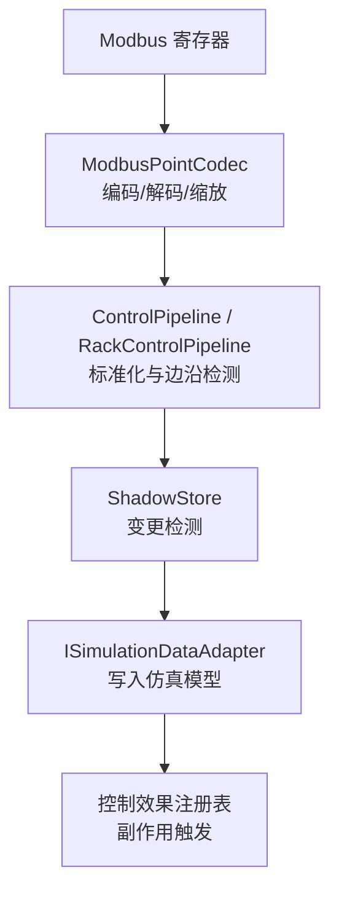
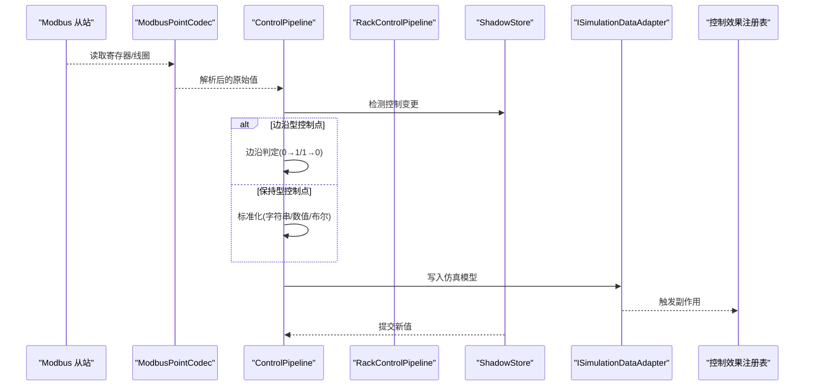
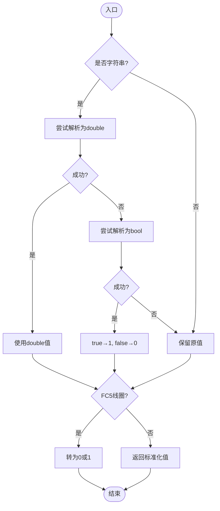
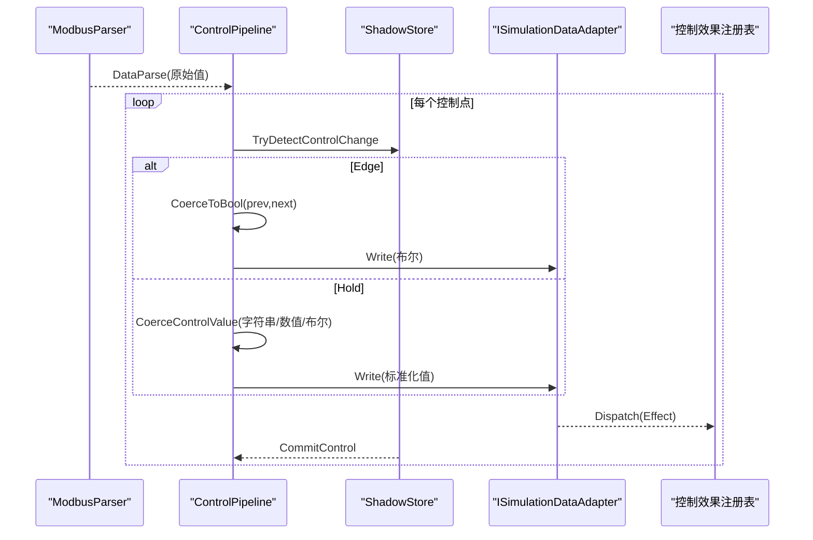
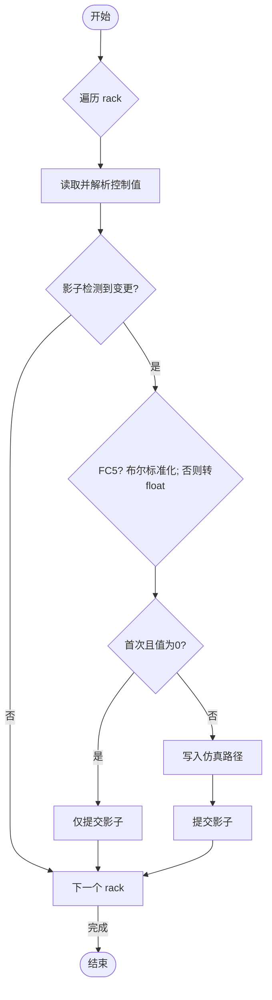
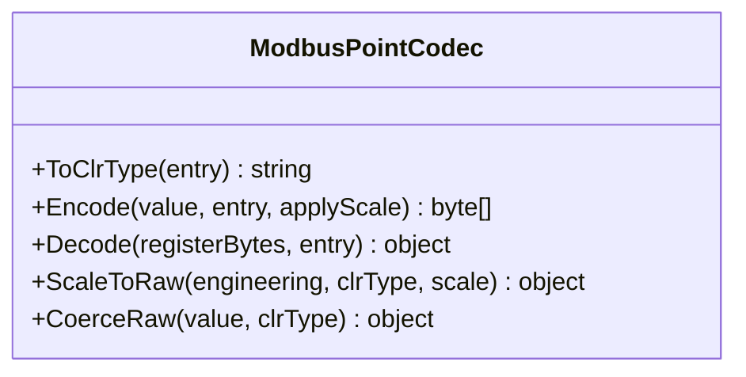
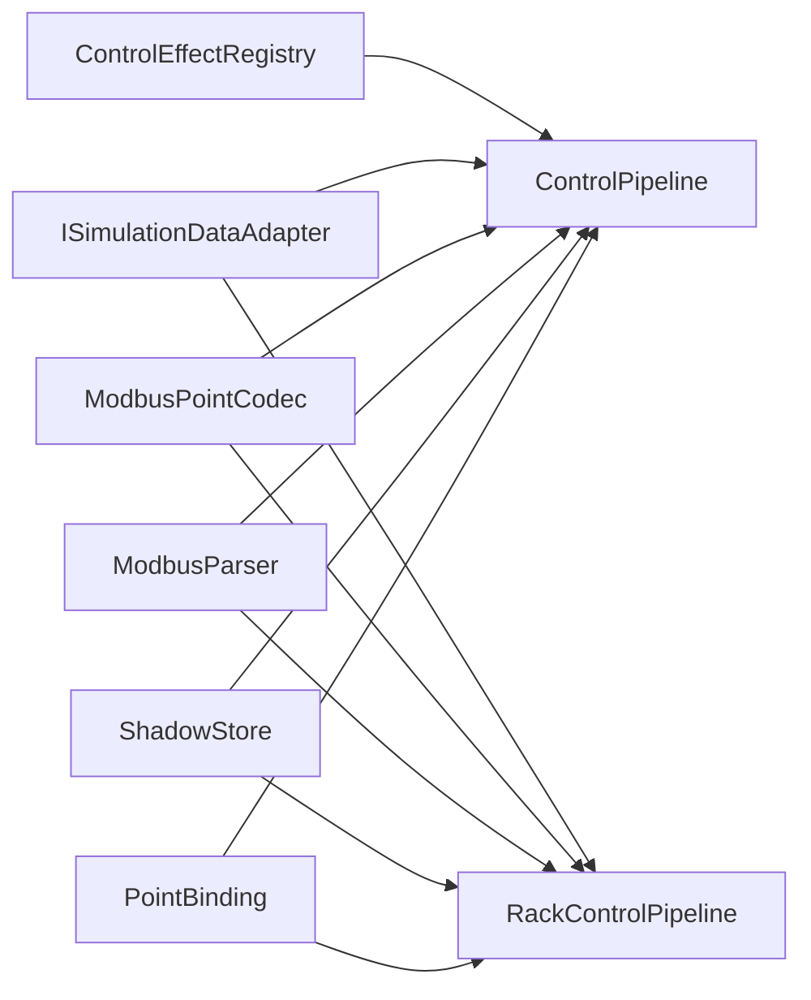

# 控制值转换机制

<cite>
**本文引用的文件**
- [ControlValueCoercion.cs](file://DataExchange/Pipeline/ControlValueCoercion.cs)
- [ControlPipeline.cs](file://DataExchange/Pipeline/ControlPipeline.cs)
- [RackControlPipeline.cs](file://DataExchange/Pipeline/RackControlPipeline.cs)
- [ModbusPointCodec.cs](file://Protocol/Modbus/ModbusPointCodec.cs)
- [ModbusDataSync.cs](file://Protocol/Modbus/ModbusDataSync.cs)
- [ShadowStore.cs](file://DataExchange/Pipeline/ShadowStore.cs)
- [PointBinding.cs](file://DataExchange/Catalog/PointBinding.cs)
- [ModbusValueConverter.cs](file://LocalControl/ModbusValueConverter.cs)
- [AcQuantityConverter.cs](file://EssDeviceSimModel/Model/AcQuantityConverter.cs)
</cite>

## 目录
1. [简介](#简介)
2. [项目结构](#项目结构)
3. [核心组件](#核心组件)
4. [架构总览](#架构总览)
5. [详细组件分析](#详细组件分析)
6. [依赖关系分析](#依赖关系分析)
7. [性能考虑](#性能考虑)
8. [故障排查指南](#故障排查指南)
9. [结论](#结论)
10. [附录](#附录)

## 简介
本文件系统性阐述控制系统中的“控制值转换机制”，聚焦于将来自 Modbus/协议层的原始控制值，统一标准化为仿真模型可接受的类型与范围，并保证写入安全、可观测、可调试。内容覆盖：
- ControlValueCoercion 及管道层（ControlPipeline、RackControlPipeline）的标准化流程
- 数据类型适配：字符串、数值、布尔值的自动转换规则
- 范围检查与验证：最小值、最大值、步长的约束策略
- 单位换算：功率、电压、电流等电气量的标准化处理
- 特殊值处理：null、NaN、无穷大等边界情况
- 配置选项：精度、舍入、错误处理策略
- 性能优化建议与调试方法

## 项目结构
控制值转换贯穿“协议解析 → 管道标准化 → 仿真写入”的全链路。关键位置如下：
- 协议编解码：ModbusPointCodec 负责寄存器字节序、缩放、CLR 类型映射与数值强制转换
- 控制管道：ControlPipeline 与 RackControlPipeline 负责点表绑定、边沿检测、值规范化与副作用触发
- 值比较与去抖：ShadowStore 维护遥测/控制的影子存储，仅在值变化时触发 I/O
- 设备侧转换器：ModbusValueConverter 提供通用 double 转换与高压断路器命令归一化
- 电气量换算：AcQuantityConverter 提供三相系统下的电压/电流/功率/功率因数换算

**图表来源**
- [ModbusPointCodec.cs:61-84](file://Protocol/Modbus/ModbusPointCodec.cs#L61-L84)
- [ControlPipeline.cs:42-99](file://DataExchange/Pipeline/ControlPipeline.cs#L42-L99)
- [RackControlPipeline.cs:73-114](file://DataExchange/Pipeline/RackControlPipeline.cs#L73-L114)
- [ShadowStore.cs:15-31](file://DataExchange/Pipeline/ShadowStore.cs#L15-L31)

**章节来源**
- [ModbusPointCodec.cs:1-127](file://Protocol/Modbus/ModbusPointCodec.cs#L1-L127)
- [ControlPipeline.cs:1-176](file://DataExchange/Pipeline/ControlPipeline.cs#L1-L176)
- [RackControlPipeline.cs:1-157](file://DataExchange/Pipeline/RackControlPipeline.cs#L1-L157)
- [ShadowStore.cs:1-34](file://DataExchange/Pipeline/ShadowStore.cs#L1-L34)

## 核心组件
- ControlValueCoercion：面向 Modbus 线圈/寄存器的轻量级值规范化（字符串→数值/布尔；线圈写 0/1）
- ControlPipeline：全局控制点流水线，支持边沿型控制点、日志记录、白盒切片采集与效果分发
- RackControlPipeline：簇级（rack）控制点流水线，按 rackId 路由到对应路径，避免首次零值误写
- ModbusPointCodec：点表 CSV 类型到 CLR 类型的映射、字节序转换、缩放因子应用、数值强制转换
- ShadowStore：基于键值对的影子存储，实现遥测/控制的“仅变化才写”策略
- ModbusValueConverter：通用 double 转换、格式化与高压断路器命令归一化
- AcQuantityConverter：三相系统下电压/电流/功率/功率因数的标准换算

**章节来源**
- [ControlValueCoercion.cs:5-29](file://DataExchange/Pipeline/ControlValueCoercion.cs#L5-L29)
- [ControlPipeline.cs:42-176](file://DataExchange/Pipeline/ControlPipeline.cs#L42-L176)
- [RackControlPipeline.cs:53-157](file://DataExchange/Pipeline/RackControlPipeline.cs#L53-L157)
- [ModbusPointCodec.cs:1-127](file://Protocol/Modbus/ModbusPointCodec.cs#L1-L127)
- [ShadowStore.cs:1-34](file://DataExchange/Pipeline/ShadowStore.cs#L1-L34)
- [ModbusValueConverter.cs:3-46](file://LocalControl/ModbusValueConverter.cs#L3-L46)
- [AcQuantityConverter.cs:1-178](file://EssDeviceSimModel/Model/AcQuantityConverter.cs#L1-L178)

## 架构总览
控制值从协议层进入后，先进行类型与字节序的解码/编码，再在管道层进行标准化与边沿检测，最后写入仿真模型并触发副作用。

**图表来源**
- [ControlPipeline.cs:42-99](file://DataExchange/Pipeline/ControlPipeline.cs#L42-L99)
- [RackControlPipeline.cs:73-114](file://DataExchange/Pipeline/RackControlPipeline.cs#L73-L114)
- [ModbusPointCodec.cs:61-84](file://Protocol/Modbus/ModbusPointCodec.cs#L61-L84)
- [ShadowStore.cs:15-31](file://DataExchange/Pipeline/ShadowStore.cs#L15-L31)

## 详细组件分析

### 组件A：ControlValueCoercion（Modbus 寄存器前值规范化）
- 功能要点
  - 输入支持字符串、数值、布尔；优先尝试解析为 double，失败则尝试 bool
  - 针对 FC5（线圈）强制输出 0/1；非线圈直接返回标准化后的值
- 数据流
  - 字符串 → double/bool → 若为线圈则转 0/1
- 复杂度
  - O(1)，仅一次或两次 TryParse 与类型判断
- 错误处理
  - 无法解析时回退为 Convert.ToDouble 并判零；异常由上层捕获
- 适用场景
  - 快速将外部传入的控制值转换为 Modbus 寄存器期望的格式

**图表来源**
- [ControlValueCoercion.cs:8-29](file://DataExchange/Pipeline/ControlValueCoercion.cs#L8-L29)

**章节来源**
- [ControlValueCoercion.cs:5-29](file://DataExchange/Pipeline/ControlValueCoercion.cs#L5-L29)

### 组件B：ControlPipeline（全局控制点流水线）
- 功能要点
  - 批量读取控制点原始值，解析后逐点处理
  - 支持边沿型控制点（Edge）与保持型（Hold）
  - 写入仿真模型后提交影子值，记录日志，触发控制效果
- 标准化逻辑
  - 字符串优先解析为 double，否则解析为 bool（true→1, false→0）
  - FC5 线圈强制为布尔语义（非零为真）
  - 尝试读取当前仿真值以决定最终写入类型
- 复杂度
  - O(N) 遍历 N 个控制点；每点常数时间操作
- 错误处理
  - 写入失败记录警告；读取失败记录调试信息并继续

**图表来源**
- [ControlPipeline.cs:42-99](file://DataExchange/Pipeline/ControlPipeline.cs#L42-L99)
- [ControlPipeline.cs:102-167](file://DataExchange/Pipeline/ControlPipeline.cs#L102-L167)

**章节来源**
- [ControlPipeline.cs:1-176](file://DataExchange/Pipeline/ControlPipeline.cs#L1-L176)

### 组件C：RackControlPipeline（簇级控制点流水线）
- 功能要点
  - 按 rackId 循环处理，计算从站地址，读取并解析控制值
  - 对 FC5 线圈做布尔标准化；其他类型尽量转为 float
  - 首次观测且值为 0 时仅对齐影子，避免覆盖模型默认门限
- 复杂度
  - O(R×N)，R 为簇数，N 为点数；每点常数时间
- 错误处理
  - 写入失败记录警告；首次零值保护避免误写

**图表来源**
- [RackControlPipeline.cs:73-114](file://DataExchange/Pipeline/RackControlPipeline.cs#L73-L114)
- [RackControlPipeline.cs:116-154](file://DataExchange/Pipeline/RackControlPipeline.cs#L116-L154)

**章节来源**
- [RackControlPipeline.cs:1-157](file://DataExchange/Pipeline/RackControlPipeline.cs#L1-L157)

### 组件D：ModbusPointCodec（协议编解码与数值强制）
- 功能要点
  - CSV 类型到 CLR 类型映射（bool、u16/s16/u32/s32/float/double/u64/s64）
  - 字节序：32位 CDAB，64位 ABCDEFGH，其余 AB
  - 编码：工程值 × 缩放因子 → 强制为目标 CLR 类型（整数四舍五入）
  - 解码：寄存器字节序还原 → 目标 CLR 类型 → 除以缩放因子
- 数值强制
  - 整数类型采用 Math.Round 后再转换，避免溢出与截断误差
- 复杂度
  - O(1) 每次编/解码

**图表来源**
- [ModbusPointCodec.cs:9-51](file://Protocol/Modbus/ModbusPointCodec.cs#L9-L51)
- [ModbusPointCodec.cs:61-115](file://Protocol/Modbus/ModbusPointCodec.cs#L61-L115)

**章节来源**
- [ModbusPointCodec.cs:1-127](file://Protocol/Modbus/ModbusPointCodec.cs#L1-L127)

### 组件E：ShadowStore（影子存储与变更检测）
- 功能要点
  - 维护遥测与控制两个字典，区分大小写不敏感
  - TelemetryChanged/TryDetectControlChange 实现“仅变化才写”
  - CommitControl/InvalidateTelemetry 管理状态一致性
- 复杂度
  - O(1) 哈希查找与更新

**章节来源**
- [ShadowStore.cs:1-34](file://DataExchange/Pipeline/ShadowStore.cs#L1-L34)

### 组件F：ModbusValueConverter（通用转换与高压断路器命令）
- 功能要点
  - ToDouble：多类型统一为 double（bool→0/1，数值直转，字符串解析）
  - FormatControlValue：NaN 显示为 "<init>"，否则常规格式化
  - TryNormalizeHvBreakerCommand：识别 0xAA（分闸）与 0xEE（合闸）
- 复杂度
  - O(1)

**章节来源**
- [ModbusValueConverter.cs:3-46](file://LocalControl/ModbusValueConverter.cs#L3-L46)

### 组件G：AcQuantityConverter（电气量标准化）
- 功能要点
  - 星形/三角形连接下的线电压与相电压、线电流与相电流换算
  - 由 P/Q 计算电流幅值与相位角；由 V/I/角度计算 P/Q/S/PF
  - 有符号功率因数：符号与无功 Q 同号，幅值 |P|/S
- 复杂度
  - O(1)

**章节来源**
- [AcQuantityConverter.cs:1-178](file://EssDeviceSimModel/Model/AcQuantityConverter.cs#L1-L178)

## 依赖关系分析
- ControlPipeline 依赖 PointBinding（函数码、参数名、目标）、ShadowStore（变更检测）、ModbusParser（解析）、ISimulationDataAdapter（写入）、ControlEffectRegistry（副作用）
- RackControlPipeline 类似，但增加 rackId 路由与簇计数
- ModbusPointCodec 被协议层用于编解码，间接影响控制值范围与精度
- ShadowStore 被多个管道复用，确保 I/O 最小化
- ModbusDataSync.ValuesEquivalent 提供数值近似相等判断（浮点容差）

**图表来源**
- [ControlPipeline.cs:12-20](file://DataExchange/Pipeline/ControlPipeline.cs#L12-L20)
- [RackControlPipeline.cs:12-21](file://DataExchange/Pipeline/RackControlPipeline.cs#L12-L21)
- [PointBinding.cs:3-12](file://DataExchange/Catalog/PointBinding.cs#L3-L12)

**章节来源**
- [ControlPipeline.cs:1-176](file://DataExchange/Pipeline/ControlPipeline.cs#L1-L176)
- [RackControlPipeline.cs:1-157](file://DataExchange/Pipeline/RackControlPipeline.cs#L1-L157)
- [PointBinding.cs:1-14](file://DataExchange/Catalog/PointBinding.cs#L1-L14)

## 性能考虑
- 减少无效 I/O：通过 ShadowStore 仅在值变化时写入，降低总线负载与模型更新开销
- 批量处理：ControlPipeline/RackControlPipeline 批量读取与解析，减少往返次数
- 类型快速路径：字符串优先 double.TryParse，失败再 bool.TryParse，避免多次转换
- 浮点比较容差：使用 1e-9 级别容差判断等价，避免微小抖动导致重复写入
- 寄存器字节序与缩放：在 ModbusPointCodec 中集中处理，避免重复计算
- 建议
  - 对高频控制点启用边沿检测，降低写频率
  - 合理设置缩放因子，使工程值落在寄存器有效范围内，减少溢出风险
  - 对关键路径开启日志开关，便于定位性能瓶颈

[本节为通用指导，无需具体文件引用]

## 故障排查指南
- 常见现象
  - 控制值未生效：检查是否为边沿型控制点且无跳变；确认 ShadowStore 是否检测到变更
  - 写入失败：查看 ControlPipeline/RackControlPipeline 的警告日志，确认 ISimulationDataAdapter 写入路径
  - 数值异常：检查 ModbusPointCodec 的缩放因子与目标 CLR 类型是否匹配
  - 布尔误判：确认 FC5 线圈是否被正确标准化为 0/1
- 诊断步骤
  - 启用控制变更日志，观察实际写入值
  - 使用 ValuesEquivalent 的容差逻辑理解浮点比较行为
  - 对高压断路器命令使用 TryNormalizeHvBreakerCommand 校验
- 参考实现
  - 值等价比较：ModbusDataSync.ValuesEquivalent
  - 格式化与 NaN 处理：ModbusValueConverter.FormatControlValue

**章节来源**
- [ModbusDataSync.cs:466-483](file://Protocol/Modbus/ModbusDataSync.cs#L466-L483)
- [ModbusValueConverter.cs:23-25](file://LocalControl/ModbusValueConverter.cs#L23-L25)
- [ControlPipeline.cs:72-76](file://DataExchange/Pipeline/ControlPipeline.cs#L72-L76)
- [RackControlPipeline.cs:100-105](file://DataExchange/Pipeline/RackControlPipeline.cs#L100-L105)

## 结论
本机制通过分层设计实现了控制值的健壮标准化：协议层负责类型与字节序，管道层负责业务语义（边沿/保持）与范围约束，设备层提供电气量换算与命令归一化。配合影子存储与日志工具，可在保证性能的同时提升可观测性与可维护性。

[本节为总结，无需具体文件引用]

## 附录

### 数据类型适配规则
- 字符串
  - 优先尝试解析为 double；失败则尝试 bool（true/false）
  - 若仍失败，回退为 Convert.ToDouble 并判零
- 数值
  - 整数类型在编码时四舍五入后再转换，避免溢出
  - 浮点类型直接转换；解码时除以缩放因子
- 布尔
  - FC5 线圈强制为 0/1；其他场景非零即真
- 特殊值
  - NaN 在格式化时显示为 "<init>"
  - null 在比较与写入时视为无效或假（依上下文）
  - 无穷大：建议在应用层拦截并拒绝，避免溢出

**章节来源**
- [ControlPipeline.cs:135-167](file://DataExchange/Pipeline/ControlPipeline.cs#L135-L167)
- [ModbusPointCodec.cs:86-115](file://Protocol/Modbus/ModbusPointCodec.cs#L86-L115)
- [ModbusValueConverter.cs:23-25](file://LocalControl/ModbusValueConverter.cs#L23-L25)

### 范围检查与验证逻辑
- 最小值/最大值
  - 通过点表 Scale 与目标 CLR 类型限制有效范围；超出时将发生截断或溢出，需在应用层前置校验
- 步长
  - 通过缩放因子与整数类型分辨率体现；建议根据设备能力选择合适 Scale
- 建议
  - 在 ControlPipeline/RackControlPipeline 入口处添加范围校验，提前拒绝非法值
  - 对关键控制点（如断路器）使用专用归一化函数

**章节来源**
- [ModbusPointCodec.cs:61-84](file://Protocol/Modbus/ModbusPointCodec.cs#L61-L84)
- [ModbusValueConverter.cs:26-45](file://LocalControl/ModbusValueConverter.cs#L26-L45)

### 单位换算机制（功率、电压、电流）
- 三相系统
  - 星形/三角形连接下，线电压与相电压、线电流与相电流按 √3 关系换算
- 功率
  - 由 V、I、角度计算 P/Q/S；由 P/Q 反推电流幅值与相位角
- 功率因数
  - 有符号 PF：符号与 Q 同号，幅值 |P|/S；Q≈0 时 PF≥0

**章节来源**
- [AcQuantityConverter.cs:5-59](file://EssDeviceSimModel/Model/AcQuantityConverter.cs#L5-L59)
- [AcQuantityConverter.cs:98-175](file://EssDeviceSimModel/Model/AcQuantityConverter.cs#L98-L175)

### 配置选项（精度、舍入、错误处理）
- 精度
  - 浮点比较使用 1e-9 容差；编码器对整数类型采用四舍五入
- 舍入
  - 整数类型编码时 Math.Round 后再转换，避免截断误差
- 错误处理
  - 写入失败记录警告；读取失败记录调试信息；特殊值格式化提示
- 建议
  - 根据设备精度调整 Scale；对关键路径开启日志

**章节来源**
- [ModbusDataSync.cs:466-483](file://Protocol/Modbus/ModbusDataSync.cs#L466-L483)
- [ModbusPointCodec.cs:102-115](file://Protocol/Modbus/ModbusPointCodec.cs#L102-L115)
- [ControlPipeline.cs:72-76](file://DataExchange/Pipeline/ControlPipeline.cs#L72-L76)

### 性能优化建议
- 使用 ShadowStore 减少重复写入
- 批量读取与解析，减少协议往返
- 对高频控制点启用边沿检测
- 合理设置 Scale 与目标类型，避免频繁转换与溢出

[本节为通用指导，无需具体文件引用]

### 调试工具使用方法
- 启用控制变更日志：在 ControlPipeline/RackControlPipeline 中记录写入前后的值
- 使用 ValuesEquivalent 理解浮点比较行为
- 对高压断路器命令使用 TryNormalizeHvBreakerCommand 校验
- 监控 ShadowStore 的变更检测命中率，评估 I/O 效率

**章节来源**
- [ControlPipeline.cs:83-87](file://DataExchange/Pipeline/ControlPipeline.cs#L83-L87)
- [RackControlPipeline.cs:108-112](file://DataExchange/Pipeline/RackControlPipeline.cs#L108-L112)
- [ModbusDataSync.cs:466-483](file://Protocol/Modbus/ModbusDataSync.cs#L466-L483)
- [ModbusValueConverter.cs:26-45](file://LocalControl/ModbusValueConverter.cs#L26-L45)