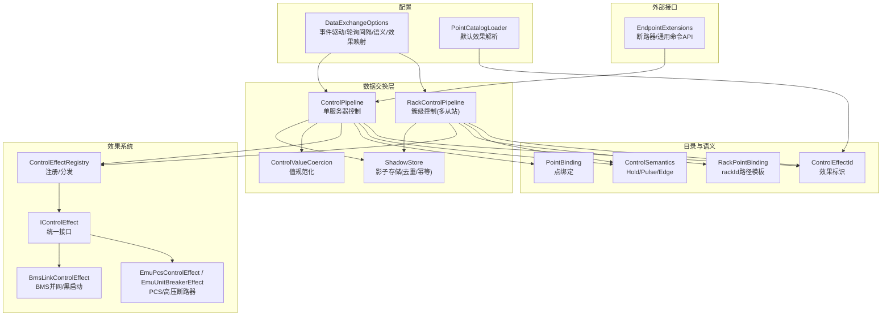
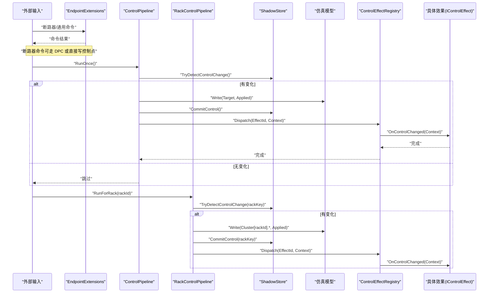
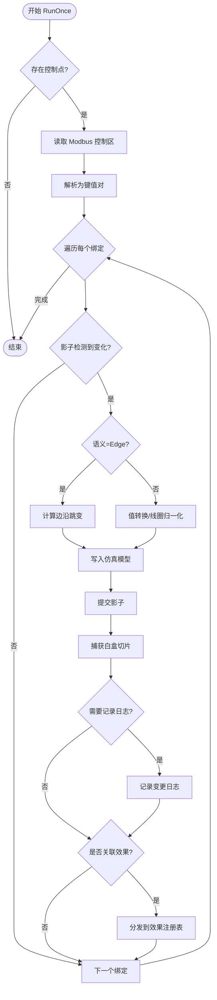
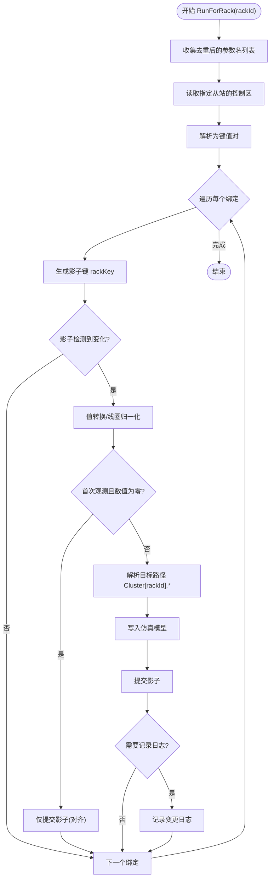
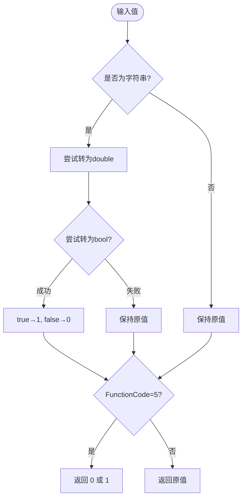
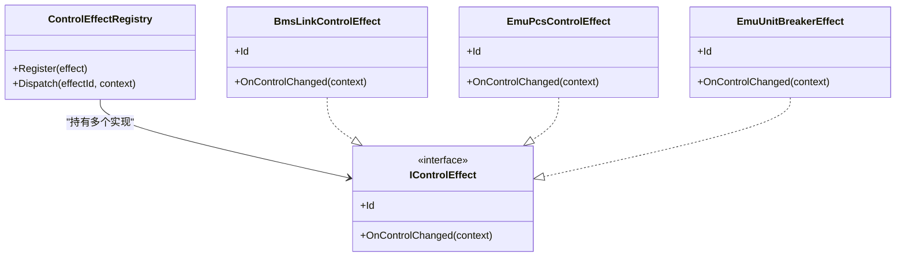
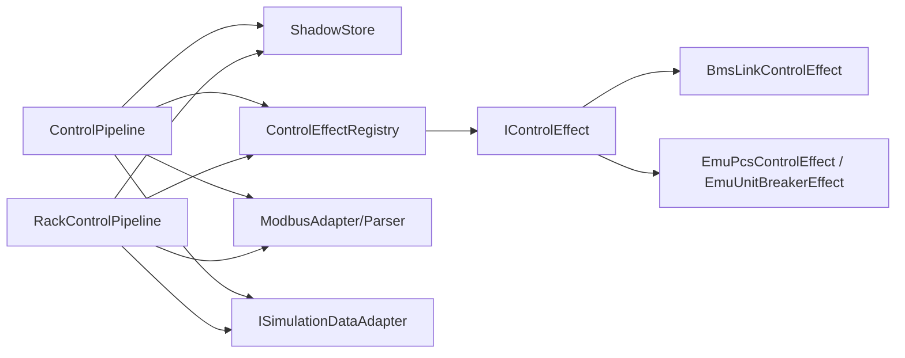

# 控制命令管道

<cite>
**本文引用的文件**
- [ControlPipeline.cs](file://DataExchange/Pipeline/ControlPipeline.cs)
- [RackControlPipeline.cs](file://DataExchange/Pipeline/RackControlPipeline.cs)
- [ControlValueCoercion.cs](file://DataExchange/Pipeline/ControlValueCoercion.cs)
- [ShadowStore.cs](file://DataExchange/Pipeline/ShadowStore.cs)
- [PointBinding.cs](file://DataExchange/Catalog/PointBinding.cs)
- [ControlSemantics.cs](file://DataExchange/Catalog/ControlSemantics.cs)
- [ControlEffectId.cs](file://DataExchange/Catalog/ControlEffectId.cs)
- [RackPointBinding.cs](file://DataExchange/Catalog/RackPointBinding.cs)
- [ControlEffectRegistry.cs](file://DataExchange/Effects/ControlEffectRegistry.cs)
- [IControlEffect.cs](file://DataExchange/Effects/IControlEffect.cs)
- [BmsControlEffects.cs](file://DataExchange/Effects/BmsControlEffects.cs)
- [EmuControlEffects.cs](file://DataExchange/Effects/EmuControlEffects.cs)
- [DataExchangeOptions.cs](file://DataExchange/Config/DataExchangeOptions.cs)
- [PointCatalogLoader.cs](file://DataExchange/Catalog/PointCatalogLoader.cs)
- [EndpointExtensions.cs](file://Web/EndpointExtensions.cs)
- [ControlPipelineDpcTests.cs](file://EssSimulator.Tests/DataExchange/ControlPipelineDpcTests.cs)
</cite>

## 目录
1. [简介](#简介)
2. [项目结构](#项目结构)
3. [核心组件](#核心组件)
4. [架构总览](#架构总览)
5. [详细组件分析](#详细组件分析)
6. [依赖关系分析](#依赖关系分析)
7. [性能考虑](#性能考虑)
8. [故障排查指南](#故障排查指南)
9. [结论](#结论)
10. [附录](#附录)

## 简介
本文件面向“控制命令管道”的完整链路：从外部输入（Modbus/网页/命令行）到仿真模型的控制写入、校验与执行调度。重点覆盖：
- 控制命令接收、解析、去重与幂等性保证
- 值转换与类型适配（含线圈/寄存器、单位换算策略）
- 簇级控制能力（RackControlPipeline 的多从站分发与结果聚合）
- 控制效果注册与执行（PCS 启停、断路器操作等）
- 配置项（事件驱动模式、轮询间隔、语义与效果映射）
- 调试工具与性能优化建议

## 项目结构
控制命令管道位于 DataExchange/Pipeline，围绕“点绑定 + 影子存储 + 适配器 + 效果注册表”组织；控制语义与效果在 Catalog 与 Effects 中定义；配置集中在 Config；Web 入口通过 EndpointExtensions 暴露断路器与通用命令接口；测试用例验证关键行为。

图表来源
- [ControlPipeline.cs:42-99](file://DataExchange/Pipeline/ControlPipeline.cs#L42-L99)
- [RackControlPipeline.cs:53-114](file://DataExchange/Pipeline/RackControlPipeline.cs#L53-L114)
- [ShadowStore.cs:24-37](file://DataExchange/Pipeline/ShadowStore.cs#L24-L37)
- [ControlValueCoercion.cs:8-29](file://DataExchange/Pipeline/ControlValueCoercion.cs#L8-L29)
- [PointBinding.cs:1-12](file://DataExchange/Catalog/PointBinding.cs#L1-L12)
- [ControlSemantics.cs:3-14](file://DataExchange/Catalog/ControlSemantics.cs#L3-L14)
- [ControlEffectId.cs:3-9](file://DataExchange/Catalog/ControlEffectId.cs#L3-L9)
- [RackPointBinding.cs:4-11](file://DataExchange/Catalog/RackPointBinding.cs#L4-L11)
- [ControlEffectRegistry.cs:5-22](file://DataExchange/Effects/ControlEffectRegistry.cs#L5-L22)
- [IControlEffect.cs:5-17](file://DataExchange/Effects/IControlEffect.cs#L5-L17)
- [BmsControlEffects.cs:7-29](file://DataExchange/Effects/BmsControlEffects.cs#L7-L29)
- [EmuControlEffects.cs:11-65](file://DataExchange/Effects/EmuControlEffects.cs#L11-L65)
- [DataExchangeOptions.cs:5-22](file://DataExchange/Config/DataExchangeOptions.cs#L5-L22)
- [PointCatalogLoader.cs:176-211](file://DataExchange/Catalog/PointCatalogLoader.cs#L176-L211)
- [EndpointExtensions.cs:228-247](file://Web/EndpointExtensions.cs#L228-L247)

章节来源
- [ControlPipeline.cs:42-99](file://DataExchange/Pipeline/ControlPipeline.cs#L42-L99)
- [RackControlPipeline.cs:53-114](file://DataExchange/Pipeline/RackControlPipeline.cs#L53-L114)
- [ShadowStore.cs:24-37](file://DataExchange/Pipeline/ShadowStore.cs#L24-L37)
- [ControlValueCoercion.cs:8-29](file://DataExchange/Pipeline/ControlValueCoercion.cs#L8-L29)
- [PointBinding.cs:1-12](file://DataExchange/Catalog/PointBinding.cs#L1-L12)
- [ControlSemantics.cs:3-14](file://DataExchange/Catalog/ControlSemantics.cs#L3-L14)
- [ControlEffectId.cs:3-9](file://DataExchange/Catalog/ControlEffectId.cs#L3-L9)
- [RackPointBinding.cs:4-11](file://DataExchange/Catalog/RackPointBinding.cs#L4-L11)
- [ControlEffectRegistry.cs:5-22](file://DataExchange/Effects/ControlEffectRegistry.cs#L5-L22)
- [IControlEffect.cs:5-17](file://DataExchange/Effects/IControlEffect.cs#L5-L17)
- [BmsControlEffects.cs:7-29](file://DataExchange/Effects/BmsControlEffects.cs#L7-L29)
- [EmuControlEffects.cs:11-65](file://DataExchange/Effects/EmuControlEffects.cs#L11-L65)
- [DataExchangeOptions.cs:5-22](file://DataExchange/Config/DataExchangeOptions.cs#L5-L22)
- [PointCatalogLoader.cs:176-211](file://DataExchange/Catalog/PointCatalogLoader.cs#L176-L211)
- [EndpointExtensions.cs:228-247](file://Web/EndpointExtensions.cs#L228-L247)

## 核心组件
- ControlPipeline：单服务器控制主流程，负责读取 Modbus 控制区、解析、去重、边沿检测、值转换、写入仿真、记录影子、触发白盒切片、派发控制效果。
- RackControlPipeline：簇级控制，按 rackId 遍历从站，批量读取并写回 Cluster[rackId].* 路径，支持首次观测对齐与数值零值保护。
- ShadowStore：影子存储，提供遥测/控制的变更检测与提交，实现幂等与去抖。
- ControlValueCoercion：将字符串/布尔/数值转换为 Modbus 寄存器期望格式（线圈为 0/1）。
- PointBinding/RackPointBinding：描述控制点与目标路径的绑定关系，支持 rackId 占位符替换。
- ControlSemantics：控制语义（保持/脉冲/边沿），决定写入与副作用触发时机。
- ControlEffectRegistry + IControlEffect：控制效果注册与分发机制，解耦具体业务逻辑。
- BmsControlEffects/EmuControlEffects：具体效果实现，驱动 PCS 指令应用与断路器状态同步。
- DataExchangeOptions：控制管道运行参数（事件驱动、轮询间隔、语义/效果映射）。
- PointCatalogLoader：根据点绑定与配置推导默认控制效果。
- EndpointExtensions：Web 断路器与通用命令入口，最终落到控制管道或 DPC 指令。

章节来源
- [ControlPipeline.cs:42-99](file://DataExchange/Pipeline/ControlPipeline.cs#L42-L99)
- [RackControlPipeline.cs:53-114](file://DataExchange/Pipeline/RackControlPipeline.cs#L53-L114)
- [ShadowStore.cs:24-37](file://DataExchange/Pipeline/ShadowStore.cs#L24-L37)
- [ControlValueCoercion.cs:8-29](file://DataExchange/Pipeline/ControlValueCoercion.cs#L8-L29)
- [PointBinding.cs:1-12](file://DataExchange/Catalog/PointBinding.cs#L1-L12)
- [RackPointBinding.cs:4-11](file://DataExchange/Catalog/RackPointBinding.cs#L4-L11)
- [ControlSemantics.cs:3-14](file://DataExchange/Catalog/ControlSemantics.cs#L3-L14)
- [ControlEffectRegistry.cs:5-22](file://DataExchange/Effects/ControlEffectRegistry.cs#L5-L22)
- [IControlEffect.cs:5-17](file://DataExchange/Effects/IControlEffect.cs#L5-L17)
- [BmsControlEffects.cs:7-29](file://DataExchange/Effects/BmsControlEffects.cs#L7-L29)
- [EmuControlEffects.cs:11-65](file://DataExchange/Effects/EmuControlEffects.cs#L11-L65)
- [DataExchangeOptions.cs:5-22](file://DataExchange/Config/DataExchangeOptions.cs#L5-L22)
- [PointCatalogLoader.cs:176-211](file://DataExchange/Catalog/PointCatalogLoader.cs#L176-L211)
- [EndpointExtensions.cs:228-247](file://Web/EndpointExtensions.cs#L228-L247)

## 架构总览
控制命令从外部进入后，经 Web/命令行或 Modbus 到达数据交换层，由 ControlPipeline 或 RackControlPipeline 进行解析与校验，写入仿真模型，并通过 ControlEffectRegistry 触发相应的高级控制逻辑（如 PCS 指令应用、断路器状态同步）。

图表来源
- [ControlPipeline.cs:42-99](file://DataExchange/Pipeline/ControlPipeline.cs#L42-L99)
- [RackControlPipeline.cs:53-114](file://DataExchange/Pipeline/RackControlPipeline.cs#L53-L114)
- [ShadowStore.cs:24-37](file://DataExchange/Pipeline/ShadowStore.cs#L24-L37)
- [ControlEffectRegistry.cs:15-22](file://DataExchange/Effects/ControlEffectRegistry.cs#L15-L22)
- [EndpointExtensions.cs:228-247](file://Web/EndpointExtensions.cs#L228-L247)

## 详细组件分析

### ControlPipeline：单服务器控制主流程
- 功能要点
  - 批量读取 Modbus 控制区，解析为键值对
  - 使用 ShadowStore 检测变化，避免重复写入
  - 边沿型控制点仅在有跳变时生效（0→1 或 1→0）
  - 值转换：字符串/布尔/数值到目标类型，线圈强制 0/1
  - 写入仿真模型，提交影子，记录日志，捕获白盒切片
  - 根据绑定中的 Effect 标识，分发到控制效果处理器
- 复杂度与性能
  - 每周期 O(N) 遍历控制点集合，N 为绑定点数
  - 读写仿真模型为关键路径，应尽量减少无效写入
- 错误处理
  - 写入失败记录警告并继续处理其他点
  - 边沿检测失败则跳过该点

图表来源
- [ControlPipeline.cs:42-99](file://DataExchange/Pipeline/ControlPipeline.cs#L42-L99)
- [ControlPipeline.cs:105-167](file://DataExchange/Pipeline/ControlPipeline.cs#L105-L167)
- [ShadowStore.cs:24-37](file://DataExchange/Pipeline/ShadowStore.cs#L24-L37)

章节来源
- [ControlPipeline.cs:42-99](file://DataExchange/Pipeline/ControlPipeline.cs#L42-L99)
- [ControlPipeline.cs:105-167](file://DataExchange/Pipeline/ControlPipeline.cs#L105-L167)
- [ShadowStore.cs:24-37](file://DataExchange/Pipeline/ShadowStore.cs#L24-L37)

### RackControlPipeline：簇级控制（多从站分发与结果聚合）
- 功能要点
  - 按 clusterCount 遍历 rackId，构造 slaveId = baseSlaveId + rackId + 1
  - 批量读取各从站控制区，解析后逐点写入 Cluster[rackId].* 路径
  - 首次观测且值为数值零时，仅对齐影子，避免覆盖模型默认门限
  - 值转换：字符串/布尔/数值到 float，线圈强制 bool
- 幂等性与一致性
  - 使用 rackKey = "{rackId}:{paramName}" 作为影子键，确保各 rack 独立去重
  - 写入失败记录警告，不影响其他 rack 处理
- 性能特性
  - 循环内批量读取与解析，减少网络往返
  - 仅在值变化时写入仿真，降低模型压力

图表来源
- [RackControlPipeline.cs:53-114](file://DataExchange/Pipeline/RackControlPipeline.cs#L53-L114)
- [RackControlPipeline.cs:116-154](file://DataExchange/Pipeline/RackControlPipeline.cs#L116-L154)

章节来源
- [RackControlPipeline.cs:53-114](file://DataExchange/Pipeline/RackControlPipeline.cs#L53-L114)
- [RackControlPipeline.cs:116-154](file://DataExchange/Pipeline/RackControlPipeline.cs#L116-L154)

### ControlValueCoercion：值转换机制
- 功能要点
  - 字符串转 double/bool，bool 转 1/0
  - 线圈（FunctionCode=5）强制输出 0/1
  - 非线圈保持原始值，交由上层适配
- 适用场景
  - 用于向 Modbus 寄存器写入前的规范化，确保协议一致
  - 与 Pipeline 内部值转换互补，分别面向不同写入目标

图表来源
- [ControlValueCoercion.cs:8-29](file://DataExchange/Pipeline/ControlValueCoercion.cs#L8-L29)

章节来源
- [ControlValueCoercion.cs:8-29](file://DataExchange/Pipeline/ControlValueCoercion.cs#L8-L29)

### 控制效果注册与执行（PCS 启停、断路器操作）
- 注册与分发
  - ControlEffectRegistry 维护 effectId → IControlEffect 映射
  - Pipeline 在写入成功后根据绑定中的 Effect 标识调用 Dispatch
- 具体效果
  - BmsLinkControlEffect：解析 simBmsX 通道，触发 BMS 并网/黑启动状态机
  - EmuPcsControlEffect：解析 simEmuX 单元，应用 PCS 指令并同步状态，请求即时推送
  - EmuUnitBreakerEffect：将 emu.PowerOnOff 映射为电气网络单元断路器闭合/断开
- 默认效果解析
  - PointCatalogLoader 根据 isEmu/isBms 与目标属性路径推断默认效果（如 pcsOnOffSwitch、BlackStartEnabled、PowerOnOff 等）

图表来源
- [ControlEffectRegistry.cs:5-22](file://DataExchange/Effects/ControlEffectRegistry.cs#L5-L22)
- [IControlEffect.cs:5-17](file://DataExchange/Effects/IControlEffect.cs#L5-L17)
- [BmsControlEffects.cs:7-29](file://DataExchange/Effects/BmsControlEffects.cs#L7-L29)
- [EmuControlEffects.cs:11-65](file://DataExchange/Effects/EmuControlEffects.cs#L11-L65)
- [PointCatalogLoader.cs:176-211](file://DataExchange/Catalog/PointCatalogLoader.cs#L176-L211)

章节来源
- [ControlEffectRegistry.cs:5-22](file://DataExchange/Effects/ControlEffectRegistry.cs#L5-L22)
- [IControlEffect.cs:5-17](file://DataExchange/Effects/IControlEffect.cs#L5-L17)
- [BmsControlEffects.cs:7-29](file://DataExchange/Effects/BmsControlEffects.cs#L7-L29)
- [EmuControlEffects.cs:11-65](file://DataExchange/Effects/EmuControlEffects.cs#L11-L65)
- [PointCatalogLoader.cs:176-211](file://DataExchange/Catalog/PointCatalogLoader.cs#L176-L211)

### 控制命令的幂等性、冲突检测与回滚
- 幂等性
  - ShadowStore 基于 ValuesEqual 比较新旧值，相同值不触发写入，避免重复操作
  - 布尔与数值采用容差比较，防止浮点误差导致误判
- 冲突检测
  - 边沿型控制点仅在跳变时生效，避免持续抖动造成多次触发
  - 首次观测且数值为零时，RackControlPipeline 仅对齐影子，避免覆盖模型默认门限
- 回滚机制
  - 当前实现未显式回滚；若写入失败，仅记录警告并继续处理后续点
  - 建议在关键路径增加事务或快照对比，必要时恢复前值

章节来源
- [ShadowStore.cs:24-37](file://DataExchange/Pipeline/ShadowStore.cs#L24-L37)
- [ShadowStore.cs:39-56](file://DataExchange/Pipeline/ShadowStore.cs#L39-L56)
- [RackControlPipeline.cs:90-107](file://DataExchange/Pipeline/RackControlPipeline.cs#L90-L107)
- [ControlPipeline.cs:62-78](file://DataExchange/Pipeline/ControlPipeline.cs#L62-L78)

### 控制管道的配置选项
- DataExchangeOptions
  - TelemetryIntervalMs/EmuTelemetryIntervalMs：遥测刷新周期（ms）
  - ControlEventDriven：是否在外部写控制区后立即触发控制管道（轮询仍兜底）
  - ControlPollIntervalMs：轮询间隔（ms）
  - ControlSemantics/ControlEffects：点级语义与效果映射字典
- PointCatalogLoader
  - 根据 isEmu/isBms 与目标属性路径推导默认效果（如 PCS 指令、高压断路器）

章节来源
- [DataExchangeOptions.cs:5-22](file://DataExchange/Config/DataExchangeOptions.cs#L5-L22)
- [PointCatalogLoader.cs:176-211](file://DataExchange/Catalog/PointCatalogLoader.cs#L176-L211)

### 外部入口与调试工具
- Web 入口
  - 断路器控制：/api/breaker/main/{closed}、/api/breaker/unit/{unit}/{closed}
  - 通用命令：POST /api/command，body 包含 input
- 调试建议
  - 启用 logControlChanges 记录控制变更日志
  - 使用测试用例模拟 Modbus/仿真适配器，验证边界行为（如 DPC 停止时不反转）
  - 观察白盒切片捕获，辅助定位 EMS 设定瞬间的行为

章节来源
- [EndpointExtensions.cs:228-247](file://Web/EndpointExtensions.cs#L228-L247)
- [ControlPipeline.cs:83-87](file://DataExchange/Pipeline/ControlPipeline.cs#L83-L87)
- [ControlPipelineDpcTests.cs:78-105](file://EssSimulator.Tests/DataExchange/ControlPipelineDpcTests.cs#L78-L105)

## 依赖关系分析
- 组件耦合
  - ControlPipeline/RackControlPipeline 依赖 ShadowStore 做去重，依赖 ControlEffectRegistry 做效果分发
  - 效果实现依赖具体服务（BMS Link Engine、PCS Mapper、SnapshotService）
- 外部依赖
  - Modbus 适配器与解析器负责协议层交互
  - 仿真模型通过 ISimulationDataAdapter 抽象写入目标
- 潜在环路
  - 效果中不应直接触发同一控制点的再次写入，避免循环
- 接口契约
  - IControlEffect 统一 OnControlChanged 上下文，便于扩展新效果

图表来源
- [ControlPipeline.cs:42-99](file://DataExchange/Pipeline/ControlPipeline.cs#L42-L99)
- [RackControlPipeline.cs:53-114](file://DataExchange/Pipeline/RackControlPipeline.cs#L53-L114)
- [ControlEffectRegistry.cs:5-22](file://DataExchange/Effects/ControlEffectRegistry.cs#L5-L22)
- [IControlEffect.cs:5-17](file://DataExchange/Effects/IControlEffect.cs#L5-L17)
- [BmsControlEffects.cs:7-29](file://DataExchange/Effects/BmsControlEffects.cs#L7-L29)
- [EmuControlEffects.cs:11-65](file://DataExchange/Effects/EmuControlEffects.cs#L11-L65)

章节来源
- [ControlPipeline.cs:42-99](file://DataExchange/Pipeline/ControlPipeline.cs#L42-L99)
- [RackControlPipeline.cs:53-114](file://DataExchange/Pipeline/RackControlPipeline.cs#L53-L114)
- [ControlEffectRegistry.cs:5-22](file://DataExchange/Effects/ControlEffectRegistry.cs#L5-L22)
- [IControlEffect.cs:5-17](file://DataExchange/Effects/IControlEffect.cs#L5-L17)
- [BmsControlEffects.cs:7-29](file://DataExchange/Effects/BmsControlEffects.cs#L7-L29)
- [EmuControlEffects.cs:11-65](file://DataExchange/Effects/EmuControlEffects.cs#L11-L65)

## 性能考虑
- 减少无效写入
  - 利用 ShadowStore 的去重机制，避免重复写入
  - 边沿型控制点仅在跳变时生效，降低触发频率
- 批量处理
  - 控制管道批量读取 Modbus 控制区，减少网络往返
  - RackControlPipeline 按 rackId 循环，集中处理，提高吞吐
- 日志与监控
  - 按需开启 logControlChanges，避免高频日志影响性能
  - 使用白盒切片捕获关键瞬态，辅助性能分析
- 配置调优
  - 合理设置 ControlEventDriven 与 ControlPollIntervalMs，平衡实时性与负载
  - 调整 TelemetryIntervalMs/EmuTelemetryIntervalMs 以匹配系统响应需求

[本节为通用指导，无需特定文件引用]

## 故障排查指南
- 常见问题
  - 控制写入失败：检查仿真模型路径与目标属性是否存在，查看警告日志
  - 边沿未触发：确认语义为 Edge 且确实发生跳变
  - 簇级控制未生效：检查 rackId 范围、baseSlaveId 与从站地址映射
- 调试步骤
  - 启用日志记录，观察变更日志与警告信息
  - 使用测试用例模拟输入，验证边界行为（如 DPC 停止时不反转）
  - 检查默认效果解析是否正确（PointCatalogLoader）
- 回滚与恢复
  - 当前未实现自动回滚；可在关键路径引入快照对比，必要时恢复前值

章节来源
- [ControlPipeline.cs:72-78](file://DataExchange/Pipeline/ControlPipeline.cs#L72-L78)
- [RackControlPipeline.cs:100-107](file://DataExchange/Pipeline/RackControlPipeline.cs#L100-L107)
- [ControlPipelineDpcTests.cs:78-105](file://EssSimulator.Tests/DataExchange/ControlPipelineDpcTests.cs#L78-L105)
- [PointCatalogLoader.cs:176-211](file://DataExchange/Catalog/PointCatalogLoader.cs#L176-L211)

## 结论
控制命令管道通过“点绑定 + 影子存储 + 值转换 + 效果注册”实现了从外部输入到仿真模型的可靠控制链路。ControlPipeline 与 RackControlPipeline 分别覆盖单服务器与簇级场景，配合 ShadowStore 保证幂等与去重，借助 ControlEffectRegistry 解耦高级控制逻辑。通过合理的配置与调试手段，可实现高效、稳定、可扩展的控制体系。

[本节为总结，无需特定文件引用]

## 附录
- 术语
  - 保持型（Hold）：Modbus 值与仿真目标保持一致
  - 脉冲型（Pulse）：有效写入后触发一次，随后归零
  - 边沿型（Edge）：值变化时触发副作用，可配合仿真回写
- 最佳实践
  - 明确控制语义，避免误用导致频繁触发
  - 合理使用默认效果映射，简化配置
  - 在高并发场景下，优先使用事件驱动模式，降低轮询开销

[本节为补充说明，无需特定文件引用]