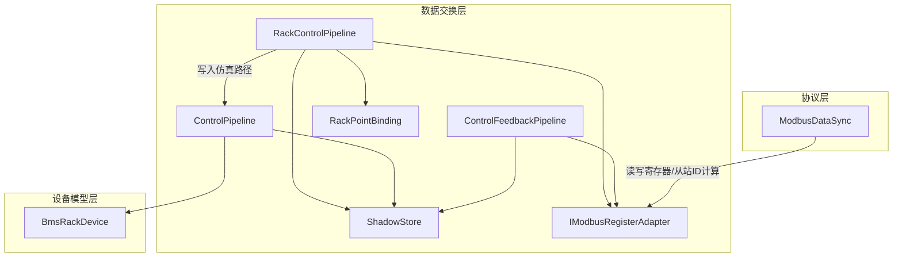
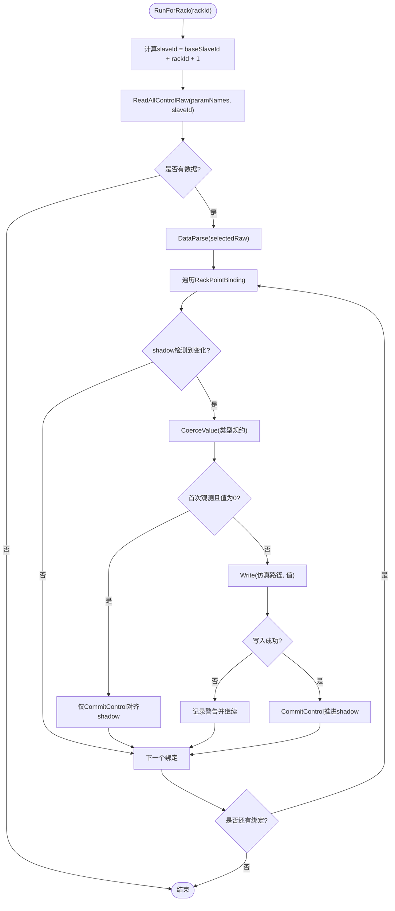
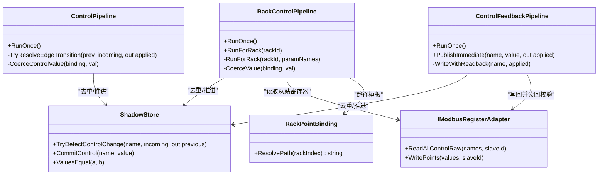
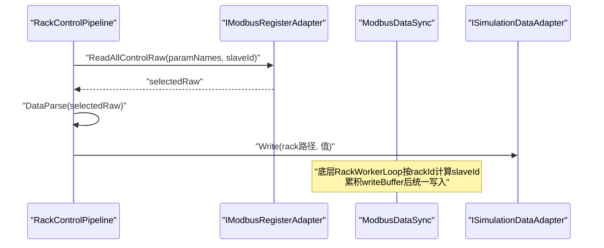
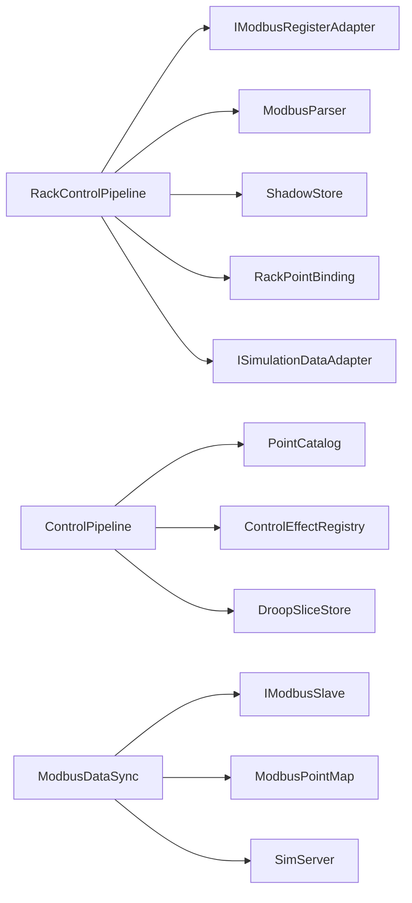

# 簇级控制管道

<cite>
**本文引用的文件**
- [RackControlPipeline.cs](file://DataExchange/Pipeline/RackControlPipeline.cs)
- [ControlPipeline.cs](file://DataExchange/Pipeline/ControlPipeline.cs)
- [ControlFeedbackPipeline.cs](file://DataExchange/Pipeline/ControlFeedbackPipeline.cs)
- [ShadowStore.cs](file://DataExchange/Pipeline/ShadowStore.cs)
- [RackPointBinding.cs](file://DataExchange/Catalog/RackPointBinding.cs)
- [IModbusRegisterAdapter.cs](file://DataExchange/Adapters/IModbusRegisterAdapter.cs)
- [ModbusDataSync.cs](file://Protocol/Modbus/ModbusDataSync.cs)
- [BmsRackDevice.cs](file://EssDeviceSimModel/Devices/BmsRackDevice.cs)
- [DataExchangeOptions.cs](file://DataExchange/Config/DataExchangeOptions.cs)
- [appsettings.json](file://appsettings.json)
- [ControlFeedbackPipelineTests.cs](file://EssSimulator.Tests/DataExchange/ControlFeedbackPipelineTests.cs)
</cite>

## 目录
1. [简介](#简介)
2. [项目结构](#项目结构)
3. [核心组件](#核心组件)
4. [架构总览](#架构总览)
5. [详细组件分析](#详细组件分析)
6. [依赖关系分析](#依赖关系分析)
7. [性能考虑](#性能考虑)
8. [故障诊断指南](#故障诊断指南)
9. [结论](#结论)
10. [附录](#附录)

## 简介
本文件面向“簇级控制管道”，聚焦 RackControlPipeline 的设计目标、适用场景与实现细节。其核心目标是：将来自 Modbus 的簇级控制命令（FC5/6/16）按 rackId 分解为多个从站的子命令，批量写入仿真模型对应路径；通过 ShadowStore 去重与变更检测，避免无效 I/O；并与基础控制管道（ControlPipeline）和反馈管道（ControlFeedbackPipeline）协同工作，确保控制优先级、副作用触发与一致性。文档同时覆盖结果聚合策略、错误处理、性能优化（批处理与并行）、配置项（从站发现、轮询周期等）以及监控指标与故障定位方法。

## 项目结构
簇级控制相关代码主要位于 DataExchange/Pipeline 与 Protocol/Modbus 层，配合 Catalog 中的 RackPointBinding 完成 rackId 到仿真路径的映射；底层通过 IModbusRegisterAdapter 访问 Modbus 寄存器，并通过 ISimulationDataAdapter 写入仿真模型。



图表来源
- [RackControlPipeline.cs:1-157](file://DataExchange/Pipeline/RackControlPipeline.cs#L1-L157)
- [ControlPipeline.cs:1-176](file://DataExchange/Pipeline/ControlPipeline.cs#L1-L176)
- [ControlFeedbackPipeline.cs:1-131](file://DataExchange/Pipeline/ControlFeedbackPipeline.cs#L1-L131)
- [ShadowStore.cs:1-59](file://DataExchange/Pipeline/ShadowStore.cs#L1-L59)
- [RackPointBinding.cs:1-14](file://DataExchange/Catalog/RackPointBinding.cs#L1-L14)
- [IModbusRegisterAdapter.cs:1-11](file://DataExchange/Adapters/IModbusRegisterAdapter.cs#L1-L11)
- [ModbusDataSync.cs:1-486](file://Protocol/Modbus/ModbusDataSync.cs#L1-L486)
- [BmsRackDevice.cs:1-167](file://EssDeviceSimModel/Devices/BmsRackDevice.cs#L1-L167)

章节来源
- [RackControlPipeline.cs:1-157](file://DataExchange/Pipeline/RackControlPipeline.cs#L1-L157)
- [ControlPipeline.cs:1-176](file://DataExchange/Pipeline/ControlPipeline.cs#L1-L176)
- [ControlFeedbackPipeline.cs:1-131](file://DataExchange/Pipeline/ControlFeedbackPipeline.cs#L1-L131)
- [ShadowStore.cs:1-59](file://DataExchange/Pipeline/ShadowStore.cs#L1-L59)
- [RackPointBinding.cs:1-14](file://DataExchange/Catalog/RackPointBinding.cs#L1-L14)
- [IModbusRegisterAdapter.cs:1-11](file://DataExchange/Adapters/IModbusRegisterAdapter.cs#L1-L11)
- [ModbusDataSync.cs:1-486](file://Protocol/Modbus/ModbusDataSync.cs#L1-L486)
- [BmsRackDevice.cs:1-167](file://EssDeviceSimModel/Devices/BmsRackDevice.cs#L1-L167)

## 核心组件
- RackControlPipeline：簇级控制主流程，按 rackId 循环读取 Modbus 寄存器，解析后写入仿真模型对应路径，并维护 rackId 维度的 shadow 状态。
- ControlPipeline：基础控制管道，负责全局控制点（非 rack 维度）的变更检测、值规约、边沿触发、副作用派发与白盒切片采集。
- ControlFeedbackPipeline：仿真 → Modbus 的控制反馈回写，带读回校验与 shadow 推进。
- ShadowStore：控制/遥测值的去重与变更检测，提供 ValuesEqual 比较与 CommitControl 推进。
- RackPointBinding：rack 级点绑定，支持 rackId 占位符替换生成仿真路径。
- IModbusRegisterAdapter：Modbus 寄存器读写抽象接口，支持按 slaveId 选择从站。
- ModbusDataSync：底层 Modbus 同步调度，包含 rack worker 线程、从站 ID 计算与 rack shadow 缓存。
- BmsRackDevice：BMS 机架设备，承载物理模型与保护评估，是仿真路径的目标之一。

章节来源
- [RackControlPipeline.cs:1-157](file://DataExchange/Pipeline/RackControlPipeline.cs#L1-L157)
- [ControlPipeline.cs:1-176](file://DataExchange/Pipeline/ControlPipeline.cs#L1-L176)
- [ControlFeedbackPipeline.cs:1-131](file://DataExchange/Pipeline/ControlFeedbackPipeline.cs#L1-L131)
- [ShadowStore.cs:1-59](file://DataExchange/Pipeline/ShadowStore.cs#L1-L59)
- [RackPointBinding.cs:1-14](file://DataExchange/Catalog/RackPointBinding.cs#L1-L14)
- [IModbusRegisterAdapter.cs:1-11](file://DataExchange/Adapters/IModbusRegisterAdapter.cs#L1-L11)
- [ModbusDataSync.cs:1-486](file://Protocol/Modbus/ModbusDataSync.cs#L1-L486)
- [BmsRackDevice.cs:1-167](file://EssDeviceSimModel/Devices/BmsRackDevice.cs#L1-L167)

## 架构总览
簇级控制管道的整体数据流如下：上层通过 Modbus 下发 FC5/6/16 控制命令，RackControlPipeline 按 rackId 拆分并批量写入仿真模型；ControlPipeline 处理全局控制点；ControlFeedbackPipeline 将仿真侧控制结果回写到 Modbus 并校验；ShadowStore 贯穿全链路进行去重与一致性保障；ModbusDataSync 在底层按 rack 分组并发刷新数据寄存器与控制寄存器。

```mermaid
sequenceDiagram
participant EMS as "EMS/上位机"
participant RCP as "RackControlPipeline"
participant MOD as "IModbusRegisterAdapter"
participant PAR as "ModbusParser"
participant SIM as "ISimulationDataAdapter"
participant SH as "ShadowStore"
participant CP as "ControlPipeline"
participant CFP as "ControlFeedbackPipeline"
EMS->>MOD : "下发簇级控制(FC5/6/16)"
RCP->>MOD : "ReadAllControlRaw(paramNames, slaveId=rack)"
MOD-->>RCP : "原始寄存器值"
RCP->>PAR : "DataParse(selectedRaw)"
PAR-->>RCP : "解析后的键值对"
RCP->>SH : "TryDetectControlChange(rack : paramName)"
alt 有变化
RCP->>SIM : "Write(rackId路径, 规约后值)"
SIM-->>RCP : "成功/失败"
RCP->>SH : "CommitControl(rack : paramName, 值)"
else 无变化
RCP-->>EMS : "跳过"
end
Note over CP,CFP : "全局控制由 ControlPipeline 处理<br/>仿真→Modbus 反馈由 ControlFeedbackPipeline 处理"
```

图表来源
- [RackControlPipeline.cs:53-114](file://DataExchange/Pipeline/RackControlPipeline.cs#L53-L114)
- [ControlPipeline.cs:42-99](file://DataExchange/Pipeline/ControlPipeline.cs#L42-L99)
- [ControlFeedbackPipeline.cs:34-62](file://DataExchange/Pipeline/ControlFeedbackPipeline.cs#L34-L62)
- [ShadowStore.cs:24-31](file://DataExchange/Pipeline/ShadowStore.cs#L24-L31)

## 详细组件分析

### RackControlPipeline：簇级命令分发与批量写入
- 设计目标：将一次簇级控制请求按 rackId 分解为多个从站的子命令，批量读取、解析、写入仿真模型，减少 I/O 次数。
- 命令分解机制：
  - 遍历 rackId ∈ [0, clusterCount)，计算 slaveId = baseSlaveId + rackId + 1。
  - 对每个 rack 调用 ReadAllControlRaw(paramNames, slaveId) 获取该从站寄存器集合。
  - 使用 ModbusParser.DataParse 解析为键值对，再按 RackPointBinding 匹配参数名。
  - 通过 RackPointBinding.ResolvePath(rackId) 生成仿真路径（模板中 rackId 替换）。
- 值规约与边界处理：
  - CoerceValue 将字符串转为数值或布尔；FC5 线圈类型强制为 bool。
  - 首次观测且值为数值零时，仅对齐 shadow，避免覆盖模型默认门限。
- 结果聚合与错误处理：
  - 每次 Write 成功后 CommitControl 推进 shadow；失败记录警告日志并继续处理其他点。
  - 可选日志开关输出变更轨迹。



图表来源
- [RackControlPipeline.cs:73-114](file://DataExchange/Pipeline/RackControlPipeline.cs#L73-L114)
- [RackPointBinding.cs:10-11](file://DataExchange/Catalog/RackPointBinding.cs#L10-L11)
- [ShadowStore.cs:24-31](file://DataExchange/Pipeline/ShadowStore.cs#L24-L31)

章节来源
- [RackControlPipeline.cs:53-114](file://DataExchange/Pipeline/RackControlPipeline.cs#L53-L114)
- [RackPointBinding.cs:1-14](file://DataExchange/Catalog/RackPointBinding.cs#L1-L14)
- [ShadowStore.cs:24-31](file://DataExchange/Pipeline/ShadowStore.cs#L24-L31)

### 与基础控制管道的协作：优先级与冲突解决
- 职责划分：
  - RackControlPipeline：针对 rackId 维度的控制点，按从站拆分并写入仿真路径。
  - ControlPipeline：针对全局控制点（非 rack），支持边沿语义（Edge）与 Hold 语义，并在写入后触发副作用（Effect）与白盒切片采集。
- 优先级与冲突：
  - 两者通过不同的 ParamName 空间与 Target 路径隔离；若存在同名但不同作用域的点，需通过 Catalog 与 RackPointBinding 的路径模板区分。
  - ShadowStore 保证同一 key 的去重与顺序一致；rack 级 key 采用 rackId:paramName 复合键，避免与全局 key 冲突。
- 副作用与一致性：
  - ControlPipeline 在写入后调用 ControlEffectRegistry.Dispatch 触发副作用；RackControlPipeline 不直接触发副作用，侧重路径写入与 shadow 推进。



图表来源
- [RackControlPipeline.cs:1-157](file://DataExchange/Pipeline/RackControlPipeline.cs#L1-L157)
- [ControlPipeline.cs:1-176](file://DataExchange/Pipeline/ControlPipeline.cs#L1-L176)
- [ControlFeedbackPipeline.cs:1-131](file://DataExchange/Pipeline/ControlFeedbackPipeline.cs#L1-L131)
- [ShadowStore.cs:1-59](file://DataExchange/Pipeline/ShadowStore.cs#L1-L59)
- [RackPointBinding.cs:1-14](file://DataExchange/Catalog/RackPointBinding.cs#L1-L14)
- [IModbusRegisterAdapter.cs:1-11](file://DataExchange/Adapters/IModbusRegisterAdapter.cs#L1-L11)

章节来源
- [RackControlPipeline.cs:53-114](file://DataExchange/Pipeline/RackControlPipeline.cs#L53-L114)
- [ControlPipeline.cs:42-99](file://DataExchange/Pipeline/ControlPipeline.cs#L42-L99)
- [ControlFeedbackPipeline.cs:34-62](file://DataExchange/Pipeline/ControlFeedbackPipeline.cs#L34-L62)
- [ShadowStore.cs:24-31](file://DataExchange/Pipeline/ShadowStore.cs#L24-L31)
- [RackPointBinding.cs:10-11](file://DataExchange/Catalog/RackPointBinding.cs#L10-L11)
- [IModbusRegisterAdapter.cs:5-8](file://DataExchange/Adapters/IModbusRegisterAdapter.cs#L5-L8)

### 结果聚合策略：响应差异与错误处理
- 差异处理：
  - 各 rack 的 slaveId 独立，ReadAllControlRaw 返回该从站的数据；解析后按绑定逐项处理，互不影响。
  - ShadowStore 以 rackId:paramName 作为唯一键，避免跨 rack 污染。
- 错误处理：
  - 写入失败记录警告日志并继续处理后续点，保证部分成功。
  - 首次观测且值为 0 时仅对齐 shadow，防止覆盖模型默认门限。
- 反馈一致性：
  - ControlFeedbackPipeline 写回后执行读回校验，不一致则记录警告并拒绝推进 shadow。

章节来源
- [RackControlPipeline.cs:90-114](file://DataExchange/Pipeline/RackControlPipeline.cs#L90-L114)
- [ControlFeedbackPipeline.cs:76-122](file://DataExchange/Pipeline/ControlFeedbackPipeline.cs#L76-L122)
- [ShadowStore.cs:24-31](file://DataExchange/Pipeline/ShadowStore.cs#L24-L31)

### 与底层 Modbus 同步的协作：从站发现与批处理
- 从站发现：
  - RackControlPipeline 通过 baseSlaveId + rackId + 1 计算 slaveId，按 rack 范围迭代。
  - ModbusDataSync 在 RackWorkerLoop 中同样按 rackId 计算 slaveId，并对每个 rack 批量写入数据寄存器。
- 批处理策略：
  - RackControlPipeline 在一次 RunForRack 内对选定 paramNames 批量读取与解析，减少网络往返。
  - ModbusDataSync 使用 writeBuffer 累积同 rack 的变更，统一写入，降低 I/O 频率。
- 并发与资源：
  - ModbusDataSync 为每个 modelType 启动 Worker 线程，rack 数据与控制数据分别处理，避免阻塞。



图表来源
- [RackControlPipeline.cs:73-114](file://DataExchange/Pipeline/RackControlPipeline.cs#L73-L114)
- [ModbusDataSync.cs:164-193](file://Protocol/Modbus/ModbusDataSync.cs#L164-L193)

章节来源
- [RackControlPipeline.cs:73-114](file://DataExchange/Pipeline/RackControlPipeline.cs#L73-L114)
- [ModbusDataSync.cs:164-193](file://Protocol/Modbus/ModbusDataSync.cs#L164-L193)

### 性能优化技术：并行与批处理
- 批处理：
  - RackControlPipeline 在同一 rack 内批量读取与解析，减少 Modbus 调用次数。
  - ModbusDataSync 的 RackWorkerLoop 使用 writeBuffer 累积变更，统一写入。
- 并行：
  - ModbusDataSync 为不同 modelType 启动独立 Worker 线程，rack 数据与控制数据分离处理。
  - 控制线程轮询间隔与休眠策略避免忙等，降低 CPU 占用。
- 去重：
  - ShadowStore 的 ValuesEqual 与 TryDetectControlChange 避免重复 I/O。

章节来源
- [ModbusDataSync.cs:114-193](file://Protocol/Modbus/ModbusDataSync.cs#L114-L193)
- [ShadowStore.cs:24-31](file://DataExchange/Pipeline/ShadowStore.cs#L24-L31)

### 配置选项：从站发现、超时与重试
- 从站发现：
  - RackControlPipeline 通过 baseSlaveId 与 clusterCount 计算 slaveId 范围。
  - appsettings.json 中 EssUnits.Bms.ClusterCount 定义簇数量。
- 轮询周期：
  - DataExchangeOptions.TelemetryIntervalMs / EmuTelemetryIntervalMs 控制遥测刷新周期。
  - DataExchangeOptions.ControlPollIntervalMs 控制控制轮询周期。
- 事件驱动：
  - DataExchangeOptions.ControlEventDriven 决定是否在外部写控制区后立即触发控制管道。
- 超时与重试：
  - 当前实现未显式暴露超时与重试参数；建议在 IModbusRegisterAdapter 实现层封装重试逻辑与超时控制。

章节来源
- [RackControlPipeline.cs:23-47](file://DataExchange/Pipeline/RackControlPipeline.cs#L23-L47)
- [DataExchangeOptions.cs:5-22](file://DataExchange/Config/DataExchangeOptions.cs#L5-L22)
- [appsettings.json:92-97](file://appsettings.json#L92-L97)
- [appsettings.json:180-208](file://appsettings.json#L180-L208)

### 监控指标与故障诊断
- 日志指标：
  - RackControlPipeline 输出 "[BMS-RackControl:change]" 日志，记录 rackId、参数名与值。
  - ControlFeedbackPipeline 输出 "[...-Feedback]" 与 "[...-Feedback:change]" 日志，记录写回与读回一致性。
  - ModbusDataSync 输出控制线程与工作线程的错误日志。
- 诊断要点：
  - 若 Write 失败，检查仿真路径是否正确（RackPointBinding.ResolvePath）。
  - 若反馈不一致，检查 Modbus 读回值与期望值是否相等（ShadowStore.ValuesEqual）。
  - 若首次观测被忽略，确认是否处于“首次观测且值为0”的对齐分支。

章节来源
- [RackControlPipeline.cs:100-114](file://DataExchange/Pipeline/RackControlPipeline.cs#L100-L114)
- [ControlFeedbackPipeline.cs:76-122](file://DataExchange/Pipeline/ControlFeedbackPipeline.cs#L76-L122)
- [ModbusDataSync.cs:197-252](file://Protocol/Modbus/ModbusDataSync.cs#L197-L252)

## 依赖关系分析
- RackControlPipeline 依赖：
  - IModbusRegisterAdapter：读取指定从站的寄存器。
  - ModbusParser：解析原始寄存器为键值对。
  - ShadowStore：去重与推进 shadow。
  - RackPointBinding：生成仿真路径。
  - ISimulationDataAdapter：写入仿真模型。
- ControlPipeline 依赖：
  - PointCatalog：全局控制点表。
  - ControlEffectRegistry：副作用派发。
  - DroopSliceStore：白盒切片采集。
- ModbusDataSync 依赖：
  - IModbusSlave：底层 Modbus 通信。
  - ModbusPointMap：点表映射。
  - SimServer：仿真变量读写。



图表来源
- [RackControlPipeline.cs:1-157](file://DataExchange/Pipeline/RackControlPipeline.cs#L1-L157)
- [ControlPipeline.cs:1-176](file://DataExchange/Pipeline/ControlPipeline.cs#L1-L176)
- [ModbusDataSync.cs:1-486](file://Protocol/Modbus/ModbusDataSync.cs#L1-L486)

章节来源
- [RackControlPipeline.cs:1-157](file://DataExchange/Pipeline/RackControlPipeline.cs#L1-L157)
- [ControlPipeline.cs:1-176](file://DataExchange/Pipeline/ControlPipeline.cs#L1-L176)
- [ModbusDataSync.cs:1-486](file://Protocol/Modbus/ModbusDataSync.cs#L1-L486)

## 性能考虑
- 批处理优先：在同一 rack 内批量读取与解析，减少网络往返。
- 去重优先：ShadowStore 避免重复 I/O，仅在值变化时触发写入。
- 并发隔离：ModbusDataSync 为不同 modelType 与 rack 数据启用独立线程，避免阻塞。
- 轮询节流：控制线程在无变化时休眠，降低 CPU 占用。
- 建议扩展：在 IModbusRegisterAdapter 实现层增加超时与重试策略，提升鲁棒性。

[本节为通用指导，无需特定文件来源]

## 故障诊断指南
- 常见问题：
  - 写入失败：检查 RackPointBinding.ResolvePath 生成的仿真路径是否存在；查看 ControlPipeline 的警告日志。
  - 反馈不一致：检查 ControlFeedbackPipeline 的读回校验；确认 ShadowStore.ValuesEqual 的比较逻辑是否符合预期。
  - 首次观测被忽略：确认是否处于“首次观测且值为0”的对齐分支；必要时调整 seed 逻辑。
- 定位步骤：
  - 开启日志开关（logControlChanges/logFeedback）观察变更轨迹。
  - 检查 ModbusDataSync 的工作线程与控制线程日志，确认从站通信是否正常。
  - 验证 appsettings.json 中的 ClusterCount 与实际 rack 数量一致。

章节来源
- [RackControlPipeline.cs:100-114](file://DataExchange/Pipeline/RackControlPipeline.cs#L100-L114)
- [ControlFeedbackPipeline.cs:76-122](file://DataExchange/Pipeline/ControlFeedbackPipeline.cs#L76-L122)
- [ModbusDataSync.cs:197-252](file://Protocol/Modbus/ModbusDataSync.cs#L197-L252)
- [ControlFeedbackPipelineTests.cs:60-141](file://EssSimulator.Tests/DataExchange/ControlFeedbackPipelineTests.cs#L60-L141)

## 结论
RackControlPipeline 实现了簇级控制的命令分解、批量写入与 shadow 一致性管理，与 ControlPipeline 和 ControlFeedbackPipeline 形成完整的控制闭环。通过 ModbusDataSync 的 rack 级并行与批处理，系统在多从站协调控制中具备良好性能与可扩展性。建议在生产环境中完善超时与重试策略，并结合日志与指标进行持续监控与故障定位。

[本节为总结，无需特定文件来源]

## 附录
- 关键配置项参考：
  - DataExchange.TelemetryIntervalMs / EmuTelemetryIntervalMs：遥测刷新周期。
  - DataExchange.ControlEventDriven / ControlPollIntervalMs：控制事件驱动与轮询周期。
  - EssUnits[].Bms[].ClusterCount：簇数量。
- 测试用例参考：
  - ControlFeedbackPipelineTests 展示了反馈回写与 shadow 推进的行为。

章节来源
- [DataExchangeOptions.cs:5-22](file://DataExchange/Config/DataExchangeOptions.cs#L5-L22)
- [appsettings.json:92-97](file://appsettings.json#L92-L97)
- [appsettings.json:180-208](file://appsettings.json#L180-L208)
- [ControlFeedbackPipelineTests.cs:60-141](file://EssSimulator.Tests/DataExchange/ControlFeedbackPipelineTests.cs#L60-L141)