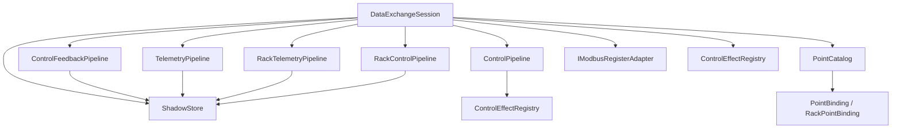
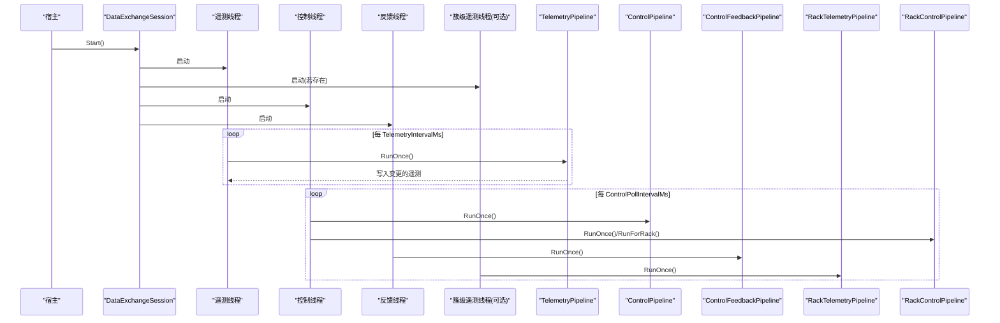
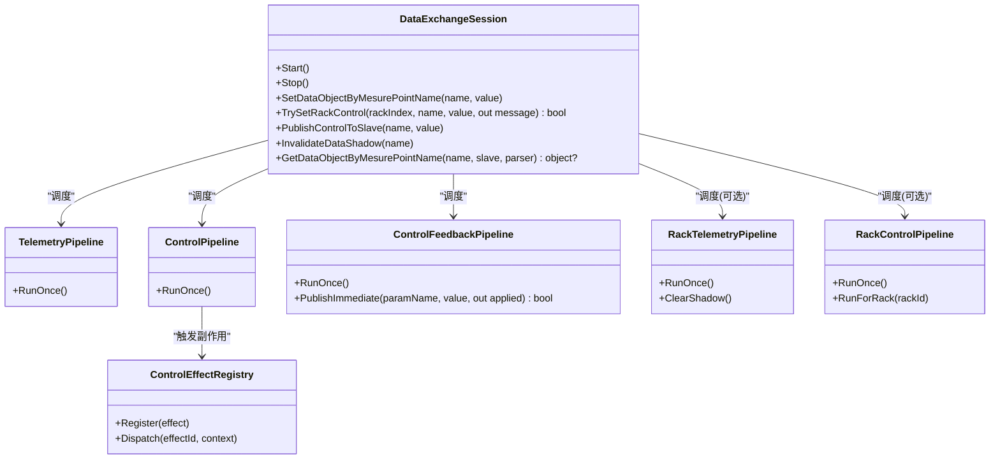
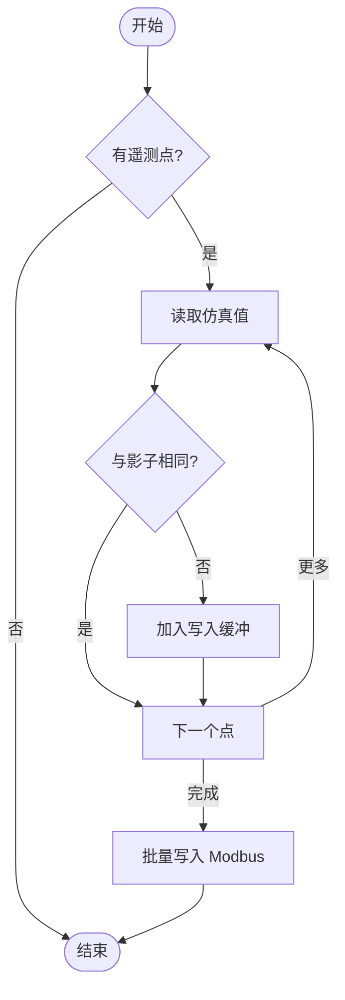
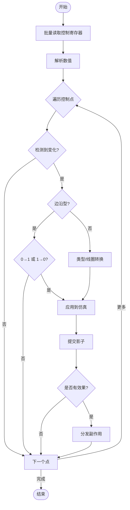
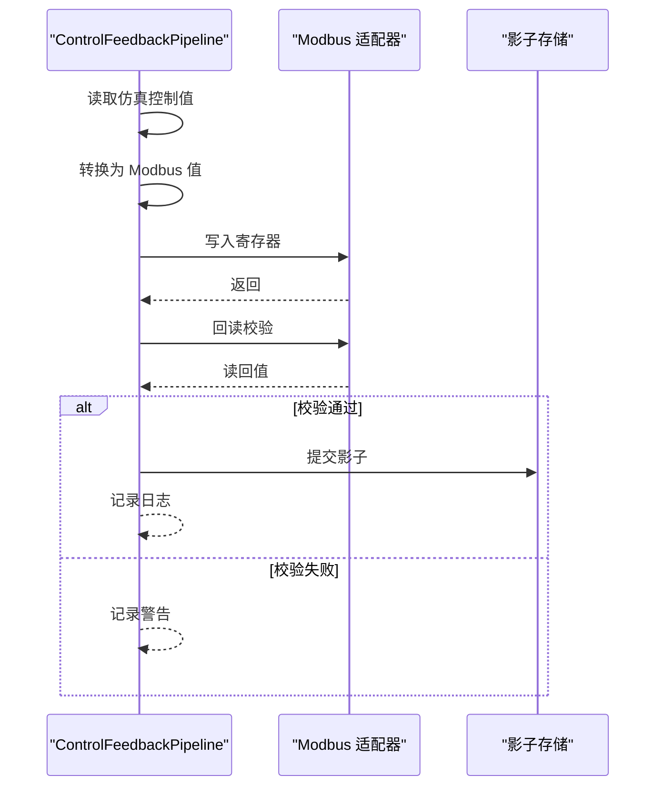
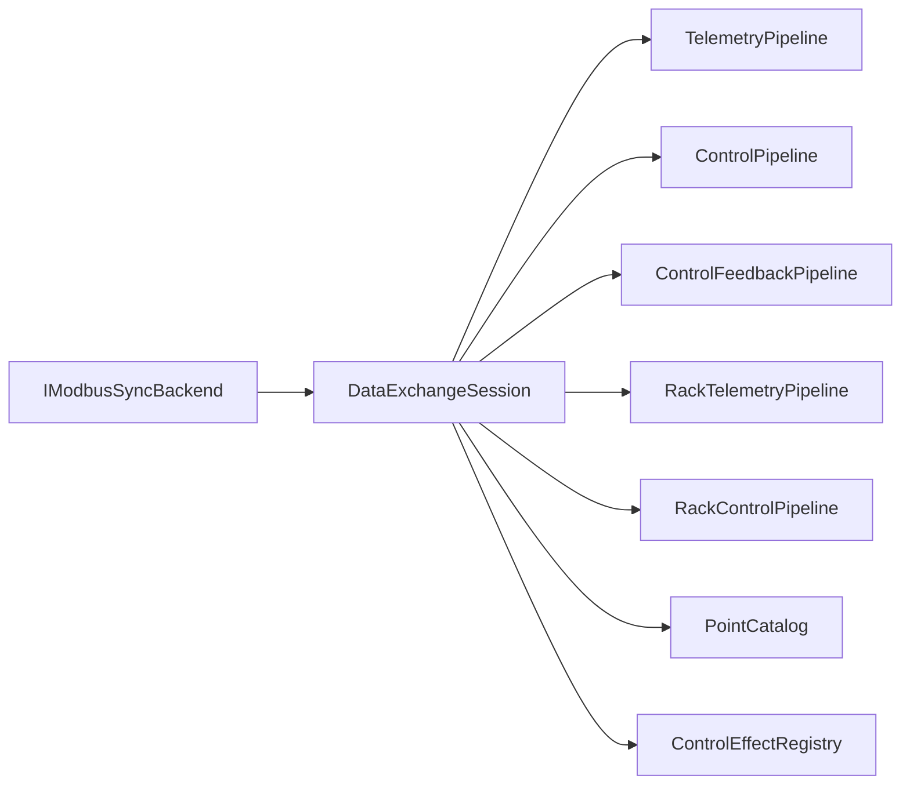

# 数据交换会话管理

<cite>
**本文引用的文件**
- [DataExchangeSession.cs](file://DataExchange/DataExchangeSession.cs)
- [DataExchangeOptions.cs](file://DataExchange/Config/DataExchangeOptions.cs)
- [PointCatalog.cs](file://DataExchange/Catalog/PointCatalog.cs)
- [PointCatalogLoader.cs](file://DataExchange/Catalog/PointCatalogLoader.cs)
- [TelemetryPipeline.cs](file://DataExchange/Pipeline/TelemetryPipeline.cs)
- [ControlPipeline.cs](file://DataExchange/Pipeline/ControlPipeline.cs)
- [ControlFeedbackPipeline.cs](file://DataExchange/Pipeline/ControlFeedbackPipeline.cs)
- [RackTelemetryPipeline.cs](file://DataExchange/Pipeline/RackTelemetryPipeline.cs)
- [RackControlPipeline.cs](file://DataExchange/Pipeline/RackControlPipeline.cs)
- [IControlEffect.cs](file://DataExchange/Effects/IControlEffect.cs)
- [ControlEffectRegistry.cs](file://DataExchange/Effects/ControlEffectRegistry.cs)
- [IModbusSyncBackend.cs](file://Protocol/Modbus/IModbusSyncBackend.cs)
</cite>

## 目录
1. [简介](#简介)
2. [项目结构](#项目结构)
3. [核心组件](#核心组件)
4. [架构总览](#架构总览)
5. [详细组件分析](#详细组件分析)
6. [依赖关系分析](#依赖关系分析)
7. [性能与调优](#性能与调优)
8. [故障排查指南](#故障排查指南)
9. [结论](#结论)
10. [附录：配置项说明](#附录配置项说明)

## 简介
本文件围绕点表驱动的数据交换会话 DataExchangeSession，系统性阐述其作为“遥测、控制、反馈”三管道协调器的核心职责。文档覆盖会话生命周期（创建、启动、停止）、多线程架构（遥测线程、控制线程、反馈线程及可选的簇级遥测线程）、资源管理、初始化流程（设备信息、点表加载、效果注册、管道构建）、状态与线程安全、异常处理与日志策略，以及关键性能参数与使用示例和常见问题排查方法。

## 项目结构
数据交换子系统位于 DataExchange 目录，按职责划分为：
- Catalog：点表与绑定模型（点表解析、查找）
- Pipeline：三类数据管道（遥测、控制、反馈），以及簇级遥测与控制
- Effects：控制副作用注册与分发
- Config：会话配置选项
- DataExchangeSession：会话编排与线程调度

图表来源
- [DataExchangeSession.cs:14-107](file://DataExchange/DataExchangeSession.cs#L14-L107)
- [TelemetryPipeline.cs:7-49](file://DataExchange/Pipeline/TelemetryPipeline.cs#L7-L49)
- [ControlPipeline.cs:9-100](file://DataExchange/Pipeline/ControlPipeline.cs#L9-L100)
- [ControlFeedbackPipeline.cs:7-62](file://DataExchange/Pipeline/ControlFeedbackPipeline.cs#L7-L62)
- [RackTelemetryPipeline.cs:7-67](file://DataExchange/Pipeline/RackTelemetryPipeline.cs#L7-L67)
- [RackControlPipeline.cs:7-114](file://DataExchange/Pipeline/RackControlPipeline.cs#L7-L114)
- [PointCatalog.cs:3-23](file://DataExchange/Catalog/PointCatalog.cs#L3-L23)

章节来源
- [DataExchangeSession.cs:14-107](file://DataExchange/DataExchangeSession.cs#L14-L107)
- [PointCatalog.cs:3-23](file://DataExchange/Catalog/PointCatalog.cs#L3-L23)

## 核心组件
- DataExchangeSession：会话编排器，负责线程生命周期、事件驱动控制触发、默认值写入、仿真到 Modbus 的初始同步、以及各管道的统一调度。
- PointCatalog：点表编译后的只读视图，提供遥测/控制/簇级点的查找能力。
- TelemetryPipeline：仿真→Modbus 的 FC3/4 通道，变更才写，带去重缓存。
- ControlPipeline：Modbus→仿真 的 FC5/6/16 通道，支持边沿语义与副作用触发。
- ControlFeedbackPipeline：仿真→Modbus 的控制反馈通道，写后回读校验并推进影子存储。
- RackTelemetryPipeline/RackControlPipeline：BMS 簇级（多从站）遥测与控制通道，按 rackId 路由。
- ControlEffectRegistry：控制副作用注册与分发。
- DataExchangeOptions：遥测间隔、控制轮询间隔、事件驱动开关等。

章节来源
- [DataExchangeSession.cs:14-107](file://DataExchange/DataExchangeSession.cs#L14-L107)
- [PointCatalog.cs:3-23](file://DataExchange/Catalog/PointCatalog.cs#L3-L23)
- [TelemetryPipeline.cs:7-49](file://DataExchange/Pipeline/TelemetryPipeline.cs#L7-L49)
- [ControlPipeline.cs:9-100](file://DataExchange/Pipeline/ControlPipeline.cs#L9-L100)
- [ControlFeedbackPipeline.cs:7-62](file://DataExchange/Pipeline/ControlFeedbackPipeline.cs#L7-L62)
- [RackTelemetryPipeline.cs:7-67](file://DataExchange/Pipeline/RackTelemetryPipeline.cs#L7-L67)
- [RackControlPipeline.cs:7-114](file://DataExchange/Pipeline/RackControlPipeline.cs#L7-L114)
- [ControlEffectRegistry.cs:5-22](file://DataExchange/Effects/ControlEffectRegistry.cs#L5-L22)
- [DataExchangeOptions.cs:5-22](file://DataExchange/Config/DataExchangeOptions.cs#L5-L22)

## 架构总览
DataExchangeSession 实现 IModbusSyncBackend，对外暴露 Start/Stop 与数据读写接口；内部维护四个后台线程：
- 遥测线程：周期性执行 TelemetryPipeline.RunOnce
- 簇级遥测线程（可选）：周期性执行 RackTelemetryPipeline.RunOnce
- 控制线程：周期性 Drain 控制与簇级控制管道
- 反馈线程：周期性执行 ControlFeedbackPipeline.RunOnce

此外，当启用事件驱动控制时，外部写 Modbus 控制区会触发即时 Drain，降低端到端延迟。

图表来源
- [DataExchangeSession.cs:238-290](file://DataExchange/DataExchangeSession.cs#L238-L290)
- [DataExchangeSession.cs:424-494](file://DataExchange/DataExchangeSession.cs#L424-L494)
- [TelemetryPipeline.cs:28-49](file://DataExchange/Pipeline/TelemetryPipeline.cs#L28-L49)
- [ControlPipeline.cs:42-100](file://DataExchange/Pipeline/ControlPipeline.cs#L42-L100)
- [ControlFeedbackPipeline.cs:34-62](file://DataExchange/Pipeline/ControlFeedbackPipeline.cs#L34-L62)
- [RackTelemetryPipeline.cs:35-67](file://DataExchange/Pipeline/RackTelemetryPipeline.cs#L35-L67)
- [RackControlPipeline.cs:53-114](file://DataExchange/Pipeline/RackControlPipeline.cs#L53-L114)

## 详细组件分析

### DataExchangeSession：会话编排与线程调度
- 构造阶段
  - 注入 IModbusSlave、ModbusParser、PointCatalog、DeviceInfoDto、DataExchangeOptions、clusterCount
  - 初始化 ShadowStore、日志、仿真适配器、Modbus 寄存器适配器
  - 根据设备名注册控制副作用（EMU/BMS）
  - 构建 TelemetryPipeline、可选 RackTelemetryPipeline、ControlPipeline、可选 RackControlPipeline、ControlFeedbackPipeline
  - 若启用事件驱动控制，订阅外部写事件以即时 Drain
- 启动阶段
  - 设置运行标志，必要时清空遥测影子并全量刷新一次
  - 写入默认值，将仿真当前控制值回填至 Modbus 并 seed shadow
  - 启动四个线程（含可选簇级遥测线程）
- 停止阶段
  - 置位停止标志，等待线程退出并清理引用
- 运行时
  - 遥测循环：周期性读取仿真并批量写入 Modbus（仅变化）
  - 控制循环：周期性读取控制寄存器、解析、应用、触发副作用、更新影子
  - 反馈循环：周期性读取仿真控制值、转换、写回 Modbus 并回读校验
  - 事件驱动：外部写控制区时通过线程池异步 Drain 对应管道
- 线程安全
  - 控制 Drain 使用互斥锁保护，避免并发竞争
  - 运行标志 volatile，确保跨线程可见性
  - 线程 Join 超时保护，防止阻塞关闭

章节来源
- [DataExchangeSession.cs:14-107](file://DataExchange/DataExchangeSession.cs#L14-L107)
- [DataExchangeSession.cs:238-307](file://DataExchange/DataExchangeSession.cs#L238-L307)
- [DataExchangeSession.cs:424-494](file://DataExchange/DataExchangeSession.cs#L424-L494)
- [DataExchangeSession.cs:109-152](file://DataExchange/DataExchangeSession.cs#L109-L152)
- [DataExchangeSession.cs:201-227](file://DataExchange/DataExchangeSession.cs#L201-L227)

#### 类图（会话与管道）

图表来源
- [DataExchangeSession.cs:14-107](file://DataExchange/DataExchangeSession.cs#L14-L107)
- [TelemetryPipeline.cs:7-49](file://DataExchange/Pipeline/TelemetryPipeline.cs#L7-L49)
- [ControlPipeline.cs:9-100](file://DataExchange/Pipeline/ControlPipeline.cs#L9-L100)
- [ControlFeedbackPipeline.cs:7-74](file://DataExchange/Pipeline/ControlFeedbackPipeline.cs#L7-L74)
- [RackTelemetryPipeline.cs:7-67](file://DataExchange/Pipeline/RackTelemetryPipeline.cs#L7-L67)
- [RackControlPipeline.cs:7-114](file://DataExchange/Pipeline/RackControlPipeline.cs#L7-L114)
- [ControlEffectRegistry.cs:5-22](file://DataExchange/Effects/ControlEffectRegistry.cs#L5-L22)

### 点表加载与效果注册
- PointCatalogLoader.FromPointMap
  - 基于 ModbusPointMap 生成遥测/控制/簇级遥测/簇级控制绑定
  - 为每个控制点解析语义（Hold/Pulse/Edge）与副作用（ControlEffectId）
  - 默认语义与副作用按设备类型（EMU/BMS）与点名映射
  - 输出 PointCatalog 供会话使用
- 效果注册
  - DataExchangeSession 根据设备名注册内置效果（如 PCS 命令下发、高压断路器控制、BMS Link 命令）
  - ControlEffectRegistry 提供注册与分发机制

章节来源
- [PointCatalogLoader.cs:56-159](file://DataExchange/Catalog/PointCatalogLoader.cs#L56-L159)
- [PointCatalogLoader.cs:161-211](file://DataExchange/Catalog/PointCatalogLoader.cs#L161-L211)
- [DataExchangeSession.cs:60-71](file://DataExchange/DataExchangeSession.cs#L60-L71)
- [IControlEffect.cs:5-17](file://DataExchange/Effects/IControlEffect.cs#L5-L17)
- [ControlEffectRegistry.cs:5-22](file://DataExchange/Effects/ControlEffectRegistry.cs#L5-L22)

### 管道工作流

#### 遥测管道（仿真 → Modbus）
- 遍历遥测点，读取仿真值，比较影子存储，仅变化时写入
- 批量写入减少总线负载

图表来源
- [TelemetryPipeline.cs:28-49](file://DataExchange/Pipeline/TelemetryPipeline.cs#L28-L49)

章节来源
- [TelemetryPipeline.cs:28-49](file://DataExchange/Pipeline/TelemetryPipeline.cs#L28-L49)

#### 控制管道（Modbus → 仿真）
- 批量读取控制寄存器，解析数值
- 检测变化，处理边沿语义（仅跳变时生效）
- 写入仿真，更新影子，触发副作用（如 PCS 命令下发）

图表来源
- [ControlPipeline.cs:42-100](file://DataExchange/Pipeline/ControlPipeline.cs#L42-L100)
- [ControlPipeline.cs:102-167](file://DataExchange/Pipeline/ControlPipeline.cs#L102-L167)

章节来源
- [ControlPipeline.cs:42-100](file://DataExchange/Pipeline/ControlPipeline.cs#L42-L100)
- [ControlPipeline.cs:102-167](file://DataExchange/Pipeline/ControlPipeline.cs#L102-L167)

#### 反馈管道（仿真 → Modbus）
- 读取仿真控制值，转换为 Modbus 格式
- 写回 Modbus 并立即回读校验，成功则推进影子
- 不触发副作用，避免重复效应

图表来源
- [ControlFeedbackPipeline.cs:34-74](file://DataExchange/Pipeline/ControlFeedbackPipeline.cs#L34-L74)
- [ControlFeedbackPipeline.cs:76-122](file://DataExchange/Pipeline/ControlFeedbackPipeline.cs#L76-L122)

章节来源
- [ControlFeedbackPipeline.cs:34-74](file://DataExchange/Pipeline/ControlFeedbackPipeline.cs#L34-L74)
- [ControlFeedbackPipeline.cs:76-122](file://DataExchange/Pipeline/ControlFeedbackPipeline.cs#L76-L122)

#### 簇级遥测与控制（BMS Rack）
- 按 rackId 计算从站地址，分别读写
- 遥测：按 rack 聚合写入，减少总线访问
- 控制：按 rack 解析并写入仿真路径，支持首次观测零值保护

章节来源
- [RackTelemetryPipeline.cs:35-67](file://DataExchange/Pipeline/RackTelemetryPipeline.cs#L35-L67)
- [RackControlPipeline.cs:53-114](file://DataExchange/Pipeline/RackControlPipeline.cs#L53-L114)

### 会话初始化过程
- 设备信息配置：从 DeviceInfoDto 获取名称、从站号等
- 点表加载：通过 PointCatalogLoader 从 ModbusPointMap 编译得到 PointCatalog
- 效果注册：依据设备名注册内置控制副作用
- 管道构建：实例化四类管道（含可选簇级管道）
- 默认值与初始同步：写入默认值，将仿真当前控制值回填至 Modbus，seed 影子存储
- 事件驱动：若启用，订阅外部写事件以即时 Drain

章节来源
- [DataExchangeSession.cs:42-107](file://DataExchange/DataExchangeSession.cs#L42-L107)
- [DataExchangeSession.cs:354-422](file://DataExchange/DataExchangeSession.cs#L354-L422)
- [PointCatalogLoader.cs:56-159](file://DataExchange/Catalog/PointCatalogLoader.cs#L56-L159)

### 状态管理与线程安全
- 运行状态：volatile _running 标志，Start/Stop 原子切换
- 控制门控：_controlGate 互斥锁保护 Drain 调用，避免并发竞争
- 线程生命周期：后台线程，优先级低于正常，命名便于诊断
- 优雅关闭：Stop 中设置标志并尝试 Join，超时忽略异常

章节来源
- [DataExchangeSession.cs:34-40](file://DataExchange/DataExchangeSession.cs#L34-L40)
- [DataExchangeSession.cs:201-227](file://DataExchange/DataExchangeSession.cs#L201-L227)
- [DataExchangeSession.cs:238-307](file://DataExchange/DataExchangeSession.cs#L238-L307)
- [DataExchangeSession.cs:496-503](file://DataExchange/DataExchangeSession.cs#L496-L503)

### 异常处理与日志策略
- 管道内捕获异常并记录 Debug/Warn/Error，保证单点失败不影响整体循环
- 控制变化与反馈写回均记录结构化日志，便于问题定位
- 事件驱动 Drain 异常被捕获并记录错误上下文

章节来源
- [TelemetryPipeline.cs:36-45](file://DataExchange/Pipeline/TelemetryPipeline.cs#L36-L45)
- [ControlPipeline.cs:72-76](file://DataExchange/Pipeline/ControlPipeline.cs#L72-L76)
- [ControlFeedbackPipeline.cs:78-122](file://DataExchange/Pipeline/ControlFeedbackPipeline.cs#L78-L122)
- [DataExchangeSession.cs:109-134](file://DataExchange/DataExchangeSession.cs#L109-L134)

## 依赖关系分析
- DataExchangeSession 依赖：
  - IModbusSlave/ModbusParser：底层通信与编解码
  - PointCatalog：点表元数据
  - 各类 Pipeline：数据流转
  - ShadowStore：去重与一致性
  - ControlEffectRegistry：副作用扩展点
- 外部接口：
  - IModbusSyncBackend：统一会话抽象，便于替换实现

图表来源
- [IModbusSyncBackend.cs:1-16](file://Protocol/Modbus/IModbusSyncBackend.cs#L1-L16)
- [DataExchangeSession.cs:14-107](file://DataExchange/DataExchangeSession.cs#L14-L107)

章节来源
- [IModbusSyncBackend.cs:1-16](file://Protocol/Modbus/IModbusSyncBackend.cs#L1-L16)
- [DataExchangeSession.cs:14-107](file://DataExchange/DataExchangeSession.cs#L14-L107)

## 性能与调优
- 遥测间隔
  - BMS/rack：TelemetryIntervalMs（默认 500ms）
  - EMU（PCS）：EmuTelemetryIntervalMs（默认 100ms）
  - 建议：根据网络与设备能力调整，过高导致延迟，过低增加总线压力
- 控制轮询间隔
  - ControlPollIntervalMs（默认 100ms）
  - 建议：控制响应要求高时可降低，但需评估 CPU 与总线负载
- 事件驱动控制
  - ControlEventDriven（默认 true）
  - 作用：外部写控制区后立即 Drain，显著降低端到端延迟
  - 建议：保持开启，轮询仍作为兜底
- 簇级优化
  - 簇级遥测按 rack 聚合写入，减少多次总线访问
  - 簇级控制按 rack 解析并写入仿真路径，避免全局扫描

章节来源
- [DataExchangeOptions.cs:9-21](file://DataExchange/Config/DataExchangeOptions.cs#L9-L21)
- [DataExchangeSession.cs:233-236](file://DataExchange/DataExchangeSession.cs#L233-L236)
- [DataExchangeSession.cs:475-493](file://DataExchange/DataExchangeSession.cs#L475-L493)
- [RackTelemetryPipeline.cs:40-67](file://DataExchange/Pipeline/RackTelemetryPipeline.cs#L40-L67)
- [RackControlPipeline.cs:53-114](file://DataExchange/Pipeline/RackControlPipeline.cs#L53-L114)

## 故障排查指南
- 控制未生效
  - 检查 ControlSemantics 是否为 Edge，确认跳变条件满足
  - 查看 ControlPipeline 日志，确认是否检测到变化并写入仿真
  - 检查副作用是否注册并触发
- 反馈不一致
  - 检查 ControlFeedbackPipeline 写回与回读校验日志
  - 关注 readback 失败原因（网络、从站无响应）
- 遥测不更新
  - 检查 TelemetryPipeline 是否读到仿真值
  - 确认影子存储是否被误失效（InvalidateDataShadow）
- 簇级控制异常
  - 核对 rackIndex 范围与从站地址计算
  - 检查首次观测零值保护逻辑是否阻止了写入
- 事件驱动无效
  - 确认 ControlEventDriven 为 true
  - 检查外部写事件是否触发 OnExternalControlWrite

章节来源
- [ControlPipeline.cs:42-100](file://DataExchange/Pipeline/ControlPipeline.cs#L42-L100)
- [ControlFeedbackPipeline.cs:76-122](file://DataExchange/Pipeline/ControlFeedbackPipeline.cs#L76-L122)
- [TelemetryPipeline.cs:28-49](file://DataExchange/Pipeline/TelemetryPipeline.cs#L28-L49)
- [RackControlPipeline.cs:73-114](file://DataExchange/Pipeline/RackControlPipeline.cs#L73-L114)
- [DataExchangeSession.cs:109-152](file://DataExchange/DataExchangeSession.cs#L109-L152)

## 结论
DataExchangeSession 以点表为中心，将仿真与 Modbus 之间的数据交互抽象为三条稳定管道，并通过多线程与事件驱动机制实现低延迟、高可靠的数据同步。配合灵活的点表加载、副作用注册与影子存储，系统能够在复杂设备拓扑下保持良好的一致性与可观测性。合理调优遥测与控制周期、启用事件驱动，可在不同场景下取得最佳性能与稳定性。

## 附录：配置项说明
- DataExchange.TelemetryIntervalMs：BMS/rack 遥测刷新周期（毫秒）
- DataExchange.EmuTelemetryIntervalMs：EMU（PCS）遥测刷新周期（毫秒）
- DataExchange.ControlEventDriven：是否启用事件驱动控制（布尔）
- DataExchange.ControlPollIntervalMs：控制与反馈轮询周期（毫秒）
- DataExchange.ControlSemantics：按点名覆盖控制语义（Hold/Pulse/Edge）
- DataExchange.ControlEffects：按点名覆盖控制副作用（EffectId）

章节来源
- [DataExchangeOptions.cs:9-21](file://DataExchange/Config/DataExchangeOptions.cs#L9-L21)
- [PointCatalogLoader.cs:161-211](file://DataExchange/Catalog/PointCatalogLoader.cs#L161-L211)