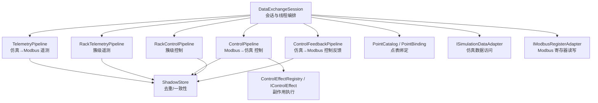
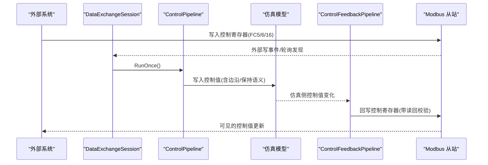
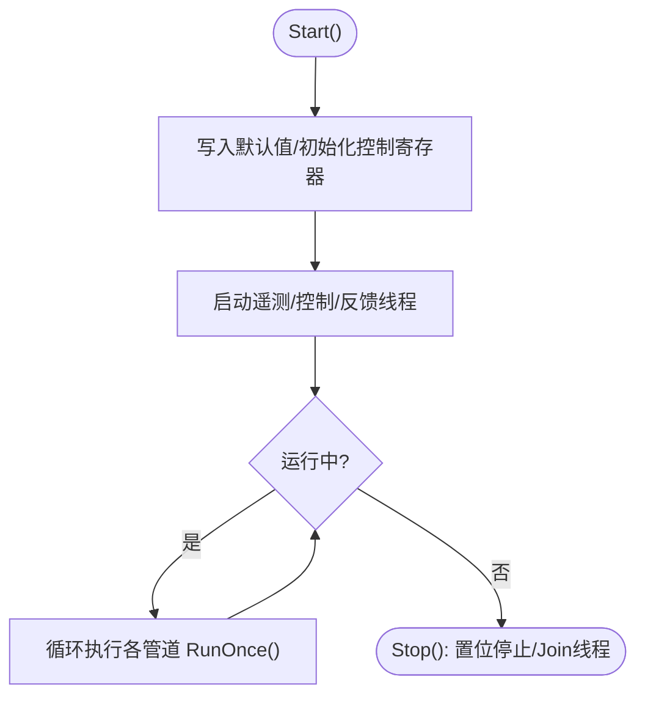
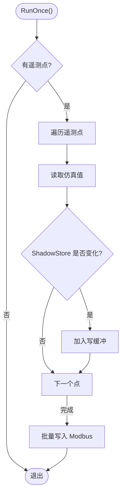
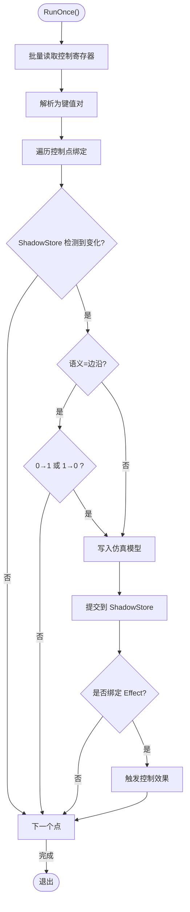
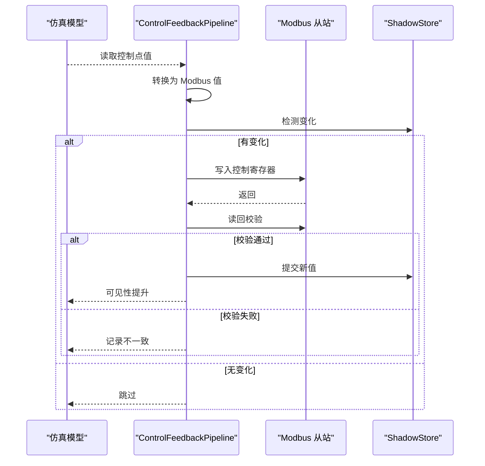
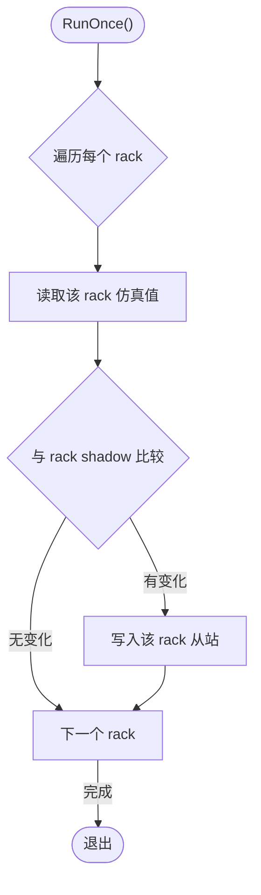
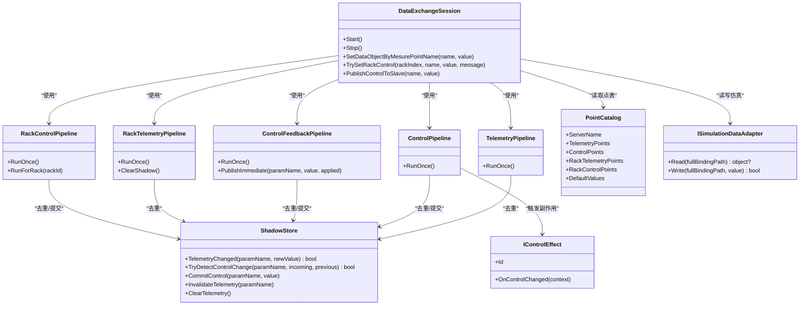
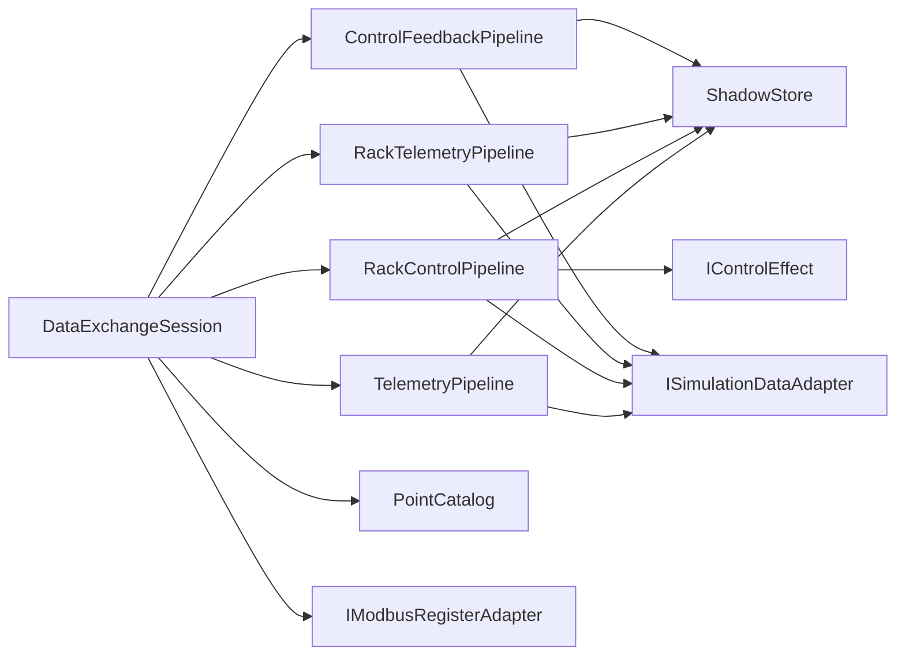

# 数据交换管道

<cite>
**本文引用的文件**
- [DataExchangeSession.cs](file://DataExchange/DataExchangeSession.cs)
- [TelemetryPipeline.cs](file://DataExchange/Pipeline/TelemetryPipeline.cs)
- [ControlPipeline.cs](file://DataExchange/Pipeline/ControlPipeline.cs)
- [ControlFeedbackPipeline.cs](file://DataExchange/Pipeline/ControlFeedbackPipeline.cs)
- [RackTelemetryPipeline.cs](file://DataExchange/Pipeline/RackTelemetryPipeline.cs)
- [RackControlPipeline.cs](file://DataExchange/Pipeline/RackControlPipeline.cs)
- [ShadowStore.cs](file://DataExchange/Pipeline/ShadowStore.cs)
- [PointCatalog.cs](file://DataExchange/Catalog/PointCatalog.cs)
- [PointBinding.cs](file://DataExchange/Catalog/PointBinding.cs)
- [ISimulationDataAdapter.cs](file://DataExchange/Adapters/ISimulationDataAdapter.cs)
- [IControlEffect.cs](file://DataExchange/Effects/IControlEffect.cs)
- [DataExchangeOptions.cs](file://DataExchange/Config/DataExchangeOptions.cs)
- [IModbusSyncBackend.cs](file://Protocol/Modbus/IModbusSyncBackend.cs)
</cite>

## 目录
1. [简介](#简介)
2. [项目结构](#项目结构)
3. [核心组件](#核心组件)
4. [架构总览](#架构总览)
5. [详细组件分析](#详细组件分析)
6. [依赖关系分析](#依赖关系分析)
7. [性能考虑](#性能考虑)
8. [故障排查指南](#故障排查指南)
9. [结论](#结论)
10. [附录：配置与扩展示例](#附录：配置与扩展示例)

## 简介
本文件系统性阐述储能仿真系统中的“数据交换管道”，围绕三类数据流展开：
- 遥测数据管道（仿真 → Modbus）：周期性采集、变更检测、批量写入。
- 控制命令管道（Modbus → 仿真）：读取外部写、解析与校验、边沿/保持语义处理、副作用触发。
- 控制反馈管道（仿真 → Modbus）：将仿真侧已生效的控制值回写至从站，保证读写一致性与可见性。

同时覆盖会话生命周期管理（创建、启动、重连恢复、停止）、资源清理、配置选项、性能调优与故障排查，并提供扩展自定义管道与复杂数据流的实践建议。

## 项目结构
数据交换以 DataExchangeSession 为入口，组合多个专用管道与共享基础设施：
- 会话层：负责线程调度、事件驱动触发、默认值初始化、重连后全量刷新。
- 管道层：分别实现遥测、控制、反馈以及簇级（rack）的对应能力。
- 适配层：抽象仿真数据访问与 Modbus 寄存器读写。
- 目录与配置：点表绑定、控制语义与效果注册、运行时选项。

图示来源
- [DataExchangeSession.cs:11-107](file://DataExchange/DataExchangeSession.cs#L11-L107)
- [TelemetryPipeline.cs:1-52](file://DataExchange/Pipeline/TelemetryPipeline.cs#L1-L52)
- [ControlPipeline.cs:1-176](file://DataExchange/Pipeline/ControlPipeline.cs#L1-L176)
- [ControlFeedbackPipeline.cs:1-131](file://DataExchange/Pipeline/ControlFeedbackPipeline.cs#L1-L131)
- [RackTelemetryPipeline.cs:1-71](file://DataExchange/Pipeline/RackTelemetryPipeline.cs#L1-L71)
- [RackControlPipeline.cs:1-157](file://DataExchange/Pipeline/RackControlPipeline.cs#L1-L157)
- [ShadowStore.cs:1-59](file://DataExchange/Pipeline/ShadowStore.cs#L1-L59)
- [PointCatalog.cs:1-25](file://DataExchange/Catalog/PointCatalog.cs#L1-L25)
- [ISimulationDataAdapter.cs:1-9](file://DataExchange/Adapters/ISimulationDataAdapter.cs#L1-L9)
- [IControlEffect.cs:1-19](file://DataExchange/Effects/IControlEffect.cs#L1-L19)

章节来源
- [DataExchangeSession.cs:11-107](file://DataExchange/DataExchangeSession.cs#L11-L107)
- [PointCatalog.cs:1-25](file://DataExchange/Catalog/PointCatalog.cs#L1-L25)

## 核心组件
- DataExchangeSession：会话编排器，维护运行状态、线程池、事件驱动与轮询兜底；负责默认值注入、重连后全量同步、控制写路径分发。
- TelemetryPipeline：按点表周期读取仿真数据，基于 ShadowStore 去重后批量写入 Modbus。
- ControlPipeline：读取外部控制寄存器，解析并应用控制值，支持边沿/保持语义，触发副作用。
- ControlFeedbackPipeline：将仿真侧已生效的控制值回写至 Modbus，带读回验证与 shadow 推进。
- RackTelemetryPipeline / RackControlPipeline：针对多簇（rack）场景的遥测与控制通道，按 rack 从站隔离读写。
- ShadowStore：统一的变化检测与一致性存储，避免重复 I/O 与抖动。
- PointCatalog / PointBinding：描述点表映射、目标路径、控制语义与效果。
- ISimulationDataAdapter / IControlEffect：解耦仿真数据访问与副作用扩展点。

章节来源
- [DataExchangeSession.cs:238-494](file://DataExchange/DataExchangeSession.cs#L238-L494)
- [TelemetryPipeline.cs:28-49](file://DataExchange/Pipeline/TelemetryPipeline.cs#L28-L49)
- [ControlPipeline.cs:42-100](file://DataExchange/Pipeline/ControlPipeline.cs#L42-L100)
- [ControlFeedbackPipeline.cs:34-74](file://DataExchange/Pipeline/ControlFeedbackPipeline.cs#L34-L74)
- [RackTelemetryPipeline.cs:35-68](file://DataExchange/Pipeline/RackTelemetryPipeline.cs#L35-L68)
- [RackControlPipeline.cs:53-114](file://DataExchange/Pipeline/RackControlPipeline.cs#L53-L114)
- [ShadowStore.cs:9-37](file://DataExchange/Pipeline/ShadowStore.cs#L9-L37)
- [PointCatalog.cs:5-22](file://DataExchange/Catalog/PointCatalog.cs#L5-L22)
- [PointBinding.cs:3-12](file://DataExchange/Catalog/PointBinding.cs#L3-L12)
- [ISimulationDataAdapter.cs:3-7](file://DataExchange/Adapters/ISimulationDataAdapter.cs#L3-L7)
- [IControlEffect.cs:5-17](file://DataExchange/Effects/IControlEffect.cs#L5-L17)

## 架构总览
数据交换采用“会话 + 多管道”的架构：会话负责生命周期与调度，各管道专注单一职责并通过共享 ShadowStore 保持一致性。控制侧通过 Effect 机制扩展业务逻辑，反馈侧通过读回校验确保一致性。

图示来源
- [DataExchangeSession.cs:105-134](file://DataExchange/DataExchangeSession.cs#L105-L134)
- [ControlPipeline.cs:42-100](file://DataExchange/Pipeline/ControlPipeline.cs#L42-L100)
- [ControlFeedbackPipeline.cs:34-74](file://DataExchange/Pipeline/ControlFeedbackPipeline.cs#L34-L74)

## 详细组件分析

### 数据交换会话（生命周期管理）
- 创建与装配：根据设备名注册控制效果，构建遥测/控制/反馈及可选的 rack 管道，订阅外部写事件（事件驱动模式）。
- 启动流程：设置默认值、从仿真初始化控制寄存器、启动四个后台线程（遥测、rack 遥测、控制、反馈）。
- 重连恢复：若检测到 link off→on，清空遥测 shadow 并立即全量刷新，避免脏数据。
- 停止流程：置位停止标志，等待线程结束，释放资源。
- 控制写入口：提供 imperative 写接口，先写寄存器再走控制管道，确保与外部写同路径。

图示来源
- [DataExchangeSession.cs:238-290](file://DataExchange/DataExchangeSession.cs#L238-L290)
- [DataExchangeSession.cs:292-307](file://DataExchange/DataExchangeSession.cs#L292-L307)
- [DataExchangeSession.cs:354-365](file://DataExchange/DataExchangeSession.cs#L354-L365)

章节来源
- [DataExchangeSession.cs:11-107](file://DataExchange/DataExchangeSession.cs#L11-L107)
- [DataExchangeSession.cs:238-494](file://DataExchange/DataExchangeSession.cs#L238-L494)

### 遥测数据管道（仿真 → Modbus）
- 设计要点：按点表遍历仿真数据，使用 ShadowStore 比较新旧值，仅当变化时加入写缓冲，最后批量写入 Modbus，降低总线压力。
- 复杂度：O(N) 遍历 N 个遥测点；写缓冲聚合减少 I/O 次数。
- 异常处理：单点读取失败不影响其他点，记录调试日志。

图示来源
- [TelemetryPipeline.cs:28-49](file://DataExchange/Pipeline/TelemetryPipeline.cs#L28-L49)
- [ShadowStore.cs:15-22](file://DataExchange/Pipeline/ShadowStore.cs#L15-L22)

章节来源
- [TelemetryPipeline.cs:28-49](file://DataExchange/Pipeline/TelemetryPipeline.cs#L28-L49)
- [ShadowStore.cs:15-22](file://DataExchange/Pipeline/ShadowStore.cs#L15-L22)

### 控制命令管道（Modbus → 仿真）
- 读取与解析：批量读取控制区原始数据，解析为键值对。
- 变更检测：通过 ShadowStore 判断是否发生变化。
- 语义处理：边沿型（Edge）仅在跳变时写入；保持型（Hold）直接写入。
- 副作用：根据绑定的 EffectId 触发控制效果（如 PCS 启停、断路器动作等）。
- 白盒切片：在设定瞬间捕获有功/无功切片用于诊断。

图示来源
- [ControlPipeline.cs:42-100](file://DataExchange/Pipeline/ControlPipeline.cs#L42-L100)
- [ControlPipeline.cs:102-133](file://DataExchange/Pipeline/ControlPipeline.cs#L102-L133)
- [IControlEffect.cs:5-17](file://DataExchange/Effects/IControlEffect.cs#L5-L17)

章节来源
- [ControlPipeline.cs:42-100](file://DataExchange/Pipeline/ControlPipeline.cs#L42-L100)
- [ControlPipeline.cs:102-167](file://DataExchange/Pipeline/ControlPipeline.cs#L102-L167)
- [IControlEffect.cs:5-17](file://DataExchange/Effects/IControlEffect.cs#L5-L17)

### 控制反馈管道（仿真 → Modbus）
- 设计要点：周期扫描仿真侧控制值，转换为 Modbus 可写格式，写入后读回校验，成功则推进 shadow，否则记录告警。
- 即时发布：支持 imperative 调用直接写回并推进 shadow，适用于 LC/启动引导。
- 日志与可观测性：记录写入值、读回值与一致性结果。

图示来源
- [ControlFeedbackPipeline.cs:34-74](file://DataExchange/Pipeline/ControlFeedbackPipeline.cs#L34-L74)
- [ControlFeedbackPipeline.cs:76-122](file://DataExchange/Pipeline/ControlFeedbackPipeline.cs#L76-L122)
- [ShadowStore.cs:24-31](file://DataExchange/Pipeline/ShadowStore.cs#L24-L31)

章节来源
- [ControlFeedbackPipeline.cs:34-122](file://DataExchange/Pipeline/ControlFeedbackPipeline.cs#L34-L122)
- [ShadowStore.cs:24-31](file://DataExchange/Pipeline/ShadowStore.cs#L24-L31)

### 簇级（Rack）遥测与控制管道
- RackTelemetryPipeline：按 rack 从站周期读取仿真数据，按 rack 聚合写缓冲，减少跨从站 I/O。
- RackControlPipeline：按 rack 从站读取控制寄存器，解析并写入仿真模型对应 rack 路径，支持首次观测保护（避免零值覆盖默认门限）。

图示来源
- [RackTelemetryPipeline.cs:35-68](file://DataExchange/Pipeline/RackTelemetryPipeline.cs#L35-L68)
- [RackControlPipeline.cs:53-114](file://DataExchange/Pipeline/RackControlPipeline.cs#L53-L114)

章节来源
- [RackTelemetryPipeline.cs:35-68](file://DataExchange/Pipeline/RackTelemetryPipeline.cs#L35-L68)
- [RackControlPipeline.cs:53-114](file://DataExchange/Pipeline/RackControlPipeline.cs#L53-L114)

### 类图（代码级关系）

图示来源
- [DataExchangeSession.cs:11-107](file://DataExchange/DataExchangeSession.cs#L11-L107)
- [TelemetryPipeline.cs:1-52](file://DataExchange/Pipeline/TelemetryPipeline.cs#L1-L52)
- [ControlPipeline.cs:1-176](file://DataExchange/Pipeline/ControlPipeline.cs#L1-L176)
- [ControlFeedbackPipeline.cs:1-131](file://DataExchange/Pipeline/ControlFeedbackPipeline.cs#L1-L131)
- [RackTelemetryPipeline.cs:1-71](file://DataExchange/Pipeline/RackTelemetryPipeline.cs#L1-L71)
- [RackControlPipeline.cs:1-157](file://DataExchange/Pipeline/RackControlPipeline.cs#L1-L157)
- [ShadowStore.cs:1-59](file://DataExchange/Pipeline/ShadowStore.cs#L1-L59)
- [PointCatalog.cs:1-25](file://DataExchange/Catalog/PointCatalog.cs#L1-L25)
- [ISimulationDataAdapter.cs:1-9](file://DataExchange/Adapters/ISimulationDataAdapter.cs#L1-L9)
- [IControlEffect.cs:1-19](file://DataExchange/Effects/IControlEffect.cs#L1-L19)

## 依赖关系分析
- 松耦合：通过 ISimulationDataAdapter 与 IControlEffect 解耦仿真与副作用；通过 PointCatalog/PointBinding 解耦数据源与协议层。
- 共享状态：ShadowStore 作为唯一一致性边界，避免多管道竞争导致的不一致。
- 外部依赖：Modbus 从站通过适配器封装，支持事件驱动与轮询两种模式。
- 潜在环路：无直接循环依赖；会话协调各管道，管道之间不互相调用。

图示来源
- [DataExchangeSession.cs:11-107](file://DataExchange/DataExchangeSession.cs#L11-L107)
- [TelemetryPipeline.cs:1-52](file://DataExchange/Pipeline/TelemetryPipeline.cs#L1-L52)
- [ControlPipeline.cs:1-176](file://DataExchange/Pipeline/ControlPipeline.cs#L1-L176)
- [ControlFeedbackPipeline.cs:1-131](file://DataExchange/Pipeline/ControlFeedbackPipeline.cs#L1-L131)
- [RackTelemetryPipeline.cs:1-71](file://DataExchange/Pipeline/RackTelemetryPipeline.cs#L1-L71)
- [RackControlPipeline.cs:1-157](file://DataExchange/Pipeline/RackControlPipeline.cs#L1-L157)
- [ShadowStore.cs:1-59](file://DataExchange/Pipeline/ShadowStore.cs#L1-L59)
- [PointCatalog.cs:1-25](file://DataExchange/Catalog/PointCatalog.cs#L1-L25)
- [ISimulationDataAdapter.cs:1-9](file://DataExchange/Adapters/ISimulationDataAdapter.cs#L1-L9)
- [IControlEffect.cs:1-19](file://DataExchange/Effects/IControlEffect.cs#L1-L19)

章节来源
- [DataExchangeSession.cs:11-107](file://DataExchange/DataExchangeSession.cs#L11-L107)
- [ShadowStore.cs:1-59](file://DataExchange/Pipeline/ShadowStore.cs#L1-L59)

## 性能考虑
- 变更驱动 I/O：所有管道均基于 ShadowStore 进行变化检测，避免无意义写入。
- 批量写入：遥测与控制反馈均采用写缓冲聚合，减少 Modbus 帧数量。
- 事件驱动控制：启用 ControlEventDriven 可在外部写后立即处理，轮询作为兜底，降低延迟。
- 线程优先级：后台线程设置为 BelowNormal，避免抢占仿真主循环。
- 间隔调优：根据设备类型调整遥测与控制轮询间隔（EMU 更短，BMS 更长）。
- 簇级隔离：rack 管道按从站分片写入，避免跨从站冲突。

[本节为通用指导，无需特定文件引用]

## 故障排查指南
- 遥测未更新：检查 TelemetryPipeline 是否被调用、ShadowStore 是否误判相等、Modbus 写入是否成功。
- 控制未生效：确认 ControlPipeline 是否检测到变化、边沿语义是否正确、Effect 是否注册、仿真写入是否成功。
- 反馈不一致：查看 ControlFeedbackPipeline 的读回校验日志，确认 Modbus 读回值与写入值一致。
- 簇级问题：核对 rack 索引范围、从站地址计算、首次观测保护是否阻止了写入。
- 重连后数据异常：确认会话是否在重连时清空遥测 shadow 并全量刷新。

章节来源
- [TelemetryPipeline.cs:28-49](file://DataExchange/Pipeline/TelemetryPipeline.cs#L28-L49)
- [ControlPipeline.cs:42-100](file://DataExchange/Pipeline/ControlPipeline.cs#L42-L100)
- [ControlFeedbackPipeline.cs:76-122](file://DataExchange/Pipeline/ControlFeedbackPipeline.cs#L76-L122)
- [RackControlPipeline.cs:73-114](file://DataExchange/Pipeline/RackControlPipeline.cs#L73-L114)
- [DataExchangeSession.cs:354-365](file://DataExchange/DataExchangeSession.cs#L354-L365)

## 结论
数据交换管道通过清晰的会话编排与职责分离的管道设计，实现了高内聚、低耦合的数据同步与控制执行。借助 ShadowStore 的一致性保障、事件驱动与轮询的组合策略、以及可扩展的副作用机制，系统在可靠性、实时性与可维护性方面达到良好平衡。配合合理的配置与调优，可适应不同规模与性能的仿真场景。

[本节为总结，无需特定文件引用]

## 附录：配置与扩展示例

### 配置选项
- DataExchangeOptions：
  - TelemetryIntervalMs：BMS/rack 遥测刷新周期（毫秒）。
  - EmuTelemetryIntervalMs：EMU（PCS）遥测刷新周期（毫秒）。
  - ControlEventDriven：是否启用事件驱动控制（外部写后立即处理）。
  - ControlPollIntervalMs：控制与反馈轮询周期（毫秒）。
  - ControlSemantics / ControlEffects：点级语义与效果映射。

章节来源
- [DataExchangeOptions.cs:5-31](file://DataExchange/Config/DataExchangeOptions.cs#L5-L31)

### 扩展自定义管道
- 新增遥测点：在 PointCatalog 中添加 TelemetryPoints 绑定，指定目标路径与参数名。
- 新增控制点：添加 ControlPoints 绑定，设置 FunctionCode、语义与效果。
- 自定义副作用：实现 IControlEffect 并注册到 ControlEffectRegistry，响应控制变化。
- 簇级扩展：为 RackTelemetryPoints / RackControlPoints 增加绑定，确保 ResolvePath 正确生成 rack 路径。

章节来源
- [PointCatalog.cs:5-22](file://DataExchange/Catalog/PointCatalog.cs#L5-L22)
- [PointBinding.cs:3-12](file://DataExchange/Catalog/PointBinding.cs#L3-L12)
- [IControlEffect.cs:5-17](file://DataExchange/Effects/IControlEffect.cs#L5-L17)

### 复杂数据流场景示例
- 场景：PCS 设定功率变化需触发 BMS 限流与断路器联动。
  - 步骤：
    1) 在点表中为 PCS 功率设定绑定 ControlSemantics.Hold，并关联 EffectId。
    2) 注册对应的控制效果，实现 OnControlChanged 中调用 BMS 限流与断路器操作。
    3) 启用 ControlEventDriven，确保外部写后立即处理。
    4) 观察反馈管道日志，确认写回一致性与可见性。
- 场景：多 rack 门限下发需按 rack 隔离。
  - 步骤：
    1) 为每个 rack 定义 RackControlPoints，ResolvePath 指向 Cluster[rackId].*。
    2) 通过 DataExchangeSession.TrySetRackControl 下发门限，自动路由到对应 rack 从站。
    3) 监控 RackControlPipeline 日志，确认首次观测保护与写入路径正确。

章节来源
- [DataExchangeSession.cs:154-199](file://DataExchange/DataExchangeSession.cs#L154-L199)
- [RackControlPipeline.cs:73-114](file://DataExchange/Pipeline/RackControlPipeline.cs#L73-L114)
- [ControlPipeline.cs:89-98](file://DataExchange/Pipeline/ControlPipeline.cs#L89-L98)