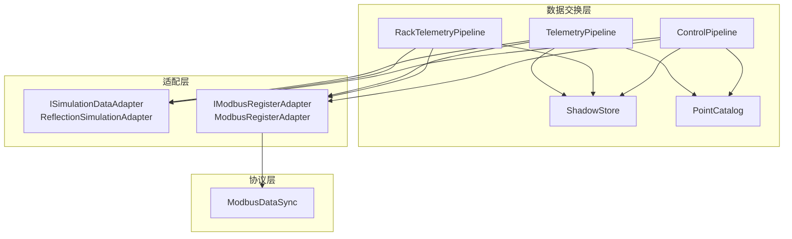
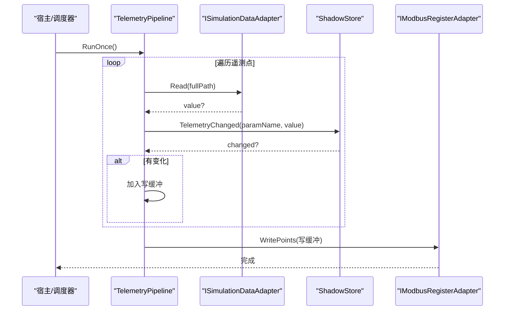
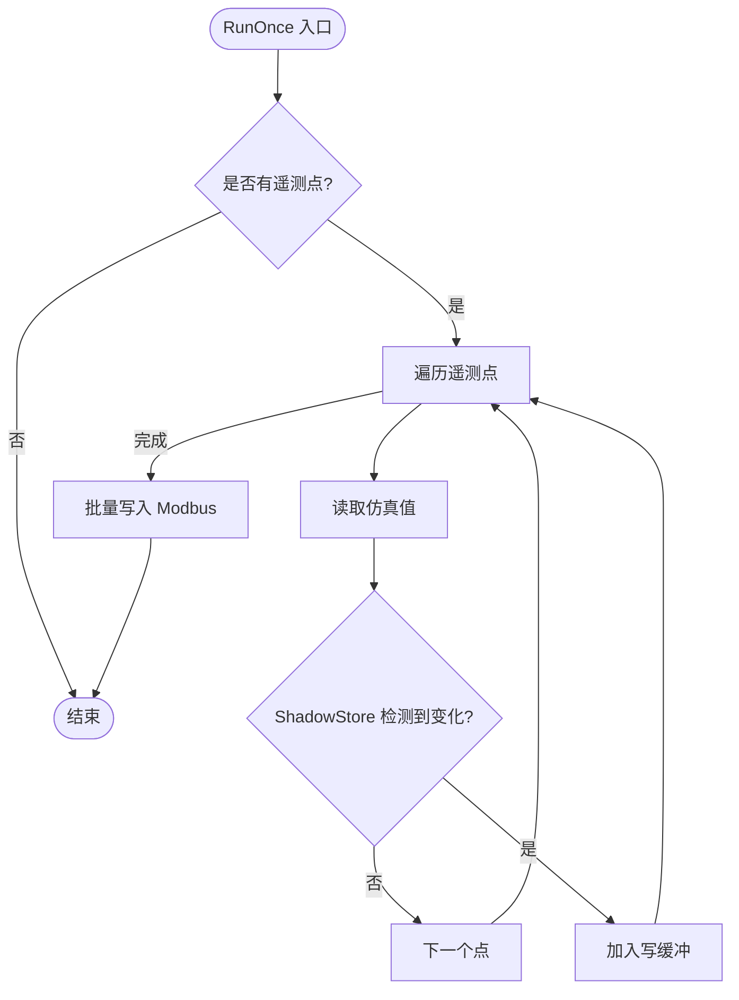
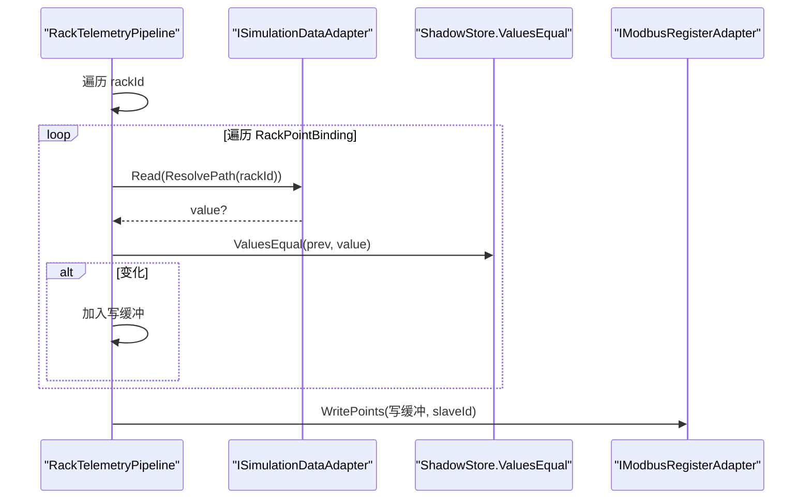
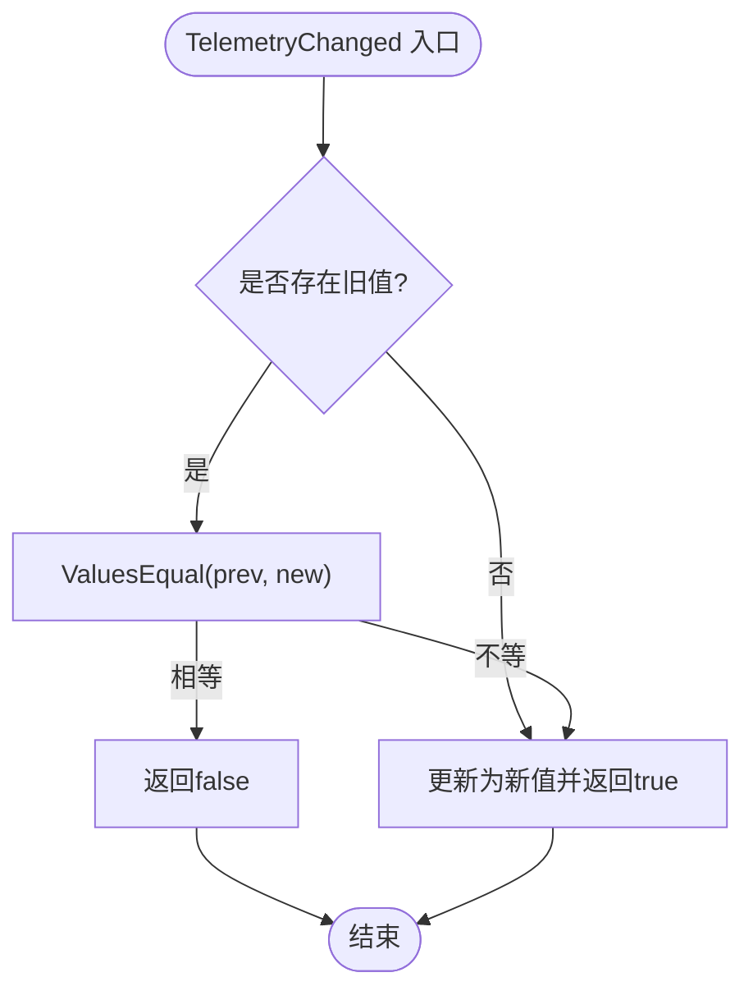
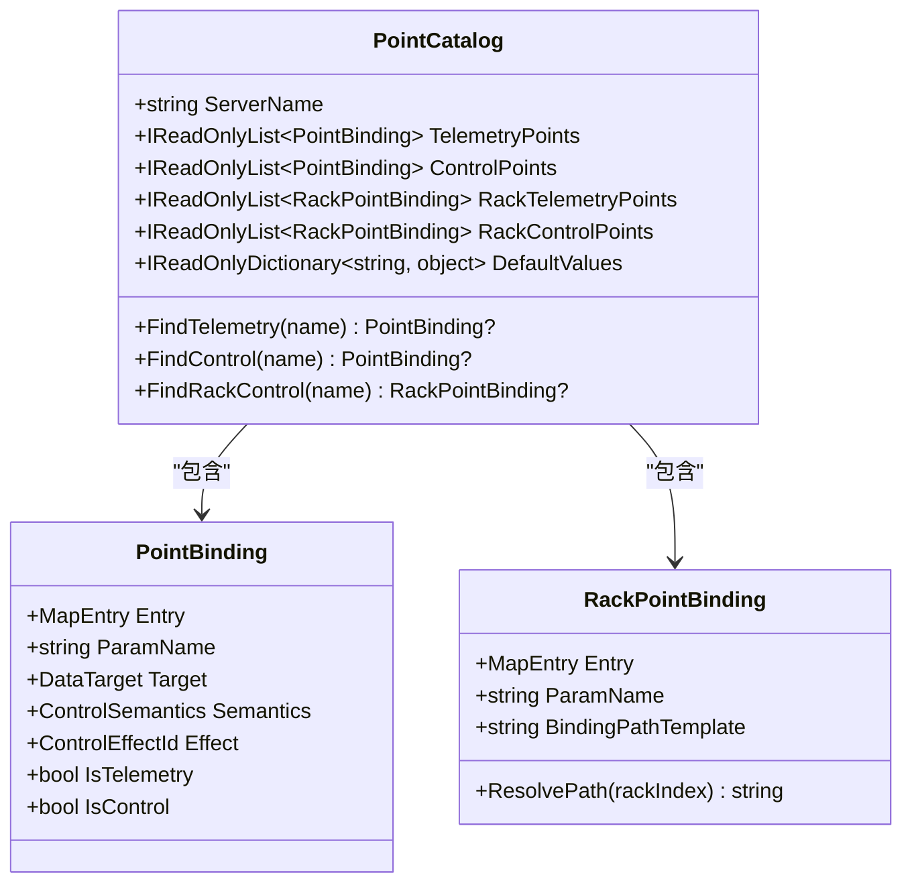
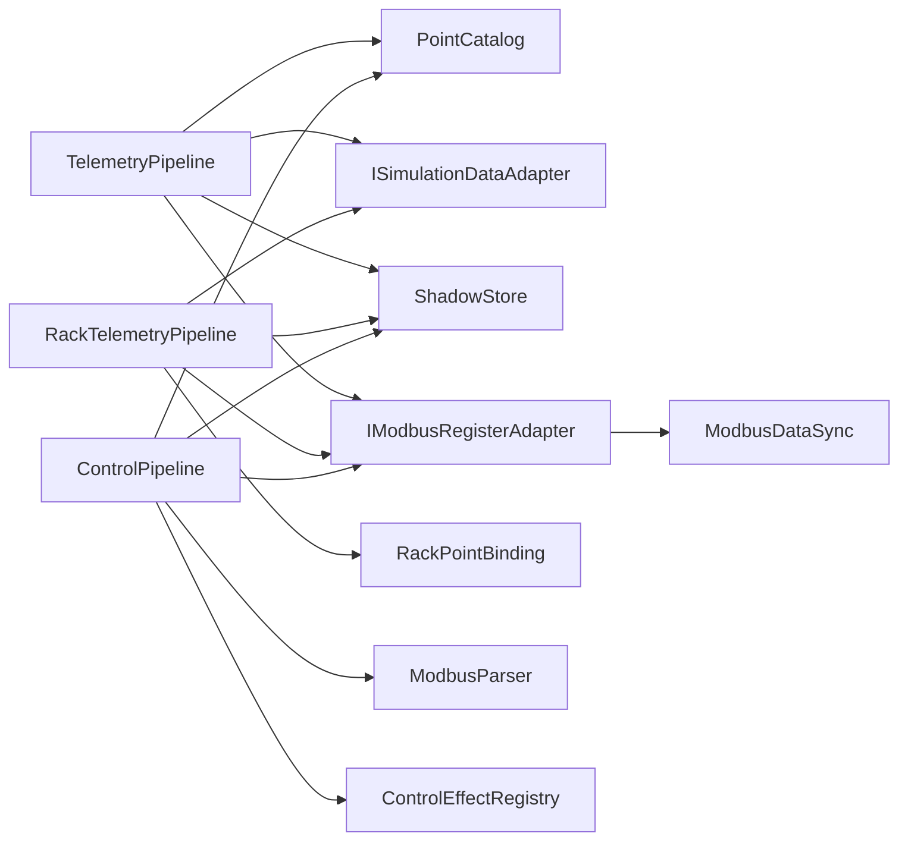

# 基础遥测管道

<cite>
**本文引用的文件**
- [TelemetryPipeline.cs](file://DataExchange/Pipeline/TelemetryPipeline.cs)
- [RackTelemetryPipeline.cs](file://DataExchange/Pipeline/RackTelemetryPipeline.cs)
- [ShadowStore.cs](file://DataExchange/Pipeline/ShadowStore.cs)
- [PointCatalog.cs](file://DataExchange/Catalog/PointCatalog.cs)
- [PointBinding.cs](file://DataExchange/Catalog/PointBinding.cs)
- [RackPointBinding.cs](file://DataExchange/Catalog/RackPointBinding.cs)
- [PointCatalogLoader.cs](file://DataExchange/Catalog/PointCatalogLoader.cs)
- [ISimulationDataAdapter.cs](file://DataExchange/Adapters/ISimulationDataAdapter.cs)
- [ReflectionSimulationAdapter.cs](file://DataExchange/Adapters/ReflectionSimulationAdapter.cs)
- [IModbusRegisterAdapter.cs](file://DataExchange/Adapters/IModbusRegisterAdapter.cs)
- [ModbusRegisterAdapter.cs](file://DataExchange/Adapters/ModbusRegisterAdapter.cs)
- [ControlPipeline.cs](file://DataExchange/Pipeline/ControlPipeline.cs)
- [ModbusDataSync.cs](file://Protocol/Modbus/ModbusDataSync.cs)
- [DataExchangeSession.cs](file://DataExchange/DataExchangeSession.cs)
</cite>

## 目录
1. [简介](#简介)
2. [项目结构](#项目结构)
3. [核心组件](#核心组件)
4. [架构总览](#架构总览)
5. [详细组件分析](#详细组件分析)
6. [依赖关系分析](#依赖关系分析)
7. [性能考量](#性能考量)
8. [故障排查指南](#故障排查指南)
9. [结论](#结论)
10. [附录：配置与使用示例](#附录配置与使用示例)

## 简介
本文件聚焦“基础遥测管道”的设计与实现，围绕以下目标展开：
- 深入解释 TelemetryPipeline 的核心功能：仿真数据读取、变更检测机制、批量写入策略。
- 说明 PointCatalog 中遥测点的配置与绑定机制，以及 Rack 级点绑定的路径解析。
- 阐述 ISimulationDataAdapter 接口的数据源抽象及 ReflectionSimulationAdapter 的实现原理。
- 重点阐述 ShadowStore 的增量更新逻辑：值比较算法、变更标记机制与内存优化策略。
- 覆盖异常处理、日志记录策略与可观测性（监控指标）建议。
- 提供具体配置与使用示例，包括点表映射、数据适配器集成和错误恢复策略。

## 项目结构
基础遥测管道位于 DataExchange 模块下，按职责分层组织：
- Pipeline：编排数据流（TelemetryPipeline、RackTelemetryPipeline、ControlPipeline）。
- Catalog：点表与绑定（PointCatalog、PointBinding、RackPointBinding、PointCatalogLoader）。
- Adapters：数据源与外部总线适配（ISimulationDataAdapter、ReflectionSimulationAdapter、IModbusRegisterAdapter、ModbusRegisterAdapter）。
- Protocol/Modbus：底层 Modbus 同步与 Worker 调度（ModbusDataSync），为上层管道提供 I/O 能力。

图表来源
- [TelemetryPipeline.cs:1-52](file://DataExchange/Pipeline/TelemetryPipeline.cs#L1-L52)
- [RackTelemetryPipeline.cs:1-71](file://DataExchange/Pipeline/RackTelemetryPipeline.cs#L1-L71)
- [ShadowStore.cs:1-59](file://DataExchange/Pipeline/ShadowStore.cs#L1-L59)
- [PointCatalog.cs:1-25](file://DataExchange/Catalog/PointCatalog.cs#L1-L25)
- [ISimulationDataAdapter.cs:1-9](file://DataExchange/Adapters/ISimulationDataAdapter.cs#L1-L9)
- [ReflectionSimulationAdapter.cs:1-12](file://DataExchange/Adapters/ReflectionSimulationAdapter.cs#L1-L12)
- [IModbusRegisterAdapter.cs:1-10](file://DataExchange/Adapters/IModbusRegisterAdapter.cs#L1-L10)
- [ModbusRegisterAdapter.cs:1-45](file://DataExchange/Adapters/ModbusRegisterAdapter.cs#L1-L45)
- [ModbusDataSync.cs:1-486](file://Protocol/Modbus/ModbusDataSync.cs#L1-L486)

章节来源
- [TelemetryPipeline.cs:1-52](file://DataExchange/Pipeline/TelemetryPipeline.cs#L1-L52)
- [RackTelemetryPipeline.cs:1-71](file://DataExchange/Pipeline/RackTelemetryPipeline.cs#L1-L71)
- [ShadowStore.cs:1-59](file://DataExchange/Pipeline/ShadowStore.cs#L1-L59)
- [PointCatalog.cs:1-25](file://DataExchange/Catalog/PointCatalog.cs#L1-L25)
- [ISimulationDataAdapter.cs:1-9](file://DataExchange/Adapters/ISimulationDataAdapter.cs#L1-L9)
- [ReflectionSimulationAdapter.cs:1-12](file://DataExchange/Adapters/ReflectionSimulationAdapter.cs#L1-L12)
- [IModbusRegisterAdapter.cs:1-10](file://DataExchange/Adapters/IModbusRegisterAdapter.cs#L1-L10)
- [ModbusRegisterAdapter.cs:1-45](file://DataExchange/Adapters/ModbusRegisterAdapter.cs#L1-L45)
- [ModbusDataSync.cs:1-486](file://Protocol/Modbus/ModbusDataSync.cs#L1-L486)

## 核心组件
- TelemetryPipeline：从仿真模型读取遥测点，基于 ShadowStore 进行变更检测，将变化点批量写入 Modbus。
- RackTelemetryPipeline：针对 BMS Rack 场景，按 rackId 循环生成路径并批量写入对应从站。
- ShadowStore：维护遥测与控制值的影子缓存，提供值相等判断、变更检测、失效与清空等能力。
- PointCatalog / PointBinding / RackPointBinding：描述点表映射、目标路径、控制语义与效果；支持 Rack 级模板路径解析。
- ISimulationDataAdapter / ReflectionSimulationAdapter：抽象仿真数据访问，反射方式读取/写入扩展接口变量。
- IModbusRegisterAdapter / ModbusRegisterAdapter：封装 Modbus 写操作，支持默认值写入、批量写入、抑制通知等。
- ControlPipeline：反向通道（Modbus → 仿真），负责控制点解析、边沿/保持语义、副作用触发与日志。
- ModbusDataSync：底层 Modbus Worker 线程，负责数据寄存器周期性写入、控制寄存器轮询回写与 shadow 管理。

章节来源
- [TelemetryPipeline.cs:1-52](file://DataExchange/Pipeline/TelemetryPipeline.cs#L1-L52)
- [RackTelemetryPipeline.cs:1-71](file://DataExchange/Pipeline/RackTelemetryPipeline.cs#L1-L71)
- [ShadowStore.cs:1-59](file://DataExchange/Pipeline/ShadowStore.cs#L1-L59)
- [PointCatalog.cs:1-25](file://DataExchange/Catalog/PointCatalog.cs#L1-L25)
- [PointBinding.cs:1-14](file://DataExchange/Catalog/PointBinding.cs#L1-L14)
- [RackPointBinding.cs:1-14](file://DataExchange/Catalog/RackPointBinding.cs#L1-L14)
- [ISimulationDataAdapter.cs:1-9](file://DataExchange/Adapters/ISimulationDataAdapter.cs#L1-L9)
- [ReflectionSimulationAdapter.cs:1-12](file://DataExchange/Adapters/ReflectionSimulationAdapter.cs#L1-L12)
- [IModbusRegisterAdapter.cs:1-10](file://DataExchange/Adapters/IModbusRegisterAdapter.cs#L1-L10)
- [ModbusRegisterAdapter.cs:1-45](file://DataExchange/Adapters/ModbusRegisterAdapter.cs#L1-L45)
- [ControlPipeline.cs:1-176](file://DataExchange/Pipeline/ControlPipeline.cs#L1-L176)
- [ModbusDataSync.cs:1-486](file://Protocol/Modbus/ModbusDataSync.cs#L1-L486)

## 架构总览
基础遥测管道的数据流如下：
- 周期或事件驱动调用 TelemetryPipeline.RunOnce()。
- 遍历 PointCatalog.TelemetryPoints，通过 ISimulationDataAdapter.Read 读取仿真值。
- 使用 ShadowStore.TelemetryChanged 进行增量检测，仅当值变化时加入写缓冲。
- 调用 IModbusRegisterAdapter.WritePoints 批量写入 Modbus。
- RackTelemetryPipeline 以 rackId 维度循环执行相同流程，并将结果写入对应从站。
- 控制方向由 ControlPipeline 完成，将 Modbus 控制点解析后写入仿真，并触发副作用。

图表来源
- [TelemetryPipeline.cs:28-49](file://DataExchange/Pipeline/TelemetryPipeline.cs#L28-L49)
- [ShadowStore.cs:15-22](file://DataExchange/Pipeline/ShadowStore.cs#L15-L22)
- [IModbusRegisterAdapter.cs:5-8](file://DataExchange/Adapters/IModbusRegisterAdapter.cs#L5-L8)
- [ModbusRegisterAdapter.cs:24-45](file://DataExchange/Adapters/ModbusRegisterAdapter.cs#L24-L45)

## 详细组件分析

### TelemetryPipeline：仿真→Modbus 的变更驱动写入
- 输入：PointCatalog 中的遥测点列表、ISimulationDataAdapter、IModbusRegisterAdapter、ShadowStore。
- 流程：
  - 若无遥测点则直接返回。
  - 对每个点尝试读取仿真值，捕获异常并记录调试日志。
  - 使用 ShadowStore 判断是否变化，变化则加入写缓冲。
  - 最后统一调用 WritePoints 批量写入，减少 I/O 次数。
- 关键点：
  - 变更检测在 ShadowStore 中完成，避免重复写。
  - 异常隔离：单个点读取失败不影响其他点。
  - 批量写入：写缓冲聚合，降低总线压力。

图表来源
- [TelemetryPipeline.cs:28-49](file://DataExchange/Pipeline/TelemetryPipeline.cs#L28-L49)
- [ShadowStore.cs:15-22](file://DataExchange/Pipeline/ShadowStore.cs#L15-L22)

章节来源
- [TelemetryPipeline.cs:1-52](file://DataExchange/Pipeline/TelemetryPipeline.cs#L1-L52)

### RackTelemetryPipeline：BMS Rack 级遥测批量写入
- 输入：RackPointBinding 列表、ISimulationDataAdapter、IModbusRegisterAdapter、集群数量、起始从站 ID。
- 流程：
  - 对每个 rackId，计算 slaveId。
  - 遍历 RackPointBinding，使用 ResolvePath 生成带 rackId 的路径并读取仿真值。
  - 使用本地 _shadow 字典进行变更检测，变化则加入写缓冲。
  - 若有变化，调用 WritePoints(values, slaveId) 写入对应从站。
- 关键点：
  - Rack 级路径模板替换，支持 rackId 占位符。
  - 每 rack 独立写缓冲与从站地址，避免跨从站混写。
  - 异常隔离与调试日志便于定位问题。

图表来源
- [RackTelemetryPipeline.cs:35-67](file://DataExchange/Pipeline/RackTelemetryPipeline.cs#L35-L67)
- [RackPointBinding.cs:10-12](file://DataExchange/Catalog/RackPointBinding.cs#L10-L12)
- [ShadowStore.cs:39-56](file://DataExchange/Pipeline/ShadowStore.cs#L39-L56)
- [IModbusRegisterAdapter.cs:5-8](file://DataExchange/Adapters/IModbusRegisterAdapter.cs#L5-L8)

章节来源
- [RackTelemetryPipeline.cs:1-71](file://DataExchange/Pipeline/RackTelemetryPipeline.cs#L1-L71)
- [RackPointBinding.cs:1-14](file://DataExchange/Catalog/RackPointBinding.cs#L1-L14)

### ShadowStore：增量更新与值比较
- 数据结构：
  - 遥测影子字典与控制影子字典，键为参数名，值为上次写入的值。
- 核心方法：
  - TelemetryChanged：若存在旧值且与新值相等则不标记变化；否则更新并返回 true。
  - TryDetectControlChange：用于控制方向，返回是否变化并输出旧值。
  - CommitControl：提交控制值到影子。
  - InvalidateTelemetry：使某个遥测点失效，强制下次全量回写。
  - ClearTelemetry：清空遥测影子，常用于重连后强制全量刷新。
- 值比较算法：
  - 布尔兼容：bool 与数值 0/非 0 互转比较。
  - 浮点容差：double 字符串解析后绝对误差小于 1e-9 视为相等。
  - 兜底：Equals 比较。
- 内存优化：
  - 仅在必要时更新字典项。
  - 支持按需失效与清空，避免长期残留脏数据。

图表来源
- [ShadowStore.cs:15-22](file://DataExchange/Pipeline/ShadowStore.cs#L15-L22)
- [ShadowStore.cs:39-56](file://DataExchange/Pipeline/ShadowStore.cs#L39-L56)

章节来源
- [ShadowStore.cs:1-59](file://DataExchange/Pipeline/ShadowStore.cs#L1-L59)

### PointCatalog 与点表绑定机制
- PointCatalog：
  - 包含 ServerName、TelemetryPoints、ControlPoints、RackTelemetryPoints、RackControlPoints、DefaultValues。
  - 提供 FindTelemetry、FindControl、FindRackControl 等方法快速查找绑定。
- PointBinding：
  - 关联 MapEntry（Modbus 点表条目）、ParamName、DataTarget（仿真目标路径）。
  - 标识 IsTelemetry/IsControl 基于 FunctionCode。
  - 支持 Semantics（Hold/Edge/Pulse）与 Effect（副作用类型）。
- RackPointBinding：
  - 包含 BindingPathTemplate，支持 Replace("rackId", index) 生成实际路径。
- PointCatalogLoader：
  - 从 ModbusPointMap 编译出 PointCatalog，填充遥测/控制/Rack 点。
  - 根据设备类型（EMU/BMS）与选项解析默认控制语义与效果。

图表来源
- [PointCatalog.cs:1-25](file://DataExchange/Catalog/PointCatalog.cs#L1-L25)
- [PointBinding.cs:1-14](file://DataExchange/Catalog/PointBinding.cs#L1-L14)
- [RackPointBinding.cs:1-14](file://DataExchange/Catalog/RackPointBinding.cs#L1-L14)
- [PointCatalogLoader.cs:56-159](file://DataExchange/Catalog/PointCatalogLoader.cs#L56-L159)

章节来源
- [PointCatalog.cs:1-25](file://DataExchange/Catalog/PointCatalog.cs#L1-L25)
- [PointBinding.cs:1-14](file://DataExchange/Catalog/PointBinding.cs#L1-L14)
- [RackPointBinding.cs:1-14](file://DataExchange/Catalog/RackPointBinding.cs#L1-L14)
- [PointCatalogLoader.cs:1-214](file://DataExchange/Catalog/PointCatalogLoader.cs#L1-L214)

### ISimulationDataAdapter 与 ReflectionSimulationAdapter
- ISimulationDataAdapter：
  - 定义 Read(fullBindingPath) 与 Write(fullBindingPath, value) 两个方法，抽象仿真数据源。
- ReflectionSimulationAdapter：
  - 通过 SimServer.GetExtIfVariableVal/SetExtIfVariableVal 反射访问扩展接口变量。
  - 适用于嵌入式仿真环境的数据读写。

章节来源
- [ISimulationDataAdapter.cs:1-9](file://DataExchange/Adapters/ISimulationDataAdapter.cs#L1-L9)
- [ReflectionSimulationAdapter.cs:1-12](file://DataExchange/Adapters/ReflectionSimulationAdapter.cs#L1-L12)

### IModbusRegisterAdapter 与 ModbusRegisterAdapter
- IModbusRegisterAdapter：
  - 提供 WriteDefaults、WritePoints、ReadAllControlRaw、ReadParsedPoint 等接口。
- ModbusRegisterAdapter：
  - 封装底层 IModbusSlave 的写操作，支持抑制写通知（避免重复触发）。
  - 支持指定 slaveId 与 applyScale 标志。
  - 内部使用 ModbusSlave.SuppressWriteNotifications 抑制回调，减少不必要的事件风暴。

章节来源
- [IModbusRegisterAdapter.cs:1-10](file://DataExchange/Adapters/IModbusRegisterAdapter.cs#L1-L10)
- [ModbusRegisterAdapter.cs:1-45](file://DataExchange/Adapters/ModbusRegisterAdapter.cs#L1-L45)

### ControlPipeline：Modbus→仿真的反向通道
- 作用：读取 Modbus 控制点，解析并写入仿真，触发副作用（如 PCS 命令下发）。
- 关键逻辑：
  - 读取所有控制原始值，解析为结构化值。
  - 使用 ShadowStore.TryDetectControlChange 检测变化。
  - 支持 Hold/Edge 语义，边沿型控制仅在跳变时写入。
  - 写入成功后 CommitControl 更新影子，并可选记录变更日志。
  - 通过 ControlEffectRegistry 分发副作用。

章节来源
- [ControlPipeline.cs:1-176](file://DataExchange/Pipeline/ControlPipeline.cs#L1-L176)

### 底层 Modbus 同步：ModbusDataSync
- 角色：
  - 启动多个 Worker 线程按 modelType 分组周期性写入数据寄存器。
  - 启动控制线程轮询控制寄存器，变化时回写仿真模型。
  - 维护主设备与 Rack 设备的 shadow 缓存，避免重复写。
- 关键点：
  - 初始化时写入默认值与当前对象值，保证一致。
  - 控制线程休眠避免忙等，降低 CPU 占用。
  - 提供 InvalidateDataShadow 强制下一轮回写实时值。
  - PublishControlToSlave 用于仿真→Modbus 反馈，带 readback 校验与日志。

章节来源
- [ModbusDataSync.cs:1-486](file://Protocol/Modbus/ModbusDataSync.cs#L1-L486)

## 依赖关系分析
- TelemetryPipeline 依赖：
  - PointCatalog：提供遥测点绑定信息。
  - ISimulationDataAdapter：读取仿真值。
  - ShadowStore：变更检测。
  - IModbusRegisterAdapter：批量写入 Modbus。
- RackTelemetryPipeline 依赖：
  - RackPointBinding：路径模板解析。
  - 其余同 TelemetryPipeline。
- ControlPipeline 依赖：
  - PointCatalog、ShadowStore、IModbusRegisterAdapter、ModbusParser、ControlEffectRegistry。
- ModbusDataSync 依赖：
  - IModbusSlave、ModbusParser、ModbusPointMap、DeviceInfoDto。

图表来源
- [TelemetryPipeline.cs:1-52](file://DataExchange/Pipeline/TelemetryPipeline.cs#L1-L52)
- [RackTelemetryPipeline.cs:1-71](file://DataExchange/Pipeline/RackTelemetryPipeline.cs#L1-L71)
- [ControlPipeline.cs:1-176](file://DataExchange/Pipeline/ControlPipeline.cs#L1-L176)
- [ModbusDataSync.cs:1-486](file://Protocol/Modbus/ModbusDataSync.cs#L1-L486)

章节来源
- [TelemetryPipeline.cs:1-52](file://DataExchange/Pipeline/TelemetryPipeline.cs#L1-L52)
- [RackTelemetryPipeline.cs:1-71](file://DataExchange/Pipeline/RackTelemetryPipeline.cs#L1-L71)
- [ControlPipeline.cs:1-176](file://DataExchange/Pipeline/ControlPipeline.cs#L1-L176)
- [ModbusDataSync.cs:1-486](file://Protocol/Modbus/ModbusDataSync.cs#L1-L486)

## 性能考量
- 变更检测：
  - ShadowStore 使用字典 O(1) 查找与更新，避免全量扫描。
  - 值比较采用容差与类型兼容，减少误判导致的重复写。
- 批量写入：
  - TelemetryPipeline 与 RackTelemetryPipeline 均使用写缓冲聚合，降低 Modbus 总线负载。
  - ModbusRegisterAdapter 抑制写通知，避免事件风暴。
- 线程与调度：
  - ModbusDataSync 使用后台线程与 Sleep 控制轮询频率，平衡实时性与 CPU 占用。
  - Rack 级循环按从站分片写入，避免跨从站混写带来的冲突。
- 内存优化：
  - ShadowStore 支持 InvalidateTelemetry 与 ClearTelemetry，防止脏数据长期驻留。
  - 仅在有变化时更新字典项，减少内存分配。

[本节为通用性能讨论，不直接分析具体文件]

## 故障排查指南
- 读取失败：
  - TelemetryPipeline 与 RackTelemetryPipeline 捕获异常并记录调试日志，便于定位具体点与原因。
- 写失败：
  - ControlPipeline 在仿真写失败时记录警告日志，提示目标路径与值。
  - ModbusDataSync 在控制线程与 Worker 中捕获异常并记录错误日志。
- 重连恢复：
  - DataExchangeSession 在重连后调用 RefreshTelemetryAfterReconnect 与 InvalidateDataShadow，确保全量刷新。
  - ShadowStore.ClearTelemetry 可用于强制全量回写。
- 日志级别：
  - 调试：读取失败、值转换异常。
  - 警告：写失败、读回不一致。
  - 信息：控制变更、发布反馈。

章节来源
- [TelemetryPipeline.cs:42-45](file://DataExchange/Pipeline/TelemetryPipeline.cs#L42-L45)
- [RackTelemetryPipeline.cs:59-62](file://DataExchange/Pipeline/RackTelemetryPipeline.cs#L59-L62)
- [ControlPipeline.cs:72-76](file://DataExchange/Pipeline/ControlPipeline.cs#L72-L76)
- [ModbusDataSync.cs:159-160](file://Protocol/Modbus/ModbusDataSync.cs#L159-L160)
- [ModbusDataSync.cs:245-249](file://Protocol/Modbus/ModbusDataSync.cs#L245-L249)
- [DataExchangeSession.cs:329-365](file://DataExchange/DataExchangeSession.cs#L329-L365)

## 结论
基础遥测管道通过 TelemetryPipeline 与 RackTelemetryPipeline 实现了仿真到 Modbus 的高效增量传输，结合 ShadowStore 的变更检测与批量写入策略，显著降低总线负载与 CPU 占用。PointCatalog 提供了灵活的可配置点表绑定机制，ISimulationDataAdapter 与 IModbusRegisterAdapter 实现了数据源与总线的解耦。ControlPipeline 完善了反向控制通道，ModbusDataSync 提供了稳定的底层调度与恢复机制。整体设计具备高内聚、低耦合、易扩展的特点，适合在储能仿真系统中稳定运行。

[本节为总结性内容，不直接分析具体文件]

## 附录：配置与使用示例
- 点表映射配置：
  - 使用 PointCatalogLoader.FromPointMap 从 ModbusPointMap 构建 PointCatalog，自动填充遥测/控制/Rack 点。
  - 可通过 DataExchangeOptions 自定义控制语义与效果映射。
- 数据适配器集成：
  - 注入 ISimulationDataAdapter（ReflectionSimulationAdapter）与 IModbusRegisterAdapter（ModbusRegisterAdapter）到 TelemetryPipeline。
  - 对于 Rack 场景，传入 RackPointBinding 列表与集群数量、起始从站 ID。
- 错误恢复策略：
  - 在连接重建后调用 ShadowStore.ClearTelemetry 或 DataExchangeSession.InvalidateDataShadow 强制全量刷新。
  - 使用 ControlPipeline 的边沿语义与副作用注册，确保控制指令正确触发。
- 监控指标建议：
  - 统计每次 RunOnce 的读取次数、变化点数、写入点数。
  - 记录异常次数与类型（读取失败、写入失败、读回不一致）。
  - 观察 ModbusDataSync 的 Worker 周期与控制线程轮询间隔，评估实时性与资源占用。

章节来源
- [PointCatalogLoader.cs:56-159](file://DataExchange/Catalog/PointCatalogLoader.cs#L56-L159)
- [ReflectionSimulationAdapter.cs:1-12](file://DataExchange/Adapters/ReflectionSimulationAdapter.cs#L1-L12)
- [ModbusRegisterAdapter.cs:16-45](file://DataExchange/Adapters/ModbusRegisterAdapter.cs#L16-L45)
- [DataExchangeSession.cs:329-365](file://DataExchange/DataExchangeSession.cs#L329-L365)
- [ModbusDataSync.cs:72-99](file://Protocol/Modbus/ModbusDataSync.cs#L72-L99)