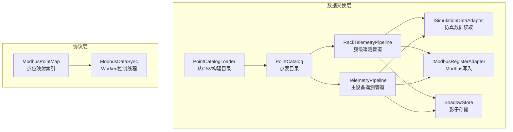
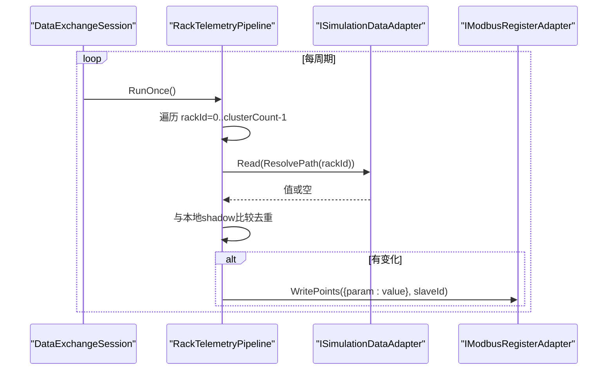
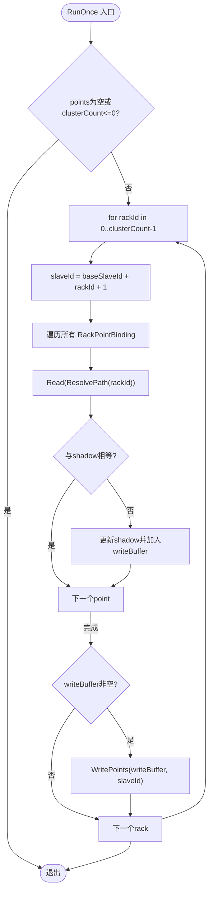
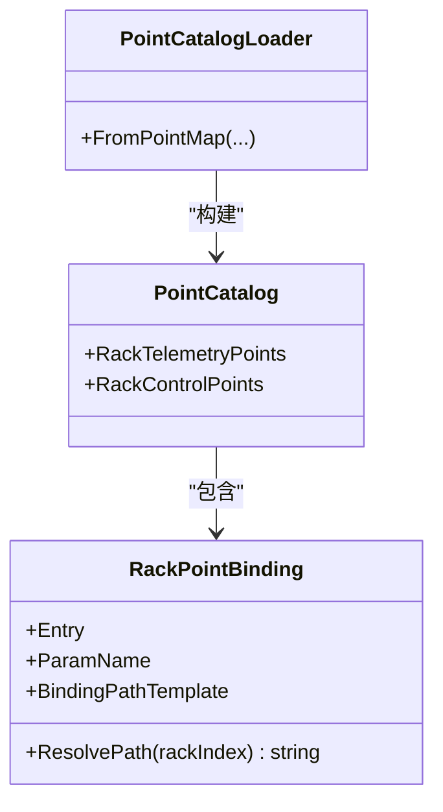
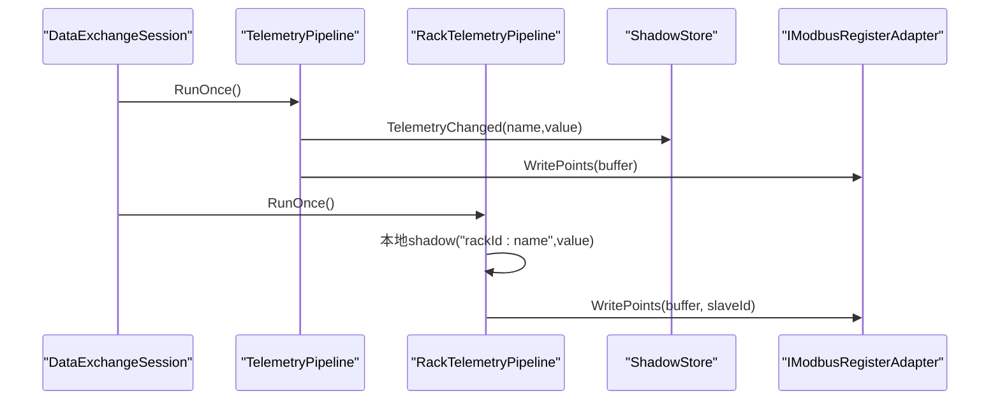
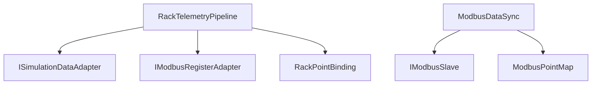

# 簇级遥测管道

<cite>
**本文引用的文件**
- [RackTelemetryPipeline.cs](file://DataExchange/Pipeline/RackTelemetryPipeline.cs)
- [RackPointBinding.cs](file://DataExchange/Catalog/RackPointBinding.cs)
- [TelemetryPipeline.cs](file://DataExchange/Pipeline/TelemetryPipeline.cs)
- [ShadowStore.cs](file://DataExchange/Pipeline/ShadowStore.cs)
- [PointCatalog.cs](file://DataExchange/Catalog/PointCatalog.cs)
- [PointCatalogLoader.cs](file://DataExchange/Catalog/PointCatalogLoader.cs)
- [ISimulationDataAdapter.cs](file://DataExchange/Adapters/ISimulationDataAdapter.cs)
- [IModbusRegisterAdapter.cs](file://DataExchange/Adapters/IModbusRegisterAdapter.cs)
- [ModbusDataSync.cs](file://Protocol/Modbus/ModbusDataSync.cs)
- [ModbusPointMap.cs](file://Protocol/Modbus/ModbusPointMap.cs)
- [DataExchangeSession.cs](file://DataExchange/DataExchangeSession.cs)
</cite>

## 目录
1. [简介](#简介)
2. [项目结构](#项目结构)
3. [核心组件](#核心组件)
4. [架构总览](#架构总览)
5. [详细组件分析](#详细组件分析)
6. [依赖关系分析](#依赖关系分析)
7. [性能与批量优化](#性能与批量优化)
8. [故障诊断指南](#故障诊断指南)
9. [结论](#结论)
10. [附录：配置要点](#附录：配置要点)

## 简介
本文件面向“簇级遥测管道”的完整设计与实现，重点说明 RackTelemetryPipeline 的多从站处理能力、RackPointBinding 的复杂绑定机制、簇级数据的层次化组织（电池簇/包/电芯）、以及其与基础遥测管道的协作方式。文档同时给出批量处理优化策略、跨层级数据同步策略、连接超时处理、数据一致性保证和性能调优建议。

## 项目结构
簇级遥测相关代码主要分布在 DataExchange 与 Protocol 两个子系统中：
- DataExchange：负责点表解析、管道编排、仿真数据适配、Modbus 寄存器适配器、影子存储等。
- Protocol：提供 Modbus 点位映射、数据同步调度（Worker 线程）等底层能力。

图表来源
- [PointCatalog.cs:1-24](file://DataExchange/Catalog/PointCatalog.cs#L1-L24)
- [PointCatalogLoader.cs:56-158](file://DataExchange/Catalog/PointCatalogLoader.cs#L56-L158)
- [RackTelemetryPipeline.cs:1-71](file://DataExchange/Pipeline/RackTelemetryPipeline.cs#L1-L71)
- [TelemetryPipeline.cs:1-52](file://DataExchange/Pipeline/TelemetryPipeline.cs#L1-L52)
- [ShadowStore.cs:1-59](file://DataExchange/Pipeline/ShadowStore.cs#L1-L59)
- [ModbusPointMap.cs:1-126](file://Protocol/Modbus/ModbusPointMap.cs#L1-L126)
- [ModbusDataSync.cs:1-486](file://Protocol/Modbus/ModbusDataSync.cs#L1-L486)

章节来源
- [DataExchangeSession.cs:1-107](file://DataExchange/DataExchangeSession.cs#L1-L107)
- [PointCatalogLoader.cs:56-158](file://DataExchange/Catalog/PointCatalogLoader.cs#L56-L158)

## 核心组件
- RackTelemetryPipeline：按 rackId 遍历簇，逐从站聚合并写入遥测；内部使用本地 shadow 去重，避免重复写。
- RackPointBinding：将 CSV 中的 Arg1 模板（含 rackId 占位符）解析为具体仿真路径，用于多目标设备的数据聚合与路由。
- TelemetryPipeline：主设备遥测管道，基于 ShadowStore 做变更检测与批量写入。
- PointCatalog/PointCatalogLoader：从 ModbusPointMap 构建点表目录，包含主设备与簇级（rack）遥测/控制点。
- ISimulationDataAdapter/IModbusRegisterAdapter：抽象仿真数据读写与 Modbus 写入接口，解耦底层实现。
- ModbusDataSync/ModbusPointMap：底层 Worker 线程按模型类型分组写入，支持 rack 级 worker 循环与并发控制。

章节来源
- [RackTelemetryPipeline.cs:1-71](file://DataExchange/Pipeline/RackTelemetryPipeline.cs#L1-L71)
- [RackPointBinding.cs:1-14](file://DataExchange/Catalog/RackPointBinding.cs#L1-L14)
- [TelemetryPipeline.cs:1-52](file://DataExchange/Pipeline/TelemetryPipeline.cs#L1-L52)
- [PointCatalog.cs:1-24](file://DataExchange/Catalog/PointCatalog.cs#L1-L24)
- [PointCatalogLoader.cs:56-158](file://DataExchange/Catalog/PointCatalogLoader.cs#L56-L158)
- [ISimulationDataAdapter.cs:1-9](file://DataExchange/Adapters/ISimulationDataAdapter.cs#L1-L9)
- [IModbusRegisterAdapter.cs:1-11](file://DataExchange/Adapters/IModbusRegisterAdapter.cs#L1-L11)
- [ModbusDataSync.cs:114-193](file://Protocol/Modbus/ModbusDataSync.cs#L114-L193)
- [ModbusPointMap.cs:31-102](file://Protocol/Modbus/ModbusPointMap.cs#L31-L102)

## 架构总览
簇级遥测管道由 DataExchangeSession 统一编排：启动时根据设备名与 clusterCount 决定是否创建 RackTelemetryPipeline，并为每个管道分配独立线程轮询执行。

图表来源
- [DataExchangeSession.cs:238-289](file://DataExchange/DataExchangeSession.cs#L238-L289)
- [RackTelemetryPipeline.cs:35-68](file://DataExchange/Pipeline/RackTelemetryPipeline.cs#L35-L68)

章节来源
- [DataExchangeSession.cs:238-289](file://DataExchange/DataExchangeSession.cs#L238-L289)
- [RackTelemetryPipeline.cs:35-68](file://DataExchange/Pipeline/RackTelemetryPipeline.cs#L35-L68)

## 详细组件分析

### RackTelemetryPipeline：多从站遥测写入
- 多从站能力：以 baseSlaveId + rackId + 1 计算每个 rack 的从站地址，逐个 rack 生成 writeBuffer 后调用一次写入，减少网络往返。
- 并发控制：每个 rack 在同一周期内顺序处理，避免同一从站并发写冲突；不同 rack 可被上层线程并行调度（例如 DataExchangeSession 中为 rack 遥测单独线程）。
- 负载均衡策略：当前实现为顺序轮询 rack；若需更高吞吐，可在上层对 rack 分片并行执行，但需确保同一 rack 的写操作串行化。
- 错误处理：单个 point 读取异常仅记录日志，不影响其他 point 与 rack 的处理。

图表来源
- [RackTelemetryPipeline.cs:35-68](file://DataExchange/Pipeline/RackTelemetryPipeline.cs#L35-L68)

章节来源
- [RackTelemetryPipeline.cs:1-71](file://DataExchange/Pipeline/RackTelemetryPipeline.cs#L1-L71)

### RackPointBinding：复杂绑定与多目标路由
- 绑定模板：BindingPathTemplate 来自 CSV 的 Arg1，包含 rackId 占位符，运行时替换为具体 rack 索引，形成仿真对象路径。
- 多目标聚合：通过 PointCatalogLoader 将 rack 数据/控制点分别构建为 RackPointBinding 列表，供 RackTelemetryPipeline/RackControlPipeline 使用。
- 路由语义：ResolvePath 将 rackId 注入路径，从而将同一参数名路由到不同 rack 的仿真对象属性，实现“一参多目标”的聚合与分发。

图表来源
- [RackPointBinding.cs:1-14](file://DataExchange/Catalog/RackPointBinding.cs#L1-L14)
- [PointCatalog.cs:1-24](file://DataExchange/Catalog/PointCatalog.cs#L1-L24)
- [PointCatalogLoader.cs:111-158](file://DataExchange/Catalog/PointCatalogLoader.cs#L111-L158)

章节来源
- [RackPointBinding.cs:1-14](file://DataExchange/Catalog/RackPointBinding.cs#L1-L14)
- [PointCatalogLoader.cs:111-158](file://DataExchange/Catalog/PointCatalogLoader.cs#L111-L158)

### 与基础遥测管道的协作
- 共享适配器：两者均通过 ISimulationDataAdapter 读取仿真数据，通过 IModbusRegisterAdapter 写入 Modbus，便于统一扩展与测试。
- 影子存储差异：
  - TelemetryPipeline 使用全局 ShadowStore，键为 ParamName。
  - RackTelemetryPipeline 使用本地 Dictionary，键为 "rackId:ParamName"，避免不同 rack 的同名点互相覆盖。
- 生命周期管理：DataExchangeSession 在启动时初始化并启动各自线程；在 Modbus 重连后清空 shadow 并立即刷新一轮，保证一致性。

图表来源
- [TelemetryPipeline.cs:28-49](file://DataExchange/Pipeline/TelemetryPipeline.cs#L28-L49)
- [RackTelemetryPipeline.cs:35-68](file://DataExchange/Pipeline/RackTelemetryPipeline.cs#L35-L68)
- [ShadowStore.cs:15-37](file://DataExchange/Pipeline/ShadowStore.cs#L15-L37)
- [DataExchangeSession.cs:238-289](file://DataExchange/DataExchangeSession.cs#L238-L289)

章节来源
- [TelemetryPipeline.cs:1-52](file://DataExchange/Pipeline/TelemetryPipeline.cs#L1-L52)
- [ShadowStore.cs:1-59](file://DataExchange/Pipeline/ShadowStore.cs#L1-L59)
- [DataExchangeSession.cs:238-289](file://DataExchange/DataExchangeSession.cs#L238-L289)

### 簇级数据的层次化组织
- 电池簇（Rack）：RackTelemetryPipeline 以 rackId 为单位，将对应簇的遥测写入其专属从站。
- 电池包/电芯：通过 PointCatalogLoader 将 CSV 中的 Arg1 映射到仿真对象的属性路径（如 pack/cell 级别），RackPointBinding.ResolvePath 将 rackId 注入路径，从而实现“簇→包→电芯”的层次化数据聚合与路由。
- 数据流：CSV → ModbusPointMap → PointCatalogLoader → RackPointBinding → RackTelemetryPipeline → ISimulationDataAdapter → IModbusRegisterAdapter。

图表来源
- [ModbusPointMap.cs:31-102](file://Protocol/Modbus/ModbusPointMap.cs#L31-L102)
- [PointCatalogLoader.cs:56-158](file://DataExchange/Catalog/PointCatalogLoader.cs#L56-L158)
- [RackPointBinding.cs:1-14](file://DataExchange/Catalog/RackPointBinding.cs#L1-L14)
- [RackTelemetryPipeline.cs:35-68](file://DataExchange/Pipeline/RackTelemetryPipeline.cs#L35-L68)

章节来源
- [ModbusPointMap.cs:31-102](file://Protocol/Modbus/ModbusPointMap.cs#L31-L102)
- [PointCatalogLoader.cs:56-158](file://DataExchange/Catalog/PointCatalogLoader.cs#L56-L158)
- [RackPointBinding.cs:1-14](file://DataExchange/Catalog/RackPointBinding.cs#L1-L14)
- [RackTelemetryPipeline.cs:35-68](file://DataExchange/Pipeline/RackTelemetryPipeline.cs#L35-L68)

## 依赖关系分析
- RackTelemetryPipeline 依赖：
  - ISimulationDataAdapter：读取仿真数据。
  - IModbusRegisterAdapter：写入 Modbus 寄存器。
  - RackPointBinding：提供 rack 级路径解析。
- 与 ModbusDataSync 的关系：
  - DataExchangeSession 既可使用新的 DataExchange 管道（含 RackTelemetryPipeline），也可兼容旧的 ModbusDataSync Worker 模式；两者都通过 IModbusSlave 进行通信。
  - ModbusDataSync 内部按 modelType 分组 Worker，并维护 rack 级 shadow 数组，与 RackTelemetryPipeline 的 rack 级 shadow 设计思想一致。

图表来源
- [RackTelemetryPipeline.cs:10-29](file://DataExchange/Pipeline/RackTelemetryPipeline.cs#L10-L29)
- [ModbusDataSync.cs:17-67](file://Protocol/Modbus/ModbusDataSync.cs#L17-L67)
- [ModbusPointMap.cs:17-29](file://Protocol/Modbus/ModbusPointMap.cs#L17-L29)

章节来源
- [RackTelemetryPipeline.cs:10-29](file://DataExchange/Pipeline/RackTelemetryPipeline.cs#L10-L29)
- [ModbusDataSync.cs:17-67](file://Protocol/Modbus/ModbusDataSync.cs#L17-L67)

## 性能与批量优化
- 数据分组：
  - RackTelemetryPipeline 在每个 rack 周期内收集 writeBuffer，再一次性写入，减少网络往返。
  - ModbusDataSync 按 modelType 分组 Worker，进一步降低锁竞争与上下文切换。
- 并行处理：
  - DataExchangeSession 为 rack 遥测分配独立线程，可与主设备遥测、控制、反馈线程并行运行。
  - 如需更高吞吐，可对 rack 分片并行执行，但需保证同一 rack 的写操作串行化。
- 内存管理：
  - 使用本地 Dictionary 作为 rack 级 shadow，避免全局锁争用。
  - 每次 RunOnce 新建 writeBuffer，GC 压力可控；若 rack 数量极大，可考虑复用缓冲对象池。
- 去重策略：
  - 基于 ShadowStore.ValuesEqual 的数值/布尔等价比较，避免浮点误差导致的误写。
- 轮询间隔：
  - 可通过 DataExchangeOptions 调整 TelemetryIntervalForDevice，平衡实时性与 CPU/总线负载。

章节来源
- [RackTelemetryPipeline.cs:35-68](file://DataExchange/Pipeline/RackTelemetryPipeline.cs#L35-L68)
- [ShadowStore.cs:39-56](file://DataExchange/Pipeline/ShadowStore.cs#L39-L56)
- [ModbusDataSync.cs:114-193](file://Protocol/Modbus/ModbusDataSync.cs#L114-L193)
- [DataExchangeSession.cs:233-237](file://DataExchange/DataExchangeSession.cs#L233-L237)

## 故障诊断指南
- 连接超时与重试：
  - 管道层捕获异常并记录日志，不中断整体流程；建议在 IModbusRegisterAdapter 实现中增加超时与重试逻辑。
- 数据一致性：
  - Modbus 重连后，DataExchangeSession 会清空 shadow 并立即刷新一轮，确保全量回写。
  - RackTelemetryPipeline 的 ClearShadow 可用于重连后强制失效本地缓存。
- 常见问题定位：
  - 检查 RackPointBinding.BindingPathTemplate 是否正确包含 rackId 占位符。
  - 确认 PointCatalogLoader 是否成功加载 RackDataMaps/RackControlMaps。
  - 核对 baseSlaveId 与 clusterCount，确保 slaveId 计算不越界。
- 性能调优建议：
  - 增大 TelemetryIntervalForDevice 以降低总线压力。
  - 合并相邻 rack 的写操作（需在适配器层实现批写）。
  - 使用事件驱动控制（ControlEventDriven）减少无效轮询。

章节来源
- [DataExchangeSession.cs:238-289](file://DataExchange/DataExchangeSession.cs#L238-L289)
- [RackTelemetryPipeline.cs:32-33](file://DataExchange/Pipeline/RackTelemetryPipeline.cs#L32-L33)
- [DataExchangeSession.cs:354-365](file://DataExchange/DataExchangeSession.cs#L354-L365)

## 结论
RackTelemetryPipeline 提供了简洁高效的簇级遥测写入能力，结合 RackPointBinding 的路径模板机制，实现了“一参多目标”的灵活路由。通过与 TelemetryPipeline、ShadowStore、ModbusDataSync 的协作，系统在多从站场景下具备良好的可扩展性、一致性与性能表现。配合合理的配置与监控，可有效支撑大规模电池簇的仿真与交互需求。

## 附录：配置要点
- 点表配置：
  - 在 CSV 中为 rack 级数据/控制点设置 Arg1，包含 rackId 占位符，以便 RackPointBinding.ResolvePath 正确解析。
  - 确保 RackDataMaps/RackControlMaps 被正确加载（isBms 且 clusterCount > 0）。
- 设备与从站：
  - baseSlaveId 与 clusterCount 决定 rack 从站地址范围，避免冲突。
- 轮询与事件：
  - TelemetryIntervalForDevice 控制遥测频率；ControlEventDriven 启用事件驱动控制可减少轮询开销。
- 默认值与初始状态：
  - DefaultValues 用于初始化寄存器；启动时会从仿真读取当前值回填控制寄存器，避免误写。

章节来源
- [PointCatalogLoader.cs:111-158](file://DataExchange/Catalog/PointCatalogLoader.cs#L111-L158)
- [DataExchangeSession.cs:367-422](file://DataExchange/DataExchangeSession.cs#L367-L422)
- [ModbusPointMap.cs:31-102](file://Protocol/Modbus/ModbusPointMap.cs#L31-L102)