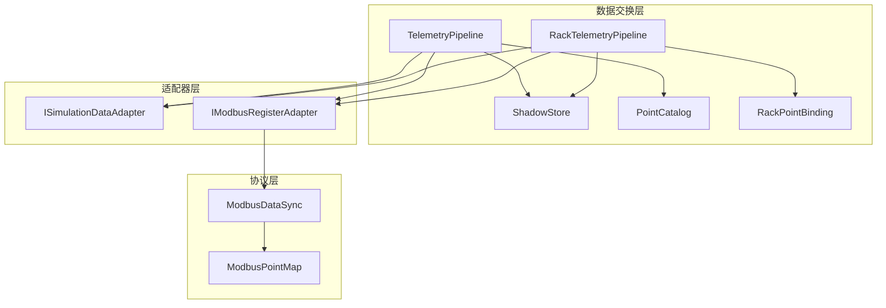
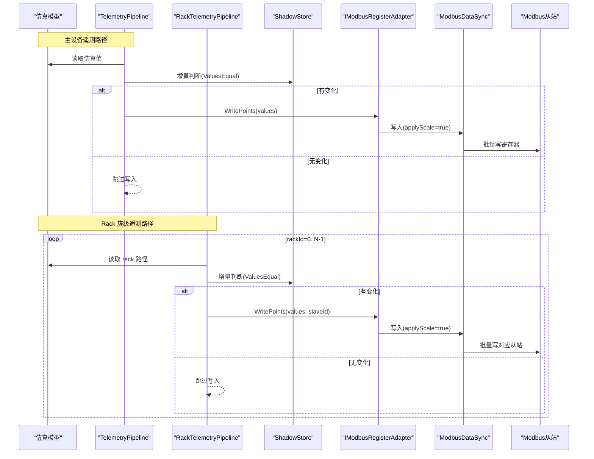
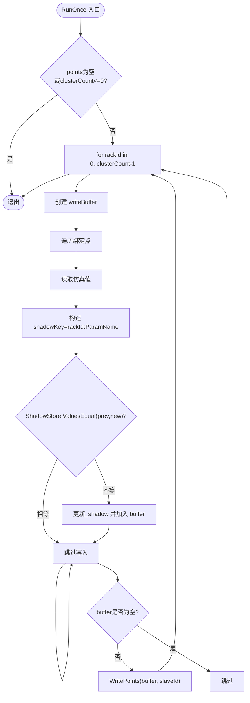
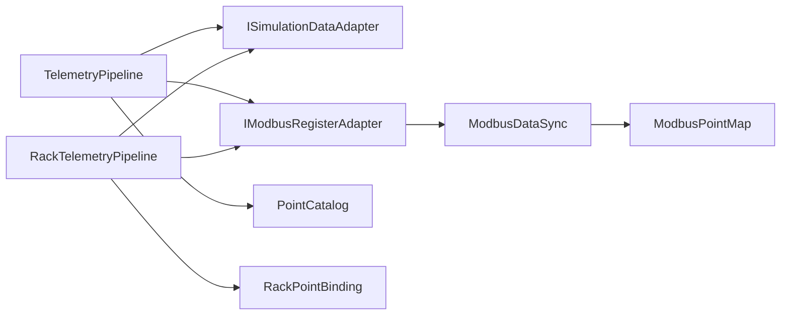

# 遥测数据管道

<cite>
**本文引用的文件**
- [RackTelemetryPipeline.cs](file://DataExchange/Pipeline/RackTelemetryPipeline.cs)
- [ShadowStore.cs](file://DataExchange/Pipeline/ShadowStore.cs)
- [TelemetryPipeline.cs](file://DataExchange/Pipeline/TelemetryPipeline.cs)
- [PointCatalog.cs](file://DataExchange/Catalog/PointCatalog.cs)
- [RackPointBinding.cs](file://DataExchange/Catalog/RackPointBinding.cs)
- [DataExchangeOptions.cs](file://DataExchange/Config/DataExchangeOptions.cs)
- [IModbusRegisterAdapter.cs](file://DataExchange/Adapters/IModbusRegisterAdapter.cs)
- [ISimulationDataAdapter.cs](file://DataExchange/Adapters/ISimulationDataAdapter.cs)
- [ModbusRegisterAdapter.cs](file://DataExchange/Adapters/ModbusRegisterAdapter.cs)
- [ModbusDataSync.cs](file://Protocol/Modbus/ModbusDataSync.cs)
- [ModbusPointMap.cs](file://Protocol/Modbus/ModbusPointMap.cs)
- [ControlValueCoercion.cs](file://DataExchange/Pipeline/ControlValueCoercion.cs)
- [ModbusValueConverter.cs](file://LocalControl/ModbusValueConverter.cs)
- [DataExchangeSession.cs](file://DataExchange/DataExchangeSession.cs)
</cite>

## 目录
1. [简介](#简介)
2. [项目结构](#项目结构)
3. [核心组件](#核心组件)
4. [架构总览](#架构总览)
5. [详细组件分析](#详细组件分析)
6. [依赖关系分析](#依赖关系分析)
7. [性能考量](#性能考量)
8. [故障诊断指南](#故障诊断指南)
9. [结论](#结论)
10. [附录](#附录)

## 简介
本文件系统性说明储能仿真系统中“遥测数据管道”的完整处理流程：从仿真模型采集数据，经数据转换与缩放计算，最终批量写入 Modbus 寄存器。重点解析 RackTelemetryPipeline 的簇级（多从站）遥测处理能力、数据路由策略与性能优化；阐述遥测点映射机制、数据类型转换规则、精度控制与错误处理策略；并详细说明 ShadowStore 缓存与增量更新逻辑、配置选项（采样频率、批量大小、超时等）、性能监控指标与扩展自定义遥测处理的方法。

## 项目结构
遥测数据管道位于 DataExchange 层，围绕“采集—去重—批量写入”的主线组织：
- 管道层：TelemetryPipeline（主设备 FC3/4），RackTelemetryPipeline（BMS Rack 簇级 FC3/4）
- 数据目录：PointCatalog、PointBinding、RackPointBinding 描述点位绑定与路径模板
- 适配器层：ISimulationDataAdapter（读仿真值）、IModbusRegisterAdapter（写 Modbus）
- 协议层：ModbusDataSync、ModbusPointMap、ModbusParser 负责底层 Modbus 读写、点位索引与编解码
- 配置：DataExchangeOptions 提供刷新周期与控制策略开关

图表来源
- [TelemetryPipeline.cs:1-52](file://DataExchange/Pipeline/TelemetryPipeline.cs#L1-L52)
- [RackTelemetryPipeline.cs:1-71](file://DataExchange/Pipeline/RackTelemetryPipeline.cs#L1-L71)
- [ShadowStore.cs:1-59](file://DataExchange/Pipeline/ShadowStore.cs#L1-L59)
- [PointCatalog.cs:1-25](file://DataExchange/Catalog/PointCatalog.cs#L1-L25)
- [RackPointBinding.cs:1-14](file://DataExchange/Catalog/RackPointBinding.cs#L1-L14)
- [IModbusRegisterAdapter.cs:1-11](file://DataExchange/Adapters/IModbusRegisterAdapter.cs#L1-L11)
- [ISimulationDataAdapter.cs:1-9](file://DataExchange/Adapters/ISimulationDataAdapter.cs#L1-L9)
- [ModbusDataSync.cs:1-486](file://Protocol/Modbus/ModbusDataSync.cs#L1-L486)
- [ModbusPointMap.cs:1-126](file://Protocol/Modbus/ModbusPointMap.cs#L1-L126)

章节来源
- [TelemetryPipeline.cs:1-52](file://DataExchange/Pipeline/TelemetryPipeline.cs#L1-L52)
- [RackTelemetryPipeline.cs:1-71](file://DataExchange/Pipeline/RackTelemetryPipeline.cs#L1-L71)
- [ShadowStore.cs:1-59](file://DataExchange/Pipeline/ShadowStore.cs#L1-L59)
- [PointCatalog.cs:1-25](file://DataExchange/Catalog/PointCatalog.cs#L1-L25)
- [RackPointBinding.cs:1-14](file://DataExchange/Catalog/RackPointBinding.cs#L1-L14)
- [DataExchangeOptions.cs:1-33](file://DataExchange/Config/DataExchangeOptions.cs#L1-L33)
- [ModbusDataSync.cs:1-486](file://Protocol/Modbus/ModbusDataSync.cs#L1-L486)
- [ModbusPointMap.cs:1-126](file://Protocol/Modbus/ModbusPointMap.cs#L1-L126)

## 核心组件
- TelemetryPipeline：按 PointCatalog 中的遥测点列表，循环读取仿真值，使用 ShadowStore 做增量去重，最后通过 IModbusRegisterAdapter 批量写入。
- RackTelemetryPipeline：针对 BMS Rack 簇级遥测，按 rackId 遍历，为每个从站生成独立 writeBuffer，实现多从站并行写入。
- ShadowStore：维护遥测/控制的影子值，提供 ValuesEqual 比较（布尔/浮点容差），避免无变化时的重复 I/O。
- PointCatalog / PointBinding / RackPointBinding：集中管理点位绑定、目标路径、函数码分类以及 rackId 占位符的路径解析。
- IModbusRegisterAdapter / ModbusRegisterAdapter：封装对底层 ModbusSlave 的写入，支持 applyScale、slaveId 参数，抑制通知以避免风暴。
- ModbusDataSync / ModbusPointMap：加载 CSV 点位表，建立主设备与 Rack 级索引，启动 Worker 线程周期性写入，并维护各自 shadow。

章节来源
- [TelemetryPipeline.cs:1-52](file://DataExchange/Pipeline/TelemetryPipeline.cs#L1-L52)
- [RackTelemetryPipeline.cs:1-71](file://DataExchange/Pipeline/RackTelemetryPipeline.cs#L1-L71)
- [ShadowStore.cs:1-59](file://DataExchange/Pipeline/ShadowStore.cs#L1-L59)
- [PointCatalog.cs:1-25](file://DataExchange/Catalog/PointCatalog.cs#L1-L25)
- [RackPointBinding.cs:1-14](file://DataExchange/Catalog/RackPointBinding.cs#L1-L14)
- [IModbusRegisterAdapter.cs:1-11](file://DataExchange/Adapters/IModbusRegisterAdapter.cs#L1-L11)
- [ModbusRegisterAdapter.cs:1-45](file://DataExchange/Adapters/ModbusRegisterAdapter.cs#L1-L45)
- [ModbusDataSync.cs:1-486](file://Protocol/Modbus/ModbusDataSync.cs#L1-L486)
- [ModbusPointMap.cs:1-126](file://Protocol/Modbus/ModbusPointMap.cs#L1-L126)

## 架构总览
下图展示从仿真到 Modbus 的端到端数据流，包括主设备与 Rack 簇级两条路径，以及 ShadowStore 的去重与批量写入机制。

图表来源
- [TelemetryPipeline.cs:28-49](file://DataExchange/Pipeline/TelemetryPipeline.cs#L28-L49)
- [RackTelemetryPipeline.cs:35-68](file://DataExchange/Pipeline/RackTelemetryPipeline.cs#L35-L68)
- [ShadowStore.cs:15-22](file://DataExchange/Pipeline/ShadowStore.cs#L15-L22)
- [ModbusRegisterAdapter.cs:24-45](file://DataExchange/Adapters/ModbusRegisterAdapter.cs#L24-L45)
- [ModbusDataSync.cs:137-193](file://Protocol/Modbus/ModbusDataSync.cs#L137-L193)

## 详细组件分析

### RackTelemetryPipeline：簇级遥测处理
- 多从站支持：基于 baseSlaveId + rackId 计算 slaveId，逐 rack 构建 writeBuffer，再调用 WritePoints(slaveId)。
- 数据路由：通过 RackPointBinding.ResolvePath(rackId) 将 rackId 注入路径模板，定位具体仿真对象。
- 增量更新：以 rackId:ParamName 作为 key 存入本地 _shadow，结合 ShadowStore.ValuesEqual 进行浮点容差比较，避免重复写入。
- 错误处理：捕获异常并记录调试日志，保证单点失败不影响其他 rack 或点位。
- 性能优化：每 rack 独立缓冲，减少跨从站混写；空集合快速返回；仅当有变更才触发 I/O。

图表来源
- [RackTelemetryPipeline.cs:35-68](file://DataExchange/Pipeline/RackTelemetryPipeline.cs#L35-L68)
- [ShadowStore.cs:39-56](file://DataExchange/Pipeline/ShadowStore.cs#L39-L56)

章节来源
- [RackTelemetryPipeline.cs:1-71](file://DataExchange/Pipeline/RackTelemetryPipeline.cs#L1-L71)
- [RackPointBinding.cs:1-14](file://DataExchange/Catalog/RackPointBinding.cs#L1-L14)
- [ShadowStore.cs:1-59](file://DataExchange/Pipeline/ShadowStore.cs#L1-L59)

### TelemetryPipeline：主设备遥测处理
- 统一扫描 PointCatalog.TelemetryPoints，读取仿真值并通过 ShadowStore 去重。
- 聚合 writeBuffer 后一次性写入，降低网络与总线开销。
- 异常捕获与日志记录，确保健壮性。

章节来源
- [TelemetryPipeline.cs:1-52](file://DataExchange/Pipeline/TelemetryPipeline.cs#L1-L52)

### ShadowStore：增量更新与精度控制
- 遥测去重：TelemetryChanged 比较 prev/new，若相等则不更新。
- 控制去重：TryDetectControlChange 检测控制值变化，CommitControl 提交新值。
- 精度控制：ValuesEqual 对布尔与浮点数采用容差比较（1e-9），避免浮点抖动导致频繁写入。
- 失效与清空：InvalidateTelemetry 用于局部失效；ClearTelemetry 在 Modbus 重连后强制全量回写。

章节来源
- [ShadowStore.cs:1-59](file://DataExchange/Pipeline/ShadowStore.cs#L1-L59)

### 数据目录与路径模板
- PointCatalog：集中管理 TelemetryPoints、ControlPoints、RackTelemetryPoints、RackControlPoints 及默认值。
- PointBinding：标记 IsTelemetry/IsControl，承载 FunctionCode、Semantics、Effect。
- RackPointBinding：BindingPathTemplate 含 rackId 占位符，ResolvePath 动态替换。

章节来源
- [PointCatalog.cs:1-25](file://DataExchange/Catalog/PointCatalog.cs#L1-L25)
- [RackPointBinding.cs:1-14](file://DataExchange/Catalog/RackPointBinding.cs#L1-L14)

### 适配器与批量写入
- IModbusRegisterAdapter：定义 WriteDefaults、WritePoints、ReadAllControlRaw、ReadParsedPoint。
- ModbusRegisterAdapter：封装底层写入，支持 suppress notifications，避免写风暴；传递 slaveId 与 applyScale。
- 批量写入：管道层聚合字典后一次调用 WritePoints，减少通信次数。

章节来源
- [IModbusRegisterAdapter.cs:1-11](file://DataExchange/Adapters/IModbusRegisterAdapter.cs#L1-L11)
- [ModbusRegisterAdapter.cs:1-45](file://DataExchange/Adapters/ModbusRegisterAdapter.cs#L1-L45)

### 协议层：ModbusDataSync 与 ModbusPointMap
- ModbusDataSync：
  - 启动时写入默认值，初始化控制点初始值。
  - 为每个 modelType 启动 Worker 线程，周期性读取模型值，比较 shadow，有变化则批量写入。
  - RackWorkerLoop 按 rackId 分组，按从站写入。
  - 控制线程轮询控制寄存器，解析后写回模型，带类型对齐与线圈/寄存器规范化。
- ModbusPointMap：
  - 从 CSV 加载点位表，区分 data/control/rack 数据。
  - 建立 ParamModelLookup、ModelParamLookup、Rack* 索引，便于 Worker 分组与寻址。
  - 支持设备 ID 替换（bmsDeviceId、pvDeviceId、emuDeviceId）。

章节来源
- [ModbusDataSync.cs:1-486](file://Protocol/Modbus/ModbusDataSync.cs#L1-L486)
- [ModbusPointMap.cs:1-126](file://Protocol/Modbus/ModbusPointMap.cs#L1-L126)

### 数据类型转换与缩放
- 控制值规范化：
  - ControlValueCoercion.CoerceForModbusRegister：线圈强制 0/1，字符串转数值/布尔。
  - ModbusValueConverter.ToDouble：多种原始类型归一化为 double。
- 缩放与编码：
  - ModbusRegisterAdapter.WritePoints 默认 applyScale=true，由底层编码器根据 MapEntry.Scale 与 Type 进行字节序与缩放处理。
  - 测试用例验证 float 的 CDAB 字节序与缩放行为。

章节来源
- [ControlValueCoercion.cs:1-31](file://DataExchange/Pipeline/ControlValueCoercion.cs#L1-L31)
- [ModbusValueConverter.cs:1-48](file://LocalControl/ModbusValueConverter.cs#L1-L48)
- [ModbusRegisterAdapter.cs:24-45](file://DataExchange/Adapters/ModbusRegisterAdapter.cs#L24-L45)

### 运行调度与生命周期
- DataExchangeSession 中维护 RackTelemetryLoop、ControlLoop、FeedbackLoop，按 TelemetryIntervalForDevice 与 ControlPollIntervalMs 休眠，形成稳定节拍。
- RackTelemetryPipeline.RunOnce 被周期性调用，完成一次 rack 级遥测采集与写入。

章节来源
- [DataExchangeSession.cs:441-505](file://DataExchange/DataExchangeSession.cs#L441-L505)

## 依赖关系分析
- 松耦合设计：管道仅依赖抽象接口 ISimulationDataAdapter 与 IModbusRegisterAdapter，便于替换后端。
- 分层清晰：数据目录（PointCatalog/RackPointBinding）解耦路径模板；协议层（ModbusDataSync/ModbusPointMap）屏蔽底层细节。
- 潜在循环依赖：当前未见直接循环引用；各模块职责单一，依赖方向自上而下。

图表来源
- [TelemetryPipeline.cs:1-52](file://DataExchange/Pipeline/TelemetryPipeline.cs#L1-L52)
- [RackTelemetryPipeline.cs:1-71](file://DataExchange/Pipeline/RackTelemetryPipeline.cs#L1-L71)
- [IModbusRegisterAdapter.cs:1-11](file://DataExchange/Adapters/IModbusRegisterAdapter.cs#L1-L11)
- [ModbusDataSync.cs:1-486](file://Protocol/Modbus/ModbusDataSync.cs#L1-L486)
- [ModbusPointMap.cs:1-126](file://Protocol/Modbus/ModbusPointMap.cs#L1-L126)
- [PointCatalog.cs:1-25](file://DataExchange/Catalog/PointCatalog.cs#L1-L25)
- [RackPointBinding.cs:1-14](file://DataExchange/Catalog/RackPointBinding.cs#L1-L14)

## 性能考量
- 增量去重：ShadowStore.ValuesEqual 使用浮点容差，显著减少无意义写入。
- 批量写入：管道层聚合字典后单次调用 WritePoints，降低总线负载。
- 多从站并行：RackTelemetryPipeline 按 rackId 分片写入，避免跨从站混写。
- 线程隔离：ModbusDataSync 为不同 modelType 分配独立 Worker 线程，避免热点争用。
- 建议优化：
  - 合理设置 TelemetryIntervalMs/EmuTelemetryIntervalMs，平衡实时性与 CPU 占用。
  - 增大批量大小（由管道内部聚合决定）可减少网络往返。
  - 对高频点考虑合并写入窗口，进一步降低抖动。

[本节为通用指导，无需特定文件来源]

## 故障诊断指南
- 常见症状与排查：
  - 无遥测输出：检查 PointCatalog 是否包含遥测点；确认 ISimulationDataAdapter.Read 返回值非空；查看 ShadowStore 是否误判相等。
  - 部分 rack 无数据：核对 baseSlaveId 与 clusterCount；确认 RackPointBinding 路径模板正确替换 rackId。
  - 写入失败：查看 IModbusRegisterAdapter 与 ModbusDataSync 日志；确认 slaveId 与 applyScale 设置；检查 Modbus 从站在线状态。
  - 控制值不一致：检查 ControlValueCoercion 与 ModbusValueConverter 的类型转换；确认线圈/寄存器函数码匹配。
- 日志关键字：
  - “Telemetry read failed”、“Rack telemetry read failed”、“Worker error”、“Control thread error”。
- 恢复手段：
  - ShadowStore.ClearTelemetry 或 RackTelemetryPipeline.ClearShadow 在 Modbus 重连后强制全量回写。
  - 调整 DataExchangeOptions 的 ControlEventDriven 与 ControlPollIntervalMs 提升控制响应。

章节来源
- [TelemetryPipeline.cs:28-49](file://DataExchange/Pipeline/TelemetryPipeline.cs#L28-L49)
- [RackTelemetryPipeline.cs:35-68](file://DataExchange/Pipeline/RackTelemetryPipeline.cs#L35-L68)
- [ShadowStore.cs:33-37](file://DataExchange/Pipeline/ShadowStore.cs#L33-L37)
- [ModbusDataSync.cs:137-193](file://Protocol/Modbus/ModbusDataSync.cs#L137-L193)
- [DataExchangeOptions.cs:1-33](file://DataExchange/Config/DataExchangeOptions.cs#L1-L33)

## 结论
遥测数据管道通过清晰的层次化设计与增量去重机制，实现了从仿真模型到 Modbus 寄存器的高效、可靠传输。RackTelemetryPipeline 在多从站场景下具备良好可扩展性与稳定性；ShadowStore 提供精确的浮点容差比较，避免抖动；协议层通过 Worker 线程与批量写入保障吞吐。配合合理的配置与监控，可支撑大规模集群的高频遥测需求。

[本节为总结，无需特定文件来源]

## 附录

### 遥测点映射机制
- 主设备：PointCatalog.TelemetryPoints 指定 Target.FullPath 与 ParamName。
- Rack 级：RackPointBinding.BindingPathTemplate 使用 rackId 占位符，ResolvePath 动态生成路径。
- 函数码分类：PointBinding.IsTelemetry/IsControl 依据 FunctionCode 判定。

章节来源
- [PointCatalog.cs:1-25](file://DataExchange/Catalog/PointCatalog.cs#L1-L25)
- [RackPointBinding.cs:1-14](file://DataExchange/Catalog/RackPointBinding.cs#L1-L14)
- [PointBinding.cs:1-14](file://DataExchange/Catalog/PointBinding.cs#L1-L14)

### 数据类型转换规则与精度控制
- 布尔与浮点：ShadowStore.ValuesEqual 对 bool 与 double 采用容差比较。
- 控制值规范化：ControlValueCoercion 将线圈强制为 0/1；ModbusValueConverter 统一归一化为 double。
- 缩放与编码：ModbusRegisterAdapter 默认 applyScale=true，由底层编码器根据 Scale 与 Type 处理。

章节来源
- [ShadowStore.cs:39-56](file://DataExchange/Pipeline/ShadowStore.cs#L39-L56)
- [ControlValueCoercion.cs:1-31](file://DataExchange/Pipeline/ControlValueCoercion.cs#L1-L31)
- [ModbusValueConverter.cs:1-48](file://LocalControl/ModbusValueConverter.cs#L1-L48)
- [ModbusRegisterAdapter.cs:24-45](file://DataExchange/Adapters/ModbusRegisterAdapter.cs#L24-L45)

### 配置选项
- DataExchangeOptions：
  - TelemetryIntervalMs：BMS/Rack 遥测刷新周期（毫秒）。
  - EmuTelemetryIntervalMs：EMU（PCS）遥测刷新周期（毫秒）。
  - ControlEventDriven：外部写控制区后是否立即触发控制管道。
  - ControlPollIntervalMs：控制轮询间隔（毫秒）。
  - ControlSemantics/ControlEffects：控制语义与效果映射。

章节来源
- [DataExchangeOptions.cs:1-33](file://DataExchange/Config/DataExchangeOptions.cs#L1-L33)

### 性能监控指标
- 遥测写入率：单位时间内成功写入的点数（可由日志统计）。
- 去重命中率：ShadowStore.ValuesEqual 命中比例，反映数据稳定性。
- 批量大小：每次 WritePoints 的字典条目数，越大越能降低网络开销。
- 从站延迟：ModbusDataSync 写入到从站响应的时间分布（需外部埋点）。

[本节为通用指导，无需特定文件来源]

### 扩展自定义遥测处理逻辑
- 新增数据源：实现 ISimulationDataAdapter 并提供 Read/Write。
- 新增适配器：实现 IModbusRegisterAdapter，适配新的 Modbus 后端或协议。
- 新增管道：参考 TelemetryPipeline/RackTelemetryPipeline 模式，接入 ShadowStore 与批量写入。
- 注册到会话：在 DataExchangeSession 中集成新管道的 RunOnce 调用与调度。

章节来源
- [ISimulationDataAdapter.cs:1-9](file://DataExchange/Adapters/ISimulationDataAdapter.cs#L1-L9)
- [IModbusRegisterAdapter.cs:1-11](file://DataExchange/Adapters/IModbusRegisterAdapter.cs#L1-L11)
- [TelemetryPipeline.cs:1-52](file://DataExchange/Pipeline/TelemetryPipeline.cs#L1-L52)
- [RackTelemetryPipeline.cs:1-71](file://DataExchange/Pipeline/RackTelemetryPipeline.cs#L1-L71)
- [DataExchangeSession.cs:441-505](file://DataExchange/DataExchangeSession.cs#L441-L505)