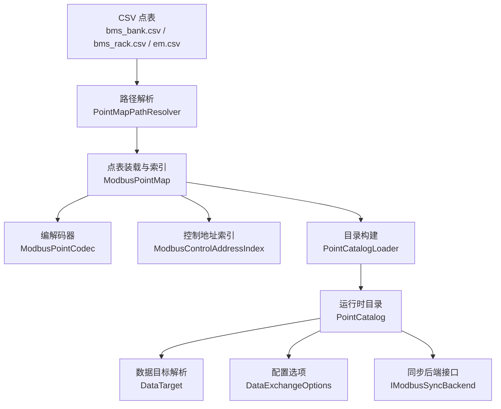
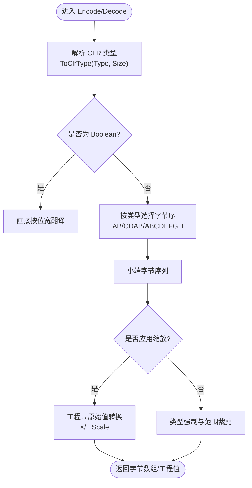
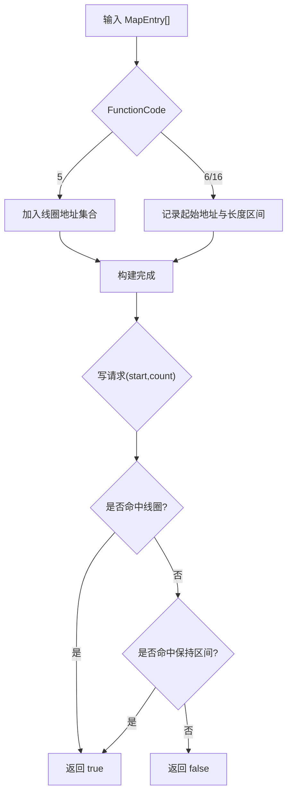
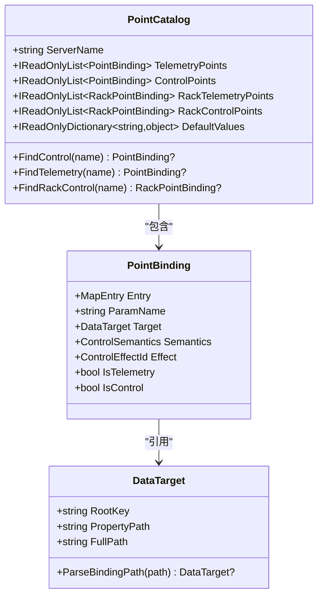
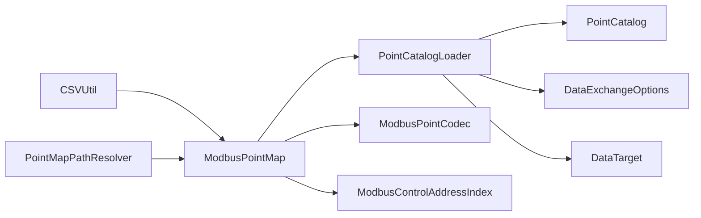

# 点表映射系统

<cite>
**本文引用的文件**
- [ModbusPointCodec.cs](file://Protocol/Modbus/ModbusPointCodec.cs)
- [ModbusPointMap.cs](file://Protocol/Modbus/ModbusPointMap.cs)
- [PointMapPathResolver.cs](file://Protocol/Modbus/PointMapPathResolver.cs)
- [PointCatalogLoader.cs](file://DataExchange/Catalog/PointCatalogLoader.cs)
- [PointCatalog.cs](file://DataExchange/Catalog/PointCatalog.cs)
- [PointBinding.cs](file://DataExchange/Catalog/PointBinding.cs)
- [DataTarget.cs](file://DataExchange/Catalog/DataTarget.cs)
- [DataExchangeOptions.cs](file://DataExchange/Config/DataExchangeOptions.cs)
- [IModbusSyncBackend.cs](file://Protocol/Modbus/IModbusSyncBackend.cs)
- [ModbusControlAddressIndex.cs](file://Protocol/Modbus/ModbusControlAddressIndex.cs)
- [CSVUtil.cs](file://Helper/CSVUtil.cs)
- [bms_bank.csv](file://pointmaps/common/bms_bank.csv)
- [bms_rack.csv](file://pointmaps/common/bms_rack.csv)
- [em.csv](file://pointmaps/common/em.csv)
- [README.md](file://pointmaps/README.md)
</cite>

## 目录
1. [简介](#简介)
2. [项目结构](#项目结构)
3. [核心组件](#核心组件)
4. [架构总览](#架构总览)
5. [详细组件分析](#详细组件分析)
6. [依赖关系分析](#依赖关系分析)
7. [性能考虑](#性能考虑)
8. [故障排查指南](#故障排查指南)
9. [结论](#结论)
10. [附录](#附录)

## 简介
本系统提供“点表映射”能力，将外部 Modbus 寄存器（地址、功能码、数据类型）与仿真侧数据模型属性进行双向绑定。通过 CSV 点表定义数据点、地址映射规则与路径解析机制；通过编解码器完成类型转换、字节序处理与精度缩放；通过控制地址索引实现写事件过滤；通过目录加载器构建可查询的运行时目录，支持静态配置与动态加载。

## 项目结构
- 协议层：负责 Modbus 点表解析、编解码、路径解析与控制地址索引
- 数据交换层：基于点表构建 PointCatalog，封装遥测/控制点绑定、默认值、语义与效果
- 配置层：提供刷新周期、事件驱动开关、控制语义与效果等选项
- 点表资源：按版本管理的 CSV 点表与说明文档



图表来源
- [PointMapPathResolver.cs:12-50](file://Protocol/Modbus/PointMapPathResolver.cs#L12-L50)
- [ModbusPointMap.cs:31-102](file://Protocol/Modbus/ModbusPointMap.cs#L31-L102)
- [ModbusPointCodec.cs:9-84](file://Protocol/Modbus/ModbusPointCodec.cs#L9-L84)
- [ModbusControlAddressIndex.cs:11-58](file://Protocol/Modbus/ModbusControlAddressIndex.cs#L11-L58)
- [PointCatalogLoader.cs:56-158](file://DataExchange/Catalog/PointCatalogLoader.cs#L56-L158)
- [PointCatalog.cs:3-23](file://DataExchange/Catalog/PointCatalog.cs#L3-L23)
- [DataTarget.cs:4-27](file://DataExchange/Catalog/DataTarget.cs#L4-L27)
- [DataExchangeOptions.cs:5-30](file://DataExchange/Config/DataExchangeOptions.cs#L5-L30)
- [IModbusSyncBackend.cs:4-13](file://Protocol/Modbus/IModbusSyncBackend.cs#L4-L13)

章节来源
- [README.md:1-37](file://pointmaps/README.md#L1-L37)

## 核心组件
- 路径解析器：定位运行时点表文件，优先工作目录/输出目录，其次 common 与版本子目录
- 点表装载器：读取 CSV，应用设备 ID 替换，建立数据/控制点索引、模型参数映射与默认缓冲
- 编解码器：根据 Type/Size 映射 CLR 类型，处理字节序（AB/CDAB/ABCDEFGH），执行精度缩放与类型强制
- 控制地址索引：从点表提取线圈/保持寄存器控制区段，用于快速判断写请求是否命中控制点
- 目录构建器：将 ModbusPointMap 编译为 PointCatalog，解析 DataTarget 路径，注入控制语义与效果
- 数据目标：解析 rootKey.PropertyPath，形成完整属性路径
- 配置选项：遥测刷新周期、控制事件驱动、控制语义与效果覆盖
- 同步后端接口：统一数据读写、失效、发布与 rack 级控制写入

章节来源
- [PointMapPathResolver.cs:12-66](file://Protocol/Modbus/PointMapPathResolver.cs#L12-L66)
- [ModbusPointMap.cs:31-123](file://Protocol/Modbus/ModbusPointMap.cs#L31-L123)
- [ModbusPointCodec.cs:9-124](file://Protocol/Modbus/ModbusPointCodec.cs#L9-L124)
- [ModbusControlAddressIndex.cs:11-58](file://Protocol/Modbus/ModbusControlAddressIndex.cs#L11-L58)
- [PointCatalogLoader.cs:56-211](file://DataExchange/Catalog/PointCatalogLoader.cs#L56-L211)
- [PointCatalog.cs:3-23](file://DataExchange/Catalog/PointCatalog.cs#L3-L23)
- [DataTarget.cs:4-27](file://DataExchange/Catalog/DataTarget.cs#L4-L27)
- [DataExchangeOptions.cs:5-30](file://DataExchange/Config/DataExchangeOptions.cs#L5-L30)
- [IModbusSyncBackend.cs:4-13](file://Protocol/Modbus/IModbusSyncBackend.cs#L4-L13)

## 架构总览
点表映射系统以 CSV 为契约，通过路径解析与装载器生成运行时索引，再由目录构建器产出可查询的目录对象。编解码器贯穿读/写流程，确保数值在工程单位与原始寄存器之间正确转换。控制地址索引为写事件提供快速命中判定，配合配置项实现事件驱动或轮询兜底的控制管道。

```mermaid
sequenceDiagram
participant CSV as "CSV 点表"
participant PR as "路径解析器"
participant PM as "点表装载器"
participant PC as "编解码器"
participant PL as "目录构建器"
participant CAT as "运行时目录"
participant OPT as "配置选项"
CSV->>PR : 请求解析文件名
PR-->>PM : 返回已解析路径
PM->>PM : 读取CSV并应用设备ID替换
PM->>PM : 建立数据/控制索引与模型映射
PM->>PL : 传入 ModbusPointMap
PL->>OPT : 读取控制语义/效果配置
PL->>PL : 解析 DataTarget 路径
PL-->>CAT : 生成 PointCatalog(含默认值)
Note over PC,PM : 编解码器在读写时按Type/Size/Scale处理
```

图表来源
- [PointMapPathResolver.cs:12-50](file://Protocol/Modbus/PointMapPathResolver.cs#L12-L50)
- [ModbusPointMap.cs:31-102](file://Protocol/Modbus/ModbusPointMap.cs#L31-L102)
- [PointCatalogLoader.cs:56-158](file://DataExchange/Catalog/PointCatalogLoader.cs#L56-L158)
- [DataExchangeOptions.cs:5-30](file://DataExchange/Config/DataExchangeOptions.cs#L5-L30)
- [ModbusPointCodec.cs:61-84](file://Protocol/Modbus/ModbusPointCodec.cs#L61-L84)

## 详细组件分析

### 点表文件结构与字段规范
- 文件位置与版本管理
  - 运行期固定文件名：emu.csv、em.csv、bms_bank.csv、bms_rack.csv、lc.csv
  - 源文件按版本目录组织（common/lc/battery），发布或联调时复制到输出目录
  - 各版本目录包含 version.json（id 与目录名一致）
- CSV 字段说明
  - FunctionCode：Modbus 功能码（3/4 遥测，5/6/16 控制）
  - Address：起始地址
  - Type：数据类型（bool/u16/int16/u32/int32/float/u64/int64/double）
  - Size：位宽（1/16/32/64）
  - ParamName：点名
  - Scale：缩放因子（工程值 = 原始值 / Scale，编码时反向）
  - Description：描述
  - ModelSim：绑定表达式，形如 model=4|arg1=...|arg2=...|arg3=...|arg4=...
- 示例文件
  - 电池簇级点表：bms_bank.csv
  - Rack 级点表：bms_rack.csv
  - EMS 交流量测点表：em.csv

章节来源
- [README.md:1-37](file://pointmaps/README.md#L1-L37)
- [bms_bank.csv:1-183](file://pointmaps/common/bms_bank.csv#L1-L183)
- [bms_rack.csv:1-141](file://pointmaps/common/bms_rack.csv#L1-L141)
- [em.csv:1-23](file://pointmaps/common/em.csv#L1-L23)

### 地址映射规则与路径解析机制
- 路径解析优先级
  - 绝对路径存在则直接使用
  - 当前工作目录/应用基目录下同名文件
  - 同目录下的 pointmaps/common/<name>
  - 若根目录存在 pointmaps 目录，遍历各版本子目录查找
  - 未找到抛出明确错误提示
- 伴随文件解析
  - 给定已解析的主点表路径，尝试在同目录查找伴随文件（如 bms_rack.csv），不存在则回退到 Resolve
- 设备 ID 替换
  - 从 serverName 提取数字 deviceId，替换 ModelSim 中的占位符（bmsdeviceId/pvDeviceId/deviceId/emuDeviceId）

章节来源
- [PointMapPathResolver.cs:12-66](file://Protocol/Modbus/PointMapPathResolver.cs#L12-L66)
- [ModbusPointMap.cs:104-123](file://Protocol/Modbus/ModbusPointMap.cs#L104-L123)

### Modbus 点编解码器实现
- 类型映射
  - 将 CSV 的 Type/Size 映射为 CLR 类型（Boolean/Int16/UInt16/Int32/UInt32/Int64/UInt64/Single/Double）
  - 当 Type 为空时，依据 Size 推断类型
- 字节序处理
  - 16 位：AB
  - 32 位（int32/u32/float）：CDAB（字交换）
  - 64 位（int64/u64/double）：ABCDEFGH（双字顺序）
- 精度控制
  - 编码：工程值 × Scale → 取整/截断至目标类型范围
  - 解码：原始值 ÷ Scale（Scale 为 0 视为 1）
- 布尔值处理
  - 支持 bool/字符串/数值到布尔的多态转换



图表来源
- [ModbusPointCodec.cs:9-84](file://Protocol/Modbus/ModbusPointCodec.cs#L9-L84)
- [ModbusPointCodec.cs:86-124](file://Protocol/Modbus/ModbusPointCodec.cs#L86-L124)

章节来源
- [ModbusPointCodec.cs:9-124](file://Protocol/Modbus/ModbusPointCodec.cs#L9-L124)

### 控制地址索引的构建与维护
- 构建过程
  - 扫描点表，收集 FC5 线圈地址集合与 FC6/FC16 保持寄存器区间
  - 计算每个点的寄存器长度（Size/16 向上取整）
- 维护策略
  - 基于内存集合与区间列表，避免重复扫描点表
  - 支持批量写请求的快速命中判断
- 使用场景
  - 外部写事件过滤：仅对命中控制区的写请求触发控制管道
  - 降低无效写带来的开销



图表来源
- [ModbusControlAddressIndex.cs:11-58](file://Protocol/Modbus/ModbusControlAddressIndex.cs#L11-L58)

章节来源
- [ModbusControlAddressIndex.cs:11-58](file://Protocol/Modbus/ModbusControlAddressIndex.cs#L11-L58)

### 点表目录构建与数据目标解析
- 目录构建
  - 从 ModbusPointMap 中提取 DataMaps/ControlMaps/RackDataMaps/RackControlMaps
  - 解析 ModelSim 中的 arg1 作为 DataTarget 绑定路径
  - 注入控制语义（Hold/Pulse/Edge）与控制效果（PcsApplyCommands/BmsApplyLinkCommands 等）
  - 合并默认值缓冲（如 param4 默认值）
- 数据目标解析
  - 将 rootKey.PropertyPath 拆分为 RootKey 与 PropertyPath
  - 生成 FullPath 便于日志与调试



图表来源
- [PointCatalog.cs:3-23](file://DataExchange/Catalog/PointCatalog.cs#L3-L23)
- [PointBinding.cs:3-12](file://DataExchange/Catalog/PointBinding.cs#L3-L12)
- [DataTarget.cs:4-27](file://DataExchange/Catalog/DataTarget.cs#L4-L27)
- [PointCatalogLoader.cs:56-158](file://DataExchange/Catalog/PointCatalogLoader.cs#L56-L158)

章节来源
- [PointCatalogLoader.cs:56-211](file://DataExchange/Catalog/PointCatalogLoader.cs#L56-L211)
- [PointCatalog.cs:3-23](file://DataExchange/Catalog/PointCatalog.cs#L3-L23)
- [PointBinding.cs:3-12](file://DataExchange/Catalog/PointBinding.cs#L3-L12)
- [DataTarget.cs:4-27](file://DataExchange/Catalog/DataTarget.cs#L4-L27)

### 配置方法与动态加载机制
- 静态配置
  - 通过 DataExchangeOptions 设置遥测刷新周期、控制事件驱动开关、控制语义与控制效果覆盖
- 动态加载
  - 运行时通过 PointMapPathResolver 解析点表路径，支持工作目录/输出目录/common/版本子目录
  - 对于 BMS 服务器且 clusterCount>0，自动加载伴随的 bms_rack.csv
  - 通过 PointCatalogLoader.FromPointMap 将 ModbusPointMap 编译为 PointCatalog，供上层使用

章节来源
- [DataExchangeOptions.cs:5-30](file://DataExchange/Config/DataExchangeOptions.cs#L5-L30)
- [PointMapPathResolver.cs:12-66](file://Protocol/Modbus/PointMapPathResolver.cs#L12-L66)
- [ModbusPointMap.cs:31-50](file://Protocol/Modbus/ModbusPointMap.cs#L31-L50)
- [PointCatalogLoader.cs:56-158](file://DataExchange/Catalog/PointCatalogLoader.cs#L56-L158)

### 实际点表示例与映射规则说明
- 电池簇级（bms_bank.csv）
  - 控制点：FC6 写寄存器（如 yt0 一键并网）、FC5 写线圈（如 yx5 过压三级故障）
  - 遥测点：FC4 读寄存器（如 yc0 并网状态、yc9 总电压、yc11 SOC）
  - 绑定路径：ModelSim.arg1 指向 bmsdeviceId.BatteryStacks[0].xxx
- Rack 级（bms_rack.csv）
  - 大量阈值与告警点，绑定路径包含 rackId 索引，用于集群化映射
- EMS 交流量测（em.csv）
  - 三相电压/电流/功率/频率/电能等，绑定路径 em.xxx

章节来源
- [bms_bank.csv:1-183](file://pointmaps/common/bms_bank.csv#L1-L183)
- [bms_rack.csv:1-141](file://pointmaps/common/bms_rack.csv#L1-L141)
- [em.csv:1-23](file://pointmaps/common/em.csv#L1-L23)

## 依赖关系分析
- 模块耦合
  - PointCatalogLoader 依赖 ModbusPointMap、DataExchangeOptions、DataTarget
  - ModbusPointMap 依赖 PointMapPathResolver、CSVUtil、ModbusSimServer（模型参数查询）
  - ModbusPointCodec 被编解码流程复用，不直接依赖其他模块
  - ModbusControlAddressIndex 仅依赖 MapEntry 数组
- 外部依赖
  - CsvReader 用于 CSV 解析
  - 文件系统用于点表定位与读取



图表来源
- [CSVUtil.cs:13-23](file://Helper/CSVUtil.cs#L13-L23)
- [PointMapPathResolver.cs:12-66](file://Protocol/Modbus/PointMapPathResolver.cs#L12-L66)
- [ModbusPointMap.cs:31-102](file://Protocol/Modbus/ModbusPointMap.cs#L31-L102)
- [PointCatalogLoader.cs:56-158](file://DataExchange/Catalog/PointCatalogLoader.cs#L56-L158)
- [ModbusPointCodec.cs:9-84](file://Protocol/Modbus/ModbusPointCodec.cs#L9-L84)
- [ModbusControlAddressIndex.cs:11-58](file://Protocol/Modbus/ModbusControlAddressIndex.cs#L11-L58)
- [DataExchangeOptions.cs:5-30](file://DataExchange/Config/DataExchangeOptions.cs#L5-L30)
- [DataTarget.cs:4-27](file://DataExchange/Catalog/DataTarget.cs#L4-L27)

章节来源
- [CSVUtil.cs:13-23](file://Helper/CSVUtil.cs#L13-L23)
- [PointMapPathResolver.cs:12-66](file://Protocol/Modbus/PointMapPathResolver.cs#L12-L66)
- [ModbusPointMap.cs:31-102](file://Protocol/Modbus/ModbusPointMap.cs#L31-L102)
- [PointCatalogLoader.cs:56-158](file://DataExchange/Catalog/PointCatalogLoader.cs#L56-L158)
- [ModbusPointCodec.cs:9-84](file://Protocol/Modbus/ModbusPointCodec.cs#L9-L84)
- [ModbusControlAddressIndex.cs:11-58](file://Protocol/Modbus/ModbusControlAddressIndex.cs#L11-L58)
- [DataExchangeOptions.cs:5-30](file://DataExchange/Config/DataExchangeOptions.cs#L5-L30)
- [DataTarget.cs:4-27](file://DataExchange/Catalog/DataTarget.cs#L4-L27)

## 性能考虑
- 编解码优化
  - 32 位浮点与整型采用 CDAB 字交换，减少跨平台字节序差异带来的额外处理
  - 整数类型在缩放后取整，避免不必要的浮点运算
- 控制写事件过滤
  - 使用控制地址索引快速判断写请求是否命中控制区，避免无意义的全表扫描
- 目录构建缓存
  - PointCatalog 一次性构建，后续查找 O(1)，适合高频访问
- 刷新周期
  - 通过 DataExchangeOptions 调整遥测刷新周期，平衡实时性与负载

## 故障排查指南
- 找不到点表文件
  - 现象：抛出文件未找到异常，提示执行同步脚本
  - 排查：确认工作目录/输出目录是否存在点表，或执行同步脚本复制点表
- 类型解析失败
  - 现象：无法从 Type/Size 解析点表类型
  - 排查：检查 CSV 中 Type 与 Size 是否匹配，必要时补充 Type 或使用默认 Size 推断
- 字节序错误导致数值异常
  - 现象：浮点或 32 位整型读数异常
  - 排查：确认 32 位数据是否启用 CDAB 字节序，检查 Scale 是否正确
- 控制写未生效
  - 现象：外部写 Modbus 寄存器后未触发控制管道
  - 排查：检查 ControlEventDriven 配置，确认写地址命中控制地址索引
- 绑定路径无效
  - 现象：遥测/控制点未映射到仿真模型
  - 排查：检查 ModelSim.arg1 是否为空或格式错误，确认 DataTarget 解析成功

章节来源
- [PointMapPathResolver.cs:48-50](file://Protocol/Modbus/PointMapPathResolver.cs#L48-L50)
- [ModbusPointCodec.cs:43-50](file://Protocol/Modbus/ModbusPointCodec.cs#L43-L50)
- [ModbusControlAddressIndex.cs:29-58](file://Protocol/Modbus/ModbusControlAddressIndex.cs#L29-L58)
- [DataExchangeOptions.cs:15-21](file://DataExchange/Config/DataExchangeOptions.cs#L15-L21)
- [PointCatalogLoader.cs:66-108](file://DataExchange/Catalog/PointCatalogLoader.cs#L66-L108)

## 结论
点表映射系统通过 CSV 契约与模块化设计，实现了灵活的地址映射、可靠的编解码与高效的控制事件处理。借助路径解析与版本管理，系统支持多环境部署与动态加载；通过配置项与目录构建，满足多样化业务需求。建议在生产环境中严格校验点表文件与配置项，结合故障排查指南快速定位问题。

## 附录
- 常用命令
  - 本地联调：执行同步脚本将点表复制到输出目录
  - 发布：指定版本目录进行发布
- 参考文件
  - 点表说明：README.md
  - 典型点表：bms_bank.csv、bms_rack.csv、em.csv

章节来源
- [README.md:16-33](file://pointmaps/README.md#L16-L33)
- [bms_bank.csv:1-183](file://pointmaps/common/bms_bank.csv#L1-L183)
- [bms_rack.csv:1-141](file://pointmaps/common/bms_rack.csv#L1-L141)
- [em.csv:1-23](file://pointmaps/common/em.csv#L1-L23)