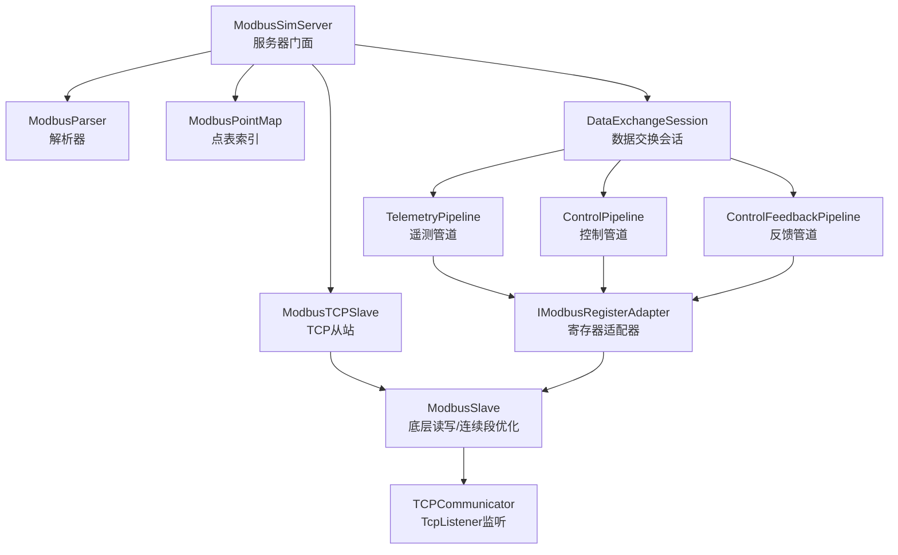
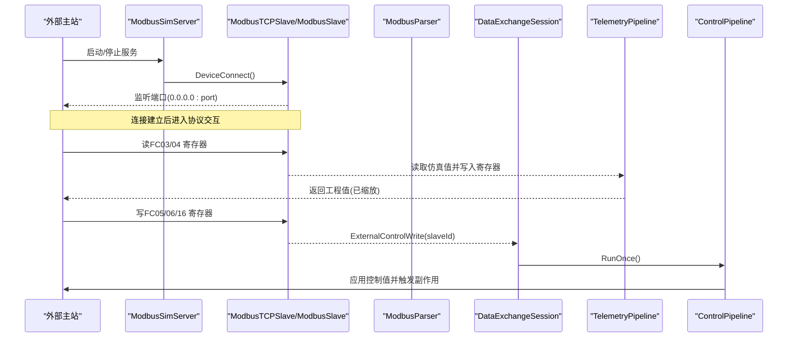
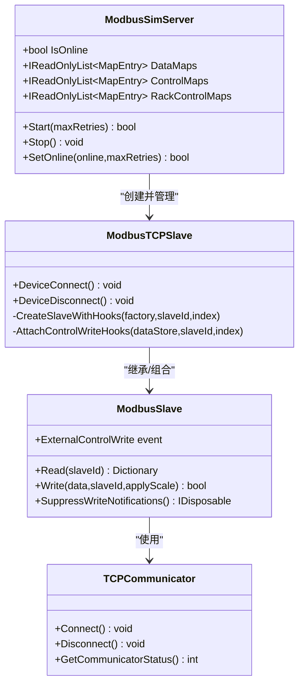
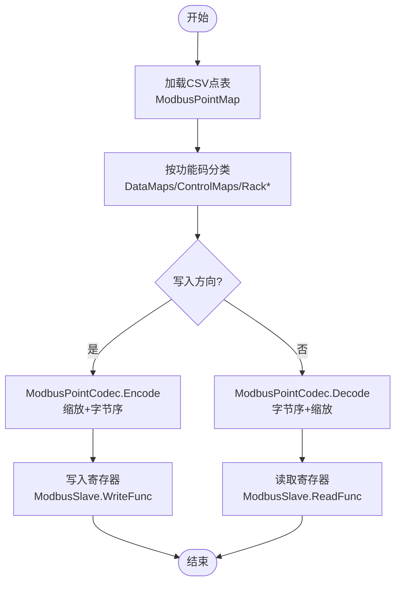
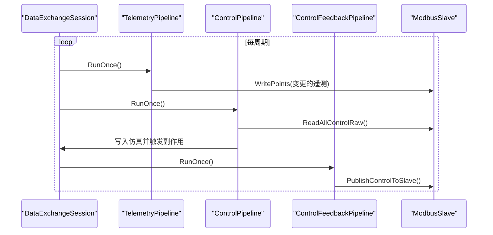
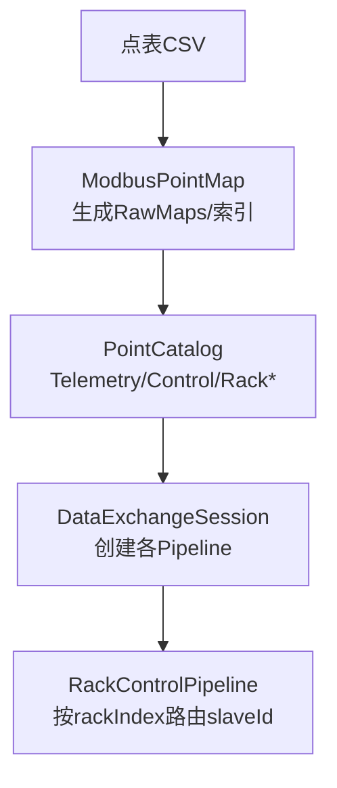
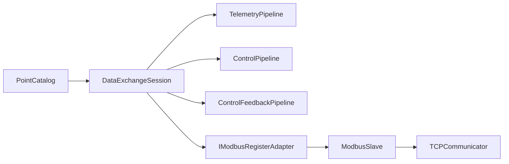

# 通信协议层

<cite>
**本文引用的文件**
- [ModbusSimServer.cs](file://Protocol/ModbusSimServer.cs)
- [IModbusRegisterServer.cs](file://Protocol/IModbusRegisterServer.cs)
- [LocalControlModbusServer.cs](file://LocalControl/LocalControlModbusServer.cs)
- [ModbusTCPSlave.cs](file://Protocol/ModbusTCPSlave.cs)
- [ModbusSlave.cs](file://Protocol/ModbusSlave.cs)
- [TCPCommunicator.cs](file://TCPCommunicator.cs)
- [ModBusParser.cs](file://Protocol/ModBusParser.cs)
- [ModbusPointMap.cs](file://Protocol/Modbus/ModbusPointMap.cs)
- [ModbusPointCodec.cs](file://Protocol/Modbus/ModbusPointCodec.cs)
- [DataExchangeSession.cs](file://DataExchange/DataExchangeSession.cs)
- [TelemetryPipeline.cs](file://DataExchange/Pipeline/TelemetryPipeline.cs)
- [ControlPipeline.cs](file://DataExchange/Pipeline/ControlPipeline.cs)
- [PointCatalog.cs](file://DataExchange/Catalog/PointCatalog.cs)
- [IModbusRegisterAdapter.cs](file://DataExchange/Adapters/IModbusRegisterAdapter.cs)
</cite>

## 目录
1. [简介](#简介)
2. [项目结构](#项目结构)
3. [核心组件](#核心组件)
4. [架构总览](#架构总览)
5. [详细组件分析](#详细组件分析)
6. [依赖关系分析](#依赖关系分析)
7. [性能考虑](#性能考虑)
8. [故障排查指南](#故障排查指南)
9. [结论](#结论)
10. [附录](#附录)

## 简介
本文件面向通信协议层，系统性说明 Modbus 协议实现、数据交换管道与点表映射机制。内容覆盖：
- Modbus TCP 服务器与从站行为（FC01/03/04/05/06/16）
- 寄存器映射与数据编解码（含缩放、字节序）
- 遥测数据处理、控制命令处理与反馈回写
- 接口规范、消息格式定义、错误处理策略与性能优化建议
- 客户端集成示例与调试方法

## 项目结构
协议层由“服务器门面 + TCP 从站 + 解析器 + 编解码 + 数据交换会话”组成，并通过点表 CSV 驱动映射到仿真模型。

图表来源
- [ModbusSimServer.cs:25-71](file://Protocol/ModbusSimServer.cs#L25-L71)
- [ModbusTCPSlave.cs:21-51](file://Protocol/ModbusTCPSlave.cs#L21-L51)
- [ModbusSlave.cs:98-114](file://Protocol/ModbusSlave.cs#L98-L114)
- [TCPCommunicator.cs:22-35](file://TCPCommunicator.cs#L22-L35)
- [DataExchangeSession.cs:42-107](file://DataExchange/DataExchangeSession.cs#L42-L107)
- [TelemetryPipeline.cs:8-49](file://DataExchange/Pipeline/TelemetryPipeline.cs#L8-L49)
- [ControlPipeline.cs:9-100](file://DataExchange/Pipeline/ControlPipeline.cs#L9-L100)

章节来源
- [ModbusSimServer.cs:25-71](file://Protocol/ModbusSimServer.cs#L25-L71)
- [ModbusTCPSlave.cs:21-51](file://Protocol/ModbusTCPSlave.cs#L21-L51)
- [ModbusSlave.cs:98-114](file://Protocol/ModbusSlave.cs#L98-L114)
- [TCPCommunicator.cs:22-35](file://TCPCommunicator.cs#L22-L35)
- [DataExchangeSession.cs:42-107](file://DataExchange/DataExchangeSession.cs#L42-L107)

## 核心组件
- ModbusSimServer：对外暴露 IModbusRegisterServer 接口，负责启动 Modbus TCP 服务、加载点表、选择数据同步后端（DataExchangeSession 或 ModbusDataSync）。
- ModbusTCPSlave：基于 NModbus 的 TCP 从站封装，支持多从站（主设备与 rack 子从站），并在写入时触发外部控制事件。
- ModbusSlave：底层读写封装，提供批量读取优化（连续地址段）、线圈/寄存器读写、抑制内部写通知等能力。
- ModbusParser 与 ModbusPointCodec：完成点名→寄存器字节数组的双向转换，支持缩放与字节序（CDAB/AB 等）。
- DataExchangeSession：三管道（遥测/控制/反馈）+ 影子存储，驱动仿真模型与 Modbus 寄存器双向同步。
- TelemetryPipeline / ControlPipeline / ControlFeedbackPipeline：分别实现 FC03/04 上报、FC05/06/16 下发与副作用执行、以及仿真侧控制结果回写。
- PointCatalog：以点表绑定为中心的结构化视图，便于按类型查找与遍历。
- TCPCommunicator：基于 TcpListener 的简单 TCP 监听实现。

章节来源
- [IModbusRegisterServer.cs:1-19](file://Protocol/IModbusRegisterServer.cs#L1-L19)
- [ModbusSimServer.cs:25-71](file://Protocol/ModbusSimServer.cs#L25-L71)
- [ModbusTCPSlave.cs:21-51](file://Protocol/ModbusTCPSlave.cs#L21-L51)
- [ModbusSlave.cs:150-282](file://Protocol/ModbusSlave.cs#L150-L282)
- [ModBusParser.cs:20-77](file://Protocol/ModBusParser.cs#L20-L77)
- [ModbusPointCodec.cs:61-84](file://Protocol/Modbus/ModbusPointCodec.cs#L61-L84)
- [DataExchangeSession.cs:42-107](file://DataExchange/DataExchangeSession.cs#L42-L107)
- [TelemetryPipeline.cs:8-49](file://DataExchange/Pipeline/TelemetryPipeline.cs#L8-L49)
- [ControlPipeline.cs:42-100](file://DataExchange/Pipeline/ControlPipeline.cs#L42-L100)
- [PointCatalog.cs:1-25](file://DataExchange/Catalog/PointCatalog.cs#L1-L25)
- [TCPCommunicator.cs:22-35](file://TCPCommunicator.cs#L22-L35)

## 架构总览
系统采用“点表驱动 + 管道化数据流”的设计：CSV 点表定义寄存器地址、功能码、数据类型、缩放因子与目标模型路径；运行时通过 DataExchangeSession 将仿真模型与 Modbus 寄存器解耦，分别用独立线程轮询/事件驱动更新。

图表来源
- [ModbusSimServer.cs:83-112](file://Protocol/ModbusSimServer.cs#L83-L112)
- [ModbusTCPSlave.cs:21-51](file://Protocol/ModbusTCPSlave.cs#L21-L51)
- [ModbusSlave.cs:116-132](file://Protocol/ModbusSlave.cs#L116-L132)
- [DataExchangeSession.cs:105-134](file://DataExchange/DataExchangeSession.cs#L105-L134)
- [TelemetryPipeline.cs:28-49](file://DataExchange/Pipeline/TelemetryPipeline.cs#L28-L49)
- [ControlPipeline.cs:42-100](file://DataExchange/Pipeline/ControlPipeline.cs#L42-L100)

## 详细组件分析

### Modbus TCP 服务器与从站
- 服务器门面：根据 serverName 决定使用 DataExchangeSession（simEmu/simBms/simPv/simEm）或轻量 ModbusDataSync；统一暴露 IsOnline、DataMaps/ControlMaps/RackControlMaps 等能力。
- TCP 从站：创建 NModbus 从站网络，注册主从站与 rack 从站；在 HoldingRegisters/CoilDiscretes 写入时通过 ModbusControlAddressIndex 判断是否命中控制区，触发外部控制事件。
- 底层从站：对 FC03/06/16 进行连续地址段合并读取，减少多次 IO；对 FC05 线圈单独处理；内部写通过 SuppressWriteNotifications 抑制事件，避免反馈/遥测写误触发控制管道。

图表来源
- [ModbusSimServer.cs:25-71](file://Protocol/ModbusSimServer.cs#L25-L71)
- [ModbusTCPSlave.cs:21-51](file://Protocol/ModbusTCPSlave.cs#L21-L51)
- [ModbusSlave.cs:116-132](file://Protocol/ModbusSlave.cs#L116-L132)
- [TCPCommunicator.cs:22-35](file://TCPCommunicator.cs#L22-L35)

章节来源
- [ModbusSimServer.cs:25-71](file://Protocol/ModbusSimServer.cs#L25-L71)
- [ModbusTCPSlave.cs:21-51](file://Protocol/ModbusTCPSlave.cs#L21-L51)
- [ModbusSlave.cs:150-282](file://Protocol/ModbusSlave.cs#L150-L282)
- [TCPCommunicator.cs:22-35](file://TCPCommunicator.cs#L22-L35)

### 寄存器映射与数据编解码
- 点表加载：ModbusPointMap 从 CSV 解析 MapEntry，按功能码分类为主/ rack 数据与控制点，构建默认缓冲与模型参数索引；支持设备 ID 替换（bmsDeviceId/pvDeviceId/emuDeviceId）。
- 编解码：ModbusPointCodec 依据 Type/Size 推导 CLR 类型，整数/浮点采用 CDAB 字序，布尔为 AB；Encode/Decode 支持 Scale 缩放与类型强制转换。
- 解析器：ModbusParser 提供 DataEncryption/DataParse，将点名与值/字节数组互转。

图表来源
- [ModbusPointMap.cs:31-102](file://Protocol/Modbus/ModbusPointMap.cs#L31-L102)
- [ModbusPointCodec.cs:61-84](file://Protocol/Modbus/ModbusPointCodec.cs#L61-L84)
- [ModBusParser.cs:20-77](file://Protocol/ModBusParser.cs#L20-L77)
- [ModbusSlave.cs:238-338](file://Protocol/ModbusSlave.cs#L238-L338)

章节来源
- [ModbusPointMap.cs:31-102](file://Protocol/Modbus/ModbusPointMap.cs#L31-L102)
- [ModbusPointCodec.cs:61-84](file://Protocol/Modbus/ModbusPointCodec.cs#L61-L84)
- [ModBusParser.cs:20-77](file://Protocol/ModBusParser.cs#L20-L77)

### 数据交换管道（遥测/控制/反馈）
- DataExchangeSession：启动四个后台线程（遥测、rack遥测、控制、反馈），初始化默认值并从仿真回填控制寄存器；支持事件驱动控制（当配置启用时，外部写直接触发 Drain）。
- TelemetryPipeline：周期性读取仿真模型值，仅当值变化时写入寄存器（ShadowStore 去抖）。
- ControlPipeline：读取所有控制点原始值，解析后检测变化，边沿型控制点仅在跳变时生效；写入仿真并触发副作用（如 PCS 启停、断路器动作）。
- ControlFeedbackPipeline：将仿真侧的控制结果回写到 Modbus 寄存器，避免重复触发控制管道。

图表来源
- [DataExchangeSession.cs:238-290](file://DataExchange/DataExchangeSession.cs#L238-L290)
- [TelemetryPipeline.cs:28-49](file://DataExchange/Pipeline/TelemetryPipeline.cs#L28-L49)
- [ControlPipeline.cs:42-100](file://DataExchange/Pipeline/ControlPipeline.cs#L42-L100)
- [DataExchangeSession.cs:322-327](file://DataExchange/DataExchangeSession.cs#L322-L327)

章节来源
- [DataExchangeSession.cs:238-290](file://DataExchange/DataExchangeSession.cs#L238-L290)
- [TelemetryPipeline.cs:28-49](file://DataExchange/Pipeline/TelemetryPipeline.cs#L28-L49)
- [ControlPipeline.cs:42-100](file://DataExchange/Pipeline/ControlPipeline.cs#L42-L100)

### 点表映射与簇级控制
- 点表映射：PointCatalog 聚合 TelemetryPoints/ControlPoints/Rack*Points，并提供 FindControl/FindTelemetry/FindRackControl 快速查找。
- 簇级控制：对于 BMS rack 场景，DataExchangeSession 会创建 RackTelemetryPipeline 与 RackControlPipeline，按 rackIndex 路由到对应 slaveId（base + rackIndex + 1），支持门限等 yc 类控制点。

图表来源
- [ModbusPointMap.cs:31-102](file://Protocol/Modbus/ModbusPointMap.cs#L31-L102)
- [PointCatalog.cs:1-25](file://DataExchange/Catalog/PointCatalog.cs#L1-L25)
- [DataExchangeSession.cs:75-100](file://DataExchange/DataExchangeSession.cs#L75-L100)
- [DataExchangeSession.cs:154-199](file://DataExchange/DataExchangeSession.cs#L154-L199)

章节来源
- [ModbusPointMap.cs:31-102](file://Protocol/Modbus/ModbusPointMap.cs#L31-L102)
- [PointCatalog.cs:1-25](file://DataExchange/Catalog/PointCatalog.cs#L1-L25)
- [DataExchangeSession.cs:75-100](file://DataExchange/DataExchangeSession.cs#L75-L100)
- [DataExchangeSession.cs:154-199](file://DataExchange/DataExchangeSession.cs#L154-L199)

## 依赖关系分析
- 低耦合：DataExchangeSession 通过 IModbusRegisterAdapter 与 Modbus 交互，屏蔽底层细节；ModbusSlave 专注 IO 与地址优化。
- 事件驱动：ModbusTCPSlave 在 HoldingRegisters/CoilDiscretes 写入时触发 ExternalControlWrite，由 DataExchangeSession 消费并 Drain 控制管道。
- 点表驱动：所有数据流向均受 CSV 点表约束，确保协议与模型映射一致。

图表来源
- [DataExchangeSession.cs:42-107](file://DataExchange/DataExchangeSession.cs#L42-L107)
- [IModbusRegisterAdapter.cs:1-11](file://DataExchange/Adapters/IModbusRegisterAdapter.cs#L1-L11)
- [ModbusSlave.cs:150-282](file://Protocol/ModbusSlave.cs#L150-L282)
- [TCPCommunicator.cs:22-35](file://TCPCommunicator.cs#L22-L35)

章节来源
- [DataExchangeSession.cs:42-107](file://DataExchange/DataExchangeSession.cs#L42-L107)
- [IModbusRegisterAdapter.cs:1-11](file://DataExchange/Adapters/IModbusRegisterAdapter.cs#L1-L11)
- [ModbusSlave.cs:150-282](file://Protocol/ModbusSlave.cs#L150-L282)
- [TCPCommunicator.cs:22-35](file://TCPCommunicator.cs#L22-L35)

## 性能考虑
- 批量读取优化：ModbusSlave 将 FC03/06/16 的连续地址段合并为一次读取（最大分组 120），降低网络往返。
- 变更检测：TelemetryPipeline 与 ControlPipeline 均基于 ShadowStore 检测变化后再写，避免冗余写入。
- 事件驱动控制：当配置启用时，外部写直接触发 Drain，减少轮询延迟。
- 线程优先级：后台线程设置为 BelowNormal，避免抢占仿真计算资源。
- 重连与启动：ModbusSimServer 启动带重试与退避，避免大量从站同时启动造成拥塞。

[本节为通用性能指导，不直接分析具体文件]

## 故障排查指南
- 无法监听端口：检查 TCPCommunicator.Connect 是否成功，确认端口未被占用；查看日志中的连接器启动失败信息。
- 控制无效：确认 ModbusTCPSlave 是否正确附加控制写钩子；检查 ShouldNotifyExternalControlWrite 是否被抑制（内部写会抑制事件）。
- 遥测不更新：确认 TelemetryPipeline 是否运行、ShadowStore 是否检测到变化；检查仿真模型读取是否抛出异常。
- 控制写失败：ControlPipeline 写入仿真失败时会记录警告；检查绑定目标路径与类型是否匹配。
- 簇级控制异常：校验 rackIndex 范围与 rack 从站 slaveId 计算；确认 RackControlPipeline 已创建且点表存在。

章节来源
- [TCPCommunicator.cs:22-35](file://TCPCommunicator.cs#L22-L35)
- [ModbusTCPSlave.cs:53-76](file://Protocol/ModbusTCPSlave.cs#L53-L76)
- [ModbusSlave.cs:116-132](file://Protocol/ModbusSlave.cs#L116-L132)
- [TelemetryPipeline.cs:28-49](file://DataExchange/Pipeline/TelemetryPipeline.cs#L28-L49)
- [ControlPipeline.cs:42-100](file://DataExchange/Pipeline/ControlPipeline.cs#L42-L100)
- [DataExchangeSession.cs:154-199](file://DataExchange/DataExchangeSession.cs#L154-L199)

## 结论
该通信协议层以点表为核心，结合管道化数据流与事件驱动控制，实现了高内聚、低耦合的 Modbus 仿真服务。通过批量读取、变更检测与线程隔离，兼顾了实时性与稳定性。建议在大规模部署中关注端口规划、点表版本管理与日志观测，以获得最佳性能与可维护性。

[本节为总结性内容，不直接分析具体文件]

## 附录

### 协议接口规范
- 服务器接口（IModbusRegisterServer）
  - IsOnline：服务是否在线
  - DataMaps/ControlMaps/RackControlMaps：点位清单
  - SetDataObjectByMesurePointName/TrySetRackControl：设置控制点（含簇级）
  - SetDataStoreByMesurePointName：即时写入寄存器（绕过管道）
  - GetDataObjectByMesurePointName：读取解析后的值
  - PublishControlToSlave：发布控制反馈

章节来源
- [IModbusRegisterServer.cs:1-19](file://Protocol/IModbusRegisterServer.cs#L1-L19)
- [ModbusSimServer.cs:133-175](file://Protocol/ModbusSimServer.cs#L133-L175)

### 消息格式定义
- 功能码
  - FC01/FC05：线圈（离散量）
  - FC03/FC04：保持/输入寄存器（模拟量/整型）
  - FC06/FC16：单/批量写寄存器（控制量）
- 数据类型与字节序
  - 布尔：AB
  - 16位整型：AB
  - 32位整型/浮点：CDAB
  - 64位整型/双精度：ABCDEFGH
- 缩放
  - 工程值 = 原始值 / Scale；编码时按 Scale 转换为原始值

章节来源
- [ModbusPointCodec.cs:53-84](file://Protocol/Modbus/ModbusPointCodec.cs#L53-L84)

### 客户端集成示例
- 使用 modpoll 或任意 Modbus 主站工具连接 0.0.0.0:port
  - 读遥测：FC03/04，地址与数量参考 DataMaps
  - 写控制：FC05/06/16，地址与数量参考 ControlMaps/RackControlMaps
- 本地控制专用服务（LocalControlModbusServer）
  - 仅维护 lc.csv 寄存器镜像，不参与仿真数据交换，适合纯寄存器调试

章节来源
- [LocalControlModbusServer.cs:6-35](file://LocalControl/LocalControlModbusServer.cs#L6-L35)
- [ModbusSimServer.cs:133-175](file://Protocol/ModbusSimServer.cs#L133-L175)

### 调试工具使用方法
- 观察日志
  - 连接器启动失败、重连次数、控制变更日志（simBms/simEmu 更详细）
- 验证点表
  - 通过 DataMaps/ControlMaps/RackControlMaps 核对地址、功能码、类型、缩放
- 事件驱动控制
  - 启用 ControlEventDriven 后，外部写将立即触发 Drain，便于快速验证控制链路

章节来源
- [ModbusSimServer.cs:83-112](file://Protocol/ModbusSimServer.cs#L83-L112)
- [DataExchangeSession.cs:229-231](file://DataExchange/DataExchangeSession.cs#L229-L231)
- [DataExchangeSession.cs:105-134](file://DataExchange/DataExchangeSession.cs#L105-L134)