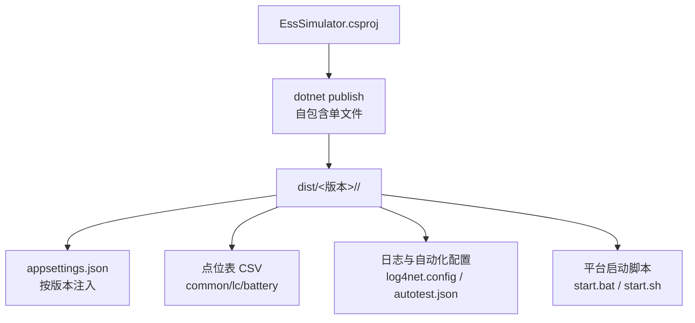
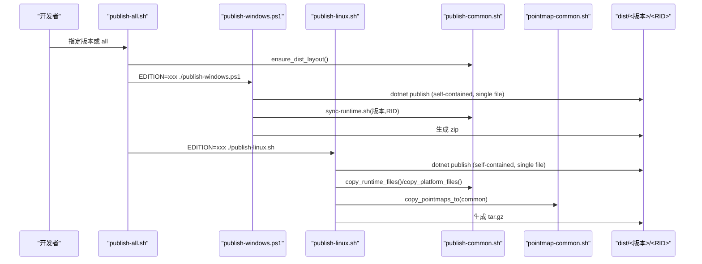
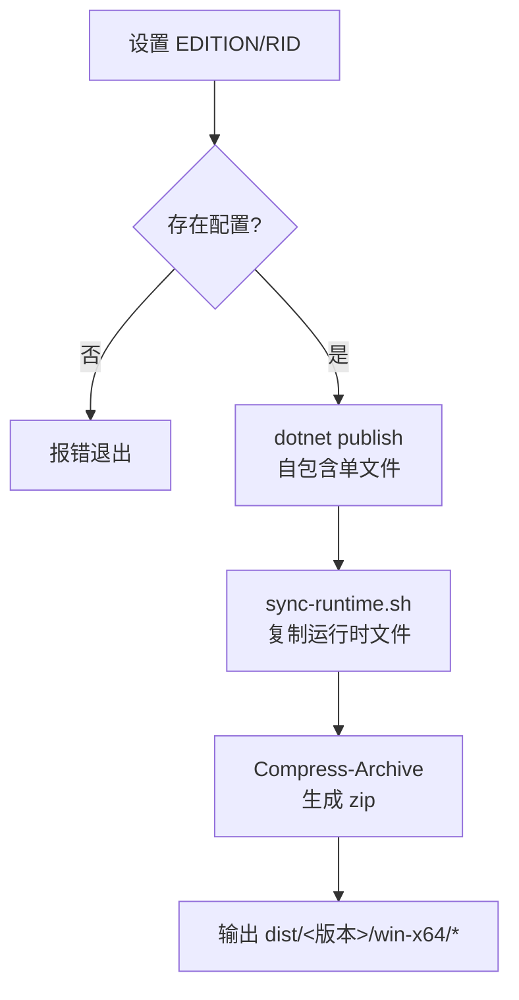
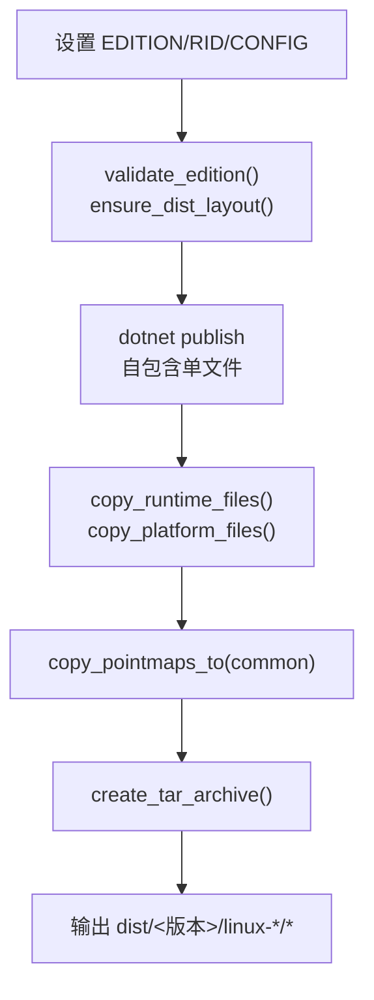
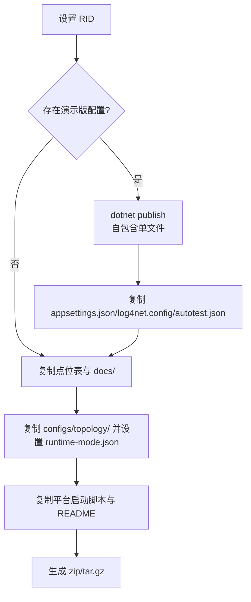
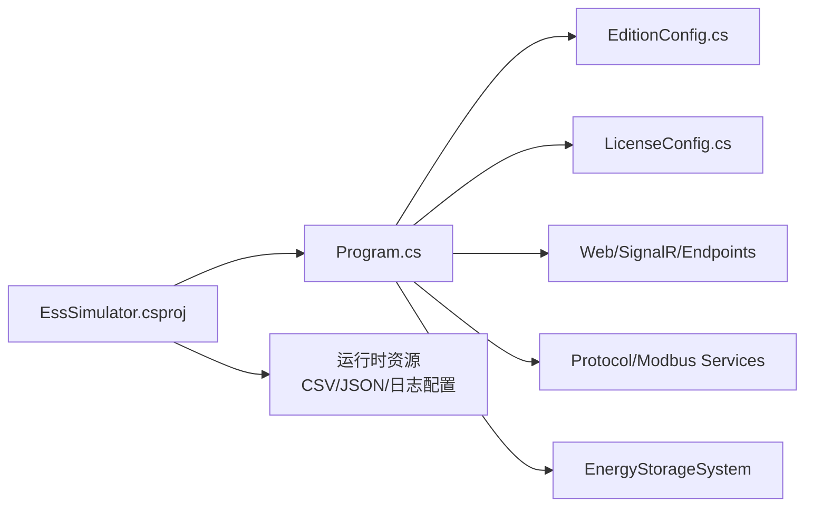

# 构建和发布

<cite>
**本文引用的文件**
- [EssSimulator.csproj](file://EssSimulator.csproj)
- [Program.cs](file://Program.cs)
- [EditionConfig.cs](file://Configuration/EditionConfig.cs)
- [publish-all.sh](file://scripts/commercial/publish-all.sh)
- [publish-common.sh](file://scripts/commercial/publish-common.sh)
- [publish-windows.ps1](file://scripts/commercial/publish-windows.ps1)
- [publish-linux.sh](file://scripts/commercial/publish-linux.sh)
- [publish-demo.sh](file://scripts/commercial/publish-demo.sh)
- [pointmap-common.sh](file://scripts/pointmap-common.sh)
- [社区版.appsettings.json](file://configs/社区版.appsettings.json)
- [商业版.appsettings.json](file://configs/商业版.appsettings.json)
- [start.bat](file://scripts/windows/start.bat)
- [start.sh](file://scripts/linux/start.sh)
</cite>

## 目录
1. [简介](#简介)
2. [项目结构](#项目结构)
3. [核心组件](#核心组件)
4. [架构总览](#架构总览)
5. [详细组件分析](#详细组件分析)
6. [依赖关系分析](#依赖关系分析)
7. [性能与打包特性](#性能与打包特性)
8. [故障排除指南](#故障排除指南)
9. [结论](#结论)
10. [附录：完整命令行示例](#附录完整命令行示例)

## 简介
本指南面向需要编译、打包并发布 EssSimulator 的工程师与交付人员，覆盖 Windows 与 Linux 平台的自包含发布流程，说明社区版、演示版、商业版、定制版的构建差异与配置要点，并给出依赖管理、NuGet 包恢复、配置文件生成与输出目录结构的详细说明。文档同时提供完整的命令行示例与常见问题排查方法。

## 项目结构
- 解决方案与工程
  - 解决方案入口：EssSimulator.sln（由 .NET SDK 驱动）
  - 主工程：EssSimulator.csproj（Web 应用，目标 net8.0，输出可执行文件）
- 构建脚本
  - scripts/commercial：统一的多版本、多平台发布脚本（Windows PowerShell、Linux/macOS Bash）
  - scripts/pointmap-common.sh：点位表版本管理与复制工具
  - scripts/windows/start.bat、scripts/linux/start.sh：运行期启动脚本
- 配置与资源
  - configs：各版本 appsettings 模板（社区版、商业版、定制版等）
  - pointmaps：点位表版本（common、lc、battery），发布时复制到输出目录
  - 根级资源：log4net.config、autotest.json 等运行时文件

**图表来源**
- [EssSimulator.csproj:1-88](file://EssSimulator.csproj#L1-L88)
- [publish-common.sh:48-179](file://scripts/commercial/publish-common.sh#L48-L179)
- [pointmap-common.sh:56-74](file://scripts/pointmap-common.sh#L56-L74)

**章节来源**
- [EssSimulator.csproj:1-88](file://EssSimulator.csproj#L1-L88)
- [publish-all.sh:1-38](file://scripts/commercial/publish-all.sh#L1-L38)
- [publish-common.sh:1-180](file://scripts/commercial/publish-common.sh#L1-L180)
- [pointmap-common.sh:1-82](file://scripts/pointmap-common.sh#L1-L82)

## 核心组件
- 发布编排器
  - publish-all.sh：遍历所有版本（或指定版本），依次调用 Windows 与 Linux 发布脚本
  - publish-common.sh：公共函数（版本校验、dist 布局、运行时文件复制、平台文件复制、归档）
- 平台发布脚本
  - publish-windows.ps1：Windows x64 自包含单文件发布，生成 zip
  - publish-linux.sh：Linux ARM64/x64 自包含单文件发布，生成 tar.gz
- 演示版发布脚本
  - publish-demo.sh：演示版专用打包（含组态编辑器预设工程与设备库）
- 点位表管理
  - pointmap-common.sh：验证并复制点位表到输出目录，支持 common/lc/battery 版本

**章节来源**
- [publish-all.sh:1-38](file://scripts/commercial/publish-all.sh#L1-L38)
- [publish-common.sh:1-180](file://scripts/commercial/publish-common.sh#L1-L180)
- [publish-windows.ps1:1-40](file://scripts/commercial/publish-windows.ps1#L1-L40)
- [publish-linux.sh:1-39](file://scripts/commercial/publish-linux.sh#L1-L39)
- [publish-demo.sh:1-134](file://scripts/commercial/publish-demo.sh#L1-L134)
- [pointmap-common.sh:1-82](file://scripts/pointmap-common.sh#L1-L82)

## 架构总览
下图展示了从源码到最终分发包的端到端流程，包括版本选择、平台发布、运行时文件与点位表复制、以及最终归档。

**图表来源**
- [publish-all.sh:1-38](file://scripts/commercial/publish-all.sh#L1-L38)
- [publish-windows.ps1:1-40](file://scripts/commercial/publish-windows.ps1#L1-L40)
- [publish-linux.sh:1-39](file://scripts/commercial/publish-linux.sh#L1-L39)
- [publish-common.sh:89-179](file://scripts/commercial/publish-common.sh#L89-L179)
- [pointmap-common.sh:56-74](file://scripts/pointmap-common.sh#L56-L74)

## 详细组件分析

### 版本与档位控制
- 版本名称映射
  - 社区版、商业版（兼容旧名“充值版”）、定制版
  - 演示版独立流程，不进入标准版本列表
- 运行时档位开关
  - EditionConfig.Name 决定功能开关（白盒切片、3D 视图、组态编辑）
  - 社区版默认锁定拓扑规模与单元上限，关闭高级能力
- 授权策略
  - 社区版：License.Required=false（默认）
  - 商业版/定制版：License.Required=true，需放置 license.txt

**图表来源**
- [EditionConfig.cs:1-57](file://Configuration/EditionConfig.cs#L1-L57)
- [Program.cs:141-178](file://Program.cs#L141-L178)

**章节来源**
- [EditionConfig.cs:1-57](file://Configuration/EditionConfig.cs#L1-L57)
- [Program.cs:141-178](file://Program.cs#L141-L178)
- [社区版.appsettings.json:12-51](file://configs/社区版.appsettings.json#L12-L51)
- [商业版.appsettings.json:23-45](file://configs/商业版.appsettings.json#L23-L45)

### Windows 发布流程
- 输入参数与环境变量
  - EDITION：版本名（社区版/商业版/定制版；演示版使用独立脚本）
  - RID：win-x64（固定）
- 关键步骤
  - 校验 configs\<版本>.appsettings.json 是否存在
  - dotnet publish 生成自包含单文件
  - 同步运行时文件（点表、日志配置等）
  - 压缩为 zip 至 dist/
- 输出产物
  - dist/<版本>/win-x64/EssSimulator.exe
  - dist/EssSimulator-<版本>-win-x64.zip

**图表来源**
- [publish-windows.ps1:1-40](file://scripts/commercial/publish-windows.ps1#L1-L40)

**章节来源**
- [publish-windows.ps1:1-40](file://scripts/commercial/publish-windows.ps1#L1-L40)

### Linux 发布流程
- 输入参数与环境变量
  - EDITION：版本名（默认社区版）
  - RID：linux-arm64（可改为 linux-x64）
  - CONFIG：Release（可改为 Debug）
- 关键步骤
  - 版本校验与 dist 布局准备
  - dotnet publish 生成自包含单文件
  - 复制运行时文件与平台文件（README、启动脚本、权限设置）
  - 复制点位表（common 版本）
  - 生成 tar.gz 归档
- 输出产物
  - dist/<版本>/linux-*/EssSimulator
  - dist/EssSimulator-<版本>-linux-*.tar.gz

**图表来源**
- [publish-linux.sh:1-39](file://scripts/commercial/publish-linux.sh#L1-L39)
- [publish-common.sh:89-179](file://scripts/commercial/publish-common.sh#L89-L179)
- [pointmap-common.sh:56-74](file://scripts/pointmap-common.sh#L56-L74)

**章节来源**
- [publish-linux.sh:1-39](file://scripts/commercial/publish-linux.sh#L1-L39)
- [publish-common.sh:89-179](file://scripts/commercial/publish-common.sh#L89-L179)

### 演示版发布流程
- 特点
  - 完整功能（商业版能力），无需 license
  - 内置组态编辑器预设工程与设备库（configs/topology）
  - 默认不进入工程模式（runtime-mode.json 中 engineeringMode=false）
- 关键步骤
  - 检查 configs/演示版.appsettings.json
  - dotnet publish 生成自包含单文件
  - 复制运行时配置、点表、文档、平台启动脚本
  - 生成 zip/tar.gz 归档

**图表来源**
- [publish-demo.sh:1-134](file://scripts/commercial/publish-demo.sh#L1-L134)

**章节来源**
- [publish-demo.sh:1-134](file://scripts/commercial/publish-demo.sh#L1-L134)

### 配置文件与运行时文件
- 配置文件
  - 社区版：configs/社区版.appsettings.json（限制单元数、关闭高级能力、仅本机监听）
  - 商业版：configs/商业版.appsettings.json（开放高级能力、需授权）
  - 定制版：configs/定制版.appsettings.json（按项目配置）
- 运行时文件
  - log4net.config：日志配置
  - autotest.json：自动化测试配置
  - 点位表 CSV：emu.csv、em.csv、bms_bank.csv、bms_rack.csv、lc.csv（来自 pointmaps/common）
- 启动脚本
  - scripts/windows/start.bat：打开浏览器并启动程序
  - scripts/linux/start.sh：尝试自动打开浏览器并启动程序

**章节来源**
- [社区版.appsettings.json:1-51](file://configs/社区版.appsettings.json#L1-L51)
- [商业版.appsettings.json:1-45](file://configs/商业版.appsettings.json#L1-L45)
- [pointmap-common.sh:18-24](file://scripts/pointmap-common.sh#L18-L24)
- [start.bat:1-13](file://scripts/windows/start.bat#L1-L13)
- [start.sh:1-18](file://scripts/linux/start.sh#L1-L18)

## 依赖关系分析
- 构建依赖
  - .NET 8 SDK（TargetFramework=net8.0）
  - NuGet 包：log4net、NModbus、CsvHelper、Microsoft.Extensions.Hosting 等
- 运行时依赖
  - 自包含发布不包含外部运行时依赖
  - 点位表 CSV 与配置文件必须与程序同级目录
- 内部模块耦合
  - Program.cs 负责配置加载、服务注册、中间件与端点映射
  - EditionConfig 与 LicenseConfig 在启动早期生效，影响功能与授权校验

**图表来源**
- [Program.cs:258-523](file://Program.cs#L258-L523)
- [EssSimulator.csproj:19-83](file://EssSimulator.csproj#L19-L83)

**章节来源**
- [Program.cs:258-523](file://Program.cs#L258-L523)
- [EssSimulator.csproj:19-83](file://EssSimulator.csproj#L19-L83)

## 性能与打包特性
- 自包含单文件发布
  - 通过 --self-contained true 与 PublishSingleFile=true 将应用打包为单一可执行文件
  - IncludeNativeLibrariesForSelfExtract=true 确保原生库随解压释放
  - EnableCompressionInSingleFile=true 减小体积（Windows 发布启用）
- 输出目录结构
  - dist/<版本>/<RID>/：平台特定输出
  - dist/EssSimulator-<版本>-<RID>.zip|tar.gz：归档包
- 前端静态资源
  - wwwroot 由 Web SDK 默认托管，发布时一并复制（csproj 已排除 dist/bin/obj）

**章节来源**
- [publish-windows.ps1:17-25](file://scripts/commercial/publish-windows.ps1#L17-L25)
- [publish-linux.sh:19-27](file://scripts/commercial/publish-linux.sh#L19-L27)
- [EssSimulator.csproj:10-13](file://EssSimulator.csproj#L10-L13)

## 故障排除指南
- 常见错误与处理
  - 未知版本：确保 EDITION 为社区版/商业版/定制版；演示版使用独立脚本
  - 缺少配置文件：确认 configs/<版本>.appsettings.json 存在
  - 授权失败：商业版/定制版需在运行目录放置有效的 license.txt；可使用 --machine-id 获取机器码
  - 端口占用：修改 appsettings.json 中的 Modbus/HTTP 端口并确保防火墙放行
  - 点位表缺失：确认 pointmaps/common 下所需 CSV 文件齐全
- 调试建议
  - 使用 CONFIG=Debug 进行调试构建
  - 查看日志文件（log4net.config 配置）与控制台输出
  - 在无 GUI 模式下运行（NoGui=true）便于服务器部署

**章节来源**
- [publish-common.sh:67-79](file://scripts/commercial/publish-common.sh#L67-L79)
- [publish-windows.ps1:11-13](file://scripts/commercial/publish-windows.ps1#L11-L13)
- [Program.cs:141-178](file://Program.cs#L141-L178)
- [社区版.appsettings.json:20-41](file://configs/社区版.appsettings.json#L20-L41)

## 结论
本项目通过统一的发布脚本实现了跨平台、多版本的标准化构建与分发。社区版、商业版、定制版通过配置与档位开关实现功能裁剪与授权控制，演示版则提供开箱即用的评估体验。遵循本指南可快速完成本地构建、CI/CD 集成与生产环境部署。

## 附录：完整命令行示例
- 前置条件
  - 安装 .NET 8 SDK
  - 确保点表目录 pointmaps/common 存在且完整
- 构建与发布
  - 构建所有版本（Windows + Linux）：
    - bash scripts/commercial/publish-all.sh
  - 仅构建指定版本：
    - EDITION=商业版 bash scripts/commercial/publish-all.sh
  - 构建演示版（默认本机架构）：
    - bash scripts/commercial/publish-demo.sh
  - 指定平台构建演示版：
    - RID=win-x64 bash scripts/commercial/publish-demo.sh
    - RID=linux-x64 bash scripts/commercial/publish-demo.sh
    - RID=linux-arm64 bash scripts/commercial/publish-demo.sh
- 运行与验证
  - Windows：双击 dist/<版本>/win-x64/start.bat 或运行 EssSimulator.exe
  - Linux：chmod +x dist/<版本>/linux-*/start.sh && ./dist/<版本>/linux-*/start.sh
  - 访问 Web UI：http://localhost:5050（端口以 appsettings.json 为准）
- 授权相关
  - 获取机器码：./EssSimulator --machine-id
  - 商业版/定制版：将 license.txt 放入运行目录后重启

**章节来源**
- [publish-all.sh:1-38](file://scripts/commercial/publish-all.sh#L1-L38)
- [publish-demo.sh:1-134](file://scripts/commercial/publish-demo.sh#L1-L134)
- [start.bat:1-13](file://scripts/windows/start.bat#L1-L13)
- [start.sh:1-18](file://scripts/linux/start.sh#L1-L18)
- [Program.cs:218-224](file://Program.cs#L218-L224)