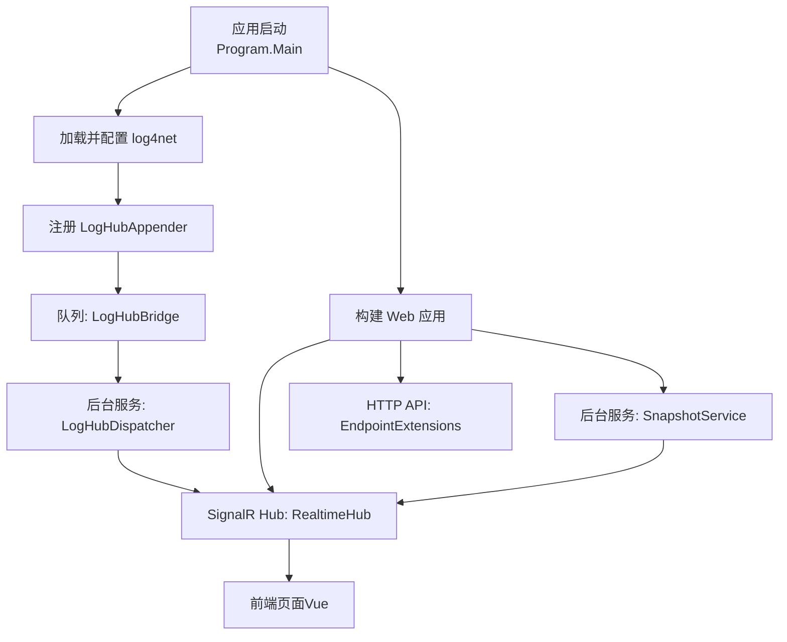
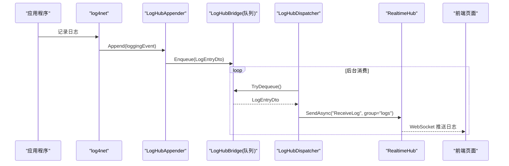
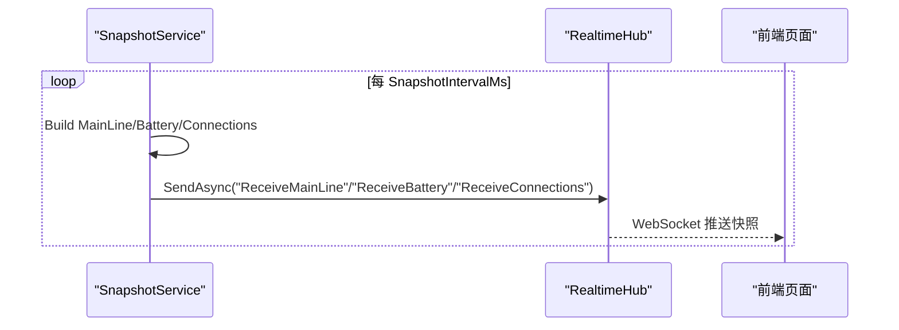
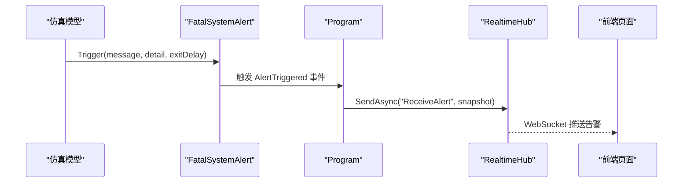
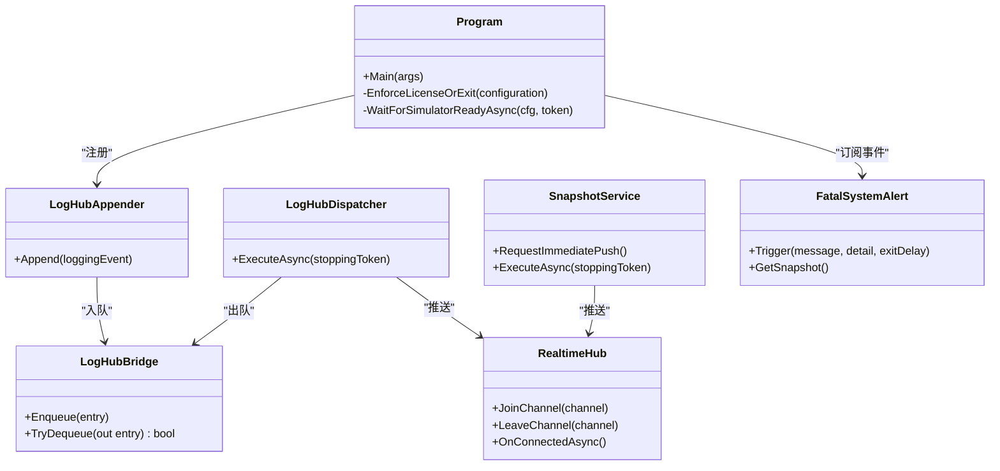

# 监控和日志

<cite>
**本文引用的文件**
- [Program.cs](file://Program.cs)
- [log4net.config](file://log4net.config)
- [Web/LogHubAppender.cs](file://Web/LogHubAppender.cs)
- [Web/RealtimeHub.cs](file://Web/RealtimeHub.cs)
- [Web/SnapshotService.cs](file://Web/SnapshotService.cs)
- [Display/FatalSystemAlert.cs](file://Display/FatalSystemAlert.cs)
- [Configuration/WebConfig.cs](file://Configuration/WebConfig.cs)
- [appsettings.json](file://appsettings.json)
- [Web/EndpointExtensions.cs](file://Web/EndpointExtensions.cs)
- [Display/MainLineMetrics.cs](file://Display/MainLineMetrics.cs)
</cite>

## 目录
1. [简介](#简介)
2. [项目结构](#项目结构)
3. [核心组件](#核心组件)
4. [架构总览](#架构总览)
5. [详细组件分析](#详细组件分析)
6. [依赖关系分析](#依赖关系分析)
7. [性能考虑](#性能考虑)
8. [故障排查指南](#故障排查指南)
9. [结论](#结论)
10. [附录](#附录)

## 简介
本指南面向储能仿真系统的运维与开发人员，系统性地说明如何配置日志、设置日志级别、实施日志轮转策略，以及如何通过内置的实时监控通道进行告警、性能指标采集与健康检查。文档还涵盖日志分析工具使用、错误追踪方法、性能瓶颈识别、自定义监控指标的扩展方式，以及第三方监控系统集成方案，并提供常见问题诊断技巧与排障流程。

## 项目结构
本项目采用 B/S 架构：后端基于 ASP.NET Core 提供 HTTP API 与 SignalR 实时推送；日志框架使用 log4net，并通过自定义 Appender 将日志事件推送到前端；同时提供周期快照服务用于主接线、电池、连接等运行时状态的推送。

图表来源
- [Program.cs:226-256](file://Program.cs#L226-L256)
- [Web/LogHubAppender.cs:8-75](file://Web/LogHubAppender.cs#L8-L75)
- [Web/RealtimeHub.cs:10-58](file://Web/RealtimeHub.cs#L10-L58)
- [Web/SnapshotService.cs:9-133](file://Web/SnapshotService.cs#L9-L133)
- [Web/EndpointExtensions.cs:16-343](file://Web/EndpointExtensions.cs#L16-L343)

章节来源
- [Program.cs:216-523](file://Program.cs#L216-L523)
- [log4net.config:1-19](file://log4net.config#L1-L19)
- [Web/LogHubAppender.cs:1-76](file://Web/LogHubAppender.cs#L1-L76)
- [Web/RealtimeHub.cs:1-59](file://Web/RealtimeHub.cs#L1-L59)
- [Web/SnapshotService.cs:1-133](file://Web/SnapshotService.cs#L1-L133)
- [Web/EndpointExtensions.cs:1-343](file://Web/EndpointExtensions.cs#L1-L343)

## 核心组件
- 日志子系统
  - log4net 配置文件定义滚动日志输出与格式。
  - 程序启动时加载 log4net 配置，并编程式注册 LogHubAppender，将日志事件入队后由后台服务通过 SignalR 推送至前端。
- 实时监控子系统
  - SnapshotService 周期性采样仿真状态（主接线、电池、连接），通过 SignalR 推送。
  - FatalSystemAlert 提供严重故障的全局事件机制，订阅者通过 SignalR 推送全屏告警。
- 健康检查与配置
  - /api/health 暴露健康检查端点。
  - WebConfig 提供快照间隔、静态资源、CORS、API Key 等开关。
  - appsettings.json 提供运行时参数（如快照间隔、协议端口等）。

章节来源
- [log4net.config:1-19](file://log4net.config#L1-L19)
- [Program.cs:226-256](file://Program.cs#L226-L256)
- [Web/LogHubAppender.cs:8-75](file://Web/LogHubAppender.cs#L8-L75)
- [Web/SnapshotService.cs:46-133](file://Web/SnapshotService.cs#L46-L133)
- [Display/FatalSystemAlert.cs:11-86](file://Display/FatalSystemAlert.cs#L11-L86)
- [Web/EndpointExtensions.cs:18-23](file://Web/EndpointExtensions.cs#L18-L23)
- [Configuration/WebConfig.cs:4-38](file://Configuration/WebConfig.cs#L4-L38)
- [appsettings.json:53-63](file://appsettings.json#L53-L63)

## 架构总览
下图展示了从日志产生到前端展示的完整链路，以及快照与告警的推送路径。

图表来源
- [Program.cs:226-256](file://Program.cs#L226-L256)
- [Web/LogHubAppender.cs:11-48](file://Web/LogHubAppender.cs#L11-L48)
- [Web/RealtimeHub.cs:24-46](file://Web/RealtimeHub.cs#L24-L46)

图表来源
- [Web/SnapshotService.cs:46-133](file://Web/SnapshotService.cs#L46-L133)
- [Web/RealtimeHub.cs:24-46](file://Web/RealtimeHub.cs#L24-L46)

图表来源
- [Display/FatalSystemAlert.cs:27-56](file://Display/FatalSystemAlert.cs#L27-L56)
- [Program.cs:466-481](file://Program.cs#L466-L481)
- [Web/RealtimeHub.cs:16-21](file://Web/RealtimeHub.cs#L16-L21)

## 详细组件分析

### 日志配置与轮转
- 日志框架与输出
  - 使用 log4net 的 RollingFileAppender，按日期滚动，保留最近若干备份，输出包含时间、线程、级别、类名、行号与消息。
- 级别控制
  - 根级别设置为 ALL，可结合不同 Logger 名称或代码中使用的 Level 进行过滤。
  - 编程式注册的 LogHubAppender 默认阈值设为 Info，仅 Info 及以上级别会进入 SignalR 推送。
- 轮转策略
  - 按天滚动，最多保留固定数量的历史文件，避免磁盘增长。
- 前端展示
  - 前端通过 SignalR 订阅 logs 频道接收日志，支持按级别着色显示。

章节来源
- [log4net.config:3-18](file://log4net.config#L3-L18)
- [Program.cs:226-256](file://Program.cs#L226-L256)
- [Web/LogHubAppender.cs:11-48](file://Web/LogHubAppender.cs#L11-L48)
- [Web/src/styles/app.css:130-144](file://Web/src/styles/app.css#L130-L144)

### 实时监控与告警
- 快照推送
  - SnapshotService 以固定间隔（默认 200ms，可通过配置调整）采集主接线、电池概览、连接状态，并通过 SignalR 推送。
  - 控制变更后可立即触发一次推送，减少延迟。
- 告警推送
  - FatalSystemAlert 在发生严重故障时触发事件，Program 订阅后将告警快照通过 SignalR 推送给所有客户端。
  - 连接建立时也会向当前客户端推送一次全量告警快照，便于初始化界面。
- 频道与分组
  - 前端可选择加入特定频道（如 mainline、battery、connections、logs、alert），降低无关流量。

章节来源
- [Web/SnapshotService.cs:46-133](file://Web/SnapshotService.cs#L46-L133)
- [Display/FatalSystemAlert.cs:11-86](file://Display/FatalSystemAlert.cs#L11-L86)
- [Program.cs:466-481](file://Program.cs#L466-L481)
- [Web/RealtimeHub.cs:10-46](file://Web/RealtimeHub.cs#L10-L46)

### 健康检查与配置项
- 健康检查
  - /api/health 返回运行状态、时间与是否就绪。
- 关键配置
  - Simulator.Web.SnapshotIntervalMs：快照推送间隔（毫秒），范围受代码限制（最小 50ms）。
  - Simulator.Web.HttpPort/HttpBaseUrl：Web 服务监听地址与端口。
  - Simulator.Web.ApiKeyEnabled/ApiKey：是否启用 API Key 鉴权。
  - DataExchange.TelemetryIntervalMs/EmuTelemetryIntervalMs：遥测与控制轮询间隔。
  - Protocol.*：各类 Modbus 端口与步长。

章节来源
- [Web/EndpointExtensions.cs:18-23](file://Web/EndpointExtensions.cs#L18-L23)
- [Configuration/WebConfig.cs:8-38](file://Configuration/WebConfig.cs#L8-L38)
- [Web/SnapshotService.cs:55-57](file://Web/SnapshotService.cs#L55-L57)
- [appsettings.json:53-97](file://appsettings.json#L53-L97)

### 性能指标与观测
- 内置指标读取
  - MainLineMetrics 提供一组可观测的主接线指标键（如断路器状态、负载功率、PCS 功率、BMS SOC 等），可用于性能测试驱动与快照观察。
- 快照频率调优
  - 根据业务需求调整 SnapshotIntervalMs，平衡刷新频率与网络/计算开销。
- 背压保护
  - LogHubBridge 使用有界队列，超过上限丢弃最旧条目，防止内存压力影响主流程。

章节来源
- [Display/MainLineMetrics.cs:8-106](file://Display/MainLineMetrics.cs#L8-L106)
- [Web/SnapshotService.cs:55-57](file://Web/SnapshotService.cs#L55-L57)
- [Web/LogHubAppender.cs:34-48](file://Web/LogHubAppender.cs#L34-L48)

### 自定义监控指标添加方法
- 新增可观测指标
  - 在 MainLineMetrics 中添加新的 metric 解析逻辑，使其可从仿真主机（SimulatorHost）或快照对象中读取值。
  - 为新增指标编写单元测试，确保键名与取值正确。
- 接入快照推送
  - 若需在前端实时展示，可在 SnapshotService 的 PushAll 中增加对应快照字段，并通过 SignalR 推送。
- 暴露为 API
  - 如需外部系统采集，可在 EndpointExtensions 中新增 GET 端点，返回该指标的最新值。

章节来源
- [Display/MainLineMetrics.cs:8-106](file://Display/MainLineMetrics.cs#L8-L106)
- [Web/SnapshotService.cs:103-133](file://Web/SnapshotService.cs#L103-L133)
- [Web/EndpointExtensions.cs:16-343](file://Web/EndpointExtensions.cs#L16-L343)

### 第三方监控系统集成方案
- 通过 HTTP API 采集
  - 使用 /api/health、/api/mainline、/api/battery/{unit}、/api/cells/{unit}/{cluster}、/api/alarms 等端点，由 Prometheus Node Exporter、Telegraf 或其他采集器定时抓取。
  - 若启用 ApiKeyEnabled，需在请求头携带 ApiKey 完成鉴权。
- 通过 SignalR 流式采集
  - 对于需要低延迟的场景，可使用 SignalR 客户端订阅 logs、mainline、battery、connections、alert 频道，将数据转发至时序数据库或告警平台。
- 日志持久化
  - log4net 已按天滚动输出到 Logs 目录，可由日志收集代理（如 Filebeat、Fluent Bit）持续采集并转发至 ELK/Loki 等平台。

章节来源
- [Web/EndpointExtensions.cs:18-66](file://Web/EndpointExtensions.cs#L18-L66)
- [Configuration/WebConfig.cs:29-38](file://Configuration/WebConfig.cs#L29-L38)
- [log4net.config:3-18](file://log4net.config#L3-L18)

## 依赖关系分析
- 组件耦合
  - Program 负责启动顺序：加载日志配置 → 注册 Appender → 构建 Web 应用 → 注册中间件与端点 → 启动服务。
  - LogHubAppender 与 LogHubDispatcher 解耦了日志产生与推送，通过队列缓冲。
  - SnapshotService 与 RealtimeHub 通过 IHubContext 解耦，支持多频道分组推送。
  - FatalSystemAlert 通过事件机制与 Program 订阅者解耦，便于扩展更多告警处理。
- 外部依赖
  - log4net：日志框架与滚动文件输出。
  - ASP.NET Core：Web 服务、SignalR、依赖注入。
  - 前端 Vue：通过 SignalR 订阅频道展示日志与快照。

图表来源
- [Program.cs:226-523](file://Program.cs#L226-L523)
- [Web/LogHubAppender.cs:8-75](file://Web/LogHubAppender.cs#L8-L75)
- [Web/RealtimeHub.cs:10-58](file://Web/RealtimeHub.cs#L10-L58)
- [Web/SnapshotService.cs:9-133](file://Web/SnapshotService.cs#L9-L133)
- [Display/FatalSystemAlert.cs:11-86](file://Display/FatalSystemAlert.cs#L11-L86)

章节来源
- [Program.cs:216-523](file://Program.cs#L216-L523)
- [Web/LogHubAppender.cs:1-76](file://Web/LogHubAppender.cs#L1-L76)
- [Web/RealtimeHub.cs:1-59](file://Web/RealtimeHub.cs#L1-L59)
- [Web/SnapshotService.cs:1-133](file://Web/SnapshotService.cs#L1-L133)
- [Display/FatalSystemAlert.cs:1-86](file://Display/FatalSystemAlert.cs#L1-L86)

## 性能考虑
- 快照间隔
  - 合理设置 SnapshotIntervalMs，避免过高频率导致 CPU/网络拥塞；建议根据设备数量与前端渲染能力调优。
- 日志背压
  - LogHubBridge 使用有界队列，超出容量丢弃最旧日志，保障主流程稳定性。
- 信号带宽
  - 前端可按需加入频道，减少不必要的数据传输。
- 指标观测
  - 使用 MainLineMetrics 提供的指标键进行性能测试驱动与快照观察，定位热点与瓶颈。

[本节为通用指导，不直接分析具体文件]

## 故障排查指南
- 无法看到日志
  - 确认 log4net 配置已加载且 LogHubAppender 已注册。
  - 检查前端是否正确加入 logs 频道并订阅 ReceiveLog。
- 告警未推送
  - 确认 FatalSystemAlert 是否被触发，Program 是否订阅了 AlertTriggered 事件。
  - 检查 SignalR 连接是否正常，前端是否收到 ReceiveAlert。
- 快照不更新
  - 检查 SnapshotIntervalMs 配置是否过小或过大。
  - 查看 SnapshotService 是否成功启动并执行 PushAll。
- 健康检查失败
  - 调用 /api/health，关注 ready 字段；若为 false，检查仿真基本组件是否就绪。
- 常见错误定位
  - 通过日志中的异常堆栈快速定位问题模块。
  - 使用 /api/alarms 获取设备告警位，辅助判断硬件/协议层异常。

章节来源
- [Program.cs:226-256](file://Program.cs#L226-L256)
- [Web/LogHubAppender.cs:11-48](file://Web/LogHubAppender.cs#L11-L48)
- [Web/RealtimeHub.cs:16-21](file://Web/RealtimeHub.cs#L16-L21)
- [Web/SnapshotService.cs:46-133](file://Web/SnapshotService.cs#L46-L133)
- [Web/EndpointExtensions.cs:18-66](file://Web/EndpointExtensions.cs#L18-L66)

## 结论
本系统提供了完善的日志与监控能力：log4net 负责持久化与轮转，LogHubAppender 与 SignalR 实现前端实时日志展示；SnapshotService 提供周期快照推送；FatalSystemAlert 提供严重故障的全局告警机制；/api/health 与相关 API 支持健康检查与指标采集。通过合理配置与扩展，可满足生产环境的监控、告警与排障需求。

[本节为总结性内容，不直接分析具体文件]

## 附录
- 常用端点
  - /api/health：健康检查
  - /api/mainline：主接线快照
  - /api/battery/{unit}：电池概览
  - /api/cells/{unit}/{cluster}：单体电压/温度
  - /api/alarms：设备告警位
  - /api/alert：严重告警快照
- 前端频道与方法
  - 频道：mainline、battery、cells、connections、logs、alert、cmdprogress
  - 方法：ReceiveMainLine、ReceiveBattery、ReceiveCells、ReceiveConnections、ReceiveLog、ReceiveAlert、ReceiveCommandProgress

章节来源
- [Web/EndpointExtensions.cs:18-66](file://Web/EndpointExtensions.cs#L18-L66)
- [Web/RealtimeHub.cs:24-46](file://Web/RealtimeHub.cs#L24-L46)