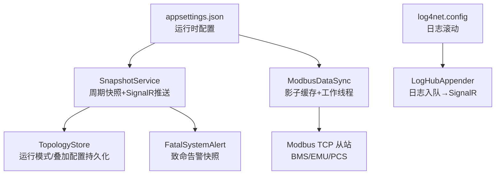
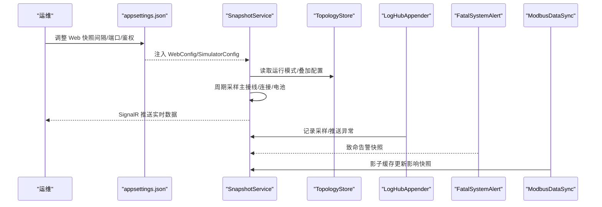
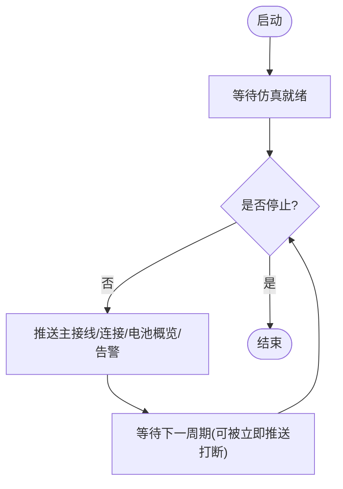
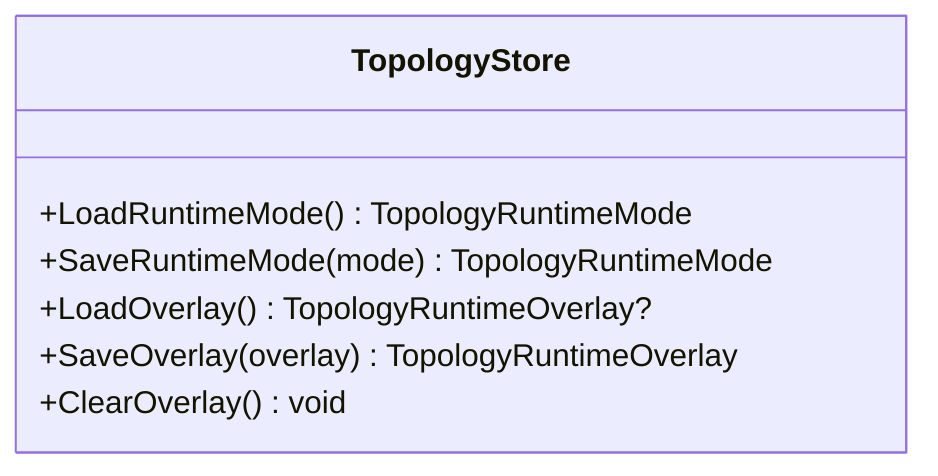
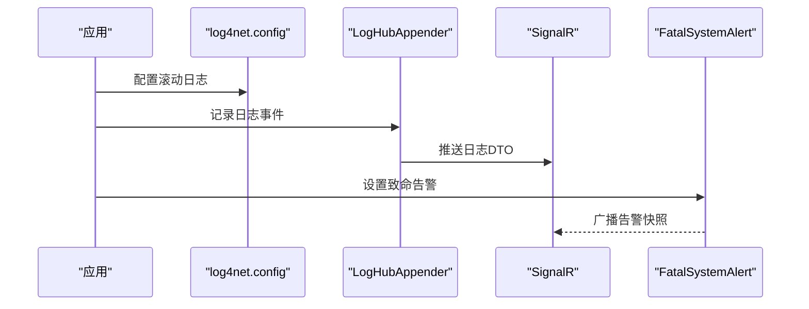
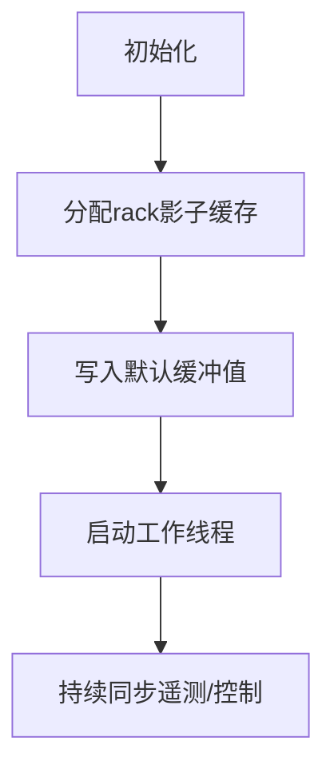
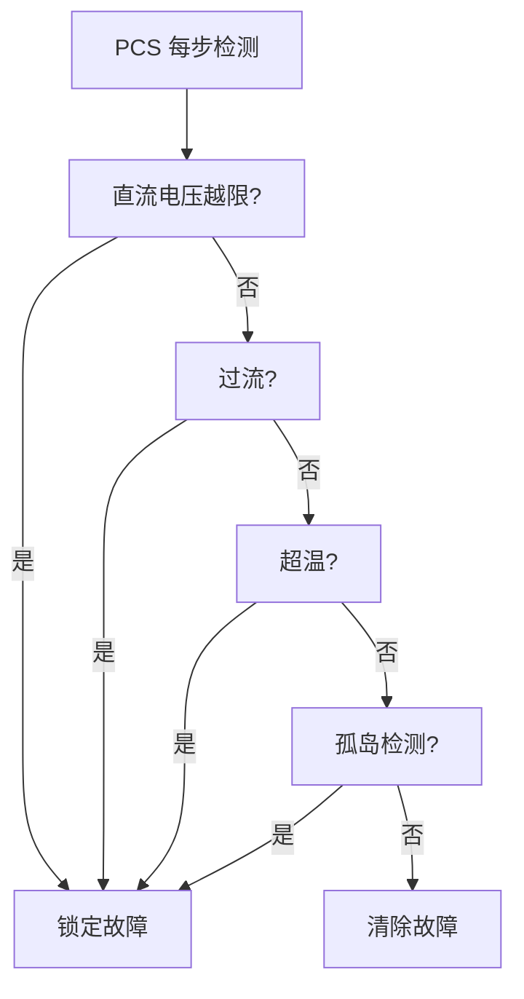
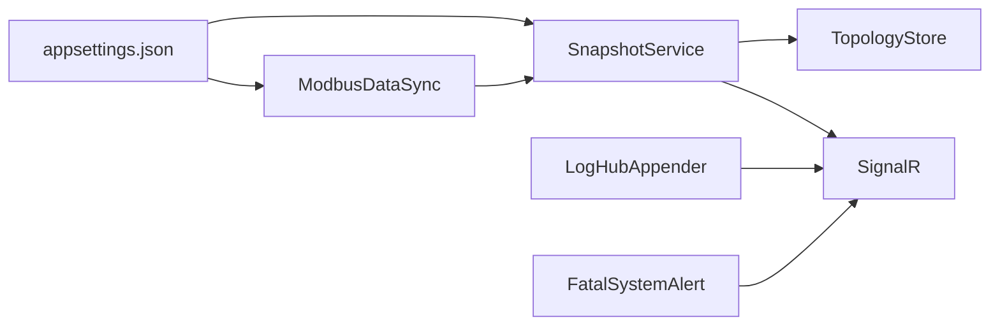
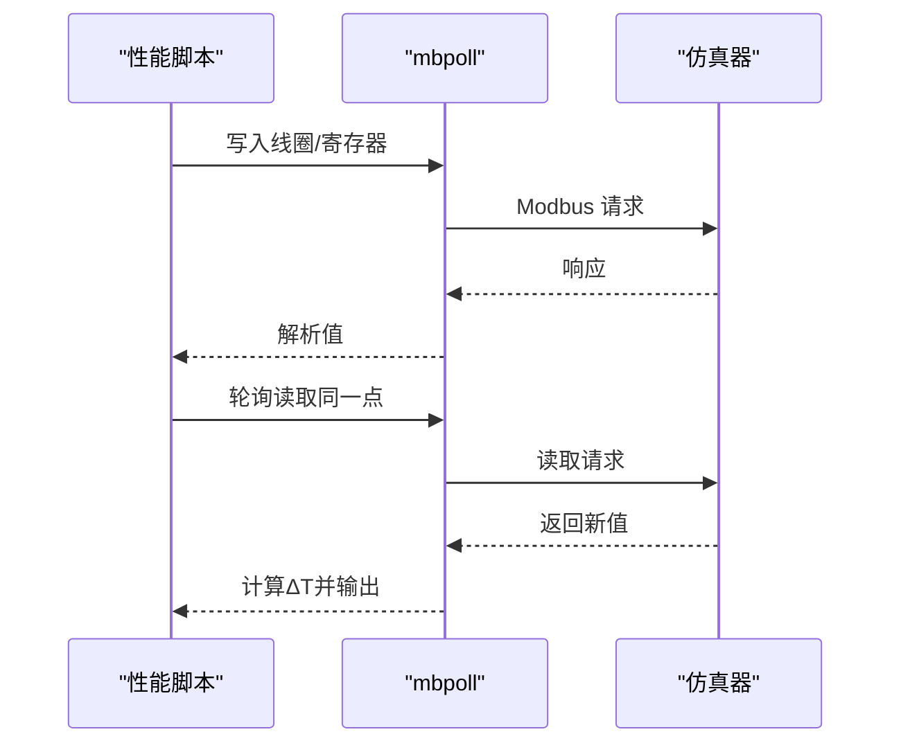

# 维护和备份

<cite>
**本文引用的文件**
- [appsettings.json](file://appsettings.json)
- [log4net.config](file://log4net.config)
- [SnapshotService.cs](file://Web/SnapshotService.cs)
- [TopologyStore.cs](file://Web/Topology/TopologyStore.cs)
- [FatalSystemAlert.cs](file://Display/FatalSystemAlert.cs)
- [ModbusDataSync.cs](file://Protocol/Modbus/ModbusDataSync.cs)
- [run_tc_r01.py](file://scripts/test/perf/run_tc_r01.py)
- [run_tc_r02.py](file://scripts/test/perf/run_tc_r02.py)
- [run_tc_r03.py](file://scripts/test/perf/run_tc_r03.py)
- [run_tc_r04.py](file://scripts/test/perf/run_tc_r04.py)
- [run_tc_r05_pcs.py](file://scripts/test/perf/run_tc_r05_pcs.py)
- [测试报告.md](file://docs/测试报告.md)
- [PerfTestModels.cs](file://Display/PerfTestModels.cs)
- [LogHubAppender.cs](file://Web/LogHubAppender.cs)
- [PcsDevice.Core.cs](file://EssDeviceSimModel/Devices/PcsDevice.Core.cs)
- [BmsRackProtection.cs](file://EssDeviceSimModel/Devices/BmsRackProtection.cs)
</cite>

## 目录
1. [简介](#简介)
2. [项目结构](#项目结构)
3. [核心组件](#核心组件)
4. [架构总览](#架构总览)
5. [详细组件分析](#详细组件分析)
6. [依赖关系分析](#依赖关系分析)
7. [性能与基准测试](#性能与基准测试)
8. [维护任务与自动化](#维护任务与自动化)
9. [数据备份策略](#数据备份策略)
10. [灾难恢复流程](#灾难恢复流程)
11. [故障排查指南](#故障排查指南)
12. [结论](#结论)

## 简介
本手册面向运维与测试人员，提供储能仿真系统的定期维护、数据备份与灾难恢复操作指南；并说明性能测试脚本的使用方法（基准测试、压力测试、性能监控）。内容覆盖数据库/配置管理、缓存清理、临时文件管理与系统资源优化，同时给出自动化维护任务的配置方法与故障预防策略，以及完整的运维手册和应急响应预案。

## 项目结构
- 运行时配置：通过 appsettings.json 集中管理仿真、协议端口、Web 快照间隔、热模型等关键参数，便于统一变更与回滚。
- 日志与告警：log4net 按日滚动输出到 Logs 目录；致命告警通过 FatalSystemAlert 暴露给前端与外部进程。
- 实时快照：SnapshotService 周期性采集主接线、连接状态、电池概览并通过 SignalR 推送；支持控制变更后立即推送。
- 拓扑与工程持久化：TopologyStore 负责运行模式与叠加配置的读写，具备原子写入与清理能力。
- Modbus 数据同步：ModbusDataSync 初始化 rack 影子缓存并启动工作线程，支撑遥测与控制。
- 性能测试：scripts/test/perf 下提供多套 Python 脚本，基于 mbpoll 对 BMS/EMU/PCS 的变位与状态响应进行延迟测量。

图表来源
- [appsettings.json:1-120](file://appsettings.json#L1-L120)
- [SnapshotService.cs:1-133](file://Web/SnapshotService.cs#L1-L133)
- [TopologyStore.cs:242-318](file://Web/Topology/TopologyStore.cs#L242-L318)
- [ModbusDataSync.cs:52-77](file://Protocol/Modbus/ModbusDataSync.cs#L52-L77)
- [log4net.config:1-19](file://log4net.config#L1-L19)
- [LogHubAppender.cs:1-38](file://Web/LogHubAppender.cs#L1-L38)

章节来源
- [appsettings.json:1-120](file://appsettings.json#L1-L120)
- [SnapshotService.cs:1-133](file://Web/SnapshotService.cs#L1-L133)
- [TopologyStore.cs:242-318](file://Web/Topology/TopologyStore.cs#L242-L318)
- [ModbusDataSync.cs:52-77](file://Protocol/Modbus/ModbusDataSync.cs#L52-L77)
- [log4net.config:1-19](file://log4net.config#L1-L19)
- [LogHubAppender.cs:1-38](file://Web/LogHubAppender.cs#L1-L38)

## 核心组件
- 运行时配置中心：SimulatorConfig/WebConfig 将 appsettings.json 映射为强类型配置，涵盖仿真步长、热模型、Web 快照间隔、API Key 鉴权、协议端口等。
- 快照服务：SnapshotService 作为后台服务，等待仿真就绪后以固定间隔推送主接线、连接、电池概览，并在控制变更后触发即时推送。
- 拓扑存储：TopologyStore 提供运行模式与叠加配置的加载、保存与清理，保证并发安全与幂等写入。
- 日志与告警：log4net 按日滚动；LogHubAppender 将日志事件转为 DTO 入队并通过 SignalR 推送；FatalSystemAlert 提供致命告警快照与进程退出能力。
- Modbus 数据同步：ModbusDataSync 在启动时初始化 rack 级影子缓存并启动工作线程，支撑高频遥测与控制。

章节来源
- [Configuration/SimulatorConfig.cs:1-479](file://Configuration/SimulatorConfig.cs#L1-L479)
- [Configuration/WebConfig.cs:1-39](file://Configuration/WebConfig.cs#L1-L39)
- [SnapshotService.cs:1-133](file://Web/SnapshotService.cs#L1-L133)
- [TopologyStore.cs:242-318](file://Web/Topology/TopologyStore.cs#L242-L318)
- [LogHubAppender.cs:1-38](file://Web/LogHubAppender.cs#L1-L38)
- [FatalSystemAlert.cs:33-86](file://Display/FatalSystemAlert.cs#L33-L86)
- [ModbusDataSync.cs:52-77](file://Protocol/Modbus/ModbusDataSync.cs#L52-L77)

## 架构总览
下图展示维护与备份相关的关键交互：配置驱动快照与协议端口；快照服务周期性采集并推送；日志与告警贯穿全链路；拓扑存储承载运行态配置。

图表来源
- [appsettings.json:53-97](file://appsettings.json#L53-L97)
- [SnapshotService.cs:46-130](file://Web/SnapshotService.cs#L46-L130)
- [TopologyStore.cs:242-318](file://Web/Topology/TopologyStore.cs#L242-L318)
- [LogHubAppender.cs:1-38](file://Web/LogHubAppender.cs#L1-L38)
- [FatalSystemAlert.cs:33-86](file://Display/FatalSystemAlert.cs#L33-L86)
- [ModbusDataSync.cs:52-77](file://Protocol/Modbus/ModbusDataSync.cs#L52-L77)

## 详细组件分析

### 快照服务与实时推送（SnapshotService）
- 作用：周期采集仿真状态并通过 SignalR 推送，支持控制变更后立即推送一帧。
- 关键点：
  - 启动后等待仿真基本就绪再开始推送。
  - 推送间隔受 WebConfig.SnapshotIntervalMs 限制（最小 50ms）。
  - 单个设备快照失败不影响其他设备推送。
  - 致命告警快照会广播至所有客户端。

图表来源
- [SnapshotService.cs:46-130](file://Web/SnapshotService.cs#L46-L130)

章节来源
- [SnapshotService.cs:1-133](file://Web/SnapshotService.cs#L1-L133)

### 拓扑与运行模式存储（TopologyStore）
- 作用：持久化运行模式与叠加配置，提供加载、保存与清理接口。
- 关键点：
  - 使用锁保护并发读写。
  - 保存时创建目录并写入 JSON，附带时间戳。
  - 提供 ClearOverlay 清理临时叠加文件。

图表来源
- [TopologyStore.cs:242-318](file://Web/Topology/TopologyStore.cs#L242-L318)

章节来源
- [TopologyStore.cs:242-318](file://Web/Topology/TopologyStore.cs#L242-L318)

### 日志与告警（LogHubAppender / FatalSystemAlert）
- 日志：log4net 按日滚动到 Logs 目录；LogHubAppender 将日志事件转换为 DTO 入队并推送到 SignalR。
- 告警：FatalSystemAlert 提供活跃告警快照与强制进程退出能力，供上层编排或 UI 展示。

图表来源
- [log4net.config:1-19](file://log4net.config#L1-L19)
- [LogHubAppender.cs:1-38](file://Web/LogHubAppender.cs#L1-L38)
- [FatalSystemAlert.cs:33-86](file://Display/FatalSystemAlert.cs#L33-L86)

章节来源
- [log4net.config:1-19](file://log4net.config#L1-L19)
- [LogHubAppender.cs:1-38](file://Web/LogHubAppender.cs#L1-L38)
- [FatalSystemAlert.cs:33-86](file://Display/FatalSystemAlert.cs#L33-L86)

### Modbus 数据同步与影子缓存（ModbusDataSync）
- 作用：初始化 rack 级影子缓存并启动工作线程，支撑高频遥测与控制。
- 关键点：
  - 根据簇数量预分配数组与字典，减少运行时分配。
  - 启动时写入默认缓冲值，确保初始一致性。

图表来源
- [ModbusDataSync.cs:52-77](file://Protocol/Modbus/ModbusDataSync.cs#L52-L77)

章节来源
- [ModbusDataSync.cs:52-77](file://Protocol/Modbus/ModbusDataSync.cs#L52-L77)

### 设备保护与告警聚合（PcsDevice / BmsRackProtection）
- PCS 故障检测：检查直流电压范围、过流、高温、孤岛检测、黑启动互斥等条件，锁定故障并上报。
- BMS 堆/簇告警汇总：结合温度差、绝缘、SOC 等阈值与充放电状态，计算 rack 级故障态。

图表来源
- [PcsDevice.Core.cs:643-695](file://EssDeviceSimModel/Devices/PcsDevice.Core.cs#L643-L695)
- [BmsRackProtection.cs:152-212](file://EssDeviceSimModel/Devices/BmsRackProtection.cs#L152-L212)

章节来源
- [PcsDevice.Core.cs:643-695](file://EssDeviceSimModel/Devices/PcsDevice.Core.cs#L643-L695)
- [BmsRackProtection.cs:152-212](file://EssDeviceSimModel/Devices/BmsRackProtection.cs#L152-L212)

## 依赖关系分析
- 配置依赖：SnapshotService 依赖 WebConfig/SimulatorConfig；TopologyStore 独立于运行时但被 SnapshotService 用于构建主接线。
- 协议依赖：ModbusDataSync 为快照提供底层数据源（遥测/控制），其影子缓存直接影响快照内容。
- 日志依赖：LogHubAppender 依赖 log4net 配置；FatalSystemAlert 通过 SignalR 广播告警。

图表来源
- [appsettings.json:53-97](file://appsettings.json#L53-L97)
- [SnapshotService.cs:46-130](file://Web/SnapshotService.cs#L46-L130)
- [TopologyStore.cs:242-318](file://Web/Topology/TopologyStore.cs#L242-L318)
- [LogHubAppender.cs:1-38](file://Web/LogHubAppender.cs#L1-L38)
- [FatalSystemAlert.cs:33-86](file://Display/FatalSystemAlert.cs#L33-L86)
- [ModbusDataSync.cs:52-77](file://Protocol/Modbus/ModbusDataSync.cs#L52-L77)

章节来源
- [appsettings.json:53-97](file://appsettings.json#L53-L97)
- [SnapshotService.cs:46-130](file://Web/SnapshotService.cs#L46-L130)
- [TopologyStore.cs:242-318](file://Web/Topology/TopologyStore.cs#L242-L318)
- [LogHubAppender.cs:1-38](file://Web/LogHubAppender.cs#L1-L38)
- [FatalSystemAlert.cs:33-86](file://Display/FatalSystemAlert.cs#L33-L86)
- [ModbusDataSync.cs:52-77](file://Protocol/Modbus/ModbusDataSync.cs#L52-L77)

## 性能与基准测试
- 测试目标：测量同点变位与 PCS 控制响应的端到端延迟（≤700ms 为目标）。
- 测试工具：Python 脚本调用 mbpoll 对 BMS/EMU/PCS 寄存器/线圈进行写读，记录 T0/T1/ΔT。
- 用例覆盖：
  - TC-R01：BMS bank yx5 同点变位。
  - TC-R02：EMU 高压断路器 yx1 合分闸。
  - TC-R03：BMS rack yt4 模拟量变位（FC6）。
  - TC-R04：EMU yt2 功率因数模拟量变位（FC6）。
  - TC-R05/R06：PCS 启停控制（yx3）→ 运行状态（yc44）响应。
- 结果统计：脚本输出平均/最大/最小 ΔT 与通过率，便于回归对比。

图表来源
- [run_tc_r01.py:1-101](file://scripts/test/perf/run_tc_r01.py#L1-L101)
- [run_tc_r02.py:1-112](file://scripts/test/perf/run_tc_r02.py#L1-L112)
- [run_tc_r03.py:1-101](file://scripts/test/perf/run_tc_r03.py#L1-L101)
- [run_tc_r04.py:1-100](file://scripts/test/perf/run_tc_r04.py#L1-L100)
- [run_tc_r05_pcs.py:1-167](file://scripts/test/perf/run_tc_r05_pcs.py#L1-L167)
- [测试报告.md:1-596](file://docs/测试报告.md#L1-L596)

章节来源
- [run_tc_r01.py:1-101](file://scripts/test/perf/run_tc_r01.py#L1-L101)
- [run_tc_r02.py:1-112](file://scripts/test/perf/run_tc_r02.py#L1-L112)
- [run_tc_r03.py:1-101](file://scripts/test/perf/run_tc_r03.py#L1-L101)
- [run_tc_r04.py:1-100](file://scripts/test/perf/run_tc_r04.py#L1-L100)
- [run_tc_r05_pcs.py:1-167](file://scripts/test/perf/run_tc_r05_pcs.py#L1-L167)
- [测试报告.md:1-596](file://docs/测试报告.md#L1-L596)

## 维护任务与自动化
- 定期维护任务
  - 日志轮转：log4net 已配置按日滚动，保留最近若干份，避免磁盘占满。
  - 快照间隔调优：根据负载与网络状况调整 WebConfig.SnapshotIntervalMs（默认 200ms，下限 50ms）。
  - 拓扑叠加清理：必要时调用 TopologyStore.ClearOverlay 清理临时叠加文件。
  - 影子缓存健康：确认 ModbusDataSync 已启动且 rack 影子缓存初始化完成。
- 自动化建议
  - 使用系统计划任务定时执行性能脚本（如 run_tc_r01.py～run_tc_r05_pcs.py），生成趋势报告。
  - 通过 API Key 鉴权保护监控接口，仅允许受信任主机访问。
  - 将日志与快照数据纳入集中式日志平台，设置告警规则（错误/致命级别）。

章节来源
- [log4net.config:1-19](file://log4net.config#L1-L19)
- [Configuration/WebConfig.cs:1-39](file://Configuration/WebConfig.cs#L1-L39)
- [TopologyStore.cs:242-318](file://Web/Topology/TopologyStore.cs#L242-L318)
- [ModbusDataSync.cs:52-77](file://Protocol/Modbus/ModbusDataSync.cs#L52-L77)
- [run_tc_r01.py:1-101](file://scripts/test/perf/run_tc_r01.py#L1-L101)
- [run_tc_r02.py:1-112](file://scripts/test/perf/run_tc_r02.py#L1-L112)
- [run_tc_r03.py:1-101](file://scripts/test/perf/run_tc_r03.py#L1-L101)
- [run_tc_r04.py:1-100](file://scripts/test/perf/run_tc_r04.py#L1-L100)
- [run_tc_r05_pcs.py:1-167](file://scripts/test/perf/run_tc_r05_pcs.py#L1-L167)

## 数据备份策略
- 备份对象
  - 配置文件：appsettings.json 及版本化配置（如 configs/*.appsettings.json）。
  - 拓扑工程：configs/topology 下的工程模板与运行时 overlay。
  - 日志：Logs 目录下的滚动日志文件。
  - 快照与指标：由 SnapshotService 推送的数据可通过前端或后端导出为 CSV/JSON（结合现有 API）。
- 备份频率
  - 配置与工程：每次变更前增量备份，每日全量备份。
  - 日志：按日滚动，保留策略由 log4net 控制。
  - 快照与指标：按需导出，建议每小时归档一次。
- 恢复要点
  - 恢复配置后重启服务；确认 Web 快照间隔与协议端口正确。
  - 恢复拓扑工程后验证运行模式与叠加配置加载成功。
  - 校验日志完整性与告警快照连续性。

章节来源
- [appsettings.json:1-120](file://appsettings.json#L1-L120)
- [TopologyStore.cs:242-318](file://Web/Topology/TopologyStore.cs#L242-L318)
- [log4net.config:1-19](file://log4net.config#L1-L19)

## 灾难恢复流程
- 场景定义
  - 服务崩溃：FatalSystemAlert 提供进程退出信号，配合外部守护进程自动拉起。
  - 配置损坏：从备份恢复 appsettings.json 与拓扑工程，重启服务。
  - 磁盘空间不足：清理旧日志与临时 overlay，调整 log4net 保留策略。
- 恢复步骤
  - 停止服务，恢复配置与工程。
  - 启动服务，观察 SnapshotService 是否进入推送循环。
  - 执行性能脚本快速验证 Modbus 通信与响应延迟。
  - 检查日志与告警快照，确认无致命告警。
- 应急联系人
  - 明确值班与升级路径，记录关键接口人联系方式。

章节来源
- [FatalSystemAlert.cs:33-86](file://Display/FatalSystemAlert.cs#L33-L86)
- [SnapshotService.cs:46-130](file://Web/SnapshotService.cs#L46-L130)
- [log4net.config:1-19](file://log4net.config#L1-L19)
- [run_tc_r01.py:1-101](file://scripts/test/perf/run_tc_r01.py#L1-L101)

## 故障排查指南
- 常见问题
  - 无法读取 Modbus：确认端口与从站地址，检查 ModbusDataSync 是否启动。
  - 快照不更新：检查 WebConfig.SnapshotIntervalMs 与仿真就绪状态。
  - 日志缺失：核对 log4net 配置与磁盘权限。
  - 致命告警：查看 FatalSystemAlert 快照，定位根因并处理。
- 诊断方法
  - 使用性能脚本复现问题，记录 ΔT 与返回值。
  - 通过 SignalR 观察实时数据与告警快照。
  - 检查日志中的异常堆栈与上下文信息。

章节来源
- [ModbusDataSync.cs:52-77](file://Protocol/Modbus/ModbusDataSync.cs#L52-L77)
- [SnapshotService.cs:46-130](file://Web/SnapshotService.cs#L46-L130)
- [log4net.config:1-19](file://log4net.config#L1-L19)
- [FatalSystemAlert.cs:33-86](file://Display/FatalSystemAlert.cs#L33-L86)
- [run_tc_r01.py:1-101](file://scripts/test/perf/run_tc_r01.py#L1-L101)

## 结论
本手册围绕配置、快照、日志、告警与 Modbus 数据同步，提供了系统化的维护、备份与灾难恢复方案；并结合性能测试脚本形成闭环验证。建议将上述流程纳入日常运维与自动化体系，持续监控与优化，确保系统稳定高效运行。