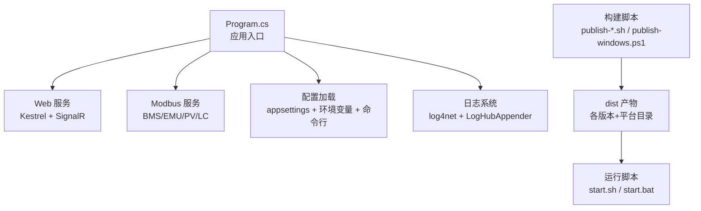
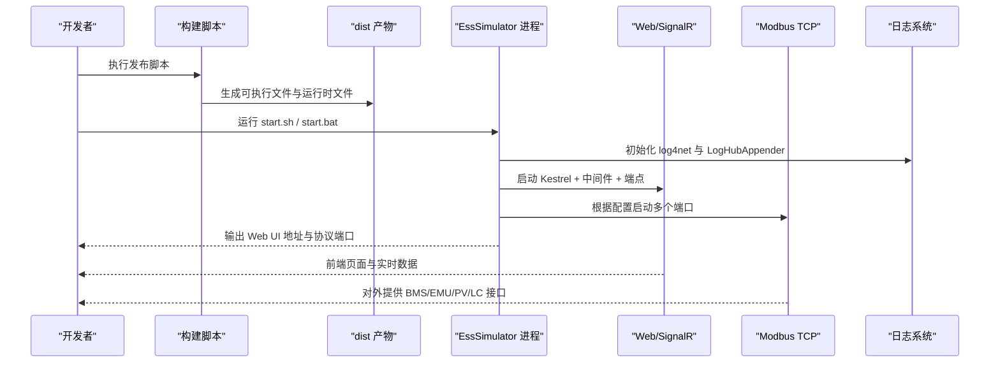
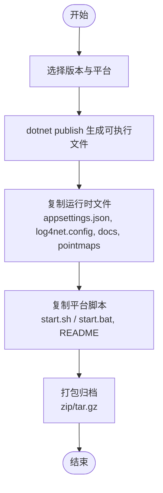
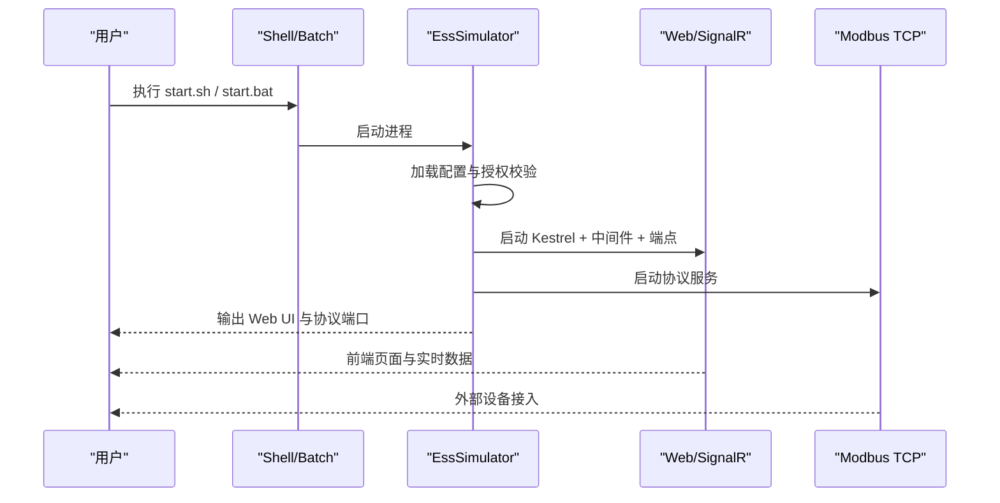
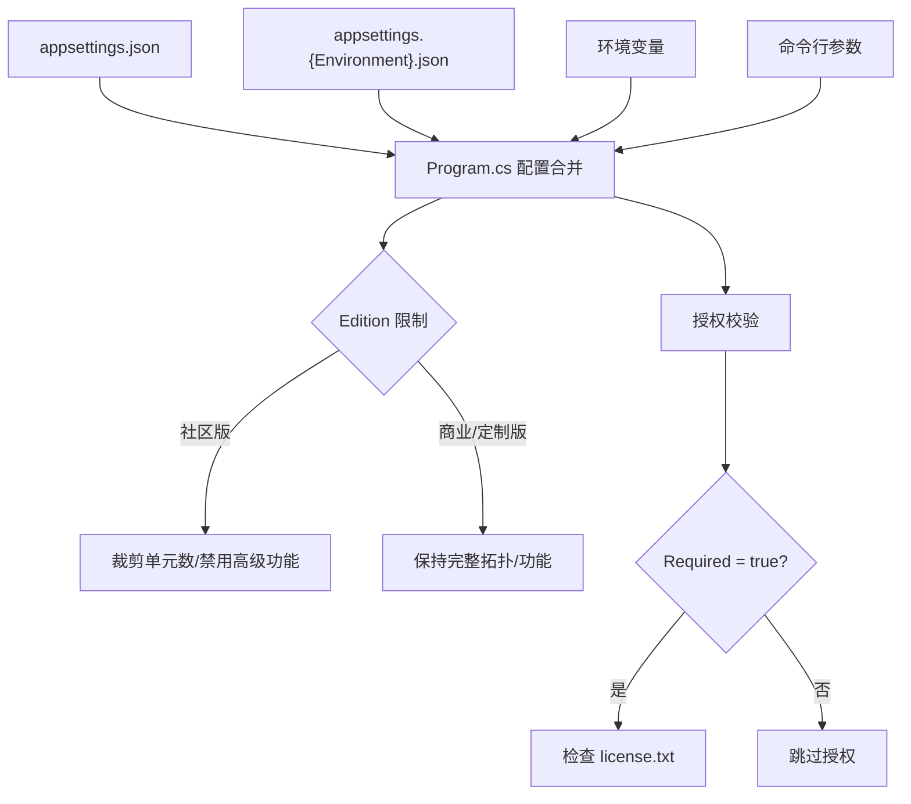
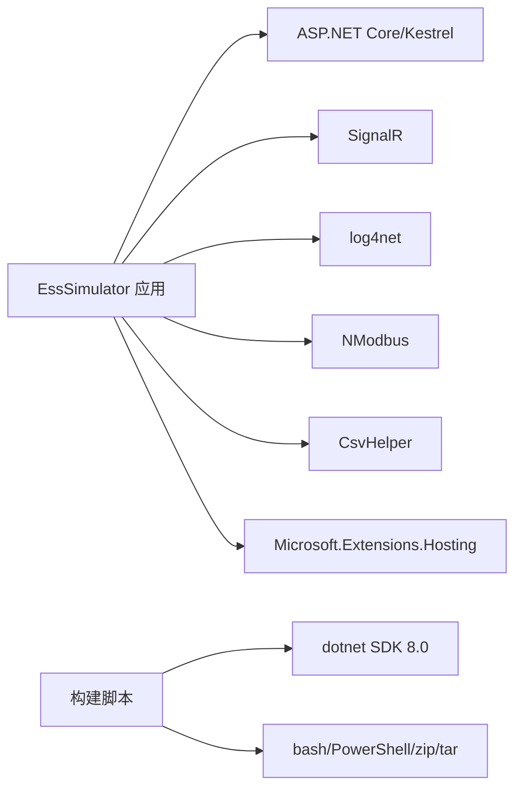

# 部署和运维

<cite>
**本文引用的文件**
- [Program.cs](file://Program.cs)
- [EssSimulator.csproj](file://EssSimulator.csproj)
- [appsettings.json](file://appsettings.json)
- [log4net.config](file://log4net.config)
- [scripts/commercial/publish-all.sh](file://scripts/commercial/publish-all.sh)
- [scripts/commercial/publish-linux.sh](file://scripts/commercial/publish-linux.sh)
- [scripts/commercial/publish-windows.ps1](file://scripts/commercial/publish-windows.ps1)
- [scripts/commercial/publish-common.sh](file://scripts/commercial/publish-common.sh)
- [scripts/commercial/sync-runtime.sh](file://scripts/commercial/sync-runtime.sh)
- [scripts/linux/start.sh](file://scripts/linux/start.sh)
- [scripts/windows/start.bat](file://scripts/windows/start.bat)
- [configs/商业版.appsettings.json](file://configs/商业版.appsettings.json)
- [configs/社区版.appsettings.json](file://configs/社区版.appsettings.json)
</cite>

## 目录
1. [简介](#简介)
2. [项目结构](#项目结构)
3. [核心组件](#核心组件)
4. [架构总览](#架构总览)
5. [详细组件分析](#详细组件分析)
6. [依赖关系分析](#依赖关系分析)
7. [性能考虑](#性能考虑)
8. [故障诊断与排错](#故障诊断与排错)
9. [备份与恢复策略](#备份与恢复策略)
10. [结论](#结论)
11. [附录：构建与发布命令速查](#附录构建与发布命令速查)

## 简介
本指南面向生产环境的部署与运维，覆盖以下内容：
- 构建脚本使用方法（Windows、Linux）
- 部署配置与环境设置（含容器化建议与生产环境参数）
- 日志管理、性能监控、故障诊断
- 备份与恢复策略
- 运维最佳实践与常见问题解决方案

该应用为 B/S 架构的储能仿真系统，提供 Web 前端与 Modbus TCP 协议模拟服务，支持多版本分档（社区版/商业版/定制版），并内置授权校验。

## 项目结构
- 应用入口与运行时装配在 Program.cs，负责配置加载、服务注册、中间件、端点映射与启动流程。
- 项目文件 EssSimulator.csproj 定义目标框架、输出类型及静态资源复制规则。
- 配置文件位于根目录与 configs 目录，按版本区分；运行时通过 Program.cs 合并 appsettings.* 与环境变量、命令行参数。
- 日志由 log4net 管理，默认按日滚动写入 Logs 目录。
- 构建与发布脚本集中在 scripts/commercial，统一产出 Windows 与 Linux 包，并同步运行时配置与平台脚本。
- 运行脚本 scripts/linux/start.sh 与 scripts/windows/start.bat 用于本地快速启动。

**图示来源**
- [Program.cs:216-523](file://Program.cs#L216-L523)
- [EssSimulator.csproj:1-88](file://EssSimulator.csproj#L1-L88)
- [scripts/commercial/publish-all.sh:1-38](file://scripts/commercial/publish-all.sh#L1-L38)
- [scripts/commercial/publish-linux.sh:1-39](file://scripts/commercial/publish-linux.sh#L1-L39)
- [scripts/commercial/publish-windows.ps1:1-40](file://scripts/commercial/publish-windows.ps1#L1-L40)
- [scripts/linux/start.sh:1-18](file://scripts/linux/start.sh#L1-L18)
- [scripts/windows/start.bat:1-13](file://scripts/windows/start.bat#L1-L13)

**章节来源**
- [Program.cs:216-523](file://Program.cs#L216-L523)
- [EssSimulator.csproj:1-88](file://EssSimulator.csproj#L1-L88)

## 核心组件
- 应用启动与生命周期管理：Program.cs 中完成配置加载、授权校验、服务注册、中间件与端点挂载、SignalR 实时推送、等待仿真器就绪后进入监听。
- 配置系统：支持 JSON 注释与尾随逗号，合并 appsettings.json、appsettings.{Environment}.json、环境变量与命令行参数；支持拓扑 overlay 动态覆盖部分设备配置。
- 日志系统：log4net 按日滚动写入 Logs 目录，并通过自定义 LogHubAppender 将日志推送到前端 SignalR。
- 协议服务：根据 Simulator.Protocol 配置启动多个 Modbus TCP 服务（BMS、EMU、PV Logger/Meter、Local Control）。
- Web 服务：Kestrel 托管前端静态文件与 API，暴露 SignalR Hub 用于实时数据与告警推送。

**章节来源**
- [Program.cs:216-523](file://Program.cs#L216-L523)
- [log4net.config:1-19](file://log4net.config#L1-L19)
- [appsettings.json:1-472](file://appsettings.json#L1-L472)

## 架构总览
下图展示了从构建到运行的整体流程，以及关键组件之间的交互。

**图示来源**
- [scripts/commercial/publish-all.sh:1-38](file://scripts/commercial/publish-all.sh#L1-L38)
- [scripts/commercial/publish-linux.sh:1-39](file://scripts/commercial/publish-linux.sh#L1-L39)
- [scripts/commercial/publish-windows.ps1:1-40](file://scripts/commercial/publish-windows.ps1#L1-L40)
- [Program.cs:216-523](file://Program.cs#L216-L523)

## 详细组件分析

### 构建与发布流程
- 统一入口：scripts/commercial/publish-all.sh 支持一次发布所有版本或指定版本，分别调用 Windows 与 Linux 发布脚本。
- Linux 发布：scripts/commercial/publish-linux.sh 使用 dotnet publish 生成自包含单文件，并复制运行时文件（配置、点表、文档）、平台脚本，最后打包 tar.gz。
- Windows 发布：scripts/commercial/publish-windows.ps1 同样生成自包含单文件，同步运行时文件并压缩为 zip。
- 公共逻辑：scripts/commercial/publish-common.sh 提供版本校验、运行时文件复制、平台脚本复制、归档等通用函数。
- 增量同步：scripts/commercial/sync-runtime.sh 可在不重新编译的情况下，将最新配置、点表与文档同步到已发布的 dist 目录。

**图示来源**
- [scripts/commercial/publish-all.sh:1-38](file://scripts/commercial/publish-all.sh#L1-L38)
- [scripts/commercial/publish-linux.sh:1-39](file://scripts/commercial/publish-linux.sh#L1-L39)
- [scripts/commercial/publish-windows.ps1:1-40](file://scripts/commercial/publish-windows.ps1#L1-L40)
- [scripts/commercial/publish-common.sh:89-179](file://scripts/commercial/publish-common.sh#L89-L179)
- [scripts/commercial/sync-runtime.sh:1-56](file://scripts/commercial/sync-runtime.sh#L1-L56)

**章节来源**
- [scripts/commercial/publish-all.sh:1-38](file://scripts/commercial/publish-all.sh#L1-L38)
- [scripts/commercial/publish-linux.sh:1-39](file://scripts/commercial/publish-linux.sh#L1-L39)
- [scripts/commercial/publish-windows.ps1:1-40](file://scripts/commercial/publish-windows.ps1#L1-L40)
- [scripts/commercial/publish-common.sh:1-180](file://scripts/commercial/publish-common.sh#L1-L180)
- [scripts/commercial/sync-runtime.sh:1-56](file://scripts/commercial/sync-runtime.sh#L1-L56)

### 运行与启动流程
- Linux：scripts/linux/start.sh 切换至脚本目录，打印 Web UI 与 Modbus 端口提示，尝试打开浏览器，然后执行 EssSimulator。
- Windows：scripts/windows/start.bat 类似地打印信息并启动浏览器，随后执行 EssSimulator.exe。
- 应用内部：Program.cs 在启动时加载配置、校验授权、注册服务、挂载中间件与端点、启动 Web 与 Modbus 服务，并在后台等待仿真器就绪。

**图示来源**
- [scripts/linux/start.sh:1-18](file://scripts/linux/start.sh#L1-L18)
- [scripts/windows/start.bat:1-13](file://scripts/windows/start.bat#L1-L13)
- [Program.cs:216-523](file://Program.cs#L216-L523)

**章节来源**
- [scripts/linux/start.sh:1-18](file://scripts/linux/start.sh#L1-L18)
- [scripts/windows/start.bat:1-13](file://scripts/windows/start.bat#L1-L13)
- [Program.cs:216-523](file://Program.cs#L216-L523)

### 配置与环境设置
- 基础配置：appsettings.json 定义了仿真运行时、Web、Edition、License、Protocol、PCC、Meter、Transformer、UnitTransformer、Load、Pcs、EssUnits 等节。
- 版本化配置：configs/商业版.appsettings.json 与 configs/社区版.appsettings.json 提供不同版本的默认值与功能开关（如 Edition.LockTopology、MaxEssUnits、AllowDroopSlices、AllowMainline3d、AllowTopologyEditor）。
- 运行时合并：Program.cs 会读取当前工作目录与程序目录下的 appsettings.json 与 appsettings.{Environment}.json，并叠加环境变量与命令行参数。
- 授权校验：非社区版默认需要 license.txt；可通过 License.Required 控制是否强制要求。
- 拓扑覆盖：若存在拓扑 overlay，可在允许编辑的版本中覆盖 EssUnits、Pcc、变压器等配置。

**图示来源**
- [Program.cs:258-378](file://Program.cs#L258-L378)
- [configs/商业版.appsettings.json:1-539](file://configs/商业版.appsettings.json#L1-L539)
- [configs/社区版.appsettings.json:1-216](file://configs/社区版.appsettings.json#L1-L216)

**章节来源**
- [Program.cs:258-378](file://Program.cs#L258-L378)
- [appsettings.json:1-472](file://appsettings.json#L1-L472)
- [configs/商业版.appsettings.json:1-539](file://configs/商业版.appsettings.json#L1-L539)
- [configs/社区版.appsettings.json:1-216](file://configs/社区版.appsettings.json#L1-L216)

### 日志管理与实时推送
- 日志文件：log4net.config 配置 RollingFileAppender，按日期滚动写入 Logs 目录，保留最近 5 份。
- 实时日志：Program.cs 在启动时注册 LogHubAppender，将日志通过 SignalR 推送到前端，便于在线观察。
- 建议：生产环境建议结合外部日志采集（如 filebeat/fluent-bit）将 Logs 目录中的日志集中收集与分析。

**章节来源**
- [log4net.config:1-19](file://log4net.config#L1-L19)
- [Program.cs:226-256](file://Program.cs#L226-L256)

### 性能监控与健康检查
- 健康就绪：Program.cs 在启动后轮询仿真器状态，确保必要服务与变量可用后再认为“就绪”。
- 指标与观测：社区版配置中包含 Observability 节（EnableHttp、HttpPort、HttpBindAddress），可用于暴露轻量级 HTTP 观测端点（具体实现以代码为准）。
- 建议：在生产环境中启用健康检查端点，并结合监控系统（如 Prometheus/Grafana）进行指标采集与告警。

**章节来源**
- [Program.cs:52-139](file://Program.cs#L52-L139)
- [configs/社区版.appsettings.json:43-47](file://configs/社区版.appsettings.json#L43-L47)

### 容器化部署建议
- 镜像基础：基于 .NET 8 运行时镜像，复制 dist 产物与运行时文件（appsettings.json、log4net.config、docs、pointmaps 等）。
- 端口暴露：默认 Web 端口 5050；Modbus 端口范围依据 Simulator.Protocol 配置（BMS、EMU、PV、LC）。
- 配置注入：通过环境变量或挂载卷覆盖 appsettings.json 与 license.txt，避免硬编码。
- 日志持久化：将 Logs 目录挂载到宿主机或日志采集容器，便于集中分析与归档。
- 健康检查：若启用 Observability，可配置容器健康检查指向对应 HTTP 端点。

[本节为概念性指导，无需源码引用]

## 依赖关系分析
- 应用层依赖：
  - ASP.NET Core/Kestrel：Web 服务与静态文件托管
  - SignalR：实时数据与日志推送
  - log4net：日志记录与滚动
  - NModbus：Modbus TCP 协议支持
  - CsvHelper：CSV 点表解析
  - Microsoft.Extensions.Hosting：服务生命周期管理
- 构建依赖：
  - dotnet SDK 8.0：编译与发布
  - 脚本工具：bash、PowerShell、zip/tar

**图示来源**
- [EssSimulator.csproj:19-30](file://EssSimulator.csproj#L19-L30)
- [Program.cs:258-457](file://Program.cs#L258-L457)

**章节来源**
- [EssSimulator.csproj:19-30](file://EssSimulator.csproj#L19-L30)
- [Program.cs:258-457](file://Program.cs#L258-L457)

## 性能考虑
- 集成步长与传播间隔：Simulator.Runtime.IntegrationStepMultiplier 与 PropagationIntervalMs 影响仿真精度与性能，生产环境需根据硬件能力调优。
- 热模型：Thermal.Enabled 与相关参数会影响计算开销，建议在不需要热仿真时关闭或降低采样频率。
- 快照与切片：Web.SnapshotIntervalMs 与 DroopSliceCaptureEnabled/DroopSliceMaxCount 影响内存与 I/O，生产环境建议按需开启并限制数量。
- 日志级别：log4net 的 root level 设置为 ALL，生产环境建议调整为 INFO 或 WARN 以减少磁盘压力。
- 并发与连接：SignalR MaximumReceiveMessageSize 与 Modbus 端口数量需根据客户端规模调整。

[本节为一般性指导，无需源码引用]

## 故障诊断与排错
- 授权失败：
  - 现象：启动时报错并要求获取 license.txt。
  - 处理：运行 --machine-id 或 scripts/license/get-machine-id.sh 获取机器码，向提供方申请 license.txt 并放置于运行目录。
  - 参考：Program.cs 中的 EnforceLicenseOrExit 逻辑。
- 配置加载失败：
  - 现象：无法找到 appsettings.json 或语法错误。
  - 处理：确保 appsettings.json 存在且格式正确（支持注释与尾随逗号）；检查环境变量与命令行参数覆盖。
  - 参考：Program.cs 中的 LoadJsonWithCommentsAsStream 与配置合并逻辑。
- 端口冲突：
  - 现象：Modbus 或 Web 端口被占用导致启动失败。
  - 处理：修改 Simulator.Protocol 与 Web.HttpPort，确保端口唯一。
- 日志不可见：
  - 现象：Logs 目录未生成或无内容。
  - 处理：检查 log4net.config 路径与权限；确认应用有写入 Logs 目录的权限。
- 前端无法访问：
  - 现象：浏览器无法打开或显示 404。
  - 处理：确认 Web.StaticFiles 与 URL 绑定；检查防火墙与代理设置。

**章节来源**
- [Program.cs:141-178](file://Program.cs#L141-L178)
- [Program.cs:226-256](file://Program.cs#L226-L256)
- [log4net.config:1-19](file://log4net.config#L1-L19)

## 备份与恢复策略
- 配置备份：
  - 定期备份 appsettings.json、license.txt、pointmap.manifest.json 与 configs 目录下的版本配置。
  - 使用版本控制系统或配置管理工具（如 GitOps）管理配置变更。
- 日志归档：
  - 将 Logs 目录中的日志文件归档到对象存储或日志中心，保留策略按合规要求设定。
- 数据与拓扑：
  - 若使用拓扑 overlay，需备份 overlays 与相关工程文件。
- 恢复步骤：
  - 停止服务，替换配置与许可证，重启服务；验证 Web 与 Modbus 端口可用性。
  - 通过前端与协议测试用例验证恢复结果。

[本节为一般性指导，无需源码引用]

## 结论
本指南提供了从构建、发布到运行与运维的全流程说明。通过统一的构建脚本与版本化配置，可实现跨平台的一键发布与快速部署；通过日志与实时监控，保障生产环境的可观测性与稳定性。建议在生产环境中结合容器化、日志集中化与健康检查，形成完整的运维闭环。

[本节为总结性内容，无需源码引用]

## 附录：构建与发布命令速查
- 全量发布（所有版本 × Windows/Linux）：
  - ./scripts/commercial/publish-all.sh
- 仅发布指定版本：
  - EDITION=商业版 ./scripts/commercial/publish-all.sh
- 仅发布 Linux：
  - EDITION=商业版 ./scripts/commercial/publish-linux.sh
- 仅发布 Windows：
  - EDITION=商业版 ./scripts/commercial/publish-windows.ps1
- 增量同步运行时文件（不重新编译）：
  - ./scripts/commercial/sync-runtime.sh
- 本地启动：
  - Linux: ./scripts/linux/start.sh
  - Windows: scripts/windows/start.bat

**章节来源**
- [scripts/commercial/publish-all.sh:1-38](file://scripts/commercial/publish-all.sh#L1-L38)
- [scripts/commercial/publish-linux.sh:1-39](file://scripts/commercial/publish-linux.sh#L1-L39)
- [scripts/commercial/publish-windows.ps1:1-40](file://scripts/commercial/publish-windows.ps1#L1-L40)
- [scripts/commercial/sync-runtime.sh:1-56](file://scripts/commercial/sync-runtime.sh#L1-L56)
- [scripts/linux/start.sh:1-18](file://scripts/linux/start.sh#L1-L18)
- [scripts/windows/start.bat:1-13](file://scripts/windows/start.bat#L1-L13)