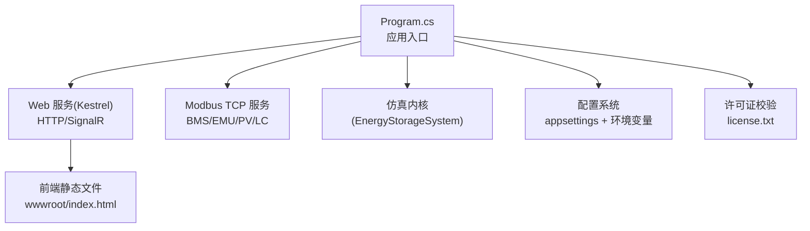
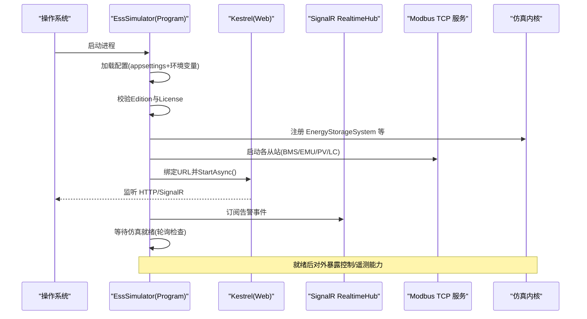
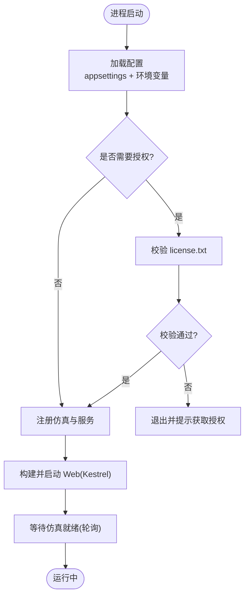
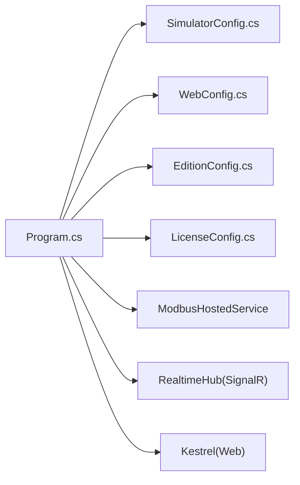

# 部署指南

<cite>
**本文引用的文件**
- [Program.cs](file://Program.cs)
- [appsettings.json](file://appsettings.json)
- [EssSimulator.csproj](file://EssSimulator.csproj)
- [Configuration/SimulatorConfig.cs](file://Configuration/SimulatorConfig.cs)
- [Configuration/WebConfig.cs](file://Configuration/WebConfig.cs)
- [Configuration/EditionConfig.cs](file://Configuration/EditionConfig.cs)
- [Configuration/LicenseConfig.cs](file://Configuration/LicenseConfig.cs)
- [scripts/windows/start.bat](file://scripts/windows/start.bat)
- [scripts/linux/start.sh](file://scripts/linux/start.sh)
- [scripts/commercial/publish-linux.sh](file://scripts/commercial/publish-linux.sh)
- [scripts/commercial/publish-windows.ps1](file://scripts/commercial/publish-windows.ps1)
- [scripts/commercial/sync-runtime.sh](file://scripts/commercial/sync-runtime.sh)
- [docs/appsettings.explained.md](file://docs/appsettings.explained.md)
</cite>

## 目录
1. [简介](#简介)
2. [项目结构](#项目结构)
3. [核心组件](#核心组件)
4. [架构总览](#架构总览)
5. [详细组件分析](#详细组件分析)
6. [依赖关系分析](#依赖关系分析)
7. [性能与生产优化](#性能与生产优化)
8. [安全加固](#安全加固)
9. [环境要求与端口规划](#环境要求与端口规划)
10. [安装与启动（Windows）](#安装与启动windows)
11. [安装与启动（Linux）](#安装与启动linux)
12. [Docker 容器化部署](#docker-容器化部署)
13. [云服务部署最佳实践](#云服务部署最佳实践)
14. [故障排查](#故障排查)
15. [结论](#结论)

## 简介
本指南面向生产环境，提供 EssSimulator 在 Windows 与 Linux 上的完整部署说明，涵盖环境准备、端口与网络配置、服务管理、授权校验、性能调优与安全加固，并给出 Docker 与云平台的部署建议。程序为 B/S 架构的 .NET 8 Web 应用，内置 SignalR 实时推送、Modbus TCP 仿真服务以及可配置的储能/光伏模型。

## 项目结构
- 运行时入口与宿主：Program.cs 负责配置加载、服务注册、中间件与端点映射、许可证校验、协议端口日志输出等。
- 配置体系：appsettings.json 与 Configuration/*.cs 强类型绑定；支持环境变量与命令行覆盖。
- 发布产物：通过 scripts/commercial/* 脚本生成自包含单文件包，附带运行时配置文件与文档。
- 启动脚本：scripts/windows/start.bat、scripts/linux/start.sh 用于快速启动并提示 Web 与 Modbus 端口。

图示来源
- [Program.cs:258-522](file://Program.cs#L258-L522)
- [EssSimulator.csproj:1-13](file://EssSimulator.csproj#L1-L13)

章节来源
- [Program.cs:258-522](file://Program.cs#L258-L522)
- [EssSimulator.csproj:1-13](file://EssSimulator.csproj#L1-L13)

## 核心组件
- 应用入口 Program.cs：加载配置、注册服务、启用 CORS/SignalR、挂载 API/Hub、启动 Kestrel、等待仿真就绪、输出协议端口信息。
- 配置类：
  - SimulatorConfig.cs：运行时参数、协议端口、设备拓扑、热模型等。
  - WebConfig.cs：Web 监听地址/端口、静态文件托管、CORS、快照间隔、API Key。
  - EditionConfig.cs：产品档位开关（社区版/商业版/定制版）。
  - LicenseConfig.cs：是否强制校验 license.txt 及文件名。
- 发布脚本：
  - publish-linux.sh / publish-windows.ps1：构建自包含单文件包，复制运行时文件与平台特定资源。
  - sync-runtime.sh：仅同步配置/点位表/文档到已发布目录，无需重新编译。

章节来源
- [Program.cs:258-522](file://Program.cs#L258-L522)
- [Configuration/SimulatorConfig.cs:1-479](file://Configuration/SimulatorConfig.cs#L1-L479)
- [Configuration/WebConfig.cs:1-39](file://Configuration/WebConfig.cs#L1-L39)
- [Configuration/EditionConfig.cs:1-57](file://Configuration/EditionConfig.cs#L1-L57)
- [Configuration/LicenseConfig.cs:1-15](file://Configuration/LicenseConfig.cs#L1-L15)
- [scripts/commercial/publish-linux.sh:1-39](file://scripts/commercial/publish-linux.sh#L1-L39)
- [scripts/commercial/publish-windows.ps1:1-40](file://scripts/commercial/publish-windows.ps1#L1-L40)
- [scripts/commercial/sync-runtime.sh:1-55](file://scripts/commercial/sync-runtime.sh#L1-L55)

## 架构总览
EssSimulator 基于 ASP.NET Core 宿主，启动后：
- 加载 appsettings.json（支持注释/尾随逗号），合并环境变量与命令行参数。
- 校验产品档位与许可证（社区版默认不强制，商业/定制默认需要 license.txt）。
- 注册仿真内核与服务（EnergyStorageSystem、BmsDataService、PcsDataServer、EmDataService、ModbusHostedService 等）。
- 配置 Kestrel 监听地址与端口，启用 CORS、SignalR、API Key 鉴权（可选）、静态文件托管。
- 启动后输出所有 Modbus TCP 端口信息，并异步等待仿真器就绪。

图示来源
- [Program.cs:258-522](file://Program.cs#L258-L522)

## 详细组件分析

### 启动流程与就绪检测
- 配置加载：优先读取运行目录下的 appsettings.json，再加载环境相关配置与环境变量/命令行。
- 许可证校验：根据 Edition 与 License.Required 决定是否校验 license.txt；失败时退出并提示获取机器码与授权步骤。
- 服务注册：将 EnergyStorageSystem、BmsDataService、PcsDataServer、EmDataService、ModbusHostedService、LocalControlHostedService（可选）等加入 DI。
- Web 层：设置 Kestrel URL、CORS、SignalR、JSON 序列化策略、中间件与端点（/hub/realtime、/api/*、SPA 回退）。
- 就绪检测：按配置计算期望的服务器数量，轮询检查 ess/em/simEm 等对象是否存在且关键变量可读取，超时仍继续启动 Web。

图示来源
- [Program.cs:141-178](file://Program.cs#L141-L178)
- [Program.cs:258-522](file://Program.cs#L258-L522)

章节来源
- [Program.cs:141-178](file://Program.cs#L141-L178)
- [Program.cs:258-522](file://Program.cs#L258-L522)

### 配置与端口
- Web 端口与地址：由 WebConfig.HttpPort 与 HttpBaseUrl 决定，默认 5050，监听 0.0.0.0。
- 协议端口：
  - BMS：BaseBmsModbusPort + (N-1)*BmsPortStep
  - EMU：BaseEmuModbusPort + (N-1)*EmuPortStep
  - 电表 simEm：EmModbusPort
  - LocalControl（聚合）：BaseLocalControlModbusPort + (N-1)*LocalControlPortStep
  - PV Logger/Meter：BasePvLoggerModbusPort / BasePvMeterModbusPort 及其步长
- 运行时参数：PropagationIntervalMs、UseElectricalPropagation、IntegrationStepMultiplier、Thermal 等。

章节来源
- [Configuration/SimulatorConfig.cs:149-189](file://Configuration/SimulatorConfig.cs#L149-L189)
- [Configuration/WebConfig.cs:1-39](file://Configuration/WebConfig.cs#L1-L39)
- [appsettings.json:52-90](file://appsettings.json#L52-L90)
- [docs/appsettings.explained.md:118-146](file://docs/appsettings.explained.md#L118-L146)

### 授权与产品档位
- EditionConfig.Name 决定功能开关（社区版关闭高级 UI/API，锁定拓扑规模）。
- LicenseConfig.Required 控制是否必须存在 license.txt；未显式配置时，非社区版默认需要。
- 启动时会打印本机机器码，便于申请授权。

章节来源
- [Configuration/EditionConfig.cs:1-57](file://Configuration/EditionConfig.cs#L1-L57)
- [Configuration/LicenseConfig.cs:1-15](file://Configuration/LicenseConfig.cs#L1-L15)
- [Program.cs:141-178](file://Program.cs#L141-L178)

## 依赖关系分析
- 运行时依赖：.NET 8 运行时（发布为自包含单文件，减少依赖）。
- 外部库：log4net、NModbus、CsvHelper、Microsoft.Extensions.Hosting 等。
- 前端：Vue 3 + Vite，构建产物作为静态文件托管于 wwwroot。

图示来源
- [Program.cs:258-522](file://Program.cs#L258-L522)
- [EssSimulator.csproj:23-30](file://EssSimulator.csproj#L23-L30)

章节来源
- [EssSimulator.csproj:23-30](file://EssSimulator.csproj#L23-L30)
- [Program.cs:258-522](file://Program.cs#L258-L522)

## 性能与生产优化
- 仿真传播周期：PropagationIntervalMs 越小刷新越快但 CPU 占用越高；生产建议结合负载调整。
- 电气传播模式：UseElectricalPropagation 开启事件驱动替代主循环步进，适合高并发场景。
- 积分步长倍数：IntegrationStepMultiplier 放大 SOC/电能等积分量 dt，不影响瞬时值动力学。
- 快照推送：SnapshotIntervalMs 控制 SignalR 推送频率，过高会增加网络与前端渲染压力。
- 切片采集：DroopSliceCaptureEnabled/DroopSliceMaxCount 控制白盒切片内存缓冲，生产按需开启。
- 发布形态：使用自包含单文件发布，减少运行时差异；配合 systemd 或 Windows 服务管理。

章节来源
- [Configuration/SimulatorConfig.cs:6-36](file://Configuration/SimulatorConfig.cs#L6-L36)
- [Configuration/WebConfig.cs:20-27](file://Configuration/WebConfig.cs#L20-L27)
- [appsettings.json:3-11](file://appsettings.json#L3-L11)
- [docs/appsettings.explained.md:84-117](file://docs/appsettings.explained.md#L84-L117)

## 安全加固
- API Key 鉴权：启用 Web.ApiKeyEnabled 并在环境变量注入密钥，保护 /api/*（/api/health 豁免）。
- CORS 限制：生产环境应明确配置 CorsOrigins，避免放行开发代理默认端口。
- 静态文件：StaticFiles 在生产环境可按需关闭，仅托管必要资源。
- 日志：log4net 输出至文件与 SignalR，注意日志轮转与敏感信息脱敏。
- 授权：商业/定制版本必须放置 license.txt，否则进程退出。

章节来源
- [Configuration/WebConfig.cs:29-36](file://Configuration/WebConfig.cs#L29-L36)
- [Program.cs:385-396](file://Program.cs#L385-L396)
- [Program.cs:483-513](file://Program.cs#L483-L513)
- [Program.cs:141-178](file://Program.cs#L141-L178)

## 环境要求与端口规划
- 运行时：.NET 8（发布为自包含单文件，无需额外安装运行时）。
- 端口：
  - Web：默认 5050（可通过 WebConfig 修改）。
  - Modbus TCP：
    - BMS：BaseBmsModbusPort 起，步长 BmsPortStep。
    - EMU：BaseEmuModbusPort 起，步长 EmuPortStep。
    - 电表 simEm：EmModbusPort。
    - LocalControl：BaseLocalControlModbusPort 起，步长 LocalControlPortStep。
    - PV Logger/Meter：BasePvLoggerModbusPort / BasePvMeterModbusPort 及其步长。
- 防火墙：开放 Web 端口与各 Modbus TCP 端口；必要时限制来源 IP。
- 文件权限：确保运行用户对运行目录有读写权限（日志、配置文件、授权文件）。

章节来源
- [Configuration/SimulatorConfig.cs:149-189](file://Configuration/SimulatorConfig.cs#L149-L189)
- [Configuration/WebConfig.cs:8-12](file://Configuration/WebConfig.cs#L8-L12)
- [appsettings.json:52-90](file://appsettings.json#L52-L90)

## 安装与启动（Windows）
- 获取发布包：使用 scripts/commercial/publish-windows.ps1 生成自包含 zip，解压后进入输出目录。
- 前置条件：
  - 若为商业/定制版，需在运行目录放置 license.txt。
  - 如需组态编辑/演示，可使用对应版本的 appsettings 模板。
- 启动方式：
  - 双击 scripts/windows/start.bat，自动打开浏览器访问 http://localhost:5050。
  - 或直接运行 EssSimulator.exe。
- 服务管理（Windows 服务）：
  - 使用 sc.exe 创建服务指向 EssSimulator.exe，设置启动类型为自动。
  - 或使用第三方工具（如 NSSM）封装为服务，配置重启策略与日志重定向。
- 常见命令：
  - 查看端口监听：netstat -ano | findstr :5050
  - 查看 Modbus 端口：根据 appsettings.json 中的 Protocol 节核对。

章节来源
- [scripts/commercial/publish-windows.ps1:1-40](file://scripts/commercial/publish-windows.ps1#L1-L40)
- [scripts/windows/start.bat:1-13](file://scripts/windows/start.bat#L1-L13)
- [Program.cs:380-383](file://Program.cs#L380-L383)

## 安装与启动（Linux）
- 获取发布包：使用 scripts/commercial/publish-linux.sh 生成 tar.gz，解压后进入输出目录。
- 前置条件：
  - 商业/定制版需放置 license.txt。
  - 确保运行用户具备执行权限与目录读写权限。
- 启动方式：
  - 运行 scripts/linux/start.sh，自动尝试打开浏览器并启动服务。
  - 或直接运行 ./EssSimulator。
- 服务管理（systemd）：
  - 创建 /etc/systemd/system/esssimulator.service，指定 ExecStart、User、Restart 策略。
  - 启用并启动：systemctl enable --now esssimulator。
  - 查看状态：systemctl status esssimulator；查看日志：journalctl -u esssimulator -f。
- 端口与防火墙：
  - 开放 Web 端口与各 Modbus TCP 端口（firewalld/ufw）。
  - 生产建议仅允许受信任网段访问。

章节来源
- [scripts/commercial/publish-linux.sh:1-39](file://scripts/commercial/publish-linux.sh#L1-L39)
- [scripts/linux/start.sh:1-18](file://scripts/linux/start.sh#L1-L18)
- [Program.cs:380-383](file://Program.cs#L380-L383)

## Docker 容器化部署
- 基础镜像：选择包含 .NET 8 运行时的官方镜像（如 mcr.microsoft.com/dotnet/aspnet:8.0）。
- 构建步骤：
  - 使用 dotnet publish 生成自包含单文件（参考 publish-linux.sh）。
  - 将输出目录复制到镜像工作目录，设置入口为 EssSimulator。
  - 暴露端口：5050（Web）与各 Modbus TCP 端口（动态，取决于配置）。
- 运行示例：
  - docker run -d -p 5050:5050 -v /host/config:/app/config --name esssimulator image:tag
  - 通过环境变量注入 API Key 与配置覆盖（如 Simulator__Web__ApiKey）。
- 注意事项：
  - 容器内文件系统只读，配置文件与授权文件通过卷挂载。
  - 网络模式建议使用 host 或桥接并明确端口映射。
  - 日志输出到 stdout/stderr 以便容器编排收集。

[本节为概念性指导，不直接引用具体代码文件]

## 云服务部署最佳实践
- 平台选择：Windows Server 或 Linux VM；推荐使用容器编排（Kubernetes/AKS/EKS）。
- 配置管理：
  - 使用环境变量注入敏感信息（API Key、端口覆盖）。
  - 将 appsettings.json 与 license.txt 放入 ConfigMap/Secret 或挂载卷。
- 网络与安全：
  - 仅开放必要端口（Web 与 Modbus TCP）。
  - 启用 API Key 鉴权，限制 CORS 来源。
  - 使用反向代理（Nginx/Ingress）统一入口与 TLS 终止。
- 高可用与监控：
  - 多副本部署，健康检查 /api/health。
  - 集中日志（ELK/CloudWatch），指标采集（Prometheus/Grafana）。
  - 自动重启与滚动更新。

[本节为概念性指导，不直接引用具体代码文件]

## 故障排查
- 无法启动（授权失败）：
  - 检查 Edition 与 License.Required；确认 license.txt 存在且有效。
  - 运行程序带 --machine-id 参数获取机器码，联系提供方签发授权。
- Web 无法访问：
  - 检查 Kestrel 监听地址与端口（HttpBaseUrl/HttpPort）。
  - 确认防火墙与云平台安全组规则。
- Modbus 连接失败：
  - 核对 appsettings.json 中 Protocol 节的端口与步长。
  - 使用 modbus 客户端测试各端口连通性。
- 性能问题：
  - 调整 PropagationIntervalMs、SnapshotIntervalMs、IntegrationStepMultiplier。
  - 观察 CPU/内存占用，必要时扩容实例。
- 日志定位：
  - 查看 log4net 输出与 SignalR 日志推送。
  - 容器环境下查看 stdout/stderr 或挂载日志卷。

章节来源
- [Program.cs:141-178](file://Program.cs#L141-L178)
- [Program.cs:380-383](file://Program.cs#L380-L383)
- [Configuration/SimulatorConfig.cs:149-189](file://Configuration/SimulatorConfig.cs#L149-L189)
- [Configuration/WebConfig.cs:8-12](file://Configuration/WebConfig.cs#L8-L12)

## 结论
EssSimulator 提供开箱即用的 B/S 架构仿真平台，支持多平台自包含发布、灵活的配置与端口规划、完善的授权机制与生产级安全选项。通过 systemd/Windows 服务或容器化部署，可在不同环境中稳定运行。生产环境建议结合 API Key 鉴权、CORS 限制、日志与监控，合理调优仿真与推送参数，确保性能与安全性平衡。