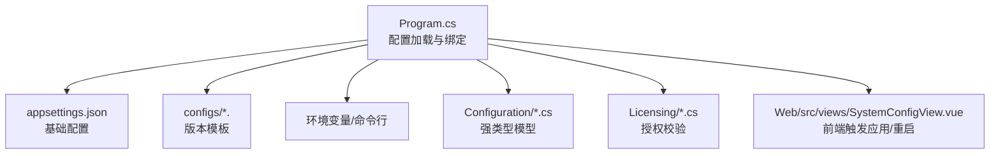
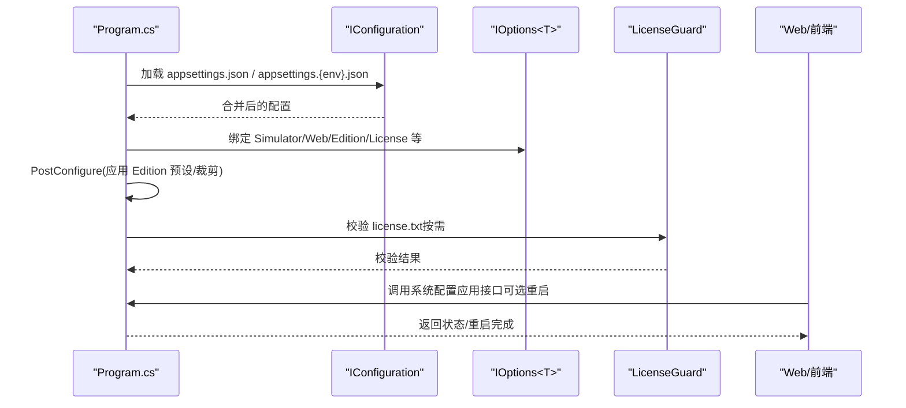
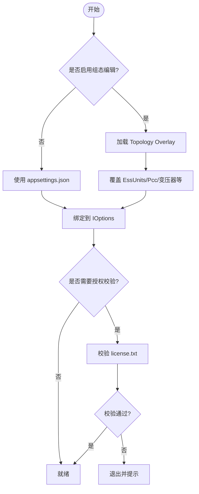
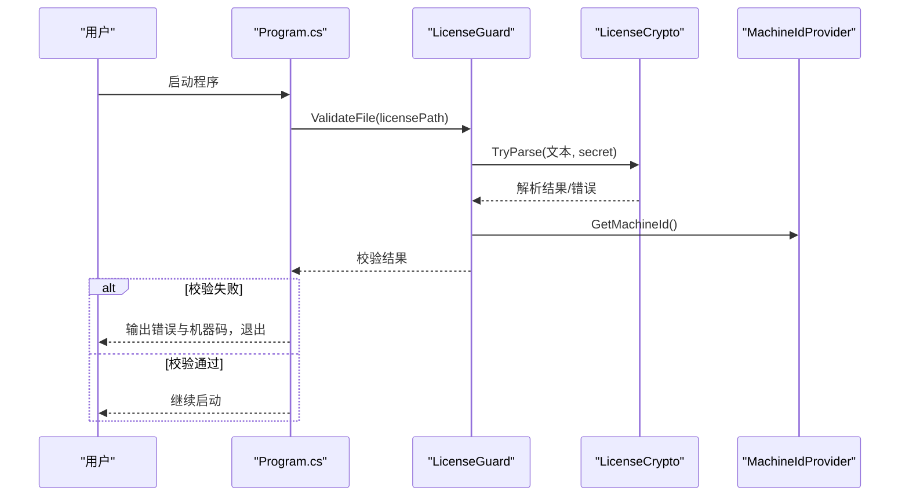
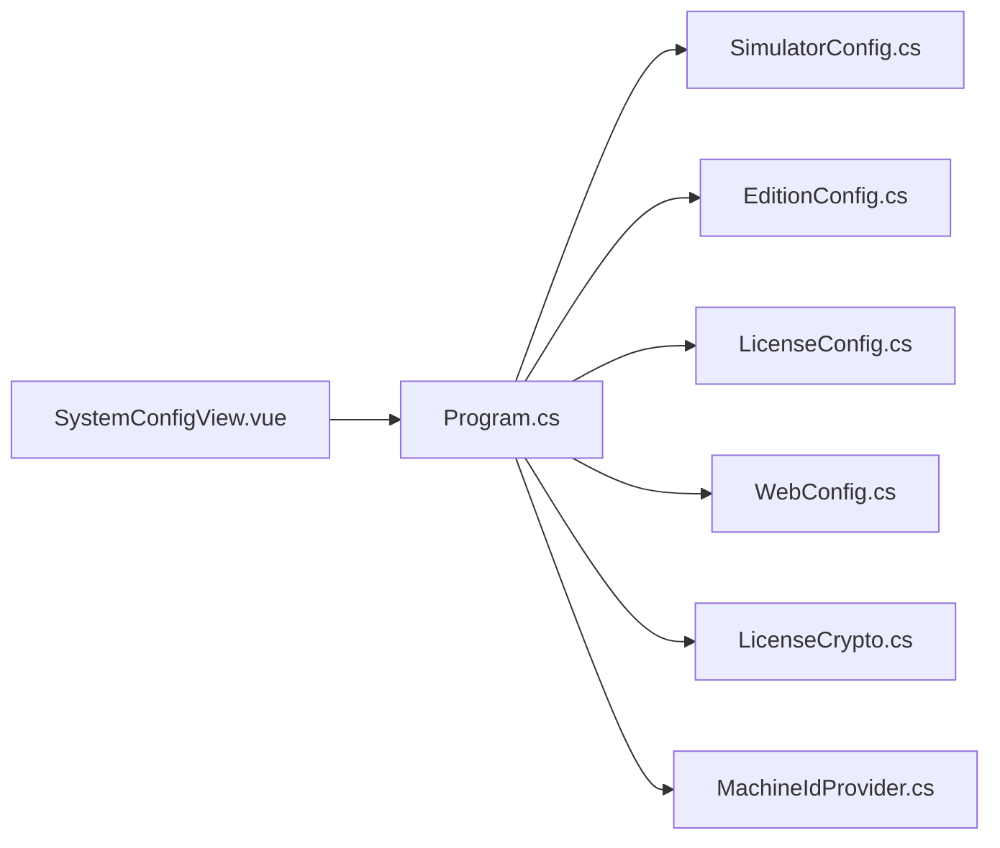

# 配置管理系统

<cite>
**本文引用的文件**
- [Program.cs](file://Program.cs)
- [appsettings.json](file://appsettings.json)
- [SimulatorConfig.cs](file://Configuration/SimulatorConfig.cs)
- [EditionConfig.cs](file://Configuration/EditionConfig.cs)
- [LicenseConfig.cs](file://Configuration/LicenseConfig.cs)
- [WebConfig.cs](file://Configuration/WebConfig.cs)
- [社区版.appsettings.json](file://configs/社区版.appsettings.json)
- [商业版.appsettings.json](file://configs/商业版.appsettings.json)
- [定制版.appsettings.json](file://configs/定制版.appsettings.json)
- [LicenseCrypto.cs](file://Licensing/LicenseCrypto.cs)
- [MachineIdProvider.cs](file://Licensing/MachineIdProvider.cs)
- [SystemConfigView.vue](file://Web/src/views/SystemConfigView.vue)
- [TopologyRuntimeModels.cs](file://Web/Topology/TopologyRuntimeModels.cs)
- [vite.config.js](file://Web/vite.config.js)
- [appsettings.explained.md](file://docs/appsettings.explained.md)
- [授权说明.md](file://docs/授权说明.md)
</cite>

## 目录
1. [简介](#简介)
2. [项目结构](#项目结构)
3. [核心组件](#核心组件)
4. [架构总览](#架构总览)
5. [详细组件分析](#详细组件分析)
6. [依赖关系分析](#依赖关系分析)
7. [性能考量](#性能考量)
8. [故障排除指南](#故障排除指南)
9. [结论](#结论)
10. [附录](#附录)

## 简介
本文件面向配置管理系统，系统性说明：
- 配置文件结构与语法（JSON、环境变量覆盖、命令行参数）
- 动态配置重载机制（变更检测与应用生效流程）
- 版本差异（社区版、商业版、定制版）与许可证配置、授权管理
- 最佳实践与常见问题排查

## 项目结构
配置系统由“强类型配置类 + JSON 配置 + 环境变量/命令行 + 启动期绑定”构成。关键位置如下：
- 配置模型：Configuration 下的 SimulatorConfig、EditionConfig、LicenseConfig、WebConfig
- 默认配置：根 appsettings.json；各版本模板位于 configs/
- 启动与绑定：Program.cs 中加载顺序、PostConfigure 覆盖、Overlay 工程模式
- 授权校验：Licensing 下 LicenseCrypto 与 MachineIdProvider
- Web 前端配置应用：Web/src/views/SystemConfigView.vue 触发重启并等待就绪

图表来源
- [Program.cs:258-273](file://Program.cs#L258-L273)
- [appsettings.json:1-91](file://appsettings.json#L1-L91)
- [SimulatorConfig.cs:272-344](file://Configuration/SimulatorConfig.cs#L272-L344)
- [EditionConfig.cs:1-57](file://Configuration/EditionConfig.cs#L1-L57)
- [LicenseConfig.cs:1-15](file://Configuration/LicenseConfig.cs#L1-L15)
- [WebConfig.cs:1-39](file://Configuration/WebConfig.cs#L1-L39)
- [SystemConfigView.vue:197-237](file://Web/src/views/SystemConfigView.vue#L197-L237)

章节来源
- [Program.cs:258-273](file://Program.cs#L258-L273)
- [appsettings.explained.md:17-33](file://docs/appsettings.explained.md#L17-L33)

## 核心组件
- 运行时与协议配置：SimulatorConfig（含 Runtime、Protocol、设备单元列表、PvUnits）
- 产品档位：EditionConfig（Name、LockTopology、MaxEssUnits、功能开关）
- 授权配置：LicenseConfig（Required、FileName）
- Web 服务配置：WebConfig（端口、CORS、快照推送、API Key）
- 启动装配：Program.cs（配置源优先级、PostConfigure 覆盖、Overlay 工程模式）
- 授权校验：LicenseCrypto（签名验证、到期检查）、MachineIdProvider（机器码生成）

章节来源
- [SimulatorConfig.cs:6-344](file://Configuration/SimulatorConfig.cs#L6-L344)
- [EditionConfig.cs:1-57](file://Configuration/EditionConfig.cs#L1-L57)
- [LicenseConfig.cs:1-15](file://Configuration/LicenseConfig.cs#L1-L15)
- [WebConfig.cs:1-39](file://Configuration/WebConfig.cs#L1-L39)
- [Program.cs:291-352](file://Program.cs#L291-L352)
- [LicenseCrypto.cs:33-181](file://Licensing/LicenseCrypto.cs#L33-L181)
- [MachineIdProvider.cs:9-32](file://Licensing/MachineIdProvider.cs#L9-L32)

## 架构总览
配置加载与生效的关键路径：
- 配置源优先级：基础 JSON → 环境 JSON → 环境变量 → 命令行
- 强类型绑定：通过 IOptions<T> 注入到服务
- PostConfigure：根据 Edition 预设裁剪/覆盖（如社区版限制拓扑、关闭高级能力）
- Overlay 工程模式：在允许编辑时以 topology overlay 覆盖 EssUnits/Pcc/变压器等
- 授权校验：启动早期执行，不满足则退出
- Web 层：提供 API/SignalR 推送，前端可触发应用/重启流程

图表来源
- [Program.cs:258-273](file://Program.cs#L258-L273)
- [Program.cs:291-352](file://Program.cs#L291-L352)
- [Program.cs:141-178](file://Program.cs#L141-L178)
- [TopologyRuntimeModels.cs:43-70](file://Web/Topology/TopologyRuntimeModels.cs#L43-L70)

## 详细组件分析

### 配置文件结构与语法
- 支持带注释的 JSON（启动时跳过注释与尾随逗号），便于开发调试
- 顶层节包括 Simulator、EssUnits、DataExchange、Pcc、Meter、Transformer、UnitTransformer、Load、Pcs
- 字段单位与约定详见文档：功率 kW/kvar、电压 V、电流 A、频率 Hz、SOC 0~1、容量 kVA

章节来源
- [Program.cs:27-50](file://Program.cs#L27-L50)
- [appsettings.explained.md:7-33](file://docs/appsettings.explained.md#L7-L33)

### 环境变量覆盖与命令行参数
- 配置加载顺序：基础 JSON → 环境 JSON → 环境变量 → 命令行
- 可通过环境变量覆盖任意配置项（例如 Web.ApiKey）
- 命令行支持 --machine-id 输出机器码，便于申请授权

章节来源
- [Program.cs:258-273](file://Program.cs#L258-L273)
- [Program.cs:216-224](file://Program.cs#L216-L224)

### 动态配置重载机制
- 工程模式（Topology Overlay）：当允许编辑时，从 configs/topology 读取 overlay 并覆盖 EssUnits/Pcc/变压器等
- 前端触发：SystemConfigView 调用后端接口，可选择是否重启；若重启，前端轮询等待后端就绪后刷新
- 生效范围：Overlay 仅影响运行期拓扑相关配置；其他运行时参数仍遵循启动时绑定

图表来源
- [Program.cs:275-335](file://Program.cs#L275-L335)
- [SystemConfigView.vue:197-237](file://Web/src/views/SystemConfigView.vue#L197-L237)
- [TopologyRuntimeModels.cs:43-70](file://Web/Topology/TopologyRuntimeModels.cs#L43-L70)

章节来源
- [Program.cs:275-335](file://Program.cs#L275-L335)
- [SystemConfigView.vue:197-237](file://Web/src/views/SystemConfigView.vue#L197-L237)

### 不同版本的配置差异（社区版、商业版、定制版）
- 社区版：锁定拓扑规模（MaxEssUnits=2），关闭高级能力（白盒切片、3D、组态编辑）
- 商业版/定制版：默认开放高级能力，需授权校验
- 版本模板位于 configs/，发布脚本会写入对应 Edition 预设

章节来源
- [EditionConfig.cs:12-54](file://Configuration/EditionConfig.cs#L12-L54)
- [社区版.appsettings.json:12-19](file://configs/社区版.appsettings.json#L12-L19)
- [商业版.appsettings.json:23-30](file://configs/商业版.appsettings.json#L23-L30)
- [定制版.appsettings.json:34-41](file://configs/定制版.appsettings.json#L34-L41)

### 许可证配置与授权管理
- 授权配置：Simulator.License.Required 控制是否必须校验；FileName 指定文件名
- 校验流程：查找 license.txt → HMAC 签名校验 → 解析载荷（机器码、到期日）→ 比对本机机器码 → 检查过期
- 机器码：跨平台生成，算法与脚本保持一致
- 密钥：可通过环境变量 ESS_LICENSE_SECRET 覆盖

图表来源
- [Program.cs:141-178](file://Program.cs#L141-L178)
- [LicenseCrypto.cs:33-181](file://Licensing/LicenseCrypto.cs#L33-L181)
- [LicenseCrypto.cs:183-247](file://Licensing/LicenseCrypto.cs#L183-L247)
- [MachineIdProvider.cs:9-32](file://Licensing/MachineIdProvider.cs#L9-L32)

章节来源
- [LicenseConfig.cs:1-15](file://Configuration/LicenseConfig.cs#L1-L15)
- [授权说明.md:1-67](file://docs/授权说明.md#L1-L67)

### Web 与实时推送
- Web 监听端口与地址由 WebConfig 控制；CORS 允许开发代理与自定义来源
- SignalR 推送快照间隔由 SnapshotIntervalMs 控制；白盒切片采集受 Edition 控制
- 前端构建产物托管于 wwwroot，非 /api 与 /hub 请求回退至 index.html

章节来源
- [WebConfig.cs:1-39](file://Configuration/WebConfig.cs#L1-L39)
- [Program.cs:380-413](file://Program.cs#L380-L413)
- [vite.config.js:1-28](file://Web/vite.config.js#L1-L28)

## 依赖关系分析
- Program.cs 依赖 Configuration 下的强类型模型进行绑定与覆盖
- EditionConfig 影响 WebConfig 与 SimulatorConfig 的行为（功能开关、拓扑裁剪）
- LicenseConfig 与 Licensing 模块共同决定启动前是否放行
- Web 前端通过 SystemConfigView 触发应用/重启流程，依赖后端 API/SignalR

图表来源
- [Program.cs:291-352](file://Program.cs#L291-L352)
- [SystemConfigView.vue:197-237](file://Web/src/views/SystemConfigView.vue#L197-L237)

章节来源
- [Program.cs:291-352](file://Program.cs#L291-L352)

## 性能考量
- 电气传播周期 PropagationIntervalMs：越小刷新越快但 CPU 占用越高；建议按硬件与仿真精度权衡
- 遥测与控制周期 DataExchange.TelemetryIntervalMs / ControlPollIntervalMs：EMu 通常更快（100ms），BMS 较慢（500ms）
- 快照推送间隔 SnapshotIntervalMs：影响前端刷新频率与带宽占用
- 白盒切片缓存 DroopSliceMaxCount：过大增加内存占用，过小可能丢失历史片段

章节来源
- [appsettings.explained.md:84-146](file://docs/appsettings.explained.md#L84-L146)
- [appsettings.explained.md:196-214](file://docs/appsettings.explained.md#L196-L214)

## 故障排除指南
- 授权失败
  - 现象：启动时报错并提示机器码
  - 处理：确认 license.txt 存在且未过期；核对机器码与签发一致；检查 ESS_LICENSE_SECRET 是否与签发脚本一致
- 端口冲突
  - 现象：Modbus 或 HTTP 端口无法监听
  - 处理：调整 Protocol.*Port 或 Web.HttpPort；注意 macOS 避免 5000 端口
- CORS 问题
  - 现象：前端无法访问后端 API/Hub
  - 处理：配置 Web.CorsOrigins；开发模式默认放行常用端口
- 工程模式未生效
  - 现象：Overlay 未覆盖配置
  - 处理：确认 Edition.AllowTopologyEditor 为真；检查 configs/topology 是否存在有效 overlay

章节来源
- [Program.cs:141-178](file://Program.cs#L141-L178)
- [Program.cs:380-413](file://Program.cs#L380-L413)
- [授权说明.md:41-67](file://docs/授权说明.md#L41-L67)

## 结论
本配置管理系统通过强类型模型、多源配置叠加、PostConfigure 覆盖与工程模式 Overlay，实现了灵活、可控、可分发的配置体系。结合授权校验与 Web 前端的应用流程，既保证了生产安全，又提升了运维效率。建议在生产环境中：
- 使用环境变量注入敏感配置（如 API Key、License Secret）
- 通过版本模板与发布脚本固化交付边界
- 合理设置遥测/快照/传播周期以平衡性能与体验

## 附录
- 配置字段详解与单位约定见 docs/appsettings.explained.md
- 授权流程与密钥管理见 docs/授权说明.md
- 前端构建与代理配置见 Web/vite.config.js