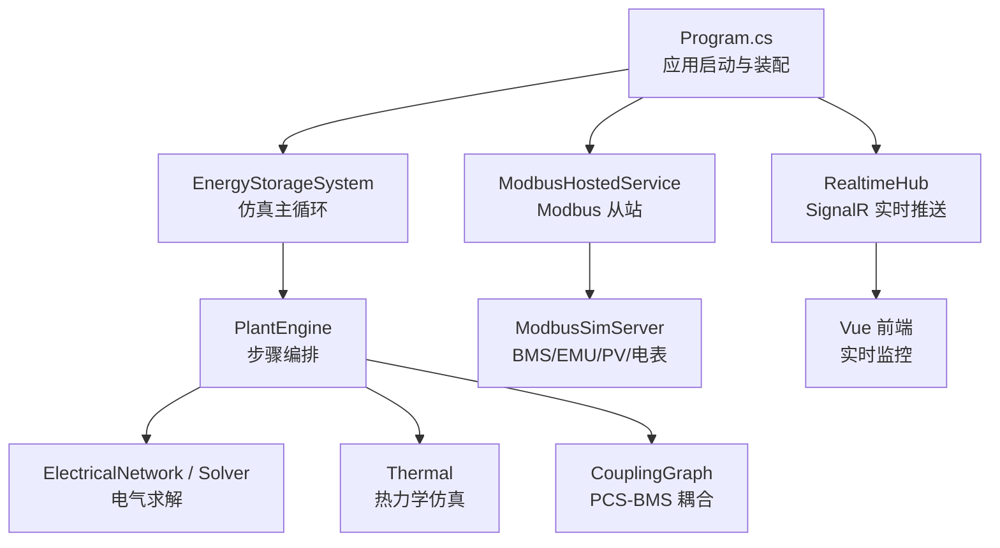
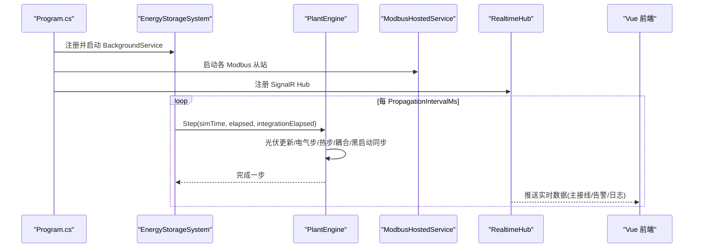
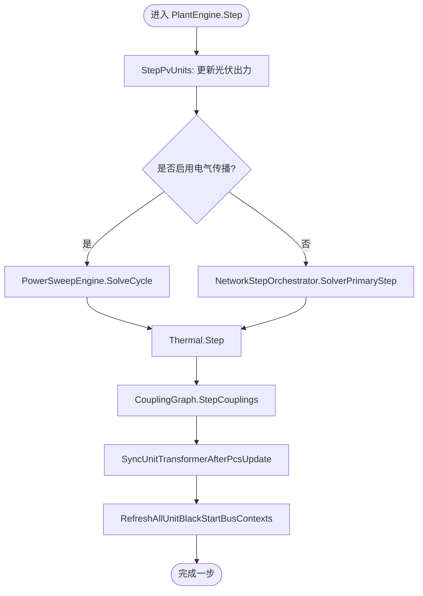
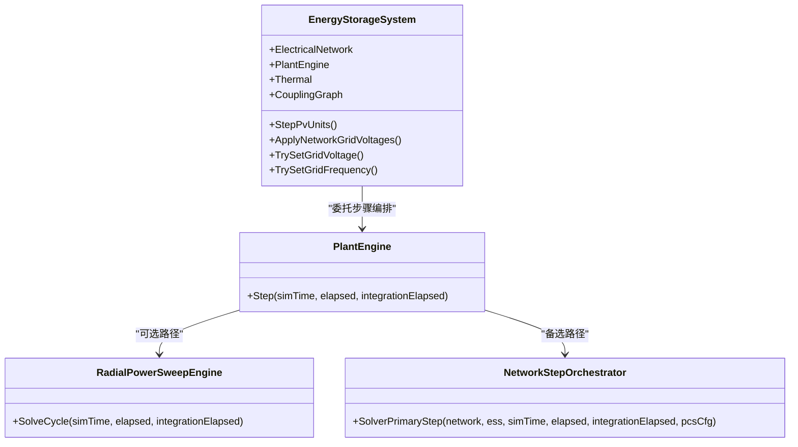
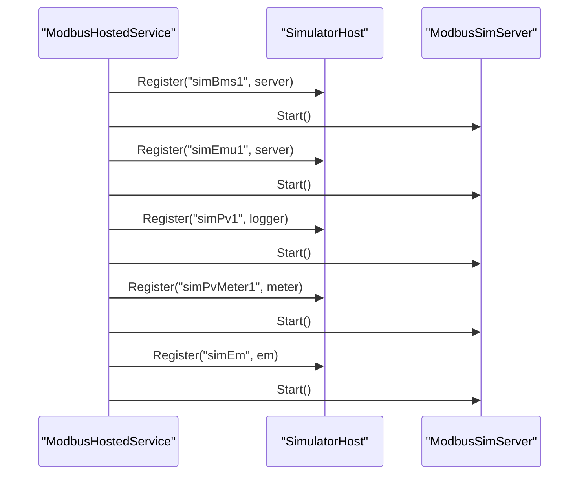
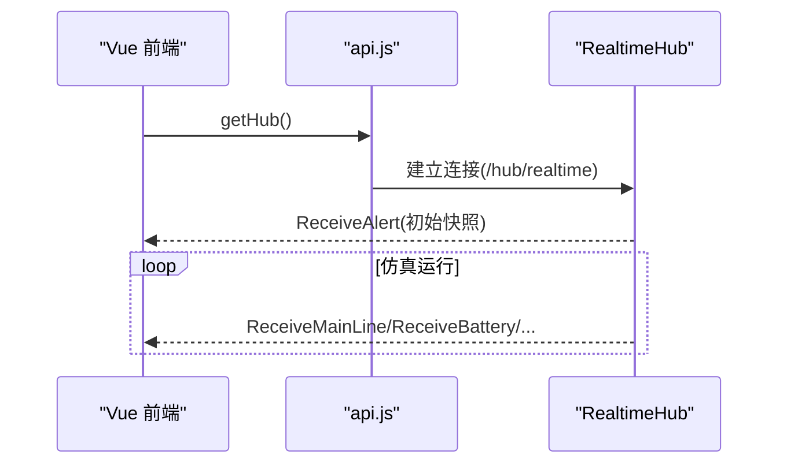
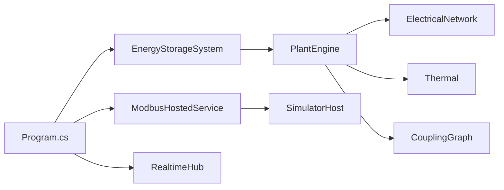

# 项目概述

<cite>
**本文引用的文件**
- [Program.cs](file://Program.cs)
- [EssSimulator.csproj](file://EssSimulator.csproj)
- [appsettings.json](file://appsettings.json)
- [Core/SimulatorHost.cs](file://Core/SimulatorHost.cs)
- [EssDeviceSimModel/EnergyStorageSys.cs](file://EssDeviceSimModel/EnergyStorageSys.cs)
- [EssDeviceSimModel/PlantEngine.cs](file://EssDeviceSimModel/PlantEngine.cs)
- [Protocol/ModbusHostedService.cs](file://Protocol/ModbusHostedService.cs)
- [Web/RealtimeHub.cs](file://Web/RealtimeHub.cs)
- [Configuration/SimulatorConfig.cs](file://Configuration/SimulatorConfig.cs)
- [Web/src/main.js](file://Web/src/main.js)
- [Web/src/services/api.js](file://Web/src/services/api.js)
</cite>

## 目录
1. [简介](#简介)
2. [项目结构](#项目结构)
3. [核心组件](#核心组件)
4. [架构总览](#架构总览)
5. [详细组件分析](#详细组件分析)
6. [依赖关系分析](#依赖关系分析)
7. [性能考量](#性能考量)
8. [故障排查指南](#故障排查指南)
9. [结论](#结论)
10. [附录：快速开始](#附录快速开始)

## 简介
EssSimulator 是一个基于 .NET 8 与 Vue.js 的全栈储能系统仿真平台，面向 BMS、PCS、变压器、负载、光伏等设备的复杂交互仿真。系统提供电气网络求解、热力学仿真、光伏系统模拟、Modbus 协议通信以及实时 Web 监控能力，支持通过配置文件灵活编排多单元储能与光伏工程，并通过 SignalR 将仿真状态实时推送到前端界面。

该文档为初学者提供概念性概览，同时为有经验的开发者给出关键实现路径与扩展点说明。

## 项目结构
仓库采用分层与按功能域组织的方式：
- 配置与启动：Program.cs 负责应用启动、配置加载、服务注册、中间件与端点挂载；appsettings.json 定义运行时参数、设备拓扑、协议端口等。
- 仿真内核：EssDeviceSimModel 包含储能系统模型、电气网络、热力学、设备（BMS/PCS/变压器/负载/光伏）与耦合逻辑。
- 数据交换与协议：DataExchange 提供遥测与控制管道；Protocol 提供 Modbus TCP 从站服务；LocalControl 提供本地控制聚合。
- Web 层：Web 提供 ASP.NET Core API、SignalR Hub、静态前端托管；Vue 前端位于 Web/src。
- 工具与脚本：scripts、configs、pointmaps 等用于发布、测试与点表管理。

图表来源
- [Program.cs:258-522](file://Program.cs#L258-L522)
- [EssDeviceSimModel/EnergyStorageSys.cs:124-245](file://EssDeviceSimModel/EnergyStorageSys.cs#L124-L245)
- [EssDeviceSimModel/PlantEngine.cs:22-48](file://EssDeviceSimModel/PlantEngine.cs#L22-L48)
- [Protocol/ModbusHostedService.cs:32-106](file://Protocol/ModbusHostedService.cs#L32-L106)
- [Web/RealtimeHub.cs:10-21](file://Web/RealtimeHub.cs#L10-L21)

章节来源
- [Program.cs:25-560](file://Program.cs#L25-L560)
- [EssSimulator.csproj:1-88](file://EssSimulator.csproj#L1-L88)
- [appsettings.json:1-472](file://appsettings.json#L1-L472)

## 核心组件
- 应用宿主与装配：Program.cs 使用 Microsoft.Extensions.Hosting 构建 Web 应用，注册仿真核心、协议服务、Web 服务与中间件，并处理授权校验、CORS、SignalR、静态资源与路由回退。
- 仿真主机：EnergyStorageSystem 作为 BackgroundService 驱动仿真主循环，集成 PlantEngine、电气网络、热系统与耦合图，暴露断路器、负载、电网电压/频率、黑启动等控制接口。
- 步骤编排：PlantEngine 统一推进光伏更新、电气步、热步、耦合边同步与黑启动上下文刷新。
- 协议通信：ModbusHostedService 动态创建并启动多个 Modbus TCP 从站（BMS、EMU、光伏 Logger/电表、并网电表），通过 SimulatorHost 全局注册供其他模块访问。
- 实时 Web：RealtimeHub 提供 SignalR 通道，前端订阅主接线、电池、单体、连接、日志、告警与命令进度等频道。

章节来源
- [Program.cs:258-522](file://Program.cs#L258-L522)
- [EssDeviceSimModel/EnergyStorageSys.cs:24-245](file://EssDeviceSimModel/EnergyStorageSys.cs#L24-L245)
- [EssDeviceSimModel/PlantEngine.cs:6-48](file://EssDeviceSimModel/PlantEngine.cs#L6-L48)
- [Protocol/ModbusHostedService.cs:13-106](file://Protocol/ModbusHostedService.cs#L13-L106)
- [Web/RealtimeHub.cs:6-21](file://Web/RealtimeHub.cs#L6-L21)

## 架构总览
EssSimulator 采用“后端仿真 + 协议桥接 + 实时 Web”的分层架构：
- 后端仿真层：以 EnergyStorageSystem 为核心，PlantEngine 协调电气、热与耦合计算，支持事件驱动的径向潮流或传统 Solver 主路径。
- 协议桥接层：通过 Modbus TCP 暴露 BMS、PCS(EMU)、光伏 Logger/电表、并网电表的寄存器映射，便于 EMS/监控系统接入。
- 实时 Web 层：ASP.NET Core 提供 REST API 与 SignalR Hub，Vue 前端展示主接线、拓扑、电池、单体、告警与日志等。

图表来源
- [Program.cs:408-456](file://Program.cs#L408-L456)
- [EssDeviceSimModel/EnergyStorageSys.cs:473-496](file://EssDeviceSimModel/EnergyStorageSys.cs#L473-L496)
- [EssDeviceSimModel/PlantEngine.cs:22-48](file://EssDeviceSimModel/PlantEngine.cs#L22-L48)
- [Protocol/ModbusHostedService.cs:32-106](file://Protocol/ModbusHostedService.cs#L32-L106)
- [Web/RealtimeHub.cs:10-21](file://Web/RealtimeHub.cs#L10-L21)

## 详细组件分析

### 仿真主循环与步骤编排
- EnergyStorageSystem 在 ExecuteAsync 中周期性推进时钟并调用 PlantEngine.Step，内部根据配置选择事件驱动的前推回代引擎或 Solver 主路径。
- PlantEngine 统一执行：光伏更新 → 电气步 → 热步 → 耦合边 → 单元变同步 → 黑启动上下文刷新 → BMS 链路同步。

图表来源
- [EssDeviceSimModel/PlantEngine.cs:22-48](file://EssDeviceSimModel/PlantEngine.cs#L22-L48)
- [EssDeviceSimModel/EnergyStorageSys.cs:256-277](file://EssDeviceSimModel/EnergyStorageSys.cs#L256-L277)
- [EssDeviceSimModel/EnergyStorageSys.cs:473-496](file://EssDeviceSimModel/EnergyStorageSys.cs#L473-L496)

章节来源
- [EssDeviceSimModel/EnergyStorageSys.cs:124-245](file://EssDeviceSimModel/EnergyStorageSys.cs#L124-L245)
- [EssDeviceSimModel/PlantEngine.cs:6-48](file://EssDeviceSimModel/PlantEngine.cs#L6-L48)

### 电气网络与求解
- 电气网络由 NetworkTopologyBuilder 构建，支持两种主路径：
  - 事件驱动前推回代：RadialPowerSweepEngine，适用于高并发与快速收敛场景。
  - Solver 主路径：NetworkStepOrchestrator，传统步进方式。
- PCC、主变、单元变、负载、PCS 与 BMS 通过 ElectricalNetwork 与信号路由器进行耦合。

图表来源
- [EssDeviceSimModel/EnergyStorageSys.cs:215-245](file://EssDeviceSimModel/EnergyStorageSys.cs#L215-L245)
- [EssDeviceSimModel/PlantEngine.cs:33-48](file://EssDeviceSimModel/PlantEngine.cs#L33-L48)

章节来源
- [EssDeviceSimModel/EnergyStorageSys.cs:215-245](file://EssDeviceSimModel/EnergyStorageSys.cs#L215-L245)
- [EssDeviceSimModel/PlantEngine.cs:33-48](file://EssDeviceSimModel/PlantEngine.cs#L33-L48)

### 热力学仿真
- 热系统包含气候模型与 BMS 柜体集总热网络，支持空调制冷、温度探针偏置、高温降额与 Arrhenius 日历老化。
- 热步在 PlantEngine 中统一调度，并与 PCS↔BMS 耦合边联动，影响功率限幅与寿命评估。

章节来源
- [Configuration/SimulatorConfig.cs:38-135](file://Configuration/SimulatorConfig.cs#L38-L135)
- [EssDeviceSimModel/EnergyStorageSys.cs:242-245](file://EssDeviceSimModel/EnergyStorageSys.cs#L242-L245)
- [EssDeviceSimModel/PlantEngine.cs:22-48](file://EssDeviceSimModel/PlantEngine.cs#L22-L48)

### 光伏系统模拟
- 光伏单元通过 PvUnitDevice 从运行时配置创建，支持方阵温度、入射角、MPPT 最大功率计算与 35kV 母线贡献。
- 每步先更新光伏环境状态，再参与电气网络求解。

章节来源
- [EssDeviceSimModel/EnergyStorageSys.cs:247-274](file://EssDeviceSimModel/EnergyStorageSys.cs#L247-L274)
- [appsettings.json:173-470](file://appsettings.json#L173-L470)

### Modbus 协议通信
- ModbusHostedService 根据配置动态创建并启动多个 Modbus TCP 从站：
  - BMS：每个储能通道一个
  - EMU（PCS 模拟）：每个储能单元一个
  - 光伏 Logger/电表：每个光伏单元两个
  - 并网电表：固定端口
- 所有从站通过 SimulatorHost 全局注册，便于其他模块查询与访问。

图表来源
- [Protocol/ModbusHostedService.cs:32-106](file://Protocol/ModbusHostedService.cs#L32-L106)
- [Core/SimulatorHost.cs:12-25](file://Core/SimulatorHost.cs#L12-L25)

章节来源
- [Protocol/ModbusHostedService.cs:13-106](file://Protocol/ModbusHostedService.cs#L13-L106)
- [Core/SimulatorHost.cs:5-25](file://Core/SimulatorHost.cs#L5-L25)

### 实时 Web 监控
- RealtimeHub 提供 SignalR 通道，前端通过 api.js 中的 getHub 建立连接，订阅 ReceiveMainLine、ReceiveBattery、ReceiveCells、ReceiveConnections、ReceiveLog、ReceiveAlert 等方法。
- Program.cs 将致命系统告警通过 SignalR 推送至前端，支持分组频道以减少无关流量。

图表来源
- [Web/src/services/api.js:71-85](file://Web/src/services/api.js#L71-L85)
- [Web/RealtimeHub.cs:10-21](file://Web/RealtimeHub.cs#L10-L21)
- [Program.cs:466-481](file://Program.cs#L466-L481)

章节来源
- [Web/src/main.js:1-24](file://Web/src/main.js#L1-L24)
- [Web/src/services/api.js:71-85](file://Web/src/services/api.js#L71-L85)
- [Web/RealtimeHub.cs:6-21](file://Web/RealtimeHub.cs#L6-L21)

## 依赖关系分析
- 启动依赖：Program.cs 依赖 Configuration、Core、DataExchange、Display、EssDeviceSimModel、EssSimModelApi、Licensing、LocalControl、Web、Web.Topology。
- 仿真依赖：EnergyStorageSystem 依赖 PlantEngine、ElectricalNetwork、Thermal、CouplingGraph。
- 协议依赖：ModbusHostedService 依赖 SimulatorConfig、DataExchangeOptions、SimulatorHost。
- Web 依赖：RealtimeHub 依赖 Display.FatalSystemAlert 与 SignalR。

图表来源
- [Program.cs:258-522](file://Program.cs#L258-L522)
- [EssDeviceSimModel/EnergyStorageSys.cs:124-245](file://EssDeviceSimModel/EnergyStorageSys.cs#L124-L245)
- [Protocol/ModbusHostedService.cs:32-106](file://Protocol/ModbusHostedService.cs#L32-L106)

章节来源
- [Program.cs:258-522](file://Program.cs#L258-L522)
- [EssDeviceSimModel/EnergyStorageSys.cs:124-245](file://EssDeviceSimModel/EnergyStorageSys.cs#L124-L245)
- [Protocol/ModbusHostedService.cs:32-106](file://Protocol/ModbusHostedService.cs#L32-L106)

## 性能考量
- 仿真步长与传播周期：PropagationIntervalMs 控制主循环间隔，IntegrationStepMultiplier 放大积分量 dt，影响 SOC/电能等累积精度与速度。
- 电气求解路径：UseElectricalPropagation 开启事件驱动前推回代可提升收敛速度与稳定性；QuvMaxIterations 与 VoltageTolerancePu 控制迭代次数与收敛阈值。
- 热系统开销：热网络与空调控制会增加每步计算量，可根据需要关闭或调整热参数。
- 协议并发：Modbus 从站数量与轮询间隔影响 CPU 与网络占用，建议合理设置 EmuTelemetryIntervalMs 与 TelemetryIntervalMs。

章节来源
- [Configuration/SimulatorConfig.cs:6-35](file://Configuration/SimulatorConfig.cs#L6-L35)
- [appsettings.json:3-51](file://appsettings.json#L3-L51)
- [appsettings.json:92-97](file://appsettings.json#L92-L97)

## 故障排查指南
- 授权失败：若非社区版且未提供 license.txt，程序会输出机器码与获取授权指引，需将 license.txt 放置于运行目录后重启。
- Modbus 设备不可用：检查点表 CSV 是否可用，确认端口分配无冲突；查看日志提示“点表 CSV 可用”。
- 初始化等待超时：Web 服务仍会启动，但 dpc 初始读取可能异常，稍后重试或检查模拟器就绪条件。
- 实时推送异常：确认 CORS 配置允许前端来源，SignalR 连接成功；检查 FatalSystemAlert 事件是否触发。

章节来源
- [Program.cs:141-178](file://Program.cs#L141-L178)
- [Protocol/ModbusHostedService.cs:98-103](file://Protocol/ModbusHostedService.cs#L98-L103)
- [Program.cs:112-139](file://Program.cs#L112-L139)
- [Program.cs:466-481](file://Program.cs#L466-L481)

## 结论
EssSimulator 提供了完整的储能系统仿真能力，涵盖电气网络求解、热力学仿真、光伏模拟与 Modbus 协议通信，并通过实时 Web 监控提供直观的操作与诊断界面。其模块化设计与可配置化特性使得用户能够灵活搭建不同规模的储能与光伏工程，满足研发、测试与培训等多场景需求。

## 附录：快速开始
- 环境要求
  - .NET 8 SDK 或运行时
  - Node.js（用于前端开发，生产模式由 ASP.NET Core 托管静态文件）
- 安装步骤
  - 克隆仓库并恢复 NuGet 包
  - 准备 appsettings.json 与必要点表 CSV（bms_bank.csv、emu.csv、em.csv、lc.csv、pv_logger.csv、pv_apm810.csv）
  - 如需商业/定制版，准备 license.txt 并放置于运行目录
- 基本使用示例
  - 启动应用：dotnet run
  - 访问 Web：浏览器打开 http://localhost:5050（默认端口可在 appsettings.json 的 Web.HttpPort 修改）
  - 连接 Modbus：使用任意 Modbus 客户端连接配置的端口（如 BMS 1501+、EMU 1601+、光伏 Logger 1801+、电表 1500）
  - 实时观察：前端页面通过 SignalR 接收主接线、电池、单体、连接、日志与告警推送

章节来源
- [EssSimulator.csproj:1-88](file://EssSimulator.csproj#L1-L88)
- [appsettings.json:53-90](file://appsettings.json#L53-L90)
- [Program.cs:380-396](file://Program.cs#L380-L396)
- [Program.cs:515-522](file://Program.cs#L515-L522)